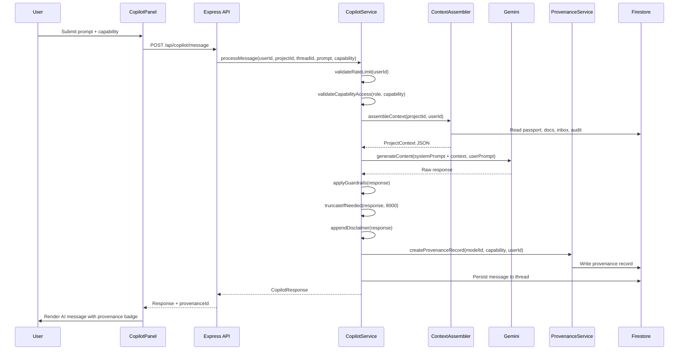
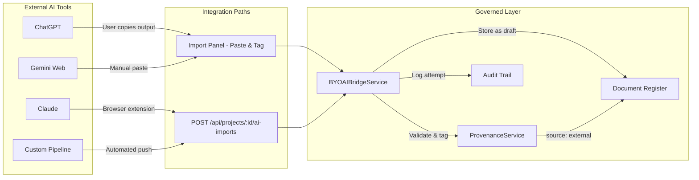
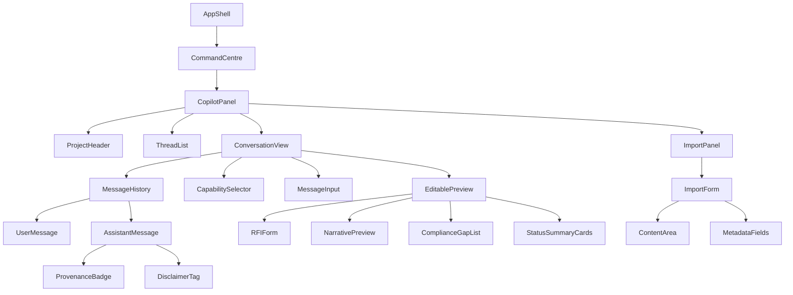

# Design Document: AI Copilot Workspace

## Overview

The AI Copilot Workspace introduces a role-aware, project-context-aware conversational AI assistant panel within the Architex OS Command Centre. It leverages the existing multi-agent infrastructure (Gemini integration, agent orchestration) to provide structured AI capabilities scoped to each user's professional role and active project. All AI-generated content is tagged with immutable provenance metadata for SANS 17024 liability compliance.

The system comprises three service layers:
- **CopilotService** — orchestrates AI inference, capability scoping, conversation management, and project context assembly
- **ProvenanceService** — creates, attaches, and queries immutable provenance records for all AI outputs
- **BYOAIBridgeService** — handles structured import of externally-generated AI content with provenance tagging

The Copilot Panel renders inside the AppShell 3-column grid as a Command Centre tool, following the standard workspace template pattern (Hero → Content panels). It integrates with the Platform Spine (Project Passport, SpecForge, Action Centre, Audit Trail) via explicit user confirmation gates.

## Architecture

### High-Level Component Diagram

```mermaid
graph TB
    subgraph "Frontend (React 19)"
        CP[CopilotPanel]
        TL[ThreadList]
        MI[MessageInput]
        MH[MessageHistory]
        CS[CapabilitySelector]
        IP[ImportPanel]
        EP[EditablePreview]
    end

    subgraph "API Layer (Express 5)"
        CR[/api/copilot/*]
        PR[/api/provenance/*]
        BR[/api/projects/:id/ai-imports]
    end

    subgraph "Service Layer"
        COS[CopilotService]
        PRS[ProvenanceService]
        BYS[BYOAIBridgeService]
        CTX[ContextAssembler]
        RL[RateLimiter]
        GR[GuardrailFilter]
    end

    subgraph "Infrastructure"
        GM[Google Gemini @google/genai]
        FS[(Firestore)]
        AT[AuditTrailService]
        PP[ProjectPassportService]
        ERS[EventRoutingService]
    end

    CP --> CR
    IP --> BR
    CR --> COS
    PR --> PRS
    BR --> BYS
    COS --> CTX
    COS --> RL
    COS --> GR
    COS --> GM
    COS --> PRS
    BYS --> PRS
    COS --> FS
    PRS --> FS
    BYS --> FS
    COS --> AT
    COS --> PP
    COS --> ERS
```

### Data Flow



### External Workflow Integration (BYOAI)



The BYOAI layer treats the internal Copilot and external tools as equals from a governance perspective — both produce `AI_Output` that must be provenance-tagged before entering the project spine. The difference is only the `source` field (`internal` vs `external`) on the provenance record.

## Components and Interfaces

### Service Layer

#### CopilotService (`src/services/copilotService.ts`)

Orchestrates all Copilot interactions. Responsibilities:
- Capability-to-role mapping and access control
- Project context assembly and caching
- AI inference calls via Gemini
- Response guardrails and safety filtering
- Conversation thread CRUD
- Rate limiting (60 req/user/hour)
- Spine write-back operations (RFI, compliance gaps, status summaries)

#### ProvenanceService (`src/services/provenanceService.ts`)

Manages immutable AI output provenance records. Responsibilities:
- Create provenance records for internal Copilot outputs
- Create provenance records for BYOAI imports (source: 'external')
- Attach provenance records to project records
- Block project record insertion if provenance creation fails
- Support override/attestation records for professional review
- Paginated query of all provenance records per project

#### BYOAIBridgeService (`src/services/byoaiBridgeService.ts`)

Handles import of externally-generated AI content. The BYOAI Bridge acknowledges that professionals use diverse AI tools (ChatGPT, Claude, Gemini web, Copilot in VS Code, custom firm pipelines) for their work. Rather than forcing all AI interaction through the internal Copilot, BYOAI provides a governed ingestion layer that applies the same provenance and compliance guarantees to externally-generated content.

**Two integration paths:**
1. **API-first** (`POST /api/projects/{projectId}/ai-imports`) — for automated pipelines, browser extensions, or tool integrations that push content programmatically into Architex
2. **UI paste-and-tag** (Import Panel) — for manual import when a professional has generated content externally and wants to bring it into the governed project context

**Lifecycle of an external import:**
1. Content arrives (via API or UI) with declared model, content type, and optional metadata (prompt, tool URL)
2. BYOAIBridgeService validates the payload and the user's project write access
3. ProvenanceService creates an immutable provenance record with `source: 'external'`
4. Content is stored as a draft document in the project's document register with `ai_imported: true`
5. The document remains in `draft` status until the user explicitly confirms placement (into a section, category, or register)
6. All attempts (success/failure) are logged to the audit trail

**Key design principle:** External AI content is tracked identically to internal Copilot outputs — same provenance metadata, same audit trail, same visibility in compliance reviews. The governance layer doesn't care where the AI content originated; it ensures everything entering the project spine is traceable.

Responsibilities:
- Validate import payloads (content, model name, content type, timestamp)
- Create provenance records with source: 'external'
- Store imported content as draft documents in document register
- Log all import attempts (success/failure) to audit trail
- Enforce project write access
- Support webhook/callback URL for external tool integrations (future extension)

#### ContextAssembler (`src/services/copilotContextAssembler.ts`)

Assembles project context for AI system prompts. Responsibilities:
- Read Project Passport (phase, team, dates, risk)
- Filter document register (draft/pending_review/issued)
- Read user's pending inbox actions
- Read 20 most recent audit trail entries
- Enforce permission-scoped data access
- Handle partial context (source unavailability)
- Token budget management with priority-based truncation
- Cache invalidation on project state changes

### UI Component Hierarchy



#### CopilotPanel (root component)

```typescript
interface CopilotPanelProps {
  user: UserProfile;
  projectId?: string;
}
```

Renders inside AppShell content area. Manages:
- Active thread selection
- Project context display
- Capability-scoped interactions
- BYOAI import access

#### ConversationView

Displays message history with:
- Scrollable message area (50 messages visible, older loadable on demand)
- Visual distinction between user and assistant messages
- Provenance badges on AI responses
- Capability selector dropdown
- Text input with retry on error

#### EditablePreview

Inline editable view for structured outputs (RFI drafts, narratives, compliance reports). Allows field-level editing before finalisation with spine write-back.

### API Endpoints

| Method | Path | Description |
|--------|------|-------------|
| POST | `/api/copilot/message` | Send message to Copilot, receive AI response |
| GET | `/api/copilot/threads?projectId=X` | List user's threads for a project |
| POST | `/api/copilot/threads` | Create new conversation thread |
| GET | `/api/copilot/threads/:threadId/messages` | Get messages (paginated) |
| PATCH | `/api/copilot/threads/:threadId` | Update thread (title, archive status) |
| POST | `/api/copilot/threads/:threadId/finalise` | Finalise structured output → spine write |
| GET | `/api/provenance/project/:projectId` | Query provenance records (paginated) |
| POST | `/api/provenance/override` | Create professional attestation override |
| POST | `/api/projects/:projectId/ai-imports` | BYOAI content import |
| GET | `/api/copilot/capabilities` | Get capabilities for current user's role |

## Data Models

### Core Types

```typescript
// ─── Capability System ─────────────────────────────────────────────────────

export type CopilotCapability =
  | 'draft_rfi'
  | 'summarise_status'
  | 'flag_compliance'
  | 'generate_narrative'
  | 'explain_clause'
  | 'draft_site_instruction'
  | 'summarise_financials'
  | 'flag_risk';

export type CopilotSource = 'internal' | 'external';

export type BYOAIContentType =
  | 'rfi_draft'
  | 'narrative'
  | 'specification'
  | 'analysis'
  | 'general';

export type ComplianceGapCategory =
  | 'missing_submission'
  | 'expired_certification'
  | 'phase_prerequisite'
  | 'regulatory_flag';

export type ComplianceGapSeverity = 'critical' | 'warning' | 'informational';

export type NarrativeType =
  | 'approach_statement'
  | 'methodology'
  | 'team_capability'
  | 'project_understanding'
  | 'fee_justification';

export type NarrativeTone = 'formal' | 'conversational' | 'technical';

export type NarrativeAudience = 'client' | 'adjudicator' | 'committee';

export type ContractType = 'JBCC' | 'NEC' | 'FIDIC' | 'GCC';

export type RFIUrgency = 'low' | 'medium' | 'high' | 'critical';

// ─── Capability-Role Mapping ───────────────────────────────────────────────

export const CAPABILITY_ROLE_MAP: Record<CopilotCapability, UserRole[]> = {
  summarise_status: [], // universal — all professional roles
  flag_risk: [],        // universal — all professional roles
  explain_clause: [],   // universal — all professional roles
  draft_rfi: ['architect', 'bep', 'engineer', 'site_manager', 'contractor', 'quantity_surveyor'],
  draft_site_instruction: ['architect', 'bep', 'engineer', 'site_manager', 'contractor', 'quantity_surveyor'],
  flag_compliance: ['architect', 'bep', 'engineer', 'energy_professional', 'fire_engineer', 'town_planner'],
  generate_narrative: ['architect', 'bep', 'engineer', 'quantity_surveyor', 'town_planner'],
  summarise_financials: ['architect', 'bep', 'quantity_surveyor', 'contractor', 'client', 'firm_admin'],
};

// Empty array = universal (all Professional_Roles except platform_admin-only users)
export const UNIVERSAL_CAPABILITIES: CopilotCapability[] = [
  'summarise_status',
  'flag_risk',
  'explain_clause',
];
```

### Conversation Thread & Messages

```typescript
export interface ConversationThread {
  id: string;
  projectId: string;
  ownerUid: string;
  title: string;               // max 100 chars
  status: 'active' | 'archived';
  messageCount: number;
  lastMessageAt: string;       // ISO 8601 UTC
  createdAt: string;           // ISO 8601 UTC
  updatedAt: string;           // ISO 8601 UTC
}

// Firestore: projects/{projectId}/copilot_threads/{threadId}

export interface CopilotMessage {
  id: string;
  threadId: string;
  role: 'user' | 'assistant';
  content: string;             // max 10,000 chars
  timestamp: string;           // ISO 8601 UTC
  capability: CopilotCapability | null;
  provenanceId: string | null; // only for assistant messages
  truncated: boolean;          // true if response was cut at 8000 chars
}

// Firestore: projects/{projectId}/copilot_threads/{threadId}/messages/{messageId}
```

### Provenance Records

```typescript
export interface ProvenanceRecord {
  id: string;
  projectId: string;
  threadId: string;
  messageId: string;
  modelId: string;              // max 128 chars (e.g. "gemini-1.5-pro")
  generatedAt: string;          // ISO 8601 UTC
  acceptedBy: string;           // UID of accepting user
  acceptedAt: string;           // ISO 8601 UTC
  source: CopilotSource;        // 'internal' | 'external'
  capability: CopilotCapability | null;
  confidence: number | null;    // 0.00–1.00 or null
  targetRecordId: string | null; // populated when attached to project record
  targetRecordType: string | null;
}

// Firestore: projects/{projectId}/ai_provenance/{recordId}
// IMMUTABLE — no updates or deletes permitted

export interface ProvenanceOverride {
  id: string;
  provenanceRecordId: string;
  attestedBy: string;           // UID
  attestedRole: UserRole;       // Professional_Role of attester
  declaration: string;          // min 20 chars describing review performed
  attestedAt: string;           // ISO 8601 UTC
}

// Firestore: projects/{projectId}/ai_provenance/{recordId}/overrides/{overrideId}
```

### Project Context (System Prompt Payload)

```typescript
export interface CopilotProjectContext {
  passport: {
    projectName: string;
    currentPhase: ProjectPhase;
    riskLevel: Priority;
    leadProfessional: string;
    keyDates: Array<{ label: string; date: string }>;
    teamMembers: Array<{ name: string; role: string }>;
  };
  documentRegister: Array<{
    id: string;
    title: string;
    status: RecordStatus;
    type: string;
    updatedAt: string;
  }>;
  pendingActions: Array<{
    id: string;
    title: string;
    priority: Priority;
    dueDate: string | null;
    type: string;
  }>;
  auditTrail: Array<{
    action: string;
    actor: string;
    timestamp: string;
    detail: string;
  }>;
  userContext: {
    role: UserRole;
    projectAccessRole: ProjectAccessRole | null;
    displayName: string;
  };
  unavailableSources: string[]; // e.g. ['auditTrail'] if source timed out
}
```

### BYOAI Import

```typescript
export interface BYOAIImportRequest {
  content: string;               // 1–50,000 chars (opaque payload)
  externalModelName: string;     // 1–100 chars
  generationTimestamp?: string;  // ISO 8601, defaults to server time
  contentType: BYOAIContentType;
  metadata?: {
    prompt?: string;             // max 5,000 chars
    externalToolUrl?: string;    // valid URL
  };
}

export interface BYOAIImportResponse {
  documentId: string;
  provenanceRecordId: string;
  status: 'imported';
}
```

### RFI Draft

```typescript
export interface RFIDraftInput {
  subject: string;               // 1–200 chars
  description: string;           // 1–2000 chars
  drawingReferences?: string[];  // max 20 items
  urgency?: RFIUrgency;         // defaults to 'medium'
}

export interface RFIDraftOutput {
  rfiNumber: number;
  addressedTo: string | null;
  subject: string;
  questionBody: string;          // min 50 chars
  references: string[];
  suggestedDeadline: string;     // ISO 8601 date
  provenanceId: string;
}
```

### Compliance Gap Report

```typescript
export interface ComplianceGap {
  id: string;
  category: ComplianceGapCategory;
  severity: ComplianceGapSeverity;
  title: string;
  detail: string;
  sansReference: string | null;   // e.g. "SANS 10400-K"
  suggestedRemediation: string;
  resolved: boolean;
  detectedAt: string;
}

export interface ComplianceGapReport {
  gaps: ComplianceGap[];          // max 50 items, sorted severity desc
  advisoryMessage: string | null; // present if no data available
  provenanceId: string;
}
```

### Narrative Generation

```typescript
export interface NarrativeInput {
  narrativeType: NarrativeType;
  targetAudience: NarrativeAudience;
  tone: NarrativeTone;
}

export interface NarrativeOutput {
  content: string;                // 200–800 words, 2–6 paragraphs
  wordCount: number;
  paragraphCount: number;
  readabilityGrade: number;       // Flesch-Kincaid grade level
  provenanceId: string;
}
```

### Clause Explanation

```typescript
export interface ClauseExplanationInput {
  clauseText: string;             // 1–2000 chars
  contractType?: ContractType;
}

export interface ClauseExplanationOutput {
  explanation: string;            // 150–600 words
  disclaimer: string;             // always appended
  contextualised: boolean;        // true if project contract was referenced
  provenanceId: string;
}
```

### Rate Limiting

```typescript
export interface RateLimitState {
  userId: string;
  windowStart: string;            // ISO 8601 UTC
  requestCount: number;
  maxRequests: 60;
  windowDurationMinutes: 60;
}
```

### Copilot Response Envelope

```typescript
export interface CopilotResponse {
  message: CopilotMessage;
  provenanceId: string;
  structuredOutput?: RFIDraftOutput | ComplianceGapReport | NarrativeOutput | ClauseExplanationOutput | StatusSummary;
  error?: {
    code: 'rate_limited' | 'capability_denied' | 'validation_error' | 'service_unavailable' | 'content_policy';
    message: string;
    retryAfterMinutes?: number;
  };
}

export interface StatusSummary {
  overview: string;
  risks: string;
  upcoming: string;
  blockers: string;
  provenanceId: string;
  unchangedSinceLastSummary: boolean;
}
```

## Integration Points with Existing Services

### Existing Service Dependencies

| Service | Integration Purpose |
|---------|-------------------|
| `geminiService.ts` | AI inference via `callGeminiProxy()` — Copilot wraps this with context injection |
| `projectPassportService.ts` | Read Project Passport for context assembly |
| `lifecycleEngine.ts` | Read lifecycle evaluation, phase blockers, next actions |
| `riskEngine.ts` | Read risk evaluations for compliance gap and status capabilities |
| `documentRegisterService.ts` | Read document register, create draft documents for BYOAI imports |
| `auditTrailService.ts` | Write audit records for all spine-affecting actions |
| `eventRoutingService.ts` | Create WorkflowEvents for compliance gaps → Action Centre |
| `inboxEventAdapter.ts` | Generate inbox actions for RFI addressees |
| `agentIdentityService.ts` | Register Copilot as a named agent identity |
| `readinessCheckService.ts` | Read compliance readiness results for gap analysis |
| `permissionService` | Enforce data access scoping in context assembly |

### Firestore Paths

| Collection | Purpose |
|------------|---------|
| `projects/{projectId}/copilot_threads/{threadId}` | Conversation thread metadata |
| `projects/{projectId}/copilot_threads/{threadId}/messages/{messageId}` | Individual messages |
| `projects/{projectId}/ai_provenance/{recordId}` | Provenance records (immutable) |
| `projects/{projectId}/ai_provenance/{recordId}/overrides/{overrideId}` | Professional attestations |
| `projects/{projectId}/rfis/{rfiId}` | RFI register (existing — Copilot writes here on finalise) |
| `projects/{projectId}/documents/{docId}` | Document register (BYOAI imports stored as drafts) |

### Platform Spine Write-Back

All spine writes require explicit user confirmation (finalise/accept action):

1. **RFI Finalise** → writes to RFI register + creates inbox action (type: `document_request`)
2. **Compliance Gap Accept** → creates WorkflowEvent per gap (type: `risk_detected`) → surfaces in Action Centre
3. **Status Summary Export** → creates ProjectRecord (recordType: `ai_status_summary`)
4. **Narrative Accept** → creates draft document in proposal section + copy-to-clipboard
5. **BYOAI Import** → creates draft document with `ai_imported: true` flag

### Security Considerations

**Authentication & Authorization:**
- All API endpoints require Firebase Auth token validation
- Project-scoped operations validate user's project membership via Permission_Service
- Capability access is checked against the user's `UserProfile.role` field
- Thread access is owner-scoped (only `ownerUid` can read) unless user has `project:manage_members`

**Data Protection:**
- Project_Context assembly respects existing project-level access controls
- Context is injected into AI system prompt (not visible to user in conversation)
- AI responses are filtered through guardrails before delivery
- Provenance records are immutable — no update/delete operations exposed

**Rate Limiting & Abuse Prevention:**
- 60 requests per user per hour (sliding window)
- Prompt validation: 3–4000 characters, non-whitespace-only
- Response truncation at 8000 characters
- Content safety filter on AI responses (profanity, PII, discriminatory language)

**Compliance:**
- SANS 17024 liability: all AI outputs carry provenance metadata
- Copyrighted contract text: max 15 consecutive words reproduced
- Advisory language enforced in compliance outputs
- Disclaimer appended to all responses: "AI-generated content. Review before professional use."
- No legally binding statements generated

**API Security:**
- BYOAI endpoint validates project write access before any data persistence
- Import payloads validated (content length, model name, content type, timestamp)
- Future timestamps (>5min ahead) rejected
- All import attempts logged to audit trail regardless of outcome

## Correctness Properties

*A property is a characteristic or behavior that should hold true across all valid executions of a system — essentially, a formal statement about what the system should do. Properties serve as the bridge between human-readable specifications and machine-verifiable correctness guarantees.*

### Property 1: Capability Access Control

*For any* user with a Professional_Role, the set of granted capabilities must equal the union of universal capabilities (`summarise_status`, `flag_risk`, `explain_clause`) and any role-specific capabilities defined in CAPABILITY_ROLE_MAP for that role. *For any* user with only `platform_admin` (no Professional_Role), all capability requests must be denied. *For any* capability string not in the defined set of 8 capabilities, the request must be denied with an "unrecognized" message. *For any* denied request, the error message must not reveal which roles do have access.

**Validates: Requirements 1.3, 2.3, 2.4, 2.10**

### Property 2: No-Project Capability Restriction

*For any* user session without an active project, the available capabilities must be restricted to non-project-scoped capabilities only (explain_clause, general compliance questions). Project-scoped capabilities (draft_rfi, summarise_status with project data, flag_compliance, etc.) must not be invocable.

**Validates: Requirements 1.6**

### Property 3: Context Permission Scoping

*For any* user and project combination, the assembled Project_Context must contain only data that the user has permission to read as evaluated by Permission_Service. No data from collections or documents beyond the user's access level may appear in the context.

**Validates: Requirements 3.3**

### Property 4: Context Token Truncation Priority

*For any* assembled Project_Context that exceeds the AI model's token limit, the retained data must follow this priority order: (1) current phase and risk flags, (2) pending inbox actions, (3) document register summary, (4) audit trail entries. Audit trail entries must be removed oldest-first until the context fits within the limit.

**Validates: Requirements 3.6**

### Property 5: Message Structure Invariant

*For any* persisted CopilotMessage, the record must contain: a valid role ('user' or 'assistant'), content of at most 10,000 characters, a valid ISO 8601 UTC timestamp, capability (CopilotCapability or null), and provenanceId (string for assistant messages, null for user messages).

**Validates: Requirements 4.2**

### Property 6: Thread List Ordering and Filtering

*For any* set of conversation threads belonging to a user in a project, the returned list must be: (a) filtered to exclude archived threads, (b) sorted by lastMessageAt descending, and (c) limited to at most 50 threads.

**Validates: Requirements 4.3**

### Property 7: Thread Title Auto-Generation

*For any* conversation thread created without an explicit title, the auto-generated title must be derived from the first user message content, truncated to at most 60 characters at the nearest word boundary.

**Validates: Requirements 4.4**

### Property 8: Thread Access Control

*For any* conversation thread, only the ownerUid can read its contents, unless the requesting user holds the `project:manage_members` permission on that project. All other access attempts must be denied.

**Validates: Requirements 4.5**

### Property 9: Provenance Record Creation Invariant

*For any* AI_Output generated by the CopilotService, a ProvenanceRecord must be created containing all required fields: modelId (≤128 chars), generatedAt (ISO 8601), acceptedBy (UID), acceptedAt (ISO 8601), source ('internal'), capability (CopilotCapability or null), and confidence (0.00–1.00 or null).

**Validates: Requirements 5.1**

### Property 10: Provenance Failure Blocks Record Insertion

*For any* attempt to insert AI-generated content into a project record, if the ProvenanceService fails to create or attach a ProvenanceRecord, the content must NOT be inserted into the target record and an error must be returned to the user.

**Validates: Requirements 5.3**

### Property 11: Provenance Immutability

*For any* existing ProvenanceRecord, all update and delete operations must be rejected. The record must remain unchanged from its creation state indefinitely.

**Validates: Requirements 5.7**

### Property 12: Provenance Override Structure

*For any* professional attestation (override) record, it must contain: the attesting user's UID, their Professional_Role, a signed declaration of at least 20 characters, and an ISO 8601 timestamp.

**Validates: Requirements 5.8**

### Property 13: RFI Draft Validation

*For any* RFI draft request, the input must be accepted only when subject is 1–200 characters, description is 1–2000 characters, drawing references are at most 20 items, and urgency is one of the 4 defined values (or omitted). The generated output must contain a sequential RFI number, subject line, question body of at least 50 characters, and a suggested deadline.

**Validates: Requirements 6.1, 6.2**

### Property 14: Financial Data Exclusion

*For any* `summarise_status` invocation by a user who does NOT have the `summarise_financials` capability, the generated summary must not contain any financial data (budget, payment, cost figures).

**Validates: Requirements 7.2**

### Property 15: Compliance Gap Sorting

*For any* compliance gap report, gaps must be sorted by severity (critical first, then warning, then informational), with resolved items always sorted after all unresolved items within the same severity tier. The list must contain at most 50 items, each with a valid category and a suggested remediation action.

**Validates: Requirements 8.4, 8.5**

### Property 16: Compliance Gap Category Validity

*For any* compliance gap item returned by the Copilot, its category must be one of: `missing_submission`, `expired_certification`, `phase_prerequisite`, or `regulatory_flag`.

**Validates: Requirements 8.2**

### Property 17: Disclaimer Invariant

*For any* response generated by the CopilotService (regardless of capability invoked), the standard disclaimer "AI-generated content. Review before professional use." must be appended.

**Validates: Requirements 10.3, 12.3**

### Property 18: Copyrighted Text Limit

*For any* clause explanation output, no sequence of more than 15 consecutive words from copyrighted contract forms (JBCC, NEC, FIDIC, GCC) may be reproduced.

**Validates: Requirements 10.4**

### Property 19: BYOAI Import Validation

*For any* BYOAI import request: content must be 1–50,000 characters, external model name must be 1–100 characters, content type must be one of the 5 allowed values, and generation timestamp (if provided) must not be more than 5 minutes in the future. Invalid payloads must be rejected with a message identifying which field failed.

**Validates: Requirements 11.1, 11.6, 11.9**

### Property 20: BYOAI Import Provenance

*For any* successfully imported external AI content, a ProvenanceRecord must be created with `source: 'external'`, the declared model name as `modelId`, and the importing user's UID as `acceptedBy`.

**Validates: Requirements 11.2**

### Property 21: BYOAI Access Control

*For any* user without write access to the target project, all BYOAI import requests must be rejected with an authorization error without persisting any data.

**Validates: Requirements 11.4**

### Property 22: Import Audit Trail Completeness

*For any* BYOAI import attempt (successful or rejected), an audit trail record must be created containing: importing user UID, timestamp, content type, model name, success/failure status, and failure reason if applicable.

**Validates: Requirements 11.7**

### Property 23: Harmful Content Filter

*For any* AI model response that contains harmful content (profanity, discriminatory language, third-party PII), the response must be discarded and a content policy error returned without revealing which content triggered the filter.

**Validates: Requirements 12.2**

### Property 24: Error Message Opacity

*For any* AI model error (timeout, rate limit, malformed response), the error message returned to the user must not expose internal system details, model names, or provider information.

**Validates: Requirements 12.4**

### Property 25: Rate Limit Enforcement

*For any* user, after 60 requests within a 60-minute sliding window, all subsequent requests must be denied with a message indicating the limit reached and the number of minutes remaining until reset.

**Validates: Requirements 12.5, 12.6**

### Property 26: Prompt Validation

*For any* user prompt that is whitespace-only, fewer than 3 characters, or exceeds 4000 characters, the request must be rejected with a validation message indicating the accepted range of 3–4000 characters.

**Validates: Requirements 12.7**

### Property 27: Response Truncation

*For any* AI model response exceeding 8000 characters, the CopilotService must truncate it to exactly 8000 characters and append a truncation indicator.

**Validates: Requirements 12.9**

### Property 28: Spine Write Confirmation Gate

*For any* Copilot output, no ProjectRecord, WorkflowEvent, or RFI register entry may be created without the user explicitly invoking a finalise/accept action. Generation alone must never trigger spine writes.

**Validates: Requirements 13.6**

### Property 29: Spine Write Audit Trail

*For any* Copilot action that produces a project record (RFI, compliance gap, document import, narrative export), an audit trail entry must be created containing: actor UID, action type, target project ID, source object ID, and ISO 8601 timestamp.

**Validates: Requirements 13.4**

## Error Handling

### Error Categories and Responses

| Error Scenario | User-Facing Message | System Action |
|---------------|-------------------|---------------|
| AI model timeout (>30s) | "The AI assistant is temporarily unavailable. Please try again." | Log error (type, timestamp, userId), retain unsent message |
| AI rate limit from provider | "The AI assistant is temporarily unavailable. Please try again." | Log error, implement exponential backoff on retry |
| User rate limit exceeded (60/hr) | "You've reached the hourly request limit. Try again in X minutes." | Return 429 with `retryAfterMinutes` |
| Capability access denied | "This capability is not available for your role." | Return 403, do not reveal role mappings |
| Unrecognized capability | "The requested capability is unrecognized." | Return 400 |
| Content policy violation | "The response could not be delivered due to content policy." | Discard response, log violation, do not reveal trigger |
| Firestore write failure (thread/message) | "Message could not be saved. Your message is preserved — tap retry." | Retain message client-side, allow retry |
| Firestore write failure (spine) | "Could not save to [RFI register/Project Passport]. Tap retry." | Retain draft in session, allow retry |
| Provenance creation failure | "This operation cannot complete without provenance tracking." | Block insertion, return error |
| Project context source unavailable | (No user error — proceed with partial context) | Flag unavailable source in system prompt, log warning |
| Prompt too short/long/whitespace | "Please enter a message between 3 and 4000 characters." | Return 400 |
| BYOAI validation failure | "Import rejected: [field name] is invalid." | Return 400, log to audit trail |
| BYOAI authorization failure | "You do not have permission to import to this project." | Return 403, log to audit trail |
| Thread limit exceeded (100) | "Thread limit reached for this project. Archive old threads to continue." | Return 409 |
| Insufficient project data | "Insufficient project data to generate a meaningful summary." | Return informational message, no partial output |

### Retry Strategy

- Client-side: unsent messages retained in component state, retry button shown
- API-level: `withRetry()` wrapper (3 attempts, exponential backoff) for Gemini calls
- Spine writes: user-initiated retry — no automatic retry for state-changing operations
- BYOAI imports: single attempt, no auto-retry (user re-submits if needed)

### Graceful Degradation

When partial data is available:
1. Context assembly continues with available sources, flags missing ones
2. AI model receives partial context with explicit "unavailable" markers
3. User is NOT blocked from interaction — assistant works with available information
4. Summary/compliance capabilities may return reduced-quality output with disclaimers

## Testing Strategy

### Property-Based Testing (PBT)

This feature is well-suited to property-based testing due to its many universal invariants (capability mapping, input validation, provenance creation, access control) that should hold across all valid inputs.

**Library:** fast-check (already available in the Vitest ecosystem)

**Configuration:**
- Minimum 100 iterations per property test
- Each test references its design document property via tag comment
- Tag format: `// Feature: ai-copilot-workspace, Property {N}: {title}`

**Key property test files:**
- `src/services/__tests__/copilotCapabilities.property.test.ts` — Properties 1, 2
- `src/services/__tests__/copilotValidation.property.test.ts` — Properties 13, 19, 26, 27
- `src/services/__tests__/provenanceService.property.test.ts` — Properties 9, 10, 11, 12, 20
- `src/services/__tests__/copilotAccessControl.property.test.ts` — Properties 3, 8, 21
- `src/services/__tests__/copilotSafety.property.test.ts` — Properties 17, 23, 24, 25
- `src/services/__tests__/copilotOutput.property.test.ts` — Properties 15, 16, 28, 29
- `src/services/__tests__/byoaiBridge.property.test.ts` — Properties 19, 20, 21, 22

### Unit Testing (Example-Based)

**Focus areas:**
- Specific capability-role mapping verification (each role's exact set)
- UI component rendering (CopilotPanel, MessageHistory, EditablePreview)
- Error handling flows (retry, graceful degradation)
- Thread lifecycle (create, archive, un-archive)
- RFI draft finalization flow
- Status summary structured output

### Integration Testing

**Focus areas:**
- Firestore read/write paths for threads, messages, provenance
- Context assembly with real (mocked) Firestore data
- AI inference round-trip with mocked Gemini responses
- Spine write-back flows (RFI register, ProjectRecord, WorkflowEvent)
- Audit trail creation for all spine-affecting actions
- BYOAI import end-to-end flow

### Performance Testing

- `summarise_status` and `flag_compliance` return within 10 seconds
- `explain_clause` returns within 15 seconds
- All other capabilities return within 45 seconds
- Rate limiter correctly resets after window expiry

## Wingman — Brand Identity & UX Personality

### Objective

Replace all references to "Copilot" throughout the Architex platform with **"Wingman."** The goal is to move away from Microsoft's terminology and establish a unique, memorable identity intrinsically tied to the Architex brand. Wingman should feel like a trusted project companion rather than a generic AI chatbot.

> **Implementation note:** All code-level identifiers (service names, type names, file names) retain `copilot` / `Copilot` internally for clarity. The rebrand applies to **user-facing** text, labels, routes, and UI copy only. The mapping:
> - UI label "AI Copilot" → **"Wingman"**
> - Placeholder text "Ask Copilot" → **"Ask your Wingman..."**
> - Panel title "Copilot Chat" → **"Wingman"**
> - Navigation item "AI Assistant" → **"Wingman"**

### Brand Position

The Architex origami bird is no longer simply a logo. It is the physical embodiment of **Wingman**. Users are not interacting with an AI — they are interacting with their Wingman, represented by the Architex bird.

The bird should become a familiar companion that quietly assists users throughout the lifecycle of a project. The experience should feel intelligent, calm, professional and approachable. Avoid robotic or overly futuristic behaviour. The personality should be confident, observant and helpful without becoming distracting.

### Naming Convention

| Internal (code) | User-facing (UI) |
|----------------|-----------------|
| `CopilotPanel` | "Wingman" |
| `copilotService` | (not exposed) |
| Route: `/copilot` | Breadcrumb: "Wingman" |
| Capability selector label | "Ask your Wingman..." |
| AI responses prefix | "Your Wingman found..." / "Your Wingman recommends..." |

#### Example UI Text

- "Ask your Wingman..."
- "Your Wingman found three drawing coordination issues."
- "Your Wingman recommends submitting the engineering drawings before lodging the municipal application."
- "Your Wingman has prepared a draft client brief."

The wording should always reinforce that the Wingman is working alongside the user rather than replacing them.

### Bird Behaviour (Animated Mascot)

The origami bird should become a living part of the Wingman panel interface. It responds subtly to the state of the conversation.

#### States

| State | Visual Behaviour |
|-------|-----------------|
| **Idle** | Perched calmly. Gentle breathing animation. Occasional blink. Slight head movement. |
| **Thinking** | Head tilts. Gentle bobbing. Small wing adjustment. Subtle origami folding/unfolding movement. |
| **Working** | Looks down. Pecks lightly. Glances around. Small origami-style folding movements. |
| **Success** | Small wing lift. Gentle nod. Returns to resting position. No exaggerated celebration. |
| **Waiting** | Quietly watches the user. Invites interaction without demanding attention. |

**Rules:**
- Avoid generic spinning loaders — the bird itself communicates processing state.
- Animations should remain subtle, elegant, and fast.
- Reinforce the origami identity without slowing down the workflow.
- No cartoon styling. The bird should feel refined and iconic while remaining understated.

#### Context-Aware Animations

| Task | Bird Behaviour |
|------|---------------|
| Reviewing drawings | Appears to inspect the drawing, tracing details with its gaze |
| Preparing reports | Appears to fold a sheet of paper into a small origami form |
| Checking compliance | Scans through documents with focused movements |
| Searching project info | Briefly flies between folders/project cards before returning |
| Generating a brief | Appears to organise scattered pages into a neat stack |

### Personality

Wingman should communicate like an experienced senior project consultant.

**Avoid:**
- "I am an AI language model..."
- Generic hedging or excessive qualifiers

**Use:**
- "I've reviewed your drawings."
- "I found a potential issue."
- "I recommend..."
- "Here's the most efficient approach..."

Responses should be concise, confident and practical.

### Visual Style

Maintain the existing Architex visual language:
- White interface with subtle glass effects
- Teal brand colour (`var(--teal)`)
- Clean typography (Geist)
- Generous whitespace
- The bird remains the primary visual focus inside the Wingman panel

### Empty State

When no conversation is active, display:

```
┌─────────────────────────────────────┐
│                                     │
│         [Origami Bird]              │
│                                     │
│     Ask your Wingman                │
│                                     │
│  Planning, checking, coordinating   │
│  and guiding your project from      │
│  concept to completion.             │
│                                     │
│  [ Ask your Wingman...          ]   │
│                                     │
└─────────────────────────────────────┘
```

The bird sits quietly above or beside the prompt area.

### Design Goal

The long-term objective is for users to associate project guidance with the Architex bird itself.

Rather than saying "I asked the AI" or "I used the copilot," users should naturally begin saying: **"I asked my Wingman."**

The bird should become more than a logo — it should become a trusted digital teammate that accompanies every project from first brief to final completion.

### Implementation Impact on This Spec

The Wingman rebrand affects the following design elements:

| Design Element | Change |
|---------------|--------|
| Tool Nav title | "AI Copilot" → "Wingman" |
| Breadcrumb | "AI Copilot" → "Wingman" |
| Hero eyebrow label | "AI COPILOT" → "WINGMAN" |
| Capability selector placeholder | "Select capability..." → "Ask your Wingman..." |
| Input field placeholder | "Ask the Copilot about your project..." → "Ask your Wingman..." |
| Empty state heading | "AI Assistant" → "Ask your Wingman" |
| Message avatar (assistant) | Generic AI icon → Origami bird icon |
| Loading indicator | Spinner → Bird thinking animation |
| Success confirmation | Generic checkmark → Bird nod animation |
| Disclaimer text | Unchanged: "AI-generated content. Review before professional use." |
| Component file names | Unchanged (keep `CopilotPanel.tsx` etc.) |
| Service file names | Unchanged (keep `copilotService.ts` etc.) |
| API routes | Unchanged (keep `/api/copilot/*`) |
| Type names | Unchanged (keep `CopilotCapability` etc.) |
