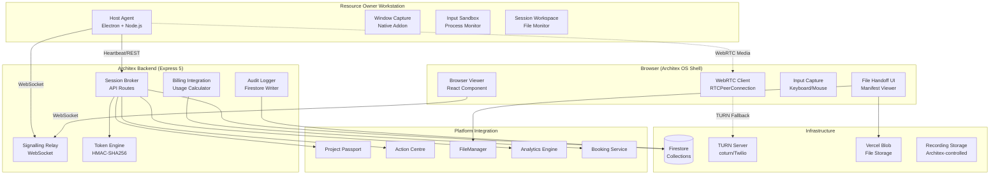
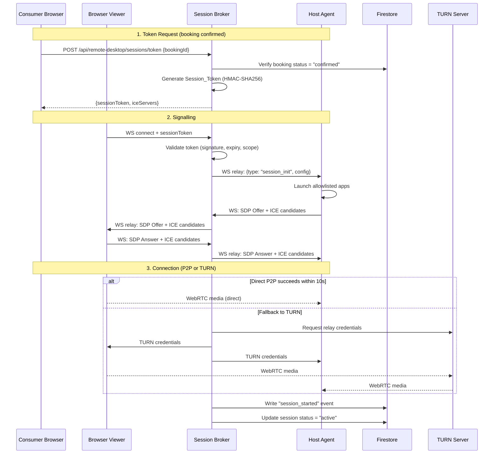

# Design Document: Architex Remote Desktop Core

## Overview

The Architex Remote Desktop Core is a three-component system that transforms confirmed marketplace bookings into live, governed remote access sessions. The architecture is split across:

1. **Host Agent** — A Windows desktop application (Electron + Node.js) installed on resource owner workstations that handles registration, heartbeat, app isolation, window capture, and WebRTC streaming.
2. **Session Broker** — An Express 5 backend module integrated into the existing `api-router.ts` that handles token issuance, WebRTC signalling relay, session policy enforcement, audit logging, and billing integration.
3. **Browser Viewer** — A React component rendered within the Architex OS shell that displays WebRTC media streams, forwards input, shows session metadata, and handles file handoff UI.

The system is fully in-house — no third-party VDI platforms. Third-party infrastructure is limited to TURN relay servers (e.g., Twilio NTS or self-hosted coturn) for NAT traversal. The design targets South African bandwidth constraints with aggressive adaptive encoding profiles.

### Key Design Decisions

| Decision | Rationale |
|----------|-----------|
| WebRTC over custom protocol | Browser-native, no plugin install, handles NAT traversal, adaptive bitrate built-in |
| Express 5 signalling (not dedicated WS server) | Aligns with existing backend, avoids operational complexity of separate infra |
| Electron for Host Agent | Cross-version Windows support (10/11), Node.js for Firestore SDK, native addons for window capture |
| Window-level capture (not desktop) | Privacy — only approved app windows are transmitted |
| Session_Token with HMAC-SHA256 | Stateless verification, short-lived, bound to booking window |
| Firestore for session state | Existing platform pattern, real-time listeners, built-in security rules |

---

## Architecture

### System Architecture Diagram



### Connection Flow Sequence



---

## Components and Interfaces

### 1. Host Agent (Windows Desktop — Electron)

**Responsibilities:**
- Machine registration and heartbeat reporting
- App Allowlist validation (local .exe path check)
- Window-level capture via Windows Graphics Capture API (Win10 1903+)
- WebRTC peer connection (media sender)
- Input sandboxing — block system shortcuts, unauthorised processes, file dialog restriction
- Session Workspace file monitoring
- Bandwidth measurement and adaptive encoding
- Local event buffer for offline resilience

**Key Modules:**

```typescript
// host-agent/src/modules/
├── registration/        // First-launch auth, machine registration
├── heartbeat/           // 30s interval heartbeat with status/CPU/RAM
├── capture/             // Window capture via native addon (node-gyp)
├── encoder/             // H.264/VP9 encoding with adaptive profiles
├── webrtc/              // RTCPeerConnection management
├── sandbox/             // Process monitor, input filter, file dialog hook
├── workspace/           // Session_Workspace file watcher + manifest builder
├── signalling/          // WebSocket client to Session Broker
├── audit-buffer/        // Local event buffer (SQLite) for offline resilience
└── tray/                // System tray UI for owner controls
```

**Native Addon Interface (C++ via node-gyp):**

```typescript
interface WindowCaptureAddon {
  /** Get list of visible windows with process info */
  enumerateWindows(): WindowInfo[];
  /** Start capturing a specific window by HWND */
  startCapture(hwnd: number, options: CaptureOptions): CaptureSession;
  /** Get next frame as NV12/I420 buffer */
  getFrame(session: CaptureSession): FrameBuffer | null;
  /** Release capture session */
  stopCapture(session: CaptureSession): void;
}

interface InputFilterAddon {
  /** Install low-level keyboard/mouse hooks */
  installHooks(allowedHwnds: number[]): void;
  /** Remove hooks */
  removeHooks(): void;
  /** Block specific key combinations system-wide during session */
  blockSystemShortcuts(shortcuts: KeyCombo[]): void;
}

interface ProcessMonitorAddon {
  /** Watch for new process creation events */
  startMonitoring(callback: (event: ProcessEvent) => void): void;
  /** Terminate a process by PID */
  terminateProcess(pid: number): boolean;
  /** Get process tree for a given PID */
  getProcessTree(pid: number): ProcessInfo[];
}
```

### 2. Session Broker (Express 5 Backend Module)

**Responsibilities:**
- Token generation and validation (HMAC-SHA256)
- WebSocket signalling relay (SDP/ICE exchange)
- Session lifecycle management (create, active, terminate)
- TURN credential provisioning
- Audit event writing to Firestore
- Billing data calculation and pipeline reporting
- Platform integration (Project Passport, Action Centre, Analytics)

**API Routes:**

```typescript
// Added to src/lib/api-router.ts or as a separate remote-desktop-api-router.ts

// REST Endpoints
POST   /api/remote-desktop/hosts/register          // Host registration
POST   /api/remote-desktop/hosts/:hostId/heartbeat // Heartbeat
GET    /api/remote-desktop/hosts/:hostId/config    // Get host config + allowlist
PUT    /api/remote-desktop/hosts/:hostId/apps      // Update App_Allowlist
POST   /api/remote-desktop/sessions/token          // Generate Session_Token
GET    /api/remote-desktop/sessions/:sessionId     // Get session state
POST   /api/remote-desktop/sessions/:sessionId/end // End session
GET    /api/remote-desktop/sessions/:sessionId/manifest // Get file manifest
POST   /api/remote-desktop/sessions/:sessionId/approve-files // Approve file handoff
POST   /api/remote-desktop/sessions/:sessionId/billing // Finalise billing
GET    /api/remote-desktop/audit/:sessionId/events // Query audit events

// WebSocket Endpoint (upgrade from HTTP)
WS     /api/remote-desktop/signal                  // Signalling relay
```

**Token Engine:**

```typescript
interface SessionToken {
  tokenId: string;            // UUIDv4
  bookingId: string;
  consumerUid: string;
  hostId: string;
  windowStart: number;        // Unix timestamp ms
  windowEnd: number;          // Unix timestamp ms
  gracePeriod: number;        // Seconds
  issuedAt: number;           // Unix timestamp ms
  signature: string;          // HMAC-SHA256 of payload
}

interface TokenEngine {
  /** Generate token for confirmed booking */
  generateToken(booking: ConfirmedBooking): SessionToken;
  /** Validate token integrity and expiry */
  validateToken(token: string): TokenValidationResult;
  /** Revoke token (booking cancelled) */
  revokeToken(tokenId: string): void;
  /** Check if token is in revocation list */
  isRevoked(tokenId: string): boolean;
}
```

**Signalling Relay (WebSocket):**

```typescript
interface SignallingMessage {
  type: 'session_init' | 'sdp_offer' | 'sdp_answer' | 'ice_candidate' | 'session_end' | 'session_pause' | 'quality_change';
  sessionId: string;
  payload: Record<string, unknown>;
}

// The broker maintains a Map<sessionId, { hostWs, viewerWs }> for active sessions
// Messages are validated (token scope) then forwarded between paired connections
```

### 3. Browser Viewer (React Component)

**Responsibilities:**
- WebRTC peer connection (media receiver)
- Video stream rendering (aspect-ratio-preserving viewport)
- Keyboard/mouse input capture and forwarding via data channel
- Session control bar (timer, quality, disconnect)
- Reconnection logic (5s intervals, 12 attempts max)
- File handoff manifest display
- Navigation guard (beforeunload)

**Component Tree:**

```typescript
// src/components/remote-desktop/
├── RemoteDesktopViewer.tsx      // Top-level component (renders in OS shell)
├── SessionViewport.tsx          // Video element + aspect ratio + letterboxing
├── SessionControlBar.tsx        // Timer, quality, controls
├── QualitySelector.tsx          // High/Balanced/Low profile picker
├── ReconnectionOverlay.tsx      // Auto-reconnect UI
├── FileManifestPanel.tsx        // File handoff status
├── SessionEndSummary.tsx        // Post-session summary
├── RecordingConsent.tsx         // Recording consent dialog
└── hooks/
    ├── useWebRTCSession.ts      // WebRTC connection lifecycle
    ├── useSignalling.ts         // WebSocket signalling
    ├── useInputCapture.ts       // Keyboard/mouse forwarding
    ├── useSessionTimer.ts       // Countdown/elapsed timer
    └── useBandwidthMonitor.ts   // Connection quality metrics
```

**Component Interface:**

```typescript
interface RemoteDesktopViewerProps {
  user: UserProfile;
  bookingId: string;
  sessionToken: string;
  onSessionEnd: (summary: SessionSummary) => void;
}
```

### 4. Platform Integration Layer

```typescript
// src/services/remoteDesktop/
├── remoteDesktopService.ts          // Core orchestration
├── sessionBrokerService.ts          // Token + signalling logic
├── sessionAuditService.ts           // Activity_Log writer
├── sessionBillingService.ts         // Usage calculation + billing pipeline
├── fileHandoffService.ts            // Manifest + upload to FileManager
├── remoteDesktopPassportAdapter.ts  // → Project Passport integration
├── remoteDesktopInboxAdapter.ts     // → Action Centre WorkflowEvents
├── remoteDesktopAnalyticsAdapter.ts // → Analytics Engine KPI data
└── bandwidthAdaptationService.ts    // Encoding profile selection logic
```

---

## Data Models

### Firestore Collections

#### `remote_desktop_hosts`

```typescript
interface RemoteDesktopHost {
  hostId: string;                     // Auto-generated document ID
  ownerUid: string;                   // Firebase Auth UID
  machineName: string;                // Max 64 chars
  osVersion: string;                  // e.g., "Windows 11 23H2"
  hardwareSpecs: {
    cpuModel: string;                 // Max 128 chars
    ramMb: number;                    // Integer
    gpuModel: string;                 // Max 128 chars
    storageGb: number;               // Integer
  };
  status: 'online' | 'offline' | 'in_session';
  lastHeartbeat: Timestamp;           // UTC, ms precision
  registrationTimestamp: Timestamp;   // UTC, ms precision
  configuration: {
    gracePeriodSeconds: number;        // 0–3600
    clipboardPolicy: 'enabled' | 'disabled';
    sessionWorkspacePath: string;      // Max 512 chars
    recordingEnabled: boolean;
  };
}
```

#### `remote_desktop_apps`

```typescript
interface RemoteDesktopApp {
  appId: string;                      // Auto-generated document ID
  hostId: string;                     // FK → remote_desktop_hosts
  displayName: string;                // Max 128 chars
  executablePath: string;             // Max 512 chars
  softwareCategory: string;           // Max 64 chars
  validationStatus: 'valid' | 'unavailable';
  lastValidatedTimestamp: Timestamp;  // UTC, ms precision
}
```

#### `remote_desktop_sessions`

```typescript
interface RemoteDesktopSession {
  sessionId: string;                  // Auto-generated document ID
  bookingId: string;
  hostId: string;                     // FK → remote_desktop_hosts
  consumerUid: string;
  ownerUid: string;
  projectReference?: string;          // Max 128 chars, optional
  status: 'pending' | 'active' | 'completed' | 'terminated' | 'failed';
  connectionType: string;             // Max 64 chars (e.g., "peer-to-peer", "turn-relay")
  startTimestamp: Timestamp;          // UTC, ms precision
  endTimestamp?: Timestamp;           // UTC, ms precision
  totalConnectedSeconds: number;      // 0–86400
  totalDisconnectionGapSeconds: number; // 0–86400
  applicationsUsed: string[];         // Array of app IDs, max 50
  filesProducedCount: number;         // 0–10000
  disconnectionReason: string;        // Max 256 chars
  billedDurationMinutes?: number;     // 0–1440
  ownerApproved: boolean;
  reconnectionAttempts: number;       // 0–5
  tokenId: string;
}
```

#### `remote_desktop_session_events`

```typescript
interface RemoteDesktopSessionEvent {
  eventId: string;                    // Auto-generated document ID
  sessionId: string;                  // FK → remote_desktop_sessions
  bookingId: string;
  eventType: SessionEventType;        // Max 64 chars
  actorUid: string;
  actorRole: string;                  // Max 64 chars
  hostId: string;
  timestamp: Timestamp;               // UTC, ms precision
  metadata: Record<string, unknown>;  // Max 8KB serialized
}

type SessionEventType =
  | 'session_started'
  | 'session_ended'
  | 'app_launched'
  | 'app_closed'
  | 'file_created'
  | 'file_modified'
  | 'focus_violation_attempted'
  | 'child_process_blocked'
  | 'clipboard_used'
  | 'auto_disconnect_triggered'
  | 'reconnection_attempted'
  | 'quality_profile_changed'
  | 'session_terminated_uac'
  | 'token_revoked'
  | 'token_integrity_failure'
  | 'owner_revoked'
  | 'broker_connectivity_lost'
  | 'buffer_overflow'
  | 'workspace_expired'
  | 'no_active_windows';
```

#### `remote_desktop_file_manifests`

```typescript
interface RemoteDesktopFileManifest {
  manifestId: string;                 // Auto-generated document ID
  sessionId: string;                  // FK → remote_desktop_sessions
  bookingId: string;
  consumerUid: string;
  ownerUid: string;
  files: FileManifestEntry[];         // Max 200 entries
  manifestTimestamp: Timestamp;       // UTC, ms precision
  ownerApprovalStatus: 'pending' | 'approved' | 'rejected';
  approvalTimestamp?: Timestamp;      // Nullable
  expiryTimestamp: Timestamp;         // 72 hours after session end
}

interface FileManifestEntry {
  name: string;                       // Max 256 chars
  sizeBytes: number;                  // 0–10737418240 (10GB)
  extension: string;                  // Max 16 chars
  sha256Hash: string;                 // 64-char hex string
  transferStatus: 'pending' | 'transferring' | 'completed' | 'failed';
}
```

#### `remote_desktop_recordings` (when recording enabled)

```typescript
interface RemoteDesktopRecording {
  recordingId: string;
  sessionId: string;                  // FK → remote_desktop_sessions
  hostId: string;
  consumerUid: string;
  ownerUid: string;
  storagePath: string;                // Architex-controlled storage path
  durationSeconds: number;            // Max 28800 (8 hours)
  sizeBytes: number;
  status: 'recording' | 'completed' | 'expired' | 'retained_dispute';
  retentionExpiryTimestamp: Timestamp; // 90 days after session
  disputeId?: string;                 // If retained beyond 90 days
  createdAt: Timestamp;
}
```

### Session Token Structure (JWT-like, not JWT)

```typescript
// Token payload (base64url encoded)
interface SessionTokenPayload {
  tid: string;    // Token ID (UUIDv4)
  bid: string;    // Booking ID
  cid: string;    // Consumer UID
  hid: string;    // Host ID
  ws: number;     // Window start (Unix ms)
  we: number;     // Window end (Unix ms)
  gp: number;     // Grace period (seconds)
  iat: number;    // Issued at (Unix ms)
}

// Wire format: base64url(payload).base64url(hmac-sha256(payload, secret))
// Total token size: ~200 bytes
```

---

## Correctness Properties

*A property is a characteristic or behavior that should hold true across all valid executions of a system — essentially, a formal statement about what the system should do. Properties serve as the bridge between human-readable specifications and machine-verifiable correctness guarantees.*

### Property 1: Token generation produces valid, complete tokens

*For any* confirmed booking with valid window start/end times and grace period, generating a Session_Token SHALL produce a token containing all required fields (token ID, booking ID, consumer UID, host ID, window start, window end, grace period, issued at, signature) where the token expiry equals window end plus grace period, and the signature is verifiable against the payload.

**Validates: Requirements 3.1, 3.2, 3.3**

### Property 2: Token validation rejects tampered or mis-scoped tokens

*For any* Session_Token where either the payload has been modified after signing (breaking the HMAC-SHA256 signature) or the presenting consumer UID / host ID does not match the token's bound values, the Session_Broker SHALL reject the token with the appropriate reason code ("invalid_token" for signature failure, "token_scope_violation" for scope mismatch).

**Validates: Requirements 3.6, 3.8**

### Property 3: Token time-window enforcement

*For any* Session_Token and any current timestamp, IF the current time is before (window start minus 15 minutes) THEN validation SHALL reject with "session_not_started", AND IF the booking status is not "confirmed" THEN token generation SHALL be rejected with the appropriate denial reason.

**Validates: Requirements 3.4, 3.7**

### Property 4: Allowlist entry validation

*For any* App_Allowlist submission, entries with display name ≤100 characters, executable path ≤260 characters referencing a valid .exe, and a valid software category SHALL be accepted, AND submissions that would exceed 20 total entries or have invalid paths SHALL be rejected, AND changes SHALL not affect currently active sessions.

**Validates: Requirements 2.1, 2.5, 2.7**

### Property 5: Signalling messages never contain host credentials

*For any* signalling message relayed by the Session_Broker to the Browser_Viewer (SDP offers, ICE candidates, session configuration), the message payload SHALL NOT contain Windows login credentials, host IP addresses, or RDP passwords.

**Validates: Requirements 4.4**

### Property 6: Connection failure returns correct reason code

*For any* WebRTC connection failure scenario, the Session_Broker SHALL return a "connection_failed" error with the correct reason code: "host_unreachable" when the Host_Agent does not respond, "turn_unavailable" when TURN cannot be provisioned, "signalling_timeout" when SDP/ICE exchange does not complete within 30 seconds.

**Validates: Requirements 4.5**

### Property 7: Input sandbox blocks system escape shortcuts

*For any* keyboard input event during an active session matching a blocked shortcut (Alt+Tab, Win key, Ctrl+Esc, Alt+F4 on non-allowed windows, Ctrl+Alt+Del, Ctrl+Shift+Esc), the Host_Agent SHALL block the event and not forward it to any process.

**Validates: Requirements 7.1**

### Property 8: Process launch prevention

*For any* attempt to launch a process during an active session, IF the process executable matches a blocked shell (cmd.exe, powershell.exe, wt.exe, bash.exe, wsl.exe, explorer.exe) OR is a child process not in the App_Allowlist, the Host_Agent SHALL prevent or terminate the process.

**Validates: Requirements 7.2, 7.5**

### Property 9: Clipboard policy enforcement

*For any* clipboard operation during an active session, IF clipboard is disabled then ALL clipboard transfers SHALL be blocked, AND IF text-only clipboard is enabled then only text content ≤4096 characters SHALL be permitted while file, image, and rich-text content SHALL be blocked.

**Validates: Requirements 7.3**

### Property 10: File dialog path restriction

*For any* file path accessed via Open/Save dialogs within allowlisted processes during an active session, IF the path is outside the Session_Workspace directory boundary THEN the access SHALL be blocked, AND IF the path is within the Session_Workspace THEN the access SHALL be permitted.

**Validates: Requirements 7.4**

### Property 11: Pre-session verification gate

*For any* session start request, the Host_Agent SHALL grant input control to the Resource_Consumer ONLY when the App_Allowlist contains at least one entry AND the Session_Workspace path exists and is accessible.

**Validates: Requirements 7.7**

### Property 12: Bandwidth profile selection

*For any* measured bandwidth value, the encoding profile SHALL be selected as: "High" (1080p, 30fps) when bandwidth ≥4Mbps, "Balanced" (720p, 24fps) when 1.5Mbps ≤ bandwidth < 4Mbps, "Low" (480p, 15fps) when 500Kbps ≤ bandwidth < 1.5Mbps, "Critical" (360p, 10fps) when bandwidth < 500Kbps sustained for 10 seconds, with exit from Critical requiring ≥1.0Mbps sustained for 15 seconds.

**Validates: Requirements 10.1, 10.5, 10.7**

### Property 13: Profile switching policy (hysteresis and manual override)

*For any* sequence of bandwidth measurements during an active session, automatic profile switching SHALL only occur after a threshold crossing is sustained for at least 5 consecutive seconds, AND IF the Resource_Consumer has manually selected a profile THEN automatic switching SHALL be suspended regardless of bandwidth fluctuations.

**Validates: Requirements 10.2, 10.4**

### Property 14: Session time boundary enforcement

*For any* active session with a configured Booking_Window and Grace_Period (0–15 minutes), the countdown warning SHALL trigger at (window end minus grace period), AND auto-disconnect SHALL trigger at exactly (window end plus grace period), AND the Grace_Period SHALL only accept values of 0–15 in 1-minute increments.

**Validates: Requirements 9.1, 9.2, 9.3**

### Property 15: Reconnection within grace period

*For any* voluntary disconnect before or after the Booking_Window end time, the Session_Token SHALL remain valid for reconnection until (window end plus grace period), allowing a maximum of 5 reconnection attempts within that window.

**Validates: Requirements 9.4, 9.5**

### Property 16: Audit record completeness

*For any* session event written to the Activity_Log, the record SHALL contain: event type, session ID, booking ID, actor UID, actor role, host ID, and UTC timestamp with millisecond precision. AND for any session summary written on session end, it SHALL contain: total connected duration, total disconnection gaps, applications used, files created count/size, disconnection reason, and connection type.

**Validates: Requirements 11.1, 11.2**

### Property 17: Audit log immutability and role-scoped access

*For any* attempt to modify or delete an Activity_Log record by any user role (including Platform_Admin), the operation SHALL be rejected. AND for any query, Platform_Admin SHALL see all sessions, Resource_Owner SHALL see only sessions on their hosts, and Resource_Consumer SHALL see only their own sessions.

**Validates: Requirements 11.3, 11.4**

### Property 18: Event buffer FIFO eviction

*For any* sequence of events buffered locally when the Host_Agent is offline, IF the buffer reaches 10,000 events THEN the oldest events SHALL be evicted first, AND a buffer_overflow event recording the discard count SHALL be written upon connectivity restoration.

**Validates: Requirements 11.5, 11.8**

### Property 19: Billing duration calculation

*For any* session with connection/disconnection sequences, the actual connected duration SHALL equal (total time connected) minus (sum of disconnection gaps ≥60 seconds each), rounded up to the nearest minute, AND the owner-adjustable billed duration SHALL only accept values between 1 minute and the total Booking_Window duration.

**Validates: Requirements 12.1, 12.4**

### Property 20: Governance invariant — no automatic finalisation

*For any* completed session, the system SHALL NOT auto-confirm bookings, auto-generate tokens without owner confirmation, or auto-finalise billing records, AND usage logs not approved within 14 days SHALL be blocked from finalisation and flagged for review.

**Validates: Requirements 14.2, 14.5**

### Property 21: Booking lifecycle state machine validity

*For any* booking/session state transition, only the following transitions SHALL be valid: confirmed → session_active (on token generation), session_active → session_completed (on explicit termination), AND booking cancellation during active state SHALL invalidate the token and transition to "terminated_governance".

**Validates: Requirements 14.4, 14.6**

### Property 22: File size validation in handoff

*For any* file in the Session_Workspace file manifest, IF the file size exceeds 500 MB THEN it SHALL be rejected from the handoff while all remaining files ≤500 MB SHALL proceed independently.

**Validates: Requirements 8.5**

### Property 23: File manifest record completeness

*For any* session that ends, the final file manifest written to `remote_desktop_file_manifests` SHALL contain: session ID, booking ID, consumer UID, file entries (each with name, size, extension, SHA-256 hash, transfer status), and manifest timestamp.

**Validates: Requirements 8.3, 8.9**

### Property 24: Schema validation rejects incomplete documents

*For any* write operation to any remote desktop Firestore collection, IF a required field is missing THEN the write SHALL be rejected with an error indicating which fields are absent.

**Validates: Requirements 15.6**

### Property 25: Session query filtering and ordering

*For any* query to `remote_desktop_sessions` filtered by host ID, consumer UID, owner UID, or status, the results SHALL contain only documents matching the filter criteria AND SHALL be ordered by start timestamp descending. AND for any query to `remote_desktop_session_events` by session ID, results SHALL be ordered by timestamp ascending.

**Validates: Requirements 15.7, 15.8**

### Property 26: Recording access control

*For any* attempt to view or download a session recording, access SHALL be granted only to the Resource_Owner of the host, the Resource_Consumer for that session, and Platform_Admin. All other roles SHALL be denied access.

**Validates: Requirements 16.5**

### Property 27: Owner session history scoping

*For any* Resource_Owner querying their session history, the results SHALL include only sessions on hosts they own, limited to sessions within the last 30 days and a maximum of 200 entries.

**Validates: Requirements 17.3**

### Property 28: Session control bar data completeness

*For any* active session state, the Browser_Viewer control bar SHALL display: elapsed time, remaining time (updated every 1 second), connection quality indicator (latency in ms, bandwidth in Mbps), active application name, and file handoff status.

**Validates: Requirements 6.4**

### Property 29: Viewport aspect ratio preservation

*For any* combination of source stream resolution and browser viewport dimensions, the Browser_Viewer SHALL scale the stream to fit while maintaining the original aspect ratio, adding letterbox bars when aspect ratios differ, with a minimum supported viewport of 800×600 pixels.

**Validates: Requirements 6.3**

### Property 30: Reconnection attempt pattern

*For any* WebRTC connection drop during an active session, the Browser_Viewer SHALL attempt reconnection every 5 seconds for up to 60 seconds (maximum 12 attempts), AND if all attempts fail SHALL mark the session as disconnected.

**Validates: Requirements 6.8, 6.9**

### Property 31: Host heartbeat payload completeness

*For any* heartbeat sent by the Host_Agent, it SHALL contain: host ID, current status (one of idle, in_session, unavailable), CPU utilisation percentage, and available RAM in megabytes.

**Validates: Requirements 1.2**

### Property 32: Analytics KPI calculation

*For any* set of session data per host per calendar month, the system SHALL correctly calculate: utilisation rate (connected hours / available hours), revenue per host (billing total), session reliability (successful connections / total attempts), and average bandwidth utilisation (mean % of allocated bandwidth per session).

**Validates: Requirements 13.5**

### Property 33: Platform integration — ProjectRecord on session completion

*For any* completed session associated with a project reference, the system SHALL write a ProjectRecord to Project Passport containing: session ID, booking reference, consumer UID, connected duration in whole minutes, applications used, files produced, and disconnection reason.

**Validates: Requirements 13.1**


---

## Error Handling

### Error Categories and Recovery Strategies

| Category | Examples | Recovery Strategy |
|----------|----------|-------------------|
| **Network Transient** | Heartbeat delivery failure, signalling timeout, Firestore write failure | Retry with exponential backoff (1s, 2s, 4s), max 3 attempts |
| **Token Errors** | Invalid signature, expired token, scope violation, revoked token | Immediate rejection with structured error code, no retry |
| **Session Critical** | UAC elevation detected, all apps crashed, host unreachable | Immediate session termination, audit event, notification to both parties |
| **Resource Errors** | Exe path invalid, workspace inaccessible, file >500MB | Graceful degradation — reject specific item, continue with rest |
| **Platform Integration** | Project Passport write failure, Action Centre unavailable | Queue for retry (3 attempts at 30s), log failure, notify admin if exhausted |
| **Capacity** | Event buffer full (10,000), max reconnection attempts (5/12) | FIFO eviction for buffer; graceful termination for reconnection limits |

### Structured Error Response Format

```typescript
interface RemoteDesktopError {
  code: RemoteDesktopErrorCode;
  message: string;
  details?: Record<string, unknown>;
  retryable: boolean;
  sessionId?: string;
}

type RemoteDesktopErrorCode =
  | 'session_not_started'
  | 'token_scope_violation'
  | 'invalid_token'
  | 'token_generation_failed'
  | 'connection_failed'
  | 'host_unreachable'
  | 'turn_unavailable'
  | 'signalling_timeout'
  | 'booking_window_expired'
  | 'awaiting_owner_confirmation'
  | 'booking_conflict'
  | 'booking_cancelled'
  | 'booking_expired'
  | 'billing_pending'
  | 'file_size_exceeded'
  | 'upload_failed'
  | 'workspace_inaccessible'
  | 'allowlist_empty';
```

### Host Agent Offline Resilience

```typescript
interface LocalEventBuffer {
  /** SQLite-backed persistent buffer on host machine */
  capacity: 10_000;                    // Max events before FIFO eviction
  evictionPolicy: 'oldest_first';      // FIFO
  flushInterval: 60_000;              // Flush within 60s of connectivity restored
  
  /** On buffer overflow */
  onOverflow(): void;                  // Record discard count, continue buffering
  
  /** On connectivity restored */
  onConnectivityRestored(): void;      // Flush all buffered events to Firestore
}
```

### Session Termination Scenarios

| Trigger | Timeout | Cleanup Actions |
|---------|---------|-----------------|
| User disconnect (voluntary) | Immediate | Token stays valid for reconnection |
| Owner revoke | 2s signal to broker | Close apps, write event, notify consumer |
| Booking window expired | At end + grace | Signal both peers, invalidate token, write event |
| UAC/privilege escalation | 3s detection | Terminate session, write event, notify both |
| All apps unavailable | Immediate | Show placeholder, suspend input, write event |
| Host cleanup timeout | 30s after auto-disconnect | Force-terminate, flag for admin review |
| Broker connectivity lost | 120s tolerance | Local termination, buffer events |

---

## Testing Strategy

### Dual Testing Approach

This feature requires both **property-based tests** (for universal correctness guarantees) and **example-based tests** (for specific scenarios, edge cases, and integration points).

### Property-Based Testing Configuration

- **Library**: `fast-check` (TypeScript PBT library, already compatible with Vitest)
- **Minimum iterations**: 100 per property test
- **Tag format**: `Feature: architex-remote-desktop-core, Property {N}: {property_text}`

### Test Organization

```
src/services/remoteDesktop/__tests__/
├── tokenEngine.property.test.ts          // Properties 1, 2, 3
├── allowlistValidation.property.test.ts  // Property 4
├── signallingRelay.property.test.ts      // Properties 5, 6
├── inputSandbox.property.test.ts         // Properties 7, 8, 9, 10, 11
├── bandwidthAdaptation.property.test.ts  // Properties 12, 13
├── sessionTimeBounds.property.test.ts    // Properties 14, 15
├── auditLog.property.test.ts            // Properties 16, 17, 18
├── billingCalculation.property.test.ts   // Properties 19, 20
├── lifecycleStateMachine.property.test.ts // Property 21
├── fileHandoff.property.test.ts          // Properties 22, 23
├── schemaValidation.property.test.ts     // Properties 24, 25
├── accessControl.property.test.ts        // Properties 26, 27
├── viewerState.property.test.ts          // Properties 28, 29, 30
├── heartbeat.property.test.ts            // Property 31
├── analytics.property.test.ts            // Properties 32, 33
├── sessionBroker.integration.test.ts     // Integration tests
├── webrtcSignalling.integration.test.ts  // WebRTC flow integration
├── fileUpload.integration.test.ts        // FileManager integration
└── platformIntegration.integration.test.ts // Passport, Action Centre
```

### Unit Tests (Example-Based)

Focus on:
- Specific error scenarios (UAC detection, auth failure after 3 attempts)
- Edge cases (zero-minute duration, 20-entry allowlist limit, token expiry mid-signalling)
- UI component rendering (control bar, reconnection overlay, consent dialog)
- Configuration toggles (recording enable/disable, clipboard policy)

### Integration Tests

Focus on:
- WebRTC signalling full flow (token → SDP exchange → connection)
- Firestore write operations (session records, audit events, file manifests)
- Platform integration (ProjectRecord to Passport, WorkflowEvents to Action Centre)
- File upload pipeline (workspace → manifest → approval → FileManager)
- Billing pipeline integration (usage calculation → billing report)

### E2E Tests (Playwright)

Focus on:
- Full session lifecycle from booking launch to disconnect
- Reconnection flow (simulate network drop)
- File handoff approval workflow
- Owner termination from web interface
- Recording consent flow

### Test Environment

- **Firestore Emulator**: For all Firestore operations (no live database in tests)
- **WebRTC Mocks**: Mock RTCPeerConnection for unit/property tests; real WebRTC for E2E
- **Host Agent Mocks**: Mock native addons (window capture, process monitor) for service-level tests
- **TURN Server Mock**: Mock TURN credential provisioning for signalling tests

### Coverage Targets

| Layer | Target |
|-------|--------|
| Token Engine | 95% (security-critical) |
| Session Broker services | 90% |
| Bandwidth adaptation | 90% (algorithm-heavy) |
| Input sandbox logic | 90% (security-critical) |
| Browser Viewer hooks | 80% |
| Platform integration adapters | 75% |
| UI components | 70% (component tests + E2E) |
