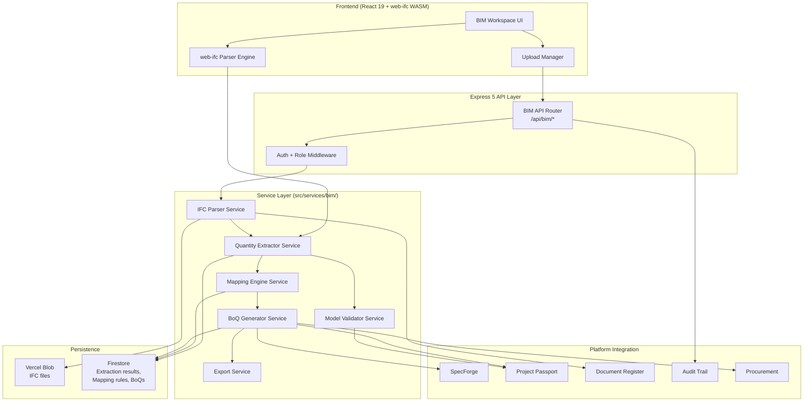
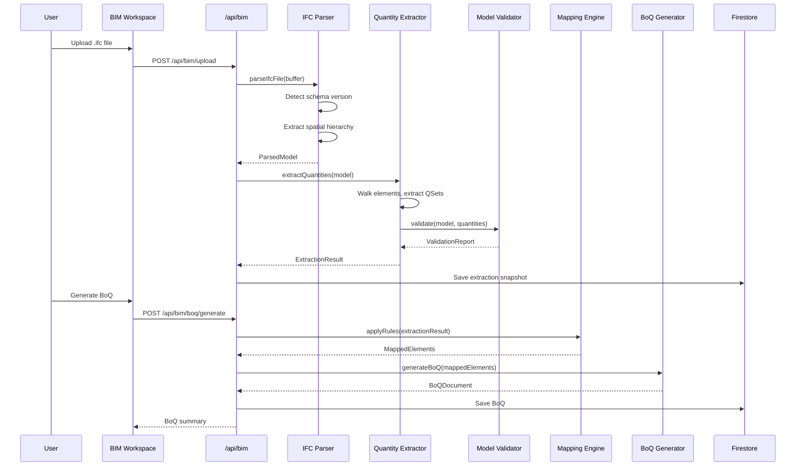

# Design Document: BIM/IFC Quantity Extraction Bridge

## Overview

The BIM/IFC Quantity Extraction Bridge is a service module within the Architex Built Environment OS that transforms Industry Foundation Classes (IFC) building model files into structured Bills of Quantities (BoQ) conforming to ASAQS/JBCC South African measurement conventions. The bridge operates as a pipeline: upload → parse → extract → map → generate → export, integrating with SpecForge, Project Passport, Document Register, and Procurement workflows.

**Key Design Decisions:**
- **Client-side IFC parsing** via `web-ifc` (WebAssembly) for files ≤50MB, server-side for larger files — keeps the server stateless for common models while supporting large files
- **Streaming extraction pipeline** — elements processed in batches of 500 to avoid memory pressure on 10K+ element models
- **Rule-based mapping** with configurable precedence — default ASAQS rules ship with the platform, custom rules overlay per-project/firm
- **Immutable extraction snapshots** — each extraction produces a versioned result that can be compared against prior extractions

## Architecture



### Processing Pipeline



## Components and Interfaces

### Service Layer (`src/services/bim/`)

| Service | File | Responsibility |
|---------|------|---------------|
| IFC Parser | `ifcParserService.ts` | Parse IFC files, detect schema, extract spatial hierarchy |
| Quantity Extractor | `quantityExtractorService.ts` | Walk elements, extract quantities and property sets |
| Mapping Engine | `mappingEngineService.ts` | Apply trade section mapping rules to extracted elements |
| BoQ Generator | `boqGeneratorService.ts` | Aggregate, format, and structure BoQ documents |
| Model Validator | `modelValidatorService.ts` | Quality checks, completeness validation, statistics |
| Export Service | `exportService.ts` | CSV, Excel (.xlsx), JSON export generation |
| BIM Passport Adapter | `bimPassportAdapter.ts` | Project Passport integration events |
| BIM SpecForge Adapter | `bimSpecForgeAdapter.ts` | SpecForge item creation and comparison |
| BIM Audit Adapter | `bimAuditAdapter.ts` | Audit trail event creation |

### API Layer (`src/lib/bim-api-router.ts`)

Follows the existing `api-router.ts` pattern — a separate Express router mounted at `/api/bim` to keep the main router manageable.

### UI Components (`src/components/BimWorkspace.tsx`)

| Component | Purpose |
|-----------|---------|
| `BimWorkspace` | Main workspace (Hero → Stats → Panels) |
| `IfcUploadPanel` | Drag-and-drop IFC upload with progress |
| `ModelSummaryPanel` | Parsed model overview, element counts, hierarchy tree |
| `ValidationReportPanel` | Findings table (errors/warnings/info) |
| `BoqViewPanel` | Generated BoQ with trade sections, line items |
| `MappingRulesPanel` | Mapping rule editor for QS/admin roles |
| `ExportPanel` | Export format selection and download |
| `ExtractionComparisonPanel` | Diff between extractions |

## Data Models

### Core IFC Types

```typescript
// ─── IFC Schema Detection ─────────────────────────────────────────────────

export type IfcSchemaVersion = 'IFC2X3' | 'IFC4' | 'IFC4X3';

export type IfcEntityType =
  // Structural
  | 'IfcWall' | 'IfcWallStandardCase' | 'IfcSlab' | 'IfcColumn' | 'IfcBeam'
  | 'IfcDoor' | 'IfcWindow' | 'IfcRoof' | 'IfcStair' | 'IfcRailing'
  | 'IfcCurtainWall' | 'IfcPlate' | 'IfcMember' | 'IfcPile' | 'IfcFooting'
  | 'IfcCovering' | 'IfcBuildingElementProxy'
  // MEP
  | 'IfcPipeSegment' | 'IfcPipeFitting' | 'IfcDuctSegment' | 'IfcDuctFitting'
  | 'IfcCableSegment' | 'IfcCableFitting' | 'IfcFlowTerminal'
  | 'IfcEnergyConversionDevice' | 'IfcFlowController' | 'IfcFlowStorageDevice';

export type QuantityType = 'area' | 'volume' | 'length' | 'count' | 'weight';

export type ValidationSeverity = 'error' | 'warning' | 'info';

export type ValidationFindingType =
  | 'missing_quantities'
  | 'unclassified_element'
  | 'missing_material'
  | 'duplicate_globalid'
  | 'out_of_bounds_quantity'
  | 'no_extractable_quantities'
  | 'parse_warning';
```

### Parsed Model Structures

```typescript
// ─── Parsed IFC Model ─────────────────────────────────────────────────────

export interface ParsedIfcModel {
  fileId: string;
  fileName: string;
  schemaVersion: IfcSchemaVersion;
  parsedAt: string; // ISO 8601
  spatialHierarchy: SpatialNode;
  elements: IfcElement[];
  elementCount: number;
}

export interface SpatialNode {
  globalId: string;
  name: string;
  type: 'IfcProject' | 'IfcSite' | 'IfcBuilding' | 'IfcBuildingStorey';
  children: SpatialNode[];
  elementIds: string[]; // GlobalIds of contained elements
}

export interface IfcElement {
  globalId: string;
  entityType: IfcEntityType;
  name: string;
  predefinedType?: string;
  spatialContainment: string; // GlobalId of containing storey/building
  classification?: IfcClassification;
  materials: MaterialLayer[];
  quantitySets: ElementQuantitySet[];
  propertySets: PropertySet[];
  hasGeometry: boolean;
  taggedMetadata: Record<string, string | number>; // fireRating, acousticRating, thermalTransmittance
}

export interface IfcClassification {
  systemName: string; // e.g., 'Uniclass', 'OmniClass'
  code: string;
  description: string;
}

export interface MaterialLayer {
  materialName: string;
  thicknessMm: number;
  category?: string;
}

export interface ElementQuantitySet {
  setName: string; // e.g., 'BaseQuantities', 'Qto_WallBaseQuantities'
  quantities: ExtractedQuantity[];
}

export interface ExtractedQuantity {
  name: string; // e.g., 'NetSideArea', 'GrossVolume'
  type: QuantityType;
  value: number;
  unit: string; // SI unit: 'm²', 'm³', 'm', 'kg', 'nr'
  sourceElementGlobalId: string;
  sourceSetName: string;
}
```

### Property Sets

```typescript
export interface PropertySet {
  setName: string; // e.g., 'Pset_WallCommon'
  isRecognised: boolean; // true for known Pset_* names
  properties: PropertyValue[];
}

export interface PropertyValue {
  name: string;
  value: string | number | boolean;
  rawValue?: string; // preserved when type parsing fails
  unit?: string;
  parseWarning?: boolean;
}

// Recognised Pset names for special tagging
export const RECOGNISED_PSETS = [
  'Pset_WallCommon', 'Pset_SlabCommon', 'Pset_ColumnCommon',
  'Pset_DoorCommon', 'Pset_WindowCommon', 'Pset_BeamCommon',
  'Pset_RoofCommon', 'Pset_CoveringCommon',
] as const;

// Tagged metadata keys extracted from recognised property sets
export const TAGGED_METADATA_KEYS = {
  FireRating: 'fireRating',
  AcousticRating: 'acousticRating',
  ThermalTransmittance: 'thermalTransmittance',
} as const;
```

### Extraction Result

```typescript
export interface ExtractionResult {
  extractionId: string;
  projectId: string;
  fileId: string;
  fileName: string;
  schemaVersion: IfcSchemaVersion;
  extractedAt: string; // ISO 8601
  extractedBy: string; // user uid
  elements: IfcElement[];
  quantities: ExtractedQuantity[];
  validationReport: ValidationReport;
  supersedes?: string; // extractionId of previous extraction
  status: 'draft' | 'active' | 'superseded';
}
```

### Validation

```typescript
export interface ValidationReport {
  modelId: string;
  findings: ValidationFinding[];
  statistics: ModelStatistics;
  boqBlocked: boolean; // true if any error-severity findings
  generatedAt: string;
}

export interface ValidationFinding {
  id: string;
  type: ValidationFindingType;
  severity: ValidationSeverity;
  message: string;
  elementGlobalId?: string;
  elementType?: IfcEntityType;
  details?: Record<string, unknown>;
}

export interface ModelStatistics {
  totalElements: number;
  elementsByType: Record<string, number>;
  elementsWithQuantities: number;
  elementsWithoutQuantities: number;
  unclassifiedElements: number;
  elementsByTradeSection: Record<string, number>;
  quantityCoveragePercent: number; // (withQuantities / total) * 100
}
```

### Mapping Rules

```typescript
export type MeasurementUnit = 'm²' | 'm³' | 'm' | 'nr' | 'kg' | 'item';

export type AsaqsTradeSection =
  | 'Preliminaries' | 'Earthworks' | 'Concrete' | 'Formwork'
  | 'Reinforcement' | 'Masonry' | 'Waterproofing' | 'Roofwork'
  | 'Carpentry and Joinery' | 'Ceilings and Partitions'
  | 'Floor Coverings' | 'Glazing' | 'Ironmongery'
  | 'Plumbing and Drainage' | 'Electrical' | 'Painting'
  | 'Unclassified';

export interface MappingRule {
  ruleId: string;
  ifcEntityType: IfcEntityType;
  predefinedType?: string; // optional — increases specificity
  classificationCode?: string; // optional — increases specificity
  tradeSection: AsaqsTradeSection;
  tradeSectionCode: string; // e.g., '3' for Concrete
  measurementUnit: MeasurementUnit;
  description?: string;
  scope: 'default' | 'firm' | 'project';
  scopeId?: string; // firmId or projectId when scope != 'default'
  createdBy?: string;
  createdAt?: string;
  updatedAt?: string;
}

// Specificity score for rule precedence
// type+predefinedType+classification = 3
// type+predefinedType = 2
// type+classification = 2
// type only = 1
export type RuleSpecificity = 1 | 2 | 3;
```

### BoQ Document

```typescript
export interface BoqDocument {
  boqId: string;
  projectId: string;
  extractionId: string;
  title: string;
  status: 'draft' | 'issued' | 'superseded';
  revision: string;
  generatedAt: string;
  generatedBy: string;
  currency: string; // default 'ZAR'
  sections: BoqSection[];
  flaggedElementsSummary: FlaggedElementSummary[];
  totals: BoqTotals;
}

export interface BoqSection {
  sectionNumber: string; // ASAQS section number, e.g., '3'
  tradeSection: AsaqsTradeSection;
  title: string;
  lineItems: BoqLineItem[];
  subtotal?: number;
}

export interface BoqLineItem {
  itemNumber: string; // sequential within section, e.g., '3.01'
  description: string; // ASAQS measurement description pattern
  unit: MeasurementUnit;
  quantity: number; // rounded to 2dp
  rate?: number; // blank in export, filled by tenderer
  amount?: number; // blank in export, computed as qty × rate
  sourceElementCount: number;
  sourceElementGlobalIds: string[];
  elementType: IfcEntityType;
  material?: string;
  specForgeItemId?: string; // linked SpecForge item if created
}

export interface FlaggedElementSummary {
  globalId: string;
  elementType: IfcEntityType;
  findingType: ValidationFindingType;
  message: string;
}

export interface BoqTotals {
  totalLineItems: number;
  totalSections: number;
  totalElements: number;
}
```

### Procurement Package

```typescript
export interface ProcurementPackage {
  packageId: string;
  projectId: string;
  boqId: string;
  title: string; // trade section name
  tradeSections: AsaqsTradeSection[];
  lineItems: ProcurementLineItem[];
  coverSheet: PackageCoverSheet;
  revision: string;
  issuedAt?: string;
  issuedBy?: string;
  recipientCount?: number;
  modelSuperseded: boolean; // true if source model has newer version
}

export interface ProcurementLineItem {
  itemNumber: string;
  description: string; // supplier-facing, no GlobalIds or IFC types
  unit: MeasurementUnit;
  quantity: number;
}

export interface PackageCoverSheet {
  projectName: string;
  projectNumber: string;
  packageTitle: string;
  issueDate: string;
  revisionNumber: string;
  qsContactName: string;
  qsContactEmail: string;
}
```

### Integration Types

```typescript
// ─── SpecForge Integration ────────────────────────────────────────────────

export interface BoqSpecForgeLink {
  boqLineItemId: string; // itemNumber within BoQ
  specForgeItemId: string;
  boqId: string;
  extractionId: string;
  linkedAt: string;
  quantityAtLink: number;
  currentModelQuantity?: number;
  userOverridden: boolean;
}

export interface ExtractionComparison {
  previousExtractionId: string;
  currentExtractionId: string;
  added: BoqLineItem[];
  removed: BoqLineItem[];
  changed: QuantityChange[];
}

export interface QuantityChange {
  lineItemId: string;
  description: string;
  previousQuantity: number;
  currentQuantity: number;
  delta: number;
  deltaPercent: number;
}

// ─── Project Passport Events ──────────────────────────────────────────────

export interface BimExtractionEvent {
  type: 'bim_extraction';
  projectId: string;
  fileName: string;
  schemaVersion: IfcSchemaVersion;
  elementCount: number;
  quantityCoveragePercent: number;
  extractedAt: string;
}

export interface BimBoqEvent {
  type: 'bim_boq_generated';
  projectId: string;
  boqId: string;
  status: 'draft' | 'issued' | 'superseded';
  tradeSectionCount: number;
  lineItemCount: number;
  generatedAt: string;
}

export interface BimQualityRiskIndicator {
  category: 'model_quality';
  severity: 'medium' | 'high';
  errorCount: number;
  message: string;
}

// ─── Audit Events ─────────────────────────────────────────────────────────

export type BimAuditAction =
  | 'bim_upload'
  | 'bim_extraction'
  | 'bim_boq_generated'
  | 'bim_mapping_rule_created'
  | 'bim_mapping_rule_updated'
  | 'bim_mapping_rule_deleted'
  | 'bim_procurement_package_created'
  | 'bim_procurement_package_issued'
  | 'bim_export';
```

## Service Layer Design

### IFC Parser Service (`ifcParserService.ts`)

```typescript
import * as WebIFC from 'web-ifc';

/**
 * Parses an IFC file buffer into a structured ParsedIfcModel.
 * Uses web-ifc (WASM) for STEP file parsing.
 */
export function parseIfcFile(buffer: Uint8Array, fileName: string): ParsedIfcModel;

/**
 * Detects the IFC schema version from the FILE_SCHEMA header.
 * Returns null if the schema is unsupported.
 */
export function detectSchemaVersion(buffer: Uint8Array): IfcSchemaVersion | null;

/**
 * Validates file size against the 500MB limit.
 */
export function validateFileSize(sizeBytes: number): { valid: boolean; error?: string };

/**
 * Extracts the spatial hierarchy (Site → Building → Storey) from a parsed model.
 */
export function extractSpatialHierarchy(api: WebIFC.IfcAPI, modelId: number): SpatialNode;

/**
 * Classifies an IFC entity type string into the supported IfcEntityType union.
 * Returns undefined for unsupported types.
 */
export function classifyEntityType(typeString: string): IfcEntityType | undefined;
```

**Implementation notes:**
- `web-ifc` loads the WASM module once and reuses it across parses
- Schema detection reads the first 4KB of the file for the `FILE_SCHEMA` header using regex
- Large files (>50MB) are parsed server-side via streaming chunks; smaller files can be parsed client-side in a Web Worker
- The parser does NOT perform geometric computation — it extracts pre-computed quantities from IfcElementQuantity sets only

### Quantity Extractor Service (`quantityExtractorService.ts`)

```typescript
/**
 * Extracts all quantities and property sets from parsed elements.
 * Processes in batches of 500 elements to manage memory.
 */
export function extractQuantities(model: ParsedIfcModel): ExtractionResult;

/**
 * Normalises a quantity value to SI units.
 * Converts imperial/non-SI values to m², m³, m, kg as appropriate.
 */
export function normaliseToSI(value: number, sourceUnit: string, targetType: QuantityType): number;

/**
 * Checks if a quantity value exceeds physically plausible bounds.
 */
export function checkQuantityBounds(value: number, type: QuantityType): boolean;

/**
 * Extracts tagged metadata (fireRating, acousticRating, thermalTransmittance)
 * from recognised property sets.
 */
export function extractTaggedMetadata(propertySets: PropertySet[]): Record<string, string | number>;

/**
 * Extracts material layers from IfcMaterialLayerSetUsage or IfcMaterialConstituentSet.
 */
export function extractMaterialLayers(
  api: WebIFC.IfcAPI, modelId: number, elementExpressId: number
): MaterialLayer[];
```

### Mapping Engine Service (`mappingEngineService.ts`)

```typescript
/**
 * Applies mapping rules to an extraction result, assigning each element
 * to a trade section with a measurement unit.
 */
export function applyMappingRules(
  elements: IfcElement[],
  rules: MappingRule[],
): MappedElement[];

/**
 * Finds the best matching rule for an element using specificity precedence:
 * type+predefinedType+classification > type+predefinedType > type+classification > type only
 * Custom rules (project/firm) take precedence over defaults.
 */
export function findBestRule(
  element: IfcElement,
  rules: MappingRule[],
): MappingRule | null;

/**
 * Calculates specificity score for a rule match against an element.
 */
export function calculateSpecificity(rule: MappingRule, element: IfcElement): RuleSpecificity;

/**
 * Returns the default ASAQS mapping rules.
 */
export function getDefaultMappingRules(): MappingRule[];

/**
 * CRUD operations for custom mapping rules (project or firm scoped).
 */
export function createMappingRule(rule: Omit<MappingRule, 'ruleId' | 'createdAt'>): MappingRule;
export function updateMappingRule(ruleId: string, updates: Partial<MappingRule>): MappingRule;
export function deleteMappingRule(ruleId: string): void;

export interface MappedElement {
  element: IfcElement;
  tradeSection: AsaqsTradeSection;
  tradeSectionCode: string;
  measurementUnit: MeasurementUnit;
  matchedRuleId: string;
  isUnclassified: boolean;
}
```

### BoQ Generator Service (`boqGeneratorService.ts`)

```typescript
/**
 * Generates a structured BoQ document from mapped elements.
 * Aggregates identical line items and formats per JBCC/ASAQS conventions.
 */
export function generateBoq(
  mappedElements: MappedElement[],
  projectId: string,
  extractionId: string,
  validationReport: ValidationReport,
  options?: BoqGenerationOptions,
): BoqDocument;

/**
 * Aggregates quantities for identical line items
 * (same trade section, element type, material, unit).
 */
export function aggregateLineItems(mappedElements: MappedElement[]): BoqLineItem[];

/**
 * Generates ASAQS-compliant measurement descriptions.
 * Pattern: "Element description, specification detail, measurement qualification"
 */
export function buildAsaqsDescription(element: MappedElement): string;

/**
 * Assigns ASAQS section numbers per standard convention.
 */
export function assignSectionNumbers(sections: BoqSection[]): BoqSection[];

/**
 * Creates procurement packages from selected trade sections.
 */
export function createProcurementPackage(
  boq: BoqDocument,
  selectedSections: AsaqsTradeSection[],
  selectedLineItems?: string[], // itemNumbers for partial selection
  coverSheet: PackageCoverSheet,
): ProcurementPackage;

export interface BoqGenerationOptions {
  currency?: string; // default 'ZAR'
  includeJbccPreambles?: boolean; // default true
  roundingPrecision?: number; // default 2
}
```

### Model Validator Service (`modelValidatorService.ts`)

```typescript
/**
 * Validates a parsed model and extraction result, producing a report
 * with categorised findings and summary statistics.
 */
export function validateModel(
  model: ParsedIfcModel,
  quantities: ExtractedQuantity[],
): ValidationReport;

/**
 * Checks for duplicate GlobalIds within the model.
 */
export function findDuplicateGlobalIds(elements: IfcElement[]): ValidationFinding[];

/**
 * Identifies elements missing quantity sets that have geometry.
 */
export function findMissingQuantities(elements: IfcElement[]): ValidationFinding[];

/**
 * Identifies unclassified IfcBuildingElementProxy elements.
 */
export function findUnclassifiedElements(elements: IfcElement[]): ValidationFinding[];

/**
 * Identifies elements with no material assignment.
 */
export function findMissingMaterials(elements: IfcElement[]): ValidationFinding[];

/**
 * Computes model statistics from elements and extracted quantities.
 */
export function computeStatistics(
  elements: IfcElement[],
  mappedElements?: MappedElement[],
): ModelStatistics;

/**
 * Determines if BoQ generation should be blocked based on findings.
 */
export function isBoqBlocked(findings: ValidationFinding[]): boolean;
```

### Export Service (`exportService.ts`)

```typescript
import * as XLSX from 'xlsx';

/**
 * Exports a BoQ document to CSV format.
 * Columns: Section, Item No, Description, Unit, Quantity, Rate, Amount
 */
export function exportToCsv(boq: BoqDocument): string;

/**
 * Exports a BoQ to Excel (.xlsx) with formatted headers,
 * section groupings, subtotals, and grand total.
 */
export function exportToExcel(boq: BoqDocument): Buffer;

/**
 * Exports a BoQ to structured JSON for programmatic consumption.
 */
export function exportToJson(boq: BoqDocument): string;

/**
 * Exports a procurement package to Excel with cover sheet.
 */
export function exportProcurementPackage(pkg: ProcurementPackage): Buffer;
```

### Integration Adapters

```typescript
// ─── bimPassportAdapter.ts ────────────────────────────────────────────────

/**
 * Creates a Project Passport event from an extraction result.
 */
export function buildExtractionPassportEvent(result: ExtractionResult): BimExtractionEvent;

/**
 * Creates a Project Passport event from BoQ generation.
 */
export function buildBoqPassportEvent(boq: BoqDocument): BimBoqEvent;

/**
 * Creates a risk indicator from validation error findings.
 */
export function buildQualityRiskIndicator(report: ValidationReport): BimQualityRiskIndicator | null;

// ─── bimSpecForgeAdapter.ts ───────────────────────────────────────────────

/**
 * Creates SpecForge items from BoQ line items.
 * One spec item per BoQ line item, assigned to matching section.
 */
export function createSpecForgeItems(
  boq: BoqDocument,
  workspaceId: string,
): BoqSpecForgeLink[];

/**
 * Compares current extraction with previous linked items,
 * identifying added, removed, and changed quantities.
 */
export function compareExtractions(
  currentBoq: BoqDocument,
  previousLinks: BoqSpecForgeLink[],
): ExtractionComparison;

// ─── bimAuditAdapter.ts ───────────────────────────────────────────────────

/**
 * Builds an audit event for any BIM write operation.
 */
export function buildBimAuditEvent(
  action: BimAuditAction,
  actorUid: string,
  targetId: string,
  projectId: string,
  metadata?: Record<string, unknown>,
): AuditEventInput;
```

## API Endpoints

All endpoints mounted at `/api/bim` via `bim-api-router.ts`. Auth middleware applied to all routes.

### Upload & Parse

| Method | Path | Roles | Description |
|--------|------|-------|-------------|
| POST | `/api/bim/upload` | QS, architect, engineer, contractor, admin | Upload and parse IFC file |
| GET | `/api/bim/models/:projectId` | QS, architect, engineer, contractor, admin, client | List parsed models for project |
| GET | `/api/bim/models/:projectId/:fileId` | QS, architect, engineer, contractor, admin, client | Get model details |

### Extraction

| Method | Path | Roles | Description |
|--------|------|-------|-------------|
| POST | `/api/bim/extract/:fileId` | QS, architect, engineer, admin | Trigger quantity extraction |
| GET | `/api/bim/extractions/:projectId` | QS, architect, engineer, admin, client | List extractions |
| GET | `/api/bim/extractions/:projectId/:extractionId` | QS, architect, engineer, admin, client | Get extraction detail |

### Validation

| Method | Path | Roles | Description |
|--------|------|-------|-------------|
| GET | `/api/bim/validation/:extractionId` | QS, architect, engineer, admin, client | Get validation report |

### Mapping Rules

| Method | Path | Roles | Description |
|--------|------|-------|-------------|
| GET | `/api/bim/rules/:projectId` | QS, admin | List active rules (default + custom) |
| POST | `/api/bim/rules` | QS, admin | Create custom rule |
| PATCH | `/api/bim/rules/:ruleId` | QS, admin | Update custom rule |
| DELETE | `/api/bim/rules/:ruleId` | QS, admin | Delete custom rule |

### BoQ Generation & Export

| Method | Path | Roles | Description |
|--------|------|-------|-------------|
| POST | `/api/bim/boq/generate` | QS, architect, engineer, admin | Generate BoQ from extraction |
| GET | `/api/bim/boq/:projectId` | QS, architect, engineer, admin, client | List BoQs |
| GET | `/api/bim/boq/:projectId/:boqId` | QS, architect, engineer, admin, client | Get BoQ detail |
| POST | `/api/bim/boq/:boqId/export` | QS, contractor, admin | Export BoQ (CSV/Excel/JSON) |

### Procurement

| Method | Path | Roles | Description |
|--------|------|-------|-------------|
| POST | `/api/bim/procurement/package` | QS, contractor, admin | Create procurement package |
| POST | `/api/bim/procurement/:packageId/issue` | QS, admin | Issue package to recipients |
| GET | `/api/bim/procurement/:projectId` | QS, contractor, admin, subcontractor, supplier | List packages |

### SpecForge Integration

| Method | Path | Roles | Description |
|--------|------|-------|-------------|
| POST | `/api/bim/specforge/sync/:boqId` | QS, architect, admin | Create SpecForge items from BoQ |
| GET | `/api/bim/specforge/compare/:boqId` | QS, architect, admin | Compare with previous extraction |

### Request/Response Examples

**POST `/api/bim/upload`**
```json
// Request: multipart/form-data with 'file' field + projectId
// Headers: Authorization: Bearer <token>

// Response 200:
{
  "fileId": "bim_abc123",
  "fileName": "office-block-rev3.ifc",
  "schemaVersion": "IFC4",
  "elementCount": 4521,
  "quantityCoverage": 87.2,
  "validationSummary": {
    "errors": 0,
    "warnings": 12,
    "info": 34
  },
  "documentRegisterId": "doc_xyz789"
}

// Response 400 (invalid file):
{
  "error": "PARSE_ERROR",
  "message": "Malformed STEP syntax at line 1423: unexpected token",
  "line": 1423
}

// Response 413 (too large):
{
  "error": "FILE_TOO_LARGE",
  "message": "File exceeds maximum size of 500MB"
}
```

**POST `/api/bim/boq/generate`**
```json
// Request:
{
  "projectId": "proj_123",
  "extractionId": "ext_456",
  "options": {
    "currency": "ZAR",
    "includeJbccPreambles": true
  }
}

// Response 200:
{
  "boqId": "boq_789",
  "status": "draft",
  "sectionCount": 12,
  "lineItemCount": 247,
  "flaggedElements": 5,
  "generatedAt": "2026-07-01T10:30:00Z"
}

// Response 409 (blocked):
{
  "error": "BOQ_BLOCKED",
  "message": "BoQ generation blocked by 2 error-severity validation findings",
  "findings": [...]
}
```

## UI Component Structure

### Tool Nav Registration

```typescript
// In toolNavRegistry.ts
'bim-quantity-extraction': {
  name: 'BIM Quantities',
  subtitle: 'IFC Model Extraction & BoQ',
  sections: [
    {
      label: 'Model',
      items: [
        { id: 'upload', icon: Upload, label: 'Upload Model' },
        { id: 'models', icon: Box, label: 'Models' },
        { id: 'validation', icon: ShieldCheck, label: 'Validation' },
      ],
    },
    {
      label: 'Quantities',
      items: [
        { id: 'extraction', icon: Layers, label: 'Extraction' },
        { id: 'mapping', icon: GitBranch, label: 'Mapping Rules' },
        { id: 'boq', icon: ClipboardList, label: 'Bill of Quantities' },
      ],
    },
    {
      label: 'Output',
      items: [
        { id: 'export', icon: Download, label: 'Export' },
        { id: 'procurement', icon: Truck, label: 'Procurement' },
        { id: 'specforge', icon: Layers, label: 'SpecForge Sync' },
      ],
    },
  ],
}
```

### Workspace Layout

```
┌────────────────────────────────────────────────────────────┐
│ Hero                                                        │
│ Eyebrow: BIM QUANTITY EXTRACTION                           │
│ h1: {Project Name} — Model Quantities                      │
│ Sub: IFC4 · Rev 3 · 4,521 elements · 87% coverage         │
│ Pills: [● Model Active] [● BoQ Draft] [⚠ 12 Warnings]    │
├────────────────────────────────────────────────────────────┤
│ Stat Row                                                   │
│ [4,521 Elements] [3,942 With Qty] [12 Trade Sections]     │
│ [247 Line Items] [87% Coverage]                            │
├────────────────────────────────────────────────────────────┤
│ Panel: Model Overview          │ Panel: Validation Summary │
│ Spatial hierarchy tree         │ Findings by severity      │
│ Element type breakdown         │ Blocked/allowed status    │
├────────────────────────────────────────────────────────────┤
│ Panel: Bill of Quantities                                  │
│ Trade section accordion                                    │
│   Section 3: Concrete                                      │
│     3.01 | RC in columns, 30MPa... | m³ | 42.86          │
│     3.02 | RC in slabs, 30MPa...   | m³ | 187.42         │
│   Section 6: Masonry                                       │
│     6.01 | Face brickwork...       | m² | 1,240.67       │
├────────────────────────────────────────────────────────────┤
│ Panel: Export & Procurement                                │
│ [Export CSV] [Export Excel] [Export JSON]                   │
│ [Create Procurement Package]                               │
└────────────────────────────────────────────────────────────┘
```

## Integration Contracts

### SpecForge Integration

**Direction:** BIM Bridge → SpecForge (write)

| Action | Trigger | Data Written |
|--------|---------|-------------|
| Create spec items | User syncs BoQ to SpecForge | SpecItem per BoQ line item (title, quantity, unit, trade section, GlobalIds) |
| Create sections | Sync when section missing | SpecSection matching trade section name |
| Store link | After item creation | BoqSpecForgeLink record (spec item ↔ BoQ line item) |
| Compare | Re-extraction | ExtractionComparison (added/removed/changed) |
| Flag discrepancy | User-edited spec item differs from model | Warning without overwrite |

**Contract:** The BIM bridge calls `SpecForgeRepository.createItem()` and `SpecForgeRepository.createSection()` via the existing repository pattern. It stores links in Firestore at `projects/{projectId}/bimSpecForgeLinks/{linkId}`.

### Project Passport Integration

**Direction:** BIM Bridge → Project Passport (write)

| Event | Written When | Data |
|-------|-------------|------|
| `bim_extraction` | Successful extraction | filename, schema, element count, coverage % |
| `bim_boq_generated` | BoQ created | status, section count, line item count |
| `model_quality` risk | Validation errors found | severity (medium: 1-3 errors, high: 4+) |

**Contract:** Calls `buildProjectPassport()` helper pattern. Events stored at `projects/{projectId}/bimEvents/{eventId}`. Risk indicators merged into passport risk evaluation.

### Document Register Integration

**Direction:** BIM Bridge → Document Register (write)

| Action | Data Written |
|--------|-------------|
| Record uploaded model | DocumentRecord with type "BIM Model", schema version, blob URL |
| Supersede previous | Set previous model status to "superseded" |

**Contract:** Uses existing `DocumentRecord` interface from `documentRegisterService.ts`, adding `'bim_model'` to the `DocumentType` union. Stored at `projects/{projectId}/documents/{documentId}`.

### Procurement/Tender Integration

**Direction:** BIM Bridge → Procurement (write)

| Action | Data Written |
|--------|-------------|
| Create package | ProcurementPackage with supplier-facing line items |
| Issue package | Audit event with packageId, recipient count, timestamp |
| Outdated warning | Flag when source model superseded |

**Contract:** Procurement packages stored at `projects/{projectId}/procurementPackages/{packageId}`. Issuance events written to audit trail.

## Performance Considerations

### Large Model Strategy (10K+ Elements)

| Concern | Mitigation |
|---------|-----------|
| Memory pressure | Batch processing: elements processed in chunks of 500, quantities accumulated incrementally |
| Parse time | web-ifc WASM is optimized for STEP parsing; 10K elements typically parse in <5s |
| Extraction time | Target: 10K elements with pre-computed quantities in <30s; no geometry computation |
| Upload size | 500MB hard limit; Vercel Blob handles large uploads with chunked transfer |
| Client responsiveness | Parsing runs in a Web Worker; progress reported via postMessage callbacks |
| Export generation | Excel/CSV generation runs server-side for large BoQs; streamed response for files >5MB |

### Optimization Techniques

1. **Lazy element loading** — spatial hierarchy loaded first, element details loaded on-demand per storey
2. **Indexed lookups** — elements indexed by GlobalId in a Map for O(1) lookup during mapping
3. **Rule caching** — mapping rules compiled into a lookup trie once per extraction, not per-element
4. **Aggregation streaming** — line item aggregation uses a running accumulator, not full in-memory sort
5. **Web Worker isolation** — web-ifc parsing cannot block the main thread; WASM execution isolated

### Firestore Data Layout

```
projects/{projectId}/
  bimModels/{fileId}          → ParsedIfcModel metadata (no element array)
  bimElements/{fileId}/       → subcollection of IfcElement documents (paginated)
  bimExtractions/{extractionId} → ExtractionResult metadata
  bimQuantities/{extractionId}/ → subcollection of ExtractedQuantity batches
  bimBoqs/{boqId}             → BoqDocument
  bimMappingRules/{ruleId}    → MappingRule (scope: project)
  bimSpecForgeLinks/{linkId}  → BoqSpecForgeLink
  procurementPackages/{packageId} → ProcurementPackage
  bimEvents/{eventId}         → Passport events

firms/{firmId}/
  bimMappingRules/{ruleId}    → MappingRule (scope: firm)

bimDefaultRules/{ruleId}      → MappingRule (scope: default, read-only)
```

## Security and Access Control

### Role Permission Matrix

| Operation | QS | Architect | Engineer | Contractor | Admin | Client | Sub/Supplier |
|-----------|:--:|:---------:|:--------:|:----------:|:-----:|:------:|:------------:|
| Upload IFC | ✓ | ✓ | ✓ | ✓ | ✓ | ✗ | ✗ |
| Extract quantities | ✓ | ✓ | ✓ | ✗ | ✓ | ✗ | ✗ |
| Generate BoQ | ✓ | ✓ | ✓ | ✗ | ✓ | ✗ | ✗ |
| View BoQ (read-only) | ✓ | ✓ | ✓ | ✓ | ✓ | ✓ | ✗ |
| Export BoQ | ✓ | ✗ | ✗ | ✓ | ✓ | ✗ | ✗ |
| Manage mapping rules | ✓ | ✗ | ✗ | ✗ | ✓ | ✗ | ✗ |
| Create procurement pkg | ✓ | ✗ | ✗ | ✓ | ✓ | ✗ | ✗ |
| View procurement pkg | ✓ | ✗ | ✗ | ✓ | ✓ | ✗ | ✓* |

*Subcontractor/supplier access limited to packages where their firm is a recipient.

### Implementation

```typescript
// Role-based middleware applied per route group
const BIM_UPLOAD_ROLES: UserRole[] = [
  'quantity_surveyor', 'architect', 'engineer', 'contractor', 'admin'
];
const BIM_EXTRACT_ROLES: UserRole[] = [
  'quantity_surveyor', 'architect', 'engineer', 'admin'
];
const BIM_MAPPING_ROLES: UserRole[] = ['quantity_surveyor', 'admin'];
const BIM_EXPORT_ROLES: UserRole[] = ['quantity_surveyor', 'contractor', 'admin'];

// Applied via existing requireAuth + role check pattern from api-router.ts
router.post('/upload', requireAuth(BIM_UPLOAD_ROLES), uploadHandler);
router.post('/extract/:fileId', requireAuth(BIM_EXTRACT_ROLES), extractHandler);
```

### Security Measures

- **File validation** — uploaded files validated for IFC extension, MIME type, and STEP header before parsing
- **Input sanitization** — all user inputs (rule names, descriptions) validated via Zod schemas
- **Blob isolation** — uploaded IFC files stored in project-scoped Vercel Blob paths
- **No executable content** — web-ifc parses geometry data only; no script execution from IFC files
- **Rate limiting** — upload endpoint limited to 5 requests/minute per user (large files)
- **Audit trail** — all write operations emit immutable audit events

## Error Handling

### Error Categories

| Category | HTTP Status | Handling |
|----------|------------|----------|
| Invalid file format | 400 | Return parse error with line number when determinable |
| File too large | 413 | Reject before upload completes, return size limit message |
| Unsupported schema | 400 | Return detected schema + list of supported versions |
| BoQ generation blocked | 409 | Return error findings that block generation |
| Unauthorized | 403 | Return role-specific permission message |
| Element parse failure | N/A | Log warning, skip element, continue processing |
| Property type mismatch | N/A | Preserve raw value, flag parse_warning, continue |
| Out-of-bounds quantity | N/A | Flag warning, preserve value, continue processing |
| web-ifc WASM crash | 500 | Catch, return generic parse failure, log details |
| Firestore write failure | 500 | Retry once, then return service error |

### Error Response Format

```typescript
interface BimErrorResponse {
  error: string; // machine-readable code: 'PARSE_ERROR', 'FILE_TOO_LARGE', 'BOQ_BLOCKED', etc.
  message: string; // human-readable description
  line?: number; // for parse errors
  findings?: ValidationFinding[]; // for BOQ_BLOCKED
  details?: Record<string, unknown>;
}
```

### Graceful Degradation

- **Missing quantities** — elements without IfcElementQuantity sets still appear in the model; flagged as warnings but do not block processing
- **Unclassified elements** — mapped to "Unclassified" trade section; BoQ generated with unclassified section included
- **Partial parse failures** — if a single element fails parsing, the element is skipped and a warning added; remaining elements processed normally
- **SpecForge unavailable** — BoQ generation succeeds independently; SpecForge sync offered only when workspace exists

## Correctness Properties

*A property is a characteristic or behavior that should hold true across all valid executions of a system — essentially, a formal statement about what the system should do. Properties serve as the bridge between human-readable specifications and machine-verifiable correctness guarantees.*

### Property 1: Schema Version Detection

*For any* valid IFC file buffer containing a FILE_SCHEMA header with one of the supported schema identifiers (IFC2X3, IFC4, IFC4X3), the `detectSchemaVersion` function SHALL return the correct `IfcSchemaVersion` value matching the header content.

**Validates: Requirements 1.2**

### Property 2: Parse Output Structural Completeness

*For any* valid IFC model containing IfcProduct entities with associated IfcElementQuantity sets and Pset_* property sets, the `parseIfcFile` function SHALL produce a `ParsedIfcModel` where every IfcProduct entity from the source appears in the elements array with its spatial containment, quantity sets, and property sets preserved.

**Validates: Requirements 1.3**

### Property 3: Malformed File Rejection

*For any* byte buffer that does not conform to valid STEP syntax or contains an unsupported FILE_SCHEMA identifier, the `parseIfcFile` function SHALL reject the input with a descriptive error message. If the failure is at a determinable location, the error SHALL include the line number.

**Validates: Requirements 1.4**

### Property 4: Entity Type Recognition

*For any* IFC element with an entity type in the supported set (all 27 structural + MEP types), the `classifyEntityType` function SHALL return a valid `IfcEntityType` value matching the source entity type string.

**Validates: Requirements 2.1, 2.2**

### Property 5: Classification Reference Extraction

*For any* IFC element that has an IfcClassificationReference assigned, the parsed `IfcElement` SHALL contain a `classification` field with the system name, code, and description matching the source reference data.

**Validates: Requirements 2.3**

### Property 6: Element Metadata Extraction

*For any* IFC element with material layer information (IfcMaterialLayerSetUsage or IfcMaterialConstituentSet) and/or a PredefinedType attribute, the parsed `IfcElement` SHALL contain all material layers (name, thickness in mm, category) and the predefined type value in its metadata.

**Validates: Requirements 2.4, 2.6**

### Property 7: Unclassified Proxy Flagging

*For any* IFC element with entity type `IfcBuildingElementProxy` that has no IfcClassificationReference assigned, the extraction result SHALL contain a validation finding of type `unclassified_element` with severity `warning` referencing that element's GlobalId.

**Validates: Requirements 2.5**

### Property 8: Quantity Set Extraction Completeness

*For any* IFC element with one or more IfcElementQuantity sets, the `extractQuantities` function SHALL extract every quantity from every set, preserving the quantity name, type, numeric value, SI unit, source element GlobalId, and originating set name in the output.

**Validates: Requirements 3.1, 3.2, 3.5**

### Property 9: Unit Normalization

*For any* extracted quantity value with a known source unit, the `normaliseToSI` function SHALL convert the value to the correct SI unit (m² for area, m³ for volume, m for length, kg for weight) such that `normaliseToSI(value, unit, type)` produces a result equivalent to the mathematical conversion.

**Validates: Requirements 3.3**

### Property 10: Out-of-Bounds Quantity Flagging

*For any* extracted quantity where the value is negative or exceeds the defined plausible bounds (area > 100,000 m², volume > 1,000,000 m³, length > 10,000 m, weight > 10,000,000 kg), the validation result SHALL contain a finding of type `out_of_bounds_quantity` with severity `warning` referencing that quantity, without discarding the value from the extraction.

**Validates: Requirements 3.7**

### Property 11: Property Set Extraction with Tagged Metadata

*For any* IFC element with Pset_* property sets, the `extractQuantities` function SHALL extract all properties from every set. When a recognised property set (Pset_WallCommon, etc.) contains a FireRating, AcousticRating, or ThermalTransmittance property, the corresponding value SHALL appear in the element's `taggedMetadata` map with the correct key.

**Validates: Requirements 4.1, 4.2, 4.3, 4.4, 4.5**

### Property 12: Property Parse Warning

*For any* property value that cannot be parsed to its expected data type, the extraction SHALL preserve the raw string value in the `rawValue` field, set `parseWarning: true`, and continue processing without aborting.

**Validates: Requirements 4.6**

### Property 13: Mapping Rule Application

*For any* extraction result containing IFC elements, applying mapping rules SHALL assign every element to a trade section and measurement unit. Elements matching a rule receive the rule's trade section and unit; elements matching no rule are assigned to the "Unclassified" section.

**Validates: Requirements 5.2, 5.4, 5.5**

### Property 14: Mapping Rule Precedence

*For any* element that matches multiple mapping rules, the `findBestRule` function SHALL select the most specific rule according to the precedence hierarchy: (1) custom scope > default scope for equal specificity, (2) type+predefinedType+classification > type+predefinedType > type+classification > type-only.

**Validates: Requirements 5.6, 5.8**

### Property 15: BoQ Aggregation Invariant

*For any* set of mapped elements grouped into a single BoQ line item (same trade section, element type, material, and measurement unit), the aggregated quantity value SHALL equal the sum of all individual element quantities in that group, and the source element GlobalIds list SHALL contain exactly the GlobalIds of all contributing elements.

**Validates: Requirements 6.2**

### Property 16: Export Round-Trip Preservation

*For any* BoQ document, exporting to JSON and parsing the JSON back SHALL produce a structurally equivalent BoQ document with all sections, line items, quantities, and metadata preserved. Similarly, exporting to CSV and parsing SHALL preserve all row data (section, item number, description, unit, quantity).

**Validates: Requirements 6.5, 6.6, 6.7**

### Property 17: Flagged Elements in BoQ Summary

*For any* extraction result containing elements flagged as "unclassified" or "missing quantities", the generated BoQ document SHALL include a `flaggedElementsSummary` array containing an entry for every flagged element with its GlobalId, element type, and finding message.

**Validates: Requirements 6.8**

### Property 18: Validation Finding Detection

*For any* parsed IFC model, the `validateModel` function SHALL: (a) produce "missing_quantities" warnings for elements with geometry but no IfcElementQuantity set, (b) produce "unclassified_element" warnings for IfcBuildingElementProxy elements without classification, (c) produce "missing_material" info findings for elements with no material assignment. All findings SHALL be categorised by severity.

**Validates: Requirements 7.1, 7.2, 7.3, 7.4**

### Property 19: Duplicate GlobalId Detection

*For any* parsed IFC model containing two or more elements with the same GlobalId value, the validation report SHALL contain a finding of type `duplicate_globalid` with severity `error` for each duplicate pair.

**Validates: Requirements 7.5**

### Property 20: Statistics Consistency

*For any* parsed model, the computed `ModelStatistics` SHALL satisfy: `totalElements` equals the length of the elements array, `elementsWithQuantities + elementsWithoutQuantities` equals `totalElements`, and `quantityCoveragePercent` equals `(elementsWithQuantities / totalElements) * 100`.

**Validates: Requirements 7.6**

### Property 21: Error Severity Blocks BoQ

*For any* validation report, `boqBlocked` SHALL be `true` if and only if the report contains one or more findings with severity `error`.

**Validates: Requirements 7.7**

### Property 22: Role-Based Access Decisions

*For any* user with a given role attempting a BIM operation, the system SHALL permit the operation if and only if the user's role appears in the permitted roles list for that operation. Unauthenticated requests or users without any permitted role SHALL receive a 403 response.

**Validates: Requirements 10.1, 10.2, 10.3, 10.4, 10.5, 10.6, 10.7**

## Testing Strategy

### Dual Testing Approach

This feature uses both unit tests and property-based tests for comprehensive coverage.

**Property-Based Testing Library:** `fast-check` (TypeScript PBT library)

| Test Type | Coverage Target | Tool |
|-----------|----------------|------|
| Property tests | Core service logic (parser, extractor, mapper, validator, generator) | fast-check + Vitest |
| Unit tests | Specific examples, edge cases, integration adapters | Vitest |
| Integration tests | API endpoints, Firestore persistence, SpecForge bridge | Vitest + mocked Firestore |

### Property Test Configuration

- **Minimum iterations:** 100 per property test
- **Tag format:** `Feature: bim-ifc-quantity-extraction-bridge, Property {N}: {title}`
- Each correctness property maps to exactly one property-based test file
- Generators produce randomized IFC elements, quantity sets, mapping rules, and BoQ data

### Test File Structure

```
src/services/bim/__tests__/
  ifcParserService.test.ts          — unit tests for parsing edge cases
  ifcParserService.property.test.ts — properties 1-3 (schema, completeness, rejection)
  quantityExtractorService.test.ts  — unit tests for extraction
  quantityExtractorService.property.test.ts — properties 8-12
  mappingEngineService.test.ts      — unit tests for rule matching
  mappingEngineService.property.test.ts — properties 13-14
  boqGeneratorService.test.ts       — unit tests for aggregation/formatting
  boqGeneratorService.property.test.ts — properties 15-17
  modelValidatorService.test.ts     — unit tests for validation
  modelValidatorService.property.test.ts — properties 18-21
  exportService.test.ts             — export round-trip tests (property 16)
  roleAccess.property.test.ts       — property 22
  entityClassification.property.test.ts — properties 4-7
```

### Key Generators

```typescript
// fast-check arbitraries for IFC domain
const arbIfcEntityType = fc.constantFrom(...ALL_IFC_ENTITY_TYPES);
const arbQuantityType = fc.constantFrom('area', 'volume', 'length', 'count', 'weight');
const arbGlobalId = fc.string({ minLength: 22, maxLength: 22 });
const arbQuantityValue = fc.float({ min: 0.001, max: 999999 });
const arbMaterialLayer = fc.record({
  materialName: fc.string({ minLength: 1, maxLength: 50 }),
  thicknessMm: fc.float({ min: 0.5, max: 500 }),
  category: fc.option(fc.string({ minLength: 1, maxLength: 30 })),
});
const arbIfcElement = fc.record({
  globalId: arbGlobalId,
  entityType: arbIfcEntityType,
  name: fc.string({ minLength: 1 }),
  predefinedType: fc.option(fc.string()),
  // ... remaining fields
});
```

### Integration Test Coverage

| Integration Point | Test Strategy |
|-------------------|--------------|
| SpecForge sync | Mock SpecForgeRepository; verify item creation calls |
| Project Passport | Mock Firestore; verify event documents written |
| Document Register | Mock Firestore; verify document record shape |
| Audit Trail | Mock audit writer; verify event structure |
| Vercel Blob upload | Mock @vercel/blob; verify put() called with correct path |
| web-ifc WASM | Test against small sample IFC files (fixtures) |

### Performance Tests

- Parse 10K-element model: target <5 seconds
- Extract quantities from 10K elements: target <30 seconds
- Generate BoQ from 500 mapped elements: target <2 seconds
- Export BoQ (247 line items) to Excel: target <3 seconds

