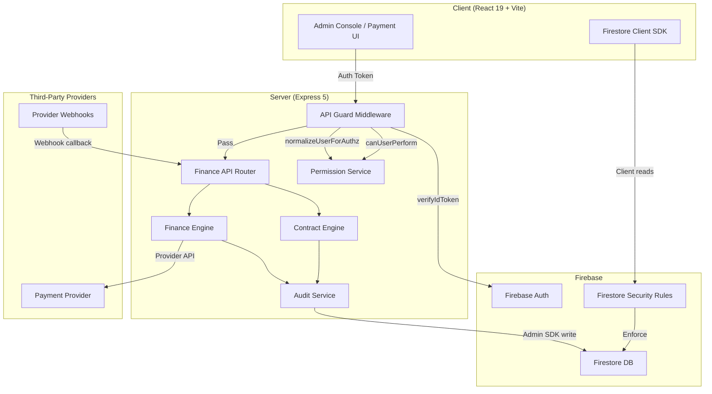
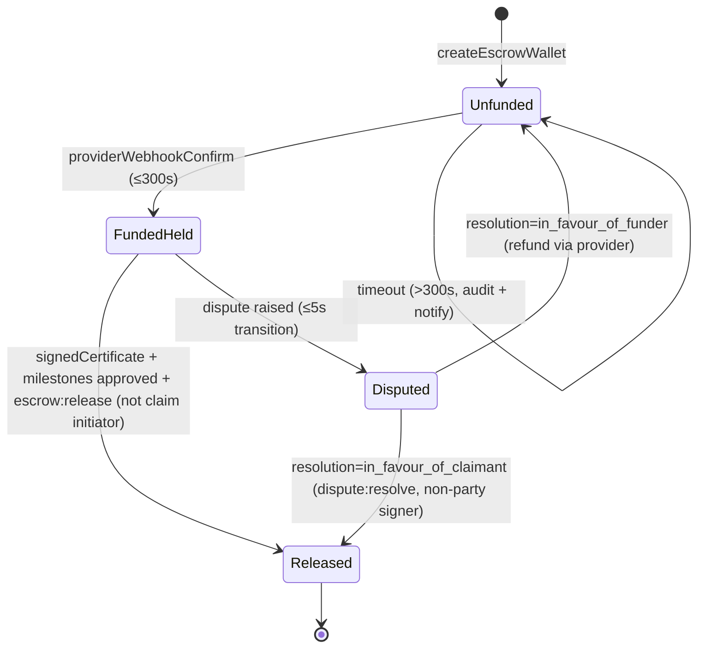
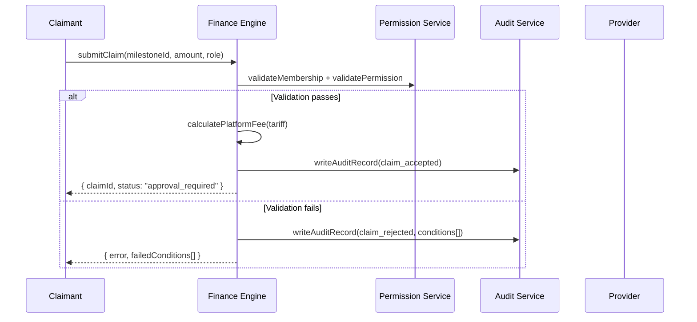

# Design Document

## Overview

This design hardens Architex's commercial control layer and role-based access enforcement for production readiness. The sprint delivers governed payment claim workflows, a 4-state escrow FSM, separation-of-duty controls on payment certification/release, contract signature gates, Firestore security rules enforcement, server-side API guards, immutable financial audit trails, and an admin governance console with configuration versioning.

The architecture follows the existing layered pattern:
- **Service layer** (`src/services/finance/`, `src/services/contractAdmin/`) — pure business logic with validation, state machines, and audit generation
- **API layer** (`src/lib/finance-api-router.ts`, `src/lib/roleMiddleware.ts`) — Express middleware enforcing auth, role, membership, scope, and separation-of-duty
- **Database layer** (`firestore.rules`) — client-side enforcement mirroring server-side decisions
- **UI layer** (`src/components/AdminGovernanceConsolePage.tsx`) — governed admin interface

Key design decisions:
1. **Architex does NOT hold funds** — all money movement is orchestrated through registered third-party providers. The system stores references, approvals, webhooks, and audit trails.
2. **Defence in depth** — Firestore rules and API guards produce identical allow/deny decisions for any (user, action, resource) tuple.
3. **Separation of duty** — claim submitter, certifier, and release approver must be three distinct UIDs.
4. **Immutable audit trail** — append-only records with tamper-detection, 5-year retention, no client-side mutation.

## Architecture



### State Machine — Escrow Lifecycle



### Payment Claim Governance Flow



## Components and Interfaces

### 1. Finance Engine (Enhanced `src/services/finance/`)

#### Payment Claim Governance Service (`src/services/finance/claimGovernanceService.ts`)

```typescript
interface ClaimValidationContext {
  claimantUid: string;
  claimantRole: FinancePartyRole;
  projectId: string;
  milestoneId: string;
  claimedAmount: MoneyAmount;
  claimType: 'milestone' | 'stage' | 'deliverable' | 'package' | 'purchase_order' | 'resource_booking';
}

interface ClaimValidationResult {
  valid: boolean;
  failedConditions: Array<{
    conditionId: string; // machine-readable: 'MEMBERSHIP_INVALID', 'AMOUNT_EXCEEDS_MILESTONE', etc.
    description: string; // human-readable
  }>;
  platformFee?: {
    tariffId: string;
    feePercent: number;
    feeAmount: MoneyAmount;
    netPayable: MoneyAmount;
  };
}

interface GovernedPaymentClaim extends PaymentClaim {
  status: 'approval_required' | 'certified' | 'released' | 'rejected' | 'disputed';
  validationResult: ClaimValidationResult;
  platformFee?: ClaimValidationResult['platformFee'];
  partialReleases: Array<{ amount: MoneyAmount; releasedAtIso: string; releaseId: string }>;
  retentionRecord?: { retentionId: string; percent: number; amount: MoneyAmount };
}

// Exported functions
function validateAndSubmitClaim(ctx: ClaimValidationContext): Promise<GovernedPaymentClaim>;
function validatePartialRelease(claimId: string, amount: MoneyAmount): Promise<void>;
function applyRetention(claimId: string, projectId: string): Promise<RetentionRecord>;
function rejectDuplicateClaim(claimId: string, existingClaimId: string): ClaimValidationResult;
```

#### Escrow State Machine (`src/services/finance/escrowStateMachine.ts`)

```typescript
type EscrowState = 'Unfunded' | 'FundedHeld' | 'Released' | 'Disputed';

interface EscrowWallet {
  walletId: string;
  projectId: string;
  state: EscrowState;
  fundedAmount?: MoneyAmount;
  providerId: string;
  providerReference?: string;
  createdAtIso: string;
  lastTransitionAtIso: string;
  ownerId: string;
}

interface EscrowTransitionResult {
  success: boolean;
  wallet: EscrowWallet;
  auditRecord: FinanceAuditRecord;
  error?: {
    currentState: EscrowState;
    allowedTargets: EscrowState[];
    reason: string;
  };
}

// Valid transitions map
const VALID_TRANSITIONS: Record<EscrowState, EscrowState[]> = {
  Unfunded: ['FundedHeld'],
  FundedHeld: ['Released', 'Disputed'],
  Disputed: ['Released', 'Unfunded'], // Released = claimant wins, Unfunded = funder wins (refund)
  Released: [], // Terminal
};

function transitionEscrow(wallet: EscrowWallet, target: EscrowState, evidence: TransitionEvidence): EscrowTransitionResult;
function handleFundingTimeout(wallet: EscrowWallet): EscrowTransitionResult;
function raiseDispute(wallet: EscrowWallet, disputeReason: string): EscrowTransitionResult;
function resolveDispute(wallet: EscrowWallet, resolution: DisputeResolution): EscrowTransitionResult;
```

#### Payment Certification Controls (`src/services/finance/certificationControlService.ts`)

```typescript
interface CertificationRequest {
  claimId: string;
  certifierUid: string;
  certifiedAmount: MoneyAmount;
}

interface SeparationOfDutyCheck {
  submitterUid: string;
  certifierUid: string;
  releaseApproverUid: string;
  violations: Array<{
    constraint: 'submitter_is_certifier' | 'submitter_is_releaser' | 'certifier_is_releaser';
    actorA: string;
    actorB: string;
  }>;
  valid: boolean;
}

function certifyWithSeparationOfDuty(request: CertificationRequest): Promise<PaymentCertificate>;
function validateSeparationOfDuty(submitter: string, certifier: string, releaser: string): SeparationOfDutyCheck;
function createPayoutBatch(releases: ReleaseRequest[], providerId: string): PayoutBatch;
function generateFICAReport(partyId: string, transactions: Transaction[]): FICAReport;
```

### 2. Contract Engine (`src/services/contractAdmin/`)

#### Contract Gate Service (`src/services/contractAdmin/contractGateService.ts`)

```typescript
interface ContractTemplate {
  templateId: string;
  version: number;
  documentType: string;
  body: string;
  specialConditionSlots: number; // max 50
  active: boolean;
}

interface ContractInstance {
  contractId: string;
  templateId: string;
  templateVersion: number;
  projectId: string;
  parties: Array<{ uid: string; role: string; signatureRequired: boolean }>;
  specialConditions: Array<{ index: number; text: string; addedBy: string }>;
  redlineAnnotations: Array<{ field: string; oldValue: string; newValue: string; annotatedBy: string }>;
  signatures: Array<{ uid: string; role: string; signedAtIso: string; authorityRecordId: string }>;
  locked: boolean;
  lockedAtIso?: string;
  lockedVersion?: number;
  variations: string[]; // variation contract IDs
}

interface SignatureAuthority {
  authorityId: string;
  uid: string;
  documentTypes: string[];
  representingParty: string;
  validFrom: string;
  validTo?: string;
  active: boolean;
}

function generateContractFromProposal(proposalId: string, templateId: string): Promise<ContractInstance>;
function validateSignatureAuthority(uid: string, documentType: string, party: string): Promise<boolean>;
function signContract(contractId: string, signerUid: string): Promise<ContractInstance>;
function lockContract(contractId: string): Promise<ContractInstance>;
function isContractGateSatisfied(projectId: string): boolean;
function createContractVariation(parentContractId: string, variation: VariationInput): Promise<ContractInstance>;
```

### 3. API Guard Middleware (`src/lib/roleMiddleware.ts` — enhanced)

```typescript
interface APIGuardConfig {
  action: PermissionAction;
  requireProjectMembership: boolean;
  separationOfDutyCheck?: {
    claimField: string; // field on the request body containing claim reference
    forbiddenActors: ('submitter' | 'certifier' | 'releaser')[];
  };
  commercialGateRequired?: boolean;
}

// New middleware factory
function requirePermissionWithGuards(config: APIGuardConfig): RequestHandler;

// Middleware chain for payment endpoints:
// requireAuth → requirePermission('payment:manage') → requireProjectMembership → requireSeparationOfDuty → requireCommercialGate
```

### 4. Firestore Security Rules (enhanced `firestore.rules`)

New rules to add:
- **Escrow collection**: deny all client writes (server-only via Admin SDK)
- **Payments collection**: deny all client writes (server-only)
- **Audit trail collections**: append-only (create allowed, update/delete denied)
- **Admin role elevation**: deny client-side role changes to 'admin' or 'platform_admin'
- **Package-scoped access**: validate `awardedContractorId` matches requesting UID
- **Task-scoped access**: validate `assigneeId` or `assignedFreelancerId` matches UID
- **Default-deny**: catch-all rule at the end denying unmatched paths

### 5. Audit Service (Enhanced `src/services/finance/auditTrailService.ts`)

```typescript
interface ImmutableAuditRecord {
  auditId: string;
  actorUid: string;
  actorRole: string;
  action: AuditAction;
  timestampIso: string; // ISO 8601
  monetaryAmount?: MoneyAmount;
  targetResourceId: string;
  evidenceReferences: Array<{
    type: 'provider_transaction' | 'document_version' | 'approval_chain' | 'webhook_event' | 'certificate';
    referenceId: string;
  }>;
  previousState?: string;
  newState?: string;
  humanConfirmation?: {
    certifierUid?: string;
    certifierRole?: string;
    approverUid?: string;
    approverRole?: string;
  };
  immutable: true; // always true — enforced by Firestore rules
  retentionExpiresAtIso: string; // createdAt + 5 years
}

type AuditAction =
  | 'claim_submitted' | 'claim_rejected' | 'claim_certified'
  | 'payment_released' | 'payment_failed' | 'refund_initiated'
  | 'escrow_funded' | 'escrow_released' | 'escrow_disputed' | 'escrow_timeout'
  | 'contract_generated' | 'contract_signed' | 'contract_locked' | 'contract_varied'
  | 'provider_webhook_received'
  | 'tamper_attempt';

function writeImmutableAuditRecord(record: Omit<ImmutableAuditRecord, 'auditId' | 'immutable' | 'retentionExpiresAtIso'>): Promise<string>;
function rejectAuditMutation(actorUid: string, targetRecordId: string, operation: string): Promise<void>;
```

### 6. Admin Governance Console (`src/components/AdminGovernanceConsolePage.tsx`)

```typescript
interface AdminGovernanceConsoleProps {
  user: UserProfile;
}

// Sub-views
type AdminView =
  | 'project-search'
  | 'user-management'
  | 'feature-flags'
  | 'tariff-registry'
  | 'payment-rates'
  | 'escrow-oversight'
  | 'ai-governance'
  | 'flagged-messages'
  | 'audit-viewer'
  | 'override-log';
```

### 7. Configuration Versioning Service (`src/services/configVersioningService.ts`)

```typescript
interface ConfigVersion<T = unknown> {
  versionId: string;
  configKey: string;
  configType: 'feature_flag' | 'tariff_rule' | 'payment_rate' | 'ai_prompt';
  previousValue: T;
  newValue: T;
  modifierUid: string;
  timestampIso: string;
  reason?: string; // required for payment_rate and ai_prompt
  effectiveDate?: string; // required for tariff_rule
}

function createConfigVersion<T>(configKey: string, type: ConfigVersion['configType'], prev: T, next: T, modifierUid: string, reason?: string, effectiveDate?: string): ConfigVersion<T>;
function getVersionHistory(configKey: string, limit?: number): Promise<ConfigVersion[]>;
function validateTariffEffectiveDate(effectiveDate: string): boolean; // must be current or future
function preventDeletion(versionId: string): void; // throws if attempted
```

## Data Models

### Firestore Collections (new/enhanced)

| Collection | Purpose | Access |
|---|---|---|
| `escrow_wallets/{walletId}` | Escrow FSM state | Server-only writes |
| `payment_claims/{claimId}` | Governed payment claims | Server-only writes |
| `payment_certificates/{certId}` | Certified payments | Server-only writes |
| `release_requests/{reqId}` | Provider release instructions | Server-only writes |
| `contracts/{contractId}` | Contract instances with signatures | Server writes + client reads for participants |
| `signature_authorities/{authId}` | Verified signature authority records | Admin writes, participant reads |
| `audit_logs/{auditId}` | Immutable financial audit trail | Append-only (create, no update/delete) |
| `config_versions/{versionId}` | Configuration change history | Admin reads, server writes |
| `fica_reports/{reportId}` | FICA threshold reports | Admin reads, server writes |
| `payout_batches/{batchId}` | Grouped release batches | Server-only writes |

### Escrow Wallet Document

```typescript
{
  walletId: string;
  projectId: string;
  state: 'Unfunded' | 'FundedHeld' | 'Released' | 'Disputed';
  fundedAmount: { currency: 'ZAR'; amount: number };
  providerId: string;
  providerReference: string;
  ownerId: string; // project owner UID
  claimInitiatorUid: string; // for separation-of-duty
  linkedCertificateIds: string[];
  createdAtIso: string;
  lastTransitionAtIso: string;
  transitionHistory: Array<{
    fromState: string;
    toState: string;
    actorUid: string;
    timestampIso: string;
    evidenceRef: string;
  }>;
}
```

### Immutable Audit Record Document

```typescript
{
  auditId: string;
  actorUid: string;
  actorRole: string;
  action: string;
  timestampIso: string; // ISO 8601
  monetaryAmount?: { currency: 'ZAR'; amount: number };
  targetResourceId: string;
  evidenceReferences: Array<{ type: string; referenceId: string }>;
  previousState?: string;
  newState?: string;
  humanConfirmation?: { certifierUid?: string; approverUid?: string };
  immutable: true;
  retentionExpiresAtIso: string; // +5 years from creation
}
```

### Contract Instance Document

```typescript
{
  contractId: string;
  templateId: string;
  templateVersion: number;
  projectId: string;
  parties: Array<{ uid: string; role: string; signatureRequired: boolean }>;
  specialConditions: Array<{ index: number; text: string; addedBy: string }>;
  redlineAnnotations: Array<{ field: string; oldValue: string; newValue: string }>;
  signatures: Array<{ uid: string; role: string; signedAtIso: string; authorityRecordId: string }>;
  locked: boolean;
  lockedAtIso?: string;
  immutableVersionId?: string;
  variations: string[];
  auditTrail: Array<{ action: string; actorUid: string; timestampIso: string }>;
}
```


## Correctness Properties

*A property is a characteristic or behavior that should hold true across all valid executions of a system — essentially, a formal statement about what the system should do. Properties serve as the bridge between human-readable specifications and machine-verifiable correctness guarantees.*

### Property 1: Payment claim validation correctness

*For any* claim submission context (claimant UID, role, project, milestone/package/deliverable, amount), the Finance Engine SHALL accept the claim with status "approval_required" if and only if all type-specific preconditions are satisfied (active membership with correct role, referenced entity exists and is in valid state, claimed amount does not exceed the entity's value, and no duplicate pending/disputed claim exists from the same claimant). Otherwise it SHALL reject with a structured error listing each failed condition.

**Validates: Requirements 1.1, 1.2, 1.3, 1.4, 1.5, 1.6, 1.10, 1.11**

### Property 2: Platform fee calculation invariant

*For any* valid payment claim and active fee schedule with tariff percentage P, the platform fee SHALL equal claimedAmount × P, the net payable SHALL equal claimedAmount − fee, and the claim record SHALL include the fee amount, net payable, and tariff identifier.

**Validates: Requirements 1.7**

### Property 3: Partial release balance invariant

*For any* certified claim with certified amount C, total previously released amounts R, and retention held H, a partial release request of amount A SHALL be accepted if and only if A ≤ (C − R − H). The remaining releasable balance SHALL never go negative.

**Validates: Requirements 1.8**

### Property 4: Retention calculation correctness

*For any* payment claim amount A and CommercialBaseline with retention percentage P (where 0 ≤ P ≤ 10), the retention held SHALL equal A × P / 100, and a RetentionRecord SHALL be created linking the claim and the project's defects liability period.

**Validates: Requirements 1.9**

### Property 5: Successful claim audit trail completeness

*For any* successfully validated and persisted payment claim, the audit record SHALL contain the claimant role, claim amount, linked milestone or package identifier, and the acceptance timestamp.

**Validates: Requirements 1.12**

### Property 6: Escrow state machine transition validity

*For any* escrow wallet in state S and attempted transition to state T, the state machine SHALL accept the transition if and only if T is in VALID_TRANSITIONS[S]. Invalid transitions SHALL be rejected with a structured error containing the current state and the list of allowed target states.

**Validates: Requirements 2.1, 2.7**

### Property 7: Disputed wallet blocks all releases

*For any* escrow wallet in Disputed state and any release request, the state machine SHALL reject the release and record the attempt in the audit trail including actor UID, timestamp, and rejection reason.

**Validates: Requirements 2.5**

### Property 8: Escrow transition audit completeness

*For any* valid escrow state transition, the audit record SHALL contain actor UID, ISO-8601 timestamp, previous state, new state, and an evidence reference linking to the triggering artifact.

**Validates: Requirements 2.8**

### Property 9: Three-party separation of duty

*For any* payment flow involving a submitter UID, certifier UID, and release approver UID, the Finance Engine SHALL accept the action if and only if all three UIDs are distinct. When any two resolve to the same user, the action SHALL be rejected with an error indicating which constraint is violated.

**Validates: Requirements 3.1, 3.3**

### Property 10: Payout batch constraints

*For any* set of certified release requests grouped by provider, each batch SHALL contain no more than 200 requests, and each batch SHALL have a unique batch reference identifier.

**Validates: Requirements 3.4**

### Property 11: FICA threshold reporting

*For any* transaction where the single amount exceeds R50,000 OR the aggregate of transactions for a single party within a calendar day exceeds R50,000, the Finance Engine SHALL generate a FICA report containing the party identifier, transaction references, and the triggering total amount.

**Validates: Requirements 3.7**

### Property 12: Signature authority enforcement

*For any* contract signature attempt, the Contract Engine SHALL accept the signature if and only if the signer holds a registered, active SignatureAuthority record for the document type and the contracting party they represent. Attempts without valid authority SHALL be rejected with an error and audit record.

**Validates: Requirements 4.3, 4.9**

### Property 13: Contract locking on signature completion

*For any* contract with N required signatures, the contract SHALL be locked as an Immutable_Version if and only if exactly N valid signatures have been collected. While fewer than N signatures are present, escrow activation and payment schedule creation SHALL be blocked.

**Validates: Requirements 4.4, 4.5**

### Property 14: Contract variation signature requirement

*For any* contract variation that modifies contract sum, payment schedule, rates, penalties, retention percentage, or fee structure, the Contract Engine SHALL require fresh signatures. Variations that do not modify these fields SHALL not require new signatures.

**Validates: Requirements 4.6**

### Property 15: API Guard permission agreement with canUserPerform

*For any* (user, action, resource) tuple, the API Guard middleware SHALL produce the same allow/deny decision as the Permission_Service canUserPerform function using the same ROLE_PERMISSIONS and PROJECT_ACCESS_PERMISSIONS matrices.

**Validates: Requirements 6.2**

### Property 16: API Guard opaque error format

*For any* request rejected by the API Guard (whether due to missing auth, invalid role, missing membership, or insufficient permission), the response SHALL be HTTP 403 with JSON body `{ error: string, requestId: string }` where the error string does not reveal which specific check failed.

**Validates: Requirements 6.4**

### Property 17: Payment write commercial gate and separation of duty

*For any* payment-related write request (payment:manage, escrow:release), the API Guard SHALL reject the request if the requesting user is the same user who initiated or certified the payment milestone OR if the project's commercialGateOpen field is not true.

**Validates: Requirements 6.3**

### Property 18: Immutable audit record structure

*For any* financial event (payment claim, certification, release, refund, dispute, escrow transition, contract action, provider webhook), the Audit Service SHALL produce an immutable record containing actor UID, actor role, ISO 8601 timestamp, action type, and at least one evidence reference. For monetary events, the record SHALL also include the monetary amount.

**Validates: Requirements 8.1, 8.2, 8.3, 8.5**

### Property 19: Audit record tamper protection

*For any* existing audit record, any attempt to modify or delete the record SHALL be rejected with a 403 status, and a separate tamper-attempt audit entry SHALL be created recording the actor UID, target record ID, and attempted operation.

**Validates: Requirements 8.4**

### Property 20: Audit record 5-year retention

*For any* financial audit record, the retentionExpiresAtIso field SHALL be set to exactly 5 years from the record creation date, and no automated or manual purging SHALL be permitted within the retention period.

**Validates: Requirements 8.7**

### Property 21: Payment release human confirmation

*For any* payment release audit record, the record SHALL include both provider references (provider ID, transaction reference) and human confirmation references (certifier UID, certifier role, approver UID, approver role).

**Validates: Requirements 8.6**

### Property 22: Admin override requires documented reason

*For any* admin override action that bypasses a financial or professional gate, the Admin Console SHALL accept the override if and only if a documented reason of at least 10 characters is provided. The resulting audit record SHALL include the overriding admin UID, target action, target project ID, reason text, and ISO 8601 timestamp, and SHALL be immutable after creation.

**Validates: Requirements 9.9, 9.10**

### Property 23: Configuration versioning completeness

*For any* configuration change (feature flag, tariff rule, payment rate, AI prompt), the system SHALL create a version record containing previous value, new value, modifier UID, and UTC timestamp. For tariff rules, the effective date must be current or future (past dates rejected). For payment rates and AI prompts, a reason of at least 10 characters is required. Version records SHALL never be deleted.

**Validates: Requirements 10.1, 10.2, 10.3, 10.4, 10.5, 10.6**

### Property 24: Configuration version history ordering

*For any* governed configuration item, retrieving its version history SHALL return all records in reverse-chronological order by timestamp.

**Validates: Requirements 10.7**

### Property 25: Provider registration enforcement

*For any* payment record, release request, or payout action at write time, the Finance Engine SHALL reject the operation if the record is missing a valid providerId (referencing a registered and liveConfigured provider) or a provider transaction reference. Every persisted record SHALL contain providerId, provider name, and provider-issued reference.

**Validates: Requirements 11.1, 11.2, 11.6**

### Property 26: Dual confirmation for payment completion

*For any* release, refund, or payout action, the Finance Engine SHALL mark the action as complete if and only if both a provider confirmation (webhook or API response with provider-issued reference) AND a human authorization (signed payment certificate or admin approval with escrow:release permission) are present.

**Validates: Requirements 11.4**

## Error Handling

### Error Response Strategy

All API errors follow a consistent structure:

```typescript
interface APIErrorResponse {
  error: string;        // Generic message (does NOT reveal internal failure reason for 401/403)
  requestId: string;    // Correlation ID for audit trail lookup
  failedConditions?: Array<{
    conditionId: string;  // Machine-readable identifier
    description: string;  // Human-readable explanation
  }>;
}
```

### Error Categories

| Category | HTTP Status | Behavior |
|---|---|---|
| Unauthenticated | 401 | Missing/expired/invalid Firebase token. Opaque error message. |
| Unauthorized | 403 | Valid auth but insufficient permissions. Opaque error — does not reveal which check failed. |
| Validation failure | 422 | Claim validation failures. Returns structured `failedConditions[]`. |
| Separation of duty violation | 403 | Specific constraint indicator (e.g., `submitter_is_certifier`). |
| Invalid state transition | 409 | Returns current state and allowed target states. |
| Provider timeout | 504 | Provider did not confirm within timeout. Creates audit record and notification. |
| Duplicate claim | 409 | Returns existing claim ID and status. |
| Tamper attempt | 403 | Audit mutation attempt. Creates separate tamper-attempt audit entry. |

### Failure Recovery

1. **Provider payment failure**: Revert escrow to FundedHeld, record failure reason, notify release approver and claim submitter within 60 seconds.
2. **Webhook timeout (300s for escrow, 120s for general)**: Mark transition as timed out, write timeout audit record, emit inbox notification.
3. **Validation errors**: Never persist partial state. Return all failed conditions atomically.
4. **Separation of duty breach**: Reject immediately, preserve pre-action state, audit the attempt.

## Testing Strategy

### Dual Testing Approach

This feature uses a combination of property-based tests and example-based tests:

- **Property-based tests** (via `fast-check`): Verify universal correctness properties across randomly generated inputs. Each property runs 100+ iterations.
- **Unit tests** (Vitest): Verify specific examples, edge cases, error conditions, and integration points.
- **Firestore emulator tests**: Verify security rules produce correct allow/deny decisions.
- **Integration tests**: Verify end-to-end flows through API middleware and Firestore.

### Property-Based Testing Configuration

- **Library**: `fast-check` (standard PBT library for TypeScript/Vitest)
- **Minimum iterations**: 100 per property
- **Tag format**: `Feature: commercial-control-rbac-hardening, Property {number}: {title}`
- Each property maps 1:1 to a `describe` block in the test file
- Generators produce random but valid domain objects (claims, wallets, users, contracts)

### Test Organization

| Test File | Coverage |
|---|---|
| `src/__tests__/claimGovernance.property.test.ts` | Properties 1-5 (claim validation, fees, partial releases, retention, audit) |
| `src/__tests__/escrowStateMachine.property.test.ts` | Properties 6-8 (state transitions, dispute blocking, audit) |
| `src/__tests__/separationOfDuty.property.test.ts` | Property 9 (three-party separation) |
| `src/__tests__/payoutBatch.property.test.ts` | Properties 10-11 (batch constraints, FICA) |
| `src/__tests__/contractGate.property.test.ts` | Properties 12-14 (signature authority, locking, variations) |
| `src/__tests__/apiGuard.property.test.ts` | Properties 15-17 (permission agreement, opaque errors, commercial gate) |
| `src/__tests__/auditService.property.test.ts` | Properties 18-21 (immutable records, tamper protection, retention, human confirmation) |
| `src/__tests__/adminGovernance.property.test.ts` | Properties 22-24 (override reason, config versioning, ordering) |
| `src/__tests__/providerEnforcement.property.test.ts` | Properties 25-26 (provider registration, dual confirmation) |
| `scripts/run-firestore-rules-tests.mjs` | Requirements 5.1-5.10, 7.1-7.9 (Firestore security rules + unauthorized access) |

### Unit Test Coverage (Example-Based)

- Escrow funding timeout scenario (Requirement 2.9)
- Provider payment failure recovery (Requirement 3.5)
- Proposal-to-contract conversion (Requirement 4.1)
- Contract version linkage for claims/disputes (Requirement 4.7)
- Missing/expired token returns 401 (Requirement 6.7)
- Admin console role-based access (Requirement 9.1)
- Feature flag 50-version retention (Requirement 9.3)
- Escrow oversight view rendering (Requirement 9.6)
- Flagged messages view rendering (Requirement 9.8)
- Override review same/different admin flag (Requirement 9.11)
- Audit viewer 500-record cap (Requirement 9.12)
- Payment UI disclaimer display (Requirement 11.3)
- Provider timeout 120s handling (Requirement 11.5)

### Firestore Emulator Test Coverage

Each acceptance criterion in Requirement 5 and 7 has at least one positive test (authorized access granted) and one negative test (unauthorized access denied):

- Project membership enforcement (5.1)
- Package-limited subcontractor access (5.2)
- Task-limited freelancer access (5.3)
- Supplier access scoping (5.4)
- Payment/escrow server-only writes (5.5)
- Admin role elevation denial (5.6)
- Composite write denial (5.7)
- Audit trail append-only (5.8)
- Default-deny posture (5.9)
- Non-member project access denial (7.1)
- Cross-package subcontractor denial (7.2)
- Cross-task freelancer denial (7.3)
- Cross-package supplier denial (7.4)
- Claim submitter self-certification denial (7.5)
- Client-side admin elevation denial (7.6)
- Admin override without reason denial (7.7)
- Unauthenticated write denial (7.8)

### Shared Test Suite for Rules/API Agreement

Requirement 6.6 mandates that Firestore rules and API Guard produce identical decisions. A shared test matrix covers:
- All PermissionAction values × all ProjectAccessRole combinations
- Assertions verify both layers agree on allow/deny for each tuple
