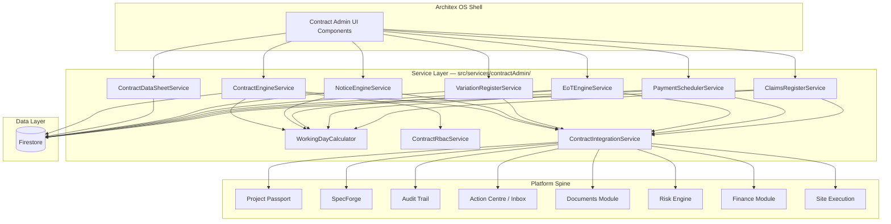
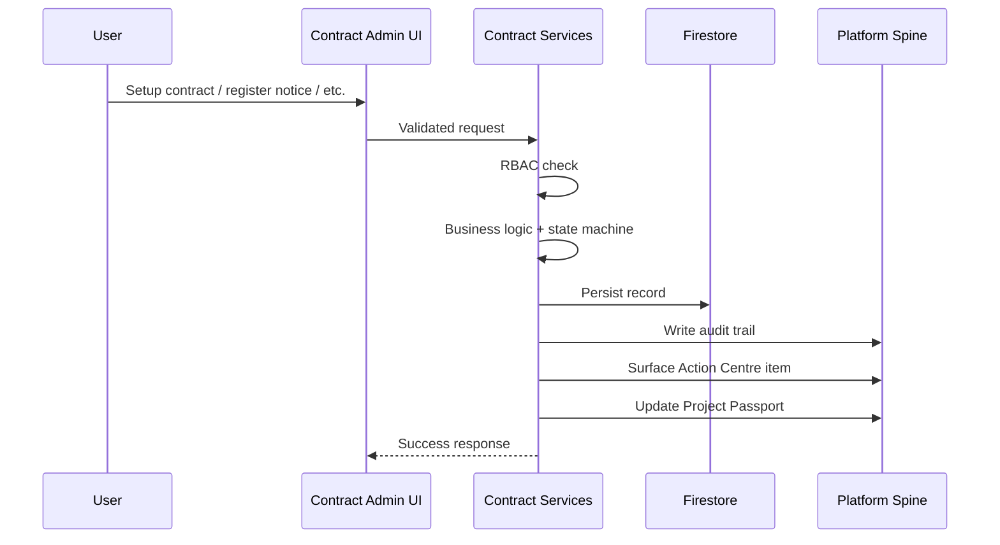
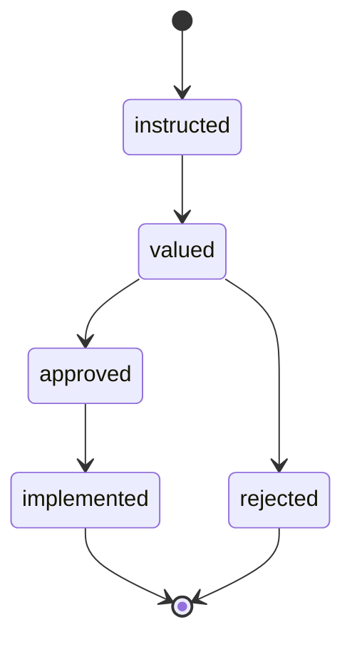
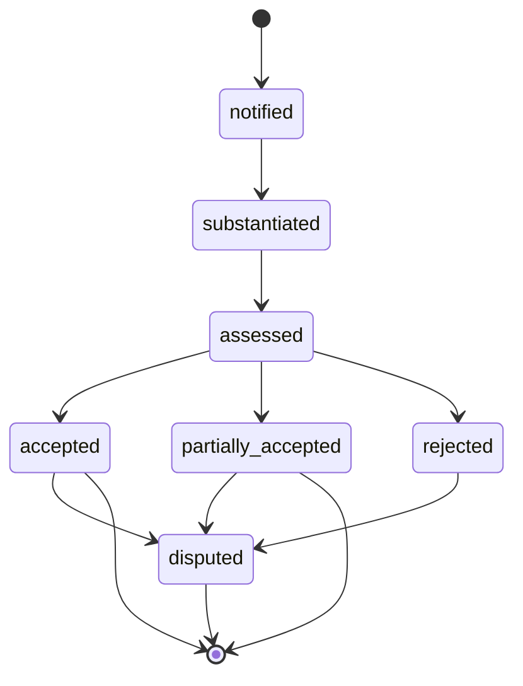
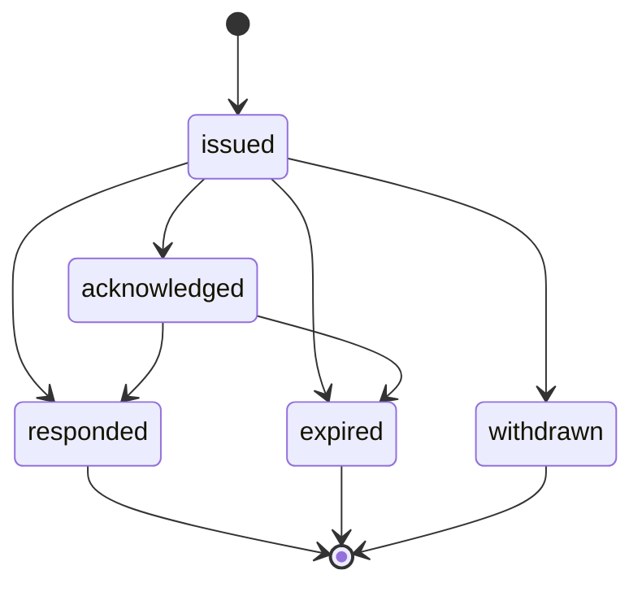
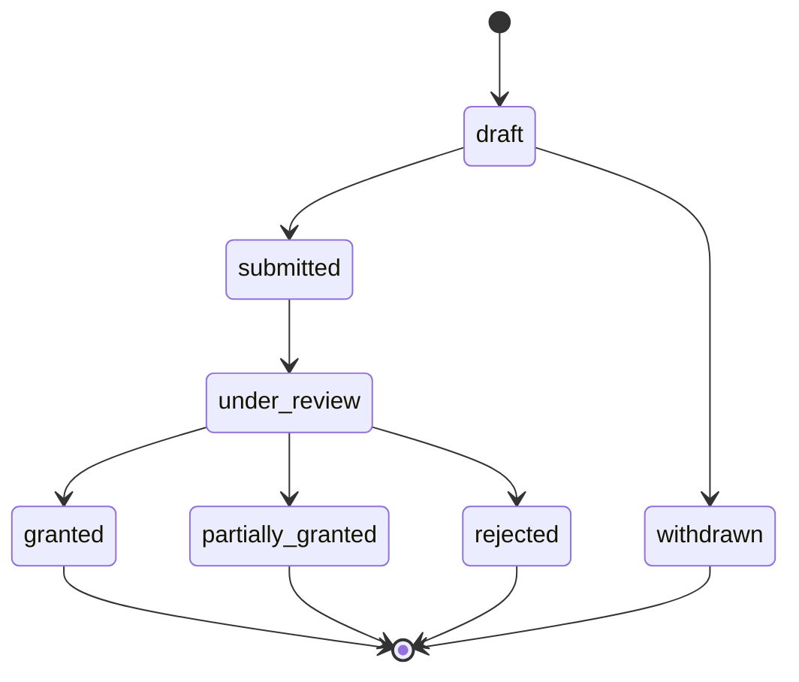

# Design Document: Contract Administration & Legal Layer

## Overview

The Contract Administration feature introduces a contract-awareness layer to the Architex platform spanning Module 7 (Site Execution) and Module 8 (Closeout + Payment + Audit). It models the complete contract lifecycle — setup, data sheet, notices, deadlines, variations, extensions of time, payment scheduling, claims, and dispute escalation — for four South African standard contract forms: JBCC PBA, NEC ECC, GCC 2025, and FIDIC.

The design follows Architex's established service-layer pattern: pure business logic services in `src/services/contractAdmin/` that operate on typed inputs, return typed outputs, and integrate with the platform spine (Project Passport, SpecForge, Audit Trail, Action Centre) through event adapters.

### Design Decisions

1. **Dedicated service directory**: All contract administration services live under `src/services/contractAdmin/` as a bounded domain (similar to `finance/`, `siteExecution/`).
2. **State machines for workflows**: Variation orders, EoT claims, claims, and notices use explicit transition maps (same pattern as `ncrService.ts`).
3. **Working Day calculator as pure function**: Calendar logic is isolated, testable, and reused by all deadline-aware services.
4. **Contract-form polymorphism via configuration**: Rather than per-form class hierarchies, behaviour differences are driven by a `ContractFormConfig` data structure that encodes form-specific parameters, notice types, and deadline rules.
5. **Advisory-only posture**: Every output carries disclaimer metadata; UI components conditionally block rendering if disclaimer fails to mount.
6. **Immutable audit records**: All state transitions write append-only audit records following the existing `AuditRecord` shape.

---

## Architecture

### High-Level System Diagram



### Data Flow



---

## Components and Interfaces

### Service Module Structure

```
src/services/contractAdmin/
├── index.ts                        # Public barrel export
├── contractTypes.ts                # All TypeScript types for the domain
├── contractEngineService.ts        # Contract setup + configuration
├── contractDataSheetService.ts     # Central parameter reference
├── noticeEngineService.ts          # Notice registration + deadline tracking
├── variationRegisterService.ts     # Variation order lifecycle
├── eotEngineService.ts             # Extension of Time claims
├── paymentSchedulerService.ts      # Payment certificate scheduling
├── claimsRegisterService.ts        # Loss/expense claims + disputes
├── workingDayCalculator.ts         # Pure date arithmetic (SA holidays)
├── contractRbacService.ts          # Role-based access control
├── contractIntegrationService.ts   # Platform spine write-back adapter
├── contractFormConfigs.ts          # Per-form configuration data
└── disclaimerService.ts            # Disclaimer rendering gate
```

### Key Interfaces (Low-Level)

#### ContractEngineService

```typescript
// contractEngineService.ts

export interface ContractSetupInput {
  projectId: string;
  contractForm: ContractForm;
  parties: ContractParty[];            // min 2 (employer + contractor)
  commencementDate: string;            // ISO date
  practicalCompletionDate: string;     // ISO date, must be > commencement
  contractSum: number;                 // 1.00 – 999,999,999,999.99 ZAR
  clauseElections: ClauseElection[];
  formSpecificParams: FormSpecificParams;
  setupBy: string;                     // userId
}

export interface ContractSetupResult {
  contractId: string;
  status: 'active';
  auditRecordId: string;
}

export function setupContract(input: ContractSetupInput): Promise<ContractSetupResult>;
export function validateContractSetup(input: ContractSetupInput): ValidationResult;
export function getContractConfig(projectId: string): Promise<ContractConfig | null>;
export function updateContractParameter(
  projectId: string,
  field: string,
  value: unknown,
  updatedBy: string
): Promise<void>;
```

#### NoticeEngineService

```typescript
// noticeEngineService.ts

export interface NoticeRegistrationInput {
  projectId: string;
  noticeType: string;               // from contract-form-specific types
  issuingPartyId: string;
  receivingPartyId: string;
  referenceClause: string;          // clause number e.g. "23.1"
  dateIssued: string;               // ISO date
  subject: string;                  // max 500 chars
  linkedDocumentIds: string[];      // 0–20 references
  registeredBy: string;             // userId
}

export type NoticeStatus = 'issued' | 'acknowledged' | 'responded' | 'expired' | 'withdrawn';

export function registerNotice(input: NoticeRegistrationInput): Promise<NoticeRecord>;
export function acknowledgeNotice(projectId: string, noticeId: string, userId: string): Promise<void>;
export function respondToNotice(projectId: string, noticeId: string, responseData: NoticeResponse): Promise<void>;
export function withdrawNotice(projectId: string, noticeId: string, userId: string): Promise<void>;
export function calculateDeadline(
  dateIssued: string,
  responsePeriodDays: number,
  dayType: 'working' | 'calendar',
  holidayCalendar: PublicHoliday[]
): string; // ISO date of deadline
export function getActiveNotices(projectId: string): Promise<NoticeRecord[]>;
export function runDeadlineCheck(projectId: string): Promise<DeadlineCheckResult[]>;
```

#### VariationRegisterService

```typescript
// variationRegisterService.ts

export type VariationStatus = 'instructed' | 'valued' | 'approved' | 'rejected' | 'implemented';

const VARIATION_TRANSITIONS: Record<VariationStatus, VariationStatus[]> = {
  instructed: ['valued'],
  valued: ['approved', 'rejected'],
  approved: ['implemented'],
  rejected: [],
  implemented: [],
};

export interface VariationInput {
  projectId: string;
  variationNumber: string;            // unique within project
  description: string;                // max 2000 chars
  originatingInstruction: string;
  dateInstructed: string;             // ISO date
  linkedSiteInstructionId?: string;
  linkedRfiId?: string;
  createdBy: string;
}

export function createVariation(input: VariationInput): Promise<VariationRecord>;
export function valueVariation(
  projectId: string,
  variationId: string,
  costImpact: { type: 'addition' | 'omission'; amount: number },
  timeImpactDays: number,
  valuedBy: string
): Promise<void>;
export function transitionVariation(
  projectId: string,
  variationId: string,
  toStatus: VariationStatus,
  actorId: string
): Promise<void>;
export function isValidVariationTransition(from: VariationStatus, to: VariationStatus): boolean;
export function getCumulativeSummary(projectId: string): Promise<VariationCumulativeSummary>;
export function linkToSpecForge(projectId: string, variationId: string, specItemId: string): Promise<void>;
```

#### EoTEngineService

```typescript
// eotEngineService.ts

export type EoTStatus = 'draft' | 'submitted' | 'under_review' | 'granted' | 'partially_granted' | 'rejected' | 'withdrawn';

export type DelayCause =
  | 'weather' | 'materials' | 'labour' | 'client'
  | 'professional' | 'contractor' | 'unforeseen_ground_conditions' | 'force_majeure';

export interface EoTClaimInput {
  projectId: string;
  cause: DelayCause;
  periodClaimedDays: number;          // 1–365 working days
  delayEventDate: string;             // ISO date
  narrative: string;                  // max 2000 chars
  evidenceAttachments: EvidenceAttachment[];  // min 1
  createdBy: string;
}

export function createEoTClaim(input: EoTClaimInput): Promise<EoTClaimRecord>;
export function submitEoTClaim(projectId: string, claimId: string, submittedBy: string): Promise<void>;
export function reviewEoTClaim(
  projectId: string,
  claimId: string,
  decision: 'granted' | 'partially_granted' | 'rejected',
  approvedDays?: number,
  reviewedBy: string
): Promise<void>;
export function calculateNotificationDeadline(
  contractForm: ContractForm,
  delayEventDate: string,
  holidayCalendar: PublicHoliday[]
): { deadline: string; remainingDays: number };
```

#### PaymentSchedulerService

```typescript
// paymentSchedulerService.ts

export type PaymentCycleStatus = 'pending' | 'certificate_issued' | 'payment_confirmed' | 'overdue';

export interface PaymentScheduleEntry {
  id: string;
  cycleNumber: number;
  valuationDate: string;
  certificateDeadline: string;
  paymentDeadline: string;
  status: PaymentCycleStatus;
  certifiedAmount?: number;
  certificateId?: string;
}

export function generateSchedule(
  commencementDate: string,
  completionDate: string,
  paymentIntervalDays: number,
  holidayCalendar: PublicHoliday[]
): PaymentScheduleEntry[];
export function regenerateRemainingSchedule(
  projectId: string,
  revisedCompletionDate: string
): Promise<void>;
export function linkCertificate(
  projectId: string,
  scheduleEntryId: string,
  certificateId: string,
  certifiedAmount: number
): Promise<void>;
export function calculateRetention(
  cumulativeCertified: number,
  retentionPercentage: number,
  retentionLimit: number
): { retentionHeld: number; atLimit: boolean };
export function runPaymentDeadlineCheck(projectId: string): Promise<PaymentOverdueResult[]>;
```

#### ClaimsRegisterService

```typescript
// claimsRegisterService.ts

export type ClaimType = 'loss_and_expense' | 'disruption' | 'prolongation' | 'varied_work';
export type ClaimStatus = 'notified' | 'substantiated' | 'assessed' | 'accepted' | 'partially_accepted' | 'rejected' | 'disputed';

const CLAIM_TRANSITIONS: Record<ClaimStatus, ClaimStatus[]> = {
  notified: ['substantiated'],
  substantiated: ['assessed'],
  assessed: ['accepted', 'partially_accepted', 'rejected'],
  accepted: ['disputed'],
  partially_accepted: ['disputed'],
  rejected: ['disputed'],
  disputed: [],
};

export function registerClaim(input: ClaimInput): Promise<ClaimRecord>;
export function transitionClaim(
  projectId: string,
  claimId: string,
  toStatus: ClaimStatus,
  actorId: string,
  reason: string
): Promise<void>;
export function isValidClaimTransition(from: ClaimStatus, to: ClaimStatus): boolean;
export function registerDissatisfaction(
  projectId: string,
  claimId: string,
  noticeDate: string,
  actorId: string
): Promise<{ adjudicationDeadline: string }>;
export function getCumulativeSummary(projectId: string): Promise<ClaimsCumulativeSummary>;
```

#### WorkingDayCalculator (Pure Function Module)

```typescript
// workingDayCalculator.ts

export interface PublicHoliday {
  date: string;       // ISO date YYYY-MM-DD
  name: string;
  year: number;
}

export function isWorkingDay(date: string, holidays: PublicHoliday[]): boolean;
export function addWorkingDays(startDate: string, days: number, holidays: PublicHoliday[]): string;
export function countWorkingDaysBetween(startDate: string, endDate: string, holidays: PublicHoliday[]): number;
export function getNextWorkingDay(date: string, holidays: PublicHoliday[]): string;
export function getRemainingWorkingDays(fromDate: string, deadline: string, holidays: PublicHoliday[]): number;
export function getSouthAfricanHolidays(year: number): PublicHoliday[];
```

#### ContractRbacService

```typescript
// contractRbacService.ts

export type ContractFeature =
  | 'contract_setup' | 'notices' | 'variations' | 'payment_schedule'
  | 'claims' | 'eot' | 'data_sheet_view' | 'data_sheet_edit';

export type ContractPermission = 'read' | 'write' | 'approve';

export function getPermissions(
  userRole: UserRole,
  feature: ContractFeature,
  projectAssignment: ProjectAssignment
): ContractPermission[];

export function canAccess(
  userRole: UserRole,
  feature: ContractFeature,
  permission: ContractPermission,
  projectAssignment: ProjectAssignment
): boolean;

export function resolveMultiRolePermissions(
  roles: UserRole[],
  feature: ContractFeature,
  projectAssignment: ProjectAssignment
): ContractPermission[];
```

#### ContractIntegrationService

```typescript
// contractIntegrationService.ts

export interface IntegrationWriteResult {
  success: boolean;
  targetModule: string;
  retryCount: number;
  failedSyncAlertId?: string;
}

export function writeToProjectPassport(projectId: string, update: PassportContractUpdate): Promise<IntegrationWriteResult>;
export function writeToAuditTrail(projectId: string, record: ContractAuditRecord): Promise<IntegrationWriteResult>;
export function surfaceToActionCentre(event: ContractWorkflowEvent): Promise<IntegrationWriteResult>;
export function writeToSpecForge(projectId: string, changeRecord: SpecForgeChangeRecord): Promise<IntegrationWriteResult>;
export function registerDocument(projectId: string, docMeta: ContractDocumentMeta): Promise<IntegrationWriteResult>;
export function createRiskEvent(projectId: string, risk: ContractRiskEvent): Promise<IntegrationWriteResult>;
export function retryWithBackoff<T>(fn: () => Promise<T>, maxRetries: number, delayMs: number): Promise<T>;
```

### UI Components

All contract admin UI renders inside the Architex OS shell following the SpecForge layout pattern:

```
src/components/
├── ContractAdminDashboard.tsx       # Main entry, tab-based navigation
├── ContractSetupWizard.tsx          # Multi-step contract configuration
├── ContractDataSheet.tsx            # Read/edit parameter view
├── NoticeRegister.tsx               # Notice list + registration form
├── VariationRegister.tsx            # Variation list + detail panel
├── EoTClaimManager.tsx              # EoT claim builder + evidence linking
├── PaymentScheduleView.tsx          # Timeline + certificate linking
├── ClaimsRegister.tsx               # Claims list + dispute escalation
└── ContractDisclaimerBanner.tsx     # Persistent advisory banner
```

Each component:
- Accepts `user: UserProfile` and `projectId: string` props
- Derives permissions via `ContractRbacService`
- Renders inside the OS content area with `Tabs` / `TabsList` / `TabsTrigger`
- Uses glass card styling (`bg-surface-800/70 backdrop-blur border-surface-700/50`)
- Displays `ContractDisclaimerBanner` as a non-dismissible fixed element

---

## Data Models

### Firestore Collection Structure

```
projects/{projectId}/
├── contractConfig/                   # Single doc: contract setup
│   └── config                        # ContractConfig document
├── contractNotices/                  # Notice records
│   └── {noticeId}
├── contractVariations/               # Variation order records
│   └── {variationId}
├── contractEotClaims/                # EoT claim records
│   └── {claimId}
├── contractPaymentSchedule/          # Payment schedule entries
│   └── {entryId}
├── contractClaims/                   # Loss/expense claim records
│   └── {claimId}
└── contractAudit/                    # Immutable audit log
    └── {auditId}
```

### Core Type Definitions

```typescript
// contractTypes.ts

export type ContractForm = 'jbcc_pba' | 'nec_ecc' | 'gcc_2025' | 'fidic';

export interface ContractParty {
  id: string;
  name: string;
  role: 'employer' | 'contractor' | 'principal_agent' | 'employer_agent'
       | 'quantity_surveyor' | 'subcontractor' | string;
  userId?: string;
  contactEmail?: string;
}

export interface ClauseElection {
  clauseNumber: string;
  clauseTitle: string;
  elected: boolean;
  parameters?: Record<string, unknown>;
}

// ── Form-Specific Parameter Types ──

export interface JbccParams {
  interimPaymentPeriodDays: number;     // calendar days, default 30
  penaltyRatePerDay: number;            // ZAR, min 0.01
  retentionPercentage: number;          // 0.00–10.00
  defectsLiabilityMonths: number;       // 3–24
}

export interface NecParams {
  earlyWarningWeeks: number;            // 1–12
  compensationEventNotificationWeeks: number; // 1–12
  programmeSubmissionIntervalWeeks: number;   // 1–8
}

export interface GccParams {
  advanceWarningWorkingDays: number;    // 1–60
  penaltyRatePerDay: number;            // ZAR, min 0.01
  firstStageClaimWorkingDays: number;   // 5–60
  secondStageClaimWorkingDays: number;  // 5–60
  deemedRejectionWorkingDays: number;   // 5–60
}

export interface FidicParams {
  timeForCompletionDays: number;        // 1–3650 calendar days
  defectsNotificationDays: number;      // 365–1095 calendar days
  dabComposition: 1 | 3;
}

export type FormSpecificParams = JbccParams | NecParams | GccParams | FidicParams;

// ── Contract Config (persisted) ──

export interface ContractConfig {
  id: string;
  projectId: string;
  contractForm: ContractForm;
  parties: ContractParty[];
  commencementDate: string;
  practicalCompletionDate: string;
  revisedCompletionDate?: string;
  contractSum: number;
  clauseElections: ClauseElection[];
  formSpecificParams: FormSpecificParams;
  status: 'active' | 'amended' | 'terminated';
  setupBy: string;
  setupAt: string;
  updatedAt?: string;
}

// ── Notice Record ──

export interface NoticeRecord {
  id: string;
  projectId: string;
  noticeType: string;
  issuingPartyId: string;
  receivingPartyId: string;
  referenceClause: string;
  dateIssued: string;
  subject: string;
  linkedDocumentIds: string[];
  status: NoticeStatus;
  deadline?: string;
  deadlineDayType?: 'working' | 'calendar';
  responsePeriodDays?: number;
  deemedOutcome?: 'acceptance' | 'rejection' | null;
  respondedAt?: string;
  respondedBy?: string;
  withdrawnAt?: string;
  withdrawnBy?: string;
  registeredBy: string;
  createdAt: string;
  updatedAt: string;
}

// ── Variation Record ──

export interface VariationRecord {
  id: string;
  projectId: string;
  variationNumber: string;
  description: string;
  originatingInstruction: string;
  dateInstructed: string;
  linkedSiteInstructionId?: string;
  linkedRfiId?: string;
  linkedSpecForgeItemId?: string;
  status: VariationStatus;
  costImpact?: { type: 'addition' | 'omission'; amount: number };
  timeImpactDays?: number;
  createdBy: string;
  createdAt: string;
  updatedAt: string;
}

export interface VariationCumulativeSummary {
  totalVariations: number;
  totalAdditions: number;
  totalOmissions: number;
  netCostDelta: number;
  totalTimeImpactDays: number;
}

// ── EoT Claim Record ──

export interface EoTClaimRecord {
  id: string;
  projectId: string;
  claimReference: string;           // auto-generated
  cause: DelayCause;
  periodClaimedDays: number;
  approvedDays?: number;
  delayEventDate: string;
  narrative: string;
  evidenceAttachments: EvidenceAttachment[];
  status: EoTStatus;
  notificationDeadline?: string;
  isLateSubmission: boolean;
  submittedAt?: string;
  reviewedBy?: string;
  reviewedAt?: string;
  createdBy: string;
  createdAt: string;
  updatedAt: string;
}

export interface EvidenceAttachment {
  id: string;
  type: 'site_diary' | 'weather_record' | 'site_instruction' | 'delay_early_warning' | 'photo';
  sourceId: string;
  date: string;
  caption: string;               // max 200 chars
}

// ── Claim Record ──

export interface ClaimRecord {
  id: string;
  projectId: string;
  claimReference: string;
  claimType: ClaimType;
  dateOfEvent: string;
  notificationDate: string;
  amountClaimed: number;
  timeImpactDays: number;
  status: ClaimStatus;
  submissionDeadline?: string;
  linkedEvidenceIds: string[];
  dissatisfactionDate?: string;
  adjudicationDeadline?: string;
  createdBy: string;
  createdAt: string;
  updatedAt: string;
}

export interface ClaimsCumulativeSummary {
  totalByType: Record<ClaimType, number>;
  totalAmountClaimed: number;
  totalAmountAssessed: number;
  totalAmountSettled: number;
}

// ── Audit Record (append-only) ──

export interface ContractAuditRecord {
  id: string;
  projectId: string;
  entityType: 'contract' | 'notice' | 'variation' | 'eot' | 'claim' | 'payment_schedule';
  entityId: string;
  action: string;
  previousValue?: unknown;
  newValue?: unknown;
  clauseReference?: string;
  actorId: string;
  timestamp: string;
}

// ── Holiday Calendar ──

export interface HolidayCalendar {
  year: number;
  holidays: PublicHoliday[];
  lastUpdatedBy: string;
  lastUpdatedAt: string;
}
```

### State Machine Diagrams

#### Variation Order Lifecycle



#### Claims Lifecycle



#### Notice Lifecycle



#### EoT Claim Lifecycle



---

## Correctness Properties

*A property is a characteristic or behavior that should hold true across all valid executions of a system — essentially, a formal statement about what the system should do. Properties serve as the bridge between human-readable specifications and machine-verifiable correctness guarantees.*

### Property 1: Clause Reference Format Integrity

*For any* contract output (notice, variation, claim, data sheet, or payment schedule) that references a contract clause, the output SHALL contain only a clause number (e.g. "23.1") and a descriptive title string, and SHALL NOT contain body/paragraph text exceeding 100 characters per clause reference.

**Validates: Requirements 1.9, 11.3**

### Property 2: Validation Rejects Incomplete Submissions

*For any* entity creation input (contract setup, variation order, EoT claim, or claim registration) where one or more mandatory fields are missing, empty, or outside their defined valid range, the corresponding service SHALL reject the submission, leave persisted state unchanged, and return error indicators identifying every invalid field.

**Validates: Requirements 1.10, 5.2, 6.5, 8.8**

### Property 3: Contract Data Sheet Completeness

*For any* valid `ContractConfig` containing N parties and M configured parameters, the Contract Data Sheet output SHALL contain all N parties with their contractual roles and all M parameters, with no configured value omitted from the display.

**Validates: Requirements 2.1, 2.3**

### Property 4: State Changes Produce Audit Records

*For any* state-changing operation (contract parameter update, notice registration, variation status transition, EoT status transition, claim status transition, or payment schedule modification), the system SHALL produce exactly one immutable audit record containing: entity type, entity ID, action performed, actor ID, timestamp, and — for transitions — previous and new status values.

**Validates: Requirements 2.5, 5.8, 8.7**

### Property 5: State Machine Transition Validity

*For any* entity with a defined state machine (variation orders, claims, EoT claims, notices) and any pair of statuses `(currentStatus, targetStatus)`: the transition SHALL succeed if and only if `targetStatus` is in the permitted transitions list for `currentStatus`. All other transitions SHALL be rejected with an error indicating the invalid transition.

**Validates: Requirements 5.3, 8.2, 8.9, 6.7**

### Property 6: Cumulative Summary Invariant

*For any* project with N variation records (each having a cost impact type and amount) and M claim records (each having an amount claimed by type), the cumulative variation summary's `netCostDelta` SHALL equal the sum of all addition amounts minus the sum of all omission amounts, and the claims summary's `totalAmountClaimed` SHALL equal the sum of all individual claim amounts.

**Validates: Requirements 5.5, 8.6**

### Property 7: Deadline Warning at Exact Thresholds

*For any* active notice or payment schedule entry with a calculated deadline, the system SHALL generate exactly one warning notification when the remaining working days first equals each configured threshold (7, 3, 1), and SHALL NOT generate duplicate warnings for the same threshold on the same entity.

**Validates: Requirements 4.2, 4.3, 4.4, 7.3**

### Property 8: No Warnings After Response

*For any* notice that has been responded to (status = 'responded') or withdrawn (status = 'withdrawn'), the system SHALL generate zero subsequent deadline warning notifications regardless of remaining time.

**Validates: Requirements 4.5**

### Property 9: Deemed Outcome Application

*For any* expired notice where the contract form and clause have a configured deemed outcome (acceptance or rejection), the system SHALL set the notice status to 'expired' and record the configured deemed outcome. Conversely, *for any* expired notice where no deemed outcome is configured, the system SHALL set status to 'expired' with `deemedOutcome = null`.

**Validates: Requirements 4.6, 4.7**

### Property 10: EoT Date Advancement

*For any* EoT claim that is granted with period P, or partially granted with approved days A (where 1 ≤ A < periodClaimed), the revised practical completion date SHALL equal `addWorkingDays(currentCompletionDate, grantedDays, holidayCalendar)` where `grantedDays` is P for full grants or A for partial grants.

**Validates: Requirements 6.8, 6.9**

### Property 11: Working Day Calculation Correctness

*For any* start date, period in working days, and holiday calendar, the result of `addWorkingDays(startDate, period, holidays)` SHALL never fall on a Saturday, Sunday, or date listed in the holiday calendar; and the count of working days between `startDate` and the result (exclusive of start, inclusive of end) SHALL equal exactly `period`.

**Validates: Requirements 12.1, 12.4, 3.2**

### Property 12: Calendar Day Calculation

*For any* clause configured with `dayType = 'calendar'` and any start date and period, the calculated deadline SHALL equal the start date plus exactly `period` calendar days, regardless of weekends or holidays, with adjustment to the next working day only if the result falls on a non-working day.

**Validates: Requirements 12.3**

### Property 13: Retention Calculation

*For any* cumulative certified amount C, retention percentage P (0.00–100.00), and retention limit L, the retention held SHALL equal `min(C × P / 100, L)`, and the `atLimit` flag SHALL be true if and only if `C × P / 100 ≥ L`.

**Validates: Requirements 7.4**

### Property 14: Payment Schedule Coverage

*For any* commencement date, practical completion date (after commencement), and payment interval in days, the generated schedule SHALL contain entries such that: the first entry's valuation date is within one interval of the commencement date, the last entry's valuation date is on or before the completion date, and consecutive entries are spaced exactly one interval apart.

**Validates: Requirements 7.1**

### Property 15: RBAC Union Resolution

*For any* user holding a set of roles R₁, R₂, ..., Rₙ and any contract feature F, the permissions granted SHALL equal the set union of permissions for each individual role. The result is the least restrictive (most permissive) combination: if any role grants 'write', the user has 'write'.

**Validates: Requirements 9.1, 9.2, 9.3, 9.4, 9.5, 9.6, 9.7, 9.8**

### Property 16: Disclaimer Presence on Generated Outputs

*For any* generated output document (payment schedule PDF, deadline calculation report, claim summary, or notice document), the output SHALL contain a disclaimer footer string that includes the phrases "advisory", "does not constitute legal advice", and "professional review".

**Validates: Requirements 11.2, 11.4**

---

## Error Handling

### Retry and Resilience

| Scenario | Strategy |
|----------|----------|
| Integration write failure (Passport, SpecForge, Audit Trail, Action Centre) | Retry up to 3 times over 60 seconds with exponential backoff. On final failure, create a `failed-sync` alert in Action Centre identifying the target module and originating event. |
| Firestore transaction conflict | Retry with standard Firestore transaction retry logic (up to 5 attempts). |
| Holiday calendar missing for current year | Display warning banner, allow viewing but block new deadline calculations until calendar is populated. |
| Disclaimer render failure | Block all user interaction with the affected view; display fallback error state. |
| Invalid state transition attempt | Return structured error with current status, attempted status, and permitted transitions. No state change occurs. |
| Validation failure | Return all invalid fields in a single response (do not fail-fast on first error). |

### Error Response Shape

```typescript
export interface ContractError {
  code: 'VALIDATION_ERROR' | 'INVALID_TRANSITION' | 'UNAUTHORIZED' | 'INTEGRATION_FAILURE' | 'CALENDAR_MISSING';
  message: string;
  details?: {
    invalidFields?: string[];
    currentStatus?: string;
    attemptedStatus?: string;
    permittedTransitions?: string[];
    targetModule?: string;
    retryCount?: number;
  };
}
```

### Boundary Conditions

- **Contract sum**: Clamped to 1.00 – 999,999,999,999.99 ZAR. Values outside reject with `VALIDATION_ERROR`.
- **Working day overflow**: If `addWorkingDays` would exceed 10 years from start, reject with meaningful error.
- **Concurrent edits**: Firestore transactions ensure consistency for status transitions and cumulative summary updates.
- **Orphaned deadlines**: If a notice is deleted/withdrawn mid-flight, cancel all pending warning jobs.

---

## Testing Strategy

### Dual Testing Approach

This feature is well-suited to property-based testing because it contains:
- Pure date arithmetic (working day calculator)
- State machines with explicit transition rules
- Cumulative computation invariants
- RBAC permission resolution (set union logic)
- Validation rules across large input spaces

### Property-Based Testing

**Library**: `fast-check` (TypeScript property-based testing library, already compatible with Vitest)

**Configuration**:
- Minimum 100 iterations per property test
- Each test tagged with: `Feature: contract-administration, Property {N}: {title}`

**Test Files**:
```
src/services/contractAdmin/__tests__/
├── workingDayCalculator.property.test.ts   # Properties 11, 12
├── stateMachine.property.test.ts           # Property 5
├── cumulativeSummary.property.test.ts      # Property 6
├── validation.property.test.ts             # Property 2
├── deadlineWarnings.property.test.ts       # Properties 7, 8, 9
├── eotDateAdvancement.property.test.ts     # Property 10
├── retentionCalculation.property.test.ts   # Property 13
├── paymentSchedule.property.test.ts        # Property 14
├── rbac.property.test.ts                   # Property 15
├── clauseReference.property.test.ts        # Property 1
├── auditTrail.property.test.ts             # Property 4
├── dataSheetCompleteness.property.test.ts  # Property 3
└── disclaimerPresence.property.test.ts     # Property 16
```

### Unit Tests (Example-Based)

```
src/services/contractAdmin/__tests__/
├── contractEngineService.test.ts           # Setup wizard, form-specific config
├── noticeEngineService.test.ts             # Notice registration, deadline calc examples
├── variationRegisterService.test.ts        # Variation lifecycle examples
├── eotEngineService.test.ts                # EoT claim builder examples
├── paymentSchedulerService.test.ts         # Schedule generation examples
├── claimsRegisterService.test.ts           # Claim registration, dispute escalation
├── contractRbacService.test.ts             # Individual role access examples
└── contractIntegrationService.test.ts      # Integration write mock tests
```

### Integration Tests

```
src/services/contractAdmin/__tests__/
├── contractIntegration.integration.test.ts # Cross-module writes (Passport, SpecForge, Audit)
└── deadlineScheduler.integration.test.ts   # Batch deadline check with Firestore
```

### Test Priorities

1. **Working Day Calculator** — highest value, pure function, most reusable
2. **State Machine Transitions** — critical for data integrity
3. **RBAC Resolution** — security-critical
4. **Cumulative Summaries** — financial accuracy
5. **Deadline Warning Logic** — correctness of notification timing
6. **Validation Rules** — prevent invalid data entry
7. **Integration Writes** — platform spine consistency

---
