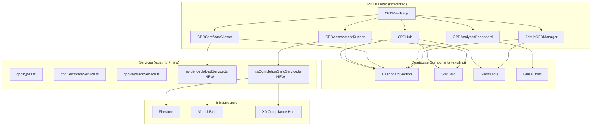

# Design Document: CPD Aesthetic Refinement

## Overview

This feature refactors the existing CPD Assessment Platform UI to adopt the Architex liquid glass design system, updates all terminology to "Professional Compliance Learning" language, adds evidence upload capability, integrates with the XA Compliance Hub, and aligns the monetization display model with the broader platform.

The scope is purely presentational and integration-level — no new Firestore collections, no new API routes, and no changes to assessment scoring logic. The six CPD component files are refactored in-place, replacing shadcn/ui Card wrappers with the established composite components (DashboardSection, StatCard, GlassTable, GlassChart) and applying glass utility classes throughout.

### Key Design Decisions

1. **In-place refactoring over rewrite**: Each of the 6 CPD components is refactored individually rather than rewriting from scratch. This preserves existing Firestore subscription logic and state management.
2. **Composite-first approach**: DashboardSection replaces all Card+CardHeader+CardContent patterns. StatCard replaces the inline MetricCard helper. GlassTable replaces manual course/record/certificate listings.
3. **Terminology as a display concern**: Label replacement is purely in JSX render output — no changes to Firestore field names, service interfaces, or type definitions.
4. **Evidence upload via Vercel Blob**: Uses the existing `@vercel/blob` upload infrastructure (base64 JSON to `/api/files/upload`) rather than introducing a new storage mechanism.
5. **XA integration via service call**: On module completion, a lightweight service function writes to the user's XA compliance status document in Firestore.

---

## Architecture



### Refactoring Strategy

Each component follows the same transformation pattern:

1. Remove `Card`, `CardContent`, `CardHeader`, `CardTitle`, `CardDescription` imports
2. Import `DashboardSection`, `StatCard`, `GlassTable`, `GlassChart` from `@/components/composite`
3. Replace section wrappers with `<DashboardSection title="..." icon={...}>` 
4. Replace inline metric cards with `<StatCard label="..." value={...} icon={...} />`
5. Replace list-based data displays with `<GlassTable columns={...} rows={...} />`
6. Apply `glass-panel`, `glass-tile`, `glass-record`, `glass-pill` utility classes to remaining custom elements
7. Replace all "CPD Assessment" → "Professional Compliance Learning", "CPD Credit" → "Compliance Credit"
8. Remove any "AI-Generated" labels; replace with accreditation status badges

---

## Components and Interfaces

### New Service: `evidenceUploadService.ts`

```typescript
// src/services/evidenceUploadService.ts

export interface EvidenceItem {
  id: string;
  certificateId: string;
  userId: string;
  fileName: string;
  fileUrl: string;
  uploadedAt: string;
  status: 'pending_review' | 'accepted' | 'rejected';
}

export interface UploadEvidenceInput {
  certificateId: string;
  userId: string;
  file: File;
}

export interface UploadEvidenceResult {
  success: boolean;
  evidence?: EvidenceItem;
  error?: string;
}

/**
 * Validates the file is a PDF, uploads to Vercel Blob,
 * creates a Firestore document linking evidence to the certificate.
 */
export async function uploadEvidence(input: UploadEvidenceInput): Promise<UploadEvidenceResult>;

/**
 * Retrieves all evidence items for a given certificate.
 */
export async function getEvidenceForCertificate(certificateId: string): Promise<EvidenceItem[]>;
```

### New Service: `xaCompletionSyncService.ts`

```typescript
// src/services/xaCompletionSyncService.ts

export interface XACompletionStatus {
  userId: string;
  completedModules: string[];
  totalRequired: 3;
  educationComplete: boolean;
  lastSyncedAt: string;
}

/**
 * Called when a user completes an XA-tagged CPD module.
 * Updates the XA Compliance Hub status document in Firestore.
 * Triggers a Project Command Centre notification on education completion.
 * Retries on failure (max 3 attempts, 30s interval).
 */
export async function syncXACompletion(
  userId: string,
  courseId: string,
  courseTitle: string
): Promise<{ success: boolean; educationComplete: boolean }>;

/**
 * Reads the current XA completion status for display in the learning path UI.
 */
export async function getXACompletionStatus(userId: string): Promise<XACompletionStatus>;
```

### Refactored Component: CPDHub

Key interface changes:
- Removes local `MetricCard` helper (replaced by `StatCard`)
- Course listings use `GlassTable<CPDCourse>` with columns for title, provider, credits, status, price
- Records listing uses `GlassTable<CPDRecord>`
- Certificate listing uses `GlassTable<CPDCertificate>`
- Header section uses `DashboardSection` with progress bar retained inside the glass-panel body

### Refactored Component: CPDCertificateViewer

Key additions:
- Evidence upload button and file picker UI
- Evidence list display (glass-record rows)
- "Verified by [Body]" / "Approved by ECSA" badge logic
- Uses `DashboardSection` for certificate details and verification sections

### Refactored Component: CPDMainPage

Key changes:
- Navigation buttons use `glass-button` / `glass-button-solid` classes
- Sub-navigation bar wrapped in `glass-panel`
- "CPD Hub" label → "Compliance Hub"
- All button labels updated to use new terminology

### Refactored Component: CPDAssessmentRunner

Key changes:
- Course landing and results sections use `DashboardSection`
- Metric tiles use `StatCard`
- "AI-Generated" labels removed
- Accreditation status badge displayed adjacent to course title
- Price display uses "Partner Sponsored" / "Dedicated CPD Course" categorisation

### Refactored Component: CPDAnalyticsDashboard

Key changes:
- Chart containers use `GlassChart`
- Analytics tables use `GlassTable`
- Section headings use `DashboardSection`

### Refactored Component: AdminCPDManager

Key changes:
- Admin tables use `GlassTable`
- Section containers use `DashboardSection`
- Status badges use `glass-pill` utility class

---

## Data Models

### Existing Types (unchanged — display-only refactoring)

| Type | Location | Notes |
|------|----------|-------|
| `CPDCourse` | `src/services/cpdTypes.ts` | No field changes; display labels change |
| `CPDRecord` | `src/services/cpdTypes.ts` | No field changes |
| `CPDCertificate` | `src/services/cpdTypes.ts` | No field changes |
| `CPDAttempt` | `src/services/cpdTypes.ts` | No field changes |
| `CPDAssessmentDraft` | `src/services/cpdTypes.ts` | No field changes |
| `CPDProfessionalBodyRuleSet` | `src/services/cpdTypes.ts` | No field changes |

### New Types

#### `EvidenceItem` (Firestore collection: `cpd_evidence`)

```typescript
{
  id: string;              // Firestore document ID
  certificateId: string;   // FK to cpd_certificates
  userId: string;          // Owner
  fileName: string;        // Original filename
  fileUrl: string;         // Vercel Blob URL
  mimeType: 'application/pdf';
  fileSizeBytes: number;
  uploadedAt: string;      // ISO 8601
  status: 'pending_review' | 'accepted' | 'rejected';
  reviewedBy?: string;     // Admin userId who reviewed
  reviewedAt?: string;
}
```

#### `XACompletionStatus` (Firestore document: `users/{userId}/xa_compliance`)

```typescript
{
  userId: string;
  completedModules: string[];   // Array of courseIds
  totalRequired: 3;             // Constant
  educationComplete: boolean;   // completedModules.length >= 3
  lastSyncedAt: string;         // ISO 8601
  checklistUnlocked: boolean;   // True when educationComplete
}
```

### Terminology Mapping (display only)

| Old Term | New Term | Scope |
|----------|----------|-------|
| "CPD Assessment" | "Professional Compliance Learning" | All headings, nav labels, buttons |
| "CPD Credit" | "Compliance Credit" | All credit references in UI |
| "CPD Hub" | "Compliance Hub" | Navigation button labels |
| "CPD Course" | "Compliance Learning Course" | Badge labels on course cards |
| "AI-Generated" | *(removed)* | Removed entirely |
| *(no label)* | "Prepared for Accreditation" | Pre-review status badge |
| *(no label)* | "Accredited by [Body]" | Post-review status badge |
| "Free" | "Partner Sponsored" | Free course pricing label |
| "R [amount]" | "R [amount] — Dedicated CPD Course" | Paid course pricing label |

### Badge Logic for Certificate Verification

```typescript
function getCertificateBadge(certificate: CPDCertificate): { label: string; variant: string } {
  if (!certificate.professionalBody) {
    return { label: 'Verification Pending', variant: 'secondary' };
  }
  if (certificate.professionalBody === 'ECSA') {
    return { label: 'Approved by ECSA', variant: 'default' };
  }
  return { label: `Verified by ${certificate.professionalBody}`, variant: 'default' };
}
```

### Accreditation Status Badge Logic

```typescript
function getAccreditationBadge(course: CPDCourse): { label: string; variant: string } {
  if (course.accreditationReference) {
    // Has been accredited
    const body = course.professionalBodies?.[0] || 'Professional Body';
    return { label: `Accredited by ${body}`, variant: 'default' };
  }
  return { label: 'Prepared for Accreditation', variant: 'secondary' };
}
```

---


## Correctness Properties

*A property is a characteristic or behavior that should hold true across all valid executions of a system — essentially, a formal statement about what the system should do. Properties serve as the bridge between human-readable specifications and machine-verifiable correctness guarantees.*

### Property 1: Certificate Verification Badge Correctness

*For any* CPDCertificate object, the `getCertificateBadge` function SHALL produce:
- `"Approved by ECSA"` when `professionalBody` is `"ECSA"`
- `"Verification Pending"` when `professionalBody` is empty, null, or undefined
- `"Verified by {professionalBody}"` for all other non-empty professional body values

**Validates: Requirements 2.1, 2.2, 2.3**

### Property 2: Accreditation Status Badge Correctness

*For any* CPDCourse object, the `getAccreditationBadge` function SHALL produce:
- `"Prepared for Accreditation"` when `accreditationReference` is falsy (empty, null, undefined)
- `"Accredited by {body}"` (using the first entry in `professionalBodies`) when `accreditationReference` is a non-empty string

**Validates: Requirements 5.2, 5.3**

### Property 3: Evidence File Validation

*For any* file submitted to the evidence upload service, if the file's MIME type is not `application/pdf`, the upload SHALL be rejected with an error message indicating only PDF files are accepted, and no Firestore document or Blob upload SHALL be created.

**Validates: Requirements 6.5**

### Property 4: XA Learning Path Threshold

*For any* non-negative integer representing the count of completed XA-tagged modules:
- When count < 3, the learning path status SHALL be "incomplete" and the message SHALL indicate remaining modules needed
- When count >= 3, the learning path status SHALL be "complete", the XA checklist SHALL be unlocked, and the display SHALL show "Learning Path Complete"

**Validates: Requirements 8.3, 8.4**

### Property 5: Course Pricing Categorisation

*For any* CPDCourse object:
- When `assessmentPriceRand` is 0, null, or undefined, the course SHALL be categorised as "Partner Sponsored" with no price displayed
- When `assessmentPriceRand` is a positive number, the course SHALL be categorised as "Dedicated CPD Course" with the price displayed in ZAR

**Validates: Requirements 9.1, 9.4**

### Property 6: Platform Fee Calculation

*For any* positive price value in ZAR, the fee split SHALL satisfy:
- `platformFeeRand` equals `price * 0.20` (20% platform fee)
- `contentOwnerNetRand` equals `price * 0.80` (80% to content owner)
- `platformFeeRand + contentOwnerNetRand` equals the original `price` (no rounding loss beyond 2 decimal places)

**Validates: Requirements 9.3**

---

## Error Handling

### Evidence Upload Errors

| Error Condition | Behaviour |
|----------------|-----------|
| Non-PDF file submitted | Reject immediately with client-side validation; display "Only PDF files are accepted" |
| File exceeds 50MB body limit | Reject with "File too large" message before upload attempt |
| Vercel Blob upload fails (network/server) | Display "Upload failed. Please try again." with retry option |
| Firestore write fails after blob upload | Log error; display "Upload saved but record creation failed — contact support" |
| Certificate not found for evidence link | Display "Certificate not found" and disable upload |

### XA Completion Sync Errors

| Error Condition | Behaviour |
|----------------|-----------|
| Firestore write fails | Log failure, schedule retry after 30s (max 3 retries) |
| All retries exhausted | Log permanent failure; do not block the user's assessment completion |
| Notification delivery fails | Log failure; do not retry (notification is non-critical) |
| Course not XA-tagged | No sync attempted; no error |

### General UI Errors

| Error Condition | Behaviour |
|----------------|-----------|
| Firestore subscription fails | Display "Unable to load data" inline with retry action |
| Component render error | React ErrorBoundary catches; shows "Something went wrong" with refresh option |
| Missing professional body data | Gracefully fall back to generic labels ("Verification Pending", "Professional Body") |

---

## Testing Strategy

### Unit Tests (Example-Based)

Focus on concrete rendering and structural verification:

- **Terminology verification**: Render each CPD component, assert "CPD Assessment" / "CPD Credit" do not appear, correct replacements are present
- **Component structure**: Verify DashboardSection, StatCard, GlassTable, GlassChart are used (no Card wrappers remain)
- **Glass class presence**: Query DOM for expected `glass-panel`, `glass-tile`, `glass-record` classes
- **Badge rendering**: Specific examples — SACAP certificate shows "Verified by SACAP", ECSA shows "Approved by ECSA"
- **Evidence upload UI flow**: Button presence, file picker trigger, confirmation display
- **XA learning path display**: Render with 0, 1, 2, 3, 5 completed modules, verify correct messages
- **Dark theme**: Render in dark mode context, run axe-core for contrast violations
- **"AI-Generated" removal**: Grep/render test confirming the label is absent

### Property-Based Tests (Universal Properties)

Using `fast-check` as the PBT library (already available in the project's test ecosystem via Vitest).

Each property test runs a minimum of **100 iterations** with randomised inputs.

| Property | Test Tag | Generator Strategy |
|----------|----------|-------------------|
| Property 1: Certificate Badge | `Feature: cpd-aesthetic-refinement, Property 1: Certificate verification badge correctness` | Generate random strings for professionalBody, including "ECSA", empty string, null, undefined, and arbitrary SA body names |
| Property 2: Accreditation Badge | `Feature: cpd-aesthetic-refinement, Property 2: Accreditation status badge correctness` | Generate CPDCourse objects with random accreditationReference (string or falsy) and professionalBodies arrays |
| Property 3: Evidence File Validation | `Feature: cpd-aesthetic-refinement, Property 3: Evidence file validation` | Generate files with random MIME types (application/json, image/png, text/plain, etc.) and verify all are rejected |
| Property 4: XA Threshold | `Feature: cpd-aesthetic-refinement, Property 4: XA learning path threshold` | Generate non-negative integers (0–100), verify message/unlock state switches at threshold 3 |
| Property 5: Pricing Categorisation | `Feature: cpd-aesthetic-refinement, Property 5: Course pricing categorisation` | Generate CPDCourse objects with assessmentPriceRand as 0, null, undefined, or positive numbers in [150, 400] |
| Property 6: Fee Calculation | `Feature: cpd-aesthetic-refinement, Property 6: Platform fee calculation` | Generate random positive numbers (150–400, 2 decimal precision), verify fee split invariants |

### Integration Tests

- **Evidence upload end-to-end**: Mock Vercel Blob, submit PDF, verify Firestore evidence document created
- **XA sync trigger**: Mock Firestore, complete XA-tagged course, verify XA status updated
- **XA retry behaviour**: Mock Firestore failure, verify 3 retries at 30s intervals

### Smoke Tests

- **Token compliance**: Static grep for hardcoded colours / new CSS custom properties
- **Icon library**: Verify only lucide-react imports in CPD files
- **Dark theme rendering**: Visual render check in dark mode context
