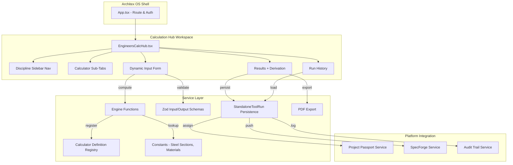
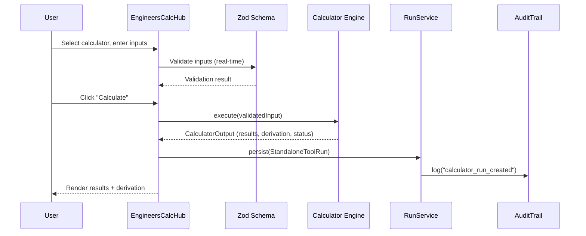

# Design Document: Engineer's Calculation Hub

## Overview

The Engineer's Calculation Hub is a multi-discipline engineering calculator workspace rendered within the Architex OS shell as a Compliance Hub module tool. It provides 53 professional-grade calculators across 8 engineering disciplines (structural, civil, mechanical, fire, electrical, wet services, geotechnical, utilities) — each implemented as a pure TypeScript function with Zod-validated inputs, deterministic computation, step-by-step derivation display, and local-preview integration contracts for the platform spine (Project Passport, SpecForge, Audit Trail — live Firestore write-back deferred to follow-up PR).

The architecture leverages the existing `CalculatorDefinition` framework and `StandaloneToolRun` persistence, extending them with a discipline-specific engine layer and a custom workspace UI that replaces the generic `DefinitionToolRunner` for this tool's multi-calculator navigation pattern.

### Key Design Decisions

1. **Pure engine functions per calculator** — Each calculator is a standalone pure function in its own module. This enables independent unit testing, deterministic audit replay, and parallel development across disciplines.

2. **Custom workspace component vs generic runner** — Because the Calculator Hub hosts 53 calculators with sidebar navigation and sub-tabs, it uses a custom `EngineersCalcHub.tsx` component instead of the generic `DefinitionToolRunner`. The engines still register as `CalculatorDefinition` objects for framework compatibility.

3. **SA Red Book steel sections as typed constant arrays** — Section properties are baked into the bundle as static data (not fetched). This ensures offline availability, deterministic computation, and zero latency for section lookups.

4. **Derivation-first output model** — Every engine returns derivation steps as structured data (not strings), enabling rich formatting with highlighted SANS clause references and failing-step indicators in the UI.

---

## Architecture



### Data Flow



---

## Components and Interfaces

### 1. EngineersCalcHub (Main Workspace Component)

**File:** `src/components/tools/EngineersCalcHub.tsx`

```typescript
interface EngineersCalcHubProps {
  user: UserProfile;
}
```

Responsibilities:
- Render 240px sidebar with discipline group navigation
- Manage active calculator selection and sub-tab state
- Render dynamic input forms from Zod schemas
- Execute calculator engines and display results
- Manage session state (restore inputs on re-navigation)
- Orchestrate run persistence, export, and project assignment

### 2. Calculator Engine Interface

**File:** `src/services/calcHub/types.ts`

```typescript
/** Pass/fail/warning status for code compliance checks */
export type PassFailStatus = 'pass' | 'fail' | 'warning';

/** A single step in the derivation display */
export interface DerivationStep {
  /** Step label/description */
  label: string;
  /** The formula template (e.g., "Mu = wL²/8") */
  formula: string;
  /** The formula with values substituted */
  substitution: string;
  /** Computed result value */
  result: string;
  /** SANS clause reference (e.g., "SANS 10162-1 §13.5") */
  sansRef?: string;
  /** Whether this step failed a code check */
  isFailing?: boolean;
}

/** Standard output shape from all calculator engines */
export interface CalculatorOutput {
  /** Overall pass/fail/warning status */
  status: PassFailStatus;
  /** Utilisation ratio (0-1+) */
  utilisationRatio: number;
  /** Key result values (label → { value, unit }) */
  results: Record<string, { value: number | string; unit: string }>;
  /** Step-by-step derivation */
  derivation: DerivationStep[];
  /** SANS clause references consulted */
  sansReferences: string[];
  /** Intermediate values for audit/display */
  intermediates: Record<string, number>;
}

/** Discipline groups for sidebar navigation */
export type DisciplineGroup =
  | 'structural-steel'
  | 'structural-concrete'
  | 'structural-timber'
  | 'geotechnical'
  | 'civil-loading'
  | 'civil-stormwater'
  | 'mechanical-duct'
  | 'mechanical-heating'
  | 'fire-escape'
  | 'fire-rating'
  | 'fire-water'
  | 'electrical-cable'
  | 'electrical-maxdemand'
  | 'wet-waterpipe'
  | 'wet-drainage'
  | 'wet-hotwater'
  | 'utilities';

/** Calculator metadata for registration and navigation */
export interface CalcHubCalculatorMeta {
  id: string;
  title: string;
  discipline: DisciplineGroup;
  sansRef: string;
  description: string;
}

/** A fully registered calculator for the hub */
export interface CalcHubCalculator<TInput = Record<string, unknown>> {
  meta: CalcHubCalculatorMeta;
  inputSchema: ZodType<TInput>;
  defaults: TInput;
  compute: (input: TInput) => CalculatorOutput;
}
```

### 3. Engine Module Structure

**Directory:** `src/services/calcHub/engines/`

Each discipline has its own engine file containing pure compute functions:

| File | Contents |
|------|----------|
| `steelDesign.ts` | Beam, column, bolt, weld, base plate, profile comparator |
| `concreteDesign.ts` | Beam, slab, column, anchorage, crack width, min rebar |
| `timberDesign.ts` | Beam, compression, connections |
| `geotechnical.ts` | Bearing capacity, pad footing, retaining wall, pile |
| `loading.ts` | Wind, seismic, load combinations, imposed loads |
| `stormwater.ts` | Rational method, pipe sizing, attenuation |
| `ductSizing.ts` | Round/rect duct, chilled water pipe, fan, heat gain/loss |
| `fireEngineering.ts` | Travel distance, exit width, occupant load, fire rating, hydrant, pump |
| `electrical.ts` | Cable sizing, voltage drop, short circuit, max demand |
| `wetServices.ts` | Cold water pipe, hot water pipe, pressure drop, drainage, vents, geyser, solar, circulation |
| `utilities.ts` | Unit conversion, material density lookup, section properties |

### 4. Schema Module Structure

**Directory:** `src/services/calcHub/schemas/`

Each discipline has a schema file defining Zod input schemas:

```typescript
// Example: src/services/calcHub/schemas/steelDesign.ts
export const steelBeamInputSchema = z.object({
  sectionId: z.string().min(1),
  grade: z.enum(['300', '350']),
  span: z.number().positive().max(30),
  udl: z.number().positive(),
  deflectionLimit: z.number().positive().default(250),
});
export type SteelBeamInput = z.infer<typeof steelBeamInputSchema>;
```

### 5. Data Constants

**Directory:** `src/services/calcHub/data/`

| File | Contents |
|------|----------|
| `steelSections.ts` | SA Red Book I/H section properties (203x133UB25 through 610x229UB125) |
| `materialDensities.ts` | 20+ construction material densities |
| `imposedLoads.ts` | SANS 10160-2 occupancy loads table |
| `pipeSizes.ts` | Standard pipe diameters (copper, steel, PVC) |
| `concreteGrades.ts` | Grade 25–50 characteristic strengths |
| `fireDistances.ts` | SANS 10400-T travel distance limits by classification |
| `fixtureUnits.ts` | SANS 10252-1 fixture unit values |
| `unitConversions.ts` | Conversion factors for 18+ categories |

### 6. Platform Integration Adapters

**File:** `src/services/calcHub/calcHubIntegration.ts`

```typescript
/** Persist a completed calculator run */
export function persistCalcRun(params: {
  calculatorId: string;
  userId: string;
  role: string;
  input: Record<string, unknown>;
  output: CalculatorOutput;
}): StandaloneToolRun;

/** Assign a run to a project (writes to Project Passport) */
export function assignRunToProject(params: {
  run: StandaloneToolRun;
  projectName: string;
  jobRef: string;
}): void;

/** Push a run to SpecForge as a spec item */
export function pushRunToSpecForge(params: {
  run: StandaloneToolRun;
  output: CalculatorOutput;
}): void;

/** Record an audit event for a calculator action */
export function auditCalcEvent(params: {
  action: 'calculator_run_created' | 'calculator_run_assigned' | 'calculator_run_exported';
  userId: string;
  runId: string;
  calculatorDefinitionId: string;
  projectId?: string;
  exportFormat?: string;
}): void;
```

### 7. PDF Export

**File:** `src/services/calcHub/calcHubPdfExport.ts`

Uses existing PDF generation patterns in the codebase. Generates an A4 calculation sheet containing:
- Architex logo + header (project name, calculator title, SANS ref, date, engineer)
- Input table (label, value, unit)
- Output table (label, value, unit)
- Derivation steps (monospace, SANS clause highlights)
- Pass/fail status badge
- Advisory disclaimer
- Run reference (runId) in footer

---

## Data Models

### CalculatorOutput (Engine Return Type)

```typescript
{
  status: 'pass' | 'fail' | 'warning',
  utilisationRatio: 0.847,
  results: {
    'Moment Resistance (Mr)': { value: 283.5, unit: 'kNm' },
    'Shear Resistance (Vr)': { value: 354.2, unit: 'kN' },
    'Midspan Deflection': { value: 12.4, unit: 'mm' },
  },
  derivation: [
    {
      label: 'Factored moment',
      formula: 'Mu = wL²/8',
      substitution: '25 × 6² / 8',
      result: '112.5 kNm',
      sansRef: 'SANS 10162-1 §13.5',
    },
    // ...
  ],
  sansReferences: ['SANS 10162-1 §13.5', 'SANS 10162-1 §13.4.3'],
  intermediates: { Mu: 112.5, Mr: 283.5, Vu: 75.0, Vr: 354.2, delta: 12.4 },
}
```

### StandaloneToolRun (Persistence Shape)

Each calculator run persists as a `StandaloneToolRun`:

```typescript
{
  runId: 'run-uuid-xxx',
  toolId: 'engineers_calc_hub',
  toolLabel: "Engineer's Calculation Hub",
  category: 'compliance',
  userId: 'user-123',
  role: 'engineer',
  input: { sectionId: '457x191UB67', grade: '350', span: 6, udl: 25, deflectionLimit: 250 },
  output: { /* CalculatorOutput serialized */ },
  assignedToProject: null,
  assignedToJobRef: null,
  notes: null,
  exportedAt: null,
  exportFormat: null,
  createdAt: '2026-07-01T10:30:00Z',
  updatedAt: '2026-07-01T10:30:00Z',
  version: 1,
  calculatorDefinitionId: 'calc_hub_steel_beam_v1',
  previousRunId: undefined,
}
```

### Session State (In-Memory)

```typescript
interface CalcHubSessionState {
  activeDiscipline: DisciplineGroup;
  activeCalculatorId: string;
  /** Cached inputs per calculator for session restore (Requirement 2.8) */
  inputCache: Map<string, Record<string, unknown>>;
  /** Latest output per calculator */
  lastOutput: Map<string, CalculatorOutput>;
  /** Run history loaded from persistence */
  runHistory: StandaloneToolRun[];
}
```

### Steel Section Data Shape

```typescript
export interface SteelSection {
  name: string;     // e.g. '457x191UB67'
  d: number;        // Depth (mm)
  bf: number;       // Flange width (mm)
  tf: number;       // Flange thickness (mm)
  tw: number;       // Web thickness (mm)
  Ix: number;       // Second moment of area, x-axis (cm⁴)
  Iy: number;       // Second moment of area, y-axis (cm⁴)
  Zx: number;       // Elastic section modulus, x (cm³)
  Sx: number;       // Plastic section modulus, x (cm³)
  rx: number;       // Radius of gyration, x (mm)
  ry: number;       // Radius of gyration, y (mm)
  A: number;        // Cross-sectional area (cm²)
  mass: number;     // Mass per metre (kg/m)
}
```

---

## Correctness Properties

*A property is a characteristic or behavior that should hold true across all valid executions of a system — essentially, a formal statement about what the system should do. Properties serve as the bridge between human-readable specifications and machine-verifiable correctness guarantees.*

### Property 1: Engine Determinism

*For any* calculator engine and any valid input object, calling the engine function twice with the same input SHALL produce byte-identical JSON output.

**Validates: Requirements 3.2, 3.3**

### Property 2: Pass/Fail Status Consistency with Utilisation Ratio

*For any* calculator engine output, the `status` field SHALL be "pass" when `utilisationRatio < 0.9`, "warning" when `0.9 ≤ utilisationRatio ≤ 1.0`, and "fail" when `utilisationRatio > 1.0`.

**Validates: Requirements 3.5, 3.6, 3.7**

### Property 3: Input Validation Rejects Invalid Values

*For any* input object that violates the calculator's Zod schema constraints (out-of-range numbers, missing required fields, invalid enum values), schema validation SHALL return a failure and the compute function SHALL not be invoked.

**Validates: Requirements 2.2, 2.3, 2.4**

### Property 4: Derivation Step Completeness

*For any* calculator engine output, the `derivation` array SHALL contain at least one step, and every step SHALL include non-empty `formula`, `substitution`, and `result` fields.

**Validates: Requirements 3.4, 4.5**

### Property 5: SANS References Present in Output

*For any* calculator engine output, the `sansReferences` array SHALL contain at least one clause reference string matching the pattern `SANS \d+(-\d+)? §[\d.]+`.

**Validates: Requirements 3.8, 4.6**

### Property 6: Run Persistence Round-Trip

*For any* completed calculator run, persisting it as a `StandaloneToolRun` and then restoring it SHALL produce an input object that, when passed to the same engine, yields identical output.

**Validates: Requirements 5.1, 5.4, 5.6**

### Property 7: Steel Beam Moment Resistance Follows Formula

*For any* valid steel beam input (section from Red Book, grade 300 or 350, positive span and UDL), the computed moment resistance SHALL equal `φ × fy × Sx / 1000` (within floating-point tolerance of 0.01 kNm) where φ = 0.9.

**Validates: Requirements 8.1**

### Property 8: Unit Conversion Round-Trip

*For any* unit conversion category and any pair of units (A, B) within that category, converting a value from A to B and back to A SHALL return the original value within a relative tolerance of 1e-10.

**Validates: Requirements 18.1**

### Property 9: Rational Method Flow Calculation

*For any* valid rational method inputs (C ∈ [0,1], I > 0, A > 0), the computed peak runoff Q SHALL equal `C × I × A / 3.6` within floating-point tolerance.

**Validates: Requirements 13.1**

### Property 10: Column Buckling Uses Correct Curve Parameter

*For any* valid column input with a hot-rolled W-shape section, the buckling curve parameter n SHALL be 1.34, and the computed compressive resistance SHALL follow the SANS 10162-1 §13.3 formula `Cr = φ × A × fy × (1 + λn^(2n))^(-1/n)`.

**Validates: Requirements 8.2**

---

## Error Handling

### Validation Errors (Client-Side)

| Error Condition | Handling |
|----------------|----------|
| Input field violates Zod schema | Display inline error adjacent to field within 100ms; disable Calculate button |
| Required field empty | Show "Required" message; disable Calculate |
| Number out of range (e.g., span > 30m) | Show range constraint message (e.g., "Must be ≤ 30") |
| Invalid section selection | Show "Select a valid section"; disable Calculate |

### Computation Errors (Engine)

| Error Condition | Handling |
|----------------|----------|
| Division by zero (e.g., zero area) | Engine returns status "fail" with derivation showing the failing step |
| NaN/Infinity in intermediate | Engine catches and returns error derivation step with explanation |
| Section not found in data array | Throw `CalculatorError('INVALID_INPUT')` — caught by UI, shows user message |

### Persistence Errors (Network/Service)

| Error Condition | Handling |
|----------------|----------|
| Run persist fails (network) | Show non-blocking amber toast warning; retain run in local state for retry (Req 5.7) |
| Project assignment fails | Show error dialog; run remains unassigned, user can retry |
| PDF export fails | Show error toast; offer to retry |
| Audit trail write fails | Log to console; do not block user — audit is best-effort from client |

### Role Access Errors

| Error Condition | Handling |
|----------------|----------|
| Unauthorised role navigates to route | Display "Access Denied" card; no calculator UI rendered (Req 19.3) |

---

## Integration Scope (Current Release)

### Fully Implemented
- Calculator engine computation (53 calculators, all 8 disciplines)
- Zod schema validation with SA-standard defaults
- Derivation step generation with SANS clause references
- PDF export (HTML-based, print-to-PDF)
- Local run persistence (in-memory, session-scoped)
- Local run history with restore capability
- Session input cache (survives calculator switching within session)
- Standalone tool registry entry with correct role access

### Stub / Preview (Local-Only)
The following integrations record actions locally (console logging) but do NOT persist to Firestore or the platform spine. They are wired to the correct interface contracts and will connect to the live services in a follow-up PR:

- **Project Passport write-back** — `assignRunToProject()` updates the local run record but does not write to Firestore
- **SpecForge push** — `pushRunToSpecForge()` logs the spec item shape but does not create a Firestore document
- **Audit Trail** — `auditCalcEvent()` logs events to console but does not write to the platform audit collection
- **Run persistence (Firestore)** — `persistCalcRun()` creates an in-memory StandaloneToolRun but does not write to Firestore

### Planned Follow-Up
- Wire `persistCalcRun` to Firestore `standaloneToolRuns` collection
- Wire `assignRunToProject` to write compliance evidence into project passport document
- Wire `pushRunToSpecForge` to create spec items in the SpecForge collection
- Wire `auditCalcEvent` to the platform `auditTrail` collection
- Add real toast notifications (replace console.info stubs)

---

## Testing Strategy

### Unit Tests (Vitest)

**Engine Functions (Pure Logic)**
- Each calculator engine gets its own test file (e.g., `steelDesign.test.ts`)
- Test specific known-answer examples (hand-calculated reference values)
- Test edge cases: zero inputs, maximum values, boundary utilisation ratios
- Test that all engines return valid `CalculatorOutput` shape
- Test derivation step completeness

**Schema Validation**
- Test that valid inputs pass Zod validation
- Test that invalid inputs fail with expected error messages
- Test default value application

**Data Constants**
- Test steel section array contains all required sections (203x133UB25 through 610x229UB125)
- Test material densities contain all 20+ required materials
- Test unit conversion factors produce correct results for known pairs

**Integration Adapters**
- Test `persistCalcRun` produces valid `StandaloneToolRun` shape
- Test `auditCalcEvent` calls audit service with correct parameters
- Test `assignRunToProject` updates run fields correctly

### Property-Based Tests (Vitest + fast-check)

Property-based testing is highly applicable to this feature because the calculator engines are pure functions with clear input/output behaviour, deterministic results, and universal properties that must hold across all valid inputs.

**Library:** `fast-check` (already available in the project)
**Configuration:** Minimum 100 iterations per property test
**Tag format:** `Feature: engineers-calculation-hub, Property {N}: {description}`

Properties to implement:
1. Engine determinism (all engines)
2. Pass/fail status ↔ utilisation ratio consistency (all engines)
3. Input schema rejects invalid values (all schemas)
4. Derivation step completeness (all engines)
5. SANS references present (all engines)
6. Run persistence round-trip
7. Steel beam Mr = φ·fy·Sx/1000
8. Unit conversion round-trip
9. Rational method Q = C·I·A/3.6
10. Column buckling formula with n = 1.34

### Component Tests

- Test `EngineersCalcHub` renders sidebar with all discipline groups
- Test calculator switching updates content area
- Test input form renders fields from schema
- Test Calculate button disabled when validation fails
- Test results panel shows pass/fail badge correctly
- Test session state restores inputs on re-navigation
- Test role-based access denial for unauthorised roles

