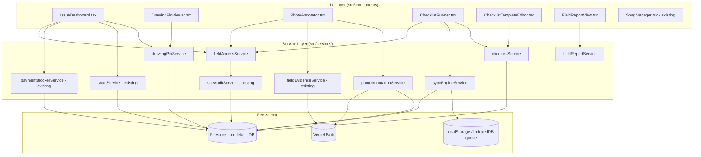

# Design Document

## Overview

This design extends Architex's existing Pack 9 (Site Execution & Field Control) into an Autodesk Build / Forma-style, mobile-first field-issue product. It is an **extend/enhance** effort layered on the existing `snagService`, `fieldEvidenceService`, `paymentBlockerService`, `siteAuditService`, and the `SnagManager` / `NCRManager` / `SiteInstructionManager` components. The canonical snag state machine (`open → allocated → ready_for_reinspection → closed / rejected`) and the payment-blocker governance rules are **reused unchanged** — this feature adds field-capture capabilities around them rather than replacing them.

The new capabilities are:

1. **Pin-on-drawing location referencing** — attach a normalized `(x, y)` coordinate against a project drawing to any field issue.
2. **Photo capture and annotation** — capture JPEG/PNG photos, mark them up with structured shapes (arrows, text notes), and store a flattened rendered image alongside the structured annotation data.
3. **Inspection checklist and form templates** — author reusable checklist templates and execute them as instances, with pass/fail/n-a counts and fail-to-issue conversion.
4. **Offline field capture with sync** — queue issues, annotations, and checklist responses locally when offline and reconcile them to Firestore in order, idempotently, when connectivity returns.
5. **Issue assignment and lifecycle dashboard** — a role-aware, AND-filtered dashboard over field issues with per-status counts.
6. **Role-aware access** — gate all field actions by `UserRole`, write an audit record per action, and preserve payment-release governance.
7. **Field reporting** — generate dated daily/progress/close-out reports aggregating issues, evidence, weather, and payment-blocking counts.
8. **Lifecycle and navigation integration** — surface the tools through the existing Projects `snags` section and the Toolboxes `construction_admin` / `closeout` sections, stage-aware.

### Design Principles

- **Reuse over rebuild.** The snag state machine (`isValidSnagTransition`), `snagBlocksPayment`, and `paymentBlockerService` are consumed as-is. New services compose them.
- **Pure logic, separated from I/O.** Validation, state transitions, count computation, serialization, sync ordering, and filtering are pure functions in service modules so they can be property-tested without Firestore or Vercel Blob.
- **Offline-first capture.** Captures are written to a local queue first (client identifier assigned at capture time), then synced. Sync is idempotent on the client identifier.
- **Governance preserved.** `site_manager` cannot release payment; high/critical open issues continue to block payment via the existing rules.

### Key Research Findings

- **Existing snag state machine** (`src/services/snagService.ts`) defines `SNAG_TRANSITIONS` and exports `isValidSnagTransition(from, to)` and `snagBlocksPayment(priority)`. `closeSnagAfterReinspection` already clears `blocksPayment`. The new lifecycle dashboard and status-transition guard reuse these directly rather than redefining transitions.
- **`FieldEvidence`** (`src/types.ts`) already carries `type`, `uri`, `location`, `gps`, `linkedObjectId`. Photo annotation extends this model with a new annotation sub-record rather than altering `FieldEvidence`.
- **Persistence pattern** is consistent across services: collections live under `projects/{projectId}/...`, accessed through `getDemoCol` / `getDemoDoc` (demo-aware wrappers), with `handleFirestoreError(error, OperationType, path)` for error normalization and `subscribeTo*` for realtime. New services follow this exact pattern.
- **File uploads** go through Vercel Blob; AGENTS.md notes the 50MB body limit and base64 JSON upload path. This feature caps photos at 25MB per Requirement 2.
- **Navigation** already exposes Projects → `snags`, and Toolboxes → `construction_admin` and `closeout`. No new sections are required; the feature mounts components into these existing keys (`src/navigation/architexNavigationConfig.ts`).
- **Audit** is written through `SiteAuditRecord` (`src/types.ts`) capturing actor, role, action, source object, timestamp. Requirement 6.4 adds an `outcome` (permitted/denied) dimension.

## Architecture



### Layering

- **UI components** call services only; they never touch Firestore directly. New components live in `src/components/` next to the existing managers.
- **Service modules** in `src/services/` hold all business logic. Pure helpers (validators, transition guards, count/aggregation functions, serializers, sync ordering) are exported standalone for property testing; Firestore-touching functions wrap them.
- **`fieldAccessService`** is a cross-cutting guard: every mutating action passes through `assertFieldAction(role, action, target)` which returns a permit/deny decision and triggers an audit write.
- **`syncEngineService`** owns the offline queue: capture intake, ordering, retry accounting, idempotent reconciliation, and serialization to/from local storage.

### Request flow (online capture)

1. UI invokes a service mutation (e.g. `checklistService.recordResponse`).
2. Service calls `fieldAccessService.assertFieldAction(role, ...)`; on deny it returns an authorization error and the audit record is written with `outcome: 'denied'`.
3. On permit, the service validates input (pure validator), then persists via the demo-aware Firestore wrappers, then writes a `SiteAuditRecord` with `outcome: 'permitted'`.

### Request flow (offline capture)

1. UI invokes a capture; `navigator.onLine` is false (or write fails with a network error).
2. `syncEngineService.enqueue(capture)` assigns/keeps the client identifier, serializes the capture, and appends it to the local queue (rejecting if the queue is at capacity).
3. On `online` event (or poll), `syncEngineService.flush()` transmits queued captures in creation order, removing each on success, retrying on failure up to 5 attempts, and surfacing the failed count.

## Components and Interfaces

### New service modules (`src/services/`)

**`drawingPinService.ts`** — Drawing pin validation and persistence.
```ts
export interface DrawingPin {
  drawingId: string;          // non-empty project drawing identifier
  x: number;                  // 0..1 inclusive
  y: number;                  // 0..1 inclusive
}

export interface PinValidationError {
  field: 'drawingId' | 'x' | 'y';
  code: 'missing' | 'out_of_range' | 'drawing_not_found';
  message: string;
}

// Pure: validate coordinates and presence (does not check drawing existence)
export function validateDrawingPin(pin: Partial<DrawingPin>): PinValidationError[];

// Pure: filter issues whose pin matches a displayed drawing
export function pinsForDrawing(issues: FieldIssue[], drawingId: string): PinnedIssue[];

// I/O: validate (incl. drawing existence), then atomically persist drawingId+x+y
export async function attachDrawingPin(
  ctx: ActorContext, projectId: string, issueId: string,
  pin: DrawingPin, knownDrawingIds: string[],
): Promise<DrawingPin>; // throws ValidationError | PersistenceError, leaves prior location unchanged on failure
```

**`photoAnnotationService.ts`** — Structured photo markup + flattened render reference.
```ts
export type AnnotationShapeType = 'arrow' | 'text_note'; // extensible
export interface AnnotationShape {
  id: string;
  type: AnnotationShapeType;
  points: Array<{ x: number; y: number }>; // normalized 0..1
  style: { color: string; strokeWidth: number; fontSize?: number };
  text?: string; // for text_note
}
export interface PhotoAnnotation {
  evidenceId: string;       // links to FieldEvidence
  shapes: AnnotationShape[];
  flattenedUri?: string;    // Vercel Blob URI of rendered image
}

export function serializeAnnotation(a: PhotoAnnotation): string;   // pure
export function deserializeAnnotation(raw: string): PhotoAnnotation; // pure, round-trip with serialize
export async function saveAnnotation(ctx: ActorContext, projectId: string, a: PhotoAnnotation): Promise<void>;
export async function loadAnnotation(projectId: string, evidenceId: string): Promise<PhotoAnnotation | null>;
```

**`checklistService.ts`** — Templates, instances, responses, counts.
```ts
export type ResponseType = 'pass_fail_na' | 'numeric' | 'text';
export type PassFailNa = 'pass' | 'fail' | 'na';

export interface ChecklistItem {
  id: string; prompt: string; responseType: ResponseType; order: number;
}
export interface ChecklistTemplate {
  id: string; projectId: string; title: string; items: ChecklistItem[]; createdBy: string; createdAt: string;
}
export interface ChecklistResponse { itemId: string; value: PassFailNa | number | string; }
export interface ChecklistInstance {
  id: string; templateId: string; projectId: string; location: string;
  items: ChecklistItem[]; responses: ChecklistResponse[];
  passCount?: number; failCount?: number; naCount?: number; status: 'in_progress' | 'completed';
}

export function validateTemplate(t: ChecklistTemplate): TemplateValidationError[]; // pure
export function validateResponse(item: ChecklistItem, value: unknown): boolean;      // pure
export function computeCounts(instance: ChecklistInstance): { passCount: number; failCount: number; naCount: number }; // pure, over pass_fail_na items only
export function serializeTemplate(t: ChecklistTemplate): string;     // pure
export function deserializeTemplate(raw: string): ChecklistTemplate; // pure, round-trip
export function failedItemToIssue(instance: ChecklistInstance, itemId: string): FieldIssueDraft; // pure
// I/O wrappers: createTemplate, startInstance, recordResponse, completeInstance
```

**`syncEngineService.ts`** — Offline queue + reconciliation.
```ts
export interface QueuedCapture {
  clientId: string;            // client-generated idempotency key
  kind: 'field_issue' | 'photo_annotation' | 'checklist_response';
  payload: unknown;
  createdAt: string;           // ISO; defines transmission order
  attempts: number;            // retry accounting (max 5)
  status: 'queued' | 'failed';
}
export const QUEUE_CAPACITY = 500;

export function serializeQueue(q: QueuedCapture[]): string;     // pure
export function deserializeQueue(raw: string): QueuedCapture[]; // pure, round-trip
export function orderForTransmission(q: QueuedCapture[]): QueuedCapture[]; // pure, by createdAt asc
export function enqueue(q: QueuedCapture[], capture: QueuedCapture): { queue: QueuedCapture[]; error?: 'queue_full' }; // pure
export function reconcile(persistedClientIds: Set<string>, capture: QueuedCapture): 'persist' | 'skip'; // pure, idempotent
// I/O: flush() drains queue against Firestore, persists localStorage between attempts
```

**`fieldReportService.ts`** — Dated aggregation + export.
```ts
export interface FieldReport {
  projectId: string; date: string; timeZone: string;
  issues: FieldIssueSummary[]; evidence: EvidenceRef[];
  weather: WeatherCondition | 'not_recorded';
  paymentBlockingCount: number;        // open blocking issues as of date
  outstandingHandoverSnags?: number;   // close-out stage only
}
export function aggregateReport(input: ReportInputs): FieldReport; // pure
export function exportReport(report: FieldReport): ExportDocument;  // pure (date, project, issue summary, evidence refs)
```

**`fieldAccessService.ts`** — Role gate + audit.
```ts
export type FieldActionType =
  | 'create' | 'edit' | 'delete' | 'status_transition' | 'payment_release';
export const EDITOR_ROLES: UserRole[] =
  ['site_manager','contractor','subcontractor','architect','engineer','bep'];

export function canPerform(role: UserRole, action: FieldActionType): boolean; // pure
export function assertFieldAction(ctx: ActorContext, action: FieldActionType, targetId: string):
  { outcome: 'permitted' | 'denied'; error?: AuthorizationError }; // pure decision
// I/O wrapper writes SiteAuditRecord with outcome for every attempt
```

### New / changed UI components (`src/components/`)

| Component | Responsibility |
|-----------|---------------|
| `IssueDashboard.tsx` | AND-filtered list of field issues, per-status counts, drawing-pin entry, checklist + report access (Requirement 5, 8.1). |
| `DrawingPinViewer.tsx` | Render a drawing with one marker per matching issue; place/edit pins (Requirement 1). |
| `PhotoAnnotator.tsx` | Capture photo, draw arrows/text notes, save structured + flattened image (Requirement 2). |
| `ChecklistTemplateEditor.tsx` | Author/validate templates (Requirement 3.1, 3.7). |
| `ChecklistRunner.tsx` | Execute an instance, record responses, convert fails to issues, show counts (Requirement 3.2–3.5). |
| `FieldReportView.tsx` | Generate/preview/export a dated field report (Requirement 7). |
| `SnagManager.tsx` (existing) | Gains drawing-pin + dashboard entry points; transitions still flow through `snagService`. |

All new interactive controls are keyboard-reachable and expose accessible names (Requirement 9.4, 9.5).

## Data Models

New Firestore collections, all under `projects/{projectId}/` following the existing pattern:

| Collection | Document type | Notes |
|-----------|---------------|-------|
| `snags` (existing) | `SnagItem` extended with optional `drawingPin?: DrawingPin` and required text `location` (1–500 chars) | Pin stored atomically with `location` fallback. |
| `field_evidence` (existing) | `FieldEvidence` | Photo evidence linked to issue via `linkedObjectId`. |
| `photo_annotations` | `PhotoAnnotation` | One per annotated `FieldEvidence` (`evidenceId`). |
| `checklist_templates` | `ChecklistTemplate` | 1–200 items, prompt 1–500 chars. |
| `checklist_instances` | `ChecklistInstance` | Copies template items in order; stores responses + counts. |
| `site_audit` (existing) | `SiteAuditRecord` extended with `outcome: 'permitted' \| 'denied'` | Written per field action attempt. |
| `field_reports` | `FieldReport` | Dated aggregation snapshots. |

Local (device) storage:

| Store | Shape | Notes |
|-------|-------|-------|
| `localStorage` key `architex:syncQueue:{projectId}` | serialized `QueuedCapture[]` | Capacity 500; survives app restart via serialize/deserialize round-trip. |

### Type changes (`src/types.ts`)

- Extend `SnagItem` with `drawingPin?: DrawingPin`.
- Extend `SiteAuditRecord` with `outcome: 'permitted' | 'denied'` and `actionType: FieldActionType`.
- Add `DrawingPin`, `PhotoAnnotation`, `AnnotationShape`, `ChecklistTemplate`, `ChecklistItem`, `ChecklistInstance`, `ChecklistResponse`, `QueuedCapture`, `FieldReport`.

A `FieldIssue` is a view-model union of the existing `SnagItem`, `NonConformanceReport`, and inspection findings — the dashboard reads them through a normalizing adapter so existing records need no migration.

### Validation (Zod, `src/lib/schemas.ts`)

New schemas mirror the validators: `drawingPinSchema` (drawingId non-empty, x/y `0..1`), `checklistTemplateSchema` (1–200 items, prompt 1–500, response type enum), `checklistResponseSchema` (text ≤ 1000), `queuedCaptureSchema`.

## Correctness Properties

*A property is a characteristic or behavior that should hold true across all valid executions of a system — essentially, a formal statement about what the system should do. Properties serve as the bridge between human-readable specifications and machine-verifiable correctness guarantees.*

These properties were derived from the acceptance criteria via the prework analysis and consolidated to remove redundancy. Each is universally quantified and implemented by a single property-based test running a minimum of 100 iterations.

### Property 1: Drawing pin and text location validation

*For any* candidate drawing pin, `validateDrawingPin` accepts it if and only if it has a non-empty `drawingId` and both `x` and `y` are present and within `0..1` inclusive; for every absent or out-of-range coordinate the returned errors name that specific coordinate, and any pin with a text-only location is accepted if and only if the location length is between 1 and 500 characters inclusive.

**Validates: Requirements 1.1, 1.4, 1.7**

### Property 2: Pin rejection for unknown drawings leaves location unchanged

*For any* drawing pin whose `drawingId` is not in the set of known project drawing identifiers, `attachDrawingPin` rejects the pin with a `drawing_not_found` error and the issue's existing location data is unchanged.

**Validates: Requirements 1.5**

### Property 3: Pin markers match the displayed drawing exactly

*For any* set of field issues and any displayed drawing identifier, `pinsForDrawing` returns exactly one entry per issue whose stored pin `drawingId` equals the displayed identifier and no entry for any other issue.

**Validates: Requirements 1.3**

### Property 4: Photo annotation round-trip

*For any* photo annotation, deserializing its serialized form yields an annotation equivalent to the original in shape count, shape order, and every shape's type, position coordinates, and style attributes.

**Validates: Requirements 2.3, 2.4**

### Property 5: Photo attachment format and size validation

*For any* candidate file descriptor (mime type and byte size), the attachment is accepted if and only if the format is JPEG or PNG and the size does not exceed 25 MB; rejected attachments create no `FieldEvidence` record and return an error indicating the unsupported format or size limit.

**Validates: Requirements 2.6**

### Property 6: Checklist template validation

*For any* candidate checklist template, it is accepted if and only if it has between 1 and 200 items, every item prompt is between 1 and 500 characters, and every item response type is one of `pass_fail_na`, `numeric`, or `text`; otherwise it is rejected with an error naming the invalid field.

**Validates: Requirements 3.1, 3.7**

### Property 7: Checklist instance preserves template item order

*For any* checklist template, starting an instance produces an instance whose items equal the template items in count and order.

**Validates: Requirements 3.2**

### Property 8: Checklist response validation

*For any* checklist item and candidate response value, the response is accepted if and only if it matches the item's response type (and any text value does not exceed 1000 characters); a mismatched response is rejected with an error naming the expected response type and leaves any existing response unchanged.

**Validates: Requirements 3.3, 3.8**

### Property 9: Failed item converts to an issue carrying its context

*For any* completed checklist instance and any item whose recorded `pass_fail_na` response is `fail`, converting it produces a field issue draft carrying the item prompt, the checklist reference, and the item's attached evidence.

**Validates: Requirements 3.4**

### Property 10: Checklist counts cover pass-fail-na items only

*For any* checklist instance, `computeCounts` produces pass, fail, and not-applicable counts whose sum equals the number of `pass_fail_na` items, where each count equals the number of `pass_fail_na` items with the corresponding response, and `numeric` and `text` items do not affect any count.

**Validates: Requirements 3.5**

### Property 11: Checklist template round-trip

*For any* checklist template, deserializing its serialized form yields a template equivalent to the original in item count, order, and definition.

**Validates: Requirements 3.6**

### Property 12: Sync queue serialization round-trip

*For any* sync queue, deserializing its serialized local-storage form reconstructs a queue equivalent to the original in entry count, order, and every entry's fields.

**Validates: Requirements 4.7**

### Property 13: Queue transmission order is creation order

*For any* sync queue, `orderForTransmission` yields the entries ordered by ascending creation time, preserving the order in which captures were created.

**Validates: Requirements 4.2**

### Property 14: Enqueue respects capacity

*For any* sequence of captures, `enqueue` accepts captures while the queue size is below capacity (at least 500) and rejects any further capture with a `queue_full` error once the queue is at capacity.

**Validates: Requirements 4.1, 4.6**

### Property 15: Idempotent reconciliation with retry accounting

*For any* set of queued captures and any sequence of persist outcomes, reconciliation removes a capture from the queue when it persists successfully, retains it and increments its attempt count on failure up to 5 attempts before marking it failed, surfaces a failed count equal to the number of captures whose attempts are exhausted, and produces exactly one persisted record per client-generated identifier even when the same capture is synced more than once.

**Validates: Requirements 4.3, 4.4, 4.5, 4.8**

### Property 16: Field issue status enum and defaults

*For any* field issue creation or update, the recorded status is exactly one of `open`, `allocated`, `ready_for_reinspection`, `closed`, or `rejected` (defaulting to `open` on creation), and the responsible party is recorded as the provided value or `unassigned` when none is provided; any other supplied status value is rejected with an error naming the invalid value and the existing status is unchanged.

**Validates: Requirements 5.1, 5.2**

### Property 17: Status transitions obey the existing snag state machine

*For any* pair of source and target statuses, a transition is permitted if and only if `isValidSnagTransition(source, target)` is true; a disallowed transition is rejected with an error naming the source and target statuses and the source status is unchanged.

**Validates: Requirements 5.3**

### Property 18: Dashboard filters combine with logical AND

*For any* set of field issues and any combination of status, severity, responsible-party, and lifecycle-stage filters, the filtered result contains every issue that matches all applied filters and no issue that fails any applied filter.

**Validates: Requirements 5.4**

### Property 19: Per-status counts are exhaustive over the filtered set

*For any* filtered set of field issues, the dashboard reports a count for each of the five lifecycle statuses such that each count equals the number of issues in the set with that status (zero when none) and the five counts sum to the size of the set.

**Validates: Requirements 5.5, 5.6**

### Property 20: Payment-blocking invariant

*For any* field issue, it is marked as blocking payment if and only if its severity is `high` or `critical` and its status is neither `closed` nor `rejected`; transitioning an issue to `closed` or `rejected` clears its payment-blocking flag.

**Validates: Requirements 5.7, 5.8**

### Property 21: Role permission matrix

*For any* user role and field action, `canPerform` permits the action if and only if the role is one of the editor roles (`site_manager`, `contractor`, `subcontractor`, `architect`, `engineer`, `bep`) for create/edit/delete/status-transition actions; a `client` is permitted view only and denied every mutating action; any other role is denied create/edit/delete with an authorization error naming the attempted action and the role, and in every denied case the target record is unchanged.

**Validates: Requirements 6.1, 6.2, 6.5**

### Property 22: Every field action is audited with its outcome

*For any* attempted field action (create, edit, delete, status transition, or payment release), exactly one `SiteAuditRecord` is written capturing the actor identifier, actor role, action type, source object identifier, an outcome of `permitted` or `denied`, and a timestamp.

**Validates: Requirements 6.4**

### Property 23: Field report date-range aggregation

*For any* set of issues and evidence with timestamps and any report date, the generated report aggregates exactly the issues and evidence whose timestamps fall between `00:00:00` and `23:59:59` of that date in the project time zone, and when no weather is recorded for the date the weather is marked `not_recorded` rather than failing generation.

**Validates: Requirements 7.1, 7.3**

### Property 24: Field report blocking and handover counts

*For any* generated field report, the payment-blocking count equals the number of aggregated issues that block payment and whose status is neither `closed` nor `rejected` as of the report date, and when the lifecycle stage is Close-out the outstanding-handover count equals the number of snags whose status is neither `closed` nor `rejected`.

**Validates: Requirements 7.2, 7.5**

### Property 25: Field report export content

*For any* field report, the exported document contains the report date, the project identifier, an issue summary listing each aggregated issue's identifier, lifecycle status, and severity, and an evidence reference for each aggregated evidence item.

**Validates: Requirements 7.4**

### Property 26: Stage-gated capture capabilities

*For any* lifecycle stage, the stage-specific capture entry points (field capture, checklists, capture-mode reporting) are enabled if and only if the stage is Build or Close-out; for every other stage the issue dashboard is exposed in read and reporting mode only.

**Validates: Requirements 8.4**

## Error Handling

The feature follows the existing service error conventions and adds field-specific handling.

| Condition | Handling |
|-----------|----------|
| Invalid drawing pin coordinates (missing / out of range) | `validateDrawingPin` returns structured `PinValidationError[]` naming each offending field; no write occurs; existing location preserved (Req 1.4). |
| Pin references unknown drawing | `attachDrawingPin` rejects with `drawing_not_found`; existing location preserved (Req 1.5). |
| Pin persistence failure | Wrap Firestore write in `runTransaction`; on failure surface a save-failed error via `handleFirestoreError(error, OperationType.UPDATE, path)` and leave prior location unchanged (Req 1.6). |
| Unsupported / oversize photo | Reject before any `FieldEvidence` write; return format/size error (Req 2.6). |
| Vercel Blob upload failure | Return upload-failure error, retain capture in the sync queue, retry up to 5 attempts, then mark failed while preserving the `FieldEvidence` record (Req 2.5). |
| Invalid checklist template / response | Reject with a field-naming validation error; leave existing data unchanged (Req 3.7, 3.8). |
| Queue full | `enqueue` returns `{ error: 'queue_full' }`; UI surfaces the full-queue message (Req 4.6). |
| Persist failure during sync | Retain in queue, increment attempts, retry to 5, then mark failed and surface the failed count (Req 4.4, 4.5). |
| Invalid status value / disallowed transition | Reject naming the invalid value or the source/target pair; preserve current status (Req 5.2, 5.3). |
| Unauthorized action | `assertFieldAction` returns `denied` with an authorization error naming the action and role; target unchanged; audit record written with `outcome: 'denied'` (Req 6.2, 6.5). |
| Payment release blocked by open issue | Deny with a "requires contractor sign-off" message; leave the blocking flag and payment state unchanged (Req 6.3). |
| Missing weather for report date | Generate the report with weather `not_recorded` (Req 7.3). |
| Role sheets not updated at deploy | `predeploy:check` script blocks deployment and identifies the stale role sheets (Req 8.6). |

All Firestore-touching functions reuse `handleFirestoreError` for consistent error normalization, and all rejections leave the target record unchanged (no partial writes), satisfying the "leave unchanged" clauses throughout the requirements.

## Testing Strategy

Property-based testing **is** appropriate for this feature: the core logic is a set of pure functions (validators, the snag transition guard, count and aggregation computation, serializers, sync ordering/reconciliation, and the permission matrix) with large input spaces and clear universal properties (round-trips, invariants, idempotence, filtering). UI rendering, navigation wiring, blob upload, and CI/process gates are tested with example, integration, and smoke tests instead.

### Dual approach

- **Property tests** verify the 26 universal properties above across randomized inputs.
- **Unit / example tests** cover concrete scenarios and error paths: atomic pin persistence and rollback (1.2, 1.6), fast `FieldEvidence` creation ahead of blob upload (2.1), blob retry wiring (2.5), and the `site_manager` payment-release denial (6.3).
- **Integration tests** cover Firestore-backed persistence and the blob upload path with 1–3 representative cases.
- **UI tests** (Testing Library) cover navigation composition (8.1, 8.2, 8.3) and accessibility — keyboard reachability/operability (9.4) and accessible names (9.5).
- **Smoke / process checks** cover role-sheet updates and deploy gating (8.5, 8.6) and the verification pipeline (9.3).

### Property-based testing library

Use **fast-check** with Vitest (the project's test runner). Do not implement property generation from scratch. Each property test:

- Runs a **minimum of 100 iterations** (`{ numRuns: 100 }`).
- Is tagged with a comment referencing its design property in the form:
  `// Feature: forma-build-site-tools, Property {number}: {property_text}`
- Implements exactly **one** correctness property per the mapping above.

### Generators

- **DrawingPin**: random `drawingId` strings (including empty), `x`/`y` across and outside `0..1`, including `NaN`/absent.
- **Annotation**: random shape arrays mixing `arrow` and `text_note` with normalized points, styles, and unicode text.
- **ChecklistTemplate/Instance**: item counts spanning `0..201`, prompt lengths spanning `0..501`, mixed response types and matching/mismatching response values.
- **QueuedCapture**: random kinds, payloads, `createdAt` timestamps (for ordering), duplicate `clientId`s (for idempotence), and queue sizes around the 500 capacity boundary.
- **FieldIssue**: random severities, statuses (valid and invalid), responsible parties, drawing ids, and timestamps spanning report-date boundaries.
- **Role/action**: cartesian product of all `UserRole` values and all `FieldActionType` values.

### Coverage mapping to Requirement 9.1 / 9.2

The required unit coverage is satisfied by: Property 1 (pin coordinate validation, in/out of range), Property 17 (every snag transition incl. a disallowed one), Property 10 (pass/fail/n-a count computation), and Property 15 (sync creation-order transmission, removal on success, retention on failure, idempotent single record). The required round-trip tests are Properties 4, 11, and 12.

### Verification commands

Before merge, `npm run lint`, `npm test`, and `npm run build` must each complete with a zero exit code (Requirement 9.3), matching the existing CI verification pipeline.
