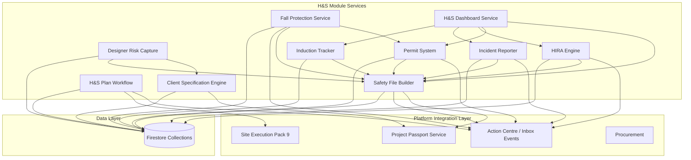
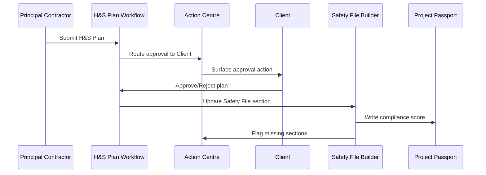
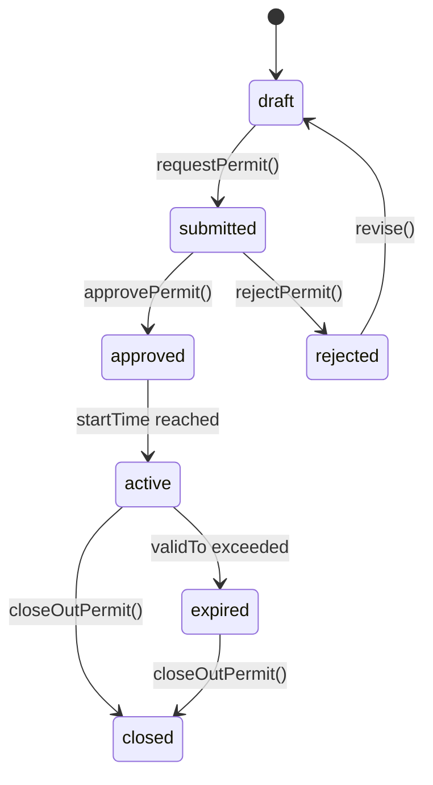
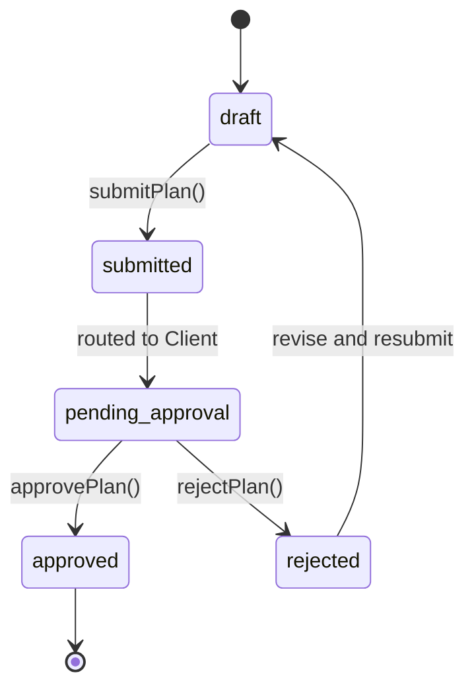
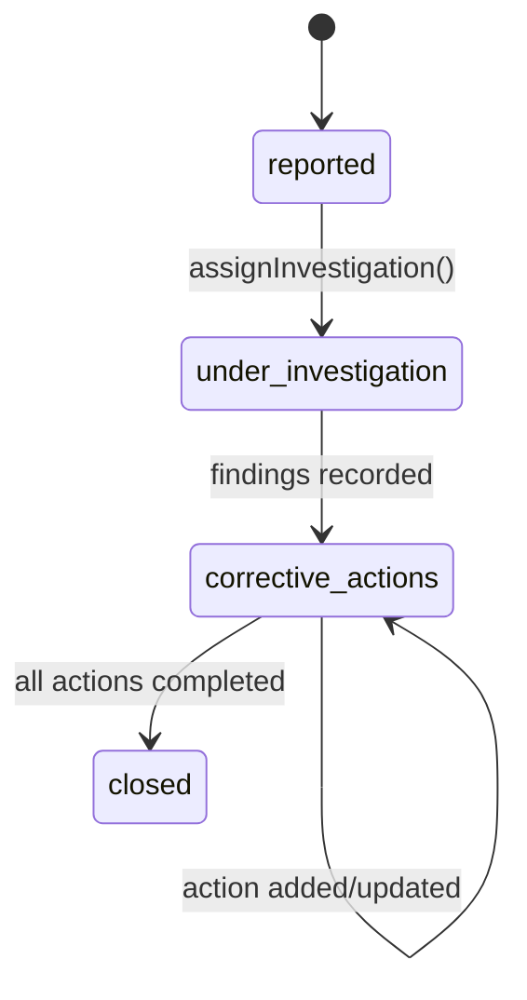

# Design Document: Health & Safety Module

## Overview

The Health & Safety Module elevates Architex's construction safety capabilities from a generic checklist into a full Construction Regulations 2014 workflow system. It provides structured document management (Safety File), approval workflows (H&S Plan), permit systems, incident reporting, hazard registers (HIRA), induction tracking, and fall protection planning — all grounded in the OHS Act 85 of 1993.

The module integrates deeply with Project Passport (compliance scores, safety status), Action Centre (approvals, escalations), Site Execution Pack 9 (daily logs, workforce), and Procurement (contractor H&S history). It introduces a new platform-level `health_safety` role and delivers role-differentiated dashboards for H&S Officer, Principal Contractor, Client, and Designer.

All regulatory guidance uses "advisory only" language — the module produces readiness assessments and gap reports, never certification.

### Design Rationale

- **Services-first**: All business logic lives in pure service files (`src/services/healthSafety/`) with no UI dependencies, enabling testability and reuse.
- **State machines for workflows**: Permit lifecycle, H&S Plan approval, and incident investigation use explicit state machines with validated transitions.
- **Event-driven integration**: Changes emit `WorkflowEvent` records consumed by Action Centre and Project Passport — no direct coupling between modules.
- **Compliance score as derived data**: The Safety File compliance score is calculated from section completeness, not stored as a separate mutable field.

## Architecture

### System Architecture Diagram



### Data Flow



## Components and Interfaces

### Service Layer (`src/services/healthSafety/`)

| Service File | Responsibility |
|---|---|
| `safetyFileService.ts` | Safety File composition, versioning, compliance score calculation |
| `hsPlanWorkflowService.ts` | H&S Plan submission, approval state machine, site blocking |
| `clientSpecificationService.ts` | Regulation 5(1) wizard logic, spec generation |
| `designerRiskService.ts` | Designer hazard capture, summary report generation |
| `hiraService.ts` | Hazard register CRUD, risk matrix calculation, control measure tracking |
| `inductionTrackerService.ts` | Toolbox talks, inductions, attendance, compliance flagging |
| `incidentReporterService.ts` | Incident capture, classification, investigation workflow |
| `fallProtectionService.ts` | Fall protection plans, inspection schedules, permit linkage |
| `permitService.ts` | Permit lifecycle state machine, approval routing, expiry enforcement |
| `hsDashboardService.ts` | Aggregated dashboard data, role-differentiated views |
| `hsIntegrationService.ts` | Project Passport writes, Action Centre events, Site Execution hooks |

### UI Components (`src/components/`)

| Component | Description |
|---|---|
| `HealthSafetyDashboard.tsx` | Role-aware H&S dashboard (primary entry point) |
| `SafetyFileViewer.tsx` | Safety File sections with completion indicators |
| `PermitManager.tsx` | Permit request, approval, and close-out interface |
| `IncidentReportForm.tsx` | Incident capture and investigation tracking |
| `HIRARegister.tsx` | Hazard register with risk matrix visualisation |
| `InductionPanel.tsx` | Induction and toolbox talk recording |
| `HSPlanApproval.tsx` | H&S Plan submission and approval workflow |
| `ClientSpecWizard.tsx` | Step-by-step Regulation 5(1) specification wizard |
| `FallProtectionPlan.tsx` | Fall protection plan creation and management |

### Integration Points

1. **Project Passport** — `hsIntegrationService.ts` calls `createWorkflowEvent()` on every compliance event (plan approved, permit issued, incident logged, score changed). Writes `ProjectRecord` envelopes with `moduleKey: 'site'` and H&S-specific `recordType` extensions.

2. **Action Centre** — Uses existing `createWorkflowEvent()` from `inboxEventAdapter.ts` with priority escalation for overdue permits, pending approvals, and Section 24 incidents.

3. **Site Execution (Pack 9)** — The H&S Dashboard exposes active permits, uninducted workers, and high-risk HIRA items via a `getSiteContextSafetyData()` function that Site Execution's daily log creation can query.

4. **Procurement** — `safetyFileService.ts` exposes `getContractorHSProfile()` returning submission status and compliance history for contractor evaluation.

5. **Navigation** — Adds an `health_safety` section under the `toolboxes` navigation item, accessible to `health_safety`, `site_manager`, `contractor`, and `client` roles.

### Key Function Signatures

```typescript
// ─── Safety File Builder ────────────────────────────────────────────────────
interface SafetyFileSection {
  sectionId: string;
  title: string;
  regulationRef: string;
  status: 'complete' | 'incomplete' | 'expired' | 'not_applicable';
  lastUpdated?: string;
  updatedBy?: string;
  version: number;
  linkedRecordIds: string[];
}

interface SafetyFile {
  id: string;
  projectId: string;
  tenantId: string;
  sections: SafetyFileSection[];
  complianceScore: number; // 0-100
  createdAt: string;
  updatedAt: string;
}

function initialiseSafetyFile(projectId: string, tenantId: string): SafetyFile;
function updateSection(file: SafetyFile, sectionId: string, update: Partial<SafetyFileSection>, actorId: string): SafetyFile;
function calculateComplianceScore(file: SafetyFile): number;
function getMissingSections(file: SafetyFile): SafetyFileSection[];
function generateComplianceEvents(file: SafetyFile, previousScore: number): WorkflowEvent[];

// ─── H&S Plan Workflow ──────────────────────────────────────────────────────
type HSPlanState = 'draft' | 'submitted' | 'pending_approval' | 'approved' | 'rejected';

interface HSPlan {
  id: string;
  projectId: string;
  version: number;
  state: HSPlanState;
  submittedBy: string;
  submittedAt?: string;
  approvedBy?: string;
  approvedAt?: string;
  rejectionReasons?: string[];
  documentUrl?: string;
}

function submitPlan(plan: HSPlan, submitterId: string): HSPlan;
function approvePlan(plan: HSPlan, approverId: string): HSPlan;
function rejectPlan(plan: HSPlan, approverId: string, reasons: string[]): HSPlan;
function canCreateSiteDiary(projectId: string, plan: HSPlan | null): boolean;
function checkEscalation(plan: HSPlan, now: Date): WorkflowEvent | null;
```

```typescript
// ─── HIRA Engine ────────────────────────────────────────────────────────────
type RiskLevel = 'low' | 'medium' | 'high' | 'critical';

interface HazardEntry {
  id: string;
  projectId: string;
  description: string;
  activity: string;
  location: string;
  likelihood: 1 | 2 | 3 | 4 | 5;
  severity: 1 | 2 | 3 | 4 | 5;
  riskRating: number; // likelihood × severity
  residualRisk: RiskLevel;
  existingControls: string[];
  additionalControls: string[];
  responsiblePerson: string;
  createdAt: string;
  updatedAt: string;
}

function createHazard(input: Omit<HazardEntry, 'id' | 'riskRating' | 'residualRisk' | 'createdAt' | 'updatedAt'>): HazardEntry;
function calculateRiskRating(likelihood: number, severity: number): { rating: number; level: RiskLevel };
function updateControls(hazard: HazardEntry, controls: string[]): HazardEntry;
function getHighRiskHazards(hazards: HazardEntry[]): HazardEntry[];

// ─── Permit System ──────────────────────────────────────────────────────────
type PermitType = 'excavation' | 'scaffolding' | 'hot_work' | 'confined_space';
type PermitState = 'draft' | 'submitted' | 'approved' | 'active' | 'expired' | 'closed' | 'rejected';

interface Permit {
  id: string;
  projectId: string;
  type: PermitType;
  location: string;
  hazards: string[];
  precautions: string[];
  responsiblePersons: string[];
  requestedBy: string;
  approvedBy?: string;
  validFrom?: string;
  validTo?: string;
  state: PermitState;
  closeOutBy?: string;
  closeOutAt?: string;
  closeOutConditionsMet?: boolean;
  linkedFallProtectionPlanId?: string;
  createdAt: string;
  updatedAt: string;
}

function requestPermit(input: Omit<Permit, 'id' | 'state' | 'createdAt' | 'updatedAt'>): Permit;
function approvePermit(permit: Permit, approverId: string): Permit;
function transitionPermitState(permit: Permit, newState: PermitState, actor: string): Permit;
function checkPermitExpiry(permit: Permit, now: Date): { expired: boolean; event?: WorkflowEvent };
function closeOutPermit(permit: Permit, actor: string, conditionsMet: boolean): Permit;
```

```typescript
// ─── Incident Reporter ──────────────────────────────────────────────────────
type InjuryClassification = 'first_aid' | 'medical_treatment' | 'lost_time' | 'fatality';
type IncidentState = 'reported' | 'under_investigation' | 'corrective_actions' | 'closed';

interface Incident {
  id: string;
  projectId: string;
  date: string;
  time: string;
  location: string;
  personsInvolved: string[];
  injuryClassification: InjuryClassification;
  description: string;
  immediateActions: string;
  isSection24Notifiable: boolean;
  state: IncidentState;
  investigatorId?: string;
  rootCause?: string;
  correctiveActions: CorrectiveAction[];
  reportedBy: string;
  createdAt: string;
  updatedAt: string;
}

interface CorrectiveAction {
  id: string;
  description: string;
  assignedTo: string;
  dueDate: string;
  completedAt?: string;
  status: 'open' | 'overdue' | 'completed';
}

function reportIncident(input: Omit<Incident, 'id' | 'state' | 'isSection24Notifiable' | 'correctiveActions' | 'createdAt' | 'updatedAt'>): Incident;
function classifySection24(incident: Incident): boolean;
function assignInvestigation(incident: Incident, investigatorId: string): Incident;
function addCorrectiveAction(incident: Incident, action: Omit<CorrectiveAction, 'id' | 'status'>): Incident;
function checkOverdueActions(incident: Incident, now: Date): WorkflowEvent[];

// ─── Induction Tracker ──────────────────────────────────────────────────────
type InductionType = 'site' | 'task_specific' | 'visitor';

interface ToolboxTalk {
  id: string;
  projectId: string;
  date: string;
  topic: string;
  presenter: string;
  duration: number; // minutes
  attendees: string[];
  createdAt: string;
}

interface Induction {
  id: string;
  projectId: string;
  inducteeId: string;
  inducteeName: string;
  type: InductionType;
  date: string;
  acknowledged: boolean;
  conductedBy: string;
  createdAt: string;
}

function recordToolboxTalk(input: Omit<ToolboxTalk, 'id' | 'createdAt'>): ToolboxTalk;
function recordInduction(input: Omit<Induction, 'id' | 'createdAt'>): Induction;
function getUninductedWorkers(projectId: string, workforce: string[], inductions: Induction[]): string[];
function isWorkerInducted(workerId: string, projectId: string, inductions: Induction[]): boolean;
```

```typescript
// ─── Fall Protection Service ────────────────────────────────────────────────
type FallProtectionMethod = 'guardrails' | 'safety_nets' | 'harnesses' | 'exclusion_zones';

interface FallProtectionPlan {
  id: string;
  projectId: string;
  methods: FallProtectionMethod[];
  workAreas: string[];
  responsiblePersons: string[];
  inspectionSchedule: InspectionSchedule;
  approvedAt?: string;
  approvedBy?: string;
  expiresAt?: string;
  linkedPermitIds: string[];
  createdAt: string;
  updatedAt: string;
}

interface InspectionSchedule {
  frequency: 'daily' | 'weekly' | 'fortnightly' | 'monthly';
  nextDue: string;
  lastCompleted?: string;
}

function createFallProtectionPlan(input: Omit<FallProtectionPlan, 'id' | 'createdAt' | 'updatedAt'>): FallProtectionPlan;
function approveFallProtectionPlan(plan: FallProtectionPlan, approverId: string): FallProtectionPlan;
function checkInspectionOverdue(plan: FallProtectionPlan, now: Date): boolean;
function linkToPermit(plan: FallProtectionPlan, permitId: string): FallProtectionPlan;

// ─── Client Specification Engine ────────────────────────────────────────────
interface ClientHSSpecification {
  id: string;
  projectId: string;
  projectDescription: string;
  scopeOfWork: string;
  knownHazards: string[];
  minimumHSRequirements: string[];
  complianceMonitoringArrangements: string;
  completedAt?: string;
  createdAt: string;
  updatedAt: string;
}

function createSpecification(projectId: string): ClientHSSpecification;
function updateSpecificationStep(spec: ClientHSSpecification, step: keyof ClientHSSpecification, value: unknown): ClientHSSpecification;
function isSpecificationComplete(spec: ClientHSSpecification): boolean;
function generateSpecificationDocument(spec: ClientHSSpecification): string;

// ─── Designer Risk Capture ──────────────────────────────────────────────────
interface DesignerRiskAssessment {
  id: string;
  projectId: string;
  designDiscipline: string;
  hazardDescription: string;
  associatedDesignElement: string;
  riskLevel: RiskLevel;
  recommendedControls: string[];
  createdBy: string;
  createdAt: string;
  updatedAt: string;
}

function captureDesignerRisk(input: Omit<DesignerRiskAssessment, 'id' | 'createdAt' | 'updatedAt'>): DesignerRiskAssessment;
function getProjectDesignerRisks(projectId: string, assessments: DesignerRiskAssessment[]): DesignerRiskAssessment[];
function generateDesignerRiskSummary(assessments: DesignerRiskAssessment[]): string;
```

### State Machine Definitions

#### Permit Lifecycle



#### H&S Plan Approval



#### Incident Investigation



## Data Models

### Firestore Collection Structure

```
projects/{projectId}/
├── safetyFile/
│   └── {safetyFileId}          # SafetyFile document
│       └── versions/{versionId} # Audit trail of section changes
├── hsPlans/
│   └── {planId}                 # HSPlan document (versioned)
├── permits/
│   └── {permitId}              # Permit document
├── incidents/
│   └── {incidentId}           # Incident document
│       └── correctiveActions/{actionId}
├── hazards/
│   └── {hazardId}             # HazardEntry document
├── inductions/
│   └── {inductionId}          # Induction document
├── toolboxTalks/
│   └── {talkId}               # ToolboxTalk document
├── fallProtectionPlans/
│   └── {planId}               # FallProtectionPlan document
├── clientHSSpec/
│   └── {specId}               # ClientHSSpecification document
└── designerRisks/
    └── {assessmentId}         # DesignerRiskAssessment document
```

### Security Rules Considerations

- **Read access**: Users with `health_safety`, `site_manager`, `contractor`, or `client` role AND project membership can read H&S collections.
- **Write access**: `health_safety` and `contractor` roles can write to most H&S collections. `client` role can only write to `hsPlans` (approval actions) and `clientHSSpec`.
- **Designer access**: `architect` and `engineer` roles can write to `designerRisks` for their assigned projects.
- **Audit immutability**: Version subcollections are append-only; no updates or deletes permitted.

### TypeScript Type Extensions

The following types will be added to support the H&S module:

```typescript
// Added to src/types.ts UserRole union:
// 'health_safety'

// New ProjectRecordType extensions (in lifecycleTypes.ts):
// | 'hs_plan_approved'
// | 'permit_issued'
// | 'incident_reported'
// | 'safety_file_score_changed'
// | 'hs_specification_complete'

// New WorkflowEvent sourceModule (in lifecycleTypes.ts):
// | 'health_safety'
```

### Risk Matrix (5×5)

| Likelihood \ Severity | 1 (Negligible) | 2 (Minor) | 3 (Moderate) | 4 (Major) | 5 (Catastrophic) |
|---|---|---|---|---|---|
| **5 (Almost Certain)** | 5 Medium | 10 High | 15 Critical | 20 Critical | 25 Critical |
| **4 (Likely)** | 4 Low | 8 High | 12 High | 16 Critical | 20 Critical |
| **3 (Possible)** | 3 Low | 6 Medium | 9 High | 12 High | 15 Critical |
| **2 (Unlikely)** | 2 Low | 4 Low | 6 Medium | 8 High | 10 High |
| **1 (Rare)** | 1 Low | 2 Low | 3 Low | 4 Low | 5 Medium |

**Classification thresholds:**
- Low: 1–4
- Medium: 5–9
- High: 10–15
- Critical: 16–25

## Correctness Properties

*A property is a characteristic or behavior that should hold true across all valid executions of a system — essentially, a formal statement about what the system should do. Properties serve as the bridge between human-readable specifications and machine-verifiable correctness guarantees.*

### Property 1: Safety File initialisation completeness

*For any* valid project ID and tenant ID, calling `initialiseSafetyFile()` SHALL produce a SafetyFile containing all Regulation 7 mandatory section IDs (H&S Plan, risk assessments, fall protection plan, permits, incident records, induction records, emergency procedures, appointments), each in 'incomplete' status with version 0.

**Validates: Requirements 1.1, 1.4**

### Property 2: Section update versioning and audit trail

*For any* SafetyFile and any valid section update, calling `updateSection()` SHALL increment the section's version number by exactly 1 and append an audit trail entry preserving the actor ID and timestamp — the new version equals the old version plus one.

**Validates: Requirements 1.2**

### Property 3: Compliance score calculation correctness

*For any* SafetyFile with N mandatory sections where K are in 'complete' status, `calculateComplianceScore()` SHALL return a value equal to `Math.round((K / N) * 100)`. Furthermore, if the new score differs from the previous score, `generateComplianceEvents()` SHALL produce exactly one WorkflowEvent; if scores are equal, it SHALL produce zero events.

**Validates: Requirements 1.5, 1.6**

### Property 4: Non-compliant section detection

*For any* SafetyFile containing at least one mandatory section with status 'incomplete' or 'expired', `getMissingSections()` SHALL return a non-empty array containing exactly those non-compliant sections, and each SHALL be surfaced as an Action Centre event.

**Validates: Requirements 1.3**

### Property 5: H&S Plan approval round-trip unblocks site operations

*For any* HSPlan in 'draft' state, the sequence `submitPlan()` → `approvePlan()` SHALL transition the plan to 'approved' state with populated approvedBy and approvedAt fields, AND `canCreateSiteDiary()` SHALL return `true` after approval. Conversely, while the plan state is 'pending_approval', `canCreateSiteDiary()` SHALL return `false`.

**Validates: Requirements 2.1, 2.2, 2.3**

### Property 6: H&S Plan rejection preserves reasons

*For any* HSPlan in 'pending_approval' state and any non-empty array of rejection reason strings, calling `rejectPlan()` SHALL transition the plan to 'rejected' state and the plan's `rejectionReasons` array SHALL equal the input reasons array.

**Validates: Requirements 2.4**

### Property 7: H&S Plan escalation on timeout

*For any* HSPlan submitted at time T, calling `checkEscalation(plan, now)` where `now` exceeds T by more than 5 business days SHALL return a non-null WorkflowEvent with priority 'high'. When `now` is within 5 business days of T, it SHALL return null.

**Validates: Requirements 2.5**

### Property 8: Client specification document generation preserves all input

*For any* complete ClientHSSpecification (all required fields non-empty), calling `generateSpecificationDocument()` SHALL produce a string containing the project description, scope of work, all known hazards, all minimum H&S requirements, and compliance monitoring arrangements from the input.

**Validates: Requirements 3.2, 3.3**

### Property 9: Designer risk assessment round-trip

*For any* valid DesignerRiskAssessment input, calling `captureDesignerRisk()` then filtering with `getProjectDesignerRisks(projectId, assessments)` SHALL return an array containing the captured assessment with all original fields (hazardDescription, associatedDesignElement, riskLevel, recommendedControls) preserved unchanged. Furthermore, `generateDesignerRiskSummary()` on any non-empty set SHALL produce a string mentioning every hazardDescription from the input set.

**Validates: Requirements 4.1, 4.2, 4.4**

### Property 10: HIRA risk rating calculation and classification

*For any* likelihood value in [1,5] and severity value in [1,5], `calculateRiskRating(likelihood, severity)` SHALL return a rating equal to `likelihood × severity` and a level classification matching the thresholds: Low (1–4), Medium (5–9), High (10–15), Critical (16–25). Additionally, `createHazard()` SHALL preserve all input fields and populate riskRating and residualRisk from the calculation.

**Validates: Requirements 5.1, 5.2**

### Property 11: High/critical hazard Action Centre notification

*For any* HazardEntry with residualRisk of 'high' or 'critical', the system SHALL generate an Action Centre WorkflowEvent requiring additional control measures. For any HazardEntry with residualRisk of 'low' or 'medium', no such event SHALL be generated.

**Validates: Requirements 5.3**

### Property 12: Uninducted worker detection

*For any* workforce list W and induction record set I for a project, `getUninductedWorkers(projectId, W, I)` SHALL return exactly the set W \ {inductees in I with matching projectId} — the workers present in the workforce but absent from the induction records.

**Validates: Requirements 6.3**

### Property 13: Induction and toolbox talk data preservation

*For any* valid ToolboxTalk input (date, topic, presenter, duration, attendees), calling `recordToolboxTalk()` SHALL produce a record preserving all input fields unchanged. *For any* valid Induction input (inducteeId, type, date, acknowledged), calling `recordInduction()` SHALL produce a record preserving all input fields unchanged.

**Validates: Requirements 6.1, 6.2**

### Property 14: Incident Section 24 classification

*For any* Incident with injuryClassification of 'fatality', `classifySection24()` SHALL return `true`. *For any* Incident with injuryClassification of 'first_aid', `classifySection24()` SHALL return `false`. For 'medical_treatment' and 'lost_time', classification SHALL follow the statutory definition of "serious injury requiring hospitalisation or dangerous occurrence."

**Validates: Requirements 7.2**

### Property 15: Corrective action overdue escalation

*For any* Incident with corrective actions where at least one action has a `dueDate` before `now` and `completedAt` is null, `checkOverdueActions(incident, now)` SHALL return a non-empty array of WorkflowEvents with priority 'high'. When all actions are completed or not yet due, it SHALL return an empty array.

**Validates: Requirements 7.4**

### Property 16: Fall protection plan gating of permits

*For any* permit request for work involving heights (requiring fall protection) where no approved FallProtectionPlan is linked, the Permit_System SHALL block permit issuance. When an approved FallProtectionPlan is linked, permit approval SHALL proceed.

**Validates: Requirements 8.1**

### Property 17: Permit time-window enforcement and expiry transition

*For any* Permit in 'active' state with a `validTo` timestamp, calling `checkPermitExpiry(permit, now)` where `now > validTo` SHALL return `{ expired: true }` with a WorkflowEvent requiring close-out or renewal. When `now <= validTo`, it SHALL return `{ expired: false }` with no event.

**Validates: Requirements 9.3, 9.4**

### Property 18: Permit close-out records details

*For any* Permit in 'active' or 'expired' state, calling `closeOutPermit(permit, actor, conditionsMet)` SHALL transition state to 'closed' and populate `closeOutBy` with the actor, `closeOutAt` with a timestamp, and `closeOutConditionsMet` with the input boolean.

**Validates: Requirements 9.5**

### Property 19: Dashboard role-differentiated aggregation

*For any* set of project H&S data and any role in {health_safety, contractor, client, architect}, the dashboard service SHALL return a view containing only the metrics appropriate for that role. The H&S Officer view SHALL include operational detail (permits, inductions, investigations). The Client view SHALL include only plan approval status and overall compliance scores.

**Validates: Requirements 10.2, 10.4**

### Property 20: Site context safety data surfacing

*For any* project with active permits, uninducted workers, and high-risk HIRA items, calling `getSiteContextSafetyData(projectId)` SHALL return all three categories of data. For a project with no active permits, no uninducted workers, and no high-risk items, each respective array SHALL be empty.

**Validates: Requirements 11.3**

### Property 21: Advisory disclaimer invariant

*For any* generated report or compliance score output from the Safety File Builder, the output string SHALL contain the advisory-only disclaimer text stating the module does not constitute professional certification.

**Validates: Requirements 11.5**

## Error Handling

### Service-Level Error Strategy

| Error Scenario | Handling |
|---|---|
| Invalid state transition (e.g. approve a plan not in pending_approval) | Throw `InvalidStateTransitionError` with current state and attempted transition |
| Missing required fields on create/update | Zod schema validation rejects input before service logic executes |
| Permit approval without linked fall protection plan | Return `{ blocked: true, reason: 'fall_protection_plan_required' }` |
| Section update on non-existent safety file | Throw `NotFoundError` with entity type and ID |
| Risk rating out of bounds (likelihood/severity outside 1-5) | Zod schema clamps to valid range or rejects |
| Concurrent version conflict (optimistic locking) | Return version conflict error, client retries with latest version |
| Firestore write failure | Catch and re-throw as `PersistenceError`; caller decides retry strategy |
| Action Centre event generation failure | Log error, do not block primary operation — events are eventually consistent |

### Validation Approach

All service inputs are validated using Zod schemas before business logic executes. Schemas will be defined in `src/services/healthSafety/hsSchemas.ts`:

```typescript
import { z } from 'zod';

export const HazardEntrySchema = z.object({
  projectId: z.string().min(1),
  description: z.string().min(1).max(2000),
  activity: z.string().min(1),
  location: z.string().min(1),
  likelihood: z.number().int().min(1).max(5),
  severity: z.number().int().min(1).max(5),
  existingControls: z.array(z.string()),
  additionalControls: z.array(z.string()),
  responsiblePerson: z.string().min(1),
});

export const PermitRequestSchema = z.object({
  projectId: z.string().min(1),
  type: z.enum(['excavation', 'scaffolding', 'hot_work', 'confined_space']),
  location: z.string().min(1),
  hazards: z.array(z.string()).min(1),
  precautions: z.array(z.string()).min(1),
  responsiblePersons: z.array(z.string()).min(1),
  requestedBy: z.string().min(1),
  validFrom: z.string().datetime(),
  validTo: z.string().datetime(),
});

export const IncidentReportSchema = z.object({
  projectId: z.string().min(1),
  date: z.string(),
  time: z.string(),
  location: z.string().min(1),
  personsInvolved: z.array(z.string()).min(1),
  injuryClassification: z.enum(['first_aid', 'medical_treatment', 'lost_time', 'fatality']),
  description: z.string().min(10).max(5000),
  immediateActions: z.string().min(1),
  reportedBy: z.string().min(1),
});
```

## Testing Strategy

### Dual Testing Approach

**Property-Based Tests (Vitest + fast-check)**

The module is highly suited to property-based testing because:
- Services are pure functions with clear input/output (no side effects in business logic layer)
- Universal properties exist across wide input ranges (risk calculations, state machines, set operations)
- Input space is large (arbitrary strings, date combinations, risk level combinations)

Configuration:
- Library: `fast-check` (de-facto PBT library for TypeScript/Vitest)
- Minimum 100 iterations per property test
- Each test tagged with: `Feature: health-safety-module, Property {N}: {description}`
- One property-based test per correctness property above

**Unit Tests (Vitest)**

Focus areas:
- Specific state machine edge cases (double-approve, approve after reject)
- Integration point contracts (correct WorkflowEvent shape, correct ProjectRecord type)
- Error paths (invalid inputs, missing entities, permission violations)
- Boundary conditions (score at 0%, 100%, exactly 5 business days)

**Integration Tests**

- Firestore read/write for all H&S collections (using emulator)
- End-to-end workflow: create project → init safety file → submit plan → approve → create site diary
- Action Centre event delivery verification
- Project Passport score write-back

### Test File Structure

```
src/services/healthSafety/__tests__/
├── safetyFileService.test.ts         # Properties 1-4
├── hsPlanWorkflowService.test.ts     # Properties 5-7
├── clientSpecificationService.test.ts # Property 8
├── designerRiskService.test.ts       # Property 9
├── hiraService.test.ts               # Properties 10-11
├── inductionTrackerService.test.ts   # Properties 12-13
├── incidentReporterService.test.ts   # Properties 14-15
├── fallProtectionService.test.ts     # Property 16
├── permitService.test.ts             # Properties 17-18
├── hsDashboardService.test.ts        # Property 19
├── hsIntegrationService.test.ts      # Properties 20-21
```

### Property Test Example

```typescript
import { describe, it, expect } from 'vitest';
import { fc } from '@fast-check/vitest';
import { calculateRiskRating } from '../hiraService';

describe('HIRA Engine', () => {
  // Feature: health-safety-module, Property 10: HIRA risk rating calculation
  it.prop([
    fc.integer({ min: 1, max: 5 }),
    fc.integer({ min: 1, max: 5 }),
  ])('risk rating equals likelihood × severity with correct classification',
    (likelihood, severity) => {
      const result = calculateRiskRating(likelihood, severity);
      expect(result.rating).toBe(likelihood * severity);
      
      const rating = result.rating;
      if (rating <= 4) expect(result.level).toBe('low');
      else if (rating <= 9) expect(result.level).toBe('medium');
      else if (rating <= 15) expect(result.level).toBe('high');
      else expect(result.level).toBe('critical');
    }
  );
});
```
