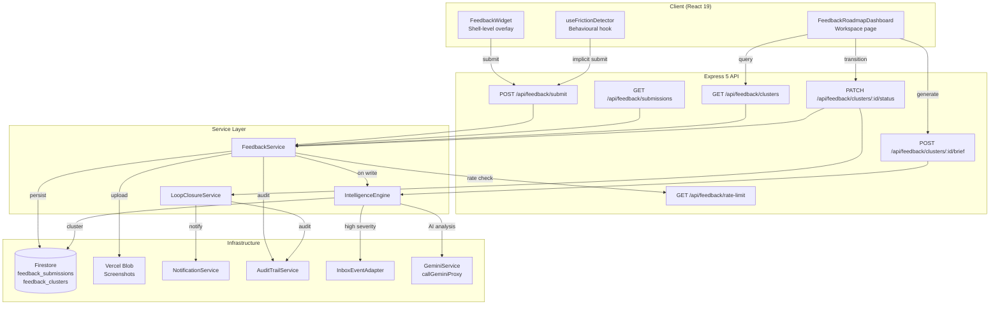

# Design Document: Intelligent Feedback Loop

## Overview

The Intelligent Feedback Loop is a cross-cutting platform feature that enables structured user feedback collection, AI-powered deduplication and categorisation, operator-facing roadmap intelligence, and closed-loop notifications. It consists of six interconnected subsystems:

1. **Feedback Widget** — A persistent overlay component rendered at the App shell level (alongside `DemoBanner` and `Toaster`), accessible on every authenticated page
2. **Context-Aware Submission** — Automatic capture of page context, attachment handling via Vercel Blob, and Firestore persistence
3. **Intelligence Engine** — Server-side AI processing using the existing Gemini infrastructure for deduplication, sentiment analysis, and severity scoring
4. **Roadmap Dashboard** — A new workspace page (platform_admin only) surfacing clustered feedback with AI-generated feature briefs
5. **Loop Closure Service** — Status transition management with user notification via the existing NotificationService
6. **Friction Detector** — Client-side behavioural monitoring hook that generates implicit feedback from user struggle patterns

The system integrates deeply with the platform spine: writing audit events for all lifecycle actions, creating Action Centre inbox items for high-severity clusters, linking project-scoped feedback to Project Passport records, and extending the existing notification type registry.

## Architecture



### Deployment Topology

- **Client components** render within the existing React SPA (no separate app instance)
- **API endpoints** added to `src/lib/api-router.ts` following the existing Express 5 pattern
- **Intelligence Engine** runs server-side, triggered synchronously on feedback persistence (with 30s timeout and fallback)
- **No additional infrastructure** — uses existing Firestore, Vercel Blob, Gemini proxy, and notification worker

## Components and Interfaces

### 1. FeedbackWidget (Client)

**Location:** `src/components/feedback/FeedbackWidget.tsx`
**Rendered at:** App shell level in `App.tsx` (same tier as `DemoBanner`, `Toaster`)

```typescript
interface FeedbackWidgetProps {
  user: UserProfile;
}

interface ContextSnapshot {
  pagePath: string;
  activeModule: string;
  projectId: string | null;
  userRole: UserRole;
  viewportWidth: number;
  viewportHeight: number;
}

interface FeedbackFormData {
  category: 'bug' | 'feature_request' | 'usability' | 'praise';
  description: string;
  attachments: File[];  // max 3, PNG/JPEG, ≤5MB each
}
```

**Responsibilities:**
- Render persistent 44×44px trigger button (bottom-right, `z-50`)
- Open/close overlay panel with focus trap and Escape key handling
- Capture `ContextSnapshot` on open
- Validate form (category required, 10–2000 chars non-whitespace, file constraints)
- Upload attachments via API, then submit feedback
- Display "My Feedback" section showing user's 20 most recent submissions with status

### 2. useFrictionDetector (Client Hook)

**Location:** `src/hooks/useFrictionDetector.ts`

```typescript
interface FrictionSignal {
  type: 'repeated_errors' | 'workflow_abandonment' | 'rage_clicks';
  pagePath: string;
  targetIdentifier: string;
  count: number;
  timestamp: string;
}

function useFrictionDetector(user: UserProfile): void;
```

**Detection Rules:**
- **Repeated errors**: ≥3 errors on same (page, target) within 60s
- **Workflow abandonment**: Navigation away from multi-step process after reaching step ≥2
- **Rage clicks**: ≥5 rapid clicks on same element (no state change) within 3s window, each within 500ms

**Constraints:**
- Max 1 implicit submission per (signal type, page, target) per user per 24h
- Never captures form values, document content, or chat messages
- Fails silently — no user-facing errors

### 3. FeedbackService (Server)

**Location:** `src/services/feedbackService.ts`

```typescript
interface FeedbackSubmission {
  id: string;
  userId: string;
  category: 'bug' | 'feature_request' | 'usability' | 'praise';
  description: string;
  contextSnapshot: ContextSnapshot;
  attachmentUrls: string[];
  status: FeedbackStatus;
  implicit: boolean;
  clusterId: string | null;
  aiCategory: string | null;
  sentiment: 'positive' | 'neutral' | 'negative' | 'frustrated' | null;
  createdAt: string;  // ISO-8601 UTC
  updatedAt: string;
  softDeleted: boolean;
}

type FeedbackStatus = 'received' | 'reviewing' | 'planned' | 'shipped' | 'declined';

interface FeedbackCluster {
  id: string;
  title: string;
  category: 'bug' | 'feature_request' | 'usability' | 'praise';
  status: FeedbackStatus;
  occurrenceCount: number;
  distinctUserCount: number;
  severityScore: number;  // 1–10 integer
  averageSentiment: string;
  submissionIds: string[];
  aiCategoryMismatchCount: number;
  open: boolean;  // false when no submissions for 30 days
  lastSubmissionAt: string;
  createdAt: string;
  updatedAt: string;
}
```

**API Endpoints:**

| Method | Path | Auth | Description |
|--------|------|------|-------------|
| POST | `/api/feedback/submit` | Any authenticated | Submit feedback (explicit or implicit) |
| GET | `/api/feedback/submissions` | Self or platform_admin | List user's submissions |
| GET | `/api/feedback/clusters` | platform_admin | List clusters with filtering/pagination |
| GET | `/api/feedback/clusters/:id` | platform_admin | Get cluster detail with submissions |
| PATCH | `/api/feedback/clusters/:id/status` | platform_admin | Transition cluster status |
| POST | `/api/feedback/clusters/:id/brief` | platform_admin | Generate AI feature brief |
| GET | `/api/feedback/rate-limit` | Any authenticated | Check remaining submissions |
| DELETE | `/api/feedback/submissions/my-data` | Self | Request soft-delete of all user data |

### 4. IntelligenceEngine (Server)

**Location:** `src/services/feedbackIntelligenceEngine.ts`

```typescript
interface ProcessingResult {
  clusterId: string;
  isNewCluster: boolean;
  similarityScore: number;
  sentiment: 'positive' | 'neutral' | 'negative' | 'frustrated';
  aiCategory: string;
  categoryMismatch: boolean;
}

async function processSubmission(submission: FeedbackSubmission): Promise<ProcessingResult>;
async function computeSeverityScore(cluster: FeedbackCluster): Promise<number>;
async function generateFeatureBrief(cluster: FeedbackCluster): Promise<string>;
```

**AI Integration Pattern** (follows `geminiService.ts`):

```typescript
// Uses existing callGeminiProxy with withRetry
const result = await withRetry(() => callGeminiProxy(
  FEEDBACK_SYSTEM_INSTRUCTION,
  buildDeduplicationPrompt(submission, existingClusters),
  undefined,  // no drawing
  await getLLMConfig()
));
```

**Processing Flow:**
1. New submission persisted → trigger `processSubmission()`
2. AI computes similarity against open clusters (threshold: 0.75)
3. Merge into existing cluster OR create new cluster
4. Assign sentiment label (skip AI for descriptions <10 chars)
5. Recompute severity score for affected cluster
6. Flag category mismatches for operator review
7. If severity ≥8, create Action Centre inbox item

**Fallback:** If Gemini is unavailable or times out (30s), create new cluster, assign `neutral` sentiment, queue for reprocessing within 10 minutes.

### 5. LoopClosureService (Server)

**Location:** `src/services/feedbackLoopClosureService.ts`

```typescript
async function notifyStatusTransition(
  cluster: FeedbackCluster,
  newStatus: FeedbackStatus,
  actionDescription: string,
  operatorId: string,
  releaseNoteUrl?: string,
  declineReason?: string
): Promise<void>;
```

**New Notification Types** (extends `NotificationType` union):
- `feedback_status_changed` — cluster moved to reviewing/planned
- `feedback_shipped` — cluster marked shipped (includes release note link)
- `feedback_declined` — cluster declined (includes reason)

**Integration:** Uses `NotificationService.sendNotification()` with channels `['in_app', 'email']` for each affected submitter.

### 6. FeedbackRoadmapDashboard (Client)

**Location:** `src/components/feedback/FeedbackRoadmapDashboard.tsx`
**Registration:** New workspace page in App.tsx — `activeTab === 'feedback-roadmap'`
**Access:** `platform_admin` role only

Follows the standard workspace pattern:
- Header Card (tool title, severity summary stats)
- Tab Navigation: Overview | Clusters | Trend Chart | Settings
- Cluster list sorted by severity, paginated (25/page)
- Cluster detail view with submissions (50/page)
- AI-generated feature brief panel for `feature_request` clusters
- Status transition controls with required action description

## Data Models

### Firestore Collections

#### `feedback_submissions`

```typescript
{
  id: string;                    // auto-generated
  userId: string;                // Firebase Auth UID
  category: string;              // bug | feature_request | usability | praise
  description: string;           // 10–2000 chars (non-whitespace min 10)
  contextSnapshot: {
    pagePath: string;
    activeModule: string;
    projectId: string | null;
    userRole: string;
    viewportWidth: number;
    viewportHeight: number;
  };
  attachmentUrls: string[];      // Vercel Blob URLs (max 3)
  status: string;                // received | reviewing | planned | shipped | declined
  implicit: boolean;             // true for friction-detected submissions
  implicitMetadata?: {
    frictionType: string;        // repeated_errors | workflow_abandonment | rage_clicks
    targetIdentifier: string;
    signalCount: number;
  };
  clusterId: string | null;      // assigned after AI processing
  aiCategory: string | null;     // AI-assigned category
  sentiment: string | null;      // positive | neutral | negative | frustrated
  categoryMismatch: boolean;     // true when user vs AI category differ
  createdAt: string;             // ISO-8601 UTC
  updatedAt: string;
  softDeleted: boolean;          // true after GDPR deletion request
}
```

**Security Rules:**
- User can read/write own submissions only
- `platform_admin` can read all submissions
- No cross-user read access for any other role

#### `feedback_clusters`

```typescript
{
  id: string;                    // auto-generated
  title: string;                 // AI-generated summary title
  category: string;              // dominant category
  status: string;                // received | reviewing | planned | shipped | declined
  occurrenceCount: number;       // total submissions in cluster
  distinctUserCount: number;     // unique user UIDs
  distinctUserIds: string[];     // for notification targeting
  severityScore: number;         // 1–10 integer
  sentimentBreakdown: {
    positive: number;
    neutral: number;
    negative: number;
    frustrated: number;
  };
  averageSentiment: string;      // weighted dominant sentiment
  submissionIds: string[];       // ordered by recency
  aiCategoryMismatchCount: number;
  open: boolean;                 // false after 30 days no activity
  lastSubmissionAt: string;
  statusHistory: Array<{
    from: string;
    to: string;
    operatorId: string;
    actionDescription: string;
    declineReason?: string;
    releaseNoteUrl?: string;
    timestamp: string;
  }>;
  featureBrief?: {
    problemStatement: string;
    affectedRoles: string[];
    suggestedScope: string;
    estimatedImpact: string;
    generatedAt: string;
  };
  createdAt: string;
  updatedAt: string;
}
```

**Security Rules:**
- Read/write restricted to `platform_admin` role only

### Vercel Blob Storage

Feedback screenshot attachments stored using the existing upload pattern:
- Path format: `feedback/{submissionId}/{filename}`
- Access: `public` (same as existing uploaded_files)
- Metadata tracked in `feedback_submissions.attachmentUrls[]`
- Deleted on soft-delete via `del()` from `@vercel/blob`

### Rate Limiting Data

Rate limit state tracked via Firestore query:
- Count submissions where `userId == X` AND `createdAt > (now - 24h)` AND `implicit == false`
- Limit: 10 explicit submissions per user per rolling 24h window
- Implicit (friction-detected) submissions are exempt from rate limiting


## Correctness Properties

*A property is a characteristic or behavior that should hold true across all valid executions of a system — essentially, a formal statement about what the system should do. Properties serve as the bridge between human-readable specifications and machine-verifiable correctness guarantees.*

### Property 1: Description validation correctness

*For any* string input, the feedback description validator should accept the input if and only if it contains at least 10 non-whitespace characters AND has at most 2000 total characters. All other inputs must be rejected.

**Validates: Requirements 2.3, 2.6**

### Property 2: Attachment validation correctness

*For any* file with a given MIME type and byte size, and for any current attachment count, the attachment validator should accept the file if and only if the type is `image/png` or `image/jpeg`, the size is ≤5,242,880 bytes, and the current attachment count is less than 3.

**Validates: Requirements 2.4, 2.9, 8.6**

### Property 3: Submission persistence round-trip

*For any* valid feedback submission (valid category, valid description, valid attachments), persisting the submission and reading it back should produce a record containing the exact context snapshot fields, an ISO-8601 UTC timestamp, the submitter's UID, status equal to `received`, and all attachment URLs intact.

**Validates: Requirements 2.1, 2.5**

### Property 4: Clustering threshold logic

*For any* new submission and any set of existing open clusters with computed similarity scores, the submission should be merged into the cluster with the highest similarity score if that score exceeds 0.75 (incrementing occurrence count by 1), OR a new cluster should be created with occurrence count 1 if all scores are ≤0.75.

**Validates: Requirements 3.2, 3.3**

### Property 5: Sentiment assignment validity

*For any* processed feedback submission, exactly one sentiment label from the set {`positive`, `neutral`, `negative`, `frustrated`} must be assigned. If the description contains fewer than 10 characters, the label must be `neutral`.

**Validates: Requirements 3.4, 3.5**

### Property 6: Severity score bounds

*For any* feedback cluster with any combination of occurrence count (≥1), sentiment distribution, and distinct user count (≥1), the computed severity score must be an integer between 1 and 10 inclusive.

**Validates: Requirements 3.6**

### Property 7: Category mismatch detection

*For any* feedback submission where the AI-assigned category differs from the submitter-selected category, the `categoryMismatch` flag must be `true`. Where they are equal, the flag must be `false`.

**Validates: Requirements 3.7**

### Property 8: Cluster staleness rule

*For any* feedback cluster, the cluster should be marked `open: true` if and only if its `lastSubmissionAt` timestamp is within the preceding 30 days of the current evaluation time. Otherwise it must be marked `open: false`.

**Validates: Requirements 3.10**

### Property 9: Status transition state machine

*For any* (currentStatus, requestedStatus) pair, the transition is valid if and only if it follows one of: `received→reviewing`, `reviewing→planned`, `planned→shipped`, `received→declined`, or `reviewing→declined`. All other transitions must be rejected. Additionally, a valid transition must include an action description of ≥10 characters, and a decline transition must include a decline reason of ≥20 characters.

**Validates: Requirements 4.6, 5.8**

### Property 10: Cluster display ordering

*For any* list of feedback clusters, the displayed list must be sorted by severity score in strictly non-increasing (descending) order.

**Validates: Requirements 4.2**

### Property 11: Filter correctness

*For any* set of feedback clusters and any combination of filter criteria (category, date range, status), the returned result set must contain only clusters that satisfy ALL active filter predicates simultaneously.

**Validates: Requirements 4.3**

### Property 12: Loop closure notification targeting

*For any* feedback cluster with N distinct submitters (including submitters whose original submission was merged from another cluster), and any valid status transition, exactly N notifications must be generated — one per distinct submitter — each containing the cluster title, new status, and the operator-provided action description.

**Validates: Requirements 5.1, 5.3, 5.7**

### Property 13: My Feedback display constraints

*For any* user with N total submissions, the "My Feedback" section must display exactly min(N, 20) items, sorted by submission date in strictly non-increasing (descending) order.

**Validates: Requirements 5.6**

### Property 14: Friction detection and deduplication

*For any* sequence of user interaction events, the friction detector must identify a signal if and only if the sequence meets one of the threshold conditions (≥3 errors on same target within 60s, abandonment at step ≥2, or ≥5 rapid clicks on same element within 3s). For any user, at most one implicit submission per distinct friction pattern (type + page + target) may exist within a 24-hour rolling window.

**Validates: Requirements 6.1, 6.2, 6.4**

### Property 15: Implicit submission privacy constraint

*For any* implicit feedback submission generated by the friction detector, the description and metadata must contain only structural interaction data (page path, action type, error codes, element identifiers, click coordinates relative to element bounds) and must never contain form field values, document content, or chat message text.

**Validates: Requirements 6.5**

### Property 16: Audit trail completeness

*For any* feedback lifecycle action (submission created, cluster merged, status changed, notification sent, implicit friction detected), an audit trail event must be recorded containing the actor ID, action type, source object ID, and timestamp.

**Validates: Requirements 7.1, 2.7**

### Property 17: Project Passport linkage

*For any* feedback submission where the context snapshot contains a non-null project ID, a reference must exist in that project's Passport record linking back to the feedback submission.

**Validates: Requirements 7.2**

### Property 18: High-severity Action Centre escalation

*For any* feedback cluster with a computed severity score S, an Action Centre inbox item for all `platform_admin` users must be created if and only if S ≥ 8. Additionally, any cluster with status `received` and last modified more than 7 calendar days ago must trigger a "pending review" inbox item.

**Validates: Requirements 7.3, 7.8**

### Property 19: Rate limit enforcement

*For any* authenticated user with N explicit feedback submissions (implicit=false) within the preceding 24-hour rolling window, submission attempt N+1 must be accepted if N < 10 and rejected if N ≥ 10. Implicit submissions are exempt from this count.

**Validates: Requirements 8.1**

### Property 20: Soft-delete data removal

*For any* user who requests data deletion, after the soft-delete operation completes: all of that user's submission descriptions must be empty strings, all associated Vercel Blob attachment URLs must be deleted, no user-identifiable fields remain, and the affected clusters' occurrence counts must remain unchanged (preserving aggregate statistics).

**Validates: Requirements 8.5, 8.7**

## Error Handling

### Client-Side (FeedbackWidget)

| Error Scenario | Handling |
|----------------|----------|
| Network failure on submit | Display inline error, retain form content, allow retry |
| Attachment upload failure | Show error at attachment area, retain valid attachments |
| Rate limit exceeded | Display limit message with countdown to next available slot |
| Widget mount failure | Fail silently (catch at ErrorBoundary), log to console |
| Friction detector error | Log to console, do not surface to user or disrupt session |

### Server-Side (FeedbackService / IntelligenceEngine)

| Error Scenario | Handling |
|----------------|----------|
| Firestore write failure | Return 500 with retry guidance; do not lose submitted data |
| Vercel Blob upload failure | Return 500 for that attachment; suggest retry |
| Gemini AI timeout (>30s) | Fallback: create new cluster, assign `neutral`, queue reprocess |
| Gemini AI unavailable | Same fallback as timeout |
| Audit trail write failure | Log error, queue for deferred retry (3 attempts then defer) |
| Action Centre write failure | Log error, queue for deferred retry, do not block user action |
| Rate limit check failure | Err on the side of allowing (fail-open for rate limit reads) |
| Invalid status transition | Return 400 with specific validation error |

### Resilience Patterns

- **withRetry wrapper**: All Gemini AI calls use `withRetry<T>(fn, retries=2)` from geminiService
- **Non-blocking audit**: Audit and Action Centre writes use fire-and-forget with retry queue — never block the user's action
- **Graceful degradation**: If Intelligence Engine fails, submissions still persist (just without clustering until reprocessing)
- **Rate limit fail-open**: If rate limit check itself errors, allow the submission rather than blocking the user

## Testing Strategy

### Unit Tests (Vitest)

Unit tests cover specific examples, edge cases, and component rendering:

- **FeedbackWidget**: Render tests, focus trap, keyboard navigation, form validation display
- **useFrictionDetector**: Hook behavior with specific event sequences
- **FeedbackService**: API endpoint request/response contract validation
- **IntelligenceEngine**: AI prompt construction, response parsing, fallback behavior
- **LoopClosureService**: Notification dispatch with mocked NotificationService
- **Status machine**: Specific transition examples (valid and invalid)

### Property-Based Tests (fast-check)

Property-based tests verify universal correctness properties using randomized inputs. Each test runs a minimum of 100 iterations.

**Library:** `fast-check` (TypeScript property-based testing)

**Configuration:**
- Minimum 100 iterations per property
- Each test references its design property number
- Tag format: `Feature: intelligent-feedback-loop, Property {N}: {title}`

**Properties to implement:**
1. Description validation (Property 1)
2. Attachment validation (Property 2)
3. Submission persistence round-trip (Property 3)
4. Clustering threshold logic (Property 4)
5. Sentiment assignment validity (Property 5)
6. Severity score bounds (Property 6)
7. Category mismatch detection (Property 7)
8. Cluster staleness rule (Property 8)
9. Status transition state machine (Property 9)
10. Cluster display ordering (Property 10)
11. Filter correctness (Property 11)
12. Loop closure notification targeting (Property 12)
13. My Feedback display constraints (Property 13)
14. Friction detection thresholds (Property 14)
15. Implicit submission privacy (Property 15)
16. Audit trail completeness (Property 16)
17. Project Passport linkage (Property 17)
18. High-severity escalation (Property 18)
19. Rate limit enforcement (Property 19)
20. Soft-delete data removal (Property 20)

### Integration Tests

- **API endpoint tests**: Full request lifecycle through Express router
- **Firestore persistence**: Read-after-write consistency for submissions and clusters
- **Notification delivery**: End-to-end notification creation via NotificationService
- **Action Centre integration**: Inbox item creation on severity threshold
- **Audit trail integration**: Event recording on lifecycle actions

### Accessibility Testing

- axe-core audit on FeedbackWidget overlay
- Keyboard navigation verification (Tab cycling, Escape close)
- Screen reader announcement validation (panel open/close states)
- Colour contrast validation (WCAG 2.1 AA: 4.5:1 text, 3:1 UI)
