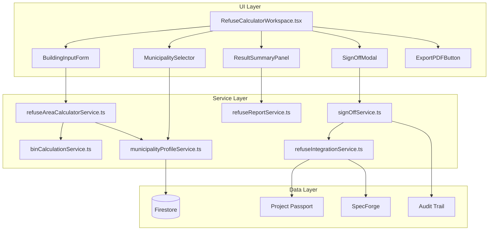

# Design — Municipal Refuse Area Calculator

## Overview

The Municipal Refuse Area Calculator is a compliance advisory tool within Module 4 (Compliance + Municipal Readiness) of Architex. It computes refuse storage room dimensions, bin quantities, collection vehicle access requirements, and ventilation/drainage provisions for building projects across South African municipalities.

The tool is **not** a generic calculator definition (it does not use the Toolbox Capability Framework's `CalculatorDefinition` contract). Instead, it is a purpose-built workspace tool — similar in structure to the Council Drawing Navigator or Health & Safety Workspace — because:

1. It requires multi-step wizard-style input (municipality → building type → parameters).
2. It produces a composite result combining multiple sub-calculations (area + bins + access + ventilation).
3. It has a governance gate (Professional Sign-Off) that blocks downstream actions.
4. It writes to Project Passport and SpecForge as a first-class specification item.

### Key Design Decisions

| Decision | Rationale |
|----------|-----------|
| Dedicated workspace component (not CalculatorDefinition) | Multi-step composite flow with governance gate doesn't fit the single-form runner |
| Municipality profiles stored as typed JSON in Firestore | Profiles are admin-editable, versioned, and municipality-specific |
| Calculation engine as a pure service (no UI/IO) | Enables unit testing, property-based testing, and server-side re-computation |
| `pdf-lib` for PDF export | Already in the dependency tree, used by progress reports and compliance certificates |
| Immutable audit trail via existing `auditTrailService` | Consistent with platform governance patterns |
| Lazy-loaded component in App.tsx | Standard platform registration pattern |

---

## Architecture



### Layer Responsibilities

| Layer | Files | Owns |
|-------|-------|------|
| **UI** | `src/components/RefuseCalculatorWorkspace.tsx` + sub-components | Rendering, form state, validation UX, content pattern |
| **Services** | `src/services/refuseArea/` (5-6 files) | Pure business logic, calculation, profile loading, integration |
| **Data** | Firestore collections | Municipality profiles, audit records, project passport entries |
| **Platform** | `toolNavRegistry.ts`, `architexNavigationConfig.ts`, `App.tsx` | Registration, routing, lazy-loading |

---

## Components and Interfaces

### Component Hierarchy

```
RefuseCalculatorWorkspace (props: { user: UserProfile })
├── Hero (eyebrow: "REFUSE AREA CALCULATOR", h1: project name or "New Calculation")
├── StatRow (computed metrics: area m², bins, access width)
├── Panel: Municipality Selection
│   └── MunicipalitySelector (searchable dropdown, loading/error states)
├── Panel: Building Inputs
│   └── BuildingInputForm (conditional fields per BuildingType)
│       ├── ResidentialInputs
│       ├── CommercialInputs
│       ├── IndustrialInputs
│       └── MixedUseInputs (repeatable component groups)
├── Panel: Results Summary (visible after computation)
│   ├── AreaDimensionsCard
│   ├── BinQuantityCard
│   ├── VehicleAccessCard
│   ├── VentilationDrainageCard
│   └── AdvisoryDisclaimer (persistently visible)
├── SignOffModal (blocks save/export until completed)
└── ActionBar (Calculate, Export PDF, Save to Passport, Push to SpecForge)
```

### Props and State

```typescript
interface RefuseCalculatorWorkspaceProps {
  user: UserProfile;
  projectId?: string;
}

// Internal state managed via useReducer
interface CalculatorState {
  step: 'input' | 'results';
  municipalityId: string | null;
  profile: Municipality_Profile | null;
  profileLoading: boolean;
  profileError: string | null;
  buildingType: BuildingType | null;
  inputs: BuildingInputs;
  result: Refuse_Area_Result | null;
  signOffCompleted: boolean;
  signOffRecord: Professional_Sign_Off_Record | null;
  saving: boolean;
  exportingPdf: boolean;
}
```

---

## Data Models

### Municipality_Profile

Stored in Firestore collection: `refuse_municipality_profiles`

```typescript
interface Municipality_Profile {
  id: string;                                  // e.g. 'city-of-johannesburg'
  name: string;                                // 'City of Johannesburg'
  isFallback: boolean;                         // true for generic profile
  lastUpdated: string;                         // ISO 8601 date
  
  // Waste generation rates
  wasteRates: {
    residential: {
      litresPerUnitPerCycle: number;            // e.g. 240
      collectionCycleDays: number;             // e.g. 7
    };
    commercial: {
      litresPerSqmPerCycle: number;            // e.g. 0.8
      collectionCycleDays: number;
    };
    industrial: {
      light: { litresPerSqmPerCycle: number };
      medium: { litresPerSqmPerCycle: number };
      heavy: { litresPerSqmPerCycle: number };
      collectionCycleDays: number;
    };
  };

  // Bin standards
  binStandards: {
    availableSizes: BinSize[];                  // ordered smallest to largest
    maxBinsPerCollectionPoint: number;          // e.g. 20
    separateWasteStreams: boolean;              // if true, separate recyclable/general
    recyclableBinSizes?: BinSize[];
    generalBinSizes?: BinSize[];
  };

  // Area requirements
  areaRequirements: {
    minimumFloorArea: number;                   // default 4.0 m²
    minimumClearanceHeight: number | null;      // null = use default 2.4m
    perBinFootprint: { length: number; width: number }; // metres
  };

  // Vehicle access
  vehicleAccess: {
    minimumRoadWidth: number | null;            // metres
    turningCircleRadius: number | null;         // metres
    maximumGradient: number | null;             // percentage
    maximumCarryDistance: number | null;         // metres
    hardstandRequired: boolean | null;
    hardstandDimensions: { length: number; width: number } | null;
  };

  // Ventilation
  ventilation: {
    type: 'natural' | 'mechanical' | null;
    naturalOpeningArea: number | null;          // m² (for natural)
    mechanicalRate: number | null;              // air changes per hour
  };

  // Drainage
  drainage: {
    floorGradient: number | null;              // percentage
    drainDiameter: number | null;              // mm
    washDownProvision: {
      required: boolean | null;
      type: string | null;                     // 'hose_connection' | 'tap'
      location: string | null;                 // relative to refuse room
    };
  };

  // Pest control
  pestControl: {
    requirements: string | null;               // null = not specified
  };
}

interface BinSize {
  capacityLitres: number;                      // e.g. 240, 660, 1100
  footprint: { length: number; width: number }; // metres
  label: string;                               // '240L Wheelie Bin'
}
```

### BuildingInputs

```typescript
type BuildingType = 'residential' | 'commercial' | 'industrial' | 'mixed-use';

type WasteCategory = 'light' | 'medium' | 'heavy';

interface ResidentialInputs {
  unitCount: number;                           // 1–10,000
  averageOccupantsPerUnit: number;             // 1–20
}

interface CommercialInputs {
  grossFloorArea: number;                      // 1–500,000 m²
  estimatedOccupantCount: number;              // 1–100,000
}

interface IndustrialInputs {
  grossFloorArea: number;                      // 1–500,000 m²
  numberOfEmployees: number;                   // 1–50,000
  wasteGenerationCategory: WasteCategory;
}

interface MixedUseInputs {
  components: MixedUseComponent[];             // at least 2
}

interface MixedUseComponent {
  type: 'residential' | 'commercial' | 'industrial';
  inputs: ResidentialInputs | CommercialInputs | IndustrialInputs;
}

type BuildingInputs =
  | { type: 'residential'; data: ResidentialInputs }
  | { type: 'commercial'; data: CommercialInputs }
  | { type: 'industrial'; data: IndustrialInputs }
  | { type: 'mixed-use'; data: MixedUseInputs };
```

### Refuse_Area_Result

```typescript
interface Refuse_Area_Result {
  id: string;                                  // UUID
  computedAt: string;                          // ISO 8601
  municipalityId: string;
  municipalityName: string;
  profileLastUpdated: string;                  // DD MMM YYYY formatted
  buildingType: BuildingType;
  inputs: BuildingInputs;

  // Area computation
  area: {
    totalAreaSqm: number;                      // rounded to 2 decimal places
    dimensions: {
      length: number;                          // rounded to 0.1m
      width: number;
      height: number;
    };
    minimumApplied: boolean;                   // true if 4.0m² minimum was enforced
    componentAreas?: ComponentArea[];          // for mixed-use
  };

  // Bin computation
  bins: {
    totalWasteVolumeLitres: number;
    generalWaste: BinAllocation;
    recyclableWaste?: BinAllocation;           // only if profile separates streams
    totalFloorSpaceSqm: number;               // floor space occupied by bins
  };

  // Vehicle access
  vehicleAccess: VehicleAccessResult;

  // Ventilation & drainage
  ventilation: VentilationResult;
  drainage: DrainageResult;
  pestControl: string | null;

  // Advisory
  advisoryDisclaimer: string;
}

interface ComponentArea {
  type: 'residential' | 'commercial' | 'industrial';
  areaSqm: number;
}

interface BinAllocation {
  binCapacityLitres: number;
  binCount: number;
  totalVolumeLitres: number;
  binLabel: string;
}

interface VehicleAccessResult {
  minimumRoadWidth: number | null;
  turningCircleRadius: number | null;
  maximumGradient: number | null;
  maximumCarryDistance: number | null;
  hardstandRequired: boolean | null;
  hardstandDimensions: { length: number; width: number } | null;
  missingFields: string[];                     // fields not specified by municipality
}

interface VentilationResult {
  type: 'natural' | 'mechanical' | null;
  naturalOpeningArea: number | null;
  mechanicalRate: number | null;
  missingFields: string[];
}

interface DrainageResult {
  floorGradient: number | null;
  drainDiameter: number | null;
  washDownRequired: boolean | null;
  washDownType: string | null;
  washDownLocation: string | null;
  missingFields: string[];
}
```

### Professional_Sign_Off_Record

Stored in Firestore collection: `refuse_sign_offs`

```typescript
interface Professional_Sign_Off_Record {
  id: string;                                  // UUID
  resultId: string;                            // FK to Refuse_Area_Result
  timestamp: string;                           // ISO 8601
  uid: string;                                 // user's unique identifier
  displayName: string;
  platformRole: string;                        // UserRole
  acknowledgementStatement: string;            // full text confirmed
  projectId?: string;
}
```

### Firestore Collections

| Collection | Document ID | Purpose |
|------------|-------------|---------|
| `refuse_municipality_profiles` | municipality slug | Profile data |
| `refuse_sign_offs` | UUID | Immutable sign-off records |
| `refuse_area_runs/{runId}` | UUID | Persisted calculation runs (after sign-off) |

---

## API Endpoints

No dedicated REST endpoints are needed. The calculator operates client-side with direct Firestore reads/writes:

| Operation | Method | Path |
|-----------|--------|------|
| Load municipality profiles list | Firestore query | `refuse_municipality_profiles` (list names + IDs) |
| Load single profile | Firestore get | `refuse_municipality_profiles/{id}` |
| Save sign-off record | Firestore create | `refuse_sign_offs/{id}` |
| Write to Project Passport | Service call | `projectPassportService.writeRecord()` |
| Write to SpecForge | Service call | `specForgeService.addSpecItem()` |
| Create audit entry | Service call | `auditTrailService.createAuditEntry()` |

All computation is performed client-side in the pure service layer — no server round-trips needed for the calculation itself.

---

## Calculation Engine Logic

### Service: `src/services/refuseArea/refuseAreaCalculatorService.ts`

Pure function. No side effects.

```typescript
export function computeRefuseArea(
  profile: Municipality_Profile,
  inputs: BuildingInputs
): Refuse_Area_Result
```

### Computation Steps

#### Step 1: Total Waste Volume (litres)

```
Residential:
  totalVolume = unitCount × profile.wasteRates.residential.litresPerUnitPerCycle

Commercial:
  totalVolume = grossFloorArea × profile.wasteRates.commercial.litresPerSqmPerCycle

Industrial:
  rate = profile.wasteRates.industrial[wasteGenerationCategory].litresPerSqmPerCycle
  totalVolume = grossFloorArea × rate

Mixed-Use:
  totalVolume = sum of each component's volume (computed independently)
```

#### Step 2: Bin Calculation

```
1. Divide totalVolume by each available bin capacity
2. Round up to next whole number for each size option
3. Select the bin size producing fewest total bins
4. Constraint: binCount ≤ profile.binStandards.maxBinsPerCollectionPoint
   - If exceeded, fall back to next larger bin size
5. If separateWasteStreams: split volume (assume 70% general, 30% recyclable)
   and compute independently for each stream using respective bin sizes
```

#### Step 3: Floor Area Computation

```
binFloorSpace = binCount × perBinFootprint.length × perBinFootprint.width
requiredArea = max(binFloorSpace × 1.3, profile.areaRequirements.minimumFloorArea)
  (1.3 factor provides circulation/access within the room)

If requiredArea < 4.0:
  requiredArea = 4.0  (absolute minimum)
  minimumApplied = true
```

#### Step 4: Dimensions

```
height = profile.areaRequirements.minimumClearanceHeight ?? 2.4
width = ceil(sqrt(requiredArea) × 10) / 10    // rounded to 0.1m
length = ceil((requiredArea / width) × 10) / 10
```

#### Step 5: Vehicle Access, Ventilation, Drainage

Direct pass-through from the Municipality_Profile with `missingFields` tracking for any null values.

---

## Platform Integration

### Project Passport Write-Back

After sign-off, the result is written as a `ProjectRecord<Refuse_Area_Result>`:

```typescript
{
  recordType: 'refuse_area_calculation',
  phase: 'comply',
  data: result,
  metadata: {
    source: 'municipal-refuse-area-calculator',
    signOffId: signOffRecord.id,
    timestamp: signOffRecord.timestamp,
  }
}
```

### SpecForge Integration

The result is exposed as a specification item:

```typescript
{
  elementType: 'refuse_room',
  specCategory: 'compliance',
  title: `Refuse Storage Area — ${result.municipalityName}`,
  summary: `${result.area.totalAreaSqm}m² | ${result.bins.generalWaste.binCount} bins | ${result.municipalityName}`,
  data: result,
  status: 'issued',
  signOffId: signOffRecord.id,
}
```

### Audit Trail

Every sign-off generates an immutable audit entry:

```typescript
auditTrailService.createAuditEntry({
  actorId: user.uid,
  action: 'refuse_area_sign_off',
  sourceObjectId: result.id,
  metadata: {
    municipalityName: result.municipalityName,
    buildingType: result.buildingType,
    areaSqm: result.area.totalAreaSqm,
    signOffTimestamp: signOffRecord.timestamp,
  }
});
```

### Action Centre

On write failure (after 3 retries), a failed-sync alert is pushed:

```typescript
{
  type: 'failed_sync',
  targetModule: 'project_passport' | 'specforge',
  toolSource: 'municipal-refuse-area-calculator',
  message: `Refuse area result could not be saved to ${targetModule}. Manual retry required.`,
  resultId: result.id,
}
```

---

## PDF Export Approach

Uses `pdf-lib` (already in `package.json`).

### Service: `src/services/refuseArea/refuseReportService.ts`

```typescript
export async function generateRefuseAreaPdf(
  result: Refuse_Area_Result,
  signOff: Professional_Sign_Off_Record
): Promise<Uint8Array>
```

### PDF Structure

| Section | Content |
|---------|---------|
| Header | Architex logo placeholder, report title, date |
| Project Info | Municipality name, building type, profile date |
| Area Summary | Total area, dimensions (L×W×H), minimum notice |
| Bin Schedule | Table: stream, bin size, count, total volume, floor space |
| Vehicle Access | Road width, turning circle, gradient, carry distance, hardstand |
| Ventilation | Type, sizing value, natural/mechanical details |
| Drainage | Floor gradient, drain diameter, wash-down provision |
| Pest Control | Requirements (if specified) |
| Advisory Disclaimer | Full disclaimer text (mandatory) |
| Sign-Off Record | Name, role, timestamp, acknowledgement statement |
| Footer | Page numbers, "Generated by Architex — Advisory Only" |

---

## Error Handling

| Scenario | Behaviour |
|----------|-----------|
| Municipality profile fails to load (timeout/network) | Display error panel with retry button. Retain selected municipality. Prevent form submission. |
| Profile load > 5 seconds | Abort fetch, show timeout error with retry action. |
| Invalid numeric input (zero, negative, exceeds bounds) | Inline validation message adjacent to field showing acceptable range. |
| Required field empty | Inline "Required" message. Calculate button disabled. |
| Mixed-Use with < 2 components | Validation error: "At least two usage components required." |
| Bin calculation impossible (zero volume or no bin sizes) | Display error card within results: "Bin calculation cannot be completed — [reason]." |
| PDF export failure | Toast error: "Export could not be completed." Retain results panel. No data loss. |
| Project Passport write failure (after 3 retries) | Show error badge on save button. Create Action Centre alert. Retain result on screen. |
| SpecForge write failure (after 3 retries) | Same pattern as Passport failure. |
| Sign-off dismissed without completion | Persistent notice: "Save and export unavailable until sign-off is completed." |
| No active project context | Display project selection prompt. Disable Passport/SpecForge actions. |
| Firestore permission error | Display "Permission denied" with guidance to check role. |

### Retry Strategy

For Passport/SpecForge writes:
- 3 retry attempts with exponential backoff (1s, 2s, 4s).
- On final failure, create Action Centre alert and display user-facing error.

---

## Testing Strategy

### Unit Tests (Vitest)

| Area | What's tested |
|------|---------------|
| `refuseAreaCalculatorService` | Computation correctness for all building types, minimum area enforcement, rounding |
| `binCalculationService` | Bin selection logic, stream separation, max-bin constraints |
| `municipalityProfileService` | Profile loading, fallback handling, timeout/error scenarios |
| `signOffService` | Record creation, validation, audit trail emission |
| `refuseReportService` | PDF generation (produces valid PDF bytes), content inclusion |
| Input validation (Zod schemas) | Range enforcement, type coercion, mixed-use component count |

### Property-Based Tests (Vitest + fast-check)

Property-based testing is applicable here because the calculation engine is a pure function with clear input/output behaviour, a large input space (various unit counts, floor areas, municipality profiles), and universal properties that should hold.

- Minimum 100 iterations per property test.
- Each test references the design document property it validates.
- Tag format: `Feature: municipal-refuse-area-calculator, Property N: [description]`

### Integration Tests

| Scenario | Approach |
|----------|----------|
| Firestore profile loading | Mock Firestore, verify correct collection/document path |
| Project Passport write | Mock `projectPassportService`, verify record shape |
| SpecForge write | Mock SpecForge adapter, verify spec item shape |
| Audit trail | Mock `auditTrailService`, verify entry fields |

### E2E Tests (Playwright)

- Full workflow: select municipality → enter inputs → calculate → sign off → verify result panel
- PDF export triggers download
- Validation error display for invalid inputs

---

## Correctness Properties

*A property is a characteristic or behavior that should hold true across all valid executions of a system — essentially, a formal statement about what the system should do. Properties serve as the bridge between human-readable specifications and machine-verifiable correctness guarantees.*

### Property 1: Municipality filter returns only matching results

*For any* list of municipality names and *any* search string of 2 or more characters, every municipality returned by the filter function SHALL have a name that contains the search string as a case-insensitive substring, and every municipality in the source list whose name contains the search string SHALL be present in the result.

**Validates: Requirements 1.1**

### Property 2: Input validation accepts valid inputs and rejects invalid inputs

*For any* building type and *any* set of numeric input values, the validation function SHALL accept the input if and only if all values are greater than zero, have at most two decimal places, and fall within the specified bounds for their field. Values that are zero, negative, exceed bounds, or have more than two decimal places SHALL be rejected.

**Validates: Requirements 2.2, 2.3, 2.4, 2.6**

### Property 3: Volume computation follows rate formula

*For any* valid building inputs and *any* Municipality_Profile, the computed total waste volume in litres SHALL equal the product of the relevant input quantity (unit count or floor area) and the profile's waste generation rate for that building type and category.

**Validates: Requirements 3.4**

### Property 4: Mixed-use area is additive

*For any* mixed-use input with two or more components, the total computed refuse storage area SHALL equal the sum of the individually computed areas for each component (before minimum enforcement), and the result SHALL include both component-level areas and the combined total.

**Validates: Requirements 2.5, 3.5**

### Property 5: Minimum area enforcement

*For any* valid inputs and *any* Municipality_Profile, the computed refuse storage area SHALL never be less than 4.0 square metres. When the raw computation produces an area below 4.0 m², the result SHALL have `minimumApplied` set to true and the area set to exactly 4.0.

**Validates: Requirements 3.6**

### Property 6: Height default fallback

*For any* Municipality_Profile, if the profile specifies a minimum clearance height, the result dimensions height SHALL equal that value. If the profile does not specify a minimum clearance height (null), the result height SHALL be 2.4 metres.

**Validates: Requirements 3.3**

### Property 7: Output precision

*For any* valid computation result, the total area value SHALL be a number with exactly 2 decimal places, and all dimension values (length, width, height) SHALL be multiples of 0.1 metres.

**Validates: Requirements 3.1, 3.2**

### Property 8: Bin count is ceiling of volume divided by capacity

*For any* positive total waste volume and *any* bin capacity, the computed bin count SHALL equal the ceiling of (totalWasteVolume / binCapacity), ensuring no fractional bins.

**Validates: Requirements 4.1**

### Property 9: Bin size optimization selects fewest bins within constraint

*For any* Municipality_Profile with multiple available bin sizes and *any* positive total waste volume, the selected bin size SHALL produce a bin count that is less than or equal to the bin count produced by every other available bin size that also satisfies the maximum bin count constraint. If no size satisfies the constraint, the largest available size SHALL be selected.

**Validates: Requirements 4.2**

### Property 10: Waste stream separation conditional on profile

*For any* Municipality_Profile where `separateWasteStreams` is true, the result SHALL contain both a `generalWaste` allocation and a `recyclableWaste` allocation. When `separateWasteStreams` is false, the result SHALL contain only `generalWaste`.

**Validates: Requirements 4.4**

### Property 11: Bin floor space equals sum of bin footprints

*For any* computed result, the `totalFloorSpaceSqm` SHALL equal the sum of (binCount × footprint length × footprint width) across all waste stream allocations in the result.

**Validates: Requirements 4.5**

### Property 12: Profile pass-through correctness

*For any* Municipality_Profile, the vehicle access, ventilation, drainage, and pest control fields in the result SHALL exactly match the corresponding non-null values from the profile. No value transformation or modification SHALL occur during pass-through.

**Validates: Requirements 5.1, 5.2, 5.3, 5.4, 6.1, 6.2, 6.3, 6.4**

### Property 13: Missing profile fields are tracked

*For any* Municipality_Profile, every field within vehicle access, ventilation, and drainage that has a null value SHALL appear in the corresponding `missingFields` array of the result. The missingFields array SHALL contain only fields that are null in the profile.

**Validates: Requirements 5.5, 6.5**

### Property 14: Profile date formatted as DD MMM YYYY

*For any* valid ISO 8601 date string, the formatted `profileLastUpdated` display value SHALL match the pattern `DD MMM YYYY` (e.g., "30 Apr 2026") where DD is zero-padded day, MMM is abbreviated English month name, and YYYY is four-digit year.

**Validates: Requirements 7.4**

### Property 15: Sign-off audit record completeness

*For any* completed Professional Sign-Off, the recorded audit trail entry SHALL contain a non-empty `timestamp` in ISO 8601 format, a non-empty `uid`, a non-empty `displayName`, a valid `platformRole`, and the full `acknowledgementStatement` text that was confirmed by the user.

**Validates: Requirements 8.3**

