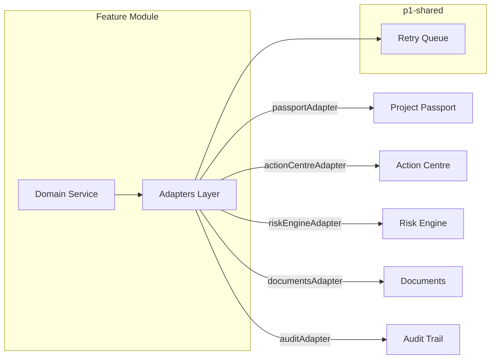
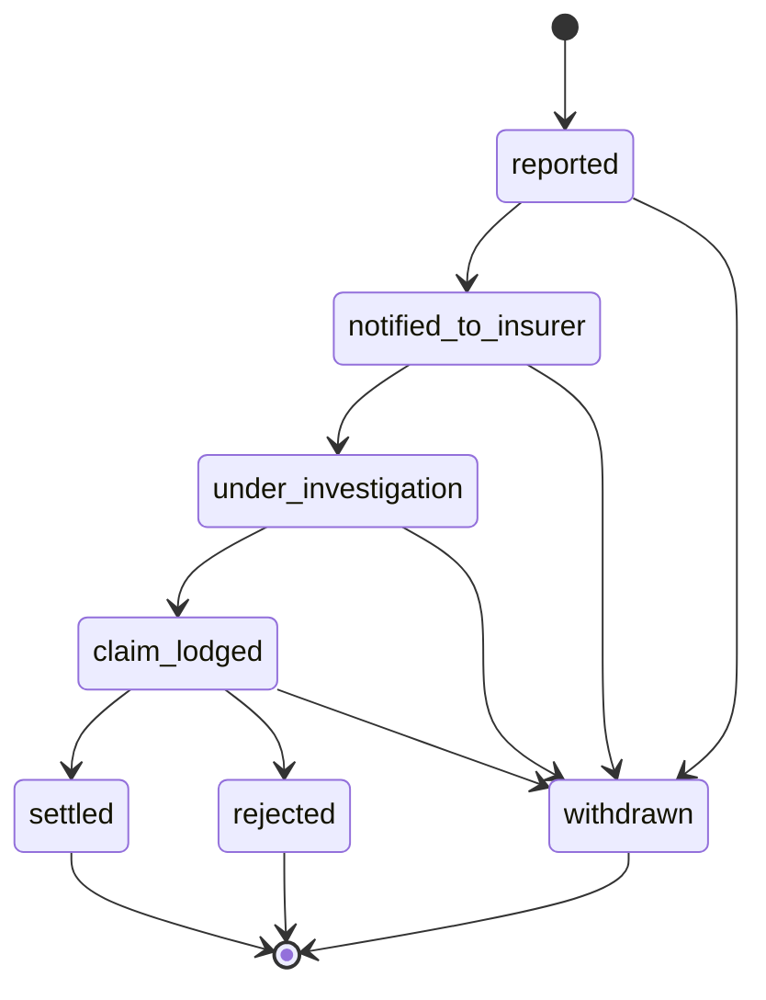
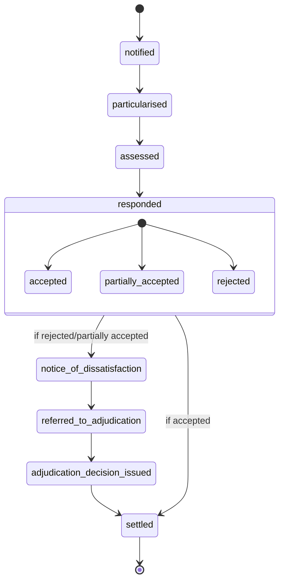
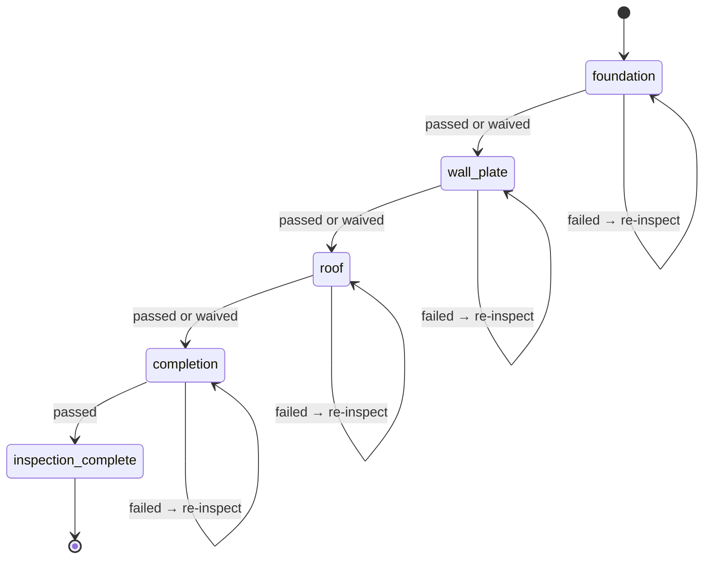
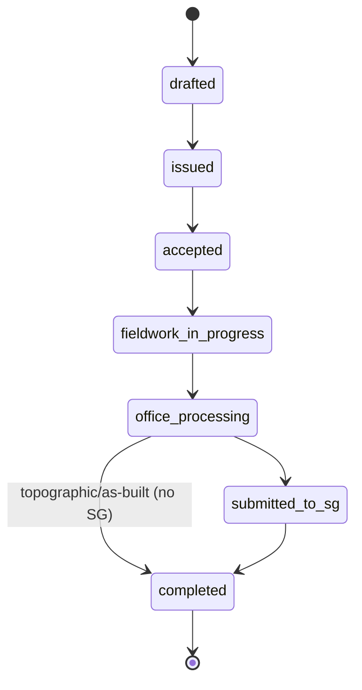
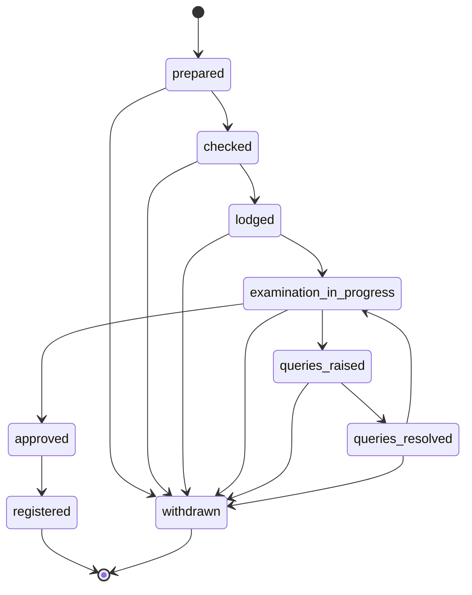

# Design Document: P1 Platform Extensions

## Overview

The P1 Platform Extensions deliver four specialised workflow modules to the Architex Built Environment OS, extending its coverage into insurance management, formal dispute resolution, residential construction compliance (NHBRC), and land survey/geomatics workflows. Each module is implemented as a bounded feature module at `src/features/{module-name}/` following the established town-planning module pattern, integrating through the five mandatory platform contracts: Project Passport, SpecForge, Audit Trail, Action Centre/Inbox, and Role-based Access Control.

### Design Decisions

1. **Feature module pattern over services-only**: Each P1 module gets its own `src/features/` directory (like `town-planning`) rather than loose services in `src/services/`. This provides clear boundaries for types, services, adapters, components, and tests.
2. **Shared cross-cutting infrastructure**: A common `src/features/p1-shared/` module provides the retry/queue mechanism, disclaimer banner component, and platform integration adapters reused across all four modules.
3. **Firestore collections per module**: Each module owns its own top-level Firestore collection scoped under projects (`projects/{projectId}/insurance-policies`, etc.) for clean data ownership.
4. **Working Day Calculator as shared utility**: The SA public holidays and working day calculation logic is extracted into a shared service used by Dispute Resolution, NHBRC, and Survey modules.
5. **State machine enforcement**: All workflow stage transitions are defined declaratively and enforced at the service layer, matching the pattern used in `town-planning/services/applicationEngine.ts`.

## Architecture

### High-Level Module Topology

```mermaid
graph TB
    subgraph "Platform Spine"
        PP[Project Passport]
        AT[Audit Trail]
        AC[Action Centre / Inbox]
        RE[Risk Engine]
        SF[SpecForge]
        DOC[Documents Module]
    end

    subgraph "P1 Feature Modules"
        INS[Insurance Register<br/>src/features/insurance-register/]
        DR[Dispute Resolution<br/>src/features/dispute-resolution/]
        NHBRC[NHBRC Enrolment<br/>src/features/nhbrc/]
        SRV[Survey & Geomatics<br/>src/features/survey-geomatics/]
    end

    subgraph "Cross-Cutting"
        P1S[P1 Shared<br/>src/features/p1-shared/]
    end

    subgraph "Existing Modules"
        CA[Contract Administration]
        SE[Site Execution]
        TP[Town Planning]
        CL[Closeout]
        TV[Trust & Verification]
        FIN[Finance]
    end

    INS --> PP
    INS --> AT
    INS --> AC
    INS --> RE
    INS --> DOC
    INS --> TV
    INS --> CL

    DR --> PP
    DR --> AT
    DR --> AC
    DR --> RE
    DR --> DOC
    DR --> CA
    DR --> FIN

    NHBRC --> PP
    NHBRC --> AT
    NHBRC --> AC
    NHBRC --> RE
    NHBRC --> DOC
    NHBRC --> SE
    NHBRC --> TV
    NHBRC --> CL

    SRV --> PP
    SRV --> AT
    SRV --> AC
    SRV --> RE
    SRV --> DOC
    SRV --> TP

    INS --> P1S
    DR --> P1S
    NHBRC --> P1S
    SRV --> P1S
```



### Directory Structure

```
src/features/
├── p1-shared/
│   ├── index.ts
│   ├── types.ts                      # Shared P1 types (WorkingDay, RetryConfig, DisclaimerConfig)
│   ├── services/
│   │   ├── workingDayCalculator.ts   # SA public holidays, working day arithmetic
│   │   ├── retryQueue.ts            # Exponential backoff retry for integration writes
│   │   └── platformIntegration.ts   # Shared passport/audit/action-centre write helpers
│   ├── components/
│   │   ├── DisclaimerBanner.tsx      # Non-dismissible advisory banner
│   │   └── StatusBadge.tsx           # Shared workflow status badge
│   └── __tests__/
│
├── insurance-register/
│   ├── index.ts
│   ├── types.ts
│   ├── schemas.ts                    # Zod schemas for policy, claim notification
│   ├── services/
│   │   ├── insuranceRegisterService.ts
│   │   ├── policyCheckerService.ts
│   │   ├── claimsNotificationService.ts
│   │   └── accessControl.ts
│   ├── adapters/
│   │   ├── passportAdapter.ts
│   │   ├── actionCentreAdapter.ts
│   │   ├── riskEngineAdapter.ts
│   │   └── documentsAdapter.ts
│   ├── components/
│   │   ├── InsuranceRegisterView.tsx
│   │   ├── PolicyForm.tsx
│   │   ├── PolicyCompliancePanel.tsx
│   │   ├── ClaimsNotificationForm.tsx
│   │   └── ClaimsSummaryPanel.tsx
│   └── __tests__/
│
├── dispute-resolution/
│   ├── index.ts
│   ├── types.ts
│   ├── schemas.ts
│   ├── services/
│   │   ├── disputeEngineService.ts
│   │   ├── noticeTimelineService.ts
│   │   ├── quantumAnalyserService.ts
│   │   ├── adjudicationService.ts
│   │   ├── evidenceLinkageService.ts
│   │   └── accessControl.ts
│   ├── adapters/
│   │   ├── passportAdapter.ts
│   │   ├── actionCentreAdapter.ts
│   │   ├── contractAdminAdapter.ts
│   │   └── financeAdapter.ts
│   ├── components/
│   │   ├── DisputeResolutionView.tsx
│   │   ├── ClaimsRegisterPanel.tsx
│   │   ├── ClaimDetailView.tsx
│   │   ├── NoticeTimelineVisualisation.tsx
│   │   ├── QuantumAnalyserPanel.tsx
│   │   ├── DelayAnalysisPanel.tsx
│   │   ├── EvidenceSchedulePanel.tsx
│   │   └── AdjudicationWorkflowView.tsx
│   └── __tests__/
│
├── nhbrc/
│   ├── index.ts
│   ├── types.ts
│   ├── schemas.ts
│   ├── services/
│   │   ├── nhbrcEngineService.ts
│   │   ├── inspectionTrackerService.ts
│   │   ├── warrantyManagerService.ts
│   │   ├── builderVerificationService.ts
│   │   └── accessControl.ts
│   ├── adapters/
│   │   ├── passportAdapter.ts
│   │   ├── actionCentreAdapter.ts
│   │   ├── riskEngineAdapter.ts
│   │   └── siteExecutionAdapter.ts
│   ├── components/
│   │   ├── NHBRCEnrolmentView.tsx
│   │   ├── EnrolmentChecklist.tsx
│   │   ├── FeeCalculator.tsx
│   │   ├── InspectionTrackerView.tsx
│   │   ├── InspectionOutcomeForm.tsx
│   │   ├── WarrantyClaimForm.tsx
│   │   ├── WarrantyClaimsList.tsx
│   │   └── BuilderVerificationPanel.tsx
│   └── __tests__/
│
├── survey-geomatics/
│   ├── index.ts
│   ├── types.ts
│   ├── schemas.ts
│   ├── services/
│   │   ├── surveyEngineService.ts
│   │   ├── sgTrackerService.ts
│   │   ├── beaconRegisterService.ts
│   │   ├── asBuiltComparatorService.ts
│   │   └── accessControl.ts
│   ├── adapters/
│   │   ├── passportAdapter.ts
│   │   ├── actionCentreAdapter.ts
│   │   ├── townPlanningAdapter.ts
│   │   └── documentsAdapter.ts
│   ├── components/
│   │   ├── SurveyGeomaticsView.tsx
│   │   ├── SurveyInstructionForm.tsx
│   │   ├── SGDiagramTracker.tsx
│   │   ├── BeaconRegisterPanel.tsx
│   │   ├── AsBuiltComparisonView.tsx
│   │   └── ComparisonSummaryPanel.tsx
│   └── __tests__/
```

### Integration Architecture Pattern

Each P1 module follows an identical integration architecture using adapter services:



**Adapter contract**: Each adapter exposes a single `write()` method that accepts a typed event payload and returns `Promise<{ success: boolean; retryQueued?: boolean }>`. On failure, the adapter delegates to the shared retry queue which handles exponential backoff (3 retries, max 60s) and failed-sync alert creation.

## Components and Interfaces

### P1 Shared Module

```typescript
// src/features/p1-shared/types.ts

export interface RetryConfig {
  maxRetries: 3;
  baseDelayMs: 1000;
  maxDelayMs: 60000;
  backoffMultiplier: 2;
}

export interface IntegrationWriteResult {
  success: boolean;
  retryQueued?: boolean;
  failedSyncAlertId?: string;
}

export interface DisclaimerConfig {
  module: 'insurance' | 'dispute' | 'nhbrc' | 'survey';
  text: string;
  type: 'advisory' | 'legal' | 'compliance';
}

export interface WorkingDayConfig {
  excludeSaturdays: boolean;
  excludeSundays: boolean;
  excludePublicHolidays: boolean;
  publicHolidaySource: 'sa_public_holidays_act_36_1994';
}

export type SAPublicHoliday = {
  date: string; // ISO date
  name: string;
  isObserved: boolean; // true if falls on Sunday and Monday is observed
};
```

```typescript
// src/features/p1-shared/services/workingDayCalculator.ts

export interface WorkingDayCalculator {
  /** Calculate working days between two dates (exclusive of end date) */
  countWorkingDays(startDate: string, endDate: string): number;

  /** Add N working days to a start date, returning the resulting date */
  addWorkingDays(startDate: string, days: number): string;

  /** Subtract N working days from a date */
  subtractWorkingDays(endDate: string, days: number): string;

  /** Check if a date is a working day */
  isWorkingDay(date: string): boolean;

  /** Get all SA public holidays for a given year */
  getPublicHolidays(year: number): SAPublicHoliday[];
}
```

```typescript
// src/features/p1-shared/services/retryQueue.ts

export interface QueuedOperation {
  id: string;
  targetModule: 'project_passport' | 'action_centre' | 'audit_trail' | 'risk_engine' | 'documents';
  payload: unknown;
  attempts: number;
  nextRetryAt: string;
  createdAt: string;
  sourceModule: string;
  sourceEvent: string;
}

export interface RetryQueueService {
  enqueue(operation: Omit<QueuedOperation, 'id' | 'attempts' | 'nextRetryAt' | 'createdAt'>): Promise<string>;
  processQueue(): Promise<IntegrationWriteResult[]>;
  getFailedOperations(projectId: string): Promise<QueuedOperation[]>;
}
```

### Module A: Insurance Register Service Interfaces

```typescript
// src/features/insurance-register/types.ts

export type InsurancePolicyType = 'CAR' | 'PI' | 'public_liability' | 'SASRIA' | 'LDI';
export type PolicyStatus = 'active' | 'expired' | 'cancelled' | 'pending_renewal';
export type ClaimNotificationStatus =
  | 'reported'
  | 'notified_to_insurer'
  | 'under_investigation'
  | 'claim_lodged'
  | 'settled'
  | 'rejected'
  | 'withdrawn';

export type ClaimCategory =
  | 'property_damage'
  | 'third_party_property_damage'
  | 'third_party_bodily_injury'
  | 'professional_negligence'
  | 'latent_defect'
  | 'other';

export type ContractForm = 'JBCC_PBA' | 'NEC_ECC' | 'GCC_2025' | 'FIDIC';

export interface InsurancePolicy {
  id: string;
  projectId: string;
  policyType: InsurancePolicyType;
  insurerName: string;          // max 200 chars
  policyNumber: string;         // max 100 chars
  policyholderName: string;     // max 200 chars
  inceptionDate: string;        // ISO date
  expiryDate: string;           // ISO date, must be after inception
  sumInsured: number;           // 1.00 – 999,999,999,999.99 ZAR
  excessAmount: number;         // 0.00 – 999,999,999.99 ZAR
  brokerContactName: string;    // max 200 chars
  brokerPhone?: string;         // valid SA format
  brokerEmail?: string;         // valid email
  status: PolicyStatus;
  notificationPeriodDays?: number; // custom notification period for claims
  createdBy: string;
  createdAt: string;
  updatedAt: string;
}

export interface InsuranceComplianceResult {
  policyType: InsurancePolicyType;
  status: 'compliant' | 'non_compliant' | 'expiring_soon';
  policy?: InsurancePolicy;
  minimumRequired?: number;
  shortfall?: number;
}

export interface InsuranceComplianceSummary {
  overallStatus: 'compliant' | 'partially_compliant' | 'non_compliant';
  activePolicies: number;
  expiredPolicies: number;
  nonCompliantTypes: number;
  lastCheckDate: string;
  results: InsuranceComplianceResult[];
}

export interface ClaimsNotification {
  id: string;
  projectId: string;
  incidentDate: string;
  discoveryDate: string;        // must be >= incidentDate
  affectedPolicyId: string;
  affectedPolicyType: InsurancePolicyType;
  description: string;          // max 2000 chars
  estimatedLoss: number;        // 0.01 – 999,999,999.99 ZAR
  locationOnSite: string;       // max 500 chars
  category?: ClaimCategory;
  evidenceRefs: string[];       // max 20 references
  status: ClaimNotificationStatus;
  notificationDeadline: string; // calculated ISO date
  linkedRiskEventId?: string;
  createdBy: string;
  createdAt: string;
  updatedAt: string;
}

export interface ClaimsSummary {
  totalByPolicyType: Record<InsurancePolicyType, number>;
  totalEstimatedLoss: number;
  countByStatus: Record<ClaimNotificationStatus, number>;
  totalSettledAmount: number;
}
```

```typescript
// src/features/insurance-register/services/insuranceRegisterService.ts

export interface InsuranceRegisterService {
  registerPolicy(projectId: string, policy: Omit<InsurancePolicy, 'id' | 'status' | 'createdAt' | 'updatedAt'>, actorId: string): Promise<InsurancePolicy>;
  updatePolicy(projectId: string, policyId: string, updates: Partial<InsurancePolicy>, actorId: string): Promise<InsurancePolicy>;
  cancelPolicy(projectId: string, policyId: string, actorId: string): Promise<InsurancePolicy>;
  getProjectPolicies(projectId: string): Promise<InsurancePolicy[]>;
  getPolicyById(projectId: string, policyId: string): Promise<InsurancePolicy | null>;
  getExpiringPolicies(projectId: string, withinDays: number): Promise<InsurancePolicy[]>;
  processExpiryNotifications(projectId: string): Promise<void>;
}

export interface PolicyCheckerService {
  getRequiredTypes(projectId: string, contractForm: ContractForm, contractDataSheet?: ContractDataSheet): InsurancePolicyType[];
  checkCompliance(projectId: string): Promise<InsuranceComplianceSummary>;
  getMinimumSumInsured(contractDataSheet: ContractDataSheet, policyType: InsurancePolicyType): number | null;
}

export interface ClaimsNotificationService {
  registerClaim(projectId: string, claim: Omit<ClaimsNotification, 'id' | 'status' | 'notificationDeadline' | 'createdAt' | 'updatedAt'>, actorId: string): Promise<ClaimsNotification>;
  transitionStatus(projectId: string, claimId: string, newStatus: ClaimNotificationStatus, actorId: string): Promise<ClaimsNotification>;
  getClaimsSummary(projectId: string): Promise<ClaimsSummary>;
  getOverdueNotifications(projectId: string): Promise<ClaimsNotification[]>;
}
```

### Module B: Dispute Resolution Service Interfaces

```typescript
// src/features/dispute-resolution/types.ts

export type ClaimType = 'EoT' | 'loss_and_expense' | 'disruption' | 'prolongation';
export type ClaimStage =
  | 'notified'
  | 'particularised'
  | 'assessed'
  | 'responded'
  | 'notice_of_dissatisfaction'
  | 'referred_to_adjudication'
  | 'adjudication_decision_issued'
  | 'settled';
export type ResponseSubState = 'accepted' | 'partially_accepted' | 'rejected';
export type EvidenceRelevance = 'causation' | 'quantum' | 'delay' | 'mitigation';
export type CostCategory = 'labour' | 'materials' | 'plant' | 'preliminaries' | 'overheads' | 'profit' | 'other';
export type DelayType = 'critical_path' | 'concurrent';
export type ResponsibleParty = 'employer' | 'contractor' | 'neutral' | 'shared';
export type AdjudicationStage =
  | 'referred'
  | 'adjudicator_appointed'
  | 'submissions_open'
  | 'submissions_closed'
  | 'hearing_scheduled'
  | 'hearing_completed'
  | 'decision_issued'
  | 'decision_implemented';

export interface FormalClaim {
  id: string;
  projectId: string;
  referenceNumber: string;      // system-generated, e.g. "EOT-001"
  claimType: ClaimType;
  causativeEventDate: string;
  notificationDate: string;
  contractClauseNumber: string;
  contractClauseTitle: string;
  briefDescription: string;     // max 500 chars
  detailedParticulars?: string; // max 5000 chars
  amountClaimed?: number;       // for monetary claims
  timeClaimed?: number;         // Working_Days for EoT/prolongation
  currentStage: ClaimStage;
  responseSubState?: ResponseSubState;
  awardedAmount?: number;
  awardedTime?: number;
  timeBarredRisk: boolean;
  linkedContractAdminClaimId?: string;
  evidenceItems: EvidenceLink[];
  createdBy: string;
  createdAt: string;
  updatedAt: string;
}

export interface EvidenceLink {
  id: string;
  claimId: string;
  evidenceType: string;
  sourceModule: string;
  sourceReferenceId: string;
  dateOfEvidence: string;
  description: string;          // max 200 chars
  relevanceCategory: EvidenceRelevance;
  sourceStatus: 'available' | 'source_unavailable';
  linkedAt: string;
  linkedBy: string;
}

export interface NoticeDeadline {
  claimId: string;
  deadlineType: 'notification' | 'particulars' | 'response' | 'adjudication_referral';
  dueDate: string;
  contractForm: ContractForm;
  isOverdue: boolean;
  daysRemaining: number;
}

export interface QuantumLineItem {
  id: string;
  assessmentId: string;
  description: string;          // max 500 chars
  costCategory: CostCategory;
  unit: string;                 // max 50 chars
  quantity: number;             // 0.01 – 999,999.99
  rate: number;                 // 0.01 – 999,999.99 ZAR
  amount: number;               // auto-calculated: quantity * rate
}

export interface QuantumAssessment {
  id: string;
  claimId: string;
  projectId: string;
  lineItems: QuantumLineItem[];
  subtotalByCategory: Record<CostCategory, number>;
  totalQuantumAmount: number;
  percentageByCategory: Record<CostCategory, number>;
  isCompleted: boolean;
  createdAt: string;
  updatedAt: string;
}

export interface DelayEvent {
  id: string;
  analysisId: string;
  description: string;          // max 500 chars
  startDate: string;
  endDate: string;              // must be >= startDate
  delayType: DelayType;
  responsibleParty: ResponsibleParty;
  workingDaysImpacted: number;  // auto-calculated
}

export interface DelayAnalysis {
  id: string;
  claimId: string;
  projectId: string;
  events: DelayEvent[];
  totalByParty: Record<ResponsibleParty, number>;
  netClaimableDelay: number;
  isCompleted: boolean;
  createdAt: string;
  updatedAt: string;
}

export interface Adjudication {
  id: string;
  claimId: string;
  projectId: string;
  adjudicatorName: string;      // max 200 chars
  appointmentDate: string;
  referringParty: string;
  respondentParty: string;
  disputeValue: number;         // 0.01 – 999,999,999.99 ZAR
  timeInDispute?: number;       // Working_Days, 0–9999
  referralNoticeRef: string;
  currentStage: AdjudicationStage;
  maxSubmissionRounds: number;  // 1–5, default 2
  submissionDeadline?: string;
  decisionDate?: string;
  amountAwarded?: number;
  timeAwarded?: number;
  decisionSummary?: string;     // max 2000 chars
  isInterimBinding: boolean;
  createdAt: string;
  updatedAt: string;
}
```

```typescript
// src/features/dispute-resolution/services/disputeEngineService.ts

export interface DisputeEngineService {
  registerClaim(projectId: string, claim: CreateClaimInput, actorId: string): Promise<FormalClaim>;
  transitionClaim(projectId: string, claimId: string, transition: ClaimTransitionInput, actorId: string): Promise<FormalClaim>;
  getClaimsDashboard(projectId: string): Promise<ClaimsDashboardData>;
  getClaimById(projectId: string, claimId: string): Promise<FormalClaim | null>;
  createFromContractAdmin(projectId: string, contractAdminClaimId: string, actorId: string): Promise<FormalClaim>;
  getPermittedTransitions(currentStage: ClaimStage, responseSubState?: ResponseSubState): ClaimStage[];
}

export interface NoticeTimelineService {
  calculateDeadlines(claim: FormalClaim, contractForm: ContractForm, contractDataSheet?: ContractDataSheet): NoticeDeadline[];
  getApproachingDeadlines(projectId: string, withinDays: number): Promise<NoticeDeadline[]>;
  getOverdueDeadlines(projectId: string): Promise<NoticeDeadline[]>;
  getTimelineData(claimId: string): Promise<TimelineVisualisationData>;
}

export interface QuantumAnalyserService {
  createAssessment(claimId: string, projectId: string): Promise<QuantumAssessment>;
  addLineItem(assessmentId: string, item: Omit<QuantumLineItem, 'id' | 'assessmentId' | 'amount'>): Promise<QuantumAssessment>;
  removeLineItem(assessmentId: string, itemId: string): Promise<QuantumAssessment>;
  createDelayAnalysis(claimId: string, projectId: string): Promise<DelayAnalysis>;
  addDelayEvent(analysisId: string, event: Omit<DelayEvent, 'id' | 'analysisId' | 'workingDaysImpacted'>): Promise<DelayAnalysis>;
  removeDelayEvent(analysisId: string, eventId: string): Promise<DelayAnalysis>;
  markCompleted(assessmentOrAnalysisId: string, linkToClaim: boolean, actorId: string): Promise<void>;
}

export interface AdjudicationService {
  createAdjudication(claimId: string, input: CreateAdjudicationInput, actorId: string): Promise<Adjudication>;
  transitionStage(adjudicationId: string, newStage: AdjudicationStage, actorId: string): Promise<Adjudication>;
  recordDecision(adjudicationId: string, decision: AdjudicationDecisionInput, actorId: string): Promise<Adjudication>;
  getAdjudication(adjudicationId: string): Promise<Adjudication | null>;
}
```

### Module C: NHBRC Service Interfaces

```typescript
// src/features/nhbrc/types.ts

export type EnrolmentStatus = 'not_started' | 'in_progress' | 'enrolled';
export type ChecklistItemStatus = 'not_started' | 'in_progress' | 'completed' | 'not_applicable';
export type InspectionStage = 'foundation' | 'wall_plate' | 'roof' | 'completion';
export type InspectionOutcome = 'passed' | 'failed' | 'conditionally_passed';
export type WarrantyDefectCategory = 'structural' | 'roof_waterproofing' | 'wall_waterproofing';
export type WarrantyClaimStage =
  | 'reported'
  | 'acknowledged'
  | 'inspection_scheduled'
  | 'inspected'
  | 'liability_determined'
  | 'rectification_ordered'
  | 'rectification_in_progress'
  | 'rectification_complete'
  | 'claim_closed';
export type LiabilityOutcome = 'builder_liable' | 'shared_liability' | 'no_liability';
export type BuilderVerificationStatus = 'verified_active' | 'verified_suspended' | 'verified_expired' | 'unverifiable';

export interface EnrolmentChecklist {
  id: string;
  projectId: string;
  status: EnrolmentStatus;
  readinessPercentage: number;  // 0–100
  items: ChecklistItem[];
  feeEstimate?: number;
  builderRegistrationNumber?: string;
  numberOfUnits: number;
  estimatedValuePerUnit: number;
  createdAt: string;
  updatedAt: string;
}

export interface ChecklistItem {
  id: string;
  label: string;
  description: string;
  status: ChecklistItemStatus;
  isApplicable: boolean;
  completedAt?: string;
  completedBy?: string;
}

export interface FeeBand {
  id: string;
  minValue: number;             // ZAR
  maxValue: number;             // ZAR
  feePerUnit: number;           // ZAR
  effectiveFrom: string;
  effectiveTo?: string;
}

export interface InspectionRecord {
  id: string;
  projectId: string;
  unitId: string;
  stage: InspectionStage;
  inspectionDate: string;
  inspectorName: string;        // max 200 chars
  outcome: InspectionOutcome;
  conditionsOrDefects?: string; // max 2000 chars, mandatory if failed/conditional
  evidenceRefs: string[];       // max 20 images
  conditionDeadline?: string;   // for conditionally_passed
  conditionsResolved?: boolean;
  createdBy: string;
  createdAt: string;
}

export interface UnitInspectionStatus {
  unitId: string;
  currentStage: InspectionStage | 'inspection_complete';
  stagesCompleted: InspectionStage[];
  hasFailed: boolean;
  failedStages: InspectionStage[];
}

export interface WarrantyClaim {
  id: string;
  projectId: string;
  unitId: string;
  claimantName: string;
  claimantContact: string;
  defectDescription: string;    // max 2000 chars
  defectCategory: WarrantyDefectCategory;
  defectDiscoveredDate: string;
  practicalCompletionDate: string;
  warrantyExpiryDate: string;   // calculated: practicalCompletion + 5 years
  isOutsideWarranty: boolean;
  evidenceRefs: string[];       // 1–20 images, each max 10MB, JPEG/PNG/HEIF
  currentStage: WarrantyClaimStage;
  liabilityOutcome?: LiabilityOutcome;
  rectificationDescription?: string;
  rectificationDeadline?: string;
  rectificationResponsibleParty?: string;
  createdBy: string;
  createdAt: string;
  updatedAt: string;
}

export interface BuilderVerification {
  id: string;
  projectId: string;
  builderName: string;          // 2–200 chars
  registrationNumber: string;   // 4–20 alphanumeric
  verificationDate: string;     // not future
  result: BuilderVerificationStatus;
  registrationCategory?: string;
  maxProjectValue?: number;     // ZAR
  registrationExpiry?: string;
  requestedBy: string;
  createdAt: string;
}
```

```typescript
// src/features/nhbrc/services/nhbrcEngineService.ts

export interface NHBRCEngineService {
  createEnrolment(projectId: string, input: CreateEnrolmentInput, actorId: string): Promise<EnrolmentChecklist>;
  updateChecklistItem(projectId: string, itemId: string, status: ChecklistItemStatus, actorId: string): Promise<EnrolmentChecklist>;
  calculateFee(numberOfUnits: number, valuePerUnit: number): Promise<{ fee: number | null; disclaimer: string; error?: string }>;
  getEnrolmentStatus(projectId: string): Promise<EnrolmentChecklist | null>;
  getFeeBands(): Promise<FeeBand[]>;
}

export interface InspectionTrackerService {
  recordInspection(projectId: string, input: RecordInspectionInput, actorId: string): Promise<InspectionRecord>;
  waiveStage(projectId: string, unitId: string, stage: InspectionStage, actorId: string, actorRole: UserRole): Promise<void>;
  getUnitStatus(projectId: string, unitId: string): Promise<UnitInspectionStatus>;
  getAllUnitsStatus(projectId: string): Promise<UnitInspectionStatus[]>;
  resolveConditions(projectId: string, inspectionId: string, actorId: string): Promise<InspectionRecord>;
  canRecordStage(projectId: string, unitId: string, stage: InspectionStage): Promise<{ allowed: boolean; blockedBy?: InspectionStage }>;
}

export interface WarrantyManagerService {
  registerClaim(projectId: string, claim: CreateWarrantyClaimInput, actorId: string): Promise<WarrantyClaim>;
  transitionClaim(projectId: string, claimId: string, newStage: WarrantyClaimStage, data?: WarrantyTransitionData, actorId?: string): Promise<WarrantyClaim>;
  getClaimsSummary(projectId: string): Promise<WarrantyClaimsSummary>;
  getOverdueRectifications(projectId: string): Promise<WarrantyClaim[]>;
}

export interface BuilderVerificationService {
  verifyBuilder(projectId: string, input: VerifyBuilderInput, requestedBy: string): Promise<BuilderVerification>;
  getPriorVerifications(projectId: string, registrationNumber: string): Promise<BuilderVerification[]>;
}
```

### Module D: Survey & Geomatics Service Interfaces

```typescript
// src/features/survey-geomatics/types.ts

export type SurveyType =
  | 'boundary_determination'
  | 'topographic_survey'
  | 'as_built_survey'
  | 'sectional_title_survey'
  | 'subdivision_survey'
  | 'consolidation_survey'
  | 'general_purposes_diagram';

export type SurveyInstructionStage =
  | 'drafted'
  | 'issued'
  | 'accepted'
  | 'fieldwork_in_progress'
  | 'office_processing'
  | 'submitted_to_sg'
  | 'completed';

export type SGDiagramType = 'general_plan' | 'sectional_title' | 'subdivision' | 'consolidation' | 'servitude';

export type SGDiagramStage =
  | 'prepared'
  | 'checked'
  | 'lodged'
  | 'examination_in_progress'
  | 'queries_raised'
  | 'queries_resolved'
  | 'approved'
  | 'registered'
  | 'withdrawn';

export type SGOffice =
  | 'Cape Town'
  | 'Pretoria'
  | 'Pietermaritzburg'
  | 'Bloemfontein'
  | 'King William\'s Town'
  | 'Mthatha';

export type BeaconType = 'iron_peg' | 'concrete_block' | 'nail_in_tar' | 'reference_mark' | 'trigonometric_beacon' | 'other';
export type BeaconCondition = 'intact' | 'damaged' | 'missing' | 'replaced';
export type CoordinateSystem = 'WGS84' | 'Hartebeesthoek94';

export interface SurveyInstruction {
  id: string;
  projectId: string;
  referenceNumber: string;        // system-generated
  surveyType: SurveyType;
  propertyDescription: string;    // max 500 chars
  scopeOfWork: string;            // max 2000 chars
  appointedSurveyorId?: string;
  appointedSurveyorName: string;
  appointedSurveyorPLATO: string; // max 20 chars
  requiredCompletionDate: string;
  linkedDocuments: string[];      // max 20 refs
  currentStage: SurveyInstructionStage;
  linkedTownPlanningAppId?: string;
  issuedBy?: string;
  issuedAt?: string;
  createdAt: string;
  updatedAt: string;
}

export interface SGDiagram {
  id: string;
  projectId: string;
  diagramReference: string;       // max 50 chars, unique per project
  diagramType: SGDiagramType;
  linkedSurveyInstructionId: string;
  propertyDescription: string;    // max 200 chars
  lodgementDate: string;
  lodgementOffice: SGOffice;
  surveyorName: string;
  surveyorPLATO: string;          // max 20 chars
  currentStage: SGDiagramStage;
  queryDetails?: string;          // max 2000 chars
  queryResponseDeadline?: string;
  approvalDate?: string;
  sgApprovalNumber?: string;      // max 30 chars
  processingDays: number;         // auto-calculated Working_Days
  expectedProcessingDays: number; // configurable per office, default 60
  withdrawalReason?: string;      // max 500 chars
  createdAt: string;
  updatedAt: string;
}

export interface Beacon {
  id: string;
  projectId: string;
  identifier: string;             // alphanumeric, max 50 chars, unique per project
  beaconType: BeaconType;
  latitude?: number;              // decimal degrees, 8 decimal places (WGS84)
  longitude?: number;
  yCoordinate?: number;           // Lo system, 3 decimal places (Hartebeesthoek94)
  xCoordinate?: number;
  coordinateSystem: CoordinateSystem;
  condition: BeaconCondition;
  dateLastInspected: string;
  linkedDiagramRef?: string;
  notes?: string;                 // max 500 chars
  replacementHistory: BeaconReplacement[];
  createdAt: string;
  updatedAt: string;
}

export interface BeaconReplacement {
  date: string;
  newLatitude?: number;
  newLongitude?: number;
  newY?: number;
  newX?: number;
  replacingSurveyorId: string;
  reason: string;                 // max 500 chars
  evidenceRefs: string[];         // max 10 images
}

export interface BoundaryLine {
  id: string;
  projectId: string;
  parcelIdentifier: string;
  beaconSequence: string[];       // ordered beacon IDs, min 2
  createdAt: string;
}

export interface AsBuiltComparison {
  id: string;
  projectId: string;
  referenceNumber: string;        // system-generated
  linkedSurveyInstructionId: string;
  linkedApprovedPlanRef: string;
  surveyDate: string;
  surveyorId: string;
  measurements: MeasurementPair[];
  totalMeasurements: number;
  withinTolerance: number;
  outsideTolerance: number;
  maxDeviation: number;
  compliancePercentage: number;   // 0.0–100.0, 1 decimal place
  isCompleted: boolean;
  createdAt: string;
  updatedAt: string;
}

export interface MeasurementPair {
  id: string;
  comparisonId: string;
  dimensionDescription: string;   // max 200 chars
  approvedDimension: number;      // 0.001–99999.999 metres
  asBuiltDimension: number;       // same range
  toleranceThreshold: number;     // 0.001–1.000 metres, default 0.050
  deviation: number;              // calculated: asBuilt - approved
  absoluteDeviation: number;
  isWithinTolerance: boolean;
}
```

```typescript
// src/features/survey-geomatics/services/surveyEngineService.ts

export interface SurveyEngineService {
  createInstruction(projectId: string, input: CreateSurveyInstructionInput, actorId: string): Promise<SurveyInstruction>;
  issueInstruction(projectId: string, instructionId: string, actorId: string): Promise<SurveyInstruction>;
  transitionStage(projectId: string, instructionId: string, newStage: SurveyInstructionStage, actorId: string): Promise<SurveyInstruction>;
  getProjectInstructions(projectId: string): Promise<SurveyInstruction[]>;
  createFromTownPlanning(projectId: string, applicationId: string, conditionId: string): Promise<SurveyInstruction>;
}

export interface SGTrackerService {
  registerDiagram(projectId: string, input: CreateSGDiagramInput, actorId: string): Promise<SGDiagram>;
  transitionStage(projectId: string, diagramId: string, newStage: SGDiagramStage, data?: SGTransitionData, actorId?: string): Promise<SGDiagram>;
  getProjectDiagrams(projectId: string): Promise<SGDiagram[]>;
  getOverdueProcessing(projectId: string): Promise<SGDiagram[]>;
  withdrawDiagram(projectId: string, diagramId: string, reason: string, actorId: string): Promise<SGDiagram>;
}

export interface BeaconRegisterService {
  registerBeacon(projectId: string, input: CreateBeaconInput, actorId: string): Promise<Beacon>;
  updateCondition(projectId: string, beaconId: string, condition: BeaconCondition, actorId: string): Promise<Beacon>;
  replaceBeacon(projectId: string, beaconId: string, replacement: BeaconReplacement, actorId: string): Promise<Beacon>;
  defineBoundaryLine(projectId: string, input: CreateBoundaryLineInput): Promise<BoundaryLine>;
  getProjectBeacons(projectId: string): Promise<Beacon[]>;
  getDamagedOrMissing(projectId: string): Promise<Beacon[]>;
}

export interface AsBuiltComparatorService {
  createComparison(projectId: string, input: CreateComparisonInput, actorId: string): Promise<AsBuiltComparison>;
  addMeasurement(comparisonId: string, input: CreateMeasurementInput): Promise<AsBuiltComparison>;
  removeMeasurement(comparisonId: string, measurementId: string): Promise<AsBuiltComparison>;
  markCompleted(comparisonId: string, actorId: string): Promise<AsBuiltComparison>;
  getComparison(comparisonId: string): Promise<AsBuiltComparison | null>;
}
```

### Module E: Cross-Cutting Access Control Interface

```typescript
// src/features/p1-shared/services/accessControl.ts

import type { UserRole } from '@/types';

export type P1Module = 'insurance_register' | 'dispute_resolution' | 'nhbrc' | 'survey_geomatics';
export type P1Action = 'read' | 'write' | 'create' | 'manage' | 'admin';

export interface P1AccessContext {
  userId: string;
  role: UserRole;
  projectId: string;
  isProjectMember: boolean;
  projectRoleAssignment?: string; // e.g. 'assigned_contractor', 'team_member', 'project_owner'
}

/**
 * Role-permission matrix for P1 modules.
 * admin and platform_admin always get full access.
 * Other roles require project membership plus module-specific permissions.
 */
export interface P1AccessControlService {
  checkAccess(ctx: P1AccessContext, module: P1Module, action: P1Action): AccessCheckResult;
  getPermittedActions(ctx: P1AccessContext, module: P1Module): P1Action[];
  isAdminRole(role: UserRole): boolean;
}

export interface AccessCheckResult {
  granted: boolean;
  reason?: string;
  deniedAt?: string; // ISO timestamp for audit
}

// Permission matrix constants
export const INSURANCE_REGISTER_PERMISSIONS: Record<UserRole, P1Action[]> = {
  architect: ['read', 'write', 'create', 'manage'],
  bep: ['read', 'write', 'create', 'manage'],
  cpm: ['read', 'write', 'create', 'manage'],
  quantity_surveyor: ['read', 'write', 'create', 'manage'],
  contractor: ['read', 'create'], // limited: view register + register claims where policyholder
  platform_admin: ['read', 'write', 'create', 'manage', 'admin'],
  admin: ['read', 'write', 'create', 'manage', 'admin'],
  // all other roles: no access (default-deny)
};

export const DISPUTE_RESOLUTION_PERMISSIONS: Record<UserRole, P1Action[]> = {
  architect: ['read', 'write', 'create', 'manage'],
  bep: ['read', 'write', 'create', 'manage'],
  cpm: ['read', 'write', 'create', 'manage'],
  quantity_surveyor: ['read', 'write', 'create', 'manage'],
  contractor: ['read', 'write', 'create'], // create/manage own claims, submit evidence
  platform_admin: ['read', 'write', 'create', 'manage', 'admin'],
  admin: ['read', 'write', 'create', 'manage', 'admin'],
};

export const NHBRC_PERMISSIONS: Record<UserRole, P1Action[]> = {
  contractor: ['read', 'write', 'create', 'manage'],
  developer: ['read', 'write', 'create', 'manage'],
  site_manager: ['read', 'write'], // record inspections, view enrolment
  client: ['read'], // read-only inspection + warranty
  architect: ['read', 'write'], // can waive inspection stages
  engineer: ['read', 'write'], // can waive inspection stages
  platform_admin: ['read', 'write', 'create', 'manage', 'admin'],
  admin: ['read', 'write', 'create', 'manage', 'admin'],
};

export const SURVEY_GEOMATICS_PERMISSIONS: Record<UserRole, P1Action[]> = {
  land_surveyor: ['read', 'write', 'create', 'manage'],
  architect: ['read', 'write', 'create'], // create instructions, view results
  bep: ['read', 'write', 'create'],
  cpm: ['read', 'write', 'create'],
  developer: ['read', 'write', 'create'],
  platform_admin: ['read', 'write', 'create', 'manage', 'admin'],
  admin: ['read', 'write', 'create', 'manage', 'admin'],
};
```

## Data Models

### Firestore Collection Structure

Each P1 module stores data in project-scoped subcollections:

```
projects/{projectId}/
├── insurance-policies/          # InsurancePolicy documents
├── insurance-claims/            # ClaimsNotification documents
├── insurance-compliance/        # InsuranceComplianceSummary (single doc)
├── formal-claims/               # FormalClaim documents
├── claim-evidence/              # EvidenceLink documents (subcollection of formal-claims)
├── quantum-assessments/         # QuantumAssessment documents
├── delay-analyses/              # DelayAnalysis documents
├── adjudications/               # Adjudication documents
├── nhbrc-enrolment/             # EnrolmentChecklist (single doc per project)
├── nhbrc-inspections/           # InspectionRecord documents
├── nhbrc-warranty-claims/       # WarrantyClaim documents
├── builder-verifications/       # BuilderVerification documents
├── survey-instructions/         # SurveyInstruction documents
├── sg-diagrams/                 # SGDiagram documents
├── beacons/                     # Beacon documents
├── boundary-lines/              # BoundaryLine documents
├── as-built-comparisons/        # AsBuiltComparison documents
└── p1-retry-queue/              # QueuedOperation documents (failed syncs)

platform-config/
├── nhbrc-fee-bands/             # FeeBand documents (global, not project-scoped)
├── sg-office-config/            # Expected processing times per office
└── contract-form-deadlines/     # Notice period configurations per contract form
```

### State Machine Definitions

#### Insurance Claims Notification States



#### Formal Claims States



#### NHBRC Inspection Sequence



#### Survey Instruction Stages



#### SG Diagram Stages



### Zod Validation Schemas (Key Examples)

```typescript
// src/features/insurance-register/schemas.ts
import { z } from 'zod';

const saPhoneRegex = /^(\+27|0)[1-9]\d{8}$/;

export const insurancePolicySchema = z.object({
  policyType: z.enum(['CAR', 'PI', 'public_liability', 'SASRIA', 'LDI']),
  insurerName: z.string().min(1).max(200),
  policyNumber: z.string().min(1).max(100),
  policyholderName: z.string().min(1).max(200),
  inceptionDate: z.string().date(),
  expiryDate: z.string().date(),
  sumInsured: z.number().min(1).max(999_999_999_999.99),
  excessAmount: z.number().min(0).max(999_999_999.99),
  brokerContactName: z.string().min(1).max(200),
  brokerPhone: z.string().regex(saPhoneRegex).optional(),
  brokerEmail: z.string().email().optional(),
}).refine(data => new Date(data.expiryDate) > new Date(data.inceptionDate), {
  message: 'Expiry date must be after inception date',
}).refine(data => data.brokerPhone || data.brokerEmail, {
  message: 'At least one broker contact method (phone or email) is required',
});

// src/features/dispute-resolution/schemas.ts
export const formalClaimSchema = z.object({
  claimType: z.enum(['EoT', 'loss_and_expense', 'disruption', 'prolongation']),
  causativeEventDate: z.string().date(),
  notificationDate: z.string().date(),
  contractClauseNumber: z.string().min(1),
  contractClauseTitle: z.string().min(1),
  briefDescription: z.string().min(1).max(500),
  detailedParticulars: z.string().max(5000).optional(),
  amountClaimed: z.number().min(0.01).max(999_999_999.99).optional(),
  timeClaimed: z.number().int().min(1).max(999).optional(),
}).refine(data => {
  if (['loss_and_expense', 'disruption'].includes(data.claimType)) {
    return data.amountClaimed !== undefined;
  }
  return true;
}, { message: 'Amount claimed is required for monetary claims' })
.refine(data => {
  if (['EoT', 'prolongation'].includes(data.claimType)) {
    return data.timeClaimed !== undefined;
  }
  return true;
}, { message: 'Time claimed is required for EoT/prolongation claims' });

// src/features/survey-geomatics/schemas.ts
export const beaconSchema = z.object({
  identifier: z.string().min(1).max(50).regex(/^[a-zA-Z0-9-_]+$/),
  beaconType: z.enum(['iron_peg', 'concrete_block', 'nail_in_tar', 'reference_mark', 'trigonometric_beacon', 'other']),
  coordinateSystem: z.enum(['WGS84', 'Hartebeesthoek94']),
  latitude: z.number().min(-35.0).max(-22.0).optional(),
  longitude: z.number().min(16.0).max(33.0).optional(),
  yCoordinate: z.number().optional(),
  xCoordinate: z.number().optional(),
  condition: z.enum(['intact', 'damaged', 'missing', 'replaced']),
  dateLastInspected: z.string().date(),
  linkedDiagramRef: z.string().optional(),
  notes: z.string().max(500).optional(),
}).refine(data => {
  if (data.coordinateSystem === 'WGS84') {
    return data.latitude !== undefined && data.longitude !== undefined;
  }
  return data.yCoordinate !== undefined && data.xCoordinate !== undefined;
}, { message: 'Coordinates required for selected coordinate system' });
```

## Correctness Properties

*A property is a characteristic or behavior that should hold true across all valid executions of a system — essentially, a formal statement about what the system should do. Properties serve as the bridge between human-readable specifications and machine-verifiable correctness guarantees.*

### Property 1: Working Day Calculator Correctness

*For any* start date and positive integer N, adding N working days and then counting working days back to the start should yield N. Working days must exclude Saturdays, Sundays, and all South African public holidays as defined in the Public Holidays Act 36 of 1994.

**Validates: Requirements 6.1, 6.2, 6.4, 9.3, 17.6**

### Property 2: Policy Expiry Notification Thresholds

*For any* active insurance policy with an expiry date, the system shall generate a renewal warning notification if and only if the difference between the expiry date and the current date equals exactly 60, 30, or 14 calendar days. The notification severity must correspond to the threshold: normal at 60 days, high at 30 days, critical at 14 days.

**Validates: Requirements 1.3, 1.4, 1.5**

### Property 3: Insurance Compliance Determination

*For any* project with a configured contract form and any set of registered insurance policies, the compliance status for each required policy type shall be: "compliant" when an active policy exists with sum insured ≥ the contract-specified minimum; "expiring_soon" when an active policy exists but expiry is within 60 calendar days; "non_compliant" when no active policy exists or sum insured is below the minimum. The overall status shall be "compliant" only when all required types are individually compliant.

**Validates: Requirements 2.1, 2.2, 2.3, 2.4**

### Property 4: Claims Notification State Machine

*For any* claims notification in state S and any attempted transition to state T, the transition shall succeed if and only if T is the next sequential state in the defined order (reported → notified_to_insurer → under_investigation → claim_lodged → settled|rejected), or T is "withdrawn" and S is not a terminal state. Terminal states (settled, rejected, withdrawn) shall permit no further transitions.

**Validates: Requirements 3.2**

### Property 5: Claims Notification Deadline Calculation

*For any* claims notification with an incident date and an optional custom notification period, the calculated deadline shall equal the earlier of: 30 calendar days from the incident date, or the custom period if configured. If the deadline has passed and status is still "reported", the overdue days count shall equal the calendar days elapsed since the deadline.

**Validates: Requirements 3.3, 3.4, 3.5**

### Property 6: Claims Summary Aggregation

*For any* set of claims notifications in a project, the cumulative summary shall satisfy: totalByPolicyType[t] equals the count of notifications with affectedPolicyType = t; totalEstimatedLoss equals the sum of all estimatedLoss values; countByStatus[s] equals the count of notifications with status = s; totalSettledAmount equals the sum of estimatedLoss for notifications in "settled" status.

**Validates: Requirements 3.8**

### Property 7: Formal Claim State Machine Transitions

*For any* formal claim in stage S with response sub-state R, a transition to stage T shall be permitted if and only if: (notified→particularised), (particularised→assessed), (assessed→responded), (responded[accepted]→settled), (responded[rejected|partially_accepted]→notice_of_dissatisfaction), (notice_of_dissatisfaction→referred_to_adjudication), (referred_to_adjudication→adjudication_decision_issued), (adjudication_decision_issued→settled). All other transitions shall be rejected with the current stage and set of permitted next stages.

**Validates: Requirements 5.2, 5.6**

### Property 8: Notice Timeline Deadline Calculations

*For any* contract form and causative event date, the notification deadline shall equal: JBCC PBA = causative event + 20 Working_Days; NEC ECC = awareness date + 56 calendar days; GCC 2025 = causative event + 28 calendar days; FIDIC = awareness date + 28 calendar days. The particulars deadline shall follow the form-specific formula from the specification.

**Validates: Requirements 6.1, 6.2, 6.4**

### Property 9: Quantum Line Item Amount Calculation

*For any* quantity Q (0.01–999,999.99) and rate R (0.01–999,999.99), the calculated amount shall equal round(Q × R, 2) — the product rounded to exactly 2 decimal places.

**Validates: Requirements 9.1**

### Property 10: Quantum Summary Aggregation

*For any* set of quantum line items, the subtotal for each cost category shall equal the sum of amounts for items in that category; the total quantum amount shall equal the sum of all subtotals; and the percentage for each category shall equal (category subtotal / total × 100) rounded to 1 decimal place.

**Validates: Requirements 9.2**

### Property 11: Delay Event Working Days Calculation

*For any* delay event with start date S and end date E (E ≥ S), the working days impacted shall equal the count of days between S and E (inclusive) that are not Saturdays, Sundays, or SA public holidays.

**Validates: Requirements 9.3**

### Property 12: Net Claimable Delay Calculation

*For any* set of delay events in a delay analysis, the net claimable delay shall equal: (sum of working days where responsibleParty = "employer" and delayType = "critical_path") minus (sum of working days where responsibleParty = "shared" and delayType = "concurrent" attributed to contractor). Total by party shall equal the sum of working days grouped by responsibleParty.

**Validates: Requirements 9.4**

### Property 13: Adjudication State Machine Transitions

*For any* adjudication in stage S, a transition to stage T shall succeed if and only if T is the next sequential stage (referred → adjudicator_appointed → submissions_open → submissions_closed → hearing_scheduled → hearing_completed → decision_issued → decision_implemented), with the exception that "hearing_scheduled" and "hearing_completed" may be bypassed for documents-only adjudications (proceeding directly from submissions_closed to decision_issued).

**Validates: Requirements 8.2**

### Property 14: NHBRC Enrolment Readiness Percentage

*For any* enrolment checklist with N items where K items are marked "not_applicable" and C of the remaining (N-K) items are marked "completed", the readiness percentage shall equal floor(C / (N-K) × 100) when N-K > 0, or 0 when all items are not applicable.

**Validates: Requirements 11.2**

### Property 15: NHBRC Fee Calculation

*For any* number of units U (1–10,000) and estimated construction value V per unit, the calculated fee shall equal U × feeRate where feeRate is the per-unit rate from the fee band whose range [minValue, maxValue] contains V. If no band contains V or no bands are configured, the result shall be null with an appropriate error message.

**Validates: Requirements 11.3**

### Property 16: Inspection Stage Sequence Enforcement

*For any* unit with inspection stages [foundation, wall_plate, roof, completion], recording an inspection outcome for stage N shall be permitted if and only if all stages preceding N in the sequence have an outcome of "passed" or have been waived. A stage with outcome "failed" blocks all subsequent stages until re-inspected and passed.

**Validates: Requirements 12.1, 12.8**

### Property 17: Warranty Period Validation

*For any* warranty claim with practical completion date P and defect discovery date D, the warranty expiry date shall equal P + 5 years. The claim shall be flagged as "potentially out of warranty" if and only if D > warranty expiry date.

**Validates: Requirements 13.3**

### Property 18: Warranty Claim State Machine

*For any* warranty claim in stage S, a transition to stage T shall be permitted if and only if T is the next sequential stage in the defined order (reported → acknowledged → inspection_scheduled → inspected → liability_determined → rectification_ordered → rectification_in_progress → rectification_complete → claim_closed), with the exception that "no_liability" determination may transition directly to "claim_closed".

**Validates: Requirements 13.4**

### Property 19: Survey Instruction Stage Transitions

*For any* survey instruction of type T in stage S, a transition to the next sequential stage shall be permitted. The "submitted_to_sg" stage may be bypassed (office_processing → completed) if and only if T is "topographic_survey" or "as_built_survey". All other bypass attempts shall be rejected.

**Validates: Requirements 16.2, 16.7**

### Property 20: SG Diagram Stage Transitions

*For any* SG diagram in stage S, the permitted transitions shall be: sequential progression (prepared → checked → lodged → examination_in_progress → approved → registered), the queries loop (examination_in_progress → queries_raised → queries_resolved → examination_in_progress), and withdrawal from any stage prior to "approved". A diagram in "approved" or "registered" stage cannot be withdrawn.

**Validates: Requirements 17.2**

### Property 21: As-Built Deviation and Compliance

*For any* measurement pair with approved dimension A, as-built dimension B, and tolerance T: the deviation shall equal B - A; the absolute deviation shall equal |B - A|; and the compliance flag shall be "within tolerance" if and only if |B - A| ≤ T. The compliance percentage across N measurements shall equal (count where |deviation| ≤ tolerance / N × 100) to 1 decimal place, or 0.0% when N = 0.

**Validates: Requirements 19.3, 19.4**

### Property 22: RBAC Permission Matrix Enforcement

*For any* user with role R, project assignment status, module M, and action A: access shall be granted if R is "admin" or "platform_admin" (regardless of project assignment), or if R appears in the permission matrix for module M with action A included and the user is assigned to the project. For all other combinations, access shall be denied. When a user holds multiple roles, the union of all role permissions shall apply.

**Validates: Requirements 21.1–21.14**

### Property 23: Retry Queue Exponential Backoff

*For any* failed integration write after K attempts (K ≤ 3), the next retry delay shall equal baseDelay × 2^(K-1) milliseconds (capped at maxDelay). After 3 failed attempts, no further retries shall be scheduled and a failed-sync alert shall be created.

**Validates: Requirements 4.8, 10.8, 23.6**

### Property 24: Zod Schema Validation Round-Trip

*For any* valid domain object (InsurancePolicy, FormalClaim, Beacon, etc.) that passes its Zod schema validation, serializing to JSON and parsing back through the same schema shall produce an equivalent object. For any object with at least one field violating schema constraints, validation shall reject with a non-empty error indicating the invalid field(s).

**Validates: Requirements 1.8, 3.9, 5.5, 14.2, 16.5, 17.11, 18.8**

## Error Handling

### Validation Errors

All P1 modules use Zod schemas for input validation. When validation fails:
- The service layer throws a typed `ValidationError` containing an array of field-level issues
- The UI component displays inline field-level error indicators without clearing valid fields
- The operation is rejected atomically — no partial writes occur

```typescript
export interface P1ValidationError {
  type: 'validation_error';
  module: P1Module;
  fields: Array<{
    path: string;
    message: string;
    code: string;
  }>;
}
```

### State Machine Transition Errors

When an invalid state transition is attempted:
- The service returns the current state and the set of permitted next states
- No state change occurs
- An audit record is NOT written (failed attempts are not logged unless they represent access denials)

```typescript
export interface StateTransitionError {
  type: 'invalid_transition';
  currentState: string;
  attemptedState: string;
  permittedStates: string[];
}
```

### Access Control Denials

When a user lacks permission for an action:
- The denial is recorded in the Audit Trail with actor, action, module, and project
- The response is returned within 500ms
- No state change occurs
- A user-friendly error message indicates insufficient authorisation

### Integration Write Failures

When a write to a platform module (Passport, Action Centre, Risk Engine, Documents, Audit Trail) fails:

1. First failure: Immediate retry
2. Second failure: Delay 1 second, retry
3. Third failure: Delay 2 seconds, retry
4. All retries exhausted: Queue a `failed-sync` alert in the Action Centre visible to project administrators

The primary operation (e.g., policy registration) still succeeds — integration writes are eventually-consistent side effects, not blocking prerequisites.

```typescript
export interface FailedSyncAlert {
  id: string;
  projectId: string;
  sourceModule: P1Module;
  targetModule: string;
  eventDescription: string;
  failedAt: string;
  retriesExhausted: boolean;
  resolvedAt?: string;
}
```

### Concurrency and Stale Data

- Firestore optimistic locking via document version fields prevents lost updates
- State machine transitions use Firestore transactions to ensure atomicity
- Project Passport health card writes use `lastUpdated` timestamps; stale entries display their last successful update time

### External Service Timeouts

- Builder verification checks timeout after 30 seconds → status set to "unverifiable"
- SG office processing time queries are advisory; if data is unavailable, default expected time (60 Working_Days) is used
- All timeout scenarios produce user-visible warnings, not silent failures

## Testing Strategy

### Testing Architecture

The P1 modules use a dual testing approach:

1. **Property-based tests** — Verify universal correctness properties across randomised inputs (minimum 100 iterations per property)
2. **Unit tests** — Verify specific examples, integration points, edge cases, and error conditions
3. **Integration tests** — Verify cross-module writes (Passport, Action Centre, Audit Trail, Risk Engine)

### Property-Based Testing

**Library**: [fast-check](https://github.com/dubzzz/fast-check) (TypeScript property-based testing library)

**Configuration**:
- Minimum 100 iterations per property test
- Each test tagged with design property reference
- Tag format: `Feature: p1-platform-extensions, Property {number}: {property_text}`

**Properties to implement** (24 properties from Correctness Properties section):

| Property | Module | Focus |
|----------|--------|-------|
| 1 | p1-shared | Working day calculator round-trip |
| 2 | insurance-register | Expiry notification thresholds |
| 3 | insurance-register | Compliance determination |
| 4 | insurance-register | Claims notification state machine |
| 5 | insurance-register | Claims deadline calculation |
| 6 | insurance-register | Claims summary aggregation |
| 7 | dispute-resolution | Formal claim state machine |
| 8 | dispute-resolution | Notice timeline deadlines |
| 9 | dispute-resolution | Quantum amount calculation |
| 10 | dispute-resolution | Quantum summary aggregation |
| 11 | dispute-resolution | Delay working days calculation |
| 12 | dispute-resolution | Net claimable delay |
| 13 | dispute-resolution | Adjudication state machine |
| 14 | nhbrc | Readiness percentage |
| 15 | nhbrc | Fee calculation |
| 16 | nhbrc | Inspection sequence enforcement |
| 17 | nhbrc | Warranty period validation |
| 18 | nhbrc | Warranty claim state machine |
| 19 | survey-geomatics | Survey instruction transitions |
| 20 | survey-geomatics | SG diagram transitions |
| 21 | survey-geomatics | As-built deviation and compliance |
| 22 | p1-shared | RBAC permission matrix |
| 23 | p1-shared | Retry queue backoff |
| 24 | all | Zod schema validation round-trip |

### Unit Tests (Example-Based)

Focused on:
- Specific business scenarios (e.g., JBCC PBA with CAR + PI policies)
- Integration adapter correctness (passport write payloads, action centre event shapes)
- UI component rendering (disclaimer presence, form states)
- Edge cases (empty collections, boundary values, missing configuration)

### Integration Tests

Focused on:
- Cross-module writes (service → adapter → target module)
- Retry queue behaviour under simulated failures
- End-to-end workflows (e.g., claim registered → deadline calculated → notification surfaced → overdue alert)

### Test File Organisation

```
src/features/p1-shared/__tests__/
├── workingDayCalculator.test.ts         # Property 1
├── workingDayCalculator.property.test.ts # Property 1 (PBT)
├── retryQueue.test.ts                    # Property 23
├── accessControl.test.ts                 # Property 22
└── accessControl.property.test.ts        # Property 22 (PBT)

src/features/insurance-register/__tests__/
├── insuranceRegisterService.test.ts
├── policyCheckerService.test.ts
├── claimsNotificationService.test.ts
├── insuranceRegister.property.test.ts    # Properties 2–6
└── adapters.test.ts

src/features/dispute-resolution/__tests__/
├── disputeEngineService.test.ts
├── noticeTimelineService.test.ts
├── quantumAnalyserService.test.ts
├── adjudicationService.test.ts
├── disputeResolution.property.test.ts    # Properties 7–13
└── adapters.test.ts

src/features/nhbrc/__tests__/
├── nhbrcEngineService.test.ts
├── inspectionTrackerService.test.ts
├── warrantyManagerService.test.ts
├── builderVerificationService.test.ts
├── nhbrc.property.test.ts                # Properties 14–18
└── adapters.test.ts

src/features/survey-geomatics/__tests__/
├── surveyEngineService.test.ts
├── sgTrackerService.test.ts
├── beaconRegisterService.test.ts
├── asBuiltComparatorService.test.ts
├── surveyGeomatics.property.test.ts      # Properties 19–21
└── adapters.test.ts
```

### Test Commands

```bash
# Run all P1 tests
npm test -- src/features/p1-shared src/features/insurance-register src/features/dispute-resolution src/features/nhbrc src/features/survey-geomatics

# Run property tests only
npm test -- --testPathPattern="property.test"

# Run specific module
npm test -- src/features/insurance-register
```

