# Design Document — P2 Product Lanes

## Overview

This design covers three P2 product lane modules for the Architex Built Environment OS. Unlike P0/P1 modules (which extend the core project delivery workflow), these are **separate product lanes** generating recurring subscription revenue:

1. **P2.8 — Post-Occupancy & Facility Management Bridge** (`src/features/fm-bridge/`)
2. **P2.9 — Practice Management** (`src/features/practice-management/`)
3. **P2.10 — Environmental & Heritage Impact** (`src/features/environmental-heritage/`)

Each module follows the established bounded feature module pattern (`src/features/{name}/`) with its own types, schemas, services, components, adapters, and API router. All modules integrate with the platform spine (Project Passport, Audit Trail, Action Centre, SpecForge) via adapter layers and expose events through the shared notification system.

### Design Decisions & Rationale

| Decision | Rationale |
|----------|-----------|
| Three separate feature module directories | Each module has distinct domain, revenue model, and user persona — coupling them would violate modularity |
| Shared `p2-shared/` utilities | Common subscription management, audit trail adapters, and notification patterns across all three modules |
| Firestore subcollections scoped to building/firm/project | Natural data isolation, efficient queries, security rules per entity |
| Service layer is pure functions (no Firebase imports) | Testable, mockable business logic separated from persistence |
| Adapter pattern for platform spine integration | Non-breaking extensibility — modules gracefully degrade if spine modules aren't present |
| Zod schemas co-located per feature | Runtime validation at API boundary + form input; matches existing town-planning pattern |


## Architecture

### High-Level System Architecture

```mermaid
graph TB
    subgraph "Architex OS Shell"
        APP[App.tsx - Routing & Auth]
        NAV[Navigation Config]
        AC[Action Centre]
    end

    subgraph "Platform Spine"
        PP[Project Passport]
        AT[Audit Trail]
        SF[SpecForge]
        DOC[Documents Module]
        SE[Site Execution]
        MC[Municipal Compliance]
        RE[Risk Engine]
    end

    subgraph "P2.8 — FM Bridge"
        FM_UI[FM Bridge UI Components]
        FM_SVC[FM Bridge Services]
        FM_API[FM Bridge API Router]
        FM_ADP[FM Bridge Adapters]
    end

    subgraph "P2.9 — Practice Management"
        PM_UI[Practice Mgmt UI Components]
        PM_SVC[Practice Mgmt Services]
        PM_API[Practice Mgmt API Router]
        PM_ADP[Practice Mgmt Adapters]
    end

    subgraph "P2.10 — Environmental & Heritage"
        EH_UI[Environmental UI Components]
        EH_SVC[Environmental Services]
        EH_API[Environmental API Router]
        EH_ADP[Environmental Adapters]
    end

    subgraph "P2 Shared"
        SUB[Subscription Engine]
        NTF[Notification Adapter]
        AUD[Audit Adapter]
    end

    subgraph "Persistence"
        FS[(Firestore)]
        BLOB[(Vercel Blob)]
    end

    APP --> FM_UI & PM_UI & EH_UI
    FM_SVC --> FM_ADP --> PP & AT & AC
    PM_SVC --> PM_ADP --> AT & AC
    EH_SVC --> EH_ADP --> PP & AT & AC & MC & RE & DOC & SE
    FM_API & PM_API & EH_API --> FS
    SUB --> FS
    FM_SVC & PM_SVC & EH_SVC --> SUB & NTF & AUD
```



### Module Isolation & Communication

Each P2 module is a self-contained bounded context:

- **No direct imports between P2 modules** — each is independently deployable
- **Communication via platform spine** — shared state flows through Project Passport, Audit Trail, and Action Centre
- **Adapter layer** for every spine integration point — graceful degradation if target module not available
- **Feature flags** control module visibility in navigation based on subscription status

### Firestore Collection Structure

```
/buildings/{buildingId}/                    # P2.8 Building Passport root
  /passport                                 # Building overview document
  /warranties/{warrantyId}                  # Warranty register entries
  /assets/{assetId}                         # Asset register entries
  /dlp/{dlpId}                              # DLP records
  /dlp/{dlpId}/defects/{defectId}          # Defects under DLP
  /maintenance/{scheduleId}                 # PPM schedule entries
  /maintenance/{scheduleId}/history/{id}   # Maintenance history
  /subscriptions/{subscriptionId}          # Building subscription state
  /access/{accessId}                        # Access control records
  /audit/{auditId}                          # Building-scoped audit trail

/firms/{firmId}/practice/                   # P2.9 Practice Management root
  /config                                   # Firm practice config (rates, thresholds)
  /enquiries/{enquiryId}                   # Pipeline entries
  /projects/{projectId}                    # Practice projects (WIP tracking)
  /timesheets/{timesheetId}                # Timesheet entries
  /invoices/{invoiceId}                    # Generated invoices
  /staff/{staffId}/compliance              # PI/registration records
  /allocations/{allocationId}             # Capacity allocations
  /leave/{leaveId}                         # Staff leave records
  /subscriptions/{subscriptionId}          # Firm subscription state
  /audit/{auditId}                         # Firm-scoped audit trail

/projects/{projectId}/environmental/        # P2.10 scoped to project
  /screenings/{screeningId}                # EIA checker results
  /ea-applications/{applicationId}         # EA tracker records
  /heritage/{assessmentId}                 # Heritage workflow records
  /rod-conditions/{conditionId}            # ROD/EA conditions register
  /empr/{emprId}                           # EMPr compliance records
  /empr/{emprId}/audits/{auditId}         # ECO audit records
  /empr/{emprId}/incidents/{incidentId}   # Environmental incidents
  /audit/{auditId}                         # Environmental audit trail
```


## Components and Interfaces

### File Structure

```
src/features/
├── p2-shared/
│   ├── index.ts
│   ├── types.ts                      # Shared subscription, audit, notification types
│   ├── schemas.ts                    # Shared validation schemas
│   ├── services/
│   │   ├── subscriptionEngine.ts     # Subscription lifecycle management
│   │   ├── notificationAdapter.ts    # Action Centre event publishing
│   │   └── auditAdapter.ts           # Audit trail record creation
│   └── __tests__/
│
├── fm-bridge/
│   ├── index.ts                      # Barrel exports
│   ├── types.ts                      # All FM Bridge domain types
│   ├── schemas.ts                    # Zod validation schemas
│   ├── router.ts                     # Express API router (DI pattern)
│   ├── AGENTS.md                     # DOX contract
│   ├── services/
│   │   ├── handoverTransition.ts     # Project → Building Passport migration
│   │   ├── buildingPassport.ts       # CRUD + access control
│   │   ├── warrantyRegister.ts       # Warranty lifecycle + claims
│   │   ├── assetRegister.ts          # Asset CRUD + metrics
│   │   ├── dlpManager.ts             # DLP lifecycle + defects
│   │   └── maintenanceScheduler.ts   # PPM scheduling + calendar
│   ├── adapters/
│   │   ├── projectPassportAdapter.ts # Reads from construction project
│   │   ├── auditTrailAdapter.ts      # Writes to building audit trail
│   │   └── actionCentreAdapter.ts    # Surfaces notifications
│   ├── components/
│   │   ├── FMBridgeDashboard.tsx     # Main entry component
│   │   ├── BuildingPassportView.tsx  # Building overview tabs
│   │   ├── WarrantyPanel.tsx         # Warranty register + claims UI
│   │   ├── AssetPanel.tsx            # Asset register UI
│   │   ├── DLPPanel.tsx              # DLP management UI
│   │   ├── MaintenancePanel.tsx      # PPM calendar + history
│   │   └── SubscriptionPanel.tsx     # Subscription management
│   └── __tests__/
│
├── practice-management/
│   ├── index.ts
│   ├── types.ts                      # All Practice Mgmt domain types
│   ├── schemas.ts                    # Zod validation schemas
│   ├── router.ts                     # Express API router
│   ├── AGENTS.md
│   ├── services/
│   │   ├── enquiryPipeline.ts        # Pipeline stage management
│   │   ├── wipTracker.ts             # WIP calculation engine
│   │   ├── timesheetEngine.ts        # Time entry + approval
│   │   ├── billingBridge.ts          # Invoice generation
│   │   ├── profitabilityDashboard.ts # Margin/KPI calculations
│   │   ├── capacityPlanner.ts        # Resource allocation + forecast
│   │   └── staffCompliance.ts        # PI/registration tracking
│   ├── adapters/
│   │   ├── auditTrailAdapter.ts      # Firm-scoped audit trail
│   │   ├── actionCentreAdapter.ts    # Firm notifications
│   │   └── projectLinkAdapter.ts     # Optional link to construction projects
│   ├── components/
│   │   ├── PracticeManagementHub.tsx # Main entry with tab nav
│   │   ├── PipelineView.tsx          # Kanban/list pipeline
│   │   ├── WIPDashboard.tsx          # WIP metrics + project list
│   │   ├── TimesheetView.tsx         # Weekly timesheet grid
│   │   ├── BillingView.tsx           # Invoice generation UI
│   │   ├── ProfitabilityView.tsx     # KPI cards + charts
│   │   ├── CapacityView.tsx          # Staff allocation + forecast
│   │   └── ComplianceView.tsx        # PI/registration tracker
│   └── __tests__/
│
├── environmental-heritage/
│   ├── index.ts
│   ├── types.ts                      # All Environmental domain types
│   ├── schemas.ts                    # Zod validation schemas
│   ├── router.ts                     # Express API router
│   ├── AGENTS.md
│   ├── services/
│   │   ├── eiaChecker.ts             # Listed activities screening
│   │   ├── eaTracker.ts              # EA application lifecycle
│   │   ├── heritageWorkflow.ts       # NHRA Section 38 workflow
│   │   ├── rodRegister.ts            # Conditions register + compliance
│   │   └── emprCompliance.ts         # EMPr tracking + audits
│   ├── adapters/
│   │   ├── projectPassportAdapter.ts # Updates project env status
│   │   ├── municipalComplianceAdapter.ts # Readiness checklist items
│   │   ├── documentsAdapter.ts       # Document registration
│   │   ├── siteExecutionAdapter.ts   # Daily log integration
│   │   ├── riskEngineAdapter.ts      # Risk event emission
│   │   └── auditTrailAdapter.ts      # Project-scoped audit trail
│   ├── components/
│   │   ├── EnvironmentalHub.tsx      # Main entry component
│   │   ├── EIACheckerView.tsx        # Screening checklist UI
│   │   ├── EATrackerView.tsx         # Application tracking UI
│   │   ├── HeritageView.tsx          # Section 38 workflow UI
│   │   ├── RODRegisterView.tsx       # Conditions compliance UI
│   │   ├── EMPrView.tsx              # EMPr compliance UI
│   │   └── DisclaimerBanner.tsx      # Shared advisory banner
│   └── __tests__/
```


### Service Layer Interfaces

All service functions are pure — they accept data and return results without direct Firestore imports. Persistence is handled at the router/adapter layer.

```typescript
// ─── P2 Shared: Subscription Engine ───────────────────────────────────────────

interface SubscriptionState {
  id: string;
  entityType: 'building' | 'firm';
  entityId: string;
  tier: string;
  status: 'trial' | 'active' | 'past_due' | 'cancelled' | 'archived';
  trialEndDate?: string;
  currentPeriodStart: string;
  currentPeriodEnd: string;
  billingCycle: 'monthly' | 'annual';
  gracePeriodEndDate?: string;
  cancelledAt?: string;
  dataRetentionEndDate?: string;
  createdAt: string;
  updatedAt: string;
}

function evaluateSubscriptionAccess(state: SubscriptionState, now: Date): {
  accessLevel: 'full' | 'read_only' | 'restricted' | 'archived';
  reason?: string;
  daysRemaining?: number;
};

function transitionSubscription(
  current: SubscriptionState,
  action: 'activate' | 'upgrade' | 'downgrade' | 'cancel' | 'renew' | 'lapse',
  params: { newTier?: string; billingCycle?: 'monthly' | 'annual' },
  now: Date
): { next: SubscriptionState; auditEvent: AuditEvent };
```

```typescript
// ─── P2.8: FM Bridge Service Interfaces ───────────────────────────────────────

// Handover Transition
function validateHandoverEligibility(
  project: { status: string; closeoutStatus: string },
  actor: { uid: string; role: UserRole }
): { eligible: boolean; reason?: string };

function executeHandoverTransition(
  projectData: ProjectHandoverData,
  actor: ActorIdentity,
  now: Date
): { buildingPassport: BuildingPassport; warranties: WarrantyItem[]; auditEvents: AuditEvent[] };

// Warranty Register
function evaluateWarrantyStatus(warranty: WarrantyItem, now: Date): WarrantyStatusResult;
function calculateWarrantyAlerts(warranties: WarrantyItem[], now: Date): WarrantyAlert[];
function validateWarrantyClaim(warranty: WarrantyItem, claim: WarrantyClaimInput, now: Date):
  { valid: boolean; errors?: string[] };
function transitionWarrantyClaim(
  claim: WarrantyClaim, targetStage: WarrantyClaimStage
): { next: WarrantyClaim; valid: boolean; error?: string };

// Asset Register
function calculateAssetMetrics(assets: AssetItem[], now: Date): AssetMetricsSummary;
function validateAssetImport(rows: Record<string, unknown>[]): {
  valid: AssetItem[]; errors: { row: number; field: string; message: string }[]
};
function evaluateAssetAlerts(assets: AssetItem[], now: Date): AssetAlert[];

// DLP Manager
function calculateDLPCountdown(dlp: DLPRecord, now: Date): DLPCountdownResult;
function transitionDefect(defect: DefectRecord, targetStage: DefectStage):
  { next: DefectRecord; valid: boolean; error?: string };
function generateDLPSummary(dlp: DLPRecord, defects: DefectRecord[]): DLPSummaryReport;

// Maintenance Scheduler
function generateScheduledOccurrences(
  schedule: PPMScheduleEntry, range: { start: Date; end: Date }
): MaintenanceOccurrence[];
function transitionMaintenance(
  occurrence: MaintenanceOccurrence, targetState: MaintenanceState
): { next: MaintenanceOccurrence; valid: boolean; error?: string };
function calculateMaintenanceMetrics(
  schedules: PPMScheduleEntry[], occurrences: MaintenanceOccurrence[], now: Date
): MaintenanceMetrics;
```

```typescript
// ─── P2.9: Practice Management Service Interfaces ─────────────────────────────

// Enquiry Pipeline
function transitionEnquiry(
  enquiry: EnquiryRecord, targetStage: EnquiryStage, params?: { lossReason?: LossReason; notes?: string }
): { next: EnquiryRecord; valid: boolean; error?: string };
function calculatePipelineMetrics(enquiries: EnquiryRecord[], now: Date): PipelineMetrics;
function evaluateStaleEnquiries(enquiries: EnquiryRecord[], now: Date, thresholdDays: number): EnquiryRecord[];

// WIP Tracker
function calculateProjectWIP(
  timesheets: TimesheetEntry[], rates: ChargeOutRates,
  disbursements: Disbursement[], invoices: Invoice[]
): WIPCalculation;
function calculateFirmWIP(projects: ProjectWIPData[]): FirmWIPSummary;
function evaluateWIPAlerts(projectWIP: WIPCalculation, budget: number | null): WIPAlert[];
function ageWIP(entries: TimesheetEntry[], now: Date): WIPAgeing;

// Timesheet Engine
function validateTimesheetEntry(entry: TimesheetEntryInput, existingEntries: TimesheetEntry[]): 
  { valid: boolean; errors?: string[] };
function calculateTimesheetMetrics(entries: TimesheetEntry[], availableHours: number): TimesheetMetrics;
function submitWeekForApproval(entries: TimesheetEntry[], weekStart: Date): TimesheetSubmission;

// Billing Bridge
function compileDraftInvoice(
  entries: TimesheetEntry[], disbursements: Disbursement[],
  billingModel: BillingModel, config: InvoiceConfig
): DraftInvoice;
function approveInvoice(draft: DraftInvoice, approver: ActorIdentity, now: Date):
  { invoice: Invoice; entriesMarked: string[]; wipReduction: number };

// Profitability Dashboard
function calculateProjectProfitability(
  fee: number, invoiced: number, hours: number,
  costRate: number, disbursements: number
): ProfitabilityMetrics;
function calculateFirmProfitability(
  projects: ProjectProfitabilityData[], dateRange: DateRange
): FirmProfitabilitySummary;

// Capacity Planner
function calculateStaffUtilisation(
  staff: StaffMember, allocations: Allocation[], leave: LeaveRecord[], week: Date
): StaffUtilisation;
function forecastCapacity(
  staff: StaffMember[], allocations: Allocation[], leave: LeaveRecord[],
  pipeline: EnquiryRecord[], conversionRates: ConversionRates, weeks: number
): CapacityForecast[];
function evaluateCapacityAlerts(forecast: CapacityForecast[], threshold: number): CapacityAlert[];

// Staff Compliance
function evaluateComplianceStatus(record: StaffComplianceRecord, now: Date): ComplianceStatusResult;
function calculateFirmCompliance(records: StaffComplianceRecord[], now: Date): FirmComplianceSummary;
function generateComplianceAlerts(records: StaffComplianceRecord[], now: Date): ComplianceAlert[];
```

```typescript
// ─── P2.10: Environmental & Heritage Service Interfaces ───────────────────────

// EIA Checker
function determineAssessmentType(
  selectedActivities: SelectedActivity[]
): { assessmentType: 'none' | 'basic_assessment' | 'scoping_and_eir'; competentAuthority: string };
function generateScreeningReport(
  project: ProjectContext, activities: SelectedActivity[],
  geographic: GeographicContext, actor: ActorIdentity, now: Date
): ScreeningReport;

// EA Tracker
function getPermittedTransitions(
  assessmentType: 'basic_assessment' | 'scoping_and_eir',
  currentStage: EAStage
): EAStage[];
function transitionEAApplication(
  application: EAApplication, targetStage: EAStage, params?: StageTransitionData
): { next: EAApplication; valid: boolean; error?: string };
function calculateRegulatoryTimeframes(
  application: EAApplication, now: Date
): RegulatoryTimeframeStatus[];

// Heritage Workflow
function transitionHeritageAssessment(
  assessment: HeritageAssessment, targetStage: HeritageStage, params?: HeritageTransitionData
): { next: HeritageAssessment; valid: boolean; error?: string };

// ROD Register
function transitionCondition(
  condition: RODCondition, targetState: ConditionComplianceState
): { next: RODCondition; valid: boolean; error?: string };
function calculateConditionCompliance(conditions: RODCondition[]): ConditionComplianceSummary;
function evaluateConditionAlerts(conditions: RODCondition[], now: Date): ConditionAlert[];

// EMPr Compliance
function generateAuditSchedule(
  empr: EMPrRecord, range: { start: Date; end: Date }
): ScheduledAudit[];
function transitionCorrectiveAction(
  action: CorrectiveAction, targetState: CorrectiveActionState
): { next: CorrectiveAction; valid: boolean; error?: string };
function calculateEMPrComplianceStatus(audits: ECOAudit[]): EMPrComplianceStatus;
```


### API Router Pattern

Each module exposes an Express router using dependency injection (matching the `town-planning` pattern):

```typescript
// src/features/fm-bridge/router.ts
import { Router } from 'express';

interface FMBridgeRouterDeps {
  db: FirebaseFirestore.Firestore;
  getUser: (req: Request) => Promise<UserProfile | null>;
}

export function createFMBridgeRouter(deps: FMBridgeRouterDeps): Router {
  const router = Router();

  // POST /api/fm-bridge/handover
  router.post('/handover', async (req, res) => { /* ... */ });

  // GET /api/fm-bridge/buildings/:buildingId/passport
  router.get('/buildings/:buildingId/passport', async (req, res) => { /* ... */ });

  // Warranty endpoints
  // Asset endpoints
  // DLP endpoints
  // Maintenance endpoints
  // Subscription endpoints

  return router;
}
```

### API Route Map

| Module | Base Path | Key Endpoints |
|--------|-----------|---------------|
| P2.8 FM Bridge | `/api/fm-bridge` | `POST /handover`, `GET/PUT /buildings/:id/passport`, `GET/POST /buildings/:id/warranties`, `POST /buildings/:id/warranties/:wId/claims`, `GET/POST/PUT /buildings/:id/assets`, `POST /buildings/:id/assets/import`, `GET/POST /buildings/:id/dlp`, `POST /buildings/:id/dlp/:dlpId/defects`, `GET/POST /buildings/:id/maintenance`, `POST /buildings/:id/subscription` |
| P2.9 Practice | `/api/practice` | `GET/POST/PUT /enquiries`, `GET /wip`, `GET /wip/:projectId`, `GET/POST /timesheets`, `POST /timesheets/submit`, `POST /timesheets/approve`, `POST /billing/generate`, `POST /billing/approve`, `GET /profitability`, `GET /capacity`, `POST /capacity/allocations`, `GET/POST/PUT /staff/compliance`, `POST /subscription` |
| P2.10 Environmental | `/api/environmental` | `POST /screenings`, `GET/POST /ea-applications`, `PUT /ea-applications/:id/transition`, `GET/POST /heritage`, `PUT /heritage/:id/transition`, `GET/POST /rod-conditions`, `PUT /rod-conditions/:id/transition`, `GET/POST /empr`, `POST /empr/:id/audits`, `POST /empr/:id/incidents` |

### Component Integration Pattern

All P2 components follow the established tool UI pattern:

```typescript
// src/features/fm-bridge/components/FMBridgeDashboard.tsx
import type { UserProfile } from '@/types';

interface FMBridgeProps {
  user: UserProfile;
  buildingId: string;
}

export default function FMBridgeDashboard({ user, buildingId }: FMBridgeProps) {
  // 1. Derive permissions from user role + building access
  // 2. Load building passport + subscription state
  // 3. Render: Header Card → Tabs (Passport | Warranties | Assets | DLP | Maintenance)
  // 4. Each tab renders its panel component
}
```


## Data Models

### P2 Shared Types

```typescript
// src/features/p2-shared/types.ts

export interface AuditEvent {
  id: string;
  entityType: 'building' | 'firm' | 'project';
  entityId: string;
  eventType: string;
  actorId: string;
  actorDisplayName: string;
  metadata: Record<string, unknown>;
  timestamp: string;
}

export interface ActionCentreNotification {
  id: string;
  targetUserId: string;
  module: 'fm_bridge' | 'practice_management' | 'environmental';
  severity: 'info' | 'warning' | 'urgent' | 'critical';
  title: string;
  description: string;
  entityType: string;
  entityId: string;
  actionUrl?: string;
  read: boolean;
  createdAt: string;
}

export type SubscriptionTier = string; // Module-specific tiers
export type SubscriptionStatus = 'trial' | 'active' | 'past_due' | 'cancelled' | 'archived';
export type BillingCycle = 'monthly' | 'annual';

export interface SubscriptionState {
  id: string;
  entityType: 'building' | 'firm';
  entityId: string;
  tier: SubscriptionTier;
  status: SubscriptionStatus;
  trialStartDate: string;
  trialEndDate?: string;
  currentPeriodStart: string;
  currentPeriodEnd: string;
  billingCycle: BillingCycle;
  gracePeriodEndDate?: string;
  cancelledAt?: string;
  dataRetentionEndDate?: string;
  holderId: string;
  createdAt: string;
  updatedAt: string;
}
```

### P2.8 FM Bridge Types

```typescript
// src/features/fm-bridge/types.ts

export type FMBuildingRole = 'building_owner' | 'facility_manager' | 'body_corporate_admin' | 'read_only';
export type FMSubscriptionTier = 'basic' | 'standard' | 'premium';

export type WarrantyCategory = 'structural' | 'mechanical' | 'electrical' | 'plumbing' | 'finishes' | 'equipment' | 'other';
export type WarrantyStatus = 'active' | 'expired' | 'claimed' | 'voided';
export type WarrantyClaimStage = 'lodged' | 'acknowledged' | 'inspection_scheduled' | 'rectification_in_progress' | 'rectified' | 'closed';
export type ClaimUrgency = 'routine' | 'urgent' | 'emergency';

export type AssetCategory = 'structural' | 'mechanical' | 'electrical' | 'plumbing' | 'fire_protection' | 'lifts' | 'security' | 'finishes' | 'landscaping' | 'other';
export type AssetCondition = 'excellent' | 'good' | 'fair' | 'poor' | 'failed';

export type DefectCategory = 'structural' | 'mechanical' | 'electrical' | 'plumbing' | 'finishes' | 'external' | 'other';
export type DefectSeverity = 'critical' | 'major' | 'minor' | 'cosmetic';
export type DefectStage = 'logged' | 'notified' | 'inspection_scheduled' | 'rectification_in_progress' | 'rectified' | 'verified' | 'closed';
export type DLPStatus = 'active' | 'expired' | 'all_defects_resolved';

export type MaintenanceFrequency = 'daily' | 'weekly' | 'monthly' | 'quarterly' | 'semi_annually' | 'annually' | 'custom';
export type MaintenancePriority = 'critical' | 'high' | 'medium' | 'low';
export type MaintenanceState = 'scheduled' | 'in_progress' | 'completed' | 'verified';

export interface BuildingPassport {
  id: string;
  buildingName: string;
  physicalAddress: string;
  gpsCoordinates?: { lat: number; lng: number };
  constructionCompletionDate: string;
  mainContractorName: string;
  principalAgentName: string;
  projectReferenceNumber: string;
  buildingType?: string;
  grossFloorArea?: number; // square metres
  numberOfStoreys?: number;
  sourceProjectId: string;
  subscriptionStatus: FMSubscriptionTier | 'trial' | 'lapsed';
  subscriptionRenewalDate?: string;
  subscriptionHolderId?: string;
  createdAt: string;
  updatedAt: string;
}

export interface BuildingAccessRecord {
  id: string;
  buildingId: string;
  userId: string;
  role: FMBuildingRole;
  grantedBy: string;
  grantDate: string;
  revokedAt?: string;
}

export interface WarrantyItem {
  id: string;
  buildingId: string;
  description: string;
  category: WarrantyCategory;
  supplierName: string;
  warrantyPeriodMonths: number;
  startDate: string;
  expiryDate: string;
  status: WarrantyStatus;
  conditions?: string; // max 1000 chars
  sourceHandover: boolean; // true if from handover transition
  createdAt: string;
  updatedAt: string;
}

export interface WarrantyClaim {
  id: string;
  warrantyId: string;
  buildingId: string;
  claimDate: string;
  defectDescription: string; // max 2000 chars
  locationInBuilding: string; // max 500 chars
  photographicEvidence: string[]; // 0-10 references
  urgency: ClaimUrgency;
  stage: WarrantyClaimStage;
  stageHistory: { stage: WarrantyClaimStage; date: string; actor: string }[];
  createdAt: string;
  updatedAt: string;
}

export interface AssetItem {
  id: string;
  buildingId: string;
  assetIdentifier: string; // system-generated, unique per building
  description: string; // max 500 chars
  category: AssetCategory;
  locationInBuilding: string; // max 200 chars
  manufacturer?: string; // max 200 chars
  modelNumber?: string; // max 100 chars
  serialNumber?: string; // max 100 chars
  installationDate?: string;
  expectedUsefulLifeYears?: number; // 1-100
  replacementCostZAR?: number; // 0.01 - 999,999,999.99
  condition: AssetCondition;
  lastInspectionDate?: string;
  createdAt: string;
  updatedAt: string;
}

export interface DLPRecord {
  id: string;
  buildingId: string;
  startDate: string;
  endDate: string;
  durationDays: number;
  mainContractorRef: string;
  principalAgentRef: string;
  status: DLPStatus;
  createdAt: string;
  updatedAt: string;
}

export interface DefectRecord {
  id: string;
  dlpId: string;
  buildingId: string;
  description: string; // max 2000 chars
  locationInBuilding: string; // max 500 chars
  category: DefectCategory;
  severity: DefectSeverity;
  photographicEvidence: string[]; // 0-10
  dateDiscovered: string;
  responsibleTrade?: string; // max 200 chars
  stage: DefectStage;
  isPostDLP: boolean;
  stageHistory: { stage: DefectStage; date: string; actor: string }[];
  createdAt: string;
  updatedAt: string;
}

export interface PPMScheduleEntry {
  id: string;
  buildingId: string;
  assetId: string;
  taskDescription: string; // max 500 chars
  frequency: MaintenanceFrequency;
  customIntervalDays?: number; // 1-3650 (for 'custom' frequency)
  responsibleParty: string; // max 200 chars
  estimatedDurationHours: number; // 0.25-999
  estimatedCostZAR: number; // 0.01-999,999.99
  priority: MaintenancePriority;
  createdAt: string;
  updatedAt: string;
}

export interface MaintenanceOccurrence {
  id: string;
  scheduleId: string;
  buildingId: string;
  scheduledDate: string;
  state: MaintenanceState;
  completionDate?: string;
  actualCostZAR?: number;
  notes?: string; // max 1000 chars
  isOverdue: boolean;
  createdAt: string;
  updatedAt: string;
}
```

### P2.9 Practice Management Types

```typescript
// src/features/practice-management/types.ts

export type PracticeSubscriptionTier = 'essentials' | 'professional';
export type EnquirySource = 'referral' | 'website' | 'repeat_client' | 'tender_notice' | 'other';
export type EnquiryStage = 'lead' | 'quote_sent' | 'quote_accepted' | 'appointed' | 'active' | 'complete' | 'on_hold' | 'lost';
export type LossReason = 'price' | 'scope_mismatch' | 'competitor_won' | 'client_cancelled' | 'timeline' | 'relationship' | 'other';
export type PracticeDiscipline = 'architecture' | 'engineering' | 'quantity_surveying' | 'project_management' | 'town_planning' | 'multi_discipline';
export type ActivityCategory = 'design' | 'documentation' | 'administration' | 'site_visit' | 'meeting' | 'travel' | 'research' | 'other';
export type BillingModel = 'hourly' | 'fixed_fee' | 'percentage_of_construction';
export type TimesheetStatus = 'draft' | 'submitted' | 'approved' | 'invoiced';
export type LeaveType = 'annual' | 'sick' | 'study' | 'other';
export type RegistrationBody = 'SACAP' | 'ECSA' | 'SACQSP' | 'SACPCMP' | 'PLATO' | 'other';

export interface EnquiryRecord {
  id: string;
  firmId: string;
  source: EnquirySource;
  clientName: string; // max 200 chars
  clientEmail: string;
  clientPhone?: string; // SA format
  projectDescription: string; // max 2000 chars
  estimatedProjectValueZAR: number;
  estimatedFeeValueZAR: number;
  discipline: PracticeDiscipline;
  expectedStartDate?: string;
  enquiryDate: string;
  currentStage: EnquiryStage;
  lossReason?: LossReason;
  lossNotes?: string; // max 1000 chars
  linkedProjectId?: string;
  stageHistory: { stage: EnquiryStage; date: string; actor: string }[];
  lastActivityDate: string;
  createdBy: string;
  createdAt: string;
  updatedAt: string;
}

export interface PracticeProject {
  id: string;
  firmId: string;
  enquiryId?: string;
  clientName: string;
  projectDescription: string;
  discipline: PracticeDiscipline;
  totalFeeZAR: number;
  billingModel: BillingModel;
  linkedConstructionProjectId?: string;
  status: 'active' | 'complete' | 'on_hold' | 'cancelled';
  createdAt: string;
  updatedAt: string;
}

export interface TimesheetEntry {
  id: string;
  firmId: string;
  staffId: string;
  projectId: string;
  date: string;
  activityCategory: ActivityCategory;
  hours: number; // 0.25-24.00 in 0.25 increments
  description: string; // max 500 chars
  billable: boolean;
  status: TimesheetStatus;
  approvedBy?: string;
  approvedAt?: string;
  invoiceId?: string;
  createdAt: string;
  updatedAt: string;
}

export interface ChargeOutRates {
  staffId: string;
  clientRate: number; // charge-out rate
  internalCostRate: number; // for margin calc
}

export interface Disbursement {
  id: string;
  firmId: string;
  projectId: string;
  description: string;
  amountZAR: number;
  date: string;
  invoiced: boolean;
  invoiceId?: string;
  createdAt: string;
}

export interface Invoice {
  id: string;
  firmId: string;
  projectId: string;
  invoiceNumber: string;
  lineItems: InvoiceLineItem[];
  subtotalZAR: number;
  vatZAR: number; // 15%
  totalZAR: number;
  status: 'draft' | 'approved' | 'sent' | 'paid';
  billingModel: BillingModel;
  approvedBy?: string;
  approvedAt?: string;
  createdAt: string;
  updatedAt: string;
}

export interface InvoiceLineItem {
  description: string;
  hours?: number;
  rate?: number;
  amount: number;
  category: ActivityCategory | 'disbursement' | 'milestone';
}

export interface StaffMember {
  id: string;
  firmId: string;
  userId: string;
  displayName: string;
  discipline: PracticeDiscipline;
  availableHoursPerWeek: number; // default 40, range 8-60
  clientChargeOutRate: number;
  internalCostRate: number;
}

export interface Allocation {
  id: string;
  firmId: string;
  staffId: string;
  projectId: string;
  hoursPerWeek: number; // 1-60
  startDate: string;
  endDate?: string;
  createdAt: string;
  updatedAt: string;
}

export interface LeaveRecord {
  id: string;
  firmId: string;
  staffId: string;
  startDate: string;
  endDate: string;
  leaveType: LeaveType;
  createdAt: string;
}

export interface StaffComplianceRecord {
  id: string;
  firmId: string;
  staffId: string;
  staffDisplayName: string;
  registrationBody: RegistrationBody;
  registrationBodyCustomName?: string;
  registrationNumber: string; // max 50 chars
  registrationCategory: string;
  registrationExpiryDate?: string; // null = lifetime
  piInsurancePolicyNumber?: string; // max 100 chars
  piInsuranceExpiryDate?: string;
  piInsuranceSumInsuredZAR?: number;
  createdAt: string;
  updatedAt: string;
}

// ─── Calculated Types (returned by services, not persisted) ───────────────────

export interface WIPCalculation {
  projectId: string;
  totalWIPValueZAR: number;
  billableHoursNotInvoiced: number;
  unbilledDisbursementsZAR: number;
  lastInvoiceDate?: string;
  wipAgeDays: number;
  budgetPercentage?: number; // null if no budget set
}

export interface PipelineMetrics {
  totalByStage: Record<EnquiryStage, number>;
  feeValueByStage: Record<EnquiryStage, number>;
  conversionRate: number; // percentage
  averageTimePerStage: Record<EnquiryStage, number>; // days
  winLossRatioMonth: number;
  winLossRatio12Month: number;
}

export interface ProfitabilityMetrics {
  totalFee: number;
  revenueRecognised: number;
  totalCost: number;
  grossMargin: number;
  grossMarginPercentage: number;
  effectiveHourlyRate: number;
  budgetBurnRate: number;
}

export interface StaffUtilisation {
  staffId: string;
  availableHours: number;
  allocatedHours: number;
  availableCapacity: number;
  utilisationPercentage: number;
}

export interface CapacityForecast {
  weekStart: string;
  totalCapacity: number;
  totalAllocated: number;
  pipelineWeighted: number;
  totalAvailable: number;
  firmUtilisation: number;
}
```

### P2.10 Environmental & Heritage Types

```typescript
// src/features/environmental-heritage/types.ts

export type ListingNotice = 'listing_notice_1' | 'listing_notice_2' | 'listing_notice_3';
export type AssessmentType = 'none' | 'basic_assessment' | 'scoping_and_eir';

export type EAStageBasic = 'pre_application' | 'application_submitted' | 'acknowledgement_received'
  | 'public_participation' | 'comments_period_closed' | 'specialist_studies'
  | 'bar_submitted' | 'authority_review' | 'decision_issued' | 'appeal_period'
  | 'ea_granted' | 'ea_refused' | 'appeal_lodged' | 'appeal_decision';

export type EAStageScoping = 'pre_application' | 'scoping_report_submitted'
  | 'authority_acceptance_scoping' | 'specialist_studies' | 'eir_submitted'
  | 'authority_review' | 'decision_issued' | 'appeal_period'
  | 'ea_granted' | 'ea_refused' | 'appeal_lodged' | 'appeal_decision';

export type EAStage = EAStageBasic | EAStageScoping;

export type HeritageStage = 'notification_submitted' | 'interim_comment_received'
  | 'assessment_required' | 'hia_undertaken' | 'hia_report_submitted'
  | 'heritage_authority_review' | 'permit_issued' | 'no_further_action_required';

export type ConditionComplianceState = 'outstanding' | 'in_progress' | 'evidence_submitted' | 'verified_compliant';
export type ConditionCategory = 'pre_construction' | 'construction' | 'operational' | 'ongoing';
export type VerificationMethod = 'inspection' | 'report_submission' | 'monitoring_data' | 'audit' | 'self_declaration';

export type ECOAuditRating = 'compliant' | 'minor_non_conformance' | 'major_non_conformance' | 'critical_non_conformance';
export type CorrectiveActionState = 'issued' | 'in_progress' | 'completed' | 'verified_closed';
export type ConstructionPhase = 'bulk_earthworks' | 'substructure' | 'superstructure' | 'services_installation' | 'finishes' | 'external_works';
export type IncidentType = 'spill' | 'clearing' | 'dust' | 'water_pollution' | 'noise' | 'waste' | 'other';
export type AuditFrequency = 'weekly' | 'fortnightly' | 'monthly' | 'quarterly';

export type Section38Trigger =
  | 'road_wall_pipeline_300m'
  | 'development_5000sqm'
  | 'rezoning_10000sqm'
  | 'character_alteration_5000sqm'
  | 'other';

export interface SelectedActivity {
  listingNotice: ListingNotice;
  activityNumber: string;
  description: string;
}

export interface GeographicContext {
  province: string;
  municipality?: string;
  isCoastalZone: boolean;
  isUrbanArea: boolean;
  isSensitiveEnvironment: boolean;
}

export interface ScreeningReport {
  id: string;
  projectId: string;
  projectName: string;
  screeningDate: string;
  performedBy: string;
  activitiesSelected: SelectedActivity[];
  assessmentType: AssessmentType;
  competentAuthority: string;
  geographicContext: GeographicContext;
  nextSteps: string;
  createdAt: string;
}

export interface EAApplication {
  id: string;
  projectId: string;
  applicationReferenceNumber: string; // max 100 chars
  applicantName: string; // max 200 chars
  eapName: string; // max 200 chars
  eapRegistrationNumber: string; // max 200 chars
  assessmentType: 'basic_assessment' | 'scoping_and_eir';
  competentAuthority: string;
  listedActivities: SelectedActivity[];
  screeningId?: string;
  applicationSubmissionDate: string;
  currentStage: EAStage;
  decisionOutcome?: 'ea_granted' | 'ea_refused';
  decisionDate?: string;
  decisionReferenceNumber?: string;
  appealPeriodEndDate?: string;
  stageHistory: { stage: EAStage; date: string; actor: string; data?: Record<string, unknown> }[];
  createdAt: string;
  updatedAt: string;
}

export interface HeritageAssessment {
  id: string;
  projectId: string;
  siteDescription: string; // max 2000 chars
  section38Trigger: Section38Trigger;
  heritageAuthority: string; // SAHRA or PHRA name, max 200 chars
  notificationDate: string;
  siteCoordinates?: { lat: number; lng: number };
  currentStage: HeritageStage;
  assessmentPractitioner?: { name: string; firmName: string; contactEmail: string };
  permitReferenceNumber?: string; // max 100 chars
  determinationDate?: string;
  conditions?: string[];
  stageHistory: { stage: HeritageStage; date: string; actor: string }[];
  createdAt: string;
  updatedAt: string;
}

export interface RODCondition {
  id: string;
  projectId: string;
  authorisationId: string; // EA or heritage permit ID
  authorisationType: 'environmental_authorisation' | 'heritage_permit';
  conditionNumber: number;
  conditionText: string; // max 2000 chars
  complianceCategory: ConditionCategory;
  responsibleParty: string; // max 200 chars
  complianceDeadline?: string; // or 'ongoing'
  verificationMethod: VerificationMethod;
  state: ConditionComplianceState;
  evidence: { type: string; reference: string; date: string; submittedBy: string }[];
  stageHistory: { state: ConditionComplianceState; date: string; actor: string }[];
  createdAt: string;
  updatedAt: string;
}

export interface EMPrRecord {
  id: string;
  projectId: string;
  emprDocumentRef: string; // Documents module ref
  approvalDate: string;
  ecoName: string; // max 200 chars
  ecoContactEmail: string;
  auditFrequency: AuditFrequency;
  constructionPhase: ConstructionPhase;
  createdAt: string;
  updatedAt: string;
}

export interface ECOAudit {
  id: string;
  emprId: string;
  projectId: string;
  auditDate: string;
  auditorName: string;
  overallRating: ECOAuditRating;
  findingsCount: { observations: number; minor: number; major: number; critical: number };
  correctiveActions: CorrectiveAction[];
  auditReportRef?: string; // Documents module ref
  createdAt: string;
}

export interface CorrectiveAction {
  id: string;
  auditId: string;
  findingDescription: string; // max 500 chars
  severity: 'observation' | 'minor' | 'major' | 'critical';
  responsibleParty: string;
  deadline: string;
  state: CorrectiveActionState;
  stateHistory: { state: CorrectiveActionState; date: string; actor: string }[];
}

export interface EnvironmentalIncident {
  id: string;
  emprId: string;
  projectId: string;
  incidentType: IncidentType;
  description: string; // max 1000 chars
  locationOnSite: string; // max 200 chars
  photographicEvidence: string[]; // 0-10
  immediateRemedialAction: string; // max 1000 chars
  date: string;
  reportedBy: string;
  createdAt: string;
}
```


## Correctness Properties

*A property is a characteristic or behavior that should hold true across all valid executions of a system — essentially, a formal statement about what the system should do. Properties serve as the bridge between human-readable specifications and machine-verifiable correctness guarantees.*

### Property 1: Handover data preservation

*For any* valid project at practical completion with valid handover data, executing the handover transition SHALL produce a Building_Passport containing all source project fields (building name, address, completion date, contractor, principal agent, project reference), warranty entries for every warranty item in the closeout pack preserving all fields, and audit events in both source and target entities.

**Validates: Requirements 1.1, 1.2, 1.3, 1.4**

### Property 2: Handover precondition validation

*For any* project NOT at practical completion status OR any user without architect/bep/cpm/client/developer/platform_admin role, the handover transition SHALL be rejected with an appropriate error reason.

**Validates: Requirements 1.5, 1.6**

### Property 3: Building access role enforcement

*For any* user with read_only role on a Building_Passport and any modification operation, the system SHALL reject the modification. Conversely, *for any* user with building_owner or facility_manager role, the same operation SHALL be permitted.

**Validates: Requirements 2.2, 2.4**

### Property 4: Subscription access level derivation

*For any* subscription state (trial expired, payment lapsed 30+ days, cancelled, active at any tier), the derived access level SHALL correctly reflect: full access for active subscriptions, restricted features for trial expiry/downgrade, and read-only for lapsed payments — preserving all data without deletion in all degradation states.

**Validates: Requirements 2.7, 7.3, 7.4, 7.5, 7.6, 14.5**

### Property 5: Warranty status evaluation

*For any* warranty item and current date, the evaluated status SHALL be: "active" if expiry is in the future and no claim lodged, "expired" if expiry has passed without claim, "claimed" if a claim exists. Additionally, *for any* active warranty within 90 or 30 calendar days of expiry, the appropriate alert (warning or urgent) SHALL be generated.

**Validates: Requirements 3.1, 3.2, 3.3, 3.4**

### Property 6: Warranty claim state machine

*For any* warranty claim at any stage, only forward transitions through the sequence lodged → acknowledged → inspection_scheduled → rectification_in_progress → rectified → closed SHALL be permitted. Any attempt to transition backward or skip stages SHALL be rejected.

**Validates: Requirements 3.6**

### Property 7: Expired warranty claim rejection

*For any* warranty with status "expired" and any claim attempt, the system SHALL reject the claim.

**Validates: Requirements 3.8**

### Property 8: Asset metrics calculation

*For any* set of building assets with installation dates, useful life, replacement costs, conditions, and inspection dates, the calculated summary metrics SHALL correctly compute: total assets by category, total replacement value, assets approaching end of life (within 24 months), assets in poor/failed condition, and assets overdue for inspection (>12 months or never inspected).

**Validates: Requirements 4.3, 4.4**

### Property 9: Asset CSV import validation

*For any* CSV data set with rows containing valid and invalid field values, the bulk import validator SHALL correctly identify valid rows (producing AssetItem records) and invalid rows (producing error messages with row number and field name), never accepting a row with values outside specified ranges.

**Validates: Requirements 4.6**

### Property 10: DLP countdown and summary

*For any* DLP record with start date, end date, and a set of defects at various stages, the system SHALL correctly calculate: remaining days until expiry, and a summary report with total defects, closed defects, outstanding defects, and outstanding by severity. When all defects reach "closed", the DLP status SHALL transition to "all_defects_resolved".

**Validates: Requirements 5.2, 5.6, 5.8**

### Property 11: Defect state machine

*For any* defect record at any stage, only forward transitions through logged → notified → inspection_scheduled → rectification_in_progress → rectified → verified → closed SHALL be permitted. A defect logged after DLP expiry SHALL be accepted but flagged as "post-DLP".

**Validates: Requirements 5.4, 5.7**

### Property 12: Maintenance schedule occurrence generation

*For any* PPM schedule entry with a defined frequency and a date range, the generated occurrences SHALL be correctly spaced according to the frequency (daily/weekly/monthly/quarterly/semi-annually/annually/custom interval), and any occurrence not marked in_progress or completed within 7 days of its scheduled date SHALL be flagged as overdue.

**Validates: Requirements 6.2, 6.5**

### Property 13: Maintenance state machine

*For any* maintenance occurrence at any state, only forward transitions through scheduled → in_progress → completed → verified SHALL be permitted.

**Validates: Requirements 6.4**

### Property 14: Enquiry pipeline state machine

*For any* enquiry at any stage, only permitted transitions SHALL succeed (lead→quote_sent, quote_sent→quote_accepted|lost, quote_accepted→appointed|lost, appointed→active, active→complete|on_hold, on_hold→active|lost). When transitioning to "lost", a loss reason SHALL be required.

**Validates: Requirements 8.2, 8.3**

### Property 15: Pipeline metrics calculation

*For any* set of enquiry records, the pipeline metrics SHALL correctly compute: total by stage, fee value by stage, conversion rate (appointed/total), average time per stage, and win/loss ratio for current month and trailing 12 months.

**Validates: Requirements 8.4**

### Property 16: WIP calculation correctness

*For any* set of approved timesheet entries with charge-out rates, disbursements, and invoices, the WIP calculation SHALL equal: (billable_hours × rate) + unbilled_disbursements − invoiced_amounts. This SHALL hold at both project level and per-discipline level within a project. When WIP exceeds 80% of budget, a warning SHALL be generated; when exceeding 100%, a critical alert SHALL be generated. Projects without budgets SHALL still calculate WIP but generate no threshold alerts.

**Validates: Requirements 9.1, 9.2, 9.4, 9.5, 9.8**

### Property 17: Timesheet daily maximum invariant

*For any* staff member and any calendar day, the sum of all timesheet entry hours for that day SHALL never exceed 24. Any entry that would cause the total to exceed 24 SHALL be rejected.

**Validates: Requirements 10.2**

### Property 18: Timesheet entry validation

*For any* timesheet entry input, the system SHALL enforce: date not in future, hours in range 0.25–24.00 in 0.25 increments, project reference from active projects, required description (max 500 chars), and required activity category from the defined list.

**Validates: Requirements 10.1**

### Property 19: Invoice compilation correctness

*For any* set of approved unbilled timesheet entries, disbursements, and a billing model configuration, the compiled draft invoice SHALL: include all approved unbilled entries as line items, calculate subtotal as sum of line amounts, calculate VAT at exactly 15% of subtotal, and calculate total as subtotal + VAT. Upon approval, all included entries SHALL be marked "invoiced" and WIP SHALL be reduced by the invoiced amount.

**Validates: Requirements 10.6, 10.8**

### Property 20: Approved/invoiced entry immutability

*For any* timesheet entry with status "approved" or "invoiced", any edit attempt SHALL be rejected.

**Validates: Requirements 10.9**

### Property 21: Profitability metrics calculation

*For any* project with fee, invoiced revenue, recorded hours, internal cost rate, and disbursements, the profitability metrics SHALL correctly compute: gross margin = revenue − cost, margin percentage = (revenue − cost) / revenue × 100, effective hourly rate = revenue / total_hours, budget burn rate = cost / fee × 100. When margin percentage falls below the configured threshold, the project SHALL be flagged as underperforming.

**Validates: Requirements 11.1, 11.3**

### Property 22: Capacity utilisation calculation

*For any* staff member with defined available hours, current allocations, and leave records, utilisation SHALL equal allocated_hours / (available_hours − leave_hours_in_period) × 100. When allocated exceeds available for any week, the system SHALL flag over-allocation. The 12-week forecast SHALL weight pipeline entries by configurable conversion probability per stage.

**Validates: Requirements 12.1, 12.4, 12.6, 12.7**

### Property 23: Staff compliance alert thresholds

*For any* staff compliance record, the system SHALL generate alerts at: PI insurance 60 days before expiry (warning), PI insurance 30 days before expiry (urgent), PI insurance expired (critical/lapsed flag), and professional registration 90 days before expiry (warning). The firm compliance score SHALL equal (staff with valid PI AND current registration) / total staff × 100.

**Validates: Requirements 13.2, 13.3, 13.4, 13.5, 13.6**

### Property 24: EIA assessment type determination

*For any* combination of selected NEMA listed activities and geographic context (province, municipality, zone), the determined assessment type SHALL be: "scoping_and_eir" if any Listing Notice 2 activity is selected, "basic_assessment" if only Listing Notice 1 and/or 3 activities are selected (with LN3 refined by geographic context), or "none" if no activities are selected. The competent authority SHALL be DFFE for LN2 activities and the provincial department for LN1/3 only.

**Validates: Requirements 15.2, 15.4**

### Property 25: EA application state machine

*For any* EA application with a given assessment type (basic_assessment or scoping_and_eir), only the sequential stage transitions valid for that assessment type SHALL be permitted, with "decision_issued" branching to "ea_granted" or "ea_refused", and "appeal_period" optionally advancing to "appeal_lodged" → "appeal_decision".

**Validates: Requirements 16.2**

### Property 26: Regulatory timeframe calculation

*For any* EA application at any stage, the elapsed days SHALL be correctly calculated against prescribed NEMA periods (Basic Assessment: 107 days for decision; Scoping: 43 days for acceptance; EIR: 107 days for decision). When a prescribed period is within 14 days of expiry, a warning SHALL be generated.

**Validates: Requirements 16.4, 16.5**

### Property 27: Heritage workflow state machine

*For any* heritage assessment at any stage, only valid transitions SHALL be permitted: notification_submitted → interim_comment_received → (assessment_required → hia_undertaken → hia_report_submitted → heritage_authority_review → permit_issued) OR (interim_comment_received → no_further_action_required).

**Validates: Requirements 17.2**

### Property 28: ROD condition compliance state machine and alerts

*For any* ROD condition at any state, only forward transitions through outstanding → in_progress → evidence_submitted → verified_compliant SHALL be permitted. *For any* condition with a specific deadline 30 days away that is still outstanding/in_progress, a warning SHALL be generated. *For any* condition past its deadline without reaching evidence_submitted or verified_compliant, a critical "overdue" alert SHALL be generated.

**Validates: Requirements 18.2, 18.3, 18.4**

### Property 29: ROD compliance summary calculation

*For any* set of conditions under an authorisation, the compliance summary SHALL correctly compute: total conditions, conditions by category, verified compliant count, outstanding count, overdue count, and compliance percentage (verified / total × 100).

**Validates: Requirements 18.5**

### Property 30: Corrective action state machine

*For any* EMPr corrective action at any state, only forward transitions through issued → in_progress → completed → verified_closed SHALL be permitted. Any action past its deadline without reaching completed/verified_closed SHALL be flagged as overdue.

**Validates: Requirements 19.4, 19.5**

### Property 31: Construction commencement blocking

*For any* project where Environmental Authorisation status is "pending" or "in_progress" (with triggered listed activities) OR Heritage Clearance status is "pending" or "in_progress" (with triggered Section 38 assessment), the construction commencement recommendation SHALL be blocked.

**Validates: Requirements 20.3**

### Property 32: Audit trail universality

*For any* state transition, record creation, or significant modification across all P2 modules (FM Bridge, Practice Management, Environmental), an immutable audit event SHALL be created containing: timestamp, actor identity, event type, module source, and event-specific data.

**Validates: Requirements 1.4, 4.2, 5.5, 7.7, 8.8, 13.8, 15.8, 16.3, 17.6, 19.8, 20.7**


## Error Handling

### Validation Errors

All user input is validated at the API boundary using Zod schemas. Validation failures return a structured error response:

```typescript
interface ValidationErrorResponse {
  status: 400;
  error: 'VALIDATION_ERROR';
  details: { field: string; message: string }[];
}
```

### Authorization Errors

Role and access checks occur before any mutation. Unauthorized access returns:

```typescript
interface AuthorizationErrorResponse {
  status: 403;
  error: 'FORBIDDEN';
  message: string; // e.g., "Only building_owner or facility_manager roles may modify asset records"
}
```

### State Transition Errors

Invalid state machine transitions return:

```typescript
interface TransitionErrorResponse {
  status: 409;
  error: 'INVALID_TRANSITION';
  currentState: string;
  attemptedTarget: string;
  permittedTargets: string[];
}
```

### Subscription Access Errors

Operations blocked by subscription status (lapsed, wrong tier, trial expired):

```typescript
interface SubscriptionErrorResponse {
  status: 402;
  error: 'SUBSCRIPTION_REQUIRED' | 'TIER_UPGRADE_REQUIRED' | 'SUBSCRIPTION_LAPSED';
  currentTier?: string;
  requiredTier?: string;
  message: string;
}
```

### Business Rule Violations

Domain-specific rule violations (e.g., claim against expired warranty, daily hours exceeded):

```typescript
interface BusinessRuleErrorResponse {
  status: 422;
  error: 'BUSINESS_RULE_VIOLATION';
  rule: string;
  message: string;
  details?: Record<string, unknown>;
}
```

### Error Handling Strategy

| Layer | Responsibility |
|-------|---------------|
| Router (API boundary) | Zod validation, auth middleware, catch-all handler |
| Service layer | Returns `Result<T, Error>` pattern — never throws |
| Adapter layer | Catches Firestore errors, wraps in domain errors |
| UI layer | Displays error messages via toast notifications (shadcn `Sonner`) |

Services use a discriminated union return type:

```typescript
type ServiceResult<T> =
  | { success: true; data: T }
  | { success: false; error: { code: string; message: string; details?: unknown } };
```

### Graceful Degradation

- **Platform spine unavailable**: P2 modules continue operating; adapter calls fail silently with logged warnings; notifications queued for retry
- **Subscription service unavailable**: Default to last-known access level; cached subscription state expires after 1 hour
- **Firestore throttling**: Exponential backoff with 3 retries; user sees loading state, not error


## Testing Strategy

### Testing Approach

This feature uses a **dual testing approach**:

- **Property-based tests** verify universal properties (state machines, calculations, validation) using `fast-check` with minimum 100 iterations per property
- **Unit tests** verify specific examples, integration points, and edge cases using Vitest
- **E2E tests** verify critical user workflows using Playwright

### Property-Based Testing Configuration

- **Library**: `fast-check` (TypeScript property-based testing library)
- **Framework**: Vitest (existing project test runner)
- **Minimum iterations**: 100 per property test
- **Tag format**: `Feature: p2-product-lanes, Property {N}: {description}`

### Test Organization

```
src/features/fm-bridge/__tests__/
├── handoverTransition.test.ts           # Properties 1, 2
├── handoverTransition.property.test.ts  # PBT: data preservation, precondition validation
├── warrantyRegister.test.ts             # Properties 5, 6, 7
├── warrantyRegister.property.test.ts    # PBT: status evaluation, state machine
├── assetRegister.test.ts                # Properties 8, 9
├── assetRegister.property.test.ts       # PBT: metrics, CSV validation
├── dlpManager.test.ts                   # Properties 10, 11
├── dlpManager.property.test.ts          # PBT: countdown, state machine
├── maintenanceScheduler.test.ts         # Properties 12, 13
├── maintenanceScheduler.property.test.ts # PBT: occurrence generation, state machine
└── subscriptionEngine.test.ts           # Property 4

src/features/practice-management/__tests__/
├── enquiryPipeline.test.ts              # Property 14, 15
├── enquiryPipeline.property.test.ts     # PBT: state machine, metrics
├── wipTracker.test.ts                   # Property 16
├── wipTracker.property.test.ts          # PBT: calculation correctness
├── timesheetEngine.test.ts              # Properties 17, 18, 20
├── timesheetEngine.property.test.ts     # PBT: daily max, validation, immutability
├── billingBridge.test.ts                # Property 19
├── billingBridge.property.test.ts       # PBT: invoice compilation
├── profitabilityDashboard.test.ts       # Property 21
├── profitabilityDashboard.property.test.ts # PBT: metrics calculation
├── capacityPlanner.test.ts              # Property 22
├── capacityPlanner.property.test.ts     # PBT: utilisation calculation
└── staffCompliance.test.ts              # Property 23
    staffCompliance.property.test.ts     # PBT: alert thresholds

src/features/environmental-heritage/__tests__/
├── eiaChecker.test.ts                   # Property 24
├── eiaChecker.property.test.ts          # PBT: assessment determination
├── eaTracker.test.ts                    # Properties 25, 26
├── eaTracker.property.test.ts           # PBT: state machine, timeframes
├── heritageWorkflow.test.ts             # Property 27
├── heritageWorkflow.property.test.ts    # PBT: state machine
├── rodRegister.test.ts                  # Properties 28, 29
├── rodRegister.property.test.ts         # PBT: state machine, compliance
├── emprCompliance.test.ts               # Property 30
├── emprCompliance.property.test.ts      # PBT: corrective action state machine
└── integrationAdapters.test.ts          # Property 31

src/features/p2-shared/__tests__/
├── subscriptionEngine.test.ts           # Property 4
├── subscriptionEngine.property.test.ts  # PBT: access level derivation
└── auditAdapter.test.ts                 # Property 32
    auditAdapter.property.test.ts        # PBT: audit universality
```

### Generator Strategy for Property Tests

```typescript
// Example: Warranty item generator
import * as fc from 'fast-check';

const warrantyItemArb = fc.record({
  id: fc.uuid(),
  buildingId: fc.uuid(),
  description: fc.string({ minLength: 1, maxLength: 500 }),
  category: fc.constantFrom('structural', 'mechanical', 'electrical', 'plumbing', 'finishes', 'equipment', 'other'),
  supplierName: fc.string({ minLength: 1, maxLength: 200 }),
  warrantyPeriodMonths: fc.integer({ min: 1, max: 240 }),
  startDate: fc.date({ min: new Date('2020-01-01'), max: new Date('2030-12-31') }).map(d => d.toISOString()),
  status: fc.constantFrom('active', 'expired', 'claimed', 'voided'),
});

// Example: Enquiry stage transition generator
const enquiryTransitionArb = fc.record({
  currentStage: fc.constantFrom('lead', 'quote_sent', 'quote_accepted', 'appointed', 'active', 'on_hold'),
  targetStage: fc.constantFrom('lead', 'quote_sent', 'quote_accepted', 'appointed', 'active', 'complete', 'on_hold', 'lost'),
});
```

### Integration Testing

Integration tests verify adapter behaviour with mocked Firestore:

- Handover reads from construction project collections and writes to building collections
- Practice management enforces firm-level data isolation
- Environmental adapters correctly update Municipal Compliance and Project Passport
- Subscription state changes propagate to access control

### E2E Critical Paths (Playwright)

1. **FM Bridge**: Handover transition → Building Passport view → Add warranty → Lodge claim
2. **Practice Management**: Create enquiry → Advance through pipeline → Record timesheet → Generate invoice
3. **Environmental**: EIA screening → Create EA application → Advance stages → Record conditions

