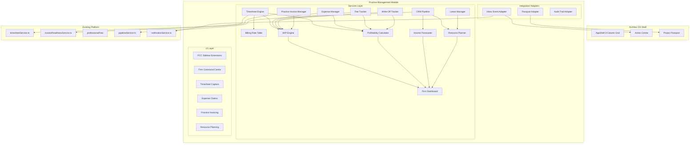

# Design Document: Practice Management Professional Services

## Overview

The Practice Management Professional Services module extends Architex OS with firm-level practice management capabilities for architectural and engineering firms. It builds upon the existing Project Command Centre (PCC) — which covers construction project delivery — by adding the professional services management layer that tracks what firms earn versus what their staff time costs.

### Key Design Decisions

1. **New service subdomain** — `src/services/practiceManagement/` as a bounded module with barrel exports, mirroring the `finance/` and `professionalFee/` patterns
2. **Extend existing timesheetService** — The current `timesheetService.ts` already handles time logging and persistence; the new module extends it with approval workflows, SACAP work stage categorisation, and billing rate lookup
3. **Dual rendering context** — Per-project views extend the PCC sidebar; firm-wide rollups live in a new Firm Command Centre dashboard
4. **Firestore collections** — New collections under the existing non-default DB, scoped by `firmId` for multi-tenant isolation
5. **Pure business logic services** — All calculations (WIP, profitability, forecasting) are pure functions testable without Firestore, following the `professionalFeeCalculatorService` pattern
6. **Integration via adapters** — Project Passport, Action Centre, and SpecForge integration through adapter services (same pattern as Pack 2/3/5)

### Scope Boundaries

- This module handles **professional services** invoicing and financial management — distinct from the existing `finance/` domain which handles construction payment certificates, escrow, and JBCC workflows
- Billing rates here are firm-internal cost rates; the `professionalFee/` module handles client-facing fee proposals and SACAP fee schedules
- Leave management is practice-operational, not HR — no payroll integration

## Architecture

### System Architecture Diagram




### Module Boundaries

| Layer | Location | Responsibility |
|-------|----------|----------------|
| Types | `src/services/practiceManagement/types.ts` | All domain types for the PM module |
| Pure Logic | `src/services/practiceManagement/*.ts` | Business calculations (WIP, profitability, forecasting) |
| Persistence | `src/services/practiceManagement/persistence/` | Firestore CRUD operations |
| Adapters | `src/services/practiceManagement/adapters/` | Project Passport, Action Centre, Audit Trail integration |
| UI - PCC | `src/components/practiceManagement/` | Per-project views extending PCC sidebar |
| UI - Firm | `src/components/FirmCommandCentreDashboard.tsx` | Firm-wide portfolio dashboard |
| API | `src/lib/practice-management-api-router.ts` | Express routes (split file like `finance-api-router.ts`) |
| Navigation | `src/navigation/toolNavRegistry.ts` | Tool Nav config for practice management sections |

### Data Flow

1. **Time capture** → Timesheet Engine validates → looks up Billing Rate → persists entry → triggers WIP recalculation
2. **Expense submission** → Expense Manager validates → creates approval action → on approve: updates project disbursements → triggers WIP recalculation
3. **Invoice generation** → Practice Invoice Manager pulls approved timesheets/expenses → validates via invoiceReadinessService → issues invoice → updates WIP (invoiced amount)
4. **WIP calculation** → Reads: fee structure + approved timesheet costs + approved expenses + invoiced amounts + write-offs → Outputs: WIP position per project/stage
5. **Profitability** → Reads: fee earned + time costs + disbursements + write-offs → Outputs: margin percentage with threshold alerts
6. **Resource planning** → Reads: project assignments + leave calendar + pipeline → Outputs: capacity view per person per week

## Components and Interfaces

### Service Interfaces

```typescript
// Timesheet Engine — extends existing timesheetService
interface TimesheetEngineService {
  submitWeeklyTimesheet(userId: string, firmId: string, weekStartDate: string): Promise<TimesheetSubmission>;
  approveSubmission(submissionId: string, approverId: string): Promise<void>;
  rejectSubmission(submissionId: string, approverId: string, reason: string): Promise<void>;
  getSubmissionsForApproval(approverId: string, firmId: string): Promise<TimesheetSubmission[]>;
  getMySubmissions(userId: string, firmId: string): Promise<TimesheetSubmission[]>;
}

// Expense Manager
interface ExpenseManagerService {
  createExpenseClaim(input: CreateExpenseClaimInput): Promise<ExpenseClaim>;
  submitForApproval(claimId: string): Promise<void>;
  approveClaim(claimId: string, approverId: string): Promise<void>;
  rejectClaim(claimId: string, approverId: string, reason: string): Promise<void>;
  getProjectExpenses(firmId: string, projectId: string): Promise<ExpenseClaim[]>;
  getExpenseSummary(firmId: string, projectId: string): Promise<ExpenseSummary>;
}

// Billing Rate Table
interface BillingRateTableService {
  createRate(input: CreateBillingRateInput): Promise<BillingRate>;
  updateRate(rateId: string, updates: Partial<BillingRate>): Promise<void>;
  getApplicableRate(userId: string, date: string): Promise<BillingRate | null>;
  getRatesForRole(role: string, firmId: string): Promise<BillingRate[]>;
  getAllRates(firmId: string): Promise<BillingRate[]>;
}

// Fee Tracker
interface FeeTrackerService {
  defineProjectFee(input: ProjectFeeStructure): Promise<void>;
  getStageBreakdown(projectId: string): Promise<FeeStageBreakdown[]>;
  checkFeeHealth(projectId: string): Promise<FeeHealthMetrics>;
}

// WIP Engine
interface WipEngineService {
  calculateProjectWip(projectId: string): WipPosition;
  calculateStageWip(projectId: string, stage: SacapWorkStage): WipPosition;
  getFirmWipReport(firmId: string): WipReport;
}

// Profitability Calculator
interface ProfitabilityCalculatorService {
  calculateProjectMargin(projectId: string): ProfitabilityResult;
  calculateStageMargin(projectId: string, stage: SacapWorkStage): ProfitabilityResult;
  getFirmProfitability(firmId: string): FirmProfitabilityReport;
}

// Practice Invoice Manager
interface PracticeInvoiceManagerService {
  createInvoice(input: CreatePracticeInvoiceInput): Promise<PracticeInvoice>;
  updateInvoiceStatus(invoiceId: string, status: PracticeInvoiceStatus): Promise<void>;
  getProjectInvoices(projectId: string): Promise<PracticeInvoice[]>;
  getOverdueInvoices(firmId: string): Promise<PracticeInvoice[]>;
  checkOverdueInvoices(firmId: string): Promise<void>;
}

// Resource Planner
interface ResourcePlannerService {
  getCapacityView(firmId: string, weeks: 4 | 8 | 12): Promise<CapacityView>;
  getPersonCapacity(userId: string, firmId: string, weeks: number): Promise<PersonCapacity>;
  getOverAllocated(firmId: string, weekStart: string): Promise<OverAllocation[]>;
}

// Leave Manager
interface LeaveManagerService {
  requestLeave(input: LeaveRequestInput): Promise<LeaveRequest>;
  approveLeave(requestId: string, approverId: string): Promise<void>;
  rejectLeave(requestId: string, approverId: string, reason: string): Promise<void>;
  getLeaveBalance(userId: string, firmId: string, leaveType: LeaveType): Promise<LeaveBalance>;
  getTeamLeave(firmId: string, dateFrom: string, dateTo: string): Promise<LeaveRequest[]>;
}

// Write-Off Tracker
interface WriteOffTrackerService {
  createWriteOff(input: CreateWriteOffInput): Promise<WriteOffEntry>;
  createReversal(writeOffId: string, reason: string, userId: string): Promise<WriteOffEntry>;
  getProjectWriteOffs(projectId: string): Promise<WriteOffSummary>;
  getFirmWriteOffs(firmId: string): Promise<FirmWriteOffReport>;
}

// Income Forecaster
interface IncomeForecastService {
  generateForecast(firmId: string, months: number): Promise<IncomeForecast>;
  getMonthlyBreakdown(firmId: string): Promise<MonthlyForecastEntry[]>;
  updateForecastOnEvent(event: ForecastTriggerEvent): Promise<void>;
}

// Firm Dashboard
interface FirmDashboardService {
  getSummaryMetrics(firmId: string, dateRange: DateRange): Promise<FirmSummaryMetrics>;
  getProjectPortfolio(firmId: string): Promise<ProjectPortfolioEntry[]>;
  getUtilisationMetrics(firmId: string, dateRange: DateRange): Promise<UtilisationMetrics>;
  exportToPdf(firmId: string, dateRange: DateRange): Promise<Buffer>;
}

// CRM Pipeline (extends existing pipelineService)
interface CrmPipelineService {
  createOpportunity(input: CreatePipelineOpportunityInput): Promise<PipelineOpportunity>;
  updateOpportunity(id: string, updates: Partial<PipelineOpportunity>): Promise<void>;
  winOpportunity(id: string): Promise<void>;
  loseOpportunity(id: string, reason: string): Promise<void>;
  getWeightedPipelineValue(firmId: string): Promise<number>;
  getHighConfidenceOpportunities(firmId: string): Promise<PipelineOpportunity[]>;
}
```


### UI Components

#### PCC Sidebar Extensions

The module adds three new sections to the existing Project Command Centre sidebar:

| Section | Sub-views | Roles |
|---------|-----------|-------|
| Timesheets | Weekly entry, submission status, team timesheets | All staff |
| Expenses | My claims, project disbursements | All staff |
| Practice Financials | WIP, Profitability, Invoicing | architect, bep, firm_admin |

#### Firm Command Centre Dashboard

A new top-level dashboard (`FirmCommandCentreDashboard.tsx`) following the Hero → Stat Row → Panels pattern:

- **Hero**: Firm name, active project count, current month revenue
- **Stat Row**: Total WIP, Average Margin, Utilisation Rate, Pipeline Value
- **Modules Grid**: Profitability card, WIP card, Utilisation card, Pipeline card
- **Panels**: Project portfolio table, Staff utilisation table, Overdue invoices

#### Component Tree

```
src/components/practiceManagement/
├── TimesheetCapture.tsx          # Weekly timesheet grid entry
├── TimesheetApproval.tsx         # Approval queue for managers
├── ExpenseClaimForm.tsx          # Expense submission form
├── ExpenseApproval.tsx           # Expense approval queue
├── BillingRateConfig.tsx         # Rate table management (firm_admin)
├── FeeTrackerPanel.tsx           # Per-project fee health
├── WipReport.tsx                 # WIP position report
├── ProfitabilityPanel.tsx        # Project profitability view
├── PracticeInvoiceBuilder.tsx    # Invoice creation workflow
├── PracticeInvoiceList.tsx       # Invoice status tracking
├── ResourceCapacityView.tsx      # Forward-looking capacity
├── LeaveRequestForm.tsx          # Leave request submission
├── LeaveCalendar.tsx             # Team leave calendar
├── WriteOffPanel.tsx             # Write-off tracking
├── IncomeForecastChart.tsx       # Rolling 12-month forecast
├── CrmPipelineBoard.tsx          # Pipeline opportunities
└── FirmPortfolioTable.tsx        # Firm-wide project table
```

### API Endpoints

New routes in `src/lib/practice-management-api-router.ts`:

| Method | Path | Description |
|--------|------|-------------|
| POST | `/api/practice/timesheets/submit` | Submit weekly timesheet for approval |
| PATCH | `/api/practice/timesheets/submissions/:id/approve` | Approve timesheet submission |
| PATCH | `/api/practice/timesheets/submissions/:id/reject` | Reject timesheet submission |
| GET | `/api/practice/timesheets/submissions` | List submissions (filterable) |
| POST | `/api/practice/expenses` | Create expense claim |
| PATCH | `/api/practice/expenses/:id/approve` | Approve expense |
| PATCH | `/api/practice/expenses/:id/reject` | Reject expense |
| GET | `/api/practice/expenses` | List expenses (filterable) |
| GET | `/api/practice/billing-rates` | List billing rates |
| POST | `/api/practice/billing-rates` | Create/update billing rate |
| GET | `/api/practice/fees/:projectId` | Get fee structure and health |
| POST | `/api/practice/fees/:projectId` | Define/update fee structure |
| GET | `/api/practice/wip` | Firm WIP report |
| GET | `/api/practice/wip/:projectId` | Project WIP position |
| GET | `/api/practice/profitability` | Firm profitability report |
| GET | `/api/practice/profitability/:projectId` | Project profitability |
| POST | `/api/practice/invoices` | Create practice invoice |
| PATCH | `/api/practice/invoices/:id/status` | Update invoice status |
| GET | `/api/practice/invoices` | List invoices (filterable) |
| GET | `/api/practice/capacity` | Resource capacity view |
| POST | `/api/practice/leave` | Request leave |
| PATCH | `/api/practice/leave/:id/approve` | Approve leave |
| PATCH | `/api/practice/leave/:id/reject` | Reject leave |
| GET | `/api/practice/leave/balance/:userId` | Leave balance |
| POST | `/api/practice/write-offs` | Create write-off |
| GET | `/api/practice/write-offs/:projectId` | Project write-offs |
| GET | `/api/practice/forecast` | Income forecast |
| GET | `/api/practice/dashboard` | Firm dashboard metrics |
| GET | `/api/practice/dashboard/portfolio` | Project portfolio |
| GET | `/api/practice/dashboard/utilisation` | Utilisation metrics |
| POST | `/api/practice/pipeline` | Create pipeline opportunity |
| PATCH | `/api/practice/pipeline/:id` | Update pipeline opportunity |
| POST | `/api/practice/pipeline/:id/win` | Mark opportunity as won |

### Navigation Registration

```typescript
// In toolNavRegistry.ts
'practice-management': {
  name: 'Practice Management',
  subtitle: 'Firm financial operations',
  sections: [
    {
      label: 'Time & Costs',
      items: [
        { id: 'timesheets', icon: Clock, label: 'Timesheets' },
        { id: 'expenses', icon: Receipt, label: 'Expenses' },
        { id: 'billing-rates', icon: DollarSign, label: 'Billing Rates' },
      ],
    },
    {
      label: 'Financials',
      items: [
        { id: 'fee-tracker', icon: Target, label: 'Fee Tracker' },
        { id: 'wip', icon: TrendingUp, label: 'WIP' },
        { id: 'profitability', icon: PieChart, label: 'Profitability' },
        { id: 'invoicing', icon: FileText, label: 'Invoicing' },
        { id: 'write-offs', icon: XCircle, label: 'Write-Offs' },
      ],
    },
    {
      label: 'Planning',
      items: [
        { id: 'resources', icon: Users, label: 'Resource Planning' },
        { id: 'leave', icon: Calendar, label: 'Leave' },
        { id: 'forecast', icon: BarChart2, label: 'Income Forecast' },
        { id: 'pipeline', icon: GitBranch, label: 'Pipeline' },
      ],
    },
    {
      label: 'Reporting',
      items: [
        { id: 'firm-dashboard', icon: LayoutDashboard, label: 'Firm Dashboard' },
      ],
    },
  ],
}
```


## Data Models

### SACAP Work Stage Mapping

The requirements reference SACAP Work Stages (1–6). These map to the existing `ProjectStage` type but provide more granular professional service categorisation:

```typescript
export type SacapWorkStage =
  | 'stage_1_inception'
  | 'stage_2_concept'
  | 'stage_3_design_development'
  | 'stage_4_documentation'
  | 'stage_5_construction'
  | 'stage_6_close_out';

export const SACAP_STAGE_LABELS: Record<SacapWorkStage, string> = {
  stage_1_inception: 'Stage 1 – Inception',
  stage_2_concept: 'Stage 2 – Concept & Viability',
  stage_3_design_development: 'Stage 3 – Design Development',
  stage_4_documentation: 'Stage 4 – Documentation & Procurement',
  stage_5_construction: 'Stage 5 – Construction',
  stage_6_close_out: 'Stage 6 – Close Out',
};
```

### Core Domain Types

```typescript
// ─── Timesheet Engine ────────────────────────────────────────────────

export type TimesheetSubmissionStatus = 'draft' | 'pending_approval' | 'approved' | 'rejected';

export interface TimesheetSubmission {
  id: string;
  firmId: string;
  userId: string;
  weekStartDate: string; // ISO date (Monday)
  weekEndDate: string;   // ISO date (Sunday)
  entryIds: string[];    // references to TimesheetEntry docs
  status: TimesheetSubmissionStatus;
  submittedAt?: string;
  approvedBy?: string;
  approvedAt?: string;
  rejectedBy?: string;
  rejectedAt?: string;
  rejectionReason?: string;
  totalHours: number;
  totalValueCents: number;
  createdAt: string;
  updatedAt: string;
}

// Extended TimesheetEntry (adds to existing type)
export interface PracticeTimesheetEntry extends TimesheetEntry {
  sacapStage?: SacapWorkStage;
  activity: string;
  submissionId?: string;
  approvalStatus: TimesheetSubmissionStatus;
  billingRateId?: string;
}

// ─── Expense Manager ─────────────────────────────────────────────────

export type ExpenseCategory = 'travel' | 'printing' | 'courier' | 'accommodation' | 'meals' | 'other';
export type ExpenseType = 'reimbursable' | 'disbursement';
export type ExpenseStatus = 'draft' | 'pending_approval' | 'approved' | 'rejected';

export interface ExpenseClaim {
  id: string;
  firmId: string;
  userId: string;
  projectId: string;
  description: string;
  amountCents: number;
  date: string;
  category: ExpenseCategory;
  expenseType: ExpenseType;
  receiptUrl?: string;
  status: ExpenseStatus;
  submittedAt?: string;
  approvedBy?: string;
  approvedAt?: string;
  rejectedBy?: string;
  rejectedAt?: string;
  rejectionReason?: string;
  invoiced: boolean;
  invoiceId?: string;
  createdAt: string;
  updatedAt: string;
}

export interface ExpenseSummary {
  projectId: string;
  totalReimbursableCents: number;
  totalDisbursementCents: number;
  pendingCents: number;
  approvedCents: number;
  invoicedCents: number;
  byCategory: Record<ExpenseCategory, number>;
}

// ─── Billing Rate Table ──────────────────────────────────────────────

export type BillingRateType = 'hourly' | 'daily' | 'fixed';
export type BillingRateRole = 'architect' | 'technologist' | 'technician' | 'draughtsperson' | 'admin';

export interface BillingRate {
  id: string;
  firmId: string;
  role: BillingRateRole;
  rateType: BillingRateType;
  rateCents: number; // ZAR cents
  effectiveDate: string; // ISO date
  createdBy: string;
  createdAt: string;
  updatedAt: string;
}

// ─── Fee Tracker ─────────────────────────────────────────────────────

export type FeeBasis = 'lump_sum' | 'time_based' | 'percentage_of_construction_cost';

export interface ProjectFeeStructure {
  id: string;
  firmId: string;
  projectId: string;
  totalAgreedFeeCents: number;
  feeBasis: FeeBasis;
  constructionCostCents?: number; // for percentage basis
  stageBreakdown: FeeStageAllocation[];
  createdBy: string;
  createdAt: string;
  updatedAt: string;
}

export interface FeeStageAllocation {
  stage: SacapWorkStage;
  percentage?: number;           // for percentage-based
  fixedAmountCents?: number;     // for lump_sum / time_based
  allocatedFeeCents: number;     // computed: the actual fee for this stage
}

export interface FeeStageBreakdown {
  stage: SacapWorkStage;
  agreedFeeCents: number;
  timeCostsCents: number;
  disbursementsCents: number;
  netPositionCents: number; // fee - costs
  percentUsed: number;
  status: 'healthy' | 'warning' | 'over_run';
}

export interface FeeHealthMetrics {
  projectId: string;
  totalFeeCents: number;
  totalCostsIncurredCents: number;
  netPositionCents: number;
  overRunStages: SacapWorkStage[];
  warningStages: SacapWorkStage[];
}


// ─── WIP Engine ──────────────────────────────────────────────────────

export interface WipPosition {
  projectId: string;
  stage?: SacapWorkStage;
  agreedFeeCents: number;
  costsIncurredCents: number;    // time + disbursements
  amountInvoicedCents: number;
  amountCollectedCents: number;
  wipBalanceCents: number;       // fee - costs - invoiced
  isLoss: boolean;               // costs >= fee
}

export interface WipReport {
  firmId: string;
  projects: WipPosition[];
  totalAgreedFeeCents: number;
  totalCostsIncurredCents: number;
  totalInvoicedCents: number;
  totalCollectedCents: number;
  totalWipBalanceCents: number;
  calculatedAt: string;
}

// ─── Profitability Calculator ────────────────────────────────────────

export interface ProfitabilityResult {
  projectId: string;
  stage?: SacapWorkStage;
  feeEarnedCents: number;
  timeCostCents: number;
  disbursementsCents: number;
  writeOffsCents: number;
  netProfitCents: number;
  marginPercent: number;         // (fee - costs) / fee * 100
  status: 'profitable' | 'at_risk' | 'loss_making';
}

export interface FirmProfitabilityReport {
  firmId: string;
  projects: ProfitabilityResult[];
  averageMarginPercent: number;
  totalRevenueCents: number;
  totalCostsCents: number;
  totalProfitCents: number;
}

// ─── Practice Invoice Manager ────────────────────────────────────────

export type PracticeInvoiceType = 'lump_sum' | 'time_based' | 'disbursement';
export type PracticeInvoiceStatus = 'draft' | 'submitted' | 'sent_to_client' | 'paid' | 'overdue' | 'write_off';

export interface PracticeInvoice {
  id: string;
  firmId: string;
  projectId: string;
  invoiceNumber: string;
  invoiceType: PracticeInvoiceType;
  status: PracticeInvoiceStatus;
  amountCents: number;
  vatCents: number;
  totalCents: number;
  dueDate: string;
  issuedDate?: string;
  paidDate?: string;
  timesheetEntryIds?: string[];  // for time_based invoices
  expenseClaimIds?: string[];    // for disbursement invoices
  sacapStage?: SacapWorkStage;
  description: string;
  clientName?: string;
  clientEmail?: string;
  createdBy: string;
  createdAt: string;
  updatedAt: string;
}

// ─── Resource Planner ────────────────────────────────────────────────

export interface PersonCapacity {
  userId: string;
  displayName: string;
  role: BillingRateRole;
  weeks: WeekCapacity[];
}

export interface WeekCapacity {
  weekStart: string; // ISO date (Monday)
  totalAvailableHours: number;
  allocatedHours: number;
  leaveHours: number;
  remainingCapacity: number;
  isOverAllocated: boolean;
  pipelineImpactHours: number; // from high-confidence pipeline
}

export interface CapacityView {
  firmId: string;
  people: PersonCapacity[];
  firmTotalAvailable: number;
  firmTotalAllocated: number;
  firmUtilisationPercent: number;
}

export interface OverAllocation {
  userId: string;
  displayName: string;
  weekStart: string;
  allocatedHours: number;
  availableHours: number;
  overBy: number;
}

// ─── Leave Manager ───────────────────────────────────────────────────

export type LeaveType = 'annual' | 'sick' | 'family_responsibility' | 'study' | 'unpaid';
export type LeaveStatus = 'pending' | 'approved' | 'rejected' | 'cancelled';

export interface LeaveRequest {
  id: string;
  firmId: string;
  userId: string;
  leaveType: LeaveType;
  startDate: string;
  endDate: string;
  workingDays: number; // calculated excluding weekends + public holidays
  notes?: string;
  status: LeaveStatus;
  approvedBy?: string;
  approvedAt?: string;
  rejectedBy?: string;
  rejectedAt?: string;
  rejectionReason?: string;
  createdAt: string;
  updatedAt: string;
}

export interface LeaveBalance {
  userId: string;
  firmId: string;
  leaveType: LeaveType;
  annualCycle: string; // e.g. '2025'
  entitlement: number; // total days entitled
  used: number;        // days used
  pending: number;     // days in pending requests
  available: number;   // entitlement - used - pending
}


// ─── Write-Off Tracker ───────────────────────────────────────────────

export type WriteOffReason = 'scope_creep' | 'rework' | 'goodwill' | 'fee_negotiation' | 'other';

export interface WriteOffEntry {
  id: string;
  firmId: string;
  projectId: string;
  sacapStage?: SacapWorkStage;
  amountCents: number;
  reason: WriteOffReason;
  description?: string;
  isReversal: boolean;
  reversalOfId?: string; // reference to original write-off if reversal
  authorisedBy: string;
  date: string;
  createdAt: string;
}

export interface WriteOffSummary {
  projectId: string;
  cumulativeWriteOffCents: number;
  agreedFeeCents: number;
  writeOffPercentage: number; // cumulative / fee * 100
  byStage: Record<SacapWorkStage, number>;
  entries: WriteOffEntry[];
}

// ─── Income Forecaster ───────────────────────────────────────────────

export type ForecastConfidence = 'confirmed' | 'probable' | 'pipeline';

export interface MonthlyForecastEntry {
  month: string; // 'YYYY-MM'
  confirmedCents: number;
  probableCents: number;
  pipelineCents: number;
  totalCents: number;
  projects: Array<{
    projectId: string;
    projectName: string;
    amountCents: number;
    confidence: ForecastConfidence;
    stage?: SacapWorkStage;
  }>;
}

export interface IncomeForecast {
  firmId: string;
  generatedAt: string;
  months: MonthlyForecastEntry[];
  totalConfirmedCents: number;
  totalProbableCents: number;
  totalPipelineCents: number;
}

// ─── Firm Dashboard ──────────────────────────────────────────────────

export interface FirmSummaryMetrics {
  totalRevenueCents: number;     // invoiced
  totalWipExposureCents: number;
  averageProjectMarginPercent: number;
  firmUtilisationPercent: number;
  pipelineValueCents: number;    // weighted
  writeOffPercentage: number;    // firm-wide
}

export interface ProjectPortfolioEntry {
  projectId: string;
  projectName: string;
  feeCents: number;
  costsCents: number;
  wipCents: number;
  marginPercent: number;
  status: 'healthy' | 'warning' | 'over_run' | 'loss_making';
}

export interface UtilisationMetrics {
  firmAverage: number;           // percentage
  billableHours: number;
  nonBillableHours: number;
  totalHours: number;
  byPerson: Array<{
    userId: string;
    displayName: string;
    utilisation: number;
    trend: 'up' | 'down' | 'stable';
  }>;
}

export type DateRange = {
  type: 'monthly' | 'quarterly' | 'annually';
  from: string;
  to: string;
};

// ─── CRM Pipeline (extends existing PipelineProject) ─────────────────

export interface PipelineOpportunity extends PipelineProject {
  requiredDisciplines: BillingRateRole[];
  requiredHeadcount?: number;
  expectedStartDate?: string;
  isHighConfidence: boolean; // probability > 75%
  includedInCapacity: boolean;
  weightedValueCents: number; // fee * probability
}
```

### Firestore Collection Schema

| Collection | Document Key | Scoped By |
|------------|-------------|-----------|
| `practice_timesheet_submissions` | `{submissionId}` | `firmId` |
| `practice_expenses` | `{expenseId}` | `firmId` |
| `practice_billing_rates` | `{rateId}` | `firmId` |
| `practice_fee_structures` | `{projectId}` | `firmId` |
| `practice_invoices` | `{invoiceId}` | `firmId` |
| `practice_leave_requests` | `{requestId}` | `firmId` |
| `practice_leave_balances` | `{userId}_{leaveType}_{year}` | `firmId` |
| `practice_write_offs` | `{writeOffId}` | `firmId` |
| `practice_resource_allocations` | `{userId}_{projectId}` | `firmId` |

Existing collections used:
- `timesheets` — extended with `sacapStage`, `activity`, `submissionId`, `approvalStatus`, `billingRateId` fields
- `pipeline_projects` — extended with `requiredDisciplines`, `expectedStartDate`, `isHighConfidence`, `includedInCapacity`

### Zod Validation Schemas

All input validation uses Zod schemas registered in `src/lib/schemas.ts` or co-located in the service module:

```typescript
// Example: CreateExpenseClaimInput validation
export const createExpenseClaimSchema = z.object({
  firmId: z.string().min(1),
  userId: z.string().min(1),
  projectId: z.string().min(1),
  description: z.string().min(1).max(500),
  amountCents: z.number().int().positive(),
  date: z.string().regex(/^\d{4}-\d{2}-\d{2}$/),
  category: z.enum(['travel', 'printing', 'courier', 'accommodation', 'meals', 'other']),
  expenseType: z.enum(['reimbursable', 'disbursement']),
  receiptUrl: z.string().url().optional(),
});

export const createBillingRateSchema = z.object({
  firmId: z.string().min(1),
  role: z.enum(['architect', 'technologist', 'technician', 'draughtsperson', 'admin']),
  rateType: z.enum(['hourly', 'daily', 'fixed']),
  rateCents: z.number().int().positive(),
  effectiveDate: z.string().regex(/^\d{4}-\d{2}-\d{2}$/),
});

export const projectFeeStructureSchema = z.object({
  firmId: z.string().min(1),
  projectId: z.string().min(1),
  totalAgreedFeeCents: z.number().int().positive(),
  feeBasis: z.enum(['lump_sum', 'time_based', 'percentage_of_construction_cost']),
  constructionCostCents: z.number().int().positive().optional(),
  stageBreakdown: z.array(z.object({
    stage: z.enum([
      'stage_1_inception', 'stage_2_concept', 'stage_3_design_development',
      'stage_4_documentation', 'stage_5_construction', 'stage_6_close_out',
    ]),
    percentage: z.number().min(0).max(100).optional(),
    fixedAmountCents: z.number().int().nonnegative().optional(),
  })),
});
```


## Correctness Properties

*A property is a characteristic or behavior that should hold true across all valid executions of a system — essentially, a formal statement about what the system should do. Properties serve as the bridge between human-readable specifications and machine-verifiable correctness guarantees.*

### Property 1: Timesheet cost calculation invariant

*For any* valid timesheet entry with start time, end time, and applicable billing rate, the computed cost in cents SHALL equal `(duration_in_minutes / 60) * rate_cents`, rounded to the nearest integer.

**Validates: Requirements 1.2**

### Property 2: Billing rate temporal lookup correctness

*For any* set of billing rate versions for a role (each with a distinct effective date) and *for any* query date, the returned applicable rate SHALL be the one with the most recent effective date that is on or before the query date. If no rate has an effective date on or before the query date, the result SHALL be null and the entry SHALL be flagged.

**Validates: Requirements 3.3, 3.4**

### Property 3: Approval workflow state transitions

*For any* approval-workflow entity (timesheet submission, expense claim, or leave request) in `pending_approval` status:
- Approval SHALL set status to `approved`
- Rejection SHALL set status to `rejected` and store a non-empty reason string

*For any* entity not in `pending_approval` status, approval and rejection operations SHALL be rejected.

**Validates: Requirements 1.4, 1.5, 2.3, 2.4, 9.3, 9.4**

### Property 4: Fee stage health status determination

*For any* project stage with an agreed fee and incurred time costs, the stage status SHALL be:
- `healthy` when costs ≤ 80% of agreed fee
- `warning` when costs > 80% and ≤ 100% of agreed fee
- `over_run` when costs > 100% of agreed fee

And the net position SHALL equal `agreed_fee - time_costs - disbursements`.

**Validates: Requirements 4.2, 4.3, 4.4**

### Property 5: WIP calculation formula

*For any* project with an agreed fee, total costs incurred (time + disbursements), and amounts invoiced:
- WIP balance = agreed_fee − costs_incurred − amount_invoiced
- The loss indicator SHALL be `true` if and only if costs_incurred ≥ agreed_fee

*For any* set of active projects in a firm, the firm-wide WIP total SHALL equal the sum of individual project WIP balances.

**Validates: Requirements 5.1, 5.3, 5.4**

### Property 6: Profitability margin formula and status classification

*For any* project with fee_earned > 0:
- Margin percentage = (fee_earned − time_cost − disbursements − write_offs) / fee_earned × 100
- Status SHALL be `profitable` when margin ≥ 20%
- Status SHALL be `at_risk` when 0% ≤ margin < 20%
- Status SHALL be `loss_making` when margin < 0%

*For any* project with per-stage costs, the sum of per-stage profits SHALL equal the project-level profit.

**Validates: Requirements 6.1, 6.3, 6.4, 6.5**

### Property 7: Practice invoice total for time-based invoices

*For any* set of approved timesheet entries linked to a time-based practice invoice, the invoice amount SHALL equal the sum of `(entry.durationMinutes / 60) × entry.hourlyRateCents` for all linked entries.

**Validates: Requirements 7.2**

### Property 8: Invoice overdue detection

*For any* practice invoice with status not equal to `paid` or `write_off`, the invoice SHALL be flagged as overdue if and only if the current date exceeds the due date by more than 30 full days.

**Validates: Requirements 7.5**

### Property 9: Resource capacity calculation

*For any* team member and *for any* week:
- Available hours = standard_working_hours − approved_leave_hours − public_holiday_hours
- Remaining capacity = available_hours − allocated_hours
- Over-allocated flag SHALL be `true` if and only if allocated_hours > available_hours (including when available_hours is zero)
- Pipeline impact hours SHALL be tracked separately from confirmed allocation hours

**Validates: Requirements 8.1, 8.2, 8.3, 8.5**

### Property 10: Leave working days calculation

*For any* date range (start_date to end_date), the calculated working days SHALL equal the total calendar days minus weekend days (Saturday and Sunday) minus public holidays falling within the range. The result SHALL always be ≥ 0.

**Validates: Requirements 9.2**

### Property 11: Leave balance sufficiency validation

*For any* leave request, if the requested working days exceed the available balance (entitlement − used − pending) for that leave type and annual cycle, the request SHALL be rejected.

**Validates: Requirements 9.5**

### Property 12: Write-off cumulative monotonicity

*For any* sequence of non-reversal write-off entries for a project, the cumulative total SHALL be monotonically non-decreasing. The write-off percentage SHALL equal (cumulative_write_offs / agreed_fee) × 100, and a warning SHALL be generated if and only if this percentage exceeds 10%.

**Validates: Requirements 10.2, 10.3, 10.4**

### Property 13: Income forecast confidence transitions

*For any* forecast entry, when a project stage transitions to complete-and-ready-for-invoicing:
- If the entry's confidence is `probable`, it SHALL move to `confirmed`
- If the entry's confidence is `confirmed` or `pipeline`, it SHALL remain unchanged

*For any* set of projects, the sum of all monthly forecast entries SHALL equal the total of all project fees (at their respective confidence-weighted values).

**Validates: Requirements 11.2, 11.3**

### Property 14: Pipeline weighted value calculation

*For any* pipeline opportunity with estimated fee and probability percentage (0–100):
- Weighted value = estimated_fee × (probability / 100)
- High-confidence flag SHALL be `true` if and only if probability > 75

**Validates: Requirements 13.2, 13.3**

### Property 15: Role-based data visibility

*For any* user with role `staff` or `freelancer`, the practice management module SHALL expose only: own timesheets, own expenses, own leave requests, and project-level time summaries — no fee, profitability, WIP, or billing rate data SHALL be visible.

*For any* user with role `client`, only project fee summary and invoice history SHALL be visible — no internal cost, margin, utilisation, or team data SHALL be exposed.

*For any* access attempt to resources outside a user's role scope, the system SHALL deny access and log the violation.

**Validates: Requirements 14.1, 14.4, 14.5**

### Property 16: Expense aggregation consistency

*For any* project and *for any* set of approved expense claims, the project's total disbursement amount SHALL equal the sum of individual claim amounts where `expenseType = 'disbursement'` and `status = 'approved'`.

**Validates: Requirements 2.6**

### Property 17: Firm dashboard utilisation calculation

*For any* firm with staff members who have logged time, the firm utilisation rate SHALL equal `(total_billable_hours / total_available_hours) × 100`. The per-person utilisation SHALL be consistent such that `firm_average = sum(person_billable) / sum(person_available) × 100`.

**Validates: Requirements 12.3**


## Error Handling

### Validation Errors

All API endpoints validate inputs using Zod schemas. Invalid requests return HTTP 400 with structured error:

```json
{
  "error": "VALIDATION_ERROR",
  "message": "Invalid input",
  "details": [
    { "path": "amountCents", "message": "Expected positive integer" }
  ]
}
```

### Business Logic Errors

| Error Code | Trigger | HTTP Status | Recovery |
|------------|---------|-------------|----------|
| `RATE_NOT_FOUND` | No billing rate for user/date | 200 (entry saved) | Entry saved with zero cost, flagged for rate assignment |
| `INSUFFICIENT_LEAVE` | Leave request exceeds balance | 409 | Show balance to user, suggest shorter period |
| `ALREADY_INVOICED` | Attempt to modify invoiced timesheet | 409 | Return invoiceId for reference |
| `SUBMISSION_NOT_PENDING` | Approve/reject non-pending submission | 409 | Return current status |
| `DUPLICATE_SUBMISSION` | Submit already-submitted week | 409 | Return existing submissionId |
| `FEE_NOT_DEFINED` | WIP/profitability for project without fee | 404 | Prompt fee structure creation |
| `RATE_OVERLAP` | New rate effective date conflicts with existing | 409 | Show conflicting rate |
| `WRITE_OFF_EXCEEDS_FEE` | Write-off would exceed remaining fee | 422 | Show remaining fee balance |

### Concurrency and Consistency

- **Firestore transactions** for approval workflows — ensures entry status and cost totals update atomically
- **Optimistic locking** via `updatedAt` field — reject updates if document has changed since read
- **Batch writes** for timesheet submission approval (all entries in one batch)
- **Eventual consistency** acceptable for dashboard aggregations — recalculate on demand with caching

### Audit Trail

All state-changing operations emit audit events through the `auditTrailAdapter`:

```typescript
interface PracticeAuditEvent {
  id: string;
  firmId: string;
  projectId?: string;
  userId: string;
  action: 'timesheet_submitted' | 'timesheet_approved' | 'timesheet_rejected'
    | 'expense_submitted' | 'expense_approved' | 'expense_rejected'
    | 'invoice_created' | 'invoice_status_changed'
    | 'leave_requested' | 'leave_approved' | 'leave_rejected'
    | 'write_off_created' | 'write_off_reversed'
    | 'rate_created' | 'rate_updated'
    | 'fee_defined' | 'fee_updated'
    | 'pipeline_created' | 'pipeline_won' | 'pipeline_lost'
    | 'access_violation';
  entityType: string;
  entityId: string;
  details: Record<string, unknown>;
  timestamp: string;
}
```

## Testing Strategy

### Dual Testing Approach

This module uses both unit tests and property-based tests for comprehensive coverage:

**Property-Based Tests** (via `fast-check`):
- Minimum 100 iterations per property test
- Each test references its design document property
- Tag format: `Feature: practice-management-professional-services, Property {N}: {title}`
- Focus areas: WIP calculation, profitability margins, billing rate lookup, capacity planning, fee health thresholds, write-off monotonicity, leave day calculation

**Unit Tests** (via Vitest):
- Specific examples demonstrating correct behavior for each service
- Edge cases: zero fees, midnight boundary times, empty rate tables, single-day leave
- Integration tests: Firestore persistence, Action Centre event creation, Project Passport writes
- State machine tests: invoice status transitions, approval workflow sequences

### Test File Structure

```
src/services/practiceManagement/__tests__/
├── wipEngine.test.ts              # WIP formula + properties
├── wipEngine.property.test.ts     # Property-based WIP tests
├── profitabilityCalculator.test.ts
├── profitabilityCalculator.property.test.ts
├── billingRateTable.test.ts
├── billingRateTable.property.test.ts
├── feeTracker.test.ts
├── feeTracker.property.test.ts
├── resourcePlanner.test.ts
├── resourcePlanner.property.test.ts
├── leaveManager.test.ts
├── leaveManager.property.test.ts
├── writeOffTracker.test.ts
├── writeOffTracker.property.test.ts
├── incomeForecast.test.ts
├── incomeForecast.property.test.ts
├── timesheetEngine.test.ts
├── expenseManager.test.ts
├── practiceInvoiceManager.test.ts
├── crmPipeline.test.ts
├── roleAccess.test.ts
├── adapters.test.ts
└── integration.test.ts
```

### Property Test Configuration

```typescript
// vitest.config.ts — property tests use extended timeout
import { fc } from 'fast-check';

// Example property test structure
describe('WIP Engine Properties', () => {
  it('Property 5: WIP calculation formula', () => {
    fc.assert(
      fc.property(
        fc.nat({ max: 100_000_000 }),  // agreedFeeCents
        fc.nat({ max: 100_000_000 }),  // costsIncurredCents
        fc.nat({ max: 100_000_000 }),  // amountInvoicedCents
        (fee, costs, invoiced) => {
          const wip = calculateProjectWip({ agreedFeeCents: fee, costsIncurredCents: costs, amountInvoicedCents: invoiced });
          expect(wip.wipBalanceCents).toBe(fee - costs - invoiced);
          expect(wip.isLoss).toBe(costs >= fee);
        }
      ),
      { numRuns: 100 }
    );
  });
});
```

### Coverage Goals

| Layer | Target | Rationale |
|-------|--------|-----------|
| Pure calculation services | 95%+ | Core business logic, fully testable |
| Approval workflow logic | 90%+ | State transitions, critical path |
| API route handlers | 80%+ | Input validation, auth checks |
| Persistence layer | 70%+ | CRUD operations, Firestore wiring |
| UI components | 60%+ | Render checks, interaction tests |
| Adapters (Passport, Inbox) | 80%+ | Integration contracts |

### Integration Test Points

1. Timesheet approval → WIP recalculation
2. Expense approval → disbursement total update
3. Invoice issuance → WIP invoiced amount update
4. Write-off creation → profitability recalculation
5. Leave approval → resource capacity update
6. Pipeline win → project setup trigger
7. Fee threshold crossing → Action Centre notification
8. Role-based API endpoint access control
