# Design Document: Professional Fee Proposal Builder

## Overview

The Professional Fee Proposal Builder is a multi-profession fee calculator and proposal generation tool that integrates into the Architex OS platform as a workspace-style tool under Toolboxes > Proposal & Appointment. It provides 12 built environment professions with purpose-built calculator workspaces, shared proposal generation, terms management, and run history — all backed by version-controlled fee guide tariff data from South African council bodies (SACAP, ECSA, SACQSP, SACPLAN, SAGC, SACLAP, SACPCMP).

The tool transplants existing engine code from `src/services/professionalFee/` (already in the repo) and wraps it with:
- A React workspace UI following the SpecForge V2 aesthetic
- Firestore persistence for runs, proposals, source versions, and terms
- Platform integration with Project Passport, Action Centre, Appointment workflow, and SpecForge
- A client-facing estimation view delegating to the existing `feeEstimatorService.ts`

**Key design decisions:**
- The calculation engine (`FeeCalculatorEngine`, `ProfessionProfileRegistry`) is already implemented and tested — the design focuses on UI, persistence, platform integration, and the SACAP complexity matrix
- The tool renders inside the Architex OS shell (not standalone) and receives `user: UserProfile` prop
- Source version management uses Firestore with an admin-only write path
- The SACAP Building Category → Building Type → Complexity matrix is stored as structured JSON in the source version payload

## Architecture

```mermaid
graph TB
    subgraph "Architex OS Shell"
        App[App.tsx] --> FPB[FeeProposalBuilder]
    end
    
    subgraph "UI Layer"
        FPB --> Sidebar[ProfessionSidebar]
        FPB --> Workspace[CalculatorWorkspace]
        FPB --> ProposalView[ProposalBuilderView]
        FPB --> TermsView[TermsLibraryView]
        FPB --> HistoryView[RunHistoryView]
        FPB --> ClientView[ClientEstimationView]
        Workspace --> StagePanel[StageWeightingPanel]
        Workspace --> ComplexityPanel[ComplexityPanel]
        Workspace --> ResultPanel[ResultPanel]
    end
    
    subgraph "Service Layer (src/services/professionalFee/)"
        Engine[FeeCalculatorEngine]
        Profiles[ProfessionProfileRegistry]
        PFS[ProfessionFeeService]
        PB[ProposalBuilderService]
        TL[TermsLibraryService]
        GUS[FeeGuideUpdateService]
        SVM[SourceVersionManager]
    end
    
    subgraph "Persistence (Firestore)"
        RunsCol[(fee_proposal_runs)]
        ProposalsCol[(fee_proposals)]
        SourcesCol[(fee_source_versions)]
        TermsCol[(fee_terms_templates)]
        MatrixCol[(sacap_complexity_matrix)]
    end
    
    subgraph "Platform Spine"
        PP[Project Passport]
        AC[Action Centre / Inbox]
        Appt[Appointment Service]
        SF[SpecForge]
        Audit[Audit Trail]
    end
    
    Workspace --> PFS
    PFS --> Engine
    PFS --> Profiles
    ProposalView --> PB
    TermsView --> TL
    
    PFS --> RunsCol
    PB --> ProposalsCol
    SVM --> SourcesCol
    TL --> TermsCol
    
    PB --> PP
    PB --> AC
    PB --> Appt
    PB --> SF
    PB --> Audit
```



### Architectural Decisions

| Decision | Choice | Rationale |
|----------|--------|-----------|
| State management | React context + local state | Calculator state is ephemeral until save; no global store needed. Context provides profession selection and source version. |
| Service layer location | `src/services/professionalFee/` | Already exists with engine code; extend with persistence and platform adapters |
| Component location | `src/components/tools/FeeProposalBuilder/` | Follows tool component pattern, registered via `standaloneToolRegistry` |
| Persistence | Firestore collections under `fee_proposal/` prefix | Matches platform pattern; enables real-time sync and role-based security rules |
| SACAP matrix storage | JSON payload within Source_Version record | Matrix is version-specific (new Board Notices may reclassify building types); co-locating with fee tables ensures consistency |
| Client estimation view | Delegates to existing `feeEstimatorService.ts` | Requirement 14.6 explicitly states this; avoids duplication |
| Proposal immutability | FNV-1a content hash + status flag | Already implemented in `proposalBuilder.ts`; prevents mutation after issue |

## Components and Interfaces

### Component Hierarchy

```
src/components/tools/FeeProposalBuilder/
├── index.tsx                       # Main workspace (receives user prop)
├── FeeProposalBuilderContext.tsx    # React context: active profession, source version, calculator state
├── ProfessionSidebar.tsx           # Left nav: 12 professions + tool sections
├── calculators/
│   ├── ArchitectCalculator.tsx     # SACAP sliding scale + IDoW stages + complexity matrix
│   ├── EngineerCalculator.tsx      # Shared for structural/civil/electrical/mechanical
│   ├── FireEngineerCalculator.tsx  # Hybrid: base + hourly rational design
│   ├── QuantitySurveyorCalc.tsx    # Three fee basis options
│   ├── TownPlannerCalculator.tsx   # Hybrid: application + time
│   ├── LandSurveyorCalculator.tsx  # Area/unit + beacon rates
│   ├── InteriorDesignerCalc.tsx    # Design fee + procurement markup
│   ├── CPMCalculator.tsx           # Three fee basis options
│   └── LandscapeArchCalc.tsx       # Percentage of cost
├── shared/
│   ├── StageWeightingPanel.tsx     # Stage selection + weight editing
│   ├── SubTaskPanel.tsx            # Sub-task weights within stages (architect)
│   ├── ComplexitySelector.tsx      # Generic complexity picker
│   ├── SACAPComplexityMatrix.tsx   # Building Category → Type → Complexity
│   ├── DiscountPanel.tsx           # Discount % + mandatory reason
│   ├── DisbursementsEditor.tsx     # Line items for disbursements
│   ├── StatutoryFeesEditor.tsx     # Line items for statutory fees
│   ├── TariffOverridePanel.tsx     # Editable hourly/discipline/percentage values
│   ├── ResultSummaryCard.tsx       # Fee breakdown display
│   ├── SourceVersionBadge.tsx      # Demo-seed indicator / version info
│   └── DisclaimerBanner.tsx        # Persistent guideline disclaimer
├── proposal/
│   ├── ProposalBuilderView.tsx     # Proposal assembly workflow
│   ├── ProposalPreview.tsx         # Preview before issue
│   ├── ResponsibilityGate.tsx      # Professional confirmation dialog
│   └── ProposalHistoryList.tsx     # Versioned proposal list
├── terms/
│   ├── TermsLibraryView.tsx        # Template browser + editor
│   ├── ClauseEditor.tsx            # Individual clause editing
│   └── TermsVersionHistory.tsx     # Version timeline
├── history/
│   ├── RunHistoryView.tsx          # Saved runs list + filters
│   ├── RunDetailCard.tsx           # Individual run display
│   └── ExportDialog.tsx            # PDF/CSV/JSON export
├── client/
│   ├── ClientEstimationView.tsx    # Simplified "What will it cost?" view
│   └── FeeComparisonTable.tsx      # Estimate vs actual proposals
└── admin/
    ├── SourceVersionManager.tsx    # Admin: create/verify/retire versions
    ├── FeeTableImporter.tsx        # CSV/JSON import for fee tables
    └── GuidelineMonitorPanel.tsx   # Watch registry + change candidates
```

### Key Interfaces

```typescript
// Component prop contract
interface FeeProposalBuilderProps {
  user: UserProfile;
  projectId?: string; // when opened in project context
}

// Context value
interface FeeProposalBuilderContextValue {
  activeProfession: Profession;
  setActiveProfession: (p: Profession) => void;
  activeSourceVersion: SourceVersion | null;
  calculatorState: CalculatorState;
  dispatch: (action: CalculatorAction) => void;
  isDemoSeed: boolean;
}

// Calculator state (managed via useReducer)
interface CalculatorState {
  profession: Profession;
  projectValue: number;
  complexityId: string;
  complexityOverride?: { level: string; justification: string };
  workCategorySplits: Record<string, number>;
  selectedStages: Record<string, { applicable: boolean; reductionPercentage: number }>;
  subTaskWeights?: Record<string, Record<string, number>>; // stageId → subtaskId → weight
  hourlyLines: Array<{ label: string; hours: number; rate: number }>;
  unitLines: Array<{ label: string; quantity: number; unitRate: number; factor?: number }>;
  disbursements: Array<{ label: string; amount: number }>;
  statutoryFees: Array<{ label: string; amount: number }>;
  discount: { percentage: number; reason: string; appliesToDisbursements: boolean; appliesToStatutoryFees: boolean };
  vatApplicable: boolean;
  tariffOverrides: Record<string, number>; // parameter key → override value
  result: FeeCalculationResult | null;
}
```

### Platform Integration Contracts

```typescript
// Adapters (extend existing src/services/professionalFee/adapters.ts)

// Write proposal to Project Passport
function writeProposalToPassport(proposal: ProposalDocument, projectId: string): ProjectRecord;

// Create Action Centre inbox event for client
function createProposalInboxEvent(proposal: ProposalDocument, clientId: string): WorkflowEvent;

// Create Appointment Draft from accepted proposal
function createAppointmentFromProposal(proposal: ProposalDocument, projectFacts: ProjectFacts): AppointmentRecord;

// Seed SpecForge items from proposal scope
function seedSpecForgeFromProposal(proposal: ProposalDocument, projectId: string): SpecForgeItem[];

// Write audit trail entry
function writeProposalAuditEntry(action: 'create' | 'issue' | 'revise' | 'accept', proposal: ProposalDocument): AuditEntry;
```

## Data Models

### Firestore Collections

#### `fee_proposal_runs/{runId}`
```typescript
interface FeeProposalRun {
  runId: string;
  userId: string;
  profession: Profession;
  input: FeeInput;
  result: FeeCalculationResult;
  sourceVersionId: string;
  sourceVersionHash: string;
  projectId?: string;          // when assigned
  projectRecordId?: string;    // after passport write
  notes?: string;
  version: number;
  previousRunId?: string;      // lineage for reopened runs
  createdAt: string;
  updatedAt: string;
  exportedAt?: string;
  exportFormat?: 'pdf' | 'csv' | 'json';
}
```

#### `fee_proposals/{proposalId}`
```typescript
interface FeeProposalRecord {
  id: string;
  userId: string;
  profession: Profession;
  status: 'draft' | 'issued' | 'accepted' | 'superseded' | 'withdrawn';
  document: ProposalDocument;
  runId: string;                    // source calculation run
  sourceVersionId: string;
  projectId?: string;
  clientId?: string;
  validityDays: number;
  validUntil: string;
  responsibilityConfirmed: boolean;
  responsibilityConfirmedAt?: string;
  auditHash?: string;
  previousVersionId?: string;       // supersession chain
  version: number;
  createdAt: string;
  issuedAt?: string;
  acceptedAt?: string;
}
```

#### `fee_source_versions/{sourceId}`
```typescript
interface FeeSourceVersionRecord {
  id: string;
  profession: Profession;
  body: string;                     // SACAP, ECSA, SACQSP, etc.
  title: string;
  effectiveDate: string;
  boardNoticeRef?: string;          // e.g. "Board Notice 27 of 2021"
  status: 'demo-seed' | 'draft' | 'verified' | 'retired';
  payload: {
    feeTables?: SACAPFeeTable[];    // construction value bands → percentages
    percentageBands?: PercentageBand[];
    stageWeightings?: StageDefinition[];
    complexityMatrix?: SACAPComplexityMatrix;
    hourlyRates?: Record<string, number>;
    disciplineFactors?: Record<string, number>;
  };
  contentHash: string;
  createdBy: string;
  approvedBy?: string;
  previousVersionId?: string;
  createdAt: string;
  verifiedAt?: string;
  retiredAt?: string;
}
```

#### SACAP Fee Table Structure (within source version payload)
```typescript
interface SACAPFeeTable {
  complexityLevel: 'low' | 'medium' | 'high';
  bands: Array<{
    minValue: number;        // construction value lower bound
    maxValue: number;        // construction value upper bound
    feePercentage: number;   // fee as percentage of construction value
    baseFee?: number;        // base fee for interpolation within band
    rateAboveMin?: number;   // marginal rate above minValue
  }>;
}

interface SACAPComplexityMatrix {
  categories: Array<{
    id: string;
    name: string;           // e.g. "Residential Domestic"
    types: Array<{
      id: string;
      name: string;         // e.g. "General hospitals"
      complexityLevel: 'low' | 'medium' | 'high';
      description?: string;
    }>;
  }>;
}
```

#### `fee_terms_templates/{templateId}`
```typescript
interface FeeTermsTemplateRecord {
  id: string;
  name: string;
  professionTags: string[];
  version: number;
  clauses: Array<{
    id: string;
    text: string;
    editable: boolean;
    editedAt?: string;
  }>;
  legalReviewFlag: boolean;
  legalReviewedAt?: string;
  legalReviewedBy?: string;
  previousVersionId?: string;
  createdBy: string;
  createdAt: string;
  updatedAt: string;
}
```

### API Routes (Express)

```typescript
// Added to src/lib/api-router.ts or a new fee-proposal-api-router.ts

// Source version management (admin only)
POST   /api/fee-proposal/source-versions              // Create new source version
PATCH  /api/fee-proposal/source-versions/:id/status   // Transition status
POST   /api/fee-proposal/source-versions/:id/import   // Import CSV/JSON fee table

// Run persistence
POST   /api/fee-proposal/runs                         // Save a run
GET    /api/fee-proposal/runs?userId=&profession=     // List runs
GET    /api/fee-proposal/runs/:runId                  // Get single run
POST   /api/fee-proposal/runs/:runId/reopen           // Create new version from run
POST   /api/fee-proposal/runs/:runId/assign           // Assign to project
POST   /api/fee-proposal/runs/:runId/export           // Export run (returns file)

// Proposals
POST   /api/fee-proposal/proposals                    // Create draft
PATCH  /api/fee-proposal/proposals/:id/issue          // Issue (with responsibility confirmation)
PATCH  /api/fee-proposal/proposals/:id/accept         // Client accepts
POST   /api/fee-proposal/proposals/:id/revise         // Create revision

// Terms
GET    /api/fee-proposal/terms                        // List templates
POST   /api/fee-proposal/terms                        // Create template
PATCH  /api/fee-proposal/terms/:id                    // Edit (creates new version)

// Guideline monitoring (admin only)
GET    /api/fee-proposal/guideline-watch              // List watch sources
POST   /api/fee-proposal/guideline-watch/scan         // Trigger scan
POST   /api/fee-proposal/guideline-watch/approve      // Approve change candidate

// Client estimation
POST   /api/fee-proposal/client-estimate              // Calculate client-facing estimate
```

## Correctness Properties

*A property is a characteristic or behavior that should hold true across all valid executions of a system — essentially, a formal statement about what the system should do. Properties serve as the bridge between human-readable specifications and machine-verifiable correctness guarantees.*

### Property 1: FeeInput Serialization Round-Trip

*For any* valid `FeeInput` object (with valid profession, non-negative projectValue, workCategorySplits summing to 1.0, and well-formed stage/hourly/unit lines), serializing to JSON and deserializing back SHALL produce a deeply equivalent object.

**Validates: Requirements 1.11**

### Property 2: RunRecord Serialization Round-Trip

*For any* valid `FeeProposalRun` record (with valid profession, complete input/result fields, timestamps, and source version reference), serializing to JSON and deserializing back SHALL produce a deeply equivalent record.

**Validates: Requirements 8.5**

### Property 3: Stage Weights Sum Invariant

*For any* `ProfessionProfile` in the registry, the sum of all `stage.defaultWeight` values SHALL equal 1.0 (within ±0.001 tolerance).

**Validates: Requirements 2.1**

### Property 4: Sliding Scale Monotonicity and Interpolation

*For any* two construction values `a` and `b` where `a < b`, the sliding scale fee for `a` SHALL be less than or equal to the fee for `b` (monotonically non-decreasing). Additionally, *for any* value `v` between two published breakpoints `lo` and `hi`, the fee at `v` SHALL be between the fees at `lo` and `hi`.

**Validates: Requirements 1.2, 15.2, 15.3**

### Property 5: Formula Type Consistency

*For any* valid `FeeInput` and its corresponding `ProfessionProfile`, the `FeeCalculatorEngine.calculate()` result SHALL have `formulaType` matching `profile.preferredFormula`, and the `guidelineProfessionalFee` SHALL be non-negative.

**Validates: Requirements 1.2, 1.3, 1.4, 1.5, 1.6, 1.7, 1.8, 1.9**

### Property 6: Stage Weighting Proportional Calculation

*For any* valid calculation where a subset of stages is selected, the stage-adjusted fee SHALL equal the guideline fee multiplied by the sum of selected stage weights (i.e., `stageAdjustedFee = guidelineFee × Σ(selectedStageWeights)`), matching the SACAP "Scope of Work Fee" = "Project Fee" × stage proportion.

**Validates: Requirements 2.2, 15.4**

### Property 7: Edited Stage Weights Override Defaults

*For any* `FeeInput` where `selectedStages[stageId].reductionPercentage > 0` for some stage, the resulting fee SHALL be strictly less than the fee calculated with `reductionPercentage = 0` for the same stage (all else equal).

**Validates: Requirements 2.4, 2.5**

### Property 8: Discount Reduces Fee Proportionally

*For any* valid calculation where `discount.percentage = p` (0 < p ≤ 1) and a non-empty reason is provided, the `professionalFeeAfterDiscount` SHALL equal `professionalFeeBeforeDiscount × (1 - p)` (within rounding tolerance of ±0.01).

**Validates: Requirements 3.8**

### Property 9: Discount Without Reason Rejected

*For any* `FeeInput` where `discount.percentage > 0` and `discount.reason` is empty or whitespace-only, the `FeeCalculatorEngine.calculate()` SHALL throw an error.

**Validates: Requirements 3.9, 3.10**

### Property 10: SACAP Complexity Matrix Total Coverage

*For any* `(categoryId, typeId)` pair present in the `SACAPComplexityMatrix`, the lookup SHALL return exactly one complexity level from `{'low', 'medium', 'high'}`. No valid pair SHALL produce `undefined` or multiple results.

**Validates: Requirements 3.1, 3.3, 3.4**

### Property 11: Proposal Immutability

*For any* `ProposalDocument` that has been issued (status = 'issued'), the `auditHash` SHALL be non-empty, and creating a revision SHALL produce a new document with a different `id` while the original document's fields remain unchanged.

**Validates: Requirements 6.5, 6.6, 6.7**

### Property 12: Run Immutability on Reopen

*For any* saved `FeeProposalRun`, reopening it SHALL create a new run with a different `runId`, `version = original.version + 1`, and `previousRunId = original.runId`, while the original run's fields remain unchanged.

**Validates: Requirements 8.1, 8.2**

### Property 13: Professional Responsibility Gate

*For any* proposal where `responsibilityConfirmed = false`, attempting to issue the proposal SHALL be rejected (throw or return error). Only when `responsibilityConfirmed = true` SHALL the issue action succeed.

**Validates: Requirements 6.8, 13.3, 13.4**

### Property 14: Terms Versioning Preserves History

*For any* terms template edit operation, the system SHALL create a new version record with `version = previous.version + 1` and `previousVersionId = previous.id`, while the previous version record remains retrievable and unchanged.

**Validates: Requirements 7.3**

### Property 15: Source Version Recorded in Every Calculation

*For any* `FeeCalculationResult` produced by the engine, the `sourceVersionId` field SHALL be non-empty and SHALL reference an existing source version from the active `ProfessionProfile`.

**Validates: Requirements 5.3**

## Error Handling

| Error Condition | Handling Strategy | User Feedback |
|----------------|-------------------|---------------|
| Negative project value | Validation error thrown by engine | Inline form error: "Project value must be positive" |
| Work category splits ≠ 100% | Validation error thrown by engine | Warning badge on category panel with calculated total |
| Discount without reason | Engine throws; UI prevents via disabled "Generate Proposal" button | Tooltip: "Discount reason is required" |
| Source version not found | Fallback to demo-seed with prominent warning | Banner: "Using demonstration data — not verified" |
| Firestore write failure | Retry with exponential backoff (3 attempts); fallback to localStorage | Toast: "Unable to save — stored locally. Will sync when connection restores." |
| Proposal issue without confirmation | UI gate blocks action | Dialog remains open until acknowledged |
| Invalid (category, type) pair | Matrix lookup returns null; UI disables calculation | Inline error: "Select a valid Building Type for this category" |
| Fee table interpolation out-of-range | Clamp to nearest band boundary | Warning note in result: "Value exceeds published range — using maximum band rate" |
| Concurrent source version update | Firestore optimistic concurrency (version field check) | Toast: "Source version was updated — please refresh" |
| Export generation failure | Catch and surface error | Toast: "Export failed — try again or use a different format" |

### Validation Rules

- **FeeInput**: Validated via Zod schema before engine call
- **ProposalInput**: All required sections must be non-empty before issue
- **SourceVersion import**: CSV/JSON validated against expected schema before write
- **Terms edits**: Clause text must be non-empty; template must have at least one clause

## Testing Strategy

### Unit Tests (Example-Based)

- **Component rendering**: Each calculator component renders correctly for its profession
- **UI states**: Demo-seed indicator, disclaimer banner, responsive collapse
- **Role-based defaults**: Correct profession selected based on user role
- **Export format generation**: PDF/CSV/JSON produce valid output
- **Adapter functions**: `toProjectRecord`, `toInboxEvent`, `toAppointmentDraft` produce correct shapes
- **SACAP matrix completeness**: All expected categories and types are present in demo-seed data

### Property-Based Tests (fast-check)

**Library**: `fast-check` (already available in the project via Vitest)
**Configuration**: Minimum 100 iterations per property test

Each property from the Correctness Properties section above is implemented as a single `fast-check` property test, tagged:

```typescript
// Example tag format:
// Feature: professional-fee-proposal-builder, Property 1: FeeInput serialization round-trip
```

**Generator strategy**:
- `FeeInput` generator: random profession, projectValue (0–500M), complexityId from valid set, workCategorySplits that sum to 1.0, random stage selections, optional hourly/unit lines
- `FeeProposalRun` generator: builds on FeeInput generator + adds timestamps, sourceVersionId, userId
- `ProposalDocument` generator: builds on FeeCalculationResult + adds party details, terms
- `SACAPComplexityMatrix` generator: random categories with random types, each mapping to a valid complexity level

### Integration Tests

- Source version state transitions (demo-seed → draft → verified → retired)
- Proposal lifecycle (create → issue → accept → appointment draft)
- Run assignment to project → ProjectRecord creation
- Guideline update service scan → change candidate → approval
- Platform spine event emission (inbox events, audit entries)

### E2E Tests (Playwright)

- Full calculator workflow: select profession → enter values → calculate → save run
- Proposal generation: calculate → generate → confirm responsibility → issue
- Client estimation view: enter values → view aggregated estimates
- Admin source version management: create → import data → verify
