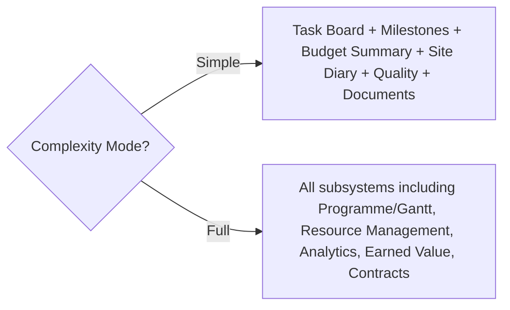

# Design Document: Project Command Centre

## Overview

The Project Command Centre is a unified project management workspace within Architex OS that consolidates programme management, task coordination, commercial control, quality tracking, risk management, and AI-guided workflows into a single integrated tool. It serves as the operational nerve centre for construction project delivery, connecting all existing platform modules (SpecForge, Project Passport, Compliance Hub, Finance Module, Site Execution, Document Intelligence, AI Agents) through a consistent, role-aware interface.

### Design Goals

1. **Unified workspace** — Single entry point for all project management activities, eliminating context switching between disparate tools
2. **Deep integration** — Bidirectional data flow with all existing Architex OS modules via established service contracts
3. **Scalable complexity** — Two modes (Simple / Full) adapting the interface to project size without data loss
4. **Role-aware scoping** — Each of the 17 platform roles sees only relevant subsystems and data
5. **Real-time collaboration** — Firestore real-time listeners with optimistic UI for multi-user synchronisation
6. **South African context** — JBCC/NEC contract forms, NHBRC inspections, B-BBEE procurement, SACAP work stages
7. **AI-augmented decisions** — Gemini-powered recommendations surfaced contextually across all subsystems

### Key Constraints

- Renders inside the Architex OS shell (no standalone routing or chrome)
- All data persists to Firestore under `projects/{projectId}/command_centre/{subcollection}`
- Writes back to Project Passport for every significant state change
- Uses existing service layer where available (programmeService, snagService, dailyLogService, etc.)
- Must not break existing tool integrations (Architecture Rule 3)

---

## Architecture

### High-Level Architecture

```mermaid
graph TB
    subgraph "Architex OS Shell"
        Header[OS Header + Breadcrumb]
        Nav[Primary Navigation]
        Content[Content Area]
    end

    subgraph "Command Centre Module"
        CC[ProjectCommandCentre Component]
        Sidebar[Tool Sidebar Navigation]
        
        subgraph "Subsystem Views"
            Dashboard[Dashboard]
            Programme[Programme/Gantt]
            Tasks[Task Board]
            Milestones[Milestones]
            Budget[Budget Controller]
            Risks[Risk Register]
            Quality[Quality Tracker]
            Team[Resource Manager]
            Diary[Site Diary]
            RFIs[RFI Manager]
            Valuations[Valuation Manager]
            Procurement[Procurement Tracker]
            Contracts[Contract Register]
            Documents[Document Register]
            AI[AI Advisor]
            Calendar[Calendar View]
            Analytics[Analytics/KPIs]
            Actions[Action Centre]
            Settings[Settings]
        end
    end

    subgraph "Service Layer"
        CCS[commandCentreService]
        PS[programmeService]
        TS[taskBoardService]
        BS[budgetService]
        RS[riskRegisterService]
        QS[qualityTrackerService]
        RMS[resourceManagerService]
        DLS[dailyLogService]
        RFIS[rfiService / siteInstructionService]
        VS[valuationService]
        PRS[procurementWorkflowService]
        CRS[contractRegisterService]
        AIS[aiAdvisorService]
    end

    subgraph "Platform Integration"
        PP[Project Passport]
        SF[SpecForge]
        CH[Compliance Hub]
        FM[Finance Module]
        DI[Document Intelligence]
        AC[Action Centre / Inbox]
        GA[Gemini AI Agents]
    end

    subgraph "Persistence"
        FS[(Firestore)]
    end

    Content --> CC
    CC --> Sidebar
    Sidebar --> Dashboard & Programme & Tasks & Milestones & Budget & Risks & Quality & Team & Diary & RFIs & Valuations & Procurement & Contracts & Documents & AI & Calendar & Analytics & Actions & Settings

    Dashboard --> CCS
    Programme --> PS
    Tasks --> TS
    Budget --> BS
    Risks --> RS
    Quality --> QS
    Team --> RMS
    Diary --> DLS
    RFIs --> RFIS
    Valuations --> VS
    Procurement --> PRS
    Contracts --> CRS
    AI --> AIS

    CCS --> PP & SF & AC
    BS --> FM & PP
    QS --> SF
    VS --> FM
    AIS --> GA
    RS --> PP
    Programme --> SF

    CCS & PS & TS & BS & RS & QS & RMS & DLS & RFIS & VS & PRS & CRS --> FS
```



### Data Flow Patterns

1. **User action → Service → Firestore → Real-time listener → UI update**
2. **Service mutation → Audit trail write → Project Passport writeback → Action Centre event**
3. **AI Agent polling → Data aggregation → Recommendation generation → AI Advisor panel**
4. **Cross-module event → Integration adapter → Target service → UI notification**

### Complexity Mode Gating



---

## Components and Interfaces

### Component Hierarchy

```
ProjectCommandCentre (root)
├── CommandCentreSidebar (tool navigation)
├── CommandCentreHeader (project context, sync badges)
├── Views/
│   ├── DashboardView
│   │   ├── StatCardGrid (progress, budget, actions, RFIs)
│   │   ├── LifecycleBar
│   │   ├── AIRecommendationsPanel
│   │   └── UpcomingMilestonesList
│   ├── ProgrammeView
│   │   ├── GanttChart (activities, dependencies, critical path)
│   │   ├── ActivityForm (create/edit dialog)
│   │   └── CriticalPathIndicator
│   ├── TaskBoardView
│   │   ├── KanbanBoard (4 columns)
│   │   ├── TaskCard
│   │   ├── TaskCreateDialog
│   │   └── TaskFilters
│   ├── MilestoneView
│   │   ├── MilestoneTable
│   │   └── MilestoneCreateDialog
│   ├── BudgetView
│   │   ├── BudgetStatCards
│   │   ├── CostBreakdownTable
│   │   └── VariationForm
│   ├── RiskView
│   │   ├── RiskStatCards
│   │   ├── RiskTable
│   │   └── RiskCreateDialog
│   ├── QualityView
│   │   ├── QualityStatCards
│   │   ├── SnagTable
│   │   └── SnagCreateDialog
│   ├── TeamView
│   │   ├── TeamStatCards
│   │   ├── TeamRegisterTable
│   │   └── CapacityChart
│   ├── SiteDiaryView
│   │   ├── DiaryEntryForm
│   │   └── DiaryEntryList
│   ├── RFIView
│   │   ├── RFITable
│   │   ├── RFICreateDialog
│   │   └── SiteInstructionTable
│   ├── ValuationView
│   │   ├── CertificateTable
│   │   └── CertificateCreateDialog
│   ├── ProcurementView
│   │   ├── OrderTable
│   │   ├── OrderCreateDialog
│   │   └── BidComparisonPanel
│   ├── ContractView
│   │   ├── ContractTable
│   │   └── ContractCreateDialog
│   ├── DocumentView
│   │   └── DocumentRegisterTable
│   ├── AIAdvisorView
│   │   └── RecommendationCardList
│   ├── CalendarView
│   │   └── UnifiedCalendar
│   ├── AnalyticsView
│   │   ├── KPIStatCards
│   │   └── KPITable
│   ├── ActionCentreView
│   │   ├── ActionTable
│   │   └── NotificationFeed
│   └── SettingsView
│       ├── ProjectDetailsForm
│       ├── IntegrationStatusGrid
│       └── ComplexityModeToggle
```

### Core Component Props

```typescript
interface ProjectCommandCentreProps {
  user: UserProfile;
  projectId: string;
}

interface CommandCentreSidebarProps {
  activeView: CommandCentreView;
  onNavigate: (view: CommandCentreView) => void;
  complexityMode: ComplexityMode;
  userRole: UserRole;
}

type CommandCentreView =
  | 'dashboard' | 'programme' | 'tasks' | 'milestones' | 'calendar'
  | 'team' | 'site-diary' | 'rfis' | 'issues' | 'quality'
  | 'budget' | 'valuations' | 'procurement' | 'contracts'
  | 'analytics' | 'ai-advisor' | 'documents' | 'settings'
  | 'actions' | 'notifications';

type ComplexityMode = 'simple' | 'full';
```

### Service Interfaces

```typescript
// ── Command Centre Core Service ──────────────────────────────────────────

interface CommandCentreConfig {
  projectId: string;
  complexityMode: ComplexityMode;
  contractValue: number;
  projectType: string;
  integrations: IntegrationStatus[];
}

interface IntegrationStatus {
  module: 'specforge' | 'project_passport' | 'document_intelligence' | 'payment_gateway';
  connected: boolean;
  lastSyncAt?: string;
}

// ── Task Board Service ───────────────────────────────────────────────────

interface TaskBoardItem {
  id: string;
  projectId: string;
  title: string;
  description?: string;
  status: 'todo' | 'in_progress' | 'in_review' | 'done';
  assigneeId: string;
  assigneeName: string;
  priority: 'low' | 'medium' | 'high' | 'critical';
  dueDate: string;
  linkedSpecForgeItemId?: string;
  linkedActivityId?: string;
  linkedProcurementOrderId?: string;
  createdBy: string;
  createdAt: string;
  updatedAt: string;
}

// ── Budget Controller Service ────────────────────────────────────────────

interface BudgetPackage {
  id: string;
  projectId: string;
  name: string;
  budgetAmount: number;
  committedAmount: number;
  spentAmount: number;
  progressPercent: number;
  variance: number;  // (spent - budget) / budget * 100
  isOverBudget: boolean;
}

interface BudgetSummary {
  contractSum: number;
  approvedVariations: number;
  spentToDate: number;
  forecastAtCompletion: number;
  costVariancePercent: number;
}

// ── Risk Register Service ────────────────────────────────────────────────

type RiskCategory = 'supply_chain' | 'resource' | 'quality' | 'compliance' | 'commercial' | 'safety';
type RiskSeverity = 'critical' | 'high' | 'medium' | 'low';
type RiskStatus = 'open' | 'mitigating' | 'escalated' | 'monitoring' | 'closed';

interface RiskItem {
  id: string;
  projectId: string;
  description: string;
  category: RiskCategory;
  severity: RiskSeverity;
  status: RiskStatus;
  ownerId: string;
  ownerName: string;
  mitigationPlan?: string;
  createdBy: string;
  createdAt: string;
  updatedAt: string;
  aiGenerated?: boolean;
}

// ── Valuation Service ────────────────────────────────────────────────────

type CertificateStatus = 'draft' | 'awaiting_signature' | 'certified' | 'paid';

interface PaymentCertificate {
  id: string;
  projectId: string;
  certificateNumber: number;
  period: string;
  grossValue: number;
  retentionAmount: number;
  retentionPercent: number;
  netCertifiedAmount: number;
  status: CertificateStatus;
  linkedMilestoneId?: string;
  createdBy: string;
  createdAt: string;
  updatedAt: string;
}

// ── Contract Register Service ────────────────────────────────────────────

type ContractForm = 'jbcc_pba' | 'jbcc_ns' | 'jbcc_mwa' | 'nec_ecc' | 'nec_psc' | 'nec_tsc' | 'custom';
type ContractStatus = 'active' | 'expired' | 'terminated' | 'pending';

interface ContractItem {
  id: string;
  projectId: string;
  reference: string;
  contractorSupplier: string;
  scope: string;
  value: number;
  form: ContractForm;
  startDate: string;
  expiryDate: string;
  status: ContractStatus;
  linkedProcurementOrderIds?: string[];
  linkedCertificateIds?: string[];
  createdBy: string;
  createdAt: string;
  updatedAt: string;
}

// ── Procurement Service ──────────────────────────────────────────────────

type ProcurementStatus = 'ordered' | 'in_transit' | 'delivered' | 'evaluating';

interface ProcurementOrder {
  id: string;
  projectId: string;
  orderNumber: string;
  description: string;
  supplierId: string;
  supplierName: string;
  value: number;
  expectedDeliveryDate: string;
  status: ProcurementStatus;
  bbbeeLevel?: number;
  linkedSpecForgeItemId?: string;
  createdBy: string;
  createdAt: string;
  updatedAt: string;
}

// ── AI Advisor Service ───────────────────────────────────────────────────

type RecommendationCategory = 'schedule_optimisation' | 'risk_detection' | 'cost_savings' | 'compliance_alert' | 'supply_chain_risk';

interface AIRecommendation {
  id: string;
  projectId: string;
  category: RecommendationCategory;
  title: string;
  explanation: string;
  suggestedActions: SuggestedAction[];
  status: 'pending' | 'accepted' | 'dismissed';
  createdAt: string;
}

type SuggestedAction = 
  | { type: 'create_task'; payload: Partial<TaskBoardItem> }
  | { type: 'create_risk'; payload: Partial<RiskItem> }
  | { type: 'send_notification'; payload: { recipientId: string; message: string } }
  | { type: 'update_programme'; payload: { activityId: string; change: Record<string, unknown> } }
  | { type: 'alert_procurement'; payload: { orderId: string; message: string } }
  | { type: 'create_action'; payload: { title: string; assigneeId: string; dueDate: string } };
```

### Role-View Matrix

| Role | Views Available |
|------|----------------|
| `client` | Dashboard, Milestones, Budget (summary only), Documents, Notifications |
| `architect` / `bep` | All views |
| `site_manager` | Dashboard, Programme, Tasks, Site Diary, RFIs, Quality, Team |
| `quantity_surveyor` | Dashboard, Budget, Valuations, Procurement, Contracts, Milestones, Analytics |
| `contractor` / `subcontractor` | Dashboard, Tasks, Programme (read-only), Site Diary, RFIs, Quality, Procurement (own) |
| `supplier` | Procurement (own orders/RFQs), Documents (relevant) |
| `engineer` | Dashboard, Programme, Tasks, RFIs, Quality, Documents |

---

## Data Models

### Firestore Collection Structure

```
projects/{projectId}/
├── command_centre_config/        # Single doc: complexity mode, integrations
│   └── settings
├── tasks/                        # Task board items (existing programmeService)
├── milestones/                   # Milestone records (existing programmeService)
├── phases/                       # Programme phases/activities (existing)
├── budget_packages/              # Cost breakdown by work package
├── variations/                   # Budget variation records
├── risks/                        # Risk register items
├── snags/                        # Quality/snag items (existing snagService)
├── site_logs/                    # Site diary entries (existing dailyLogService)
├── rfis/                         # RFI records (existing siteExecution)
├── site_instructions/            # Site instruction records (existing)
├── payment_certificates/         # Valuation records
├── procurement_orders/           # Purchase orders and RFQs
├── contracts/                    # Contract register items
├── ai_recommendations/           # AI-generated recommendations
├── calendar_events/              # Aggregated calendar entries
├── audit_trail/                  # Immutable audit log
└── notifications/                # Project notification feed
```

### Key Data Types (TypeScript)

```typescript
// ── Audit Trail ──────────────────────────────────────────────────────────

interface AuditEntry {
  id: string;
  projectId: string;
  actorId: string;
  actorName: string;
  actionType: 'create' | 'update' | 'delete' | 'status_change' | 'escalation';
  entityType: string;  // e.g. 'task', 'milestone', 'risk', 'certificate'
  entityId: string;
  before?: Record<string, unknown>;
  after?: Record<string, unknown>;
  timestamp: string;
}

// ── Calendar Event (aggregated) ──────────────────────────────────────────

interface CalendarEvent {
  id: string;
  projectId: string;
  date: string;
  title: string;
  type: 'milestone' | 'inspection' | 'delivery' | 'meeting' | 'task_due';
  sourceEntityType: string;
  sourceEntityId: string;
  status?: string;
}

// ── Milestone (extended) ─────────────────────────────────────────────────

interface CommandCentreMilestone {
  id: string;
  projectId: string;
  name: string;
  plannedDate: string;
  actualDate?: string;
  status: 'complete' | 'on_track' | 'at_risk' | 'overdue' | 'pending';
  linkedCertificateId?: string;
  linkedActivityId?: string;
  category?: 'general' | 'nhbrc_inspection' | 'municipal_submission';
  nhbrcStage?: number;  // 1-7 for NHBRC inspections
  documentationChecklist?: string[];
  createdBy: string;
  createdAt: string;
  updatedAt: string;
}

// ── B-BBEE Procurement Scoring ───────────────────────────────────────────

interface BBBEEProcurementSummary {
  totalProcurementValue: number;
  bbbeeProcurementValue: number;
  bbbeePercent: number;
  supplierBreakdown: Array<{
    supplierId: string;
    supplierName: string;
    bbbeeLevel: number;
    orderValue: number;
  }>;
}
```

### Integration Data Contracts

```typescript
// ── Project Passport Writeback ───────────────────────────────────────────

interface PassportWriteback {
  source: 'command_centre';
  projectId: string;
  updates: {
    scheduleHealth?: 'on_track' | 'at_risk' | 'delayed';
    financialHealth?: 'healthy' | 'at_risk' | 'over_budget';
    riskProfile?: { level: Priority; openCount: number; criticalCount: number };
    milestoneProgress?: { total: number; completed: number; overdue: number };
    qualityScore?: number;  // snag resolution rate %
  };
  timestamp: string;
}

// ── SpecForge Link ───────────────────────────────────────────────────────

interface SpecForgeLink {
  specForgeItemId: string;
  itemTitle: string;
  itemStatus: string;
  linkedEntityType: 'task' | 'procurement_order' | 'activity';
  linkedEntityId: string;
}

// ── Action Centre Event ──────────────────────────────────────────────────

interface CommandCentreAction {
  id: string;
  projectId: string;
  type: 'approval' | 'technical' | 'financial' | 'design' | 'planning';
  title: string;
  description: string;
  assigneeId: string;
  dueDate: string;
  priority: Priority;
  sourceSubsystem: string;
  sourceEntityId: string;
  status: 'pending' | 'completed' | 'overdue';
  createdAt: string;
}
```

---


## Correctness Properties

*A property is a characteristic or behavior that should hold true across all valid executions of a system — essentially, a formal statement about what the system should do. Properties serve as the bridge between human-readable specifications and machine-verifiable correctness guarantees.*

### Property 1: Entity Creation Validation

*For any* subsystem entity type (task, milestone, risk, snag, RFI, procurement order, contract, project) and *for any* input object missing one or more required fields, the creation function SHALL reject the input and return a validation error without persisting data. Conversely, *for any* input with all required fields populated with valid values, creation SHALL succeed.

**Validates: Requirements 2.2, 3.2, 4.2, 6.2, 7.2, 10.2, 12.2, 13.2, 17.5**

### Property 2: Deadline and Threshold Detection

*For any* entity with a deadline field (task due date, milestone planned date, RFI response period, delivery date, contract expiry date, inspection date), the system SHALL correctly classify the entity as overdue/triggered when the current date exceeds the deadline, and as not-triggered when the deadline has not passed. Specifically: tasks overdue when past due date, milestones overdue when past planned date, RFIs escalated when past contractual response period, deliveries overdue when past expected date, contracts flagged when expiry within 30 days, inspections flagged when due within 7 days.

**Validates: Requirements 3.6, 4.3, 7.6, 10.5, 12.4, 13.4**

### Property 3: Summary Stat Aggregation

*For any* collection of entities (risks, snags, tasks, actions, budget packages), the summary stat computation SHALL produce counts that equal the actual number of entities matching each category. Specifically: risk counts per severity SHALL equal the actual count of risks with that severity; quality stats (open snags, resolved this week, active NCRs) SHALL equal the filtered counts; action centre stats (overdue, due today, upcoming) SHALL equal date-filtered counts; budget stats SHALL equal the sum of component values.

**Validates: Requirements 1.1, 5.1, 6.3, 7.3, 8.2, 22.2**

### Property 4: Budget Variation Recalculation

*For any* contract sum and *for any* set of approved variations (positive or negative values), the adjusted contract sum SHALL equal the original contract sum plus the sum of all variation values, and the forecast at completion SHALL be recalculated accordingly. The invariant `adjustedContractSum = contractSum + sum(variations)` SHALL always hold.

**Validates: Requirements 5.3**

### Property 5: Over-Budget Detection Threshold

*For any* budget package where `(spentAmount - budgetAmount) / budgetAmount > 0.05`, the system SHALL flag the package as over-budget. *For any* package where the ratio is ≤ 0.05, the package SHALL NOT be flagged. The threshold is exactly 5% — no false positives below and no missed detections above.

**Validates: Requirements 5.4**

### Property 6: Payment Certificate Retention Calculation

*For any* gross value and *for any* retention percentage (0-100), the retention amount SHALL equal `grossValue * retentionPercent / 100` and the net certified amount SHALL equal `grossValue - retentionAmount`. The invariant `netCertified + retention = grossValue` SHALL always hold.

**Validates: Requirements 11.2**

### Property 7: B-BBEE Procurement Percentage

*For any* set of procurement orders with supplier B-BBEE levels and order values, the aggregate B-BBEE procurement percentage SHALL equal `sum(values of orders with B-BBEE level ≥ 1) / sum(all order values) * 100`. The per-supplier breakdown SHALL sum to the total procurement value.

**Validates: Requirements 12.5, 25.5**

### Property 8: Task Status Transition Correctness

*For any* task in a given column (To Do, In Progress, In Review, Done) when moved to a different column, the task's persisted status SHALL match the target column name, and an audit entry SHALL be created containing the previous status, new status, timestamp, and actor ID. The task data (title, assignee, priority, due date) SHALL remain unchanged by the move operation.

**Validates: Requirements 3.4**

### Property 9: Task Board Filtering

*For any* list of tasks and *for any* combination of filter criteria (assignee, priority, due date range, linked subsystem), the filtered result SHALL contain exactly those tasks that satisfy ALL active filter conditions. No task matching all criteria SHALL be excluded, and no task failing any criterion SHALL be included.

**Validates: Requirements 3.7**

### Property 10: Role-Based View Access Control

*For any* UserRole and *for any* Command Centre view, the view SHALL be accessible if and only if the role-view matrix permits it. Specifically: `client` sees only [Dashboard, Milestones, Budget summary, Documents, Notifications]; `architect`/`bep` sees all views; `site_manager` sees [Dashboard, Programme, Tasks, Site Diary, RFIs, Quality, Team]; `quantity_surveyor` sees [Dashboard, Budget, Valuations, Procurement, Contracts, Milestones, Analytics]; `contractor`/`subcontractor` sees [Dashboard, Tasks, Programme (read-only), Site Diary, RFIs, Quality, Procurement (own)]; `supplier` sees [Procurement (own), Documents (relevant)]. Any access attempt outside role scope SHALL be denied.

**Validates: Requirements 18.1, 18.2, 18.3, 18.4, 18.5, 18.6, 18.7, 18.8**

### Property 11: Complexity Mode View Gating

*For any* project, when Complexity Mode is Simple, only the views [Task Board, Milestones, Budget summary, Site Diary, Quality/Snags, Documents] SHALL be visible in navigation. When Full, all views SHALL be visible. Toggling from Simple to Full and back SHALL not cause any data loss — all persisted records SHALL remain unchanged. The default mode SHALL be Simple when contract value < R 5,000,000 and Full when ≥ R 5,000,000.

**Validates: Requirements 16.1, 16.2, 16.3, 16.4, 16.5**

### Property 12: Calendar Event Aggregation

*For any* set of milestones, inspection dates, delivery dates, and task due dates in a project, the unified calendar SHALL contain an event for each source item. The total event count SHALL equal the sum of events from all source types, with no duplicates and no omissions. Each event SHALL reference its source entity type and ID.

**Validates: Requirements 23.1, 23.2**

### Property 13: KPI Formula Computation

*For any* set of milestones with planned and actual dates, the schedule variance SHALL equal the computed difference using `(completedOnTime - delayed) / totalWithDates * 100`. *For any* forecast-at-completion and contract sum, the cost variance SHALL equal `(forecast - contractSum) / contractSum * 100`. These formulas SHALL produce deterministic, reproducible results for identical inputs.

**Validates: Requirements 24.1, 24.3, 24.4**

### Property 14: KPI Trend Derivation

*For any* sequence of KPI values over time (at least 2 data points), the trend indicator SHALL be "improving" when the latest value is better than the previous, "deteriorating" when worse, and "stable" when unchanged (within a defined tolerance). The classification SHALL be deterministic for any given pair of consecutive values.

**Validates: Requirements 24.2**

### Property 15: Critical Path Identification

*For any* directed acyclic graph of activities with dependencies (finish-to-start, start-to-start, finish-to-finish, start-to-finish), the critical path algorithm SHALL identify the longest path through the network. Modifying any activity on the critical path's duration SHALL change the project end date, while modifying a non-critical activity within its float SHALL NOT change the project end date.

**Validates: Requirements 2.6**

### Property 16: Audit Trail Recording

*For any* create, update, or delete operation on any Command Centre entity, an audit trail entry SHALL be recorded containing: the actor's userId, a timestamp, the action type, the entity type, the entity ID, and the before/after values (where applicable). The audit trail SHALL be append-only — no audit entry may be modified or deleted after creation.

**Validates: Requirements 28.2**

### Property 17: SACAP Stage Mapping

*For any* Architex OS lifecycle stage, the mapping to the corresponding SACAP Work Stage SHALL be deterministic and bijective within the defined mapping table. The same Architex stage SHALL always produce the same SACAP stage label.

**Validates: Requirements 25.2**

### Property 18: Milestone and Diary Chronological Ordering

*For any* list of milestones or diary entries, the display order SHALL be sorted by date (milestones ascending by due date, diary entries descending by entry date). For any two items A and B where A's date is before B's date, A SHALL appear before B in milestone lists and after B in diary lists. The sort SHALL be stable for items with equal dates.

**Validates: Requirements 1.4, 9.3**

---

## Error Handling

### Strategy

The Command Centre uses a layered error handling approach:

1. **Validation layer** — Zod schemas reject malformed inputs before reaching services
2. **Service layer** — Business logic errors (invalid transitions, permission violations) throw typed errors
3. **Persistence layer** — Firestore errors caught and re-thrown with context
4. **UI layer** — Optimistic updates with rollback on failure, toast notifications

### Error Categories

| Category | Handling | User Feedback |
|----------|----------|---------------|
| Validation error | Reject at form submit | Inline field errors |
| Permission denied | Block action, log attempt | "You don't have permission" toast |
| Network/Firestore error | Retry with backoff (3 attempts) | "Save failed, retrying..." toast |
| Optimistic update failure | Revert UI state to pre-mutation | "Changes could not be saved" toast with retry button |
| Stale data conflict | Refresh from Firestore listener | "Data updated by another user" notification |
| Invalid state transition | Reject mutation, preserve current state | "This action is not available in the current state" |

### Optimistic Update Pattern

```typescript
async function optimisticMutation<T>(
  localUpdate: () => void,
  remoteWrite: () => Promise<T>,
  rollback: () => void,
): Promise<T | void> {
  localUpdate();
  try {
    return await remoteWrite();
  } catch (error) {
    rollback();
    showErrorToast('Changes could not be saved. Please try again.');
    logError(error);
  }
}
```

### Firestore Error Handling

All Firestore operations use the existing `handleFirestoreError` utility from `@/lib/firebase`:

```typescript
try {
  await addDoc(collection, data);
} catch (error) {
  handleFirestoreError(error, OperationType.CREATE, collectionPath);
}
```

### Rate Limiting and Throttling

- Firestore writes are batched when multiple mutations occur within 500ms
- Real-time listener reconnection uses exponential backoff (1s, 2s, 4s, 8s max)
- AI Advisor recommendation generation is throttled to once per 5 minutes per project

### Audit Trail Error Isolation

Audit trail writes MUST NOT block the primary operation. If audit logging fails:
1. The primary operation succeeds
2. The audit failure is logged to console and error monitoring
3. A background retry queue attempts the audit write

---

## Testing Strategy

### Dual Testing Approach

The Command Centre uses both unit tests and property-based tests for comprehensive coverage:

- **Unit tests** (Vitest): Specific examples, edge cases, integration points, UI component rendering
- **Property-based tests** (fast-check via Vitest): Universal properties verified across 100+ generated inputs
- **Integration tests** (Vitest + Firebase emulator): Cross-service data flow, Firestore persistence
- **E2E tests** (Playwright): Critical user journeys through the full Command Centre

### Property-Based Testing Configuration

- Library: `fast-check` (via Vitest)
- Minimum iterations: 100 per property test
- Tag format: `Feature: project-command-centre, Property {number}: {property_text}`
- Each correctness property maps to exactly ONE property-based test

### Test File Organisation

```
src/services/__tests__/
├── commandCentre.validation.property.test.ts    # Property 1
├── commandCentre.deadlines.property.test.ts     # Property 2
├── commandCentre.aggregation.property.test.ts   # Property 3
├── commandCentre.budget.property.test.ts        # Properties 4, 5
├── commandCentre.retention.property.test.ts     # Property 6
├── commandCentre.bbbee.property.test.ts         # Property 7
├── commandCentre.taskTransition.property.test.ts # Property 8
├── commandCentre.filtering.property.test.ts     # Property 9
├── commandCentre.roleAccess.property.test.ts    # Property 10
├── commandCentre.complexityMode.property.test.ts # Property 11
├── commandCentre.calendar.property.test.ts      # Property 12
├── commandCentre.kpi.property.test.ts           # Properties 13, 14
├── commandCentre.criticalPath.property.test.ts  # Property 15
├── commandCentre.audit.property.test.ts         # Property 16
├── commandCentre.sacapMapping.property.test.ts  # Property 17
├── commandCentre.sorting.property.test.ts       # Property 18
└── commandCentre.integration.test.ts            # Integration tests
```

### Unit Test Coverage Targets

| Area | Coverage Target | Focus |
|------|----------------|-------|
| Service layer (pure logic) | 90%+ | Computation, validation, state transitions |
| Integration adapters | 80%+ | Data transformation, writeback correctness |
| React components | 70%+ | Rendering, interaction, role-based visibility |
| UI utilities | 90%+ | Date formatting, status derivation, colour mapping |

### Key Unit Test Scenarios

- Role-view matrix: each of the 17 roles sees exactly the correct set of views
- Task board: drag-and-drop between all column combinations
- Budget: variation scenarios (positive, negative, zero, multiple)
- Risk escalation: state machine transitions
- Snag resolution: state machine transitions (existing tests in snagService)
- Complexity mode: toggle between modes preserves all data
- NHBRC milestones: each stage (1-7) has correct checklist
- Contract forms: JBCC PBA, JBCC N/S, JBCC MWA, NEC ECC, NEC PSC, NEC TSC, custom
- B-BBEE scoring: edge cases (zero orders, all same level, mixed levels)

### Integration Test Scenarios

- Project Passport writeback on milestone completion
- SpecForge link creation and status sync
- Action Centre event generation from all subsystems
- Finance Module payment workflow trigger on certificate certification
- Compliance Hub registration on NHBRC milestone creation
- Real-time listener propagation across multiple clients
- Audit trail immutability (no update/delete operations succeed)

### E2E Test Journeys

1. Create project → configure settings → switch complexity mode
2. Add task → move through Kanban columns → verify audit
3. Create milestone → link to certificate → mark complete → verify Passport update
4. Add budget packages → record expenditure → trigger over-budget alert
5. Create risk → escalate → verify Action Centre notification
6. Site diary entry → mentions delay → verify Programme correlation
7. Role switching: verify each role sees only permitted content

### Test Infrastructure

- Vitest configuration in `vitest.config.ts` with `fast-check` integration
- Firebase emulator for integration tests (Firestore rules validation)
- Mock Gemini responses for AI Advisor tests
- Demo seed data available for realistic test scenarios via `src/demo-seed/`
- Existing test setup in `src/test/setup.ts` handles Firebase + Vercel Blob mocks
