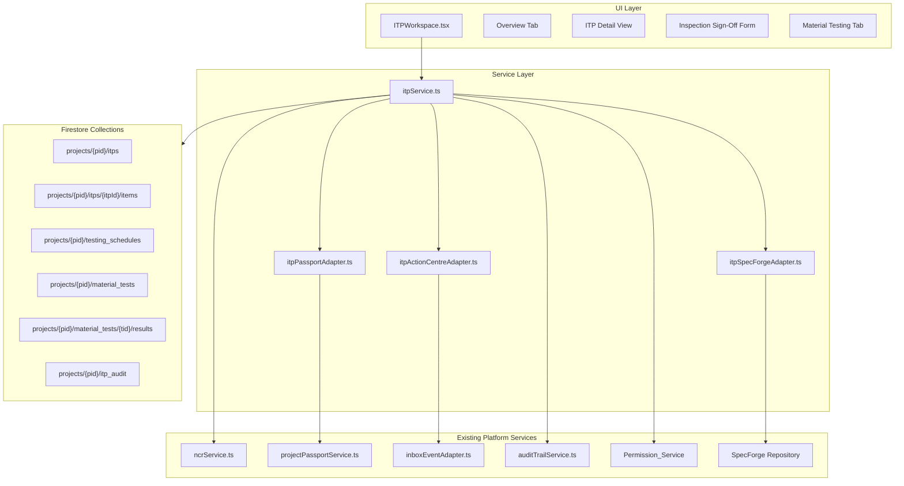
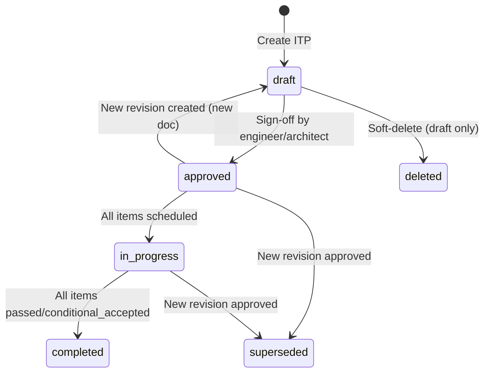
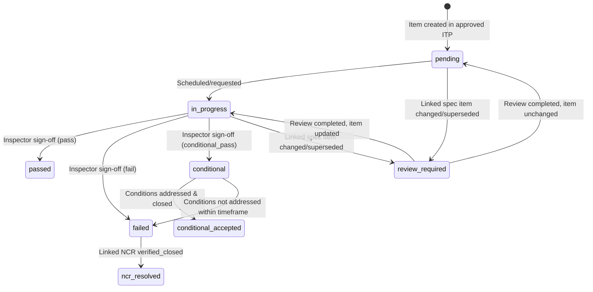
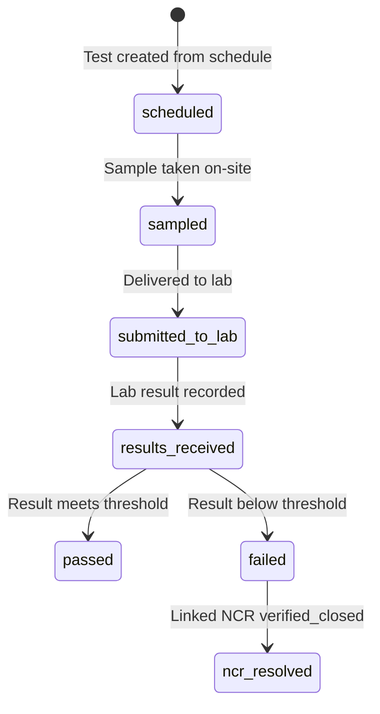

# Design Document: QA/QC & Inspection Test Plans

## Overview

The QA/QC & Inspection Test Plans (ITP) module is a new sub-tool within Module 7 (Site Execution) of the Architex Built Environment OS. It provides structured quality assurance governance during active construction by:

- Defining inspection checkpoints (hold points, witness points, surveillance) within structured test plans
- Enforcing mandatory hold points where work must stop until inspector sign-off
- Managing SANS 3001 material testing schedules with lab result integration
- Automatically linking failures to the existing NCR system
- Contributing quality metrics (Compliance Score) to the Project Passport
- Surfacing all pending actions to the Action Centre inbox

The module integrates deeply with the platform spine: NCR Manager, Project Passport, Action Centre, SpecForge, Permission Service, and Audit Trail.

## Architecture

### High-Level Data Flow



### State Machines

#### ITP Lifecycle



#### Inspection Item Lifecycle



#### Material Test Lifecycle



## Components and Interfaces

### Service Layer (`src/services/itpService.ts`)

The primary service module containing all ITP business logic. Pure functions where possible, Firestore operations for persistence.

```typescript
// Core ITP CRUD
createITP(input: CreateITPInput): Promise<string>
getITP(projectId: string, itpId: string): Promise<ITP>
getITPs(projectId: string, filters?: ITPFilters): Promise<ITP[]>
updateITP(projectId: string, itpId: string, updates: Partial<ITPDraft>): Promise<void>
deleteITP(projectId: string, itpId: string): Promise<void>
approveITP(projectId: string, itpId: string, signOff: SignOffInput): Promise<void>
createRevision(projectId: string, itpId: string, userId: string): Promise<string>

// Inspection Items
addInspectionItem(projectId: string, itpId: string, item: CreateInspectionItemInput): Promise<string>
updateInspectionItem(projectId: string, itpId: string, itemId: string, updates: UpdateInspectionItemInput): Promise<void>
removeInspectionItem(projectId: string, itpId: string, itemId: string): Promise<void>
reorderInspectionItems(projectId: string, itpId: string, newOrder: string[]): Promise<void>

// Hold Point Execution
requestHoldPointInspection(input: HoldPointRequestInput): Promise<string>
signOffInspection(input: InspectionSignOffInput): Promise<void>

// Witness Point Execution
recordWitnessPointOutcome(input: WitnessPointOutcomeInput): Promise<void>
acknowledgeWitnessNotification(input: AcknowledgeInput): Promise<void>

// Material Testing
createTestingSchedule(input: CreateTestingScheduleInput): Promise<string>
updateTestingSchedule(projectId: string, scheduleId: string, updates: UpdateTestingScheduleInput): Promise<void>
createMaterialTest(input: CreateMaterialTestInput): Promise<string>
updateMaterialTestStatus(projectId: string, testId: string, status: MaterialTestStatus): Promise<void>
recordLabResult(input: RecordLabResultInput): Promise<void>

// Compliance & Metrics
calculateComplianceScore(projectId: string): Promise<ComplianceScore>
getQualitySummary(projectId: string): Promise<QualitySummary>
generateComplianceReport(projectId: string, itpId: string): Promise<ComplianceReport>

// NCR Integration
handleNCRClosed(projectId: string, ncrId: string): Promise<void>
```

### Adapter Services

**`src/services/itpActionCentreAdapter.ts`** — Maps ITP events to `WorkflowEvent` records:
```typescript
createHoldPointRequestEvent(params: HoldPointEventParams): WorkflowEvent
createWitnessNotificationEvent(params: WitnessEventParams): WorkflowEvent
createTestOverdueEvent(params: TestOverdueParams): WorkflowEvent
createHoldPointBreachEvent(params: BreachEventParams): WorkflowEvent
createTestFailureEvent(params: TestFailureParams): WorkflowEvent
createConditionalFollowUpEvent(params: ConditionalParams): WorkflowEvent
resolveActionItem(projectId: string, eventId: string): Promise<void>
```

**`src/services/itpPassportAdapter.ts`** — Contributes quality data to Project Passport:
```typescript
buildITPPassportData(projectId: string): Promise<ITPPassportContribution>
emitComplianceRiskSignal(projectId: string, score: number, previousScore: number): ProjectRiskSignal | null
mapITPToProjectRecord(itp: ITP): ProjectRecord
```

**`src/services/itpSpecForgeAdapter.ts`** — Bidirectional SpecForge linking:
```typescript
linkInspectionToSpecItem(projectId: string, itemId: string, specItemId: string): Promise<void>
unlinkInspectionFromSpecItem(projectId: string, itemId: string, specItemId: string): Promise<void>
getInspectionVerificationStatus(specItemId: string): Promise<VerificationStatus>
suggestSpecItemLinks(projectId: string, constructionStage: string): Promise<SpecItemSuggestion[]>
handleSpecItemChanged(projectId: string, specItemId: string, changedField: string): Promise<void>
```

### UI Components (`src/components/itp/`)

Following the workspace template pattern:

| Component | Purpose |
|-----------|---------|
| `ITPWorkspace.tsx` | Main workspace: Header Card → Project Toggles → Tabs → Content |
| `ITPOverviewTab.tsx` | Stat cards (total ITPs, compliance score, open NCRs, pending tests) + ITP list table |
| `ITPDetailView.tsx` | Single ITP view: metadata, inspection items list, progress bar |
| `InspectionItemsTable.tsx` | Ordered list of inspection items with status badges and actions |
| `HoldPointSignOffForm.tsx` | Inspector sign-off dialog (pass/fail/conditional + observations) |
| `WitnessPointRecordForm.tsx` | Witness point outcome recording (with/without inspector) |
| `TestingScheduleTab.tsx` | Material testing schedules management |
| `MaterialTestList.tsx` | List of material tests with status, due dates, overdue flags |
| `LabResultForm.tsx` | Record lab result with auto-threshold evaluation |
| `CreateITPDialog.tsx` | Multi-step ITP creation form |
| `AddInspectionItemDialog.tsx` | Form for adding/editing inspection items |
| `ComplianceReportView.tsx` | Generated compliance report viewer |

### API Endpoints (`src/lib/api-router.ts` additions)

```
POST   /api/projects/:projectId/itps                          Create ITP
GET    /api/projects/:projectId/itps                          List ITPs (with filters)
GET    /api/projects/:projectId/itps/:itpId                   Get single ITP with items
PUT    /api/projects/:projectId/itps/:itpId                   Update ITP (draft only)
DELETE /api/projects/:projectId/itps/:itpId                   Soft-delete ITP (draft only)
POST   /api/projects/:projectId/itps/:itpId/approve           Approve ITP
POST   /api/projects/:projectId/itps/:itpId/revise            Create new revision

POST   /api/projects/:projectId/itps/:itpId/items             Add inspection item
PUT    /api/projects/:projectId/itps/:itpId/items/:itemId      Update inspection item
DELETE /api/projects/:projectId/itps/:itpId/items/:itemId      Remove inspection item
POST   /api/projects/:projectId/itps/:itpId/items/reorder     Reorder items

POST   /api/projects/:projectId/inspections/request           Request hold point inspection
POST   /api/projects/:projectId/inspections/:itemId/sign-off  Inspector sign-off
POST   /api/projects/:projectId/inspections/:itemId/record    Record witness point outcome
POST   /api/projects/:projectId/inspections/:itemId/acknowledge Acknowledge witness notification

POST   /api/projects/:projectId/testing-schedules             Create testing schedule
PUT    /api/projects/:projectId/testing-schedules/:scheduleId Update testing schedule
GET    /api/projects/:projectId/testing-schedules             List testing schedules

POST   /api/projects/:projectId/material-tests                Create material test
PUT    /api/projects/:projectId/material-tests/:testId/status Update test status
POST   /api/projects/:projectId/material-tests/:testId/result Record lab result
GET    /api/projects/:projectId/material-tests                List material tests

GET    /api/projects/:projectId/itp/compliance-score          Get compliance score
GET    /api/projects/:projectId/itp/quality-summary           Get quality summary for passport
GET    /api/projects/:projectId/itps/:itpId/compliance-report Generate compliance report
```

All endpoints validate permissions via `Permission_Service` before processing. Returns `403` with missing permission identifier on failure.

## Data Models

### Firestore Collection Structure

```
projects/{projectId}/
├── itps/{itpId}                          # ITP document
│   └── items/{itemId}                    # Inspection items (subcollection)
├── testing_schedules/{scheduleId}        # Material testing schedules
├── material_tests/{testId}               # Individual material tests
│   └── results/{resultId}                # Lab results (subcollection)
├── itp_audit/{auditId}                   # ITP-specific audit trail
├── inspection_requests/{requestId}       # Hold point inspection requests
└── ncrs/{ncrId}                          # Existing NCR collection (linked)
```

### TypeScript Interfaces

```typescript
// ── ITP Core Types ──────────────────────────────────────────────────────────

export type ITPStatus = 'draft' | 'approved' | 'in_progress' | 'completed' | 'superseded' | 'deleted';

export type InspectionType = 'hold_point' | 'witness_point' | 'surveillance';

export type InspectionItemStatus =
  | 'pending'
  | 'in_progress'
  | 'passed'
  | 'failed'
  | 'conditional'
  | 'conditional_accepted'
  | 'ncr_resolved'
  | 'review_required';

export type InspectorRole = 'engineer' | 'architect' | 'site_manager';

export type ConstructionStage =
  | 'site_establishment'
  | 'earthworks'
  | 'foundations'
  | 'substructure'
  | 'superstructure'
  | 'roof'
  | 'external_envelope'
  | 'internal_finishes'
  | 'mechanical_electrical'
  | 'external_works'
  | 'commissioning';

export interface ITP {
  id: string;
  projectId: string;
  title: string;                          // max 200 chars
  description: string;                    // max 2000 chars
  constructionStage: ConstructionStage;
  revisionNumber: number;                 // starts at 1
  status: ITPStatus;
  createdBy: string;                      // user ID
  approvedBy?: string;                    // user ID
  approvedAt?: string;                    // ISO timestamp
  approvalSignOff?: SignOffRecord;
  previousRevisionId?: string;            // link to superseded revision
  nextRevisionId?: string;                // link to newer revision
  completedAt?: string;
  createdAt: string;
  updatedAt: string;
  isDeleted: boolean;
}
```

```typescript
export interface InspectionItem {
  id: string;
  itpId: string;
  projectId: string;
  sequenceNumber: number;                 // contiguous from 1
  title: string;                          // 1–200 chars
  description: string;                    // 1–2000 chars
  inspectionType: InspectionType;
  acceptanceCriteria: string;             // 1–2000 chars
  responsibleInspectorRole: InspectorRole;
  specificationReference: string;         // 1–500 chars (SANS/NHBRC/project-specific)
  specificationCategory?: string;         // e.g. 'structural', 'fire_safety', 'geotechnical'
  linkedMaterialTestIds: string[];        // 0–20 refs to testing_schedule items
  linkedSpecItemId?: string;              // SpecForge spec item ID (bidirectional)
  status: InspectionItemStatus;
  signOffRecord?: SignOffRecord;
  selfInspectionRecord?: SelfInspectionRecord;
  witnessAttendance?: WitnessAttendanceRecord;
  conditionalFollowUp?: ConditionalFollowUp;
  ncrId?: string;                         // linked NCR if failed
  conditionsClosedAt?: string;            // when conditional conditions met
  createdAt: string;
  updatedAt: string;
}

export interface SignOffRecord {
  inspectorUserId: string;
  inspectorRole: InspectorRole;
  professionalRegistration?: string;      // ECSA/SACAP/NHBRC number or 'not_available'
  outcome: 'pass' | 'fail' | 'conditional_pass';
  conditions?: string;                    // max 2000 chars (for conditional)
  conditionsDeadlineDays?: number;        // 1–30 business days
  observations?: string;
  timestamp: string;
  inspectionItemId: string;
  itpRevisionNumber: number;
}

export interface SelfInspectionRecord {
  recordedByUserId: string;
  outcome: 'pass' | 'fail' | 'conditional_pass';
  observations?: string;
  timestamp: string;
}

export interface WitnessAttendanceRecord {
  notificationSentAt: string;
  inspectorResponse: 'acknowledged' | 'no_response';
  responseTimestamp?: string;
  attendance: 'attended' | 'not_attended';
  finalSignOffBy: 'inspector_witnessed' | 'contractor_recorded';
}

export interface ConditionalFollowUp {
  actionId: string;                       // Action Centre item ID
  deadlineDate: string;                   // ISO date
  deadlineDays: number;
  status: 'open' | 'resolved' | 'expired';
  resolvedAt?: string;
  expiredAt?: string;
}
```

```typescript
// ── Material Testing Types ──────────────────────────────────────────────────

export type MaterialType = 'concrete' | 'soil' | 'steel' | 'aggregate' | 'bituminous';

export type ThresholdDirection = 'gte' | 'lte';  // greater-than-or-equal / less-than-or-equal

export type MaterialTestStatus =
  | 'scheduled'
  | 'sampled'
  | 'submitted_to_lab'
  | 'results_received'
  | 'passed'
  | 'failed'
  | 'ncr_resolved';

export type SANSTestCategory =
  | 'concrete_7day'
  | 'concrete_28day'
  | 'soil_compaction'
  | 'steel_tensile'
  | 'aggregate_grading'
  | 'bituminous_binder';

export interface TestingSchedule {
  id: string;
  projectId: string;
  materialType: MaterialType;
  sansTestMethodReference: string;        // e.g. "SANS 3001-GR1"
  testCategory: SANSTestCategory;
  testFrequencyRatio: number;             // e.g. 1 (test per N units)
  testFrequencyQuantity: number;          // e.g. 50 (per 50m³)
  unitOfMeasure: string;                  // e.g. "m³", "m²", "tonnes"
  minSamplesPerTest: number;              // 1–10
  acceptanceThreshold: number;            // numeric value
  thresholdUnit: string;                  // e.g. "MPa", "%", "kN"
  thresholdDirection: ThresholdDirection;  // gte = min threshold, lte = max threshold
  expectedTurnaroundDays: number;         // default 7 or 28 for concrete, max 90
  constructionStage: ConstructionStage;
  approvedLaboratories: ApprovedLaboratory[];
  createdBy: string;
  createdAt: string;
  updatedAt: string;
}

export interface ApprovedLaboratory {
  name: string;
  sanasAccreditationNumber: string;
  accreditedTestMethods: string[];        // SANS test method refs this lab is accredited for
  isActive: boolean;
}

export interface MaterialTest {
  id: string;
  projectId: string;
  testingScheduleId: string;
  sampleId: string;                       // sample identification number
  materialType: MaterialType;
  testCategory: SANSTestCategory;
  sansTestMethodReference: string;
  dateSampled: string;                    // ISO date
  dateTestDue: string;                    // calculated: dateSampled + turnaroundDays
  testingLaboratoryName: string;
  status: MaterialTestStatus;
  linkedInspectionItemIds: string[];      // inspection items that reference this test
  ncrId?: string;                         // linked NCR if failed
  isPriority: boolean;                    // flagged if 7-day concrete fails
  createdBy: string;
  createdAt: string;
  updatedAt: string;
}
```

```typescript
export interface LabResult {
  id: string;
  materialTestId: string;
  projectId: string;
  testDate: string;                       // ISO date
  resultValue: number;                    // 0.00–999,999,999.99
  resultUnit: string;                     // must match TestingSchedule.thresholdUnit
  testingLaboratoryName: string;          // max 200 chars
  labReportReference: string;             // max 50 chars (unique per material test)
  passFail: 'pass' | 'fail';             // auto-determined by threshold comparison
  recordedBy: string;                     // user ID
  attachmentUrl?: string;                 // Vercel Blob URL for lab certificate
  attachmentFileName?: string;
  createdAt: string;
}

// ── Inspection Request Types ────────────────────────────────────────────────

export interface InspectionRequest {
  id: string;
  projectId: string;
  inspectionItemId: string;
  itpId: string;
  requestedBy: string;                    // user ID
  requestedInspectionDate: string;        // ISO datetime (must be ≥24h future)
  status: 'pending' | 'signed_off' | 'breached';
  createdAt: string;
}

// ── Audit Types ─────────────────────────────────────────────────────────────

export type ITPAuditAction =
  | 'itp_created' | 'itp_updated' | 'itp_approved' | 'itp_revised'
  | 'itp_completed' | 'itp_deleted'
  | 'item_added' | 'item_updated' | 'item_removed' | 'items_reordered'
  | 'inspection_requested' | 'inspection_signed_off' | 'inspection_self_recorded'
  | 'hold_point_breached' | 'conditional_expired'
  | 'witness_notified' | 'witness_acknowledged' | 'witness_no_response'
  | 'test_schedule_created' | 'test_schedule_updated'
  | 'material_test_created' | 'material_test_status_changed'
  | 'lab_result_recorded'
  | 'ncr_created' | 'ncr_resolved'
  | 'spec_item_linked' | 'spec_item_unlinked' | 'spec_item_changed';

export interface ITPAuditRecord {
  id: string;
  projectId: string;
  entityType: 'itp' | 'inspection_item' | 'material_test' | 'testing_schedule' | 'lab_result';
  entityId: string;
  action: ITPAuditAction;
  actorUserId: string;
  timestamp: string;
  previousState: Record<string, unknown>;
  newState: Record<string, unknown>;
  metadata?: Record<string, unknown>;     // max 10KB
}

// ── Passport Contribution Types ─────────────────────────────────────────────

export interface QualitySummary {
  totalITPs: number;
  itpsByStatus: Record<ITPStatus, number>;
  complianceScore: number | null;         // null if data unavailable
  complianceScoreUnavailable: boolean;
  openHoldPointBreaches: number;
  pendingMaterialTests: number;
  openNCRsLinkedToITPs: number;
}

export interface ComplianceScore {
  score: number;                          // percentage, 1 decimal place
  passedInspections: number;
  passedMaterialTests: number;
  totalRequiredInspections: number;
  totalRequiredMaterialTests: number;
}
```

### Zod Validation Schemas (`src/lib/schemas.ts` additions)

```typescript
const createITPSchema = z.object({
  projectId: z.string().min(1),
  title: z.string().min(1).max(200),
  description: z.string().max(2000).default(''),
  constructionStage: z.enum([...CONSTRUCTION_STAGES]),
});

const createInspectionItemSchema = z.object({
  title: z.string().min(1).max(200),
  description: z.string().min(1).max(2000),
  inspectionType: z.enum(['hold_point', 'witness_point', 'surveillance']),
  acceptanceCriteria: z.string().min(1).max(2000),
  responsibleInspectorRole: z.enum(['engineer', 'architect', 'site_manager']),
  specificationReference: z.string().min(1).max(500),
  specificationCategory: z.string().optional(),
  linkedMaterialTestIds: z.array(z.string()).max(20).default([]),
  linkedSpecItemId: z.string().optional(),
});

const specificationReferenceSchema = z.string().refine(
  (val) =>
    /^SANS \d{4,5} clause \d+(\.\d+)*$/.test(val) ||
    /^NHBRC-/.test(val) ||
    val.startsWith('SPEC-'),  // project-specific SpecForge ID prefix
  { message: 'Must be SANS clause, NHBRC requirement, or project SpecForge ID' }
);

const holdPointRequestSchema = z.object({
  inspectionItemId: z.string().min(1),
  requestedInspectionDate: z.string().datetime(),
});

const inspectionSignOffSchema = z.object({
  inspectionItemId: z.string().min(1),
  outcome: z.enum(['pass', 'fail', 'conditional_pass']),
  conditions: z.string().max(2000).optional(),
  conditionsDeadlineDays: z.number().int().min(1).max(30).optional(),
  observations: z.string().optional(),
});

const createTestingScheduleSchema = z.object({
  projectId: z.string().min(1),
  materialType: z.enum(['concrete', 'soil', 'steel', 'aggregate', 'bituminous']),
  sansTestMethodReference: z.string().min(1),
  testCategory: z.enum([...SANS_TEST_CATEGORIES]),
  testFrequencyRatio: z.number().positive(),
  testFrequencyQuantity: z.number().positive(),
  unitOfMeasure: z.string().min(1),
  minSamplesPerTest: z.number().int().min(1).max(10),
  acceptanceThreshold: z.number(),
  thresholdUnit: z.string().min(1),
  thresholdDirection: z.enum(['gte', 'lte']),
  expectedTurnaroundDays: z.number().int().min(1).max(90),
  constructionStage: z.enum([...CONSTRUCTION_STAGES]),
  approvedLaboratories: z.array(approvedLaboratorySchema),
});

const recordLabResultSchema = z.object({
  materialTestId: z.string().min(1),
  testDate: z.string().datetime(),
  resultValue: z.number().min(0).max(999_999_999.99),
  resultUnit: z.string().min(1),
  testingLaboratoryName: z.string().min(1).max(200),
  labReportReference: z.string().min(1).max(50),
});
```

## Integration Contracts

### NCR Manager Integration

When an inspection fails or a material test fails, `itpService` calls `ncrService.createNcr()`:

```typescript
// Hold point failure → NCR
await ncrService.createNcr({
  projectId,
  title: `Hold Point Failure: ${inspectionItem.title}`,
  description: `Failed inspection at ${itp.title}, item #${inspectionItem.sequenceNumber}. Spec: ${inspectionItem.specificationReference}`,
  severity: determineSeverityFromCategory(inspectionItem.specificationCategory),
  responsiblePartyId: contractorUserId,
  createdBy: 'system:itp_service',
});
```

Severity determination rules:
- Hold point: `critical` if `specificationCategory` ∈ {structural, fire_safety, geotechnical}, else `high`
- Material test: `critical` for concrete/steel, `high` for soil, `medium` for aggregate/bituminous
- Hold point breach: always `critical`
- Witness point: `high` if structural/safety-critical spec, else `medium`

Bidirectional linking: ITP stores `ncrId` on the item; NCR stores source `inspectionItemId` or `materialTestId` in metadata.

When NCR transitions to `verified_closed`, `itpService.handleNCRClosed()` updates the originating item to `ncr_resolved`.

### Project Passport Integration

`itpPassportAdapter.ts` exposes `buildITPPassportData()` which returns a `QualitySummary`. The `projectPassportService.ts` will be extended to call this adapter and include quality data in the passport assembly.

The ITP also emits `ProjectRiskSignal` when compliance score drops below 80%:
```typescript
{
  id: `itp-risk-${projectId}-${timestamp}`,
  sourceModule: 'site',
  category: 'delay',
  severity: 'high',
  title: 'Quality Compliance Score Below 80%',
  detail: `Current compliance score: ${score}%`,
  linkedRecordIds: [],
  recommendedIntervention: 'Review open inspections and failed tests',
  humanGate: 'review',
}
```

ITP records are exposed as `ProjectRecord` entries:
- `recordType`: `'inspection_test_plan'` (new addition to `ProjectRecordType` union)
- `phase`: `'construction_execution'`
- `status`: mapped from ITP status (draft→draft, approved→approved, in_progress→issued, completed→approved)

### Action Centre Integration

All ITP events use `createWorkflowEvent()` from the existing `inboxEventAdapter.ts`:
- `sourceModule`: `'site'` (part of the Site Execution module — requires adding `'site'` to the `WorkflowEvent.sourceModule` union)
- `assignedRoles`: derived from `responsibleInspectorRole` on the inspection item
- Deduplication: for test overdue notifications, check for existing unresolved action items before creating new ones

### SpecForge Integration

Bidirectional reference stored on both entities:
- `InspectionItem.linkedSpecItemId` → SpecForge spec item ID
- SpecForge `SpecItem` gets a new optional field `linkedInspectionItemIds: string[]`

The adapter listens for spec item changes (field modifications, substitutions, deletions) and transitions linked inspection items to `review_required`.

### Permission Service Integration

Permission checks are enforced at the API layer before any operation:

| Permission | Granted To |
|------------|-----------|
| `itp:create` | engineer, architect |
| `itp:approve` | engineer, architect |
| `itp:read` | all project members |
| `inspection:request` | site_manager, contractor, subcontractor, quantity_surveyor |
| `inspection:sign_off` | engineer, architect |
| `test:record_result` | engineer, site_manager |

Validation flow: Permission_Service verifies (1) user holds qualifying platform role AND (2) user has active project membership.

### File Upload Integration

Lab certificate attachments use the existing Vercel Blob upload pattern:
- Accepted formats: PDF, JPEG, PNG
- Max size: 25 MB
- One attachment per Lab_Result
- Stored via `/api/files/upload` endpoint, URL persisted on `LabResult.attachmentUrl`

## Correctness Properties

*A property is a characteristic or behavior that should hold true across all valid executions of a system — essentially, a formal statement about what the system should do. Properties serve as the bridge between human-readable specifications and machine-verifiable correctness guarantees.*

### Property 1: ITP creation produces valid draft record

*For any* valid `CreateITPInput` (title ≤ 200 chars, description ≤ 2000 chars, valid construction stage), creating an ITP shall produce a record with `status = 'draft'`, `revisionNumber = 1`, `isDeleted = false`, and all input fields correctly stored.

**Validates: Requirements 1.1, 1.2**

### Property 2: Modification operations restricted to draft status

*For any* ITP with status other than `'draft'`, any attempt to add, edit, remove, or reorder inspection items shall be rejected and leave the ITP state unchanged; conversely, for any ITP with status `'draft'`, these operations shall succeed (given valid input).

**Validates: Requirements 1.3, 1.6, 1.10, 1.11**

### Property 3: Revision creates incremented copy and supersedes original

*For any* approved ITP with revision number N containing M inspection items, creating a new revision shall produce a new ITP with `revisionNumber = N + 1`, `status = 'draft'`, M copied inspection items with identical content, and the original ITP's status set to `'superseded'`.

**Validates: Requirements 1.7, 1.9**

### Property 4: Inspection item validation enforces field constraints

*For any* inspection item input, the service shall accept it only when: title is 1–200 chars, description is 1–2000 chars, inspectionType is one of the three valid values, acceptanceCriteria is 1–2000 chars, responsibleInspectorRole is valid, specificationReference matches SANS/NHBRC/project format, and linkedMaterialTestIds has ≤ 20 entries. Invalid input shall be rejected with an error identifying the failing fields.

**Validates: Requirements 2.1, 2.5, 2.6, 2.8**

### Property 5: Reorder maintains contiguous sequence starting at 1

*For any* ITP containing N inspection items, after any reorder operation, the resulting sequence numbers shall form the contiguous set {1, 2, ..., N} with no gaps or duplicates.

**Validates: Requirements 2.7**

### Property 6: Hold point blocks subsequent items until sign-off

*For any* ITP where an inspection item of type `hold_point` at sequence position K has no passing or conditional Sign_Off_Record, all items at positions > K shall be prevented from transitioning to `'in_progress'`.

**Validates: Requirements 2.2, 3.4, 3.9**

### Property 7: Hold point inspection request date must be ≥ 24 hours future

*For any* hold point inspection request, if the `requestedInspectionDate` is less than 24 hours from the current time or in the past, the request shall be rejected with a validation error; if ≥ 24 hours future, the request shall be accepted.

**Validates: Requirements 3.2**

### Property 8: NCR severity determination follows specification and material rules

*For any* inspection failure where the item's `specificationCategory` is in {structural, fire_safety, geotechnical}, the NCR severity shall be `'critical'`; for all other hold point failures, `'high'`; for witness point failures referencing structural/safety-critical specs, `'high'`, else `'medium'`. For material test failures: concrete/steel → `'critical'`, soil → `'high'`, aggregate/bituminous → `'medium'`.

**Validates: Requirements 3.6, 4.6, 7.2, 7.3**

### Property 9: Conditional pass expiration transitions item to failed

*For any* inspection item with status `'conditional'` whose follow-up action deadline has passed without resolution, the item's status shall transition to `'failed'` and subsequent items shall be blocked from `'in_progress'`.

**Validates: Requirements 3.7, 3.8**

### Property 10: Material test due date calculation

*For any* material test with `dateSampled` and a testing schedule specifying `expectedTurnaroundDays` = D, the computed `dateTestDue` shall equal `dateSampled + D calendar days`.

**Validates: Requirements 5.3**

### Property 11: Lab accreditation validation

*For any* attempt to record a lab result where the specified testing laboratory is not SANAS-accredited for the applicable test method in the project's approved laboratory register, the result shall be rejected.

**Validates: Requirements 5.5**

### Property 12: Testing compliance gap detection

*For any* material type on a project where `floor(cumulativeQuantityPlaced / testFrequencyQuantity) - completedTestCount >= 1`, the service shall flag a testing compliance gap.

**Validates: Requirements 5.6**

### Property 13: Schedule modifications only affect future tests

*For any* testing schedule modification made after M material tests already exist, all M existing tests shall retain the original parameters (threshold, frequency), and only tests created after the modification date shall use the updated parameters.

**Validates: Requirements 5.7**

### Property 14: Lab result threshold evaluation

*For any* lab result with value V against a testing schedule with threshold T and direction D: if D = `'gte'` then pass iff V ≥ T; if D = `'lte'` then pass iff V ≤ T. Pass marks the test as `'passed'`; fail marks as `'failed'` and triggers NCR creation.

**Validates: Requirements 6.2, 6.3**

### Property 15: 7-day concrete failure flags corresponding 28-day test

*For any* concrete cube test at 7 days that fails, if a 28-day material test exists with the same sample identification number, that 28-day test shall be flagged as `isPriority = true`.

**Validates: Requirements 6.4**

### Property 16: Lab result unit must match testing schedule unit

*For any* lab result submission where `resultUnit` does not exactly match the `thresholdUnit` defined in the testing schedule for the applicable test method, the submission shall be rejected with an error specifying the expected unit.

**Validates: Requirements 6.8**

### Property 17: Compliance score calculation

*For any* project with P passed inspections, T passed material tests, RI total required inspections, and RT total required material tests: if (RI + RT) = 0 then score = 100%; otherwise score = ((P + T) / (RI + RT)) × 100 rounded to 1 decimal place.

**Validates: Requirements 8.2**

### Property 18: Compliance score threshold crossing emits risk signal

*For any* compliance score recalculation where the previous score was ≥ 80% and the new score is < 80%, the service shall emit a ProjectRiskSignal with category `'delay'` and severity `'high'`; for all other (previous, new) combinations, no signal shall be emitted.

**Validates: Requirements 8.3**

### Property 19: ITP completion when all items in terminal pass state

*For any* approved ITP where every inspection item has status `'passed'` or `'conditional_accepted'` (defined as having a non-empty `conditionsClosedAt`), the ITP status shall transition to `'completed'` with a recorded completion timestamp.

**Validates: Requirements 8.4**

### Property 20: ITP-to-ProjectRecord status mapping

*For any* ITP, its mapped ProjectRecord status shall be: draft → `'draft'`, approved → `'approved'`, in_progress → `'issued'`, completed → `'approved'`; with recordType `'inspection_test_plan'` and phase `'construction_execution'`.

**Validates: Requirements 8.5**

### Property 21: Permission matrix enforcement

*For any* (user role, project membership, operation) tuple, the service shall allow the operation only when the user's role grants the required permission AND the user has active project membership. Operations without both conditions shall be rejected with a permission denied error.

**Validates: Requirements 9.1, 9.2, 9.3, 9.4, 9.5, 9.6, 9.7, 9.8**

### Property 22: NCR lifecycle constrains item state

*For any* inspection item or material test with a linked NCR in status `'open'` or `'corrective_action_submitted'`, the item shall not be markable as `'passed'`; when the linked NCR transitions to `'verified_closed'`, the item shall transition to `'ncr_resolved'`.

**Validates: Requirements 7.4, 7.5**

### Property 23: SpecForge bidirectional link integrity

*For any* link operation between an inspection item and a SpecForge spec item, both entities shall contain mutual references; for any unlink operation, both references shall be removed and an audit record created.

**Validates: Requirements 12.1, 12.6**

### Property 24: Spec item change propagates to linked inspection items

*For any* SpecForge spec item modification (title, acceptance criteria, spec reference, material type, or finish fields changed) or status transition to `'superseded'`, all linked inspection items shall transition to status `'review_required'`.

**Validates: Requirements 12.2, 12.5**

### Property 25: Aggregated verification status logic

*For any* SpecForge spec item with linked inspection items: if all have status `'passed'` → verification status = `'passed'`; if any has status `'failed'` → `'failed'`; otherwise → `'pending'`.

**Validates: Requirements 12.3**

## Error Handling

### Validation Errors

All input validation uses Zod schemas. On failure, the API returns:
```json
{
  "error": "validation_error",
  "message": "Input validation failed",
  "details": [
    { "field": "title", "message": "String must contain at most 200 character(s)" },
    { "field": "specificationReference", "message": "Must be SANS clause, NHBRC requirement, or project SpecForge ID" }
  ]
}
```

### Permission Errors

When a user lacks the required permission:
```json
{
  "error": "permission_denied",
  "message": "Missing required permission: inspection:sign_off",
  "requiredPermission": "inspection:sign_off"
}
```

When a user is not a project member:
```json
{
  "error": "not_project_member",
  "message": "User is not a member of the target project"
}
```

### State Machine Errors

When an operation violates the state machine (e.g., deleting an approved ITP):
```json
{
  "error": "invalid_state_transition",
  "message": "Cannot delete ITP with status 'approved'. Only draft ITPs can be deleted.",
  "currentStatus": "approved",
  "attemptedAction": "delete"
}
```

### Business Rule Errors

- **Hold point date validation**: `{ "error": "invalid_inspection_date", "message": "Requested date must be at least 24 hours from current time" }`
- **Duplicate lab report**: `{ "error": "duplicate_lab_report", "message": "Lab result with report reference 'LAB-2024-001' already exists for this test" }`
- **Unit mismatch**: `{ "error": "unit_mismatch", "message": "Result unit 'kPa' does not match expected unit 'MPa'" }`
- **Lab not accredited**: `{ "error": "lab_not_accredited", "message": "Laboratory 'XYZ Labs' lacks SANAS accreditation for test method SANS 3001-GR1" }`
- **Max items exceeded**: `{ "error": "max_items_exceeded", "message": "ITP cannot have more than 200 inspection items" }`

### Firestore Operation Errors

All Firestore operations use the existing `handleFirestoreError()` pattern from `src/lib/firebase.ts`, wrapping errors with context about the operation type and collection path. Transactional operations (state transitions, revision creation) use Firestore transactions to prevent race conditions.

### NCR Creation Failure Handling

If NCR creation fails when triggered by an inspection/test failure:
1. Log the error with full context
2. The inspection item still transitions to `'failed'` (the inspection outcome is independent)
3. Create an audit record noting the NCR creation failure
4. Surface an Action Centre notification to the engineer for manual NCR creation

### Compliance Score Unavailability

If data needed for compliance score calculation is missing or inaccessible:
- Return `complianceScore: null` with `complianceScoreUnavailable: true`
- Do not emit a risk signal based on unavailable data
- Log the data access failure for operational monitoring

## Testing Strategy

### Dual Testing Approach

This feature uses both unit/example tests and property-based tests for comprehensive coverage.

**Property-based tests** (using `fast-check` via Vitest) validate the 25 correctness properties defined above. Each property test runs a minimum of 100 iterations with generated inputs, testing universal invariants across the input space.

**Unit/example tests** cover:
- Specific integration scenarios (NCR creation, Action Centre notifications)
- Edge cases (boundary values, empty states, max limits)
- Integration points with existing services (mocked)
- UI component rendering and interaction

### Property-Based Testing Configuration

- **Library**: `fast-check` (already compatible with Vitest)
- **Minimum iterations**: 100 per property
- **Tag format**: `Feature: qaqc-inspection-test-plans, Property {N}: {description}`

### Test File Structure

```
src/services/__tests__/
├── itpService.test.ts                    # Core ITP CRUD and state machine
├── itpService.properties.test.ts         # Property-based tests (Properties 1-25)
├── itpValidation.test.ts                 # Input validation rules
├── itpThreshold.test.ts                  # Lab result threshold evaluation
├── itpComplianceScore.test.ts            # Compliance score calculation
├── itpPermissions.test.ts                # Permission matrix tests
├── itpNCRIntegration.test.ts             # NCR linkage tests
├── itpActionCentreAdapter.test.ts        # Action Centre event creation
├── itpPassportAdapter.test.ts            # Project Passport contribution
├── itpSpecForgeAdapter.test.ts           # SpecForge bidirectional linking
```

### Key Property Test Groups

| Test File | Properties Covered | Focus Area |
|-----------|-------------------|------------|
| `itpService.properties.test.ts` | 1, 2, 3, 5, 6, 7, 9, 19 | ITP lifecycle & state machine |
| `itpValidation.test.ts` | 4, 7, 16 | Input validation |
| `itpThreshold.test.ts` | 14, 15 | Threshold comparison logic |
| `itpComplianceScore.test.ts` | 17, 18 | Score calculation & threshold crossing |
| `itpPermissions.test.ts` | 21 | Permission matrix |
| `itpNCRIntegration.test.ts` | 8, 22 | NCR severity & lifecycle coupling |
| `itpSpecForgeAdapter.test.ts` | 23, 24, 25 | SpecForge integration logic |

### Generators (for property tests)

Custom `fast-check` arbitraries needed:
- `arbITPStatus()` — random valid ITP status
- `arbInspectionType()` — hold_point | witness_point | surveillance
- `arbInspectionItemInput()` — random valid inspection item input
- `arbMaterialType()` — concrete | soil | steel | aggregate | bituminous
- `arbThresholdDirection()` — gte | lte
- `arbLabResult(threshold, direction)` — result values that pass or fail a given threshold
- `arbUserRole()` — random ArchitexRole
- `arbConstructionStage()` — random valid construction stage
- `arbSpecificationReference()` — random valid SANS/NHBRC/project-specific references
- `arbITPWithItems(itemCount)` — random ITP with N items in various states

### Integration Tests

Integration tests (not property-based) cover:
- Firestore persistence round-trips
- NCR creation via `ncrService.createNcr()`
- Action Centre notification delivery via `inboxEventAdapter`
- Project Passport data contribution
- File upload for lab certificates
- Overdue test detection scheduler

### Test Mocking Strategy

- Firestore: mocked via existing `src/test/setup.ts` Firebase mock pattern
- NCR Service: mocked to verify correct `createNcr()` calls without Firestore
- Permission Service: mocked to return configurable permission results
- SpecForge Repository: mocked to simulate spec item queries and updates
- Vercel Blob: mocked via existing setup for file upload tests
- Clock/time: `vi.useFakeTimers()` for date-dependent tests (24h validation, overdue detection)

