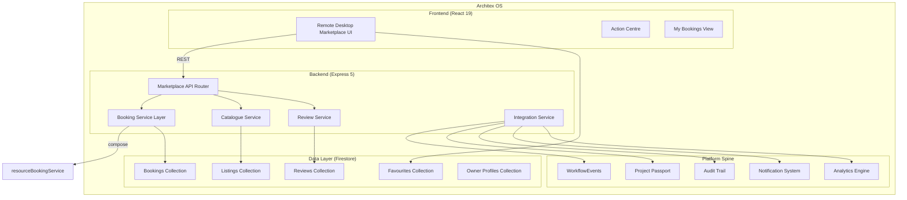
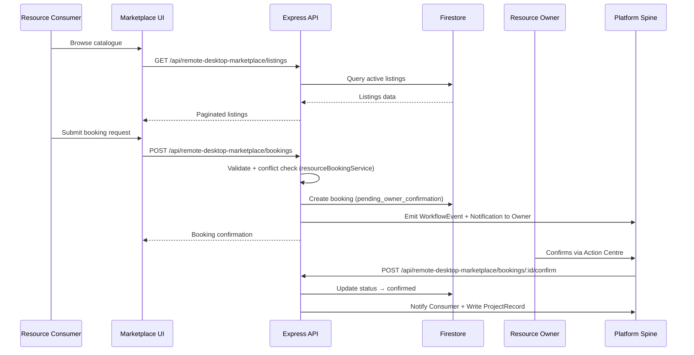

# Design Document: Remote Desktop Marketplace

## Overview

The Remote Desktop Marketplace is a consumer-facing discovery and booking module within Architex OS that enables resource consumers (freelancers, small practices, subcontractors) to browse, filter, and book remote desktop resources published by resource owners (firms with expensive software licenses like Revit, ArchiCAD, SketchUp).

The feature renders at `/remote-desktop/marketplace` as a sub-route of the Remote Desktop module, following the SpecForge workspace layout pattern. It integrates with the existing `resourceBookingService` for conflict detection and governance, the Platform Spine (WorkflowEvents, ProjectRecord), the notification system, and the Analytics & Reporting Engine.

### Design Decisions

1. **Feature module isolation**: The Remote Desktop Marketplace lives in `src/features/remote-desktop-marketplace/` as a bounded feature module (same pattern as `src/features/marketplace/` and `src/features/project-communications/`). This keeps types, services, components, and tests co-located.

2. **Reuse of existing booking governance**: The `resourceBookingService.ts` already provides `findResourceBookingConflicts`, `canConfirmResourceBooking`, and `evaluateResourceBookingGovernance`. The marketplace service layer will compose these rather than duplicate conflict logic.

3. **Firestore as persistence layer**: All marketplace data (listings, bookings, reviews, favourites) is stored in the existing Firestore non-default DB under collection paths prefixed with `remoteDesktopMarketplace/`.

4. **Client-side catalogue caching**: A session-level cache (React Query / custom hook with TTL) holds the catalogue index to meet the 3-second initial load and 2-second filter-update SLAs.

5. **Express API routes**: New marketplace API endpoints are added via a dedicated `remote-desktop-marketplace-api-router.ts` file, mounted under `/api/remote-desktop-marketplace/*` in the main API router.

---

## Architecture

### System Context Diagram



### High-Level Data Flow



---

## Components and Interfaces

### Frontend Component Tree

```
src/features/remote-desktop-marketplace/
├── index.ts                              # Public barrel export
├── types.ts                              # Feature-specific TypeScript types
├── constants.ts                          # Software categories, price ranges, SA cities
├── components/
│   ├── RemoteDesktopMarketplace.tsx       # Root workspace shell (SpecForge layout)
│   ├── CatalogueBrowser.tsx              # Browse tab — grid + filters + search
│   ├── ResourceCard.tsx                  # Individual listing card
│   ├── ResourceDetailView.tsx            # Full listing detail page
│   ├── AvailabilityCalendar.tsx          # 14-day slot calendar
│   ├── BookingRequestForm.tsx            # Booking submission form
│   ├── MyBookingsView.tsx                # My Bookings tab
│   ├── BookingEntry.tsx                  # Single booking row/card
│   ├── FavouritesView.tsx                # Favourites tab
│   ├── OwnerProfileView.tsx             # Owner profile page
│   ├── ReviewList.tsx                    # Paginated review display
│   ├── ReviewForm.tsx                    # Review submission form
│   ├── OwnerListingManager.tsx          # Owner listing CRUD
│   └── shared/
│       ├── FilterBar.tsx                 # Multi-filter controls
│       ├── SortSelector.tsx              # Sort dropdown
│       ├── SessionReadinessIndicator.tsx # Heartbeat status badge
│       ├── TrustBadges.tsx              # Verification + metrics display
│       ├── RatingStars.tsx              # Star rating display/input
│       └── EmptyState.tsx               # Reusable empty state pattern
├── services/
│   ├── catalogueService.ts              # Listing CRUD, filtering, search
│   ├── bookingService.ts                # Booking request lifecycle
│   ├── reviewService.ts                 # Review submission + aggregation
│   ├── favouritesService.ts             # Favourites add/remove/list
│   ├── ownerProfileService.ts           # Owner profile + trust metrics
│   ├── availabilityService.ts           # Calendar slot management
│   ├── listingManagementService.ts      # Owner listing operations
│   ├── integrationService.ts            # Platform spine integration
│   └── analyticsService.ts              # KPI exposure for reporting engine
├── hooks/
│   ├── useCatalogue.ts                  # Cached catalogue query hook
│   ├── useBookings.ts                   # User booking state
│   ├── useFavourites.ts                 # Favourites state
│   ├── useAvailability.ts               # Calendar slot state + polling
│   └── useOwnerProfile.ts              # Owner profile data
└── __tests__/
    ├── unit/
    ├── integration/
    └── properties/
```

### API Route Structure

```typescript
// Mounted at /api/remote-desktop-marketplace in api-router.ts

// Catalogue
GET    /listings                         // Paginated, filtered, sorted
GET    /listings/:listingId              // Single listing detail
GET    /listings/:listingId/availability // 14-day availability slots
GET    /listings/:listingId/reviews      // Paginated reviews

// Bookings
POST   /bookings                         // Submit booking request
GET    /bookings                         // My bookings (consumer)
GET    /bookings/incoming                // Incoming requests (owner)
PATCH  /bookings/:bookingId/confirm      // Owner confirms
PATCH  /bookings/:bookingId/decline      // Owner declines
PATCH  /bookings/:bookingId/cancel       // Consumer cancels
POST   /bookings/:bookingId/review       // Submit review

// Favourites
GET    /favourites                        // List user favourites
POST   /favourites/:listingId            // Add to favourites
DELETE /favourites/:listingId            // Remove from favourites

// Owner
GET    /owner/:ownerUid                  // Public owner profile
GET    /owner/me/listings                // Owner's own listings
POST   /owner/me/listings               // Publish listing
PATCH  /owner/me/listings/:listingId    // Update listing
PATCH  /owner/me/listings/:listingId/pause   // Pause listing
PATCH  /owner/me/listings/:listingId/activate // Reactivate listing
GET    /owner/me/listings/:listingId/analytics // Listing analytics

// Search
GET    /search?q=&categories=&price=&location=&rating=&availability=
```

### Key Service Interfaces

```typescript
// catalogueService.ts
interface CatalogueQuery {
  page: number;                    // 1-indexed
  pageSize: number;                // default 20, max 50
  categories?: string[];           // Software_Category multi-select
  priceRange?: PriceRangeBracket;
  locations?: string[];            // SA city/region multi-select
  minRating?: number;              // 3, 4, or 4.5
  availability?: 'today' | 'this_week' | 'any';
  search?: string;                 // min 2 chars
  sort?: CatalogueSortOption;
}

type CatalogueSortOption =
  | 'availability_asc'    // soonest available first (default)
  | 'price_asc'
  | 'price_desc'
  | 'rating_desc'
  | 'newest_desc';

type PriceRangeBracket = '0-100' | '100-250' | '250-500' | '500+';

interface CatalogueResult {
  listings: ResourceListingSummary[];
  total: number;
  page: number;
  pageSize: number;
  appliedFilters: CatalogueQuery;
}
```

```typescript
// bookingService.ts
interface CreateBookingRequest {
  listingId: string;
  startsAt: string;                // ISO 8601
  endsAt: string;                  // ISO 8601
  intendedSoftware: string;        // from listing's available apps
  projectReference?: string;       // existing Architex projectId
  messageToOwner?: string;         // max 500 chars
}

interface BookingRecord {
  id: string;
  listingId: string;
  resourceId: string;
  consumerId: string;
  ownerId: string;
  startsAt: string;
  endsAt: string;
  durationHours: number;
  intendedSoftware: string;
  projectReference?: string;
  messageToOwner?: string;
  status: MarketplaceBookingStatus;
  estimatedCostZar: number;
  ownerDeclineReason?: string;
  createdAt: string;
  confirmedAt?: string;
  cancelledAt?: string;
  completedAt?: string;
  expiresAt: string;               // 24h from creation
}

type MarketplaceBookingStatus =
  | 'pending_owner_confirmation'
  | 'confirmed'
  | 'declined'
  | 'cancelled_by_consumer'
  | 'expired'
  | 'conflict_expired'
  | 'active'
  | 'completed';
```

```typescript
// reviewService.ts
interface CreateReviewRequest {
  bookingId: string;
  rating: 1 | 2 | 3 | 4 | 5;
  comment?: string;                // 10-500 chars when provided
  tags?: ReviewTag[];              // max 3
}

type ReviewTag =
  | 'fast_connection'
  | 'great_software_setup'
  | 'responsive_owner'
  | 'ran_into_issues';

interface ReviewRecord {
  id: string;
  bookingId: string;
  listingId: string;
  ownerId: string;
  consumerId: string;
  consumerDisplayName: string;
  rating: number;
  comment?: string;
  tags: ReviewTag[];
  ownerReply?: string;             // max 500 chars
  ownerRepliedAt?: string;
  isLateReview: boolean;           // submitted after 7 days
  isVerified: boolean;             // linked to real completed session
  createdAt: string;
}
```

---

## Data Models

### Firestore Collection Schema

```
remoteDesktopMarketplace/
├── listings/{listingId}
│   ├── availability/{weekday}     # recurring schedule subcollection
│   └── blockedDates/{dateId}      # one-off blocked dates
├── bookings/{bookingId}
├── reviews/{reviewId}
├── favourites/{userId}/items/{listingId}
├── ownerProfiles/{ownerUid}
└── analytics/{listingId}          # view counts, booking counts
```

### Resource Listing Document

```typescript
interface ResourceListing {
  id: string;
  ownerId: string;
  ownerFirmName: string;
  resourceId: string;              // links to Remote Desktop resource

  // Display
  name: string;                    // 1-100 chars
  description: string;             // up to 2000 chars
  softwareCategories: string[];    // 1-5 tags from managed list
  softwareApplications: SoftwareApp[];
  hardwareSpecs: HardwareSpecs;
  locationTag: string;             // SA city/region

  // Pricing
  hourlyRateZar: number;           // R50-R5000
  minBookingHours: number;         // 1-8
  maxBookingHours: number;         // 1-24
  billingPolicy: 'per_hour' | 'per_session';

  // Session
  sessionRecordingEnabled: boolean;
  lastHeartbeatAt: string | null;  // ISO 8601 or null

  // Status
  status: 'draft' | 'active' | 'paused' | 'removed';

  // Metrics (denormalized for fast catalogue reads)
  averageRating: number | null;    // 1.0-5.0, null if no reviews
  totalReviews: number;
  totalCompletedSessions: number;

  // Timestamps
  createdAt: string;
  updatedAt: string;
  publishedAt: string | null;
}

interface SoftwareApp {
  name: string;
  version: string;
}

interface HardwareSpecs {
  cpu: string;
  ramGb: number;
  gpu: string;
  storageGb: number;
}
```

### Availability Schedule

```typescript
interface WeeklySchedule {
  dayOfWeek: 0 | 1 | 2 | 3 | 4 | 5 | 6;  // 0=Sunday
  slots: TimeSlot[];                         // available 1-hour slots
}

interface TimeSlot {
  startHour: number;  // 0-23 (SAST)
  endHour: number;    // 1-24 (SAST)
}

interface BlockedDate {
  id: string;
  date: string;        // YYYY-MM-DD
  startHour?: number;  // optional: block specific hours
  endHour?: number;
  reason?: string;     // internal note for owner
}
```

### Owner Profile Document

```typescript
interface OwnerProfile {
  ownerUid: string;
  firmName: string;
  profileImageUrl: string | null;   // max 2MB, JPEG/PNG/WebP
  description: string;              // up to 1000 chars
  memberSince: string;              // ISO 8601 date of first listing

  // Trust Indicators (recalculated from 90-day rolling window)
  isIdentityVerified: boolean;
  avgResponseTimeHours: number | null;
  bookingAcceptanceRate: number | null;   // percentage 0-100
  sessionCompletionRate: number | null;   // percentage 0-100
  aggregateRating: number | null;         // 1.0-5.0
  totalCompletedSessions: number;

  // Threshold flag
  isNewOwner: boolean;              // <5 sessions in 90 days

  updatedAt: string;
}
```

### Favourites Document

```typescript
interface FavouriteEntry {
  listingId: string;
  addedAt: string;                  // ISO 8601
  // Denormalized snapshot (updated on read if stale)
  listingName: string;
  softwareCategory: string;
  hourlyRateZar: number;
  averageRating: number | null;
  listingStatus: 'active' | 'paused' | 'removed';
}
```

---

## Correctness Properties

*A property is a characteristic or behavior that should hold true across all valid executions of a system — essentially, a formal statement about what the system should do. Properties serve as the bridge between human-readable specifications and machine-verifiable correctness guarantees.*

### Property 1: Role-based marketplace visibility

*For any* UserRole, the marketplace tab/route should be accessible if and only if the role is a member of the authorised set {freelancer, contractor, subcontractor, bep, architect, firm_admin, platform_admin}.

**Validates: Requirements 1.3, 1.4**

### Property 2: Catalogue filter correctness

*For any* catalogue of ResourceListings and any combination of active filters (Software_Category, Price_Range, Location_Tag, minimum Rating, availability window), every listing in the returned result set must satisfy ALL active filter predicates simultaneously.

**Validates: Requirements 2.2**

### Property 3: Search result relevance

*For any* search query of 2 or more characters and any catalogue, all returned listings must contain the query as a case-insensitive substring in at least one of: resource name, Software_Category labels, owner firm name, or description.

**Validates: Requirements 2.3**

### Property 4: Catalogue sort ordering

*For any* list of ResourceListings and any valid sort option (price_asc, price_desc, rating_desc, availability_asc, newest_desc), the returned list must be ordered according to that sort option's comparator — i.e., for every adjacent pair (a, b) in the result, a must be ≤ b (or ≥ for descending) on the sort key.

**Validates: Requirements 2.4**

### Property 5: Resource card completeness

*For any* valid ResourceListing, rendering its card should produce output containing all required display fields: resource name (truncated at 60 chars), primary Software_Category icon, hourly rate in ZAR, average rating (1 decimal place), Location_Tag, and session-readiness indicator.

**Validates: Requirements 2.1**

### Property 6: Availability calendar slot generation

*For any* reference date, the Availability_Calendar generates exactly 14 consecutive days starting from that date, with slots in 1-hour increments between 06:00 and 22:00 SAST (16 slots per day). Each slot is assigned a status (available, unavailable, or pending) based on the underlying schedule and booking data.

**Validates: Requirements 4.1, 4.2**

### Property 7: Schedule minus blocked dates

*For any* WeeklySchedule configuration and set of BlockedDate entries, the computed availability for a given date should equal the slots defined by the weekly template for that day-of-week, minus any slots that overlap with a blocked date entry.

**Validates: Requirements 4.3**

### Property 8: Slot selection validation

*For any* attempted time slot selection on the Availability_Calendar, if the selected slots are non-contiguous OR the count exceeds 16, the selection must be rejected. Only contiguous selections of 1–16 available slots are permitted.

**Validates: Requirements 4.6**

### Property 9: Booking cost calculation

*For any* resource with hourly rate R (in ZAR) and any valid booking of H contiguous hours (where minBookingHours ≤ H ≤ maxBookingHours), the estimated cost displayed must equal R × H.

**Validates: Requirements 4.5, 5.4**

### Property 10: Booking request validation

*For any* booking request, the system must reject the submission if: (a) the time slot conflicts with an existing active booking (per `findResourceBookingConflicts`), OR (b) the booking duration is less than the resource's minBookingHours or greater than its maxBookingHours, OR (c) the consumer does not have a verified platform account. When rejected, form data must be preserved.

**Validates: Requirements 5.2**

### Property 11: Booking 24-hour expiry

*For any* booking in "pending_owner_confirmation" status, if the current time exceeds createdAt + 24 hours without owner action, the booking must transition to "expired" status.

**Validates: Requirements 5.7**

### Property 12: Conflict detection at confirmation time

*For any* booking being confirmed by an owner, the system must re-validate using `findResourceBookingConflicts`. If conflicts exist at confirmation time (due to concurrent bookings), the request must be rejected with status "conflict_expired".

**Validates: Requirements 5.9**

### Property 13: Aggregate rating calculation

*For any* non-empty list of integer ratings (1–5) associated with a ResourceListing, the aggregate rating must equal the arithmetic mean of all ratings, rounded to one decimal place. When a new review is submitted, the aggregate must be recalculated immediately.

**Validates: Requirements 3.4, 7.4**

### Property 14: Trust indicator calculation

*For any* Resource_Owner, trust indicators must be calculated from the most recent 90-day window. If the owner has fewer than 5 completed sessions in that window, isNewOwner must be true and calculated metrics (response time, acceptance rate, completion rate, aggregate rating) must be null. Otherwise: acceptance rate = (confirmed count / total received) × 100 (rounded to integer), completion rate = (completed count / confirmed count) × 100 (rounded to integer).

**Validates: Requirements 6.2, 6.3**

### Property 15: Review display ordering

*For any* list of reviews, they must be displayed in chronological order with newest first (sorted by createdAt descending), paginated at 10 per page.

**Validates: Requirements 6.4, 7.8**

### Property 16: Owner profile privacy

*For any* Owner_Profile render, the output must never contain the owner's email address, phone number, or physical address, regardless of what data is available in the underlying record.

**Validates: Requirements 6.6**

### Property 17: Review submission validation

*For any* review submission: rating must be an integer 1–5, comment (if provided) must be 10–500 characters, tags (if provided) must be ≤ 3 from the predefined set. For any bookingId, if a review already exists OR the booking status ≠ "completed", the submission must be rejected.

**Validates: Requirements 7.2, 7.3**

### Property 18: Review time window

*For any* review submission, given the session's completedAt date: if daysSinceCompletion ≤ 7, accept normally; if 8–90 days, accept with isLateReview=true; if > 90 days, reject the submission.

**Validates: Requirements 7.7**

### Property 19: Review and reply immutability

*For any* submitted review or owner reply, no edit or delete operation shall be permitted after initial submission. A second reply to the same review must be rejected.

**Validates: Requirements 7.5, 7.9**

### Property 20: Listing validation

*For any* resource listing data submitted for publication, it must be rejected if: name is empty or > 100 chars, softwareCategories count is not 1–5 or contains values outside the managed list, hourlyRateZar is outside [50, 5000], minBookingHours is outside [1, 8], maxBookingHours is outside [1, 24], or minBookingHours > maxBookingHours.

**Validates: Requirements 8.2, 8.3, 8.8**

### Property 21: Catalogue inclusion criteria

*For any* ResourceListing, it should appear in the browsable catalogue if and only if: status = "active" AND name is non-empty AND softwareCategories has ≥ 1 entry AND hourlyRateZar is set AND at least one available time slot exists within the next 7 days.

**Validates: Requirements 8.1**

### Property 22: Pause preserves bookings

*For any* ResourceListing with existing confirmed bookings, changing the listing status to "paused" must not alter the status of any associated booking records.

**Validates: Requirements 8.6**

### Property 23: Booking grouping and sort

*For any* list of a consumer's bookings, each booking must be categorized into exactly one section based on its status (Upcoming, Pending, Active, Completed, Cancelled/Declined/Expired). Within each section, bookings are sorted by startsAt — nearest-first for Upcoming/Pending/Active, most-recent-first for Completed and Cancelled.

**Validates: Requirements 9.1**

### Property 24: Launch session and countdown visibility

*For any* confirmed booking and current time T: the "Launch Session" action is visible iff (startsAt − 15 minutes) ≤ T ≤ endsAt. The "Session Starting Soon" countdown is visible iff 0 < (startsAt − T) ≤ 15 minutes, displaying the remaining minutes and seconds.

**Validates: Requirements 9.2, 9.3**

### Property 25: Cancellation policy

*For any* cancellation request on a Pending or Upcoming booking: if (startsAt − now) > 2 hours, cancel without penalty; if (startsAt − now) ≤ 2 hours, require explicit user confirmation with late-cancellation warning before proceeding.

**Validates: Requirements 9.4**

### Property 26: Leave review eligibility

*For any* booking in the My Bookings view, the "Leave Review" action is visible if and only if: status = "completed" AND (now − completedAt) ≤ 30 days AND no review record exists for that bookingId.

**Validates: Requirements 9.5**

### Property 27: Favourites sort and limit

*For any* user's favourites list: items are displayed sorted by addedAt descending (most recently added first), and the total count must never exceed 50. An attempt to add a 51st favourite must be rejected.

**Validates: Requirements 10.2, 10.5**

### Property 28: Unavailable favourite indicator

*For any* favourite entry whose referenced listing has status "removed" or has been permanently hidden, the display must show a "No Longer Available" indicator and the booking action must be disabled.

**Validates: Requirements 10.4**

### Property 29: Audit trail completeness

*For any* marketplace action (booking_requested, booking_confirmed, booking_declined, booking_cancelled, booking_expired, review_submitted, review_replied, listing_published, listing_paused, listing_activated, favourite_added), the audit entry must contain: event type, actor user ID, target entity ID, entity type, timestamp (ISO 8601), and tenant ID.

**Validates: Requirements 11.3**

### Property 30: Marketplace KPI calculations

*For any* set of booking and listing data: marketplace utilisation = total booked hours / total available hours across all active listings; average satisfaction = arithmetic mean of all marketplace ratings; booking lead time = mean of (session start − request creation) across confirmed bookings.

**Validates: Requirements 11.5**


---

## Error Handling

### Client-Side Error Strategy

| Scenario | Handling |
|----------|----------|
| Catalogue fetch failure | Display non-blocking error with retry action. Preserve any active filters/search. |
| Catalogue fetch timeout (>10s) | Show timeout message with retry. Display skeleton UI during wait. |
| Search response > 2s | Show inline error, preserve search text and filters. |
| Booking submission conflict | Display conflict message, refresh availability calendar automatically. |
| Booking validation failure | Highlight invalid fields, display specific error (conflict/duration/verification). Preserve form data. |
| Favourite limit reached (50) | Inline rejection message near the heart icon. No navigation away. |
| Detail view 404 (listing removed) | Display "no longer available" message with link back to catalogue. |
| Owner profile not found | Generic "profile unavailable" message. No account status leak. |
| Review duplicate attempt | Inline error: "A review already exists for this booking." |
| Network error (any API call) | Toast notification with retry action. No data loss. |

### Server-Side Error Strategy

| Scenario | Handling |
|----------|----------|
| Firestore write failure | Return 500 with machine-readable error code. Client displays retry option. |
| Conflict at booking confirmation | Return 409 Conflict. Update booking status to "conflict_expired". Notify both parties. |
| Platform spine write failure | Queue for retry (3 attempts, 30s intervals). On exhaustion: critical audit log + admin WorkflowEvent. |
| Validation failure | Return 400 with field-level error details. Client maps to form fields. |
| Unauthorized access | Return 403. Client redirects to module root. |
| Rate limit exceeded | Return 429 with Retry-After header. Client shows "too many requests" message. |

### Error Code Schema

```typescript
interface MarketplaceApiError {
  code: MarketplaceErrorCode;
  message: string;
  field?: string;
  details?: Record<string, unknown>;
}

type MarketplaceErrorCode =
  | 'LISTING_NOT_FOUND'
  | 'LISTING_INACTIVE'
  | 'BOOKING_CONFLICT'
  | 'BOOKING_DURATION_INVALID'
  | 'BOOKING_CONSUMER_UNVERIFIED'
  | 'BOOKING_EXPIRED'
  | 'BOOKING_ALREADY_CONFIRMED'
  | 'REVIEW_DUPLICATE'
  | 'REVIEW_INELIGIBLE'
  | 'REVIEW_WINDOW_CLOSED'
  | 'FAVOURITE_LIMIT_REACHED'
  | 'LISTING_VALIDATION_FAILED'
  | 'OWNER_NOT_FOUND'
  | 'UNAUTHORIZED'
  | 'INTERNAL_ERROR'
  | 'SPINE_WRITE_FAILED';
```

### Retry Queue for Platform Spine Writes

```typescript
interface RetryQueueItem {
  id: string;
  type: 'workflow_event' | 'project_record' | 'audit_entry';
  payload: Record<string, unknown>;
  attempts: number;           // max 3
  nextRetryAt: string;        // ISO 8601
  status: 'pending' | 'completed' | 'permanently_failed';
  lastError?: string;
  createdAt: string;
}
```

---

## Testing Strategy

### Dual Testing Approach

This feature uses both unit/example tests and property-based tests for comprehensive coverage:

- **Property-based tests** verify universal correctness properties (30 properties above) across randomized inputs using `fast-check`.
- **Unit/example tests** cover specific integration points, UI rendering, edge cases, and platform wiring.
- **Integration tests** verify timing constraints, Firestore persistence, and platform spine communication.

### Property-Based Testing Configuration

- **Library**: `fast-check` (TypeScript)
- **Minimum iterations**: 100 per property test
- **Location**: `src/features/remote-desktop-marketplace/__tests__/properties/`
- **Tagging format**: Each test is tagged with a comment:
  ```typescript
  // Feature: remote-desktop-marketplace, Property 1: Role-based marketplace visibility
  ```

### Test File Structure

```
src/features/remote-desktop-marketplace/__tests__/
├── properties/
│   ├── catalogue.property.test.ts          # Properties 2, 3, 4, 5, 21
│   ├── availability.property.test.ts       # Properties 6, 7, 8, 9
│   ├── booking.property.test.ts            # Properties 10, 11, 12, 23, 24, 25
│   ├── review.property.test.ts             # Properties 13, 15, 17, 18, 19
│   ├── owner.property.test.ts             # Properties 14, 16
│   ├── listing.property.test.ts           # Properties 20, 22
│   ├── favourites.property.test.ts        # Properties 27, 28
│   ├── rbac.property.test.ts              # Property 1
│   ├── mybookings.property.test.ts        # Property 26
│   └── analytics.property.test.ts         # Properties 29, 30
├── unit/
│   ├── catalogueService.test.ts
│   ├── bookingService.test.ts
│   ├── reviewService.test.ts
│   ├── favouritesService.test.ts
│   ├── availabilityService.test.ts
│   ├── ownerProfileService.test.ts
│   ├── listingManagementService.test.ts
│   ├── integrationService.test.ts
│   └── analyticsService.test.ts
└── integration/
    ├── bookingLifecycle.integration.test.ts
    ├── platformSpine.integration.test.ts
    └── calendarPolling.integration.test.ts
```

### Unit Test Coverage Targets

| Service | Key Tests |
|---------|-----------|
| catalogueService | Filter combinations, search matching, sort ordering, pagination edge cases |
| bookingService | Conflict detection integration, status transitions, expiry logic |
| reviewService | Rating recalculation, time window enforcement, immutability |
| availabilityService | Weekly schedule rendering, blocked date subtraction, slot generation |
| favouritesService | Add/remove, limit enforcement, stale listing detection |
| ownerProfileService | Trust metric calculation, 90-day window, new owner threshold |
| listingManagementService | Validation rules, pause/activate behavior |
| integrationService | WorkflowEvent construction, ProjectRecord writing, retry queue |

### Integration Test Targets

| Scenario | Verification |
|----------|-------------|
| Booking lifecycle | Submit → Confirm → Complete → Review (full happy path) |
| Platform spine writes | WorkflowEvent delivery, ProjectRecord creation, audit trail entries |
| Calendar real-time updates | Booking confirmed → calendar refreshes within 60s |
| Concurrent booking conflict | Two consumers book same slot → first wins, second gets conflict |
| Retry queue exhaustion | 3 failed spine writes → critical audit + admin notification |

### Performance Benchmarks

| Metric | Target | Measurement |
|--------|--------|-------------|
| Initial catalogue load | < 3s @ 5 Mbps | Lighthouse + custom timing |
| Filter/sort response | < 2s | API response time measurement |
| Search debounce | 300ms | Timer-based assertion |
| Calendar update propagation | < 60s | Polling interval verification |
| Pagination batch | 20 items per page | Response payload size assertion |
| Scale ceiling | 500 active listings | Load test with synthetic data |
