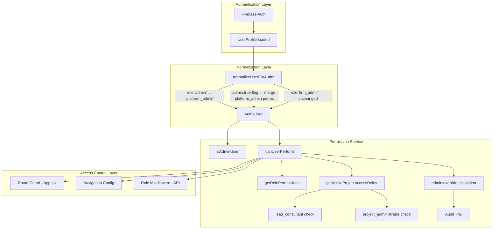

# Design Document: Role Architecture Refinement

## Overview

This design restructures the Architex platform's role and permission architecture to eliminate the conflated `admin` role, introduce project-scoped permission elevation, and enforce explicit permission evaluation for all users including platform operators.

**Key changes:**
1. Remove `admin` from the `UserRole` union type; consolidate to `platform_admin`
2. Remove `platform_admin` from professional module access lists in navigation config and route guards
3. Introduce `lead_consultant` and `project_administrator` as project-level access roles
4. Replace the unconditional admin bypass in `canUserPerform()` with scoped permission evaluation
5. Provide runtime normalization for legacy `role: 'admin'` user records
6. Audit and correct all 30+ route definitions in `App.tsx`

The system retains backward compatibility through in-memory normalization (no Firestore migration required at deploy time) and preserves `firm_admin` scope unchanged.

## Architecture



The architecture moves from a two-layer model (role check → admin bypass) to a three-layer model (normalization → scoped permission evaluation → audit-guarded escalation).

## Components and Interfaces

### 1. Permission Service (`src/services/permissionService.ts`)

The central authorization module. Refactored to:

```typescript
// Updated UserRole type (src/types.ts)
export type UserRole =
  | 'client' | 'architect' | 'freelancer' | 'bep' | 'contractor'
  | 'subcontractor' | 'supplier' | 'engineer' | 'quantity_surveyor'
  | 'town_planner' | 'energy_professional' | 'fire_engineer'
  | 'site_manager' | 'developer' | 'firm_admin' | 'platform_admin'
  | 'land_surveyor' | 'health_safety';
// Note: 'admin' removed from the union

// New project access roles
export type ProjectAccessRole =
  | 'project_owner'
  | 'lead_bep'
  | 'lead_consultant'        // NEW
  | 'project_administrator'  // NEW
  | 'design_team_member'
  | 'contractor'
  | 'subcontractor_package_assignee'
  | 'supplier_package_assignee'
  | 'freelancer_task_assignee';
// Note: 'admin' removed from ProjectAccessRole

// New interface for override requests
export interface AdminOverrideRequest {
  admin: AuthzUser;
  action: PermissionAction;
  projectId: string;
  reason: string; // minimum 10 characters
}

// New interface for override audit record
export interface AdminOverrideAuditEntry {
  adminUid: string;
  action: PermissionAction;
  projectId: string;
  reason: string;
  timestamp: string; // ISO 8601
}
```

**Key function changes:**

| Function | Current Behavior | New Behavior |
|----------|-----------------|--------------|
| `isAdminUser()` | Checks `role === 'admin'` OR `admin === true` | Checks `role === 'platform_admin'` OR `admin === true`; returns false for null/undefined |
| `canUserPerform()` | Returns `true` immediately for admin | Evaluates against `platform_admin` permission set; requires project membership for project-scoped writes |
| `getActiveProjectAccessRoles()` | Returns `['admin']` for admin users | Returns actual project memberships; `platform_admin` gets implicit `project:read` only |
| `normalizeUserForAuthz()` | (new) | Maps `role:'admin'` → `platform_admin`; handles `admin:true` flag; emits deprecation warning |

### 2. Navigation Config (`src/navigation/architexNavigationConfig.ts`)

**Changes:**
- Remove `'admin'` from all module role arrays
- Remove `'platform_admin'` from professional module role arrays (toolboxes, projects, CPD, documents, marketplace, finance, analytics, messages)
- Add `'platform_admin'` only to: command centre, inbox, settings, verification queue, AI review queue, system health
- `getNavigationForRole('platform_admin')` returns only platform admin modules + shared utilities

### 3. Route Guard (`src/App.tsx`)

**Changes to `CANONICAL_DASHBOARD_PAGES`:**
- Replace all `'admin'` entries with the correct Professional_Role values
- Platform-only pages get `roles: ['platform_admin']`
- Universal pages get all 15 professional roles + `'platform_admin'`
- Professional module pages exclude `'platform_admin'`
- Compile-time validation: empty roles arrays cause TypeScript error via `NonEmptyArray<UserRole>` type constraint
- Runtime: if a route contains literal `'admin'`, access is denied

### 4. Role Middleware (`src/lib/roleMiddleware.ts`)

Updated to call `normalizeUserForAuthz()` before any permission check, ensuring legacy records are handled at the API layer identically to the client layer.

### 5. Admin Role Service (`src/services/adminRoleService.ts`)

Extended with:
- `assignProjectAccessRole(targetUser, projectAccessRole, projectId, assignedBy)` — validates Professional_Role compatibility before persisting
- `revokeProjectAccessRole(targetUser, projectAccessRole, projectId, revokedBy)`
- Enforces mutual exclusivity: a user cannot hold both `lead_consultant` and `project_administrator` on the same project

## Data Models

### ProjectAccessRole Assignment (Firestore)

```typescript
// Collection: projects/{projectId}/accessRoles/{userId}
interface ProjectAccessRoleAssignment {
  userId: string;
  projectId: string;
  accessRole: 'lead_consultant' | 'project_administrator';
  assignedBy: string;
  assignedAt: string; // ISO 8601
  userProfessionalRole: UserRole; // validated at assignment time
}
```

### Admin Override Audit Record (Firestore)

```typescript
// Collection: projects/{projectId}/auditTrail/{eventId}
interface AdminOverrideAuditRecord {
  type: 'admin_override';
  adminUid: string;
  action: PermissionAction;
  projectId: string;
  reason: string;
  timestamp: string; // ISO 8601
  createdAt: string;
}
```

### Platform Admin Permission Set

```typescript
const PLATFORM_ADMIN_PERMISSIONS: PermissionAction[] = [
  'verification:review',
  'audit:read',
  'audit:write',
  'admin:override',
  'payment:manage',
  'escrow:release',
  'project:read', // cross-project read-only visibility
];
```

### Lead Consultant Permission Set (project-scoped)

```typescript
const LEAD_CONSULTANT_PERMISSIONS: PermissionAction[] = [
  'project:read',
  'project:update',
  'project:manage_members',
  'compliance:sign',
  'municipal:manage',
  'payment:read',
];
```

### Project Administrator Permission Set (project-scoped)

```typescript
const PROJECT_ADMINISTRATOR_PERMISSIONS: PermissionAction[] = [
  'project:read',
  'project:update',
  'project:manage_members',
  'audit:read',
  'payment:read',
  'payment:manage',
];
```

### ProjectAccessRole Compatibility Matrix

| ProjectAccessRole | Compatible Professional Roles |
|---|---|
| `lead_consultant` | `bep`, `architect`, `engineer`, `quantity_surveyor`, `town_planner`, `energy_professional`, `fire_engineer` |
| `project_administrator` | `bep`, `architect`, `engineer`, `quantity_surveyor`, `contractor`, `firm_admin` |

### Normalization Rules

| Firestore State | Normalized AuthzUser |
|---|---|
| `role: 'admin'` | `role: 'platform_admin'` + deprecation warning |
| `admin: true`, no `role` | `role: 'platform_admin'` + deprecation warning |
| `admin: true` + Professional_Role | Professional_Role preserved + `platform_admin` permissions merged |
| `role: 'firm_admin'` | Unchanged — no normalization |
| `role: 'admin'` + `admin: true` | Single normalization to `platform_admin`; no duplicate grants |


## Correctness Properties

*A property is a characteristic or behavior that should hold true across all valid executions of a system — essentially, a formal statement about what the system should do. Properties serve as the bridge between human-readable specifications and machine-verifiable correctness guarantees.*

### Property 1: Role normalization preserves platform_admin identity

*For any* AuthzUser with `role: 'admin'` (with or without `admin: true`), `normalizeUserForAuthz` SHALL produce an AuthzUser with `role: 'platform_admin'`, and the resulting permission set SHALL be identical to that of a user originally having `role: 'platform_admin'`. The normalization SHALL be idempotent — normalizing an already-normalized user produces no change.

**Validates: Requirements 1.2, 1.6, 8.1, 8.5, 8.6**

### Property 2: Professional modules exclude platform_admin

*For any* professional workflow module in the navigation config (toolboxes, projects, CPD & learning, documents, marketplace, finance, analytics, messages), the module's roles array SHALL contain only Professional_Role values and SHALL NOT contain `'platform_admin'` or `'admin'`. Consequently, `getNavigationForRole('platform_admin')` SHALL return none of these modules.

**Validates: Requirements 2.1, 2.2, 2.3**

### Property 3: Platform_admin denied for actions outside permission set

*For any* PermissionAction that is NOT in the `platform_admin` defined permission set (`verification:review`, `audit:read`, `audit:write`, `admin:override`, `payment:manage`, `escrow:release`, `project:read`), `canUserPerform` called with a `platform_admin` user (without project membership) SHALL return false.

**Validates: Requirements 1.5, 4.1, 4.2, 5.5**

### Property 4: Platform_admin project-scoped writes require membership

*For any* project-scoped write action (`project:update`, `project:manage_members`, `compliance:sign`, `municipal:manage`, `payment:manage`, `escrow:release`) and *for any* project context where the `platform_admin` user has no active `ProjectAccessRole` membership, `canUserPerform` SHALL return false.

**Validates: Requirements 4.3, 4.5, 5.3, 5.4**

### Property 5: Platform_admin retains cross-project read visibility

*For any* project context (varying clientId, leadBepId, memberships), `canUserPerform(platform_admin_user, 'project:read', project)` SHALL return true without requiring a `ProjectAccessRole` assignment on that project.

**Validates: Requirements 4.4**

### Property 6: Admin override requires reason of at least 10 characters

*For any* string `reason`, `canAdminOverrideSeparationOfDuty` SHALL return true if and only if `reason.trim().length >= 10` AND the requesting user passes `isAdminUser`. For any reason where `trim().length < 10`, the override SHALL be rejected regardless of the admin's identity.

**Validates: Requirements 4.6, 4.8**

### Property 7: Dual-role user sees union of professional and platform modules

*For any* Professional_Role value `R`, a user holding both `R` and `platform_admin` privileges (via `admin: true`) SHALL see navigation modules equal to the union of `getNavigationForRole(R)` and the platform administration modules granted to `platform_admin`.

**Validates: Requirements 2.7**

### Property 8: Lead_consultant grants correct project-scoped permissions

*For any* user with `lead_consultant` access role on a project AND a compatible Professional_Role, `canUserPerform` SHALL return true for each of: `project:read`, `project:update`, `project:manage_members`, `compliance:sign`, `municipal:manage`, `payment:read` on that project.

**Validates: Requirements 3.3**

### Property 9: Project_administrator grants correct project-scoped permissions

*For any* user with `project_administrator` access role on a project AND a compatible Professional_Role, `canUserPerform` SHALL return true for each of: `project:read`, `project:update`, `project:manage_members`, `audit:read`, `payment:read`, `payment:manage` on that project.

**Validates: Requirements 3.4**

### Property 10: Lead_consultant compatibility validation

*For any* Professional_Role value, `isProjectAccessRoleCompatibleWithUserRole('lead_consultant', role)` SHALL return true if and only if role is in the set {`bep`, `architect`, `engineer`, `quantity_surveyor`, `town_planner`, `energy_professional`, `fire_engineer`}.

**Validates: Requirements 3.5**

### Property 11: Project_administrator compatibility validation

*For any* Professional_Role value, `isProjectAccessRoleCompatibleWithUserRole('project_administrator', role)` SHALL return true if and only if role is in the set {`bep`, `architect`, `engineer`, `quantity_surveyor`, `contractor`, `firm_admin`}.

**Validates: Requirements 3.6**

### Property 12: Incompatible role assignment denial

*For any* (Professional_Role, ProjectAccessRole) pair where the role is NOT in the compatibility set for that access role, `assignProjectAccessRole` SHALL throw a permission error and the user's existing project memberships SHALL remain unchanged.

**Validates: Requirements 3.7, 3.8**

### Property 13: Mutual exclusivity of project access roles

*For any* user and *for any* project, after any valid sequence of `assignProjectAccessRole` calls, the user SHALL hold at most one of `lead_consultant` or `project_administrator` on that project at any given time.

**Validates: Requirements 3.9**

### Property 14: firm_admin excluded from platform permissions

*For any* platform-level permission (`admin:override`, `verification:review`, `escrow:release`, `payment:manage`), `getRolePermissions('firm_admin')` SHALL NOT include that permission.

**Validates: Requirements 7.4**

### Property 15: firm_admin normalization immunity

*For any* user with `role: 'firm_admin'` (regardless of other fields), `normalizeUserForAuthz` SHALL leave the role as `'firm_admin'` and SHALL NOT normalize it to `'platform_admin'`.

**Validates: Requirements 7.5**

### Property 16: Professional_Role with admin flag grants union permissions

*For any* Professional_Role value `R` and a user with `role: R` and `admin: true`, `canUserPerform` SHALL return true for every action in `getRolePermissions(R)` AND for every action in the `platform_admin` system-level permission set (for non-project-scoped actions).

**Validates: Requirements 8.4**

### Property 17: admin:true without role normalizes to platform_admin

*For any* user with `admin: true` and `role` field undefined or absent, `normalizeUserForAuthz` SHALL produce an AuthzUser with effective `role: 'platform_admin'` and the user SHALL be evaluated against the `platform_admin` permission set.

**Validates: Requirements 8.2**

### Property 18: Route guard professional pages contain only valid Professional_Role values

*For any* professional module page in `CANONICAL_DASHBOARD_PAGES`, its roles array SHALL be non-empty AND every element SHALL be a valid Professional_Role value (not `'admin'`, not `'platform_admin'`). No wildcards or group shorthands SHALL appear.

**Validates: Requirements 6.1, 6.2, 6.3**

### Property 19: Route guard rejects literal 'admin' in roles

*For any* route definition in `CANONICAL_DASHBOARD_PAGES` whose roles array contains the literal `'admin'`, the route guard SHALL deny access to all users until the role is corrected.

**Validates: Requirements 6.7**

### Property 20: Platform_admin denied access to professional module routes

*For any* URL path corresponding to a professional workflow module, a user holding only `platform_admin` (no Professional_Role) SHALL be denied access by the route guard and redirected to the command centre.

**Validates: Requirements 2.5, 2.6**

## Error Handling

### Permission Denied Errors

| Scenario | Error Response | HTTP Status |
|----------|---------------|-------------|
| `canUserPerform` returns false | `{ error: 'Permission denied for action: {action}' }` | 403 |
| Incompatible role assignment | `{ error: 'Role {professionalRole} is not compatible with project access role {accessRole}' }` | 400 |
| Mutual exclusivity violation | `{ error: 'User already holds {existingRole} on project {projectId}; revoke it first' }` | 409 |
| Admin override with short reason | `{ error: 'Override reason must be at least 10 characters' }` | 400 |
| Route with 'admin' in roles | Access denied; redirect to command centre | — (client-side) |
| Null/undefined user in permission check | Returns false / denies access silently | 401 or 403 |

### Deprecation Warnings

When legacy records are normalized at runtime:
```typescript
{
  level: 'warn',
  type: 'role_deprecation',
  uid: string,
  legacyField: 'role:admin' | 'admin:true',
  normalizedTo: 'platform_admin',
  timestamp: string
}
```

### Graceful Degradation

- If `normalizeUserForAuthz` encounters an unrecognized role string, it returns the user with an empty permission set (deny by default)
- If Firestore project membership data is unavailable, project-scoped permissions default to deny (except platform_admin retains `project:read`)
- Route guard falls back to command centre for any unresolvable route

## Testing Strategy

### Property-Based Testing

This feature is well-suited for property-based testing because:
- Permission evaluation is a pure function with clear input/output behavior
- The input space (roles × actions × project contexts) is large
- Universal properties (normalization, compatibility, denial patterns) hold across all valid inputs

**Library:** `fast-check` (already available in the Vitest ecosystem)

**Configuration:**
- Minimum 100 iterations per property test
- Each property test references its design document property
- Tag format: `Feature: role-architecture-refinement, Property {number}: {property_text}`

### Test Structure

```
src/__tests__/
  permissionService.property.test.ts     — Properties 1, 3–6, 8–17
  navigationConfig.property.test.ts      — Properties 2, 7, 20
  routeGuard.property.test.ts            — Properties 18, 19
  permissionService.test.ts              — Example-based unit tests (existing, extended)
  adminRoleService.test.ts               — Assignment/revocation examples + mutual exclusivity
```

### Unit Tests (Example-Based)

Cover the EXAMPLE and EDGE_CASE acceptance criteria:
- `isAdminUser(null)` → false, `isAdminUser(undefined)` → false
- `getRolePermissions('platform_admin')` contains exact system permission set
- `getNavigationForRole('platform_admin')` returns only platform + utility modules
- `isProjectAccessRoleCompatibleWithUserRole('project_administrator', 'firm_admin')` → true
- Platform-only page roles arrays are exactly `['platform_admin']`
- Universal page roles arrays have exactly 16 entries

### Integration Tests

- Admin override writes audit record to Firestore (mock Firestore, verify write call)
- Normalization emits structured deprecation warning (spy on logger)
- Role middleware correctly normalizes before permission evaluation

### Generators (for Property Tests)

```typescript
// Generate random AuthzUser
const arbAuthzUser = fc.record({
  uid: fc.uuid(),
  role: fc.oneof(fc.constant('admin'), ...PROFESSIONAL_ROLES.map(fc.constant), fc.constant('platform_admin')),
  admin: fc.option(fc.boolean()),
});

// Generate random ProjectAccessContext
const arbProjectContext = fc.record({
  projectId: fc.uuid(),
  clientId: fc.option(fc.uuid()),
  leadBepId: fc.option(fc.uuid()),
  memberships: fc.array(arbMembership, { maxLength: 10 }),
});

// Generate random PermissionAction
const arbPermissionAction = fc.constantFrom(...ALL_PERMISSION_ACTIONS);
```
