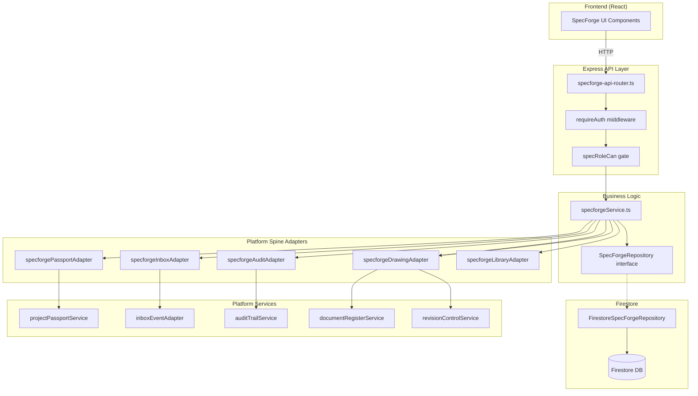
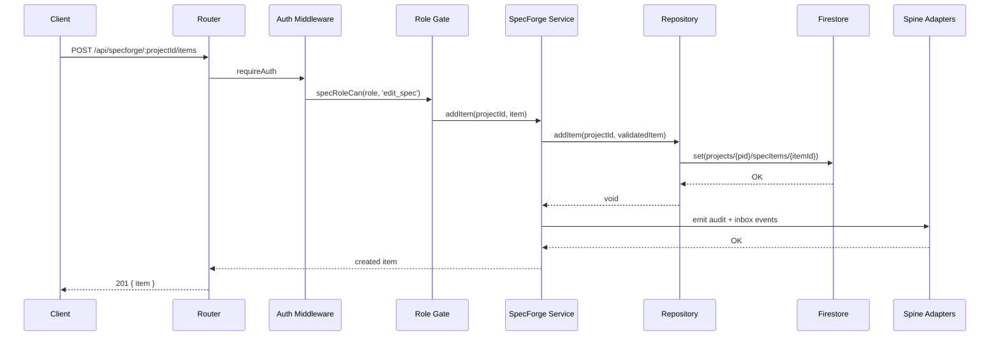
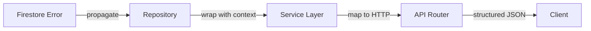

# Design Document: SpecForge Integration

## Overview

This design connects the existing in-memory SpecForge engine (`src/services/specforge/`) to production infrastructure: Firestore persistence, Express API endpoints with role-based access, and five platform spine integrations (Project Passport, Inbox/Action Centre, Audit Trail, Drawing Register, Product Catalogue).

The existing architecture provides a clean seam — `SpecForgeRepository` is an interface with a `LocalSpecForgeRepository` implementation. This design introduces `FirestoreSpecForgeRepository` as the production implementation, a dedicated Express router (`specforge-api-router.ts`), and adapter services that bridge SpecForge events into the platform spine.

### Design Decisions

1. **Dedicated router file** — SpecForge routes go in `src/lib/specforge-api-router.ts` (following the `finance-api-router.ts` pattern) rather than adding to the 6.4K-line `api-router.ts`.
2. **Repository swap via factory** — The existing `getSpecForgeRepository()` / `setSpecForgeRepository()` singleton factory supports runtime swapping. Production initialization sets the Firestore implementation; demo mode retains `LocalSpecForgeRepository`.
3. **Adapter pattern for spine integrations** — Dedicated adapter services (`specforgeInboxAdapter.ts`, `specforgePassportAdapter.ts`, `specforgeAuditAdapter.ts`, `specforgeDrawingAdapter.ts`) keep cross-cutting concerns out of the core service.
4. **Zod validation at repository boundary** — Schemas validate data before Firestore writes, catching malformed data regardless of entry point (API, service call, migration).
5. **Firestore subcollections under `projects/{projectId}`** — Aligns with existing project-scoped patterns and Firestore security rules.

## Architecture



### Request Flow



## Components and Interfaces

### 1. FirestoreSpecForgeRepository

**File:** `src/services/specforge/firestoreSpecForgeRepository.ts`

Implements `SpecForgeRepository` using Firebase Admin SDK. All methods use the `adminDb` instance from `src/lib/firebase-admin.ts`.

```typescript
import { adminDb } from '@/lib/firebase-admin';
import type { SpecForgeRepository } from './specforgeRepository';
import type {
  SpecForgeWorkspace, SpecItem, SpecSection, SpecIssueSnapshot,
  SpecAuditEvent, SpecProcurementEntry, SpecApproval, SpecSubstitution,
} from '@/types/specforgeTypes';

export class FirestoreSpecForgeRepository implements SpecForgeRepository {
  private col(projectId: string, subcol: string) {
    return adminDb.collection('projects').doc(projectId).collection(subcol);
  }

  async getWorkspace(projectId: string): Promise<SpecForgeWorkspace | null>;
  async saveWorkspace(workspace: SpecForgeWorkspace): Promise<void>;
  async addItem(projectId: string, item: SpecItem): Promise<void>;
  async updateItem(projectId: string, itemId: string, updates: Partial<SpecItem>): Promise<void>;
  async deleteItem(projectId: string, itemId: string): Promise<void>;
  async addSection(projectId: string, section: SpecSection): Promise<void>;
  async updateSection(projectId: string, sectionId: string, updates: Partial<SpecSection>): Promise<void>;
  async saveSnapshot(snapshot: SpecIssueSnapshot): Promise<void>;
  async getSnapshots(projectId: string): Promise<SpecIssueSnapshot[]>;
  async logAuditEvent(event: SpecAuditEvent): Promise<void>;
  async getAuditEvents(projectId: string, limit?: number): Promise<SpecAuditEvent[]>;
  async getProcurementEntries(projectId: string): Promise<SpecProcurementEntry[]>;
  async updateProcurementEntry(projectId: string, entryId: string, updates: Partial<SpecProcurementEntry>): Promise<void>;
  async saveApproval(approval: SpecApproval): Promise<void>;
  async getApprovals(projectId: string): Promise<SpecApproval[]>;
  async saveSubstitution(substitution: SpecSubstitution): Promise<void>;
  async getSubstitutions(projectId: string): Promise<SpecSubstitution[]>;
}
```

**Key behaviors:**
- `saveSnapshot` uses Firestore `create()` (not `set()`) to enforce write-once semantics — throws if document exists.
- `logAuditEvent` uses `create()` — append-only, no update/delete methods exposed.
- All write methods validate input against Zod schemas before writing.
- `updateItem` / `updateSection` / `updateProcurementEntry` verify document existence before applying updates (throw `NotFoundError` if missing).

### 2. SpecForge API Router

**File:** `src/lib/specforge-api-router.ts`

Dedicated Express 5 router mounted at `/api/specforge` in the main server.

```typescript
import { Router } from 'express';
import { requireAuth } from './roleMiddleware';

const specforgeRouter = Router();

// All routes require authentication
specforgeRouter.use(requireAuth);

// CRUD
specforgeRouter.get('/:projectId/workspace', getWorkspaceHandler);
specforgeRouter.post('/:projectId/items', requireCapability('edit_spec'), createItemHandler);
specforgeRouter.patch('/:projectId/items/:itemId', requireCapability('edit_spec'), updateItemHandler);
specforgeRouter.delete('/:projectId/items/:itemId', requireCapability('edit_spec'), deleteItemHandler);
specforgeRouter.post('/:projectId/sections', requireCapability('edit_spec'), createSectionHandler);
specforgeRouter.patch('/:projectId/sections/:sectionId', requireCapability('edit_spec'), updateSectionHandler);

// Workflow
specforgeRouter.post('/:projectId/issue', requireCapability('issue_spec'), issueHandler);
specforgeRouter.post('/:projectId/approvals', createApprovalHandler);
specforgeRouter.patch('/:projectId/approvals/:approvalId', updateApprovalHandler);
specforgeRouter.post('/:projectId/substitutions', createSubstitutionHandler);
specforgeRouter.patch('/:projectId/substitutions/:substitutionId', updateSubstitutionHandler);
specforgeRouter.get('/:projectId/procurement', getProcurementHandler);
specforgeRouter.patch('/:projectId/procurement/:entryId', requireCapability('update_procurement_status'), updateProcurementHandler);

// Read-only
specforgeRouter.get('/:projectId/snapshots', getSnapshotsHandler);
specforgeRouter.get('/:projectId/audit', getAuditHandler);

export default specforgeRouter;
```

**`requireCapability` middleware:**
```typescript
function requireCapability(capability: SpecCapability): RequestHandler {
  return (req, res, next) => {
    const role = toSpecForgeRole(req.authContext!.role as UserRole);
    if (!role) {
      return res.status(403).json({ error: 'No SpecForge access for this role' });
    }
    if (!specRoleCan(role, capability)) {
      return res.status(403).json({ error: `Capability denied: ${capability}` });
    }
    next();
  };
}
```

### 3. Spine Adapter Services

#### specforgePassportAdapter.ts

```typescript
export interface SpecForgePassportData {
  budgetSummary: SpecBudgetSummary | null;
  readiness: {
    blockerCount: number;
    pendingClientDecisions: number;
    longLeadItemCount: number;
  } | null;
  issueStatus: SpecIssueStatus | null;
  latestRevision: string | null;
}

export function buildSpecForgePassportData(workspace: SpecForgeWorkspace | null): SpecForgePassportData;
export function specForgeRiskFindings(data: SpecForgePassportData): RiskFinding[];
```

#### specforgeInboxAdapter.ts

```typescript
export function emitApprovalCreatedEvent(approval: SpecApproval, item: SpecItem, projectId: string): Promise<void>;
export function emitClientDecisionEvent(item: SpecItem, projectId: string): Promise<void>;
export function emitIssueNotifications(snapshot: SpecIssueSnapshot, recipients: SpecIssueRecipient[]): Promise<void>;
export function emitSubstitutionEvent(sub: SpecSubstitution, item: SpecItem, projectId: string): Promise<void>;
export function emitBudgetWarning(item: SpecItem, projectId: string): Promise<void>;
export function emitLongLeadWarning(item: SpecItem, projectId: string): Promise<void>;
```

#### specforgeAuditAdapter.ts

```typescript
export function logSpecForgeAction(params: {
  action: SpecAuditAction;
  targetId: string;
  targetType: 'item' | 'section' | 'workspace' | 'snapshot';
  performedBy: string;
  projectId: string;
  previousValue?: string;
  newValue?: string;
}): Promise<void>;
```

#### specforgeDrawingAdapter.ts

```typescript
export interface DrawingRefResolution {
  drawingRef: string;
  drawingNumber: string;
  title: string;
  currentRevision: string;
  discipline: string;
  status: 'current' | 'superseded' | 'not_found';
  supersededBy?: { drawingNumber: string; drawingId: string; revision: string };
}

export function resolveDrawingRefs(drawingRefs: string[], projectId: string): Promise<DrawingRefResolution[]>;
export function buildDrawingWarnings(resolutions: DrawingRefResolution[]): StructuredWarning[];
```

#### specforgeLibraryAdapter.ts

```typescript
export interface LibrarySearchParams {
  query: string;
  scope?: SpecLibraryScope;
  offset?: number;
  limit?: number;
}

export interface LibrarySearchResult {
  items: SpecLibraryItem[];
  total: number;
  error?: boolean;
}

export function searchProductCatalogue(params: LibrarySearchParams): Promise<LibrarySearchResult>;
```

### 4. Zod Validation Schemas

**File:** `src/services/specforge/specforgeSchemas.ts`

```typescript
import { z } from 'zod';

export const specItemSchema = z.object({
  id: z.string().min(1),
  sectionId: z.string().min(1),
  code: z.string().min(1),
  title: z.string().min(1),
  room: z.string(),
  package: z.string(),
  // ... all required fields
});

export const specItemUpdateSchema = specItemSchema.partial().omit({ id: true });
export const specSectionSchema = z.object({ /* ... */ });
export const specSectionUpdateSchema = specSectionSchema.partial().omit({ id: true });
export const specApprovalSchema = z.object({ /* ... */ });
export const specSubstitutionSchema = z.object({ /* ... */ });
export const issueRequestSchema = z.object({
  issuer: z.object({ userId: z.string(), name: z.string(), role: z.string() }),
  recipients: z.array(z.object({ userId: z.string(), name: z.string(), role: z.string(), scope: z.string() })),
});
```

### 5. Repository Factory Enhancement

**File:** `src/services/specforge/specforgeRepository.ts` (updated)

```typescript
export function initSpecForgeRepository(): SpecForgeRepository {
  const isDemoMode = typeof process !== 'undefined'
    ? process.env.VITE_DEMO_MODE === 'true'
    : false;

  if (isDemoMode) {
    return new LocalSpecForgeRepository();
  }
  return new FirestoreSpecForgeRepository();
}
```

## Data Models

### Firestore Collection Structure

```
projects/{projectId}/
├── specWorkspaces/{workspaceId}     # SpecForgeWorkspace document
├── specItems/{itemId}               # SpecItem documents (denormalized from workspace)
├── specSections/{sectionId}         # SpecSection documents
├── specSnapshots/{snapshotId}       # Immutable SpecIssueSnapshot documents
├── specAuditEvents/{eventId}        # Append-only SpecAuditEvent documents
├── specApprovals/{approvalId}       # SpecApproval documents
├── specSubstitutions/{subId}        # SpecSubstitution documents
└── specProcurement/{entryId}        # SpecProcurementEntry documents
```

### Key Document Shapes (Firestore)

**specWorkspaces/{workspaceId}:**
```json
{
  "id": "ws-proj123",
  "projectId": "proj123",
  "projectName": "Greenpoint Office Tower",
  "municipality": "City of Cape Town",
  "stage": "design",
  "profile": "commercial",
  "revision": "C",
  "issueStatus": "draft",
  "team": [{ "userId": "u1", "name": "Jane", "role": "architect", "responsibility": "Lead" }],
  "createdAt": "2026-07-01T00:00:00Z",
  "updatedAt": "2026-07-01T12:00:00Z"
}
```

**specItems/{itemId}:**
```json
{
  "id": "item-001",
  "sectionId": "sec-finishes",
  "code": "FIN-001",
  "title": "Reception Floor Tile",
  "room": "Reception",
  "package": "Finishes",
  "drawingRefs": ["A-100", "A-101"],
  "budgetAllowance": 85000,
  "estimatedCost": 92000,
  "leadTimeDays": 21,
  "clientDecision": false,
  "ownerRole": "architect",
  "status": "draft",
  "sourceRevision": "B"
}
```

**specSnapshots/{snapshotId}:**
```json
{
  "snapshotId": "spec-issue-ws-proj123-C-1719835200000",
  "projectId": "proj123",
  "workspaceId": "ws-proj123",
  "revision": "C",
  "issuedAt": "2026-07-01T12:00:00Z",
  "issuer": { "userId": "u1", "name": "Jane", "role": "architect" },
  "sections": [],
  "items": [],
  "readinessFindings": [],
  "budgetSummary": { "allowance": 500000, "estimate": 520000, "delta": 20000, "deltaPct": 4.0 },
  "auditHash": "a3f8b2c1"
}
```

### Index Requirements

| Collection | Fields | Order | Purpose |
|---|---|---|---|
| `specSnapshots` | `issuedAt` | DESC | getSnapshots query |
| `specAuditEvents` | `performedAt` | DESC | getAuditEvents query |
| `specApprovals` | `requestedAt` | DESC | getApprovals query |
| `specSubstitutions` | `requestedAt` | DESC | getSubstitutions query |
| `specItems` | `sectionId`, `status` | — | Filtered queries |

## Correctness Properties

*A property is a characteristic or behavior that should hold true across all valid executions of a system — essentially, a formal statement about what the system should do. Properties serve as the bridge between human-readable specifications and machine-verifiable correctness guarantees.*

### Property 1: Persistence Round-Trip

*For any* valid `SpecForgeWorkspace`, `SpecItem`, `SpecSection`, `SpecIssueSnapshot`, `SpecApproval`, or `SpecSubstitution`, saving the object via the repository and then retrieving it SHALL produce an object equal to the original (modulo Firestore timestamp serialization).

**Validates: Requirements 1.1, 1.2, 1.3, 1.6, 2.1, 2.3, 3.1, 3.3, 3.5**

### Property 2: Partial Update Field Preservation

*For any* existing `SpecItem`, `SpecSection`, or `SpecProcurementEntry` and any partial update containing a subset of fields, applying the update SHALL change only the specified fields while leaving all other fields unchanged.

**Validates: Requirements 1.4, 1.7, 3.6**

### Property 3: Not-Found Error on Missing Documents

*For any* document ID that does not exist in the target collection, calling `updateItem`, `updateSection`, `deleteItem`, or `updateProcurementEntry` SHALL throw an error indicating the document was not found, and no data SHALL be modified.

**Validates: Requirements 1.9, 3.7**

### Property 4: Schema Validation Rejects Invalid Writes

*For any* object that violates the corresponding Zod schema (missing required fields, wrong types, constraint violations), all repository write methods SHALL reject the operation with a validation error before any data reaches Firestore.

**Validates: Requirements 1.8, 4.12**

### Property 5: Snapshot and Audit Event Immutability

*For any* saved `SpecIssueSnapshot` or `SpecAuditEvent`, any attempt to update or delete the document SHALL be rejected with an immutability/append-only error, and the existing document SHALL remain unchanged.

**Validates: Requirements 2.2, 2.4, 9.5**

### Property 6: Duplicate Snapshot Rejection

*For any* `snapshotId` that already exists in the `specSnapshots` collection, a subsequent call to `saveSnapshot` with the same ID SHALL be rejected with a duplicate error, and the original document SHALL remain unchanged.

**Validates: Requirements 2.7**

### Property 7: Ordered Retrieval with Limit Clamping

*For any* collection query (snapshots, audit events, approvals, substitutions), results SHALL be returned in descending order by their timestamp field, and the result count SHALL respect the specified limit clamped to [1, 500] (or [1, 200] for API audit endpoints), defaulting to 50 when unspecified.

**Validates: Requirements 2.5, 2.6, 3.2, 3.4, 4.10, 4.11**

### Property 8: Role Capability Enforcement

*For any* `SpecForgeRole` and `SpecCapability` pair, `specRoleCan(role, capability)` SHALL return true if and only if the capability exists in the role's defined capability set. For any API request where the user's mapped role lacks the required capability, the API SHALL return 403.

**Validates: Requirements 5.10, 6.1, 6.3**

### Property 9: Item Visibility Filtering by Role

*For any* workspace containing items with mixed statuses, owner roles, reviewer roles, and client decisions, `getVisibleSpecItems` SHALL return only items matching the role's visibility rules:
- `view_all`: all items
- `view_client_items`: items where `clientDecision === true` OR status ∈ {approved, issued}
- `view_issued`: items where status ∈ {issued, rfq, ordered, delivered, installed, as_built}
- `view_assigned`: items where role matches ownerRole, reviewerRole, or approverRole
- `view_package`: items where status ∈ {issued, rfq, ordered, delivered, installed} AND scoped to viewer's assignments
- No view capabilities: empty array

**Validates: Requirements 6.5, 6.6, 6.7, 6.8, 6.9**

### Property 10: Passport Data Correctness

*For any* workspace with items, `buildSpecForgePassportData` SHALL produce a budget summary where `allowance` equals the sum of all item `budgetAllowance` values, `estimate` equals the sum of all `estimatedCost` values, `delta` = estimate − allowance, and readiness counts match the actual count of blockers, pending client decisions, and items with leadTimeDays ≥ 56.

**Validates: Requirements 7.1, 7.2**

### Property 11: Budget Risk Threshold Escalation

*For any* workspace where the budget delta percentage exceeds 10%, the passport risk level SHALL be set to no lower than `high` and SHALL include a risk finding with category `budget`.

**Validates: Requirements 7.5**

### Property 12: Inbox Event Routing to Correct Recipients

*For any* approval creation, client decision change, or substitution request, the generated inbox event SHALL target users with the capability matching the event type (reviewer for approvals, `approve_client_decision` for decisions, `approve_substitution` for substitutions), and SHALL include the item code and section reference.

**Validates: Requirements 8.1, 8.2, 8.4**

### Property 13: Threshold-Based Warning Generation

*For any* spec item where `estimatedCost > budgetAllowance * 1.1`, a budget warning event SHALL be generated for `review_budget` capability holders. *For any* spec item where `leadTimeDays >= 56`, a long-lead warning event SHALL be generated for `view_all` capability holders.

**Validates: Requirements 8.5, 8.6**

### Property 14: Issue Event Fan-Out with Recipient Cap

*For any* issue operation with N recipients (where N ≤ 200), exactly N inbox events SHALL be generated. When N > 200, exactly 200 events SHALL be generated.

**Validates: Requirements 8.3**

### Property 15: Inbox Event Deduplication

*For any* triggering event where an unresolved inbox event with the same trigger type, item code, and recipient already exists, a duplicate event SHALL NOT be generated.

**Validates: Requirements 8.9**

### Property 16: Audit Event Completeness

*For any* successful SpecForge write operation (create, update, delete, issue, approve, substitute, comment, status_change, snapshot_create), a corresponding `SpecAuditEvent` SHALL be persisted with correct action type, target ID, target type, performer identity, and ISO 8601 UTC timestamp.

**Validates: Requirements 9.1**

### Property 17: Audit Change Capture with Cap

*For any* item update, the audit event SHALL record the previous value and new value for each changed field as serialized strings, each capped at 10,000 characters.

**Validates: Requirements 9.2**

### Property 18: Failed Write Produces No Audit Event

*For any* write operation that fails (validation error, not-found, or rolled back), no audit event SHALL be persisted for that operation.

**Validates: Requirements 9.7**

### Property 19: Superseded Drawing Warning Generation

*For any* spec item whose resolved drawing reference has status `superseded`, the API response SHALL include a structured warning object with the affected drawingRef identifier, the superseding drawing reference, and severity "high".

**Validates: Requirements 10.2, 10.3**

### Property 20: Drawing Reference Enrichment Completeness

*For any* resolved drawing reference, the response SHALL include drawingNumber, title, current revision code, discipline, and current status.

**Validates: Requirements 10.5**

### Property 21: Library Search Correctness

*For any* search query with optional scope filter, all returned `SpecLibraryItem` results SHALL match the scope (if provided) AND contain the query string (case-insensitive) in at least one of: title, category, tags, or supplier fields.

**Validates: Requirements 12.2, 12.3**

### Property 22: Library Pagination and Ordering

*For any* library search with offset and limit parameters, the result count SHALL not exceed the specified limit (clamped to [1, 200], default 50), and results SHALL be sorted by `usageCount` descending.

**Validates: Requirements 12.6, 12.8**

### Property 23: Auto-Workspace Creation for New Projects

*For any* project ID that has no existing workspace in Firestore, navigating to SpecForge SHALL create a new workspace with that project's ID, name, `issueStatus: 'draft'`, empty items array, and sections seeded from the project's discipline (or empty if no discipline defined).

**Validates: Requirements 11.2, 11.5**


## Error Handling

### Error Categories

| Category | HTTP Status | Example | Handling |
|----------|------------|---------|----------|
| **Validation** | 400 | Invalid Zod schema input | Return structured Zod error details (field path + rule) |
| **Authentication** | 401 | Missing/invalid Bearer token | Return `{ error: 'Authentication required' }` |
| **Authorization** | 403 | Role lacks capability | Return `{ error: 'Capability denied: {capability}' }` |
| **Not Found** | 404 | Item/workspace/approval doesn't exist | Return `{ error: '{resource} not found' }` |
| **Conflict** | 409 | Duplicate snapshot ID | Return `{ error: 'Snapshot already exists' }` |
| **Business Logic** | 400 | Issue blocked by readiness findings | Return `{ error: '{reason}' }` with specific blocker info |
| **Service Degradation** | 200 (partial) | Drawing Register unavailable | Return data with `{ degraded: true, services: ['drawingRegister'] }` |
| **Internal** | 500 | Firestore network failure | Return `{ error: 'Internal server error' }`, log details server-side |

### Error Propagation Strategy



1. **Repository layer** — Catches Firestore errors, wraps with domain context (e.g., "item not found" vs raw Firestore "not-found"). Validation errors thrown before any write attempt.
2. **Service layer** — Business logic errors (readiness blockers, capability denied) thrown as typed errors with descriptive messages.
3. **API router** — Catches all errors, maps to appropriate HTTP status. Never leaks internal error details or stack traces to clients.
4. **Spine adapters** — Failures in non-critical spine operations (inbox, audit to platform service) are logged but do NOT fail the primary operation. Audit to SpecForge collection always succeeds or the primary operation fails atomically.

### Resilience Patterns

- **Drawing Register degradation** — If the Drawing Register is unavailable, return spec items with unresolved `drawingRefs` and include a `degraded` flag. Cache last-known revision status for 60 seconds.
- **Platform audit retry** — If the platform-wide audit service is unavailable, persist the event in the SpecForge-specific collection and queue it for retry (exponential backoff, max 3 retries).
- **Product catalogue fallback** — If the product catalogue data source is unavailable, return an empty array with an `error: true` indicator to distinguish from genuine no-results.
- **Inbox event idempotency** — Before creating an inbox event, check for existing unresolved events with the same trigger type + item + recipient. Skip creation if duplicate found.

### Custom Error Classes

```typescript
export class SpecForgeValidationError extends Error {
  constructor(public readonly zodErrors: z.ZodIssue[]) {
    super('Validation failed');
    this.name = 'SpecForgeValidationError';
  }
}

export class SpecForgeNotFoundError extends Error {
  constructor(public readonly resource: string, public readonly id: string) {
    super(`${resource} not found: ${id}`);
    this.name = 'SpecForgeNotFoundError';
  }
}

export class SpecForgeImmutableError extends Error {
  constructor(public readonly resource: string) {
    super(`${resource} is immutable and cannot be modified`);
    this.name = 'SpecForgeImmutableError';
  }
}

export class SpecForgeCapabilityError extends Error {
  constructor(public readonly role: string, public readonly capability: string) {
    super(`Role "${role}" lacks capability: ${capability}`);
    this.name = 'SpecForgeCapabilityError';
  }
}
```

## Testing Strategy

### Dual Testing Approach

This feature uses both **unit/example-based tests** and **property-based tests** for comprehensive coverage:

- **Property-based tests** (via `fast-check`) — Verify universal invariants across generated inputs. Each property test runs a minimum of 100 iterations.
- **Unit tests** (via Vitest) — Verify specific examples, integration points, error conditions, and edge cases.
- **Integration tests** — Verify Firestore persistence, API endpoint wiring, and spine adapter connectivity.

### Property-Based Testing (fast-check)

Each correctness property maps to one property-based test. Tests use `fast-check` (the standard PBT library for TypeScript/Vitest).

**Configuration:**
- Minimum 100 iterations per property test
- Each test tagged with: `Feature: specforge-integration, Property {N}: {title}`
- Custom arbitraries for SpecForge domain types (items, sections, workspaces, roles)

**Test file structure:**
```
src/services/specforge/__tests__/
├── firestoreRepository.test.ts         # Unit: repository operations
├── firestoreRepository.property.test.ts # PBT: Properties 1-7
├── specforgeService.property.test.ts    # PBT: Properties 8-11
├── specforgeApiRouter.test.ts           # Unit: API endpoint integration
├── specforgeInboxAdapter.property.test.ts # PBT: Properties 12-15
├── specforgeAuditAdapter.property.test.ts # PBT: Properties 16-18
├── specforgeDrawingAdapter.property.test.ts # PBT: Properties 19-20
├── specforgeLibraryAdapter.property.test.ts # PBT: Properties 21-22
└── specforgeWorkspace.property.test.ts  # PBT: Property 23
```

**Custom Arbitraries:**
```typescript
// Example: arbitrary for SpecItem
const arbSpecItem = fc.record({
  id: fc.uuid(),
  sectionId: fc.uuid(),
  code: fc.stringOf(fc.constantFrom(...'ABCDEFGHIJKLMNOPQRSTUVWXYZ'), { minLength: 3, maxLength: 7 }),
  title: fc.string({ minLength: 1, maxLength: 200 }),
  room: fc.string({ maxLength: 100 }),
  package: fc.string({ maxLength: 100 }),
  drawingRefs: fc.array(fc.string({ minLength: 1, maxLength: 20 }), { maxLength: 10 }),
  clauseRefs: fc.array(fc.string(), { maxLength: 5 }),
  budgetAllowance: fc.nat({ max: 10_000_000 }),
  estimatedCost: fc.nat({ max: 10_000_000 }),
  leadTimeDays: fc.nat({ max: 365 }),
  clientDecision: fc.boolean(),
  ownerRole: arbSpecForgeRole,
  status: arbSpecItemStatus,
  sourceRevision: fc.stringOf(fc.constantFrom(...'ABCDEFGHIJKLMNOPQRSTUVWXYZ'), { minLength: 1, maxLength: 2 }),
});
```

### Unit Test Coverage

| Domain | Test Focus | Examples |
|--------|-----------|----------|
| Repository | Firestore mock interactions | saveWorkspace writes correct path; getWorkspace returns null for missing |
| API Router | Request/response shape | 404 for missing items; 400 for invalid payloads; 201 for valid creates |
| Role Gate | Capability enforcement | town_planner gets 403; architect gets 200 for edit_spec |
| Issue Workflow | Blocker detection | Issue rejected with superseded items; issue succeeds when ready |
| Drawing Adapter | Degradation handling | Unavailable Drawing Register returns degraded flag |
| Library Adapter | Data source switching | Demo mode uses mock; production mode queries catalogue |

### Integration Test Coverage

| Scenario | Approach |
|----------|----------|
| Firestore persistence end-to-end | Firestore emulator (or mock `adminDb`) |
| API auth + role chain | Supertest with mocked Firebase Auth |
| Passport integration | Call buildProjectPassport with real SpecForge data |
| Inbox event generation timing | Verify async event emitted within acceptable window |
| Drawing Register resolution | Mock documentRegisterService responses |

### Mocking Strategy

- **Firestore** — Unit tests mock `adminDb` methods. Integration tests use Firestore emulator.
- **Auth** — Mock `auth.verifyIdToken` to return test user claims with specific roles.
- **Drawing Register** — Mock `documentRegisterService` and `revisionControlService` for drawing resolution tests.
- **Platform Audit Service** — Mock to test retry/fallback logic.
- **Product Catalogue** — Mock data source for library search tests.

### Test Commands

```bash
npm test -- src/services/specforge/          # All SpecForge tests
npm test -- --grep "Property"                # Property-based tests only
npm test -- src/lib/__tests__/specforge-api  # API router tests
```
