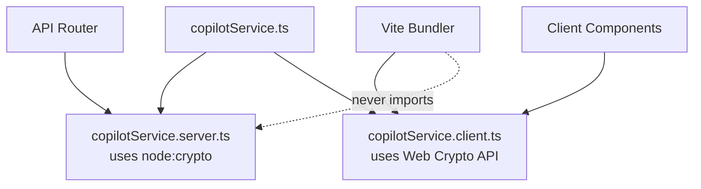

# Design Document: SpecForge Spine Hardening

## Overview

This design document specifies the technical approach for hardening the SpecForge specification spine to full production readiness within the Architex platform. The work addresses 12 requirement areas ranging from infrastructure blockers (router mounts, build fixes, type safety) through feature completions (standalone mode, client approval flow, QS review, supplier visibility, procurement lifecycle) to cross-cutting governance guardrails.

The existing SpecForge implementation provides a solid foundation: typed data models (`specforgeTypes.ts`), a repository abstraction with both local and Firestore implementations, a Zod validation layer (`specforgeSchemas.ts`), an Express 5 API router with capability-based auth, and core business logic in `specforgeService.ts`. This design extends that foundation to production readiness without replacing the existing patterns.

### Key Design Decisions

1. **Extend, don't replace**: All new endpoints follow the existing `specforge-api-router.ts` pattern (capability middleware → Zod validation → repository write → audit + inbox emit).
2. **Server-side security only**: The Supplier Visibility Filter is purely server-side — no client-side filtering for security enforcement.
3. **Repository interface expansion**: New collections (standalone workspaces, package assignments, product catalogue, purchase orders, quotes, deliveries, warranties) are accessed through the existing `SpecForgeRepository` interface pattern.
4. **Atomic operations via Firestore batched writes**: Multi-document transitions (workspace migration, substitution approval, award confirmation) use Firestore batch/transaction semantics.
5. **RFQ writeback correction**: The existing `rfqIntegrationService.ts` is refactored to write to the correct `specProcurement` collection using the repository interface, eliminating the legacy path.

---

## Architecture

### High-Level System Architecture

```mermaid
graph TB
    subgraph Client["Browser (Vite Bundle)"]
        UI[SpecForge Workspace UI]
        API_CLIENT[apiClient.ts]
    end

    subgraph Servers["Express 5 Servers"]
        DEV[server.ts - Dev]
        PROD[api-server.ts - Prod]
    end

    subgraph Router["SpecForge API Layer"]
        SF_ROUTER[specforge-api-router.ts]
        AUTH[requireAuth + requireCapability]
        VISIBILITY[SupplierVisibilityFilter]
    end

    subgraph Services["Business Logic"]
        SF_SERVICE[specforgeService.ts]
        APPROVAL[clientDecisionService.ts]
        QS[qsReviewService.ts]
        PROCUREMENT[procurementLifecycleService.ts]
        SUBSTITUTION[substitutionService.ts]
        CATALOGUE[productCatalogueAdapter.ts]
        STANDALONE[standaloneWorkspaceService.ts]
        RFQ_WB[rfqWritebackService.ts]
    end

    subgraph Repository["Persistence Layer"]
        REPO_IF[SpecForgeRepository Interface]
        FIRESTORE_REPO[FirestoreSpecForgeRepository]
        LOCAL_REPO[LocalSpecForgeRepository]
    end

    subgraph Firestore["Firebase Firestore"]
        PROJECTS[projects/{pid}/spec*]
        STANDALONE_COL[users/{uid}/standaloneSpecForgeWorkspaces]
        FIRM_COL[firms/{fid}/standaloneSpecForgeWorkspaces]
        CATALOGUE_COL[productCatalogue]
        PKG_ASSIGN[specPackageAssignments]
    end

    subgraph CrossCutting["Cross-Cutting Concerns"]
        AUDIT[specforgeAuditAdapter.ts]
        INBOX[specforgeInboxAdapter.ts]
        PASSPORT[projectPassportService.ts]
    end

    UI --> API_CLIENT
    API_CLIENT --> DEV
    API_CLIENT --> PROD
    DEV --> SF_ROUTER
    PROD --> SF_ROUTER
    SF_ROUTER --> AUTH
    AUTH --> VISIBILITY
    VISIBILITY --> SF_SERVICE
    SF_ROUTER --> APPROVAL
    SF_ROUTER --> QS
    SF_ROUTER --> PROCUREMENT
    SF_ROUTER --> SUBSTITUTION
    SF_ROUTER --> CATALOGUE
    SF_ROUTER --> STANDALONE
    SF_ROUTER --> RFQ_WB
    SF_SERVICE --> REPO_IF
    APPROVAL --> REPO_IF
    QS --> REPO_IF
    PROCUREMENT --> REPO_IF
    SUBSTITUTION --> REPO_IF
    CATALOGUE --> REPO_IF
    STANDALONE --> REPO_IF
    REPO_IF --> FIRESTORE_REPO
    REPO_IF --> LOCAL_REPO
    FIRESTORE_REPO --> PROJECTS
    FIRESTORE_REPO --> STANDALONE_COL
    FIRESTORE_REPO --> FIRM_COL
    FIRESTORE_REPO --> CATALOGUE_COL
    FIRESTORE_REPO --> PKG_ASSIGN
    SF_ROUTER --> AUDIT
    SF_ROUTER --> INBOX
    SF_ROUTER --> PASSPORT
```

### Router Mount Strategy (Requirements 1, 2)

Both `server.ts` and `api-server.ts` mount the SpecForge router via lazy-loaded dynamic import at `/api/specforge`, positioned **before** the generic `/api` catch-all:

```mermaid
graph LR
    REQ[Incoming Request] --> HEALTH[/api/health]
    REQ --> MARKET[/api/marketplace]
    REQ --> FEE[/api/fee-proposal]
    REQ --> PRACTICE[/api/practice]
    REQ --> BIM[/api/bim]
    REQ --> SPECFORGE["/api/specforge ← NEW"]
    REQ --> FORMS[/api/forms]
    REQ --> GENERIC["/api (catch-all)"]
    REQ --> NOTFOUND[404]
```

### Build Isolation Strategy (Requirement 2)



---

## Components and Interfaces

### 1. Router Mount Component (Req 1)

**Files Modified**: `server.ts`, `api-server.ts`

Both servers gain a new mount block following the established pattern:

```typescript
// Mount SpecForge API router (BEFORE catch-all /api mount)
app.use('/api/specforge', async (req, res, next) => {
  try {
    const { default: specforgeRouter } = await import('./src/lib/specforge-api-router.ts');
    return specforgeRouter(req, res, next);
  } catch (error) {
    console.error('Failed to load SpecForge API router:', error);
    return res.status(500).json({
      error: 'SpecForge API router failed to initialize',
      details: error instanceof Error ? error.message : String(error),
    });
  }
});
```

### 2. Build Isolation Component (Req 2)

**Files Modified/Created**: Any service using `node:crypto` in client-importable paths

Strategy:
- Identify all modules imported by client-side code that transitively reference `node:crypto`
- Replace `crypto.randomUUID()` with `globalThis.crypto.randomUUID()` (Web Crypto, works in all modern browsers and Node 19+)
- For hashing/HMAC operations: isolate to `.server.ts` suffixed files excluded from client bundle via Vite config

**Vite Config Addition**:
```typescript
// vite.config.ts - ensure node builtins are externalized for SSR only
build: {
  rollupOptions: {
    external: (id) => /^node:/.test(id) ? 'ssr-only' : false,
  }
}
```

### 3. TypeScript Baseline Component (Req 3)

**Files Modified**: `src/types.ts`, `src/types/specforgeTypes.ts`

The `UserRole` type must include `admin` to match the `toSpecForgeRole` mapping. Currently `UserRole` has `platform_admin` but the mapping references `admin`. The fix ensures the mapping uses `Partial<Record<UserRole, SpecForgeRole>>` with no assertions.

### 4. Standalone Workspace Service (Req 4)

**New File**: `src/services/specforge/standaloneWorkspaceService.ts`

```typescript
export interface StandaloneWorkspace extends SpecForgeWorkspace {
  scope: 'user' | 'firm';
  ownerId: string;           // uid or firmId
  projectReference: string;  // free-text, 1-500 chars
  assignedToProjectId?: string;
  assignedAt?: string;
}

export interface StandaloneWorkspaceService {
  create(params: CreateStandaloneParams): Promise<StandaloneWorkspace>;
  list(uid: string, firmIds: string[]): Promise<StandaloneWorkspace[]>;
  assignToProject(workspaceId: string, projectId: string, userId: string): Promise<void>;
}
```

**Firestore Paths**:
- User-scoped: `users/{uid}/standaloneSpecForgeWorkspaces/{workspaceId}`
- Firm-scoped: `firms/{firmId}/standaloneSpecForgeWorkspaces/{workspaceId}`

### 5. Client Decision Endpoint (Req 5)

**Route**: `POST /api/specforge/:projectId/items/:itemId/client-decision`

**Required Capability**: `approve_client_decision`

```typescript
interface ClientDecisionPayload {
  decision: 'approved' | 'rejected';
  comment?: string;  // max 2000 chars
}

interface ClientDecisionResponse {
  success: boolean;
  itemId: string;
  decision: 'approved' | 'rejected';
  decidedAt: string;
}
```

### 6. QS Review Endpoint (Req 6)

**Route**: `POST /api/specforge/:projectId/items/:itemId/qs-review`

**Required Capability**: `review_budget`

```typescript
interface QsReviewPayload {
  reviewStatus: 'approved' | 'flagged' | 'requires_revision';
  comments: string;            // non-empty, max 2000 chars
  revisedEstimate?: number;    // ZAR, 0.01–999,999,999.99
}

interface QsReviewResponse {
  success: boolean;
  itemId: string;
  reviewStatus: string;
  budgetWarning?: boolean;
}
```

### 7. Supplier Visibility Filter (Req 7)

**New File**: `src/services/specforge/supplierVisibilityFilter.ts`

```typescript
export interface PackageAssignment {
  id: string;
  packageId: string;
  supplierUid: string;
  sectionIds: string[];
  itemIds: string[];
  assignedAt: string;
  assignedBy: string;
  status: 'active' | 'revoked';
}

export interface SupplierVisibilityFilter {
  getVisibleItems(projectId: string, uid: string, role: SpecForgeRole): Promise<SpecItem[]>;
  getVisibleProcurement(projectId: string, uid: string, firmName: string): Promise<SpecProcurementEntry[]>;
  getVisibleRfqs(projectId: string, uid: string): Promise<RfqDocument[]>;
}
```

**Enforcement**: Applied as Express middleware on relevant GET endpoints when the user's role is `supplier` or `subcontractor`. The filter queries `specPackageAssignments` for matching UIDs and returns only the union of items across assigned packages.

### 8. RFQ Writeback Correction (Req 8)

**Files Modified**: `src/services/rfqMarketplace/rfqIntegrationService.ts`

The existing `writeBackToSpecForge` function is rewritten to:
1. Use the `SpecForgeRepository.updateProcurementEntry()` method instead of direct Firestore `setDoc` calls
2. Write to `projects/{projectId}/specProcurement/{entryId}` (correct path)
3. Remove all references to the legacy path `projects/{projectId}/specforge/entries/{id}/data`
4. Create new procurement entries via repository if `specProcurementEntryId` doesn't exist
5. Write audit events to `projects/{projectId}/specAuditEvents`

### 9. Product Catalogue Adapter (Req 9)

**New File**: `src/services/specforge/productCatalogueAdapter.ts`

```typescript
export interface SupplierConnector {
  searchProducts(query: string, filters?: ProductFilter[]): Promise<SpecLibraryItem[]>;
  getProductDetail(productId: string): Promise<ProductDetail | null>;
  checkAvailability(productId: string): Promise<AvailabilityStatus>;
  getPricing(productId: string, quantity: number): Promise<PricingResponse>;
}

export type ConnectorLevel = 0 | 1 | 2 | 3 | 4 | 5 | 6;

export interface ProductCatalogueAdapter {
  search(params: CatalogueSearchParams): Promise<CatalogueSearchResult>;
  uploadCsv(firmId: string, file: Buffer, userId: string): Promise<CsvImportResult>;
}

export interface CatalogueSearchParams {
  query: string;
  scope?: SpecLibraryScope;
  userId: string;
  firmId: string;
  offset?: number;   // default 0
  limit?: number;    // default 50, max 200
}

export interface CatalogueSearchResult {
  items: SpecLibraryItem[];
  total: number;
  offset: number;
  limit: number;
  degraded?: boolean;
  specifileLicenseRequired?: boolean;
}

export interface CsvImportResult {
  imported: number;
  rejected: number;
  rejections: Array<{ row: number; reason: string }>;
}
```

### 10. Procurement Lifecycle Service (Req 10)

**New File**: `src/services/specforge/procurementLifecycleService.ts`

```typescript
export interface ProcurementLifecycleService {
  verifyApprovedBaseline(projectId: string): Promise<boolean>;
  createRfq(projectId: string, params: CreateRfqParams): Promise<RfqDocument>;
  submitQuote(projectId: string, rfqId: string, quote: SupplierQuote): Promise<void>;
  requestAward(projectId: string, entryId: string, supplierId: string): Promise<AwardRequest>;
  approveAward(projectId: string, awardId: string, approverId: string): Promise<PurchaseOrder>;
  rejectAward(projectId: string, awardId: string, reason: string): Promise<void>;
  recordDelivery(projectId: string, entryId: string, delivery: DeliveryRecord): Promise<void>;
  confirmSiteAcceptance(projectId: string, entryId: string, userId: string): Promise<void>;
  uploadWarranty(projectId: string, entryId: string, warranty: WarrantyRecord): Promise<void>;
  checkCloseoutEligibility(projectId: string, entryId: string): Promise<boolean>;
  calculateLatestOrderDate(projectId: string, entryId: string): Promise<Date | null>;
}
```

### 11. Substitution Endpoint Service (Req 11)

**Routes**:
- `POST /api/specforge/:projectId/substitutions` (requires `request_substitution`)
- `PATCH /api/specforge/:projectId/substitutions/:substitutionId` (requires `approve_substitution`)

```typescript
export interface SubstitutionRequest {
  originalItemId: string;     // non-empty
  proposedTitle: string;      // non-empty, max 200 chars
  reason: string;             // non-empty, max 1000 chars
  proposedSupplier?: string;
  proposedCost?: number;
}

export interface SubstitutionApproval {
  decision: 'approved' | 'rejected';
  comments?: string;          // max 2000 chars
  approverRole: 'technical' | 'client' | 'professional';
}
```

### 12. Cross-Cutting Governance (Req 12)

**Enhanced Interfaces in existing adapters**:

```typescript
// specforgeAuditAdapter.ts — enhanced event schema
export interface EnhancedAuditEvent {
  id: string;
  workspaceId: string;
  action: SpecAuditAction;
  targetId: string;
  targetType: 'item' | 'section' | 'workspace' | 'snapshot' | 'procurement' | 'substitution' | 'approval';
  performedBy: string;
  performedAt: string;          // ISO 8601 UTC
  previousValue?: string;       // max 10,000 chars
  newValue?: string;            // max 10,000 chars
  details?: string;
}

// specforgeInboxAdapter.ts — enhanced inbox event
export interface EnhancedInboxEvent {
  id: string;
  targetUsers?: string[];       // specific UIDs
  targetRole?: SpecForgeRole;   // or broadcast to role
  eventType: string;
  sourceEntityType: string;
  sourceEntityId: string;
  message: string;              // max 500 chars
  deepLinkRoute: string;        // e.g. /specforge/{projectId}/items/{itemId}
  createdAt: string;
}
```

---

## Data Models

### Firestore Collection Map

```
projects/{projectId}/
├── specWorkspaces/{workspaceId}          — workspace documents
├── specItems/{itemId}                    — individual spec items
├── specSections/{sectionId}             — spec sections
├── specSnapshots/{snapshotId}           — immutable issue snapshots
├── specAuditEvents/{eventId}            — audit trail
├── specApprovals/{approvalId}           — approval records
├── specSubstitutions/{subId}            — substitution requests
├── specProcurement/{entryId}            — procurement entries
├── specPackageAssignments/{assignId}    — supplier package assignments
├── specQuotes/{quoteId}                 — supplier quotes (new)
├── specPurchaseOrders/{poId}           — purchase orders (new)
├── specDeliveries/{deliveryId}          — delivery records (new)
├── specWarranties/{warrantyId}          — warranty documentation (new)
├── specAddenda/{addendumId}             — post-RFQ addenda (new)

users/{uid}/
├── standaloneSpecForgeWorkspaces/{wsId} — user-scoped standalone workspaces

firms/{firmId}/
├── standaloneSpecForgeWorkspaces/{wsId} — firm-scoped standalone workspaces
├── productCatalogue/{productId}        — firm product library

productCatalogue/{productId}             — platform-wide product catalogue
```

### New/Extended Type Definitions

```typescript
// ── Standalone Workspace Extension ──────────────────────────────────────

export interface StandaloneSpecForgeWorkspace extends SpecForgeWorkspace {
  scope: 'user' | 'firm';
  ownerId: string;
  projectReference: string;       // free-text, 1-500 chars
  assignedToProjectId?: string;
  assignedAt?: string;
  createdAt: string;
  updatedAt: string;
}

// ── Package Assignment ──────────────────────────────────────────────────

export interface SpecPackageAssignment {
  id: string;
  packageId: string;
  supplierUid: string;
  firmName: string;
  sectionIds: string[];
  itemIds: string[];
  assignedAt: string;
  assignedBy: string;
  status: 'active' | 'revoked';
  revokedAt?: string;
}

// ── Supplier Quote ──────────────────────────────────────────────────────

export interface SpecSupplierQuote {
  id: string;
  procurementEntryId: string;
  specItemId: string;
  rfqId: string;
  supplierUid: string;
  supplierFirmName: string;
  unitRate: number;              // ZAR
  totalCost: number;            // ZAR
  leadTimeDays: number;
  warrantyTerms: string;
  warrantyDurationMonths: number;
  warrantyCoverageScope: string;
  bbbeeLevel: number;           // 1-8
  submittedAt: string;
  notes?: string;
}

// ── Purchase Order ──────────────────────────────────────────────────────

export interface SpecPurchaseOrder {
  id: string;
  poNumber: string;             // system-generated, unique
  procurementEntryId: string;
  specItemIds: string[];
  supplierUid: string;
  supplierFirmName: string;
  unitRates: Record<string, number>;
  totalCost: number;
  deliverySchedule: DeliveryScheduleEntry[];
  paymentTerms: string;
  status: 'draft' | 'issued' | 'accepted' | 'completed' | 'cancelled';
  generatedAt: string;
  acceptedAt?: string;
}

export interface DeliveryScheduleEntry {
  lineItemId: string;
  expectedDate: string;         // ISO 8601
  quantity: number;
}

// ── Delivery Record ─────────────────────────────────────────────────────

export interface SpecDeliveryRecord {
  id: string;
  procurementEntryId: string;
  poId: string;
  specItemId: string;
  deliveryStatus: 'partial' | 'full' | 'rejected';
  quantityOrdered: number;
  quantityDelivered: number;
  rejectionReason?: string;
  deliveredAt: string;
  recordedBy: string;
  siteAccepted: boolean;
  siteAcceptedBy?: string;
  siteAcceptedAt?: string;
  paymentReleaseBlocked: boolean;
}

// ── Warranty Record ─────────────────────────────────────────────────────

export interface SpecWarrantyRecord {
  id: string;
  procurementEntryId: string;
  specItemId: string;
  warrantyStartDate: string;    // ISO 8601
  warrantyDurationMonths: number;
  terms: string;
  documentRefs: string[];       // min 1 document reference
  uploadedBy: string;
  uploadedAt: string;
}

// ── Addendum ────────────────────────────────────────────────────────────

export interface SpecAddendum {
  id: string;
  specItemId: string;
  rfqId: string;
  changeSummary: string;
  initiatedBy: string;
  initiatedAt: string;
  notifiedSuppliers: string[];
}

// ── Award Request ───────────────────────────────────────────────────────

export interface SpecAwardRequest {
  id: string;
  procurementEntryId: string;
  specItemId: string;
  selectedSupplierUid: string;
  selectedQuoteId: string;
  requestedBy: string;
  requestedAt: string;
  status: 'pending_approval' | 'approved' | 'rejected';
  approvedBy?: string;
  approvedAt?: string;
  rejectionReason?: string;
}

// ── Client Decision Record (on SpecItem) ────────────────────────────────

// Added fields to SpecItem interface:
export interface SpecItemClientDecisionFields {
  clientDecisionStatus?: 'approved' | 'rejected';
  decidedBy?: string;
  decidedAt?: string;
  decisionComment?: string;
}

// ── QS Review Record ────────────────────────────────────────────────────

export interface SpecQsReview {
  id: string;
  itemId: string;
  reviewerUid: string;
  reviewStatus: 'approved' | 'flagged' | 'requires_revision';
  comments: string;
  revisedEstimate?: number;
  previousEstimatedCost?: number;
  reviewedAt: string;
}

// ── Enhanced Procurement Entry ──────────────────────────────────────────

export type ExtendedProcurementStatus =
  | 'not_started' | 'rfq_sent' | 'quoted' | 'pending_award'
  | 'ordered' | 'dispatched' | 'partial_delivery' | 'delivered'
  | 'site_accepted' | 'installed' | 'warranty_uploaded' | 'closed';

export interface ExtendedSpecProcurementEntry extends SpecProcurementEntry {
  status: ExtendedProcurementStatus;
  awardRequestId?: string;
  purchaseOrderId?: string;
  latestOrderDate?: string;
  missingLeadTime?: boolean;
  siteAccepted?: boolean;
  warrantyUploaded?: boolean;
  closeoutEligible?: boolean;
}
```

### Zod Validation Schemas (New)

```typescript
// Client Decision
export const clientDecisionSchema = z.object({
  decision: z.enum(['approved', 'rejected']),
  comment: z.string().max(2000).optional(),
});

// QS Review
export const qsReviewSchema = z.object({
  reviewStatus: z.enum(['approved', 'flagged', 'requires_revision']),
  comments: z.string().min(1).max(2000),
  revisedEstimate: z.number().min(0.01).max(999_999_999.99).optional(),
});

// Substitution Request
export const substitutionRequestSchema = z.object({
  originalItemId: z.string().min(1),
  proposedTitle: z.string().min(1).max(200),
  reason: z.string().min(1).max(1000),
  proposedSupplier: z.string().optional(),
  proposedCost: z.number().min(0).optional(),
});

// Substitution Approval
export const substitutionApprovalSchema = z.object({
  decision: z.enum(['approved', 'rejected']),
  comments: z.string().max(2000).optional(),
});

// Standalone Workspace Creation
export const standaloneWorkspaceCreateSchema = z.object({
  projectReference: z.string().min(1).max(500),
  scope: z.enum(['user', 'firm']),
  firmId: z.string().optional(),
  name: z.string().min(1).max(200),
});

// Package Assignment
export const packageAssignmentSchema = z.object({
  packageId: z.string().min(1),
  supplierUid: z.string().min(1),
  firmName: z.string().min(1),
  sectionIds: z.array(z.string()).default([]),
  itemIds: z.array(z.string()).default([]),
});

// CSV Upload Constraints
export const csvUploadConstraints = {
  maxFileSize: 10 * 1024 * 1024,  // 10 MB
  maxRows: 5000,
};
```

---


## Correctness Properties

*A property is a characteristic or behavior that should hold true across all valid executions of a system — essentially, a formal statement about what the system should do. Properties serve as the bridge between human-readable specifications and machine-verifiable correctness guarantees.*

### Property 1: Capability Enforcement

*For any* API endpoint that declares a required capability, and *for any* authenticated user whose SpecForge role does NOT include that capability, the endpoint SHALL return a 403 response without performing the requested operation.

**Validates: Requirements 5.1, 6.1, 11.1, 11.2**

### Property 2: Client Decision Write Isolation

*For any* valid client decision payload (decision ∈ {approved, rejected}, optional comment ≤ 2000 chars) and *for any* additional fields included in the request body beyond `decision` and `comment`, the spec item record SHALL be updated with ONLY the decision status, `decidedBy`, `decidedAt`, and `decisionComment` fields — all other item fields SHALL remain unchanged.

**Validates: Requirements 5.2, 5.5, 5.8**

### Property 3: QS Review Input Validation

*For any* request body submitted to the QS review endpoint that is missing `reviewStatus` or `comments`, or where `reviewStatus` is not one of {approved, flagged, requires_revision}, or `comments` is empty or exceeds 2000 characters, or `revisedEstimate` is present but outside [0.01, 999,999,999.99], the endpoint SHALL return a 400 response without writing any record.

**Validates: Requirements 6.3**

### Property 4: QS Budget Threshold Warning

*For any* QS review where the item's resulting `estimatedCost` exceeds `budgetAllowance` by more than 10%, an Inbox_Event SHALL be generated for users with `view_all` and `approve_client_decision` capabilities. Conversely, *for any* review where the overage is ≤ 10%, no budget warning Inbox_Event SHALL be generated.

**Validates: Requirements 6.5**

### Property 5: QS Revised Estimate Propagation

*For any* valid QS review containing a `revisedEstimate` value, the item's `estimatedCost` field SHALL be updated to equal the `revisedEstimate` value after the review is recorded.

**Validates: Requirements 6.6**

### Property 6: Supplier Visibility Filter Correctness

*For any* user with `supplier` or `subcontractor` role, and *for any* set of spec items in a project, the items returned by the API SHALL be exactly the set satisfying ALL of: (a) item status ∈ {issued, rfq, ordered, delivered, installed}, AND (b) the item belongs to a package assigned to the user's UID via `specPackageAssignments`. If the user has no matching assignments, the result SHALL be empty. Budget summaries, other supplier quote data, client commercial data, and QS review notes SHALL never appear in responses.

**Validates: Requirements 7.1, 7.2, 7.5, 7.7, 7.8**

### Property 7: RFQ Writeback Path Correctness

*For any* invocation of `writeBackToSpecForge` with valid award data, all procurement updates SHALL be written to `projects/{projectId}/specProcurement/{entryId}` using the repository interface. Zero reads or writes SHALL occur against the legacy path `projects/{projectId}/specforge/entries/{id}/data`.

**Validates: Requirements 8.1, 8.4, 8.8**

### Property 8: Product Catalogue Scope Filtering

*For any* product catalogue search with a specified scope, the results SHALL contain only products visible to the querying user's context: personal scope returns items matching `userId`, practice scope returns items matching `firmId`, and platform/manufacturer/standards scopes return items within those scopes without tenant restriction.

**Validates: Requirements 9.2**

### Property 9: CSV Import Partial Success

*For any* CSV upload containing N rows where V rows pass validation and (N-V) rows fail validation, exactly V rows SHALL be persisted to the firm's product collection, and the response SHALL report `imported = V`, `rejected = N-V`, and include a rejection reason with row number for each rejected row.

**Validates: Requirements 9.3, 9.9**

### Property 10: Product Normalization

*For any* product returned from any data source (Firestore, CSV, connector), the normalized output SHALL conform to the `SpecLibraryItem` type including: `typicalCostRange` with {min, max} in whole Rands, `leadTimeRange` with {min, max} as positive integers (calendar days), `sustainabilityNotes` as string, `commonFinishes` as string array, and `clauseRefs` as string array.

**Validates: Requirements 9.7**

### Property 11: Pagination Limit Clamping

*For any* catalogue search request where the `limit` parameter exceeds 200, the effective limit SHALL be clamped to 200. The result set size SHALL never exceed the effective limit.

**Validates: Requirements 9.8**

### Property 12: Procurement Requires Approved Baseline

*For any* procurement operation (RFQ creation, order placement, PO generation) attempted on a project, the operation SHALL be rejected with a 400 response if no issued snapshot with `issueStatus = 'issued_snapshot'` exists for the project. This applies to both project-scoped workspaces and standalone workspaces not yet assigned to a project.

**Validates: Requirements 4.9, 10.1, 12.2**

### Property 13: Award Requires Approval Gate

*For any* supplier award request, the award SHALL NOT be confirmed (status SHALL NOT transition past `pending_approval`) without explicit approval from a user possessing `approve_substitution` or `approve_technical_section` capability.

**Validates: Requirements 10.4, 12.4**

### Property 14: Delivery Status and Payment Blocking

*For any* delivery record where `siteAccepted` is false, the payment release path SHALL remain blocked. *For any* delivery with `quantityDelivered > 0 AND quantityDelivered < quantityOrdered`, the status SHALL be `partial_delivery`. *For any* delivery with `quantityDelivered = quantityOrdered`, the status SHALL be `full`.

**Validates: Requirements 10.8, 10.9, 12.5**

### Property 15: Closeout Eligibility

*For any* procurement entry, the entry SHALL be marked `closeoutEligible = true` if and only if ALL of its line items have status `installed` AND warranty documentation has been uploaded for each line item.

**Validates: Requirements 10.12**

### Property 16: Latest-Order-Date Calculation

*For any* procurement entry with a defined `leadTimeDays` and a programme with a `requiredOnSiteDate`, the `latestOrderDate` SHALL equal `requiredOnSiteDate - leadTimeDays` (in calendar days). If `leadTimeDays` is undefined, the entry SHALL be flagged as `missing_lead_time`.

**Validates: Requirements 10.13, 10.14**

### Property 17: Substitution Multi-Gate Approval

*For any* substitution approval on an item where `clientDecision = true`, the substitution SHALL NOT take effect (SHALL remain in `under_review` status) until a user with `approve_client_decision` capability also approves. *For any* substitution on an item whose `ownerRole` is a professional role (architect, engineer, energy_professional, fire_engineer), the substitution SHALL NOT take effect until the owning professional approves.

**Validates: Requirements 11.3, 11.4, 12.3**

### Property 18: Substitution Request Validation

*For any* POST request to the substitution endpoint, if the body is missing `originalItemId`, `proposedTitle`, or `reason`, or if `proposedTitle` exceeds 200 characters, or `reason` exceeds 1000 characters, the endpoint SHALL return a 400 response without creating a substitution record.

**Validates: Requirements 11.10**

### Property 19: Substitution Procurement Impact Warning

*For any* substitution request targeting an item with procurement status in {ordered, dispatched, delivered, installed, closed}, the response SHALL include a procurement impact warning flag indicating potential cost and schedule implications.

**Validates: Requirements 11.7**

### Property 20: Substitution Rejection Preserves Original

*For any* substitution that is rejected by any required approver, the original spec item SHALL remain unchanged (status, fields, and relationships preserved), the substitution status SHALL be set to `rejected`, and an Inbox_Event SHALL be generated for the requesting user.

**Validates: Requirements 11.8**

### Property 21: Governance Triple-Write Invariant

*For any* state transition on items, sections, workspaces, approvals, substitutions, procurement entries, or snapshots, the system SHALL write: (a) an Audit_Event containing performedBy UID, action type, targetId, targetType, ISO 8601 UTC timestamp, and previous/new values capped at 10,000 characters; (b) an Inbox_Event containing target users/role, event type, source entity reference, message ≤ 500 characters, and deep link route; and (c) a ProjectRecord.

**Validates: Requirements 12.1, 12.9, 12.10**

### Property 22: Standalone Workspace Listing Scope

*For any* user listing standalone workspaces, the result SHALL include exactly the union of: (a) workspaces at `users/{uid}/standaloneSpecForgeWorkspaces` matching the user's UID, and (b) workspaces at `firms/{firmId}/standaloneSpecForgeWorkspaces` for each firm the user belongs to — limited to 100 results ordered by last-modified descending.

**Validates: Requirements 4.8**

### Property 23: Standalone Workspace Project Reference Validation

*For any* standalone workspace creation request, if the `projectReference` string is empty (length 0) or exceeds 500 characters, the request SHALL be rejected with a validation error. *For any* `projectReference` of length 1 to 500, the request SHALL be accepted.

**Validates: Requirements 4.2, 4.10**

---

## Error Handling

### Error Response Strategy

All SpecForge endpoints follow a consistent error response format:

```typescript
interface SpecForgeErrorResponse {
  error: string;          // Human-readable error description
  code?: string;          // Machine-readable error code (e.g., 'CAPABILITY_DENIED')
  details?: string;       // Additional context (stack trace in dev only)
  field?: string;         // Field that failed validation (for 400 errors)
}
```

### HTTP Status Code Usage

| Status | Meaning | When Used |
|--------|---------|-----------|
| 400 | Bad Request | Validation failure (Zod), missing required fields, business rule violation (no baseline) |
| 403 | Forbidden | Missing capability, role not mapped to SpecForge |
| 404 | Not Found | Project, item, workspace, or substitution not found |
| 409 | Conflict | Assigning workspace to project with existing workspace; substituting superseded item |
| 500 | Internal Error | Router load failure, unhandled exceptions |

### Error Handling Patterns

1. **Validation Errors**: Zod `.safeParse()` at the route handler level. Failed validation returns 400 with the Zod error formatted into `error` + `field`.

2. **Repository Errors**: The `SpecForgeRepository` throws typed errors:
   - `SpecForgeValidationError` → 400
   - `SpecForgeNotFoundError` → 404
   - `SpecForgeCapabilityError` → 403
   - `SpecForgeImmutableError` → 400 (attempt to modify snapshot)

3. **Firestore Transaction Failures**: For atomic operations (workspace migration, substitution completion), Firestore transaction retry (up to 5 attempts). On exhausted retries, return 500 with explanation.

4. **External Service Degradation**: Product catalogue timeouts (5s) return `degraded: true` with empty results rather than error responses.

5. **Router Load Failures**: Both servers return 500 with `error` + `details` fields without crashing the process.

### Rollback Strategy

For multi-document operations that require atomicity:

- **Firestore Batched Writes**: Used for operations touching ≤ 500 documents (Firestore batch limit)
- **Firestore Transactions**: Used for read-then-write operations requiring consistency
- **Manual Rollback**: For standalone workspace migration (which may exceed batch limits), track written documents and delete them on failure

---

## Testing Strategy

### Dual Testing Approach

This feature employs both unit/example tests and property-based tests for comprehensive coverage:

**Unit/Example Tests** cover:
- Router mount verification (smoke tests)
- Build output inspection (smoke tests)
- TypeScript compilation (smoke tests)
- Specific edge cases (404, 409, migration rollback)
- Integration scenarios (RFQ writeback end-to-end)
- Firestore transaction behavior

**Property-Based Tests** cover:
- Capability enforcement across all roles (Property 1)
- Client decision write isolation (Property 2)
- QS review validation boundaries (Property 3)
- Budget threshold warning logic (Property 4)
- Supplier visibility filtering (Property 6)
- RFQ writeback path correctness (Property 7)
- Scope-based product filtering (Property 8)
- CSV import partial success (Property 9)
- Pagination clamping (Property 11)
- Procurement baseline gate (Property 12)
- Award approval gate (Property 13)
- Delivery/payment blocking (Property 14)
- Substitution multi-gate logic (Property 17)
- Governance triple-write (Property 21)
- Standalone workspace listing scope (Property 22)

### Property-Based Testing Configuration

- **Library**: `fast-check` (already available in the Vitest ecosystem)
- **Minimum iterations**: 100 per property test
- **Tag format**: `// Feature: specforge-spine-hardening, Property {N}: {title}`
- **Location**: `src/services/specforge/__tests__/*.property.test.ts`

### Test File Organization

```
src/services/specforge/__tests__/
├── capabilityEnforcement.property.test.ts    — Property 1
├── clientDecision.property.test.ts           — Property 2
├── qsReview.property.test.ts                 — Properties 3, 4, 5
├── supplierVisibility.property.test.ts       — Property 6
├── rfqWriteback.property.test.ts             — Property 7
├── productCatalogue.property.test.ts         — Properties 8, 9, 10, 11
├── procurementLifecycle.property.test.ts     — Properties 12, 13, 14, 15, 16
├── substitution.property.test.ts             — Properties 17, 18, 19, 20
├── governance.property.test.ts               — Property 21
├── standaloneWorkspace.property.test.ts      — Properties 22, 23
├── routerMount.test.ts                       — Smoke: Req 1
├── buildOutput.test.ts                       — Smoke: Req 2
├── typeBaseline.test.ts                      — Smoke: Req 3
├── clientDecision.test.ts                    — Examples + edge cases: Req 5
├── qsReview.test.ts                          — Examples + edge cases: Req 6
├── supplierVisibility.test.ts                — Integration: Req 7
├── rfqWriteback.test.ts                      — Integration: Req 8
├── productCatalogue.test.ts                  — Integration: Req 9
├── procurementLifecycle.test.ts              — Integration: Req 10
├── substitution.test.ts                      — Examples + edge cases: Req 11
└── governance.test.ts                        — Examples: Req 12
```

### Generator Strategy for Property Tests

Key generators needed:

```typescript
// SpecForge role generator (all 15 roles)
const arbSpecForgeRole = fc.constantFrom(...specForgeRoles);

// Valid spec item generator
const arbSpecItem = fc.record({
  id: fc.uuid(),
  sectionId: fc.uuid(),
  code: fc.string({ minLength: 1, maxLength: 10 }),
  title: fc.string({ minLength: 1, maxLength: 200 }),
  status: fc.constantFrom(...specItemStatuses),
  budgetAllowance: fc.double({ min: 0, max: 10_000_000 }),
  estimatedCost: fc.double({ min: 0, max: 10_000_000 }),
  clientDecision: fc.boolean(),
  ownerRole: arbSpecForgeRole,
  // ...remaining fields
});

// Valid client decision payload
const arbClientDecision = fc.record({
  decision: fc.constantFrom('approved', 'rejected'),
  comment: fc.option(fc.string({ maxLength: 2000 })),
});

// Invalid payloads (for validation testing)
const arbInvalidQsReview = fc.oneof(
  fc.record({ reviewStatus: fc.string(), comments: fc.string() }),  // bad status
  fc.record({ reviewStatus: fc.constantFrom('approved'), comments: fc.constant('') }),  // empty comments
  // ...more invalid variants
);

// Package assignment set generator
const arbPackageAssignments = fc.array(
  fc.record({
    supplierUid: fc.uuid(),
    itemIds: fc.array(fc.uuid(), { minLength: 1, maxLength: 20 }),
    status: fc.constantFrom('active', 'revoked'),
  }),
  { minLength: 0, maxLength: 10 }
);
```

### Integration Test Strategy

Integration tests use the `LocalSpecForgeRepository` (in-memory) to test full route handling without Firestore:

1. Mount the specforge router in a test Express app
2. Seed with controlled data via `setSpecForgeRepository()`
3. Issue HTTP requests and assert responses
4. Verify repository state after operations

For Firestore-specific tests (transaction behavior, batch limits), use the Firebase emulator suite.
