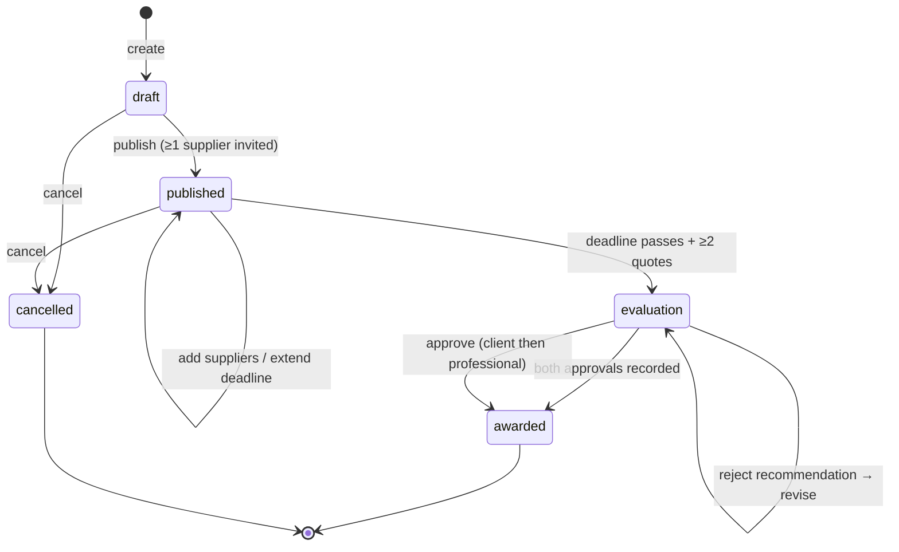

# Design Document: Supplier RFQ Marketplace

## Overview

The Supplier RFQ Marketplace is a Module 6 (Tender/Procurement/Supplier) feature that provides a structured procurement workflow for project material supply. It extends the existing `TenderPackage`/`Bid` model with RFQ-specific semantics: granular line-item pricing, weighted multi-criteria scoring (price, lead time, B-BBEE level, warranty, past performance), deadline-driven quote collection, and a two-stage human-approval award gate.

The feature operates as a deeply integrated tool within the Architex OS AppShell. It writes procurement state into the SpecForge specification spine (`SpecProcurementEntry`), publishes lifecycle records to the Project Passport (`ProjectRecord`), emits `WorkflowEvent` items to the Action Centre inbox, and triggers platform notifications for all RFQ lifecycle transitions.

### Key Design Decisions

1. **Separate from TenderPackage model** — The RFQ Marketplace uses its own Firestore document schema rather than extending `TenderPackage`. Rationale: RFQs are material-supply focused with line-item unit pricing, whereas tenders are scope-of-work focused with methodology/qualifications. The two models share concepts (deadline, scoring, award) but have different data shapes and workflows.

2. **Service-layer architecture** — All business logic lives in `src/services/rfqMarketplace/` as pure functions with Firestore persistence via the existing `getDemoDoc`/`getDemoCol` pattern. The UI component (`RfqMarketplaceWorkspace.tsx`) consumes these services.

3. **Comparison Engine as pure scoring functions** — The weighted scoring algorithm is implemented as pure functions accepting `QuoteResponse[]` and `EvaluationCriteria` inputs, producing deterministic `ScoredQuote[]` outputs. This enables property-based testing of scoring correctness.

4. **Sequential approval gate** — Client approval must precede professional approval. This mirrors the existing Pack 5 appointment approval pattern and integrates with the Action Centre via `WorkflowEvent` emission.

5. **B-BBEE integration via Supplier_Profile** — B-BBEE level is sourced from the supplier's profile (certificate data stored in their Firestore user document), not re-entered per quote. This ensures single source of truth.

## Architecture

```mermaid
graph TB
    subgraph "Frontend (React 19)"
        UI[RfqMarketplaceWorkspace.tsx]
        UI --> |consumes| SH[useRfqMarketplace hook]
    end

    subgraph "Service Layer (src/services/rfqMarketplace/)"
        RS[rfqService.ts<br/>CRUD + state machine]
        QS[quoteService.ts<br/>submission + revision]
        CE[comparisonEngine.ts<br/>scoring + ranking]
        AS[awardService.ts<br/>recommendation + approval]
        IS[invitationService.ts<br/>supplier discovery + invite]
        NS[rfqNotificationService.ts<br/>lifecycle notifications]
        INT[rfqIntegrationService.ts<br/>SpecForge + Passport + Action Centre]
    end

    subgraph "Platform Services (existing)"
        PP[projectPassportService.ts]
        SF[SpecForge Types + Procurement Pipeline]
        AC[actionCentreService.ts]
        VB[verificationBadgeService.ts]
        NT[notificationService.ts]
        AT[auditTrailService.ts]
    end

    subgraph "Data Layer (Firestore)"
        RFQ_COL[projects/{pid}/rfqs/{rfqId}]
        QUOTE_COL[projects/{pid}/rfqs/{rfqId}/quotes/{quoteId}]
        AWARD_COL[projects/{pid}/rfqs/{rfqId}/award]
        SUP_COL[suppliers/{supplierId}/profile]
    end

    SH --> RS
    SH --> QS
    SH --> CE
    SH --> AS
    SH --> IS
    RS --> INT
    AS --> INT
    INT --> PP
    INT --> SF
    INT --> AC
    NS --> NT
    RS --> RFQ_COL
    QS --> QUOTE_COL
    AS --> AWARD_COL
    IS --> SUP_COL
```

### RFQ State Machine



## Components and Interfaces

### Service Files

| File | Responsibility |
|------|---------------|
| `src/services/rfqMarketplace/rfqService.ts` | RFQ CRUD, status transitions, validation, deadline management |
| `src/services/rfqMarketplace/quoteService.ts` | Quote submission, revision, deadline enforcement, access control |
| `src/services/rfqMarketplace/comparisonEngine.ts` | Linear min-max normalisation, weighted scoring, ranking, tie-breaking |
| `src/services/rfqMarketplace/awardService.ts` | Award recommendation, conflict-of-interest checks, sequential approval gate |
| `src/services/rfqMarketplace/invitationService.ts` | Supplier discovery, filtering, invitation list management |
| `src/services/rfqMarketplace/rfqNotificationService.ts` | Notification dispatch for all RFQ lifecycle events |
| `src/services/rfqMarketplace/rfqIntegrationService.ts` | SpecForge write-back, Project Passport records, Action Centre events |
| `src/services/rfqMarketplace/supplierProfileService.ts` | Supplier profile CRUD, trade categories, performance metrics |
| `src/services/rfqMarketplace/types.ts` | All TypeScript interfaces and type definitions |
| `src/services/rfqMarketplace/index.ts` | Public API barrel export |

### UI Files

| File | Responsibility |
|------|---------------|
| `src/components/RfqMarketplaceWorkspace.tsx` | Main workspace component (Hero → Stat Row → Panels) |
| `src/hooks/useRfqMarketplace.ts` | React hook for RFQ state management |

### Key Interfaces

```typescript
// RFQ Status
type RfqStatus = 'draft' | 'published' | 'evaluation' | 'awarded' | 'cancelled';

// Core RFQ Document
interface RfqDocument {
  id: string;
  projectId: string;
  title: string;                    // max 150 chars
  description: string;              // max 2000 chars
  packageScopeId: string;
  packageScopeTitle: string;
  lineItems: RfqLineItem[];
  deliveryAddress: string;
  quoteDeadline: string;            // ISO 8601, ≥24h from creation
  evaluationCriteria: EvaluationCriteria;
  status: RfqStatus;
  invitationList: InvitedSupplier[];
  isPublicSector: boolean;
  localSpendTargetPct?: number;
  estimatedValue?: number;
  createdBy: string;
  createdAt: string;
  updatedAt: string;
  publishedAt?: string;
  awardedAt?: string;
  cancelledAt?: string;
}

interface RfqLineItem {
  id: string;
  specForgeItemId?: string;         // SpecForge_Link
  specForgeItemCode?: string;
  title: string;
  description: string;
  quantity: number;                  // > 0
  unit: string;                     // UoM
  specificationRef?: string;
}

interface EvaluationCriteria {
  priceWeight: number;              // 0–100, integer
  leadTimeWeight: number;           // 0–100, integer
  bbeeWeight: number;               // 0–100, integer
  warrantyWeight: number;           // 0–100, integer
  performanceWeight: number;        // 0–100, integer
  // Sum MUST equal 100
}

interface InvitedSupplier {
  supplierId: string;
  supplierName: string;
  tradeCategories: string[];
  verificationStatus: 'verified' | 'pending' | 'expired' | 'rejected';
  bbeeLevelNumber?: number;         // 1–8
  invitedAt: string;
}

// Quote Response
interface QuoteResponse {
  id: string;
  rfqId: string;
  supplierId: string;
  supplierName: string;
  lineItems: QuoteLineItem[];
  totalPrice: number;               // computed sum
  leadTimeDays: number;             // 1–730
  deliveryTerms: string;            // min 10 chars
  warrantyMonths?: number;
  attachments: QuoteAttachment[];
  revisionNumber: number;
  status: 'submitted' | 'superseded';
  submittedAt: string;
}

interface QuoteLineItem {
  rfqLineItemId: string;
  unitPrice: number;                // 0.01–999,999,999.99
  extendedPrice: number;            // unitPrice * quantity
  notes?: string;
}

interface QuoteAttachment {
  id: string;
  fileName: string;
  fileUrl: string;
  fileSize: number;                 // max 25MB
  mimeType: 'application/pdf' | 'application/vnd.openxmlformats-officedocument.wordprocessingml.document' |
             'application/vnd.openxmlformats-officedocument.spreadsheetml.sheet' |
             'image/jpeg' | 'image/png';
}

// Comparison Engine Output
interface ScoredQuote {
  quoteId: string;
  supplierId: string;
  supplierName: string;
  rawScores: {
    price: number;
    leadTime: number;
    bbee: number;
    warranty: number;
    performance: number;
  };
  normalizedScores: {
    price: number;        // 0–100
    leadTime: number;     // 0–100
    bbee: number;         // 0–100
    warranty: number;     // 0–100
    performance: number;  // 0–100
  };
  weightedScore: number;  // 0–100, two decimal places
  rank: number;
}

// Award Recommendation
interface AwardRecommendation {
  id: string;
  rfqId: string;
  recommendedSupplierId: string;
  recommendedQuoteId: string;
  quotedPrice: number;
  justification: string;            // min 50 chars
  riskNotes?: string;
  comparedQuoteIds: string[];
  conflictOfInterestFlags: ConflictFlag[];
  clientApproval?: ApprovalRecord;
  professionalApproval?: ApprovalRecord;
  status: 'pending_client' | 'pending_professional' | 'approved' | 'rejected';
  createdBy: string;
  createdAt: string;
}

interface ConflictFlag {
  type: 'ownership' | 'directorship' | 'affiliation';
  supplierEntity: string;
  teamMemberName: string;
  teamMemberRole: string;
  acknowledged: boolean;
  acknowledgementJustification?: string; // min 100 chars
}

interface ApprovalRecord {
  approverId: string;
  approverName: string;
  decision: 'approved' | 'rejected';
  reason?: string;
  decidedAt: string;
}

// Supplier Profile (marketplace-specific)
interface SupplierMarketplaceProfile {
  supplierId: string;
  firmName: string;
  tradeCategories: string[];        // 1–10
  deliveryRegions: string[];        // 1–9, SA provinces
  verificationStatus: 'verified' | 'pending' | 'expired';
  bbeeLevelNumber?: number;
  bbeeCertificateExpiry?: string;
  performanceMetrics?: {
    quoteAcceptanceRate: number;     // 0–100%
    onTimeDeliveryPct: number;       // 0–100%
    averageRating: number;           // 0–5
    metricsPeriodStart: string;
    metricsPeriodEnd: string;
  };
  completedDeliveryCount: number;
}
```

## Data Models

### Firestore Collections

| Collection Path | Document Schema | Purpose |
|-----------------|----------------|---------|
| `projects/{pid}/rfqs/{rfqId}` | `RfqDocument` | Core RFQ records |
| `projects/{pid}/rfqs/{rfqId}/quotes/{quoteId}` | `QuoteResponse` | Supplier quote submissions |
| `projects/{pid}/rfqs/{rfqId}/award` (single doc) | `AwardRecommendation` | Award recommendation + approvals |
| `projects/{pid}/rfqs/{rfqId}/comparison` (single doc) | `{ scoredQuotes: ScoredQuote[], generatedAt: string }` | Cached comparison results |
| `suppliers/{supplierId}/marketplace` (single doc) | `SupplierMarketplaceProfile` | Supplier marketplace presence |
| `projects/{pid}/rfqs/{rfqId}/audit/{eventId}` | Audit event | Immutable audit trail |

### Indexes Required

- `projects/{pid}/rfqs` — compound index on `status`, `createdAt` (descending)
- `suppliers/{supplierId}/marketplace` — composite index on `tradeCategories` (array-contains), `deliveryRegions` (array-contains), `verificationStatus`

### Integration Data Flow

1. **RFQ → SpecForge**: On award, write `supplier`, `quotedCost`, `leadTimeDays` into `SpecProcurementEntry` for each linked line item. Update `status` to `'ordered'`.
2. **RFQ → Project Passport**: On each status transition, write a `ProjectRecord` with `recordType: 'quote_comparison'`, `moduleKey: 'procurement'`, `phase: 'tender_procurement'`.
3. **RFQ → Action Centre**: Emit `WorkflowEvent` for deadline reminders (48h), pending approvals (24h overdue), and zero-quote alerts.
4. **RFQ → Audit Trail**: Every state transition, approval, and recommendation logs to `projects/{pid}/rfqs/{rfqId}/audit/`.

## Correctness Properties

*A property is a characteristic or behavior that should hold true across all valid executions of a system — essentially, a formal statement about what the system should do. Properties serve as the bridge between human-readable specifications and machine-verifiable correctness guarantees.*

### Property 1: Evaluation criteria weights sum to 100

*For any* valid `EvaluationCriteria` object accepted by the system, the sum of `priceWeight + leadTimeWeight + bbeeWeight + warrantyWeight + performanceWeight` SHALL equal exactly 100.

**Validates: Requirements 1.4**

### Property 2: Normalised scores are bounded 0–100

*For any* set of `QuoteResponse` inputs and valid `EvaluationCriteria`, every normalised score produced by the Comparison Engine SHALL be a number in the range [0.00, 100.00].

**Validates: Requirements 4.1**

### Property 3: Weighted score is a convex combination

*For any* `ScoredQuote` produced by the Comparison Engine, the `weightedScore` SHALL equal the sum of each normalised score multiplied by its corresponding weight divided by 100, and SHALL fall within [0.00, 100.00].

**Validates: Requirements 4.1**

### Property 4: Ranking is consistent with score ordering

*For any* comparison result containing two or more scored quotes, if quote A has a higher `weightedScore` than quote B, then quote A SHALL have a lower (better) `rank` value than quote B.

**Validates: Requirements 4.2**

### Property 5: Tie-breaking by earliest submission

*For any* two scored quotes with identical `weightedScore`, the quote with the earlier `submittedAt` timestamp SHALL receive the lower (better) rank.

**Validates: Requirements 4.2**

### Property 6: Quote deadline enforcement

*For any* `QuoteResponse` submission attempt where the current time is after the RFQ `quoteDeadline`, the system SHALL reject the submission and no new `QuoteResponse` record SHALL be created.

**Validates: Requirements 3.5, 3.6**

### Property 7: Quote revision preserves history

*For any* revised `QuoteResponse` submission, the previous submission SHALL have its status set to `'superseded'` and the new submission SHALL have a `revisionNumber` exactly one greater than the previous submission's `revisionNumber`.

**Validates: Requirements 3.8**

### Property 8: Non-invited supplier rejection

*For any* quote submission attempt by a supplier whose `supplierId` is not present in the RFQ's `invitationList`, the system SHALL reject the submission.

**Validates: Requirements 3.9**

### Property 9: Sequential approval gate enforcement

*For any* `AwardRecommendation`, `professionalApproval` SHALL only be recorded when `clientApproval` has already been recorded with decision `'approved'`.

**Validates: Requirements 6.2**

### Property 10: Conflict-of-interest blocks approval

*For any* `AwardRecommendation` with unacknowledged `conflictOfInterestFlags` (where `acknowledged === false`), `clientApproval` SHALL not be recordable.

**Validates: Requirements 6.4**

### Property 11: B-BBEE minimum weight enforcement

*For any* RFQ where `isPublicSector === true` or `estimatedValue > 1_000_000`, the accepted `EvaluationCriteria` SHALL have `bbeeWeight >= 10`.

**Validates: Requirements 5.1**

### Property 12: B-BBEE certificate blocks award

*For any* award recommendation where the recommended supplier has an expired or missing B-BBEE certificate, the system SHALL prevent approval progression.

**Validates: Requirements 5.3**

### Property 13: Role-based access for RFQ creation

*For any* RFQ creation attempt, the requesting user SHALL hold at least one of the roles `architect`, `quantity_surveyor`, `contractor`, or `admin` on the project.

**Validates: Requirements 10.1**

### Property 14: Supplier visibility scope

*For any* user with role `supplier`, a query for available RFQs SHALL return only RFQs where the user's `supplierId` is present in the `invitationList`.

**Validates: Requirements 10.5**

### Property 15: Line-item price validation bounds

*For any* `QuoteLineItem` accepted by the system, the `unitPrice` SHALL be between 0.01 and 999,999,999.99 inclusive.

**Validates: Requirements 3.2**

### Property 16: Publication requires at least one invited supplier

*For any* RFQ status transition from `'draft'` to `'published'`, the `invitationList` SHALL contain at least 1 supplier.

**Validates: Requirements 2.6**

## Error Handling

### Validation Errors (Client-side + Server-side)

| Error Code | Condition | User Message |
|------------|-----------|-------------|
| `RFQ_TITLE_TOO_LONG` | Title > 150 chars | "RFQ title must be 150 characters or fewer" |
| `RFQ_DESCRIPTION_TOO_LONG` | Description > 2000 chars | "Description must be 2000 characters or fewer" |
| `RFQ_NO_LINE_ITEMS` | 0 line items | "At least one line item is required" |
| `RFQ_DEADLINE_MISSING` | No deadline set | "Quote deadline is required" |
| `RFQ_DEADLINE_TOO_SOON` | Deadline < 24h from now | "Deadline must be at least 24 hours in the future" |
| `RFQ_WEIGHTS_INVALID` | Weights don't sum to 100 | "Evaluation criteria weights must sum to 100%" |
| `RFQ_BBEE_WEIGHT_LOW` | Public sector + bbeeWeight < 10 | "B-BBEE weight must be at least 10% for public sector projects" |
| `RFQ_NO_SUPPLIERS` | Publish with 0 invited | "At least one supplier must be invited before publishing" |
| `RFQ_MAX_SUPPLIERS` | > 50 suppliers invited | "Maximum 50 suppliers per invitation list" |
| `QUOTE_DEADLINE_PASSED` | Submission after deadline | "The quote deadline has passed" |
| `QUOTE_NOT_INVITED` | Non-invited supplier | "You are not invited to this RFQ" |
| `QUOTE_PRICE_OUT_OF_RANGE` | Unit price outside bounds | "Unit price must be between R0.01 and R999,999,999.99" |
| `QUOTE_LEAD_TIME_INVALID` | Lead time < 1 or > 730 | "Lead time must be between 1 and 730 days" |
| `QUOTE_DELIVERY_TERMS_SHORT` | < 10 chars | "Delivery terms must be at least 10 characters" |
| `QUOTE_ATTACHMENT_TOO_LARGE` | File > 25MB | "Attachment must be 25MB or smaller" |
| `QUOTE_TOO_MANY_ATTACHMENTS` | > 10 files | "Maximum 10 attachments per quote" |
| `QUOTE_INVALID_FORMAT` | Unsupported file type | "Supported formats: PDF, DOCX, XLSX, JPG, PNG" |
| `AWARD_JUSTIFICATION_SHORT` | < 50 chars | "Justification must be at least 50 characters" |
| `AWARD_CONFLICT_UNRESOLVED` | Unacknowledged conflicts | "All conflicts of interest must be addressed before approval" |
| `AWARD_CONFLICT_ACK_SHORT` | Acknowledgement < 100 chars | "Conflict justification must be at least 100 characters" |
| `AWARD_BBEE_BLOCKED` | Expired/missing certificate | "Supplier B-BBEE certificate must be valid before award" |
| `AWARD_QUOTE_SUPERSEDED` | Quote revised after recommendation | "Recommendation must be reviewed against current supplier data" |
| `AWARD_CLIENT_REQUIRED` | Professional tries before client | "Client approval must be recorded first" |
| `ACCESS_DENIED` | Role check failure | "You don't have permission for this action" |
| `PROFILE_NO_CATEGORIES` | 0 trade categories | "At least one trade category is required" |
| `PROFILE_NO_REGIONS` | 0 delivery regions | "At least one delivery region is required" |

### Recovery Strategy

- **Notification delivery failure**: Retry 3× within 5 minutes. On final failure, log to `rfqs/{rfqId}/audit/` and surface an "undelivered" indicator on the RFQ management view.
- **SpecForge write-back failure**: If a linked `SpecProcurementEntry` no longer exists, log a warning to the audit trail and skip that item. Do not block the award.
- **Firestore transaction conflicts**: Use Firestore transactions for status transitions and quote submissions. Retry on `ABORTED` errors up to 3 times.
- **Stale supplier data**: Before progressing approval, re-verify supplier verification status and B-BBEE certificate validity. Block if status has degraded since recommendation creation.

## Testing Strategy

### Property-Based Testing

The Comparison Engine, validation functions, and access control logic are pure functions well-suited to property-based testing. Tests will use `fast-check` (the standard PBT library for TypeScript/Vitest).

**Configuration**: Minimum 100 iterations per property test.

**Tag format**: `Feature: supplier-rfq-marketplace, Property {N}: {description}`

### Unit Tests (Example-Based)

- RFQ creation with valid/invalid inputs
- Quote submission edge cases (exactly at deadline, empty attachments)
- B-BBEE level scoring (Level 1 max, Level 8 min, proportional distribution)
- Award approval sequential flow (client → professional)
- Notification trigger timing (published, 24h reminder, deadline passed)
- SpecForge write-back with orphaned references
- Supplier profile update validation
- Role-based access control for all 4 action types

### Integration Tests

- Firestore persistence round-trip (create RFQ → read back)
- Full RFQ lifecycle (draft → published → evaluation → awarded)
- Notification delivery pipeline (mock notification service)
- Project Passport record creation on status transitions
- Action Centre event emission

### Test File Locations

| Test File | Coverage |
|-----------|----------|
| `src/services/rfqMarketplace/__tests__/comparisonEngine.test.ts` | Property tests for scoring, normalisation, ranking |
| `src/services/rfqMarketplace/__tests__/rfqService.test.ts` | RFQ CRUD, validation, state transitions |
| `src/services/rfqMarketplace/__tests__/quoteService.test.ts` | Quote submission, revision, deadline enforcement |
| `src/services/rfqMarketplace/__tests__/awardService.test.ts` | Award recommendation, COI checks, approval gate |
| `src/services/rfqMarketplace/__tests__/invitationService.test.ts` | Supplier discovery, filtering, access control |
| `src/services/rfqMarketplace/__tests__/rfqIntegrationService.test.ts` | SpecForge + Passport + Action Centre writes |
| `src/services/rfqMarketplace/__tests__/supplierProfileService.test.ts` | Profile CRUD, performance metric calculation |
