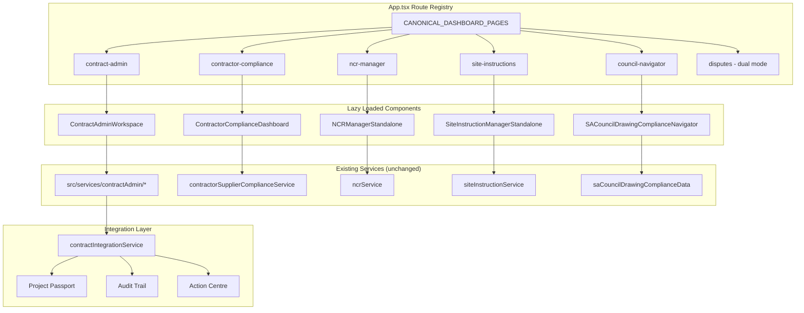

# Design Document: Tool Discoverability Routing

## Overview

This feature wires five existing but buried tools into accessible first-class routes in App.tsx, registers them in the standalone tool registry, and updates navigation configuration so users can discover and access them directly. The approach is purely additive — no existing routes, components, or services are modified in a breaking way.

The five tools being surfaced:
1. **SA Council Drawing Compliance Navigator** — already standalone, just needs route + registry entry
2. **NCR Manager** — existing component, needs route + standalone wrapper with project selection
3. **Site Instruction Manager** — existing component, needs route + standalone wrapper with project selection
4. **Contract Administration Workspace** — new tabbed workspace UI consuming 13 existing services
5. **Contractor/Supplier Compliance Dashboard** — new dashboard UI consuming existing compliance service

Additionally, the existing Dispute Resolution page gets dual-mode access (direct + project-scoped).

### Design Decisions

1. **No service-layer changes**: All business logic already exists. This feature is purely routing + UI wiring.
2. **Wrapper pattern for NCR/Site Instructions**: Rather than modifying the existing components (which accept `projectId` as required), we create lightweight standalone wrappers that add project selection when no context is provided.
3. **Workspace pattern for Contract Admin**: Follows the established SpecForge/H&S workspace template (Header Card → Project Toggles → Tabs → Content).
4. **New StandaloneToolCategory**: Add `'construction_admin'` to the category union type to properly categorize Contract Admin tools.
5. **Dual-mode disputes**: Add 'disputes' to DIRECT_WORKFLOW_PAGE_IDS while keeping it in PROJECT_WORKFLOW_PAGE_IDS — the only page that exists in both sets.

## Architecture



### Page ID Classification

| Page ID | Set | Rationale |
|---------|-----|-----------|
| `council-navigator` | DIRECT_WORKFLOW_PAGE_IDS | Standalone tool, no project context required |
| `ncr-manager` | DIRECT_WORKFLOW_PAGE_IDS | Works standalone with project selection prompt |
| `site-instructions` | DIRECT_WORKFLOW_PAGE_IDS | Works standalone with project selection prompt |
| `contract-admin` | DIRECT_WORKFLOW_PAGE_IDS | Works standalone with project selection prompt |
| `contractor-compliance` | DIRECT_WORKFLOW_PAGE_IDS | Works standalone with project selection prompt |
| `disputes` | Both sets (dual-mode) | Existing project-scoped, now also direct access |

## Components and Interfaces

### 1. SACouncilDrawingComplianceNavigator (existing — no changes)

Already a self-contained component with no required props. Just needs route registration.

```typescript
// Already exported as default from src/components/SACouncilDrawingComplianceNavigator.tsx
export default function SACouncilDrawingComplianceNavigator(): JSX.Element
```

### 2. NCRManagerStandalone (new wrapper)

**File**: `src/components/NCRManagerStandalone.tsx`

```typescript
interface Props {
  user: UserProfile;
  projectId?: string;
}

export default function NCRManagerStandalone({ user, projectId }: Props): JSX.Element {
  // If projectId provided, render NCRManager directly
  // If no projectId, show project selection prompt
  // On project selection, render NCRManager with selected projectId
}
```

Wraps the existing `NCRManager` component which requires `{ projectId: string; currentUserId: string; compact?: boolean }`.

### 3. SiteInstructionManagerStandalone (new wrapper)

**File**: `src/components/SiteInstructionManagerStandalone.tsx`

```typescript
interface Props {
  user: UserProfile;
  projectId?: string;
}

export default function SiteInstructionManagerStandalone({ user, projectId }: Props): JSX.Element {
  // If projectId provided, render SiteInstructionManager directly
  // If no projectId, show project selection prompt
  // On project selection, render SiteInstructionManager with selected projectId
}
```

Wraps the existing `SiteInstructionManager` which requires `{ projectId: string; currentUserId: string; currentUserRole: UserRole; compact?: boolean }`.

### 4. ContractAdminWorkspace (new workspace)

**File**: `src/components/ContractAdminWorkspace.tsx`

```typescript
interface Props {
  user: UserProfile;
  projectId?: string;
}

export default function ContractAdminWorkspace({ user, projectId }: Props): JSX.Element
```

**Layout** (follows SpecForge workspace template):
- Header Card: "Contract Administration", project name, role badge
- Project Toggles: project selection buttons
- Disclaimer Banner: persistent advisory banner from `disclaimerService.getDisclaimerBannerText()`
- Tab Navigation: Claims Register | Variation Register | Extension of Time | Notices | Payment Scheduler | Contract Data Sheet
- Active Tab Content: renders the appropriate sub-view

**Tab-to-Service Mapping**:

| Tab | Service Module | Key Functions |
|-----|---------------|---------------|
| Claims Register | claimsRegisterService | registerClaim, transitionClaim, getClaimsCumulativeSummary |
| Variation Register | variationRegisterService | createVariation, transitionVariation, getCumulativeSummary |
| Extension of Time | eotEngineService | createEoTClaim, submitEoTClaim, reviewEoTClaim |
| Notices | noticeEngineService | registerNotice, calculateDeadline, acknowledgeNotice, getActiveNotices |
| Payment Scheduler | paymentSchedulerService | generateSchedule, calculateRetention, runPaymentDeadlineCheck |
| Contract Data Sheet | contractDataSheetService | getDataSheet, getKeyDates, getNamedPersons, getCommercialRates |

**RBAC Integration**:
- On load, call `contractRbacService.canAccess(userId, feature)` for each tab's feature
- Tabs where `canAccess` returns `false` render in disabled state with permission message

**Integration Hooks** (via `contractIntegrationService`):
- `writeToAuditTrail()` — on every contract action
- `surfaceToActionCentre()` — when deadline within 5 working days
- `writeToProjectPassport()` — on status changes
- `retryWithBackoff()` — wraps all integration writes with 3-retry logic
- On 3-retry failure: create failed-sync alert in Action Centre

### 5. ContractorComplianceDashboard (new dashboard)

**File**: `src/components/ContractorComplianceDashboard.tsx`

```typescript
interface Props {
  user: UserProfile;
  projectId?: string;
}

export default function ContractorComplianceDashboard({ user, projectId }: Props): JSX.Element
```

**Layout** (follows workspace template):
- Header Card: "Contractor & Supplier Compliance", project name, compliance summary stats
- Project Toggles: project selection
- Content: entity compliance table with pagination (max 50 per page)

**Service Consumption**:
- `contractorSupplierComplianceService.buildContractorCompliance()` — build compliance records
- `contractorSupplierComplianceService.getMissingComplianceChecks()` — identify gaps
- `contractorSupplierComplianceService.getExpiredChecks()` — identify expiries
- `contractorSupplierComplianceService.getComplianceCheckSummary()` — per-entity summary

**Visual Indicators**:
- Red (`bg-red-500/20 text-red-400`): non_compliant / expired
- Amber (`bg-orange-500/20 text-orange-400`): pending
- Green (`bg-emerald-500/20 text-emerald-400`): compliant

**Compliance Gate Logic**:
- Entities with `overallStatus === 'non_compliant' || 'expired'` show a gate indicator
- Gate blocks: site access + payment processing
- Gate clears when all mandatory checks (health_safety_file, coida_registration, sars_tax_pin) are compliant and unexpired

**Early Warning**:
- For any check with `expiresAt` within 30 calendar days: surface to Action Centre
- Action includes: entity name, check type label, expiry date

### 6. DisputeResolutionPage (existing — minor enhancement)

Add 'disputes' to `DIRECT_WORKFLOW_PAGE_IDS` to enable dual-mode access. The component already handles both project-scoped and cross-project views — the existing implementation checks for active project context and adjusts accordingly.

**Role-scoped visibility when no project selected**:
- `admin`: all disputes
- `client`: disputes on jobs where they are `clientId`
- `architect`/`bep`/`freelancer`: disputes on jobs where they are `selectedProfessionalId`/`selectedBepId`/`selectedArchitectId`
- All other roles: disputes they filed or filed against them
- Maximum 75 most recent records

## Data Models

### Route Registry Entry (existing type, new instances)

```typescript
// Already defined in App.tsx
type DashboardPage = {
  id: string;              // kebab-case, max 40 chars, unique
  label: string;           // human-readable display name
  roles: UserRole[];       // permitted roles
  group: 'Core workflow' | 'Client tools' | 'BEP tools' | 'Construction tools' | 'Freelancer tools' | 'Governance';
  icon: React.ReactNode;   // lucide-react icon at 18px
  summary: string;         // single sentence purpose
  backedBy: string[];      // backing components/services
};
```

### New CANONICAL_DASHBOARD_PAGES Entries

```typescript
{ id: 'council-navigator', label: 'Council Drawing Navigator', roles: ['architect', 'bep', 'engineer', 'energy_professional', 'fire_engineer', 'town_planner', 'admin'], group: 'BEP tools', icon: <MapPin size={18} />, summary: 'Municipality-specific drawing submission requirements for South African local authorities.', backedBy: ['SACouncilDrawingComplianceNavigator', 'saCouncilDrawingComplianceData'] }

{ id: 'ncr-manager', label: 'NCR Manager', roles: ['architect', 'bep', 'contractor', 'subcontractor', 'site_manager', 'engineer', 'admin'], group: 'Construction tools', icon: <AlertTriangle size={18} />, summary: 'Non-conformance report management — defect identification, tracking, and resolution workflows.', backedBy: ['NCRManager', 'ncrService'] }

{ id: 'site-instructions', label: 'Site Instructions', roles: ['architect', 'bep', 'contractor', 'subcontractor', 'site_manager', 'engineer', 'admin'], group: 'Construction tools', icon: <FileText size={18} />, summary: 'Formal site instruction issuance, acknowledgement, and tracking workflows.', backedBy: ['SiteInstructionManager', 'siteInstructionService'] }

{ id: 'contract-admin', label: 'Contract Administration', roles: ['architect', 'bep', 'quantity_surveyor', 'contractor', 'subcontractor', 'site_manager', 'engineer', 'admin'], group: 'Construction tools', icon: <Briefcase size={18} />, summary: 'Unified contract administration — claims, variations, EoT, notices, payment schedules, and contract data.', backedBy: ['ContractAdminWorkspace', 'contractAdmin services'] }

{ id: 'contractor-compliance', label: 'Contractor Compliance', roles: ['architect', 'bep', 'contractor', 'subcontractor', 'supplier', 'site_manager', 'quantity_surveyor', 'admin'], group: 'Construction tools', icon: <ShieldCheck size={18} />, summary: 'Contractor and supplier compliance gate — check statuses, expired certifications, and access control.', backedBy: ['ContractorComplianceDashboard', 'contractorSupplierComplianceService'] }
```

### Standalone Tool Registry Entries (new)

```typescript
// New StandaloneToolCategory value needed: 'construction_admin'
{
  id: 'council_navigator',
  label: 'SA Council Drawing Compliance Navigator',
  category: 'compliance',
  description: 'Municipality-specific drawing submission requirements for South African local authorities.',
  roles: ['architect', 'bep', 'engineer', 'energy_professional', 'fire_engineer', 'town_planner', 'admin'],
  icon: 'MapPin',
  route: 'standalone/council-navigator',
  standaloneOnly: true,
  requiresInput: true,
  canExport: true,
  canAssignToProject: true,
  recentRunsCount: 0,
  tags: ['council', 'municipality', 'drawing', 'compliance', 'submission', 'SA'],
  calculatorDefinitionId: 'council_navigator_v1',
}

{
  id: 'ncr_manager',
  label: 'NCR Manager',
  category: 'site_management',
  description: 'Non-conformance report management — defect identification, tracking, and resolution.',
  roles: ['architect', 'bep', 'contractor', 'subcontractor', 'site_manager', 'engineer', 'admin'],
  icon: 'AlertTriangle',
  route: 'standalone/ncr-manager',
  standaloneOnly: false,
  requiresInput: true,
  canExport: true,
  canAssignToProject: true,
  recentRunsCount: 0,
  tags: ['NCR', 'non-conformance', 'defect', 'quality', 'site', 'inspection'],
  calculatorDefinitionId: 'ncr_manager_v1',
}

{
  id: 'site_instruction_manager',
  label: 'Site Instruction Manager',
  category: 'site_management',
  description: 'Formal site instruction issuance, acknowledgement, and tracking workflows.',
  roles: ['architect', 'bep', 'contractor', 'subcontractor', 'site_manager', 'engineer', 'admin'],
  icon: 'FileText',
  route: 'standalone/site-instructions',
  standaloneOnly: false,
  requiresInput: true,
  canExport: true,
  canAssignToProject: true,
  recentRunsCount: 0,
  tags: ['instruction', 'site', 'directive', 'construction', 'acknowledgement', 'tracking'],
  calculatorDefinitionId: 'site_instruction_manager_v1',
}

{
  id: 'contract_admin_workspace',
  label: 'Contract Administration Workspace',
  category: 'construction_admin',
  description: 'Claims, variations, EoT, notices, payment schedules, and contract data in one workspace.',
  roles: ['architect', 'bep', 'quantity_surveyor', 'contractor', 'subcontractor', 'site_manager', 'engineer', 'admin'],
  icon: 'Briefcase',
  route: 'standalone/contract-admin',
  standaloneOnly: false,
  requiresInput: true,
  canExport: true,
  canAssignToProject: true,
  recentRunsCount: 0,
  tags: ['contract', 'claims', 'variations', 'EoT', 'notices', 'payment', 'JBCC', 'NEC', 'GCC', 'FIDIC'],
  calculatorDefinitionId: 'contract_admin_workspace_v1',
}

{
  id: 'contractor_compliance_dashboard',
  label: 'Contractor & Supplier Compliance Dashboard',
  category: 'compliance',
  description: 'Compliance gate visibility — check statuses, expired certifications, and access control.',
  roles: ['architect', 'bep', 'contractor', 'subcontractor', 'supplier', 'site_manager', 'quantity_surveyor', 'admin'],
  icon: 'ShieldCheck',
  route: 'standalone/contractor-compliance',
  standaloneOnly: false,
  requiresInput: false,
  canExport: true,
  canAssignToProject: true,
  recentRunsCount: 0,
  tags: ['contractor', 'supplier', 'compliance', 'COIDA', 'H&S', 'B-BBEE', 'tax', 'gate'],
  calculatorDefinitionId: 'contractor_compliance_v1',
}
```

### Navigation Config Additions

Items added to the `toolboxes` → `construction_admin` section and `toolboxes` → `design_compliance` section:

```typescript
// Under design_compliance section items:
{ key: 'council-navigator', label: 'Council Drawing Navigator', description: 'Municipality-specific drawing submission requirements.' }

// Under construction_admin section items:
{ key: 'ncr-manager', label: 'NCR Manager', description: 'Non-conformance report management and resolution.' }
{ key: 'site-instructions', label: 'Site Instructions', description: 'Site instruction issuance and tracking.' }
{ key: 'contract-admin', label: 'Contract Administration', description: 'Claims, variations, EoT, notices, and payment schedules.' }
{ key: 'contractor-compliance', label: 'Contractor Compliance', description: 'Contractor and supplier compliance gate dashboard.' }
{ key: 'disputes', label: 'Dispute Resolution', description: 'Cross-project dispute management.' }
```

## Correctness Properties

*A property is a characteristic or behavior that should hold true across all valid executions of a system — essentially, a formal statement about what the system should do. Properties serve as the bridge between human-readable specifications and machine-verifiable correctness guarantees.*

### Property 1: Role-based page access gating

*For any* UserRole and any page in CANONICAL_DASHBOARD_PAGES, calling `pagesForRole(role)` SHALL include that page if and only if the role appears in the page's `roles` array.

**Validates: Requirements 1.2, 1.7, 2.2, 2.4, 3.2, 4.2, 5.2, 7.7**

### Property 2: Page ID set partitioning

*For any* page id that appears in DIRECT_WORKFLOW_PAGE_IDS or PROJECT_WORKFLOW_PAGE_IDS, that id SHALL NOT appear in both sets simultaneously unless it is an explicitly documented dual-mode page (currently only 'disputes').

**Validates: Requirements 7.2, 7.3, 7.4**

### Property 3: CANONICAL_DASHBOARD_PAGES structural completeness

*For any* entry in CANONICAL_DASHBOARD_PAGES, the entry SHALL have: a non-empty `id` (kebab-case, ≤40 characters, unique), a non-empty `label`, a non-empty `roles` array of valid UserRole values, a valid `group` value, a non-null `icon`, a non-empty `summary`, and a non-empty `backedBy` array.

**Validates: Requirements 7.1**

### Property 4: Standalone tool registry structural completeness

*For any* entry in STANDALONE_TOOL_REGISTRY, the entry SHALL have: a non-empty `id` (≤64 characters, lowercase with underscores, unique), a non-empty `label` (≤80 characters), a valid `category`, a non-empty `description` (≤160 characters), a non-empty `roles` array, a non-empty `icon` string, a non-empty `route`, and a `tags` array with between 3 and 12 entries.

**Validates: Requirements 8.1**

### Property 5: Standalone tool tile role filtering

*For any* tool in STANDALONE_TOOL_REGISTRY and any UserRole not in that tool's `roles` array, the tool tile SHALL NOT be rendered or included in that user's visible tool list.

**Validates: Requirements 8.3**

### Property 6: Contract admin RBAC tab disablement

*For any* tab in the ContractAdminWorkspace and any user where `contractRbacService.canAccess(userId, tabFeature)` returns `false`, that tab SHALL render in a disabled state with a permission message.

**Validates: Requirements 4.13**

### Property 7: Contract deadline action surfacing

*For any* contractual deadline where `getRemainingWorkingDays(deadline, today)` returns a value ≤ 5 and > 0, the system SHALL surface an action to the Action Centre containing the deadline date, required response type, clause reference, and remaining working days.

**Validates: Requirements 4.10**

### Property 8: Compliance expiry early warning

*For any* compliance check item where `expiresAt` is within 30 calendar days of the current date, the system SHALL surface an early warning to the Action Centre identifying the entity, check type, and expiry date.

**Validates: Requirements 5.7**

### Property 9: Compliance gate indicator for non-compliant entities

*For any* ContractorComplianceRecord where `overallStatus` is `'non_compliant'` or `'expired'`, the dashboard SHALL display a compliance gate indicator marking the entity as blocked from site access and payment processing.

**Validates: Requirements 5.11**

### Property 10: Compliance dashboard pagination

*For any* list of N contractor/supplier entities where N > 0, the compliance dashboard SHALL display exactly `Math.min(N, 50)` entities on the current page, with `Math.ceil(N / 50)` total pages available.

**Validates: Requirements 5.4**

### Property 11: Role-scoped dispute visibility

*For any* user accessing the disputes page without a project context, the visible disputes SHALL be limited to those matching the user's role scoping rules: admin sees all, client sees disputes on their jobs, architect/bep/freelancer sees disputes on jobs where they are assigned, and other roles see only disputes they filed or filed against them.

**Validates: Requirements 6.2**

### Property 12: Navigation config consistency with page registry

*For any* navigation item that corresponds to a CANONICAL_DASHBOARD_PAGES entry, the navigation item's `label` SHALL match the page entry's `label`, and the navigation item's `roles` (if specified) SHALL be a subset of or equal to the page entry's `roles` array.

**Validates: Requirements 7.6**

## Error Handling

### Integration Write Failures (Contract Admin)

1. All writes to Project Passport, Audit Trail, and Action Centre are wrapped in `contractIntegrationService.retryWithBackoff()` with 3 retry attempts.
2. If all 3 retries fail: create a `failed-sync` alert in the Action Centre identifying the target module, originating event, and failure timestamp.
3. The user's input data is never lost — the local state persists regardless of integration write outcomes.

### Service Unavailability (Compliance Dashboard)

1. If `contractorSupplierComplianceService` returns an error or is unreachable, display an error banner: "Compliance data could not be loaded."
2. Retain any previously displayed data — do not clear the view.
3. Provide a "Retry" button to attempt re-fetch.

### Site Instruction / NCR Audit Trail Failure

1. If audit trail write fails during instruction creation/update, display an error toast.
2. The instruction data is retained in local state — user does not lose their input.
3. The instruction itself is still saved (audit trail is a secondary write).

### Empty States

- **No project selected** (NCR/Site Instructions): Show project selection prompt with user's accessible projects.
- **No entities** (Compliance Dashboard): Show empty state message prompting user to add contractors/suppliers.
- **No disputes** (Dispute Resolution): Show "No disputes available" without error styling.

### Unauthorized Access

- Role-gating is enforced at the route registry level via `pagesForRole()`.
- Users who somehow navigate to a gated page see the platform's standard command centre redirect — never a blank page or error.

## Testing Strategy

### Unit Tests (Example-Based)

| Test | What it verifies |
|------|-----------------|
| Registry entries exist | All 5 new entries in CANONICAL_DASHBOARD_PAGES with correct fields |
| Standalone registry entries | All 5 new entries in STANDALONE_TOOL_REGISTRY |
| Navigation config entries | Items in correct sections (design_compliance / construction_admin) |
| Disputes dual-mode | 'disputes' appears in both DIRECT_WORKFLOW_PAGE_IDS and PROJECT_WORKFLOW_PAGE_IDS |
| Contract admin tabs | 6 tabs render in specified order, Claims Register selected by default |
| Disclaimer banner | Renders with disclaimerService text, non-dismissible |
| Project selection prompt | NCR/Site Instruction show prompt when no projectId |
| Empty states | Compliance dashboard shows message when no entities |
| Error states | Compliance dashboard retains data on service failure |

### Property-Based Tests

Property-based testing is appropriate for this feature because several acceptance criteria define universal rules that should hold across all valid inputs (roles, page IDs, registry entries, compliance records).

**Library**: `fast-check` (already compatible with Vitest)
**Minimum iterations**: 100 per property

| Property | Generator Strategy |
|----------|-------------------|
| P1: Role-based access | Generate random UserRole, check all pages |
| P2: Set partitioning | Generate page IDs from both sets, verify exclusivity |
| P3: Page entry completeness | Iterate all entries, validate schema |
| P4: Tool registry completeness | Iterate all entries, validate schema |
| P5: Tool tile filtering | Generate random UserRole × random tool |
| P6: RBAC tab disablement | Generate random user × tab × canAccess result |
| P7: Deadline action surfacing | Generate random dates with ≤5 working days remaining |
| P8: Compliance expiry warning | Generate random dates within 30 calendar days |
| P9: Compliance gate indicator | Generate random ComplianceRecord with non_compliant/expired status |
| P10: Pagination | Generate random entity list sizes (1–500) |
| P11: Dispute visibility | Generate random user roles × dispute lists |
| P12: Nav/page label consistency | Cross-reference all navigation items with page entries |

### Integration Tests

| Test | Scope |
|------|-------|
| Contract admin audit trail writes | Mock `contractIntegrationService`, verify calls on actions |
| Action Centre surfacing | Mock surfaceToActionCentre, verify deadline alerts |
| Project Passport writes | Mock writeToProjectPassport, verify status change writes |
| Retry + failure alert | Mock service to fail 3x, verify failed-sync alert created |
| SA Council Navigator standalone render | Mount without parent, verify full UI renders |

### Tag Format

Each property test is tagged with:
```
Feature: tool-discoverability-routing, Property {N}: {property text}
```
