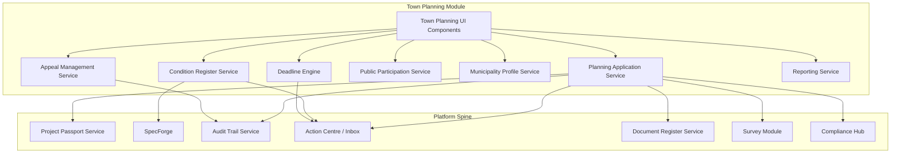
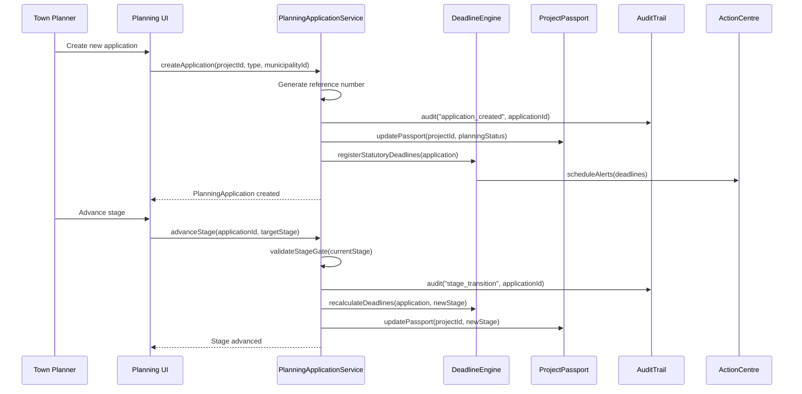

# Design Document: Town Planning Application Tracker

## Overview

The Town Planning Application Tracker is a feature module within the Architex platform that provides comprehensive lifecycle management for South African town planning applications. It operates within the regulatory framework of SPLUMA (Spatial Planning and Land Use Management Act 16 of 2013), provincial planning legislation, and municipal by-laws.

The module supports seven application types (rezoning, consent use, subdivision, consolidation, SDP, removal of restrictive conditions, and township establishment) through ten lifecycle stages (Pre-consultation → Preparation → Submission → Circulation/Advertising → Objection Response → Tribunal/Decision → Record of Decision → Appeal Period → Condition Fulfilment → Completion). It integrates with Project Passport, SpecForge, Documents & Drawing Intelligence, Survey Module, Compliance Hub, Action Centre, and Audit Trail.

The feature lives as a bounded feature module at `src/features/town-planning/` with its own service layer, component tree, and type system — following the established pattern of `src/features/project-communications/`.

### Dual Operating Mode

The module operates in two modes:

1. **Project-scoped mode** — The tool is accessed within the context of a full Architex project (Brief → Build lifecycle). It integrates with Project Passport, SpecForge, team messaging, and finance. The left nav shows project context and cross-module links.

2. **Standalone mode** — The tool is used independently by a Town Planner managing their practice portfolio without the full project workflow. No project team required. Accessed via Toolboxes, it shows all applications across the planner's practice. Cross-module integration (Passport, SpecForge) is dormant. Standalone applications can later be linked into a full project if the workflow expands.

This dual-mode pattern applies across all professional role tools in Architex — each tool must be usable independently so that individual professionals (town planners, architects, quantity surveyors, etc.) can adopt the platform for their specific discipline without requiring the full multi-role project lifecycle.

## Architecture





## Data Models

### Core Types

```typescript
// ─── Town Planning Application Types ─────────────────────────────────────

export type PlanningApplicationType =
  | 'rezoning'
  | 'consent_use'
  | 'subdivision'
  | 'consolidation'
  | 'site_development_plan'
  | 'removal_of_restrictive_conditions'
  | 'township_establishment';

export type PlanningStage =
  | 'pre_consultation'
  | 'preparation'
  | 'submission'
  | 'circulation_advertising'
  | 'objection_response'
  | 'tribunal_decision'
  | 'record_of_decision'
  | 'appeal_period'
  | 'condition_fulfilment'
  | 'completion';

export type ApplicationStatus =
  | 'draft'
  | 'active'
  | 'approved'
  | 'refused'
  | 'deemed_refused'
  | 'appeal_in_progress'
  | 'withdrawn'
  | 'lapsed';

export type ConditionType = 'precedent' | 'ongoing';

export type AppealOutcome = 'upheld' | 'dismissed' | 'varied';

export type DeadlineStatus = 'pending' | 'approaching' | 'overdue' | 'met' | 'waived';

export type ObjectionStatus = 'received' | 'responded' | 'late_accepted' | 'late_rejected';

export type TriggerType = 'heritage_nhra_s38' | 'environmental_nema';

export type ParallelProcessStatus = 'pending' | 'in_progress' | 'resolved' | 'deferred';

// ─── Planning Application ────────────────────────────────────────────────

export interface PlanningApplication {
  id: string;
  tenantId: string;
  projectId: string;
  referenceNumber: string;
  applicationType: PlanningApplicationType;
  currentStage: PlanningStage;
  status: ApplicationStatus;
  municipalityId: string;
  assignedTownPlannerId: string;
  propertyDescription: string;
  erfNumber: string;
  titleDeedReference: string;
  applicantName: string;
  applicantContactDetails: ContactDetails;
  interdependencies: string[]; // IDs of related applications
  createdAt: string;
  updatedAt: string;
}

export interface ContactDetails {
  name: string;
  email: string;
  phone: string;
  postalAddress?: string;
}

// ─── Stage Transition ────────────────────────────────────────────────────

export interface StageTransition {
  id: string;
  applicationId: string;
  fromStage: PlanningStage;
  toStage: PlanningStage;
  transitionedBy: string;
  transitionedAt: string;
  notes: string;
  documentsVerified: boolean;
}

// ─── Deadline Register ───────────────────────────────────────────────────

export interface Deadline {
  id: string;
  applicationId: string;
  type: 'statutory' | 'procedural' | 'condition';
  label: string;
  dueDate: string;
  status: DeadlineStatus;
  linkedStage?: PlanningStage;
  linkedConditionId?: string;
  statutoryBasis?: string; // e.g. "SPLUMA Section 56"
  daysRemaining: number; // computed
  alertGenerated: boolean;
}

// ─── Municipality Profile ────────────────────────────────────────────────

export interface MunicipalityProfile {
  id: string;
  tenantId: string;
  name: string;
  province: string;
  contactDetails: ContactDetails;
  landUseSchemeReference: string;
  feeSchedule: FeeScheduleItem[];
  requiredForms: RequiredForm[];
  processVariations: ProcessVariation[];
  customTimeframes: CustomTimeframe[];
  createdAt: string;
  updatedAt: string;
}

export interface FeeScheduleItem {
  applicationType: PlanningApplicationType;
  description: string;
  amount: number;
  currency: 'ZAR';
  validFrom: string;
  validTo?: string;
}

export interface RequiredForm {
  id: string;
  name: string;
  applicationType: PlanningApplicationType[];
  isProvincial: boolean;
  stage: PlanningStage;
  templateUrl?: string;
}

export interface ProcessVariation {
  applicationType: PlanningApplicationType;
  stage: PlanningStage;
  description: string;
  additionalRequirements: string[];
}

export interface CustomTimeframe {
  deadlineType: string;
  defaultDays: number; // SPLUMA default
  municipalityDays: number; // Override
  statutoryReference: string;
}

// ─── Public Participation ────────────────────────────────────────────────

export interface Objection {
  id: string;
  applicationId: string;
  objectorName: string;
  objectorContactDetails: ContactDetails;
  dateReceived: string;
  groundsOfObjection: string;
  supportingDocumentIds: string[];
  status: ObjectionStatus;
  responseId?: string;
  isLate: boolean;
  lateDecision?: 'accepted' | 'rejected';
  lateDecisionReason?: string;
}

export interface ObjectionResponse {
  id: string;
  objectionId: string;
  applicationId: string;
  responseText: string;
  respondedBy: string;
  respondedAt: string;
  supportingDocumentIds: string[];
}

export interface PublicParticipationSummary {
  applicationId: string;
  totalObjections: number;
  totalComments: number;
  responsesComplete: number;
  responsesPending: number;
  objectionPeriodStart: string;
  objectionPeriodEnd: string;
  periodClosed: boolean;
}

// ─── Condition Register ──────────────────────────────────────────────────

export interface Condition {
  id: string;
  applicationId: string;
  conditionNumber: number;
  description: string;
  conditionType: ConditionType;
  responsibleParty: string;
  deadline?: string;
  fulfilmentCriteria: string;
  status: 'pending' | 'fulfilled' | 'overdue' | 'waived';
  fulfilmentDate?: string;
  fulfilmentEvidenceIds: string[];
  confirmedBy?: string;
}

// ─── Appeal ──────────────────────────────────────────────────────────────

export interface Appeal {
  id: string;
  applicationId: string;
  appellantName: string;
  appellantContactDetails: ContactDetails;
  groundsOfAppeal: string;
  dateLodged: string;
  withinStatutoryPeriod: boolean;
  supportingDocumentIds: string[];
  hearingDate?: string;
  hearingVenue?: string;
  outcome?: AppealOutcome;
  outcomeDate?: string;
  outcomeNotes?: string;
  conditionsVaried: boolean;
}

// ─── Hearing ─────────────────────────────────────────────────────────────

export interface Hearing {
  id: string;
  applicationId: string;
  hearingDate: string;
  hearingTime: string;
  venue: string;
  tribunalPanel: string[];
  status: 'scheduled' | 'postponed' | 'completed';
  previousDates: string[]; // track postponements
  preparationAlertsSent: boolean;
}

// ─── Environmental / Heritage Triggers ───────────────────────────────────

export interface EnvironmentalHeritageTrigger {
  id: string;
  applicationId: string;
  triggerType: TriggerType;
  reason: string;
  confirmed: boolean;
  parallelProcessStatus: ParallelProcessStatus;
  parallelDeadlines: Deadline[];
  parallelDocumentIds: string[];
  deferredBy?: string;
  deferredAt?: string;
}

// ─── Document Checklist ──────────────────────────────────────────────────

export interface DocumentChecklistItem {
  id: string;
  applicationId: string;
  documentType: string;
  description: string;
  required: boolean;
  stage: PlanningStage;
  documentId?: string; // linked document register ID
  status: 'required' | 'uploaded' | 'waived';
  waivedBy?: string;
  waivedReason?: string;
}
```

## Service Layer

### 1. Planning Application Service (`planningApplicationService.ts`)

**Purpose**: Core CRUD and lifecycle operations for planning applications.

```typescript
interface PlanningApplicationService {
  // Application CRUD
  createApplication(params: {
    projectId: string;
    tenantId: string;
    applicationType: PlanningApplicationType;
    municipalityId: string;
    assignedTownPlannerId: string;
    propertyDescription: string;
    erfNumber: string;
    titleDeedReference: string;
    applicantName: string;
    applicantContactDetails: ContactDetails;
  }): PlanningApplication;

  getApplication(applicationId: string): PlanningApplication | null;
  getApplicationsByProject(projectId: string): PlanningApplication[];
  getApplicationsByTownPlanner(townPlannerId: string): PlanningApplication[];

  // Stage management
  advanceStage(applicationId: string, userId: string, notes: string): StageTransition;
  validateStageGate(applicationId: string): StageGateResult;
  getCurrentStageRequirements(applicationId: string): StageRequirement[];

  // Status management
  updateStatus(applicationId: string, status: ApplicationStatus): void;
  markDeemedRefused(applicationId: string): void;
}

interface StageGateResult {
  canAdvance: boolean;
  missingDocuments: DocumentChecklistItem[];
  missingActions: string[];
  blockers: string[];
  parallelProcessBlockers: EnvironmentalHeritageTrigger[];
}

interface StageRequirement {
  description: string;
  type: 'document' | 'action' | 'condition';
  met: boolean;
  linkedItemId?: string;
}
```

**Responsibilities**:
- Generate unique reference numbers per application
- Enforce sequential stage progression
- Validate all gate conditions before stage advancement
- Write creation and transition events to Audit Trail
- Update Project Passport on every status/stage change
- Block advancement past Tribunal/Decision if parallel processes pending

### 2. Deadline Engine Service (`deadlineEngineService.ts`)

**Purpose**: Statutory and procedural deadline tracking with alert escalation.

```typescript
interface DeadlineEngineService {
  // Deadline management
  registerStatutoryDeadlines(application: PlanningApplication, profile: MunicipalityProfile): Deadline[];
  recalculateDeadlines(applicationId: string, newStage: PlanningStage): Deadline[];
  getDeadlineRegister(applicationId: string): Deadline[];
  getApproachingDeadlines(townPlannerId: string, withinDays: number): Deadline[];
  getOverdueDeadlines(townPlannerId: string): Deadline[];

  // Alert generation
  evaluateDeadlineAlerts(applicationId: string): DeadlineAlert[];
  markDeadlineMet(deadlineId: string, userId: string): void;
  suspendDeadlines(applicationId: string, reason: string): void; // for appeals
  resumeDeadlines(applicationId: string): void;

  // Statutory calculations
  calculateObjectionPeriodEnd(advertisingStartDate: string): string; // +28 days
  calculateAppealDeadline(rodIssuedDate: string): string; // +21 days
  calculateDecisionPeriodEnd(commentCloseDate: string, profile?: MunicipalityProfile): string; // +60 days or custom
  checkDeemedRefused(applicationId: string): boolean; // 60-day expiry check
}

interface DeadlineAlert {
  deadlineId: string;
  applicationId: string;
  priority: Priority;
  message: string;
  daysRemaining: number;
  actionRequired: string;
}
```

**Responsibilities**:
- Auto-calculate statutory deadlines on stage entry (28-day objection, 21-day appeal, 60-day decision)
- Respect municipality-specific custom timeframes over SPLUMA defaults
- Generate approaching-deadline alerts at 7 days and escalate at 2 days
- Mark overdue deadlines and escalate to high priority
- Detect deemed-refusal per SPLUMA Section 56
- Suspend condition fulfilment deadlines when appeal lodged

### 3. Condition Register Service (`conditionRegisterService.ts`)

**Purpose**: Capture, track, and manage Record of Decision conditions.

```typescript
interface ConditionRegisterService {
  // Condition CRUD
  captureCondition(params: {
    applicationId: string;
    conditionNumber: number;
    description: string;
    conditionType: ConditionType;
    responsibleParty: string;
    deadline?: string;
    fulfilmentCriteria: string;
  }): Condition;

  getConditions(applicationId: string): Condition[];
  getConditionsByType(applicationId: string, type: ConditionType): Condition[];

  // Fulfilment
  markFulfilled(conditionId: string, userId: string, evidenceIds: string[]): Condition;
  checkAllPrecedentFulfilled(applicationId: string): boolean;
  getFulfilmentStatus(applicationId: string): ConditionFulfilmentSummary;

  // Integration
  writeConditionsToSpecForge(applicationId: string, projectId: string): void;
  registerConditionDeadlines(applicationId: string): Deadline[];
  updateConditionsFromAppeal(applicationId: string, variedConditions: Condition[]): void;
}

interface ConditionFulfilmentSummary {
  applicationId: string;
  totalConditions: number;
  precedentConditions: number;
  ongoingConditions: number;
  fulfilledPrecedent: number;
  fulfilledOngoing: number;
  overdue: number;
  allPrecedentMet: boolean;
  approvalEffective: boolean;
}
```

**Responsibilities**:
- Classify conditions as precedent or ongoing
- Track fulfilment with evidence references and confirmation user
- Detect when all precedent conditions are met → approval effective
- Write conditions to SpecForge as project requirements
- Generate deadline alerts for condition deadlines
- Support condition variation following appeal outcomes

### 4. Public Participation Service (`publicParticipationService.ts`)

**Purpose**: Record and manage objections, comments, and responses during advertising.

```typescript
interface PublicParticipationService {
  // Objection management
  recordObjection(params: {
    applicationId: string;
    objectorName: string;
    objectorContactDetails: ContactDetails;
    groundsOfObjection: string;
    supportingDocumentIds: string[];
    dateReceived: string;
  }): Objection;

  recordResponse(params: {
    objectionId: string;
    responseText: string;
    respondedBy: string;
    supportingDocumentIds: string[];
  }): ObjectionResponse;

  // Late objections
  flagLateObjection(objectionId: string): void;
  decideLateObjection(objectionId: string, decision: 'accepted' | 'rejected', reason: string): void;

  // Summaries and reports
  getParticipationSummary(applicationId: string): PublicParticipationSummary;
  generateParticipationReport(applicationId: string): ParticipationReport;
  getObjections(applicationId: string): Objection[];
  getUnansweredObjections(applicationId: string): Objection[];
}

interface ParticipationReport {
  applicationId: string;
  referenceNumber: string;
  summary: PublicParticipationSummary;
  objections: Objection[];
  responses: ObjectionResponse[];
  generatedAt: string;
}
```

**Responsibilities**:
- Record objections with full contact and grounds detail
- Detect late objections (received after objection period close)
- Link responses to original objections
- Generate summary reports for tribunal submissions
- Notify Town Planner immediately when objection received
- Produce completion status for the objection response period

### 5. Municipality Profile Service (`municipalityProfileService.ts`)

**Purpose**: CRUD and resolution for municipality-specific configurations.

```typescript
interface MunicipalityProfileService {
  // Profile CRUD
  createProfile(params: Omit<MunicipalityProfile, 'id' | 'createdAt' | 'updatedAt'>): MunicipalityProfile;
  updateProfile(profileId: string, updates: Partial<MunicipalityProfile>): MunicipalityProfile;
  getProfile(profileId: string): MunicipalityProfile | null;
  getProfileByName(name: string): MunicipalityProfile | null;
  listProfiles(tenantId: string): MunicipalityProfile[];

  // Resolution
  resolveProfile(municipalityId: string): MunicipalityProfile; // Falls back to SPLUMA default
  getDefaultProfile(): MunicipalityProfile;
  getRequiredDocuments(profileId: string, applicationType: PlanningApplicationType): RequiredForm[];
  getFees(profileId: string, applicationType: PlanningApplicationType): FeeScheduleItem[];
  getTimeframes(profileId: string): CustomTimeframe[];
}
```

**Responsibilities**:
- Maintain per-tenant municipality configurations
- Provide SPLUMA default profile as fallback
- Resolve municipality-specific forms, fees, and timeframes
- Support provincial form requirements
- Preserve existing application configs when profile updated

### 6. Appeal Management Service (`appealManagementService.ts`)

**Purpose**: Track appeals, hearings, and outcomes.

```typescript
interface AppealManagementService {
  // Appeal CRUD
  lodgeAppeal(params: {
    applicationId: string;
    appellantName: string;
    appellantContactDetails: ContactDetails;
    groundsOfAppeal: string;
    dateLodged: string;
    supportingDocumentIds: string[];
  }): Appeal;

  getAppeal(appealId: string): Appeal | null;
  getAppealsByApplication(applicationId: string): Appeal[];

  // Hearing management
  scheduleHearing(params: {
    applicationId: string;
    hearingDate: string;
    hearingTime: string;
    venue: string;
    tribunalPanel: string[];
  }): Hearing;

  postponeHearing(hearingId: string, newDate: string, reason: string): Hearing;
  getHearingsByProject(projectId: string): Hearing[];
  getHearingChecklist(applicationId: string): DocumentChecklistItem[];

  // Outcome
  recordOutcome(appealId: string, outcome: AppealOutcome, notes: string, conditionsVaried: boolean): Appeal;
  validateWithinStatutoryPeriod(applicationId: string, dateLodged: string): boolean;
}
```

**Responsibilities**:
- Validate appeal is within 21-day statutory period
- Transition application status to Appeal In Progress on lodge
- Suspend condition fulfilment deadlines during appeal
- Schedule hearing and generate prep alerts (14 days, 7 days before)
- Record outcome and update condition register if conditions varied
- Support hearing postponement with deadline recalculation

### 7. Planning Reporting Service (`planningReportingService.ts`)

**Purpose**: Generate reports and analytics for planning portfolios.

```typescript
interface PlanningReportingService {
  // Portfolio reports
  generatePortfolioReport(townPlannerId: string): PortfolioReport;
  generateClientReport(projectId: string): ClientReport;
  generateComplianceReport(townPlannerId: string, dateRange: DateRange): ComplianceReport;

  // Analytics
  getAverageProcessingTimes(filters?: { municipalityId?: string; applicationType?: PlanningApplicationType }): ProcessingTimeStats;
  getAtRiskApplications(townPlannerId: string): RiskApplication[];
  getDashboardMetrics(townPlannerId: string): DashboardMetrics;

  // Timeline
  generateGanttData(applicationId: string): GanttTimelineData;
}

interface PortfolioReport {
  townPlannerId: string;
  generatedAt: string;
  applicationsByStatus: Record<ApplicationStatus, number>;
  applicationsByMunicipality: Record<string, number>;
  applicationsByType: Record<PlanningApplicationType, number>;
  activeApplications: PlanningApplication[];
}

interface ClientReport {
  projectId: string;
  generatedAt: string;
  applications: Array<{
    application: PlanningApplication;
    currentStage: PlanningStage;
    upcomingDeadlines: Deadline[];
    outstandingActions: string[];
    riskIndicators: string[];
  }>;
}

interface ComplianceReport {
  townPlannerId: string;
  dateRange: DateRange;
  deadlinesMet: number;
  deadlinesMissed: number;
  complianceRate: number;
  missedDeadlineDetails: Deadline[];
}

interface DashboardMetrics {
  totalActive: number;
  atRisk: number;
  overdueDeadlines: number;
  approachingDeadlines: number;
  pendingObjectionResponses: number;
  hearingsThisMonth: number;
}

interface RiskApplication {
  application: PlanningApplication;
  riskReasons: string[];
  riskLevel: Priority;
}

interface GanttTimelineData {
  applicationId: string;
  stages: Array<{
    stage: PlanningStage;
    plannedStart: string;
    plannedEnd: string;
    actualStart?: string;
    actualEnd?: string;
    status: 'complete' | 'active' | 'upcoming' | 'overdue';
    isCriticalPath: boolean;
  }>;
  deadlines: Deadline[];
}

interface DateRange {
  from: string;
  to: string;
}

interface ProcessingTimeStats {
  averageDays: number;
  medianDays: number;
  breakdown: Record<PlanningStage, { averageDays: number; count: number }>;
}
```

### 8. Planning Integration Service (`planningIntegrationService.ts`)

**Purpose**: Orchestrates all integrations with the Architex platform spine.

```typescript
interface PlanningIntegrationService {
  // Project Passport
  updateProjectPassportPlanning(projectId: string, application: PlanningApplication): void;
  reportPlanningRisk(projectId: string, riskFlags: string[]): void;

  // SpecForge
  writeConditionsToSpecForge(projectId: string, conditions: Condition[]): void;

  // Compliance Hub
  notifyPlanningApprovalComplete(projectId: string, applicationId: string): void;

  // Survey Module
  createSurveyHandoff(params: {
    projectId: string;
    applicationId: string;
    approvalDetails: string;
    conditionReferences: string[];
    workRequired: string[];
  }): void;

  // Document Register
  generateDocumentChecklist(applicationId: string, applicationType: PlanningApplicationType, profile: MunicipalityProfile): DocumentChecklistItem[];
  registerDocument(applicationId: string, documentId: string, documentType: string, metadata: Record<string, string>): void;

  // Action Centre
  surfaceAction(params: {
    applicationId: string;
    projectId: string;
    priority: Priority;
    title: string;
    dueDate?: string;
    assignedRoles: string[];
  }): void;

  // Audit Trail
  auditEvent(params: {
    applicationId: string;
    projectId: string;
    action: string;
    actorId: string;
    details?: Record<string, unknown>;
  }): void;
}
```

**Responsibilities**:
- Central point for all outbound platform integrations
- Map planning domain events to platform spine contracts
- Ensure every significant event reaches Audit Trail
- Surface deadline alerts and required actions to Action Centre
- Write condition data to SpecForge for downstream tracking
- Create survey handoff records when post-approval work required

### 9. Environmental & Heritage Trigger Service (`environmentalHeritageTriggerService.ts`)

**Purpose**: Detect and manage NHRA Section 38 and NEMA triggers.

```typescript
interface EnvironmentalHeritageTriggerService {
  // Detection
  evaluateTriggers(application: PlanningApplication): EnvironmentalHeritageTrigger[];
  checkHeritageAge(propertyAge: number): boolean; // >60 years
  checkEnvironmentalScreening(applicationType: PlanningApplicationType, landUseChange: string): boolean;

  // Parallel process management
  confirmTrigger(triggerId: string): EnvironmentalHeritageTrigger;
  createParallelProcess(triggerId: string, deadlines: Deadline[], requiredDocumentTypes: string[]): void;
  resolveParallelProcess(triggerId: string): void;
  deferParallelProcess(triggerId: string, userId: string, reason: string): void;

  // Gate check
  hasUnresolvedTriggers(applicationId: string): boolean;
  getBlockingTriggers(applicationId: string): EnvironmentalHeritageTrigger[];
}
```

**Responsibilities**:
- Flag applications for heritage assessment when property >60 years
- Present NEMA environmental screening checklist for land use changes
- Create parallel process trackers with own deadlines/documents
- Block main application from advancing past Tribunal/Decision while pending
- Support explicit deferral by Town Planner

## API Endpoints

All planning API routes are mounted under `/api/planning/` and added to a new `planning-api-router.ts` file (following the `finance-api-router.ts` pattern).

```typescript
// ─── Application Routes ──────────────────────────────────────────────────
POST   /api/planning/applications                    // Create application
GET    /api/planning/applications/:id                // Get single application
GET    /api/planning/applications?projectId=X        // List by project
GET    /api/planning/applications?townPlannerId=X    // List by planner
PATCH  /api/planning/applications/:id/advance        // Advance stage
PATCH  /api/planning/applications/:id/status         // Update status
GET    /api/planning/applications/:id/gate           // Check stage gate

// ─── Deadline Routes ─────────────────────────────────────────────────────
GET    /api/planning/applications/:id/deadlines      // Deadline register
GET    /api/planning/deadlines/approaching?userId=X  // Approaching deadlines
GET    /api/planning/deadlines/overdue?userId=X      // Overdue deadlines
PATCH  /api/planning/deadlines/:id/met               // Mark deadline met

// ─── Public Participation Routes ─────────────────────────────────────────
POST   /api/planning/applications/:id/objections            // Record objection
GET    /api/planning/applications/:id/objections            // List objections
POST   /api/planning/objections/:id/respond                 // Record response
PATCH  /api/planning/objections/:id/late-decision           // Accept/reject late
GET    /api/planning/applications/:id/participation-summary // Summary
GET    /api/planning/applications/:id/participation-report  // Full report

// ─── Condition Routes ────────────────────────────────────────────────────
POST   /api/planning/applications/:id/conditions            // Capture condition
GET    /api/planning/applications/:id/conditions            // List conditions
PATCH  /api/planning/conditions/:id/fulfil                  // Mark fulfilled
GET    /api/planning/applications/:id/conditions/summary    // Fulfilment summary

// ─── Appeal Routes ───────────────────────────────────────────────────────
POST   /api/planning/applications/:id/appeals               // Lodge appeal
GET    /api/planning/applications/:id/appeals               // List appeals
PATCH  /api/planning/appeals/:id/outcome                    // Record outcome
POST   /api/planning/applications/:id/hearings              // Schedule hearing
PATCH  /api/planning/hearings/:id/postpone                  // Postpone hearing
GET    /api/planning/hearings?projectId=X                   // Project hearings

// ─── Municipality Profile Routes ─────────────────────────────────────────
POST   /api/planning/municipalities                         // Create profile
GET    /api/planning/municipalities                         // List profiles
GET    /api/planning/municipalities/:id                     // Get profile
PATCH  /api/planning/municipalities/:id                     // Update profile

// ─── Reporting Routes ────────────────────────────────────────────────────
GET    /api/planning/reports/portfolio?userId=X             // Portfolio report
GET    /api/planning/reports/client?projectId=X            // Client report
GET    /api/planning/reports/compliance?userId=X&from=&to= // Compliance report
GET    /api/planning/reports/dashboard?userId=X            // Dashboard metrics
GET    /api/planning/applications/:id/gantt                // Gantt timeline data

// ─── Environmental / Heritage Routes ─────────────────────────────────────
GET    /api/planning/applications/:id/triggers             // Evaluate triggers
POST   /api/planning/triggers/:id/confirm                  // Confirm trigger
POST   /api/planning/triggers/:id/defer                    // Defer trigger
POST   /api/planning/triggers/:id/resolve                  // Resolve parallel process
```

## Components and Interfaces

### Component Hierarchy

```
TownPlanningTracker (feature root — tabbed workspace)
├── PlanningDashboard (overview tab)
│   ├── ActiveApplicationsList
│   ├── DeadlineWidget
│   ├── RiskIndicatorPanel
│   └── HearingCalendar
├── ApplicationDetail (detail view)
│   ├── ApplicationHeader (ref number, type, status badge)
│   ├── StageProgressBar (10-stage visual tracker)
│   ├── ApplicationTabs
│   │   ├── OverviewTab
│   │   │   ├── ApplicationInfoCard
│   │   │   └── InterdependencyMap
│   │   ├── DocumentsTab
│   │   │   ├── DocumentChecklist
│   │   │   └── DocumentUploadArea
│   │   ├── DeadlinesTab
│   │   │   ├── DeadlineRegisterTable
│   │   │   └── GanttTimeline
│   │   ├── PublicParticipationTab
│   │   │   ├── ObjectionsList
│   │   │   ├── ObjectionForm
│   │   │   ├── ResponseForm
│   │   │   └── ParticipationSummaryCard
│   │   ├── ConditionsTab
│   │   │   ├── ConditionRegisterTable
│   │   │   ├── ConditionCaptureForm
│   │   │   ├── FulfilmentDialog
│   │   │   └── ConditionFulfilmentSummary
│   │   ├── AppealTab
│   │   │   ├── AppealForm
│   │   │   ├── AppealStatusCard
│   │   │   └── HearingDetails
│   │   └── AuditTab
│   │       └── ApplicationAuditLog
│   └── StageAdvanceDialog
├── MunicipalityProfileManager (config view)
│   ├── ProfileList
│   ├── ProfileForm
│   └── FeeScheduleEditor
├── ReportsView (reporting tab)
│   ├── PortfolioReport
│   ├── ClientReport
│   └── ComplianceReport
└── HearingCalendarView (calendar tab)
    ├── HearingCalendar
    └── HearingPreparationChecklist
```

### Key Component Interfaces

```typescript
// Feature root component — receives standard tool props
interface TownPlanningTrackerProps {
  user: UserProfile;
  projectId?: string;
}

// Application detail view
interface ApplicationDetailProps {
  applicationId: string;
  user: UserProfile;
  onBack: () => void;
}

// Stage progress bar — visual lifecycle tracker
interface StageProgressBarProps {
  currentStage: PlanningStage;
  transitions: StageTransition[];
  onAdvance: () => void;
  canAdvance: boolean;
}

// Gantt timeline for deadlines and stages
interface GanttTimelineProps {
  data: GanttTimelineData;
  onDeadlineClick: (deadline: Deadline) => void;
}

// Condition register table
interface ConditionRegisterTableProps {
  conditions: Condition[];
  onMarkFulfilled: (conditionId: string) => void;
  onCaptureCondition: () => void;
  readOnly: boolean;
}

// Public participation panel
interface PublicParticipationTabProps {
  applicationId: string;
  objectionPeriodClosed: boolean;
  onRecordObjection: () => void;
  onRecordResponse: (objectionId: string) => void;
}
```

## Route Configuration

The Town Planning Tracker registers in the Architex navigation system as a section within the **Projects** module (project-scoped) and as a standalone entry in the **Toolboxes** module for portfolio-level views.

### Navigation Registration

```typescript
// Addition to architexNavigationConfig.ts — Projects module
{
  key: 'town_planning',
  label: 'Town Planning',
  description: 'Planning application lifecycle tracker.',
  projectScoped: true,
  phaseAware: true,
  supportsContextualMessaging: true,
  roles: ['town_planner', 'architect', 'admin', 'client', 'developer', 'firm_admin'],
}

// Addition to Toolboxes — design_compliance section or new section
{
  key: 'planning_portfolio',
  label: 'Planning Portfolio',
  description: 'Cross-project planning application management and reporting.',
  roles: ['town_planner', 'admin', 'firm_admin'],
}
```

### App.tsx Route Wiring

```typescript
// Lazy-loaded feature component
const TownPlanningTracker = lazy(() => import('@/features/town-planning/TownPlanningTracker'));

// Route within authenticated project context
<Route path="projects/:projectId/town-planning" element={<TownPlanningTracker user={user} />} />
<Route path="tools/planning-portfolio" element={<TownPlanningTracker user={user} />} />
```

## Integration Contracts

### Project Passport Integration

The planning module writes to Project Passport whenever application status or stage changes:

```typescript
// Data written to ProjectPassport.planning field
interface PlanningPassportData {
  applications: Array<{
    id: string;
    referenceNumber: string;
    applicationType: PlanningApplicationType;
    currentStage: PlanningStage;
    status: ApplicationStatus;
    riskFlags: string[];
  }>;
  overallPlanningStatus: 'not_started' | 'in_progress' | 'approved' | 'at_risk' | 'refused';
  nextAction?: string;
  nextDeadline?: string;
}
```

### SpecForge Integration

Conditions from Record of Decision are written as specification items:

```typescript
// Written to SpecForge on condition capture
interface PlanningSpecForgeItem {
  sourceModule: 'town_planning';
  sourceApplicationId: string;
  conditionNumber: number;
  description: string;
  conditionType: ConditionType;
  deadline?: string;
  linkedProjectId: string;
}
```

### Compliance Hub Integration

On planning approval completion (all precedent conditions met):

```typescript
// Notification to Compliance Hub
interface PlanningApprovalNotification {
  projectId: string;
  applicationId: string;
  applicationType: PlanningApplicationType;
  approvalDate: string;
  conditions: Condition[];
  municipalityName: string;
}
```

### Survey Module Handoff

When post-approval survey work is required (subdivision, consolidation, township):

```typescript
// Handoff record to Survey Module
interface SurveyHandoff {
  projectId: string;
  applicationId: string;
  applicationType: PlanningApplicationType;
  approvalReference: string;
  conditionReferences: string[];
  workRequired: ('sg_diagram' | 'title_deed_endorsement' | 'general_plan' | 'sectional_plan')[];
  handoffDate: string;
}
```

### Action Centre Integration

All alerts surface through the existing WorkflowEvent/InboxEvent system:

```typescript
// Uses existing createWorkflowEvent from inboxEventAdapter.ts
createWorkflowEvent({
  type: 'task_overdue',
  projectId,
  title: `Planning deadline approaching: ${deadline.label}`,
  detail: `${deadline.daysRemaining} days remaining for ${application.referenceNumber}`,
  priority: deadline.daysRemaining <= 2 ? 'high' : 'medium',
  assignedRoles: ['town_planner'],
  sourceModule: 'projects',
});
```

### Audit Trail Integration

All significant events are written using the existing `createAuditEntry` pattern:

```typescript
// Events written to audit trail
type PlanningAuditAction =
  | 'planning_application_created'
  | 'planning_stage_advanced'
  | 'planning_objection_recorded'
  | 'planning_response_recorded'
  | 'planning_condition_captured'
  | 'planning_condition_fulfilled'
  | 'planning_appeal_lodged'
  | 'planning_appeal_outcome'
  | 'planning_hearing_scheduled'
  | 'planning_document_uploaded'
  | 'planning_deemed_refused'
  | 'planning_approval_effective'
  | 'planning_trigger_confirmed'
  | 'planning_survey_handoff';
```

### Document Register Integration

Documents are registered through the existing DocumentRegisterService:

```typescript
// Planning-specific document types added
type PlanningDocumentType =
  | 'motivation_report'
  | 'site_plan'
  | 'sdp_drawing'
  | 'public_notice'
  | 'proof_of_advertising'
  | 'power_of_attorney'
  | 'title_deed'
  | 'zoning_certificate'
  | 'municipal_application_form'
  | 'objection_document'
  | 'response_to_objections'
  | 'record_of_decision'
  | 'appeal_document'
  | 'condition_evidence'
  | 'heritage_assessment'
  | 'environmental_screening';
```

## State Management

The module uses React component state with `useReducer` for complex form flows, supplemented by a custom hook for server state.

```typescript
// Custom hook for planning application state
function usePlanningApplication(applicationId: string) {
  // Fetches application, deadlines, conditions, objections
  // Provides mutation functions that call API + optimistic updates
  // Handles loading, error, and refetch states
}

// Custom hook for portfolio-level state
function usePlanningPortfolio(userId: string) {
  // Fetches all applications for a town planner
  // Provides dashboard metrics
  // Handles filter/sort state
}

// Custom hook for deadline alerts
function usePlanningDeadlines(userId: string) {
  // Fetches approaching and overdue deadlines
  // Polls for updates at configurable interval
  // Provides alert count for badge display
}
```

### Data Flow

1. **Read**: Components call custom hooks → hooks call `apiClient` → Express routes → services → Firestore
2. **Write**: User action → component handler → API call → service validates → Firestore write → audit event → integration events → optimistic UI update
3. **Notifications**: Deadline Engine evaluates on stage transitions and on a scheduled basis → generates WorkflowEvents → Action Centre displays

## Role-Based Access Control

Access control is enforced at the API layer using the existing role middleware pattern:

| Role | Access Level |
|------|-------------|
| `town_planner` | Full read-write on assigned applications |
| `client` | Read-only + comments on own project applications |
| `architect` | Read-only on project applications where team member |
| `surveyor` | Read status + conditions for applications requiring survey |
| `firm_admin` | Configure team access per application within firm |
| `admin` | Full access (platform administration) |

```typescript
// Role-based permission check
function checkPlanningAccess(user: UserProfile, application: PlanningApplication): PlanningPermission {
  if (user.role === 'town_planner' && application.assignedTownPlannerId === user.id) {
    return { read: true, write: true, comment: true, configure: false };
  }
  if (user.role === 'client' && isProjectMember(user, application.projectId)) {
    return { read: true, write: false, comment: true, configure: false };
  }
  if (user.role === 'architect' && isProjectTeamMember(user, application.projectId)) {
    return { read: true, write: false, comment: false, configure: false };
  }
  if (user.role === 'firm_admin') {
    return { read: true, write: false, comment: false, configure: true };
  }
  // Deny by default, log attempt
  return { read: false, write: false, comment: false, configure: false };
}

interface PlanningPermission {
  read: boolean;
  write: boolean;
  comment: boolean;
  configure: boolean;
}
```

## File Structure

```
src/features/town-planning/
├── TownPlanningTracker.tsx              # Feature root component (tabbed workspace)
├── types.ts                             # All planning-specific TypeScript types
├── constants.ts                         # Stage definitions, SPLUMA defaults, doc types
├── components/
│   ├── PlanningDashboard.tsx            # Portfolio overview
│   ├── ApplicationDetail.tsx            # Single application detail view
│   ├── StageProgressBar.tsx             # 10-stage visual lifecycle tracker
│   ├── StageAdvanceDialog.tsx           # Stage gate validation + advance
│   ├── DeadlineRegisterTable.tsx        # Deadline list with status badges
│   ├── GanttTimeline.tsx                # Gantt-style stage/deadline visual
│   ├── ObjectionsList.tsx               # Public participation objection list
│   ├── ObjectionForm.tsx                # Record new objection
│   ├── ResponseForm.tsx                 # Record objection response
│   ├── ParticipationSummaryCard.tsx     # Summary stats card
│   ├── ConditionRegisterTable.tsx       # Conditions with fulfilment status
│   ├── ConditionCaptureForm.tsx         # Capture RoD condition
│   ├── FulfilmentDialog.tsx             # Mark condition fulfilled
│   ├── AppealForm.tsx                   # Lodge appeal form
│   ├── HearingDetails.tsx              # Hearing scheduling and details
│   ├── HearingCalendar.tsx             # Calendar view of hearings
│   ├── MunicipalityProfileForm.tsx     # Municipality config editor
│   ├── DocumentChecklist.tsx           # Stage-aware document checklist
│   ├── RiskIndicatorPanel.tsx          # At-risk applications panel
│   └── ApplicationAuditLog.tsx         # Application-specific audit events
├── hooks/
│   ├── usePlanningApplication.ts       # Single application state hook
│   ├── usePlanningPortfolio.ts         # Portfolio state hook
│   └── usePlanningDeadlines.ts         # Deadline alerts hook
├── services/
│   ├── planningApplicationService.ts   # Core application lifecycle
│   ├── deadlineEngineService.ts        # Statutory deadline calculations
│   ├── conditionRegisterService.ts     # Condition tracking
│   ├── publicParticipationService.ts   # Objections and responses
│   ├── municipalityProfileService.ts   # Municipality config
│   ├── appealManagementService.ts      # Appeal and hearing management
│   ├── planningReportingService.ts     # Reports and analytics
│   ├── planningIntegrationService.ts   # Platform spine integrations
│   └── environmentalHeritageTriggerService.ts # NHRA/NEMA triggers
└── __tests__/
    ├── planningApplicationService.test.ts
    ├── deadlineEngineService.test.ts
    ├── conditionRegisterService.test.ts
    ├── publicParticipationService.test.ts
    ├── municipalityProfileService.test.ts
    ├── appealManagementService.test.ts
    ├── planningReportingService.test.ts
    └── environmentalHeritageTriggerService.test.ts
```

### API Router File

```
src/lib/planning-api-router.ts           # Express routes (mounted by api-router.ts)
```

## Error Handling

### Error Scenarios

| Scenario | Response | Recovery |
|----------|----------|----------|
| Stage advance with missing documents | Block advance, return missing document list | User uploads documents, reattempts |
| Objection period already closed | Accept objection but flag as late | Town Planner decides accept/reject |
| 60-day decision period expired | Auto-flag deemed-refused per SPLUMA s56 | Present appeal options |
| Appeal lodged outside 21-day period | Record as out-of-time, flag to user | User may still submit (municipality decides) |
| Parallel process blocks advancement | Block advancement, show blocking triggers | User resolves/defers parallel process |
| Municipality profile not found | Fall back to SPLUMA default profile | User configures municipality profile |
| Unauthorized access attempt | Deny access, log to audit trail | Admin reviews access logs |

### Validation Approach

All API inputs validated with Zod schemas (following existing `src/lib/schemas.ts` pattern):

```typescript
// Example: Create application schema
const createApplicationSchema = z.object({
  projectId: z.string().min(1),
  applicationType: z.enum([
    'rezoning', 'consent_use', 'subdivision', 'consolidation',
    'site_development_plan', 'removal_of_restrictive_conditions', 'township_establishment'
  ]),
  municipalityId: z.string().min(1),
  assignedTownPlannerId: z.string().min(1),
  propertyDescription: z.string().min(1),
  erfNumber: z.string().min(1),
  titleDeedReference: z.string().min(1),
  applicantName: z.string().min(1),
  applicantContactDetails: contactDetailsSchema,
});
```

## Testing Strategy

### Unit Testing (Vitest)

Each service gets its own test file following existing patterns:
- Service function unit tests with mocked Firestore
- Edge cases: empty collections, invalid dates, missing profiles
- Deadline calculation accuracy (date arithmetic)
- Stage gate validation logic
- Role-based access control checks

### Property-Based Testing

Property tests for stateful logic:
- Deadline calculations preserve statutory minimums
- Stage transitions are sequential (never skip stages)
- Condition fulfilment tracking consistency
- Objection period detection accuracy

### Integration Testing

- API route tests (Express supertest)
- Platform integration contract tests (Passport, Audit, Action Centre)
- Firestore read/write round-trip tests

## Performance Considerations

- **Lazy loading**: Feature module code-split via React.lazy — zero-cost until accessed
- **Query optimisation**: Firestore queries indexed on `tenantId + projectId + status` composite
- **Deadline polling**: Client-side polling at 5-minute intervals (not real-time) for deadline status
- **Report generation**: Computed server-side to avoid large data transfers to client
- **Gantt rendering**: Virtualised timeline for applications with many stages/deadlines

## Security Considerations

- All API routes require authenticated Firebase token
- Role-based access enforced at API middleware layer before service calls
- Tenant isolation: all queries scoped by `tenantId`
- Audit trail captures all access denials
- Document uploads validated for type and size
- No direct Firestore client access — all writes go through API layer

## Correctness Properties

*A property is a characteristic or behavior that should hold true across all valid executions of a system — essentially, a formal statement about what the system should do. Properties serve as the bridge between human-readable specifications and machine-verifiable correctness guarantees.*

### Property 1: Sequential Stage Progression

*For any* planning application, the lifecycle stages must progress sequentially — no stage can be skipped, and the current stage must always be one of the 10 defined stages in order (Pre-consultation → Preparation → Submission → Circulation/Advertising → Objection Response → Tribunal/Decision → Record of Decision → Appeal Period → Condition Fulfilment → Completion).

**Validates: Requirements 2.1**

### Property 2: Stage Gate Completeness

*For any* stage transition attempt, the transition succeeds if and only if all required documents and actions for the current stage are marked as complete (or explicitly waived). An advance request with incomplete requirements must be rejected.

**Validates: Requirements 2.2, 7.3**

### Property 3: Objection Period Calculation

*For any* application entering the Circulation/Advertising stage, the calculated objection period end date equals the advertising start date plus exactly 28 calendar days (or the municipality-specific override if one exists).

**Validates: Requirements 2.4, 3.4**

### Property 4: Appeal Deadline Calculation

*For any* application entering the Appeal Period stage, the calculated appeal deadline equals the Record of Decision issue date plus exactly 21 calendar days (or the municipality-specific override if one exists).

**Validates: Requirements 2.5, 3.4**

### Property 5: Decision Period Deemed-Refusal

*For any* application in the Tribunal/Decision stage where the 60-day decision period has elapsed without a recorded decision, the system must flag the application as deemed-refused per SPLUMA Section 56.

**Validates: Requirements 2.6, 3.6**

### Property 6: Deadline Alert Escalation

*For any* deadline in the register, when the deadline is within 7 days an approaching alert is generated, and when within 2 days the alert escalates to urgent priority. When a deadline passes without being met, it is marked overdue with high priority.

**Validates: Requirements 3.2, 3.3, 10.1, 10.2**

### Property 7: Late Objection Detection

*For any* objection recorded with a `dateReceived` after the objection period end date, the system must flag it as a late objection.

**Validates: Requirements 4.5**

### Property 8: Condition Fulfilment Implies Approval Effective

*For any* application with conditions, when all conditions classified as "precedent" are marked as fulfilled, the application status must reflect that approval is effective.

**Validates: Requirements 6.4**

### Property 9: Appeal Suspends Condition Deadlines

*For any* application transitioning to "Appeal In Progress" status, all condition fulfilment deadlines must be suspended (not generating overdue alerts) until the appeal is resolved.

**Validates: Requirements 8.3**

### Property 10: Municipality Profile Fallback

*For any* application where the selected municipality has no configured profile, the system must fall back to the SPLUMA default profile and apply national timeframes, forms, and process steps.

**Validates: Requirements 5.5, 5.2**

### Property 11: Audit Trail Completeness

*For any* significant event (application creation, stage transition, decision recorded, document upload, condition fulfilment), an audit record must be written containing the actor, timestamp, and event description.

**Validates: Requirements 1.4, 2.3, 9.5**

### Property 12: Parallel Process Gate

*For any* application with a confirmed environmental or heritage trigger whose parallel process status is not "resolved" or "deferred", the application must be blocked from advancing past the Tribunal/Decision stage.

**Validates: Requirements 14.4**

### Property 13: Role-Based Access Enforcement

*For any* user without an authorised role attempting to access a planning application, access must be denied and the attempt must be logged in the audit trail.

**Validates: Requirements 11.5**

### Property 14: Reference Number Uniqueness

*For any* two planning applications within the same tenant, their reference numbers must be distinct.

**Validates: Requirements 1.4**

### Property 15: Objection Response Linkage

*For any* objection response, it must be linked to exactly one original objection, and the response date must be recorded.

**Validates: Requirements 4.2**
