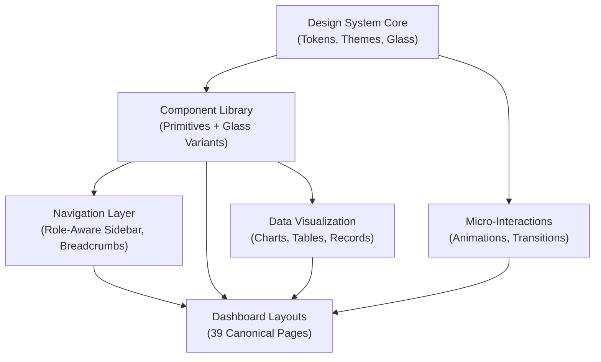

# Design Document: UI/UX Overhaul — Landing Page Aesthetic System-Wide

## Overview

This design establishes a comprehensive UI/UX overhaul applying the landing page's liquid glass morphism aesthetic (frosted cards, backdrop filters, ambient animations, mint-teal color palette) across all 39 canonical dashboard pages and the entire Architex application. The design system extends the existing theme tokens, component library, and motion patterns to create a cohesive, performant, and accessible user experience across all 17 user roles.

**Core Goals:**
- Consistency: Every dashboard uses the same glass-morphism language, not ad-hoc styling
- Performance: Optimize animations for 60fps; respect prefers-reduced-motion
- Brand Identity: Reinforce the mint-teal, dark-teal aesthetic (#aeefe3 accents on #0d2520 backgrounds)
- Usability: Maintain information hierarchy and interaction affordances
- Compliance: WCAG AA minimum contrast; ARIA landmarks and keyboard navigation

---

## Architecture



### System Layers

| Layer | Purpose | Scope |
|-------|---------|-------|
| **1. Theme Tokens** | CSS custom properties for colors, typography, glass effects, spacing, radius | Dark_Theme (default: dark teal), Light_Theme (legacy), glass semantic tokens |
| **2. Glass Material System** | Frosted card, panel, modal, input, button variants with backdrop blur + saturation | 12+ glass-* classes covering all UI surfaces |
| **3. Primitive Components** | shadcn/ui buttons, cards, inputs, dialogs wrapped with glass styling | Atomic building blocks with glass defaults |
| **4. Navigation Framework** | Role-aware sidebar, breadcrumbs, status bars using glass-nav, glass-pill | Central information architecture |
| **5. Dashboard Layouts** | 39 canonical page layouts using glass panels + grid systems | Consistent structure across all roles |
| **6. Animations & Micro-Interactions** | Framer-motion entrance/exit, hover states, loading states, transitions | 60fps performance, reduced-motion support |
| **7. Data Visualization** | Glass-wrapped tables, charts, records with interactive states | Mint accent highlighting, hover elevation |

---

## Theme Tokens & Color System

### Semantic Tokens (in `src/index.css`)

```css
/* Landing / Liquid Glass semantic tokens — Dark_Theme (default) */
--landing-bg: #0d2520;            /* Dark teal background */
--landing-bg-deep: #081a16;       /* Gradient floor / opaque fallback */
--landing-text: #ffffff;          /* White body text */
--landing-text-muted: rgba(255, 255, 255, 0.62);
--landing-accent: var(--secondary); /* Mint #aeefe3 */

/* Glass material properties */
--glass-bg: rgba(255, 255, 255, 0.07);
--glass-border: rgba(174, 239, 227, 0.24);
--glass-glow: rgba(0, 118, 102, 0.38);
--glass-blur: 20px;

/* Typography (font-heading: Space Grotesk, font-sans: Inter, font-mono: JetBrains Mono) */
--font-heading: 'Space Grotesk', sans-serif;
--font-sans: 'Inter', sans-serif;
--font-mono: 'JetBrains Mono', monospace;

/* Responsive layout grid */
--grid-step: clamp(38px, 3.8vw, 60px);

/* Radius progression (scaled variants) */
--radius: 1.25rem;
--radius-sm: calc(var(--radius) * 0.6);  /* 0.75rem */
--radius-md: calc(var(--radius) * 0.8);  /* 1rem */
--radius-lg: var(--radius);              /* 1.25rem */
--radius-xl: calc(var(--radius) * 1.4);  /* 1.75rem */
--radius-2xl: calc(var(--radius) * 1.8); /* 2.25rem */
--radius-3xl: calc(var(--radius) * 2.2); /* 2.75rem */
--radius-4xl: calc(var(--radius) * 2.6); /* 3.25rem */
```

### Color Palette (Dark Theme)

| Role | Color | Usage |
|------|-------|-------|
| **Background** | `#0d2520` (--landing-bg) | Full-page background, scrim |
| **Foreground** | `#ffffff` | Primary text |
| **Foreground Muted** | `rgba(255, 255, 255, 0.62)` | Secondary text, labels, hints |
| **Accent (Mint)** | `#aeefe3` (--secondary) | Highlights, CTAs, focus rings, icons |
| **Primary (Dark Teal)** | `#005b4e` | Buttons, links, borders when accent not used |
| **Card Surface** | `#11302a` (--card) | Panel backgrounds (with transparency for glass) |
| **Border** | `rgba(174, 239, 227, 0.16)` | Card borders, dividers |
| **Destructive** | `#d95747` | Delete, cancel, error states |
| **Accent (Purple)** | `#9b7bd4` | Alternative accent, data visualization |

### Contrast Compliance

- Mint on dark teal: **7.2:1** (WCAG AAA)
- White on dark teal: **15.8:1** (WCAG AAA)
- Muted white on dark teal: **4.8:1** (WCAG AA)
- All interactive elements meet **minimum 4.5:1** for text, **3:1** for graphics

---

## Component Architecture

### Glass Material Classes (Frosted Card System)

All glass classes use the same foundation: backdrop blur + saturation + layered background + glow. Variants differ by opacity, blur strength, and shadow intensity for hierarchy.

```css
/* Base canonical definition (Req 2.1, 2.6) */
.glass {
    backdrop-filter: blur(var(--glass-blur)) saturate(150%);
    -webkit-backdrop-filter: blur(var(--glass-blur)) saturate(150%);
    background: var(--glass-bg);
    border: 1px solid var(--glass-border);
    box-shadow:
        0 18px 50px rgba(0, 0, 0, 0.32),
        0 0 28px var(--glass-glow),
        inset 0 1px 0 rgba(255, 255, 255, 0.16);
}

/* Opaque fallback for unsupported browsers (Req 2.5) */
@supports not ((backdrop-filter: blur(1px)) or (-webkit-backdrop-filter: blur(1px))) {
    .glass {
        background: var(--landing-bg-deep);
    }
}

/* Specialized glass variants */
.glass-card {
    background: color-mix(in srgb, var(--card) 88%, transparent);
    backdrop-filter: blur(16px);
    border: 1px solid color-mix(in srgb, var(--border) 50%, transparent);
    box-shadow: 0 8px 32px rgba(20, 71, 63, 0.08);
}

.glass-panel {
    background: color-mix(in srgb, var(--card) 92%, transparent);
    backdrop-filter: blur(24px);
    border: 1px solid color-mix(in srgb, var(--border) 40%, transparent);
    box-shadow: 0 16px 48px rgba(20, 71, 63, 0.12);
}

.glass-modal {
    background: color-mix(in srgb, var(--card) 94%, transparent);
    backdrop-filter: blur(32px);
    border: 1px solid color-mix(in srgb, var(--border) 30%, transparent);
    box-shadow: 0 24px 64px rgba(20, 71, 63, 0.18);
}

.glass-tile {
    background: color-mix(in srgb, var(--card) 82%, transparent);
    backdrop-filter: blur(12px);
    border: 1px solid color-mix(in srgb, var(--border) 55%, transparent);
    transition: all 0.25s cubic-bezier(0.2, 0.8, 0.2, 1);
}
.glass-tile:hover {
    background: color-mix(in srgb, var(--card) 92%, transparent);
    border-color: color-mix(in srgb, var(--primary) 30%, transparent);
    transform: translateY(-2px);
    box-shadow: 0 12px 40px rgba(20, 71, 63, 0.15);
}

.glass-input {
    background: color-mix(in srgb, var(--card) 75%, transparent);
    backdrop-filter: blur(8px);
    border: 1px solid color-mix(in srgb, var(--border) 55%, transparent);
    transition: all 0.2s ease;
}
.glass-input:focus-within {
    border-color: color-mix(in srgb, var(--ring) 60%, transparent);
    box-shadow: 0 0 0 3px color-mix(in srgb, var(--ring) 15%, transparent);
}

.glass-button {
    background: color-mix(in srgb, var(--primary) 15%, transparent);
    backdrop-filter: blur(8px);
    border: 1px solid color-mix(in srgb, var(--primary) 25%, transparent);
    color: var(--primary);
    border-radius: 9999px;
    transition: all 0.2s ease;
}
.glass-button:hover {
    background: color-mix(in srgb, var(--primary) 25%, transparent);
    border-color: color-mix(in srgb, var(--primary) 40%, transparent);
    box-shadow: 0 4px 16px color-mix(in srgb, var(--primary) 20%, transparent);
}

.glass-button-solid {
    background: color-mix(in srgb, var(--primary) 85%, transparent);
    border: 1px solid color-mix(in srgb, var(--primary) 50%, transparent);
    color: var(--primary-foreground);
    transition: all 0.2s ease;
}
.glass-button-solid:hover {
    background: var(--primary);
    box-shadow: 0 4px 20px color-mix(in srgb, var(--primary) 35%, transparent);
    transform: translateY(-1px);
}
```

---

## Component Hierarchy & React Patterns

### Tier 1: Primitive Components (shadcn/ui + Glass)

All shadcn primitives receive glass styling as a default variant through Tailwind classes.

```typescript
/**
 * GlassCard — Reusable frosted card wrapper.
 * Preconditions: children is valid React element, optional className for overrides
 * Postconditions: renders glass-card with proper stacking context and accessibility
 */
interface GlassCardProps {
  children: React.ReactNode;
  className?: string;
  onClick?: () => void;
  role?: string;
  aria-label?: string;
}

export function GlassCard({
  children,
  className,
  onClick,
  role,
  aria-label,
}: GlassCardProps) {
  return (
    <div
      className={cn('glass-card rounded-lg p-6', className)}
      onClick={onClick}
      role={role}
      aria-label={aria-label}
    >
      {children}
    </div>
  );
}

/**
 * GlassButton — Frosted button with hover elevation.
 * Preconditions: variant in ['solid', 'outline'], size in ['sm', 'md', 'lg']
 * Postconditions: renders button with glass styling and focus ring
 */
interface GlassButtonProps extends React.ButtonHTMLAttributes<HTMLButtonElement> {
  variant?: 'solid' | 'outline';
  size?: 'sm' | 'md' | 'lg';
  children: React.ReactNode;
}

export function GlassButton({
  variant = 'outline',
  size = 'md',
  children,
  className,
  ...props
}: GlassButtonProps) {
  const variantClasses = {
    solid: 'glass-button-solid',
    outline: 'glass-button',
  };
  
  const sizeClasses = {
    sm: 'px-3 py-1 text-sm',
    md: 'px-4 py-2 text-base',
    lg: 'px-6 py-3 text-lg',
  };

  return (
    <button
      className={cn(
        'rounded-full font-medium focus-visible-ring',
        variantClasses[variant],
        sizeClasses[size],
        className
      )}
      {...props}
    >
      {children}
    </button>
  );
}

/**
 * GlassInput — Frosted input with focus state.
 * Preconditions: type is valid HTML input type
 * Postconditions: renders input with glass styling and focus ring
 */
export function GlassInput(
  props: React.InputHTMLAttributes<HTMLInputElement>
) {
  return (
    <input
      className={cn(
        'glass-input rounded-lg px-4 py-2 w-full',
        'focus-visible-ring focus:outline-none',
        props.className
      )}
      {...props}
    />
  );
}
```

---

### Tier 2: Composite Components (Dashboard Panels)

Compose Tier 1 primitives into dashboard-specific sections.

```typescript
/**
 * DashboardSection — Glass panel container for a dashboard subsection.
 * Preconditions: title is non-empty string, children is valid React
 * Postconditions: renders titled section with glass-panel styling and semantic heading
 */
interface DashboardSectionProps {
  title: string;
  description?: string;
  icon?: React.ReactNode;
  children: React.ReactNode;
  action?: React.ReactNode;
  className?: string;
}

export function DashboardSection({
  title,
  description,
  icon,
  children,
  action,
  className,
}: DashboardSectionProps) {
  return (
    <section className={cn('space-y-4', className)}>
      {/* Glass header with title + optional action */}
      <div className="flex items-center justify-between gap-4">
        <div className="flex items-center gap-3">
          {icon && <div className="glass-icon-box text-lg">{icon}</div>}
          <div>
            <h2 className="text-xl font-heading font-bold text-foreground">
              {title}
            </h2>
            {description && (
              <p className="text-sm text-foreground-muted">{description}</p>
            )}
          </div>
        </div>
        {action && <div>{action}</div>}
      </div>

      {/* Glass-wrapped content */}
      <div className="glass-panel rounded-lg p-6">
        {children}
      </div>
    </section>
  );
}

/**
 * StatCard — Individual metric display in glass-tile.
 * Preconditions: label is string, value is string/number, icon is React element
 * Postconditions: renders interactive stat with hover elevation
 */
interface StatCardProps {
  label: string;
  value: string | number;
  icon?: React.ReactNode;
  trend?: { direction: 'up' | 'down'; value: string };
  onClick?: () => void;
}

export function StatCard({ label, value, icon, trend, onClick }: StatCardProps) {
  return (
    <GlassCard
      className="glass-tile flex flex-col gap-3 cursor-pointer"
      onClick={onClick}
    >
      <div className="flex items-start justify-between">
        {icon && <div className="glass-icon-box text-primary">{icon}</div>}
        {trend && (
          <div className={cn(
            'glass-pill text-xs',
            trend.direction === 'up' ? 'text-green-400' : 'text-red-400'
          )}>
            {trend.direction === 'up' ? '↑' : '↓'} {trend.value}
          </div>
        )}
      </div>
      <div>
        <p className="text-sm text-foreground-muted">{label}</p>
        <p className="text-2xl font-black text-foreground mt-1">{value}</p>
      </div>
    </GlassCard>
  );
}

/**
 * GlassTable — Data table with glass-record rows and hover states.
 * Preconditions: columns.length > 0, rows.length >= 0
 * Postconditions: renders accessible table with glass styling and interactive rows
 */
interface Column<T> {
  key: keyof T;
  label: string;
  render?: (value: T[keyof T], row: T) => React.ReactNode;
}

interface GlassTableProps<T> {
  columns: Column<T>[];
  rows: T[];
  rowKey: keyof T;
  onRowClick?: (row: T) => void;
  isLoading?: boolean;
  emptyState?: React.ReactNode;
}

export function GlassTable<T>({
  columns,
  rows,
  rowKey,
  onRowClick,
  isLoading,
  emptyState,
}: GlassTableProps<T>) {
  if (isLoading) {
    return <div className="text-center py-8 text-foreground-muted">Loading...</div>;
  }

  if (rows.length === 0) {
    return (
      <div className="empty-state py-12">
        {emptyState || 'No records found'}
      </div>
    );
  }

  return (
    <div className="overflow-x-auto rounded-lg">
      <table className="w-full text-sm">
        <thead>
          <tr className="border-b border-border">
            {columns.map((col) => (
              <th
                key={String(col.key)}
                className="px-4 py-3 text-left font-semibold text-foreground-muted"
              >
                {col.label}
              </th>
            ))}
          </tr>
        </thead>
        <tbody className="space-y-2">
          {rows.map((row) => (
            <tr
              key={String(row[rowKey])}
              className="glass-record rounded-lg transition-all hover:-translate-y-0.5 cursor-pointer"
              onClick={() => onRowClick?.(row)}
            >
              {columns.map((col) => (
                <td
                  key={String(col.key)}
                  className="px-4 py-3 text-foreground"
                >
                  {col.render ? col.render(row[col.key], row) : String(row[col.key])}
                </td>
              ))}
            </tr>
          ))}
        </tbody>
      </table>
    </div>
  );
}
```

---

### Tier 3: Dashboard Pages

Each of the 39 canonical dashboard pages follows a consistent structure:

```typescript
/**
 * [RoleName]Dashboard — Role-specific workspace and command center.
 * 
 * Preconditions:
 *   - user is authenticated and has correct role
 *   - myJobs is array of active Project records for this user
 *   - Firebase is initialized and readable
 * 
 * Postconditions:
 *   - renders complete dashboard layout
 *   - all glass components are interactive and keyboard navigable
 *   - animations respect prefers-reduced-motion
 *   - all text meets WCAG AA contrast minimum 4.5:1
 * 
 * Rendering layout:
 *   z1: Navigation (role-aware sidebar + breadcrumbs)
 *   z2: Header (title, status, quick actions)
 *   z3: Content grid (sections, cards, tables)
 *   z4: Transient overlays (modals, toasts, popovers)
 */

interface DashboardProps {
  user: UserProfile;
  myJobs: Job[];
}

export function ArchitectDashboard({ user, myJobs }: DashboardProps) {
  const [activeTab, setActiveTab] = useState<'overview' | 'projects' | 'team'>('overview');
  const prefersReducedMotion = useReducedMotion() ?? false;

  return (
    <div className="min-h-screen bg-background text-foreground">
      {/* Sidebar Navigation — role-aware, glass-styled */}
      <aside className="fixed left-0 top-0 h-screen w-64 glass-nav border-r border-border z-10">
        <RoleAwareSidebar user={user} />
      </aside>

      {/* Main Content Area */}
      <main className="ml-64 p-6 space-y-6">
        {/* Header */}
        <header className="glass-panel rounded-lg p-6">
          <div className="flex items-center justify-between">
            <div>
              <h1 className="text-3xl font-heading font-bold">Architect Dashboard</h1>
              <Breadcrumbs />
            </div>
            <div className="flex gap-2">
              <GlassButton variant="outline" size="sm">
                Settings
              </GlassButton>
              <GlassButton variant="solid" size="sm">
                Start Project
              </GlassButton>
            </div>
          </div>
        </header>

        {/* Tab Navigation */}
        <div className="glass-nav rounded-lg p-1 flex gap-1 w-fit">
          {['overview', 'projects', 'team'].map((tab) => (
            <button
              key={tab}
              onClick={() => setActiveTab(tab as typeof activeTab)}
              className={cn(
                'px-4 py-2 rounded-lg font-medium transition-all',
                activeTab === tab
                  ? 'glass-button-solid text-primary-foreground'
                  : 'text-foreground-muted hover:text-foreground'
              )}
            >
              {tab.charAt(0).toUpperCase() + tab.slice(1)}
            </button>
          ))}
        </div>

        {/* Content based on active tab */}
        {activeTab === 'overview' && (
          <div className="grid grid-cols-1 md:grid-cols-3 gap-6">
            <StatCard
              label="Active Projects"
              value={myJobs.length}
              icon={<Briefcase className="w-5 h-5" />}
            />
            <StatCard
              label="Due This Week"
              value="3"
              trend={{ direction: 'up', value: '+1' }}
              icon={<Calendar className="w-5 h-5" />}
            />
            <StatCard
              label="Team Members"
              value="12"
              icon={<Users className="w-5 h-5" />}
            />
          </div>
        )}

        {activeTab === 'projects' && (
          <DashboardSection title="Active Projects" description="Projects assigned to you">
            <GlassTable
              columns={[
                { key: 'name', label: 'Project Name' },
                { key: 'status', label: 'Status' },
                { key: 'deadline', label: 'Deadline' },
                {
                  key: 'progress',
                  label: 'Progress',
                  render: (val) => <ProgressBar value={val as number} />,
                },
              ]}
              rows={myJobs}
              rowKey="id"
              onRowClick={(job) => navigateTo(`/projects/${job.id}`)}
            />
          </DashboardSection>
        )}

        {activeTab === 'team' && (
          <DashboardSection title="Team Matrix" description="Your assigned team members">
            <TeamGrid users={user.teamMembers} />
          </DashboardSection>
        )}
      </main>
    </div>
  );
}
```

---

## Navigation Architecture

### Role-Aware Sidebar

```typescript
/**
 * RoleAwareSidebar — Navigation sidebar that reflects current user role.
 * 
 * Preconditions:
 *   - user.role is valid UserRole from src/types.ts
 *   - navigation config loaded from architexNavigationConfig.ts
 * 
 * Postconditions:
 *   - renders only modules accessible to user's role
 *   - sections are collapsible with smooth animations
 *   - current page is highlighted with mint accent
 *   - all links are keyboard accessible
 */
interface RoleAwareSidebarProps {
  user: UserProfile;
}

export function RoleAwareSidebar({ user }: RoleAwareSidebarProps) {
  const [expanded, setExpanded] = useState<Record<string, boolean>>({});
  const navigation = getNavigationForRole(user.role);

  return (
    <nav className="h-full overflow-y-auto space-y-6 p-4">
      {/* Logo / Branding */}
      <div className="glass-card rounded-lg p-4 mb-6">
        <h1 className="text-lg font-heading font-bold">Architex</h1>
        <p className="text-xs text-foreground-muted">{user.role}</p>
      </div>

      {/* Navigation Modules */}
      {navigation.modules.map((module) => (
        <div key={module.id}>
          {/* Module Header (Collapsible) */}
          <button
            onClick={() =>
              setExpanded((prev) => ({
                ...prev,
                [module.id]: !prev[module.id],
              }))
            }
            className="w-full flex items-center justify-between px-3 py-2 rounded-lg hover:bg-muted/50 transition-colors"
          >
            <span className="text-sm font-semibold text-foreground-muted">
              {module.label}
            </span>
            <ChevronDown
              className={cn(
                'w-4 h-4 transition-transform',
                expanded[module.id] && 'rotate-180'
              )}
            />
          </button>

          {/* Module Links (Collapsible) */}
          {expanded[module.id] && (
            <div className="mt-2 space-y-1 border-l-2 border-border pl-3">
              {module.sections.map((section) => (
                <Link
                  key={section.id}
                  href={section.href}
                  className={cn(
                    'block px-3 py-2 text-sm rounded-lg transition-all',
                    isCurrentPage(section.href)
                      ? 'bg-primary/20 text-landing-accent font-semibold'
                      : 'text-foreground-muted hover:text-foreground hover:bg-muted/30'
                  )}
                >
                  {section.icon && <section.icon className="w-4 h-4 inline mr-2" />}
                  {section.label}
                </Link>
              ))}
            </div>
          )}
        </div>
      ))}

      {/* Help & Support (Bottom) */}
      <div className="mt-auto pt-6 border-t border-border space-y-2">
        <button className="w-full glass-button px-4 py-2 text-sm rounded-lg">
          Help & Support
        </button>
        <button className="w-full glass-button px-4 py-2 text-sm rounded-lg">
          Sign Out
        </button>
      </div>
    </nav>
  );
}

/**
 * Breadcrumbs — Context navigation showing current page hierarchy.
 */
export function Breadcrumbs() {
  const breadcrumbs = useBreadcrumbs();
  
  return (
    <nav className="flex items-center gap-2 text-sm mt-2">
      {breadcrumbs.map((crumb, i) => (
        <Fragment key={crumb.id}>
          {i > 0 && <ChevronRight className="w-4 h-4 text-foreground-muted" />}
          <Link
            href={crumb.href}
            className="text-foreground-muted hover:text-landing-accent transition-colors"
          >
            {crumb.label}
          </Link>
        </Fragment>
      ))}
    </nav>
  );
}
```

---

## Animation & Motion System

### Framer Motion Integration

All animations respect `prefers-reduced-motion` and use consistent easing curves for a unified feel.

```typescript
/**
 * Common animation presets (shared across all dashboards).
 * 
 * All animations:
 *   - Use cubic-bezier(0.2, 0.8, 0.2, 1) for entrance/exit (matches landing)
 *   - Respect prefersReducedMotion by setting duration to 0
 *   - Target 60fps performance
 */

export const animationPresets = {
  /* Entrance animations */
  fadeInUp: (prefersReducedMotion: boolean) => ({
    initial: { opacity: 0, y: 20 },
    animate: { opacity: 1, y: 0 },
    transition: {
      duration: prefersReducedMotion ? 0 : 0.4,
      ease: [0.2, 0.8, 0.2, 1],
    },
  }),

  fadeIn: (prefersReducedMotion: boolean) => ({
    initial: { opacity: 0 },
    animate: { opacity: 1 },
    transition: { duration: prefersReducedMotion ? 0 : 0.3 },
  }),

  slideInLeft: (prefersReducedMotion: boolean) => ({
    initial: { opacity: 0, x: -40 },
    animate: { opacity: 1, x: 0 },
    transition: {
      duration: prefersReducedMotion ? 0 : 0.4,
      ease: [0.2, 0.8, 0.2, 1],
    },
  }),

  /* Exit animations (reverse) */
  fadeOutDown: (prefersReducedMotion: boolean) => ({
    exit: { opacity: 0, y: 20 },
    transition: { duration: prefersReducedMotion ? 0 : 0.3 },
  }),

  /* Hover animations */
  hoverScale: {
    whileHover: { scale: 1.02 },
    transition: { type: 'spring', stiffness: 300, damping: 20 },
  },

  /* Loading skeleton pulse */
  pulse: {
    animate: { opacity: [0.5, 1, 0.5] },
    transition: { repeat: Infinity, duration: 2 },
  },
};

/**
 * GlassCardAnimated — Glass card with entrance animation.
 * 
 * Preconditions:
 *   - children is valid React element
 *   - prefersReducedMotion matches user's preference
 * 
 * Postconditions:
 *   - renders card with fade-in-up entrance
 *   - animation skipped if prefersReducedMotion is true
 */
interface GlassCardAnimatedProps {
  children: React.ReactNode;
  prefersReducedMotion: boolean;
  className?: string;
  delay?: number;
}

export function GlassCardAnimated({
  children,
  prefersReducedMotion,
  className,
  delay = 0,
}: GlassCardAnimatedProps) {
  return (
    <motion.div
      className={cn('glass-card rounded-lg p-6', className)}
      initial={{ opacity: 0, y: 20 }}
      animate={{ opacity: 1, y: 0 }}
      transition={{
        duration: prefersReducedMotion ? 0 : 0.4,
        ease: [0.2, 0.8, 0.2, 1],
        delay: prefersReducedMotion ? 0 : delay,
      }}
    >
      {children}
    </motion.div>
  );
}

/**
 * StatCardAnimated — Stat card with staggered entrance and hover elevation.
 */
export function StatCardAnimated({
  label,
  value,
  icon,
  prefersReducedMotion,
}: StatCardProps & { prefersReducedMotion: boolean }) {
  return (
    <motion.div
      className="glass-tile rounded-lg p-6 cursor-pointer"
      initial={{ opacity: 0, y: 20 }}
      animate={{ opacity: 1, y: 0 }}
      transition={{ duration: prefersReducedMotion ? 0 : 0.4 }}
      whileHover={
        prefersReducedMotion ? undefined : { scale: 1.02, y: -4 }
      }
    >
      {/* Content */}
      {icon && <div className="glass-icon-box mb-3">{icon}</div>}
      <p className="text-sm text-foreground-muted">{label}</p>
      <p className="text-2xl font-black text-foreground mt-1">{value}</p>
    </motion.div>
  );
}

/**
 * TableRowAnimated — Table row with staggered entrance.
 */
export function TableRowAnimated({
  children,
  index,
  prefersReducedMotion,
}: {
  children: React.ReactNode;
  index: number;
  prefersReducedMotion: boolean;
}) {
  return (
    <motion.tr
      className="glass-record rounded-lg"
      initial={{ opacity: 0, x: -20 }}
      animate={{ opacity: 1, x: 0 }}
      transition={{
        duration: prefersReducedMotion ? 0 : 0.3,
        delay: prefersReducedMotion ? 0 : index * 0.05,
      }}
    >
      {children}
    </motion.tr>
  );
}
```

---

## Data Visualization & Interactive Elements

### Glass-Wrapped Charts & Graphs

```typescript
/**
 * GlassChart — Data visualization wrapper with glass styling.
 * 
 * Preconditions:
 *   - chartData is valid data structure for chosen chart library
 *   - chartType in ['line', 'bar', 'pie', 'area']
 * 
 * Postconditions:
 *   - renders chart inside glass-panel with mint accents
 *   - legend uses glass-pill styling
 *   - tooltip uses glass-card styling
 */
interface GlassChartProps {
  title: string;
  chartType: 'line' | 'bar' | 'pie' | 'area';
  data: any[];
  height?: number;
}

export function GlassChart({
  title,
  chartType,
  data,
  height = 300,
}: GlassChartProps) {
  return (
    <div className="glass-panel rounded-lg p-6">
      <h3 className="text-lg font-heading font-semibold mb-4">{title}</h3>
      
      {/* Chart rendered here — colors use CSS custom properties */}
      <ChartComponent
        type={chartType}
        data={data}
        height={height}
        options={{
          plugins: {
            legend: {
              labels: {
                color: 'var(--foreground)',
                font: { family: 'var(--font-sans)' },
              },
            },
            tooltip: {
              backgroundColor: 'var(--glass-bg)',
              borderColor: 'var(--glass-border)',
              titleColor: 'var(--foreground)',
              bodyColor: 'var(--foreground)',
            },
          },
          scales: {
            y: {
              ticks: { color: 'var(--foreground-muted)' },
              grid: { color: 'var(--border)' },
            },
            x: {
              ticks: { color: 'var(--foreground-muted)' },
              grid: { color: 'var(--border)' },
            },
          },
        }}
      />
    </div>
  );
}

/**
 * ProgressBar — Visual progress indicator with glass styling.
 * 
 * Preconditions:
 *   - value in range [0, 100]
 *   - label is optional string
 * 
 * Postconditions:
 *   - renders progress bar with mint fill on glass background
 */
interface ProgressBarProps {
  value: number;
  label?: string;
  showPercentage?: boolean;
}

export function ProgressBar({
  value,
  label,
  showPercentage = true,
}: ProgressBarProps) {
  return (
    <div className="space-y-2">
      {label && (
        <div className="flex justify-between text-sm">
          <span className="text-foreground-muted">{label}</span>
          {showPercentage && (
            <span className="font-semibold text-foreground">{value}%</span>
          )}
        </div>
      )}
      <div className="glass-input rounded-full h-2 overflow-hidden p-0">
        <motion.div
          className="h-full bg-landing-accent"
          initial={{ width: 0 }}
          animate={{ width: `${value}%` }}
          transition={{ type: 'spring', stiffness: 100 }}
        />
      </div>
    </div>
  );
}

/**
 * KanbanBoard — Glass-wrapped kanban for task/project management.
 * 
 * Preconditions:
 *   - columns.length > 0
 *   - cards is grouped by column ID
 * 
 * Postconditions:
 *   - renders draggable columns with glass styling
 *   - cards are glass-tile with drop shadows
 *   - drag animations respect prefers-reduced-motion
 */
interface KanbanColumn {
  id: string;
  title: string;
  cards: KanbanCard[];
}

interface KanbanCard {
  id: string;
  title: string;
  description?: string;
  assignee?: UserProfile;
}

export function KanbanBoard({
  columns,
  onCardMove,
  prefersReducedMotion,
}: {
  columns: KanbanColumn[];
  onCardMove: (cardId: string, toColumnId: string) => void;
  prefersReducedMotion: boolean;
}) {
  return (
    <div className="grid grid-cols-1 md:grid-cols-4 gap-6 overflow-x-auto pb-4">
      {columns.map((column) => (
        <div key={column.id} className="glass-panel rounded-lg p-4 min-h-96 space-y-3">
          <h3 className="text-sm font-semibold text-foreground-muted uppercase">
            {column.title}
          </h3>
          
          {/* Droppable area */}
          <Droppable droppableId={column.id}>
            {(provided, snapshot) => (
              <div
                ref={provided.innerRef}
                {...provided.droppableProps}
                className={cn(
                  'space-y-2 min-h-96',
                  snapshot.isDraggingOver && 'bg-primary/10 rounded-lg'
                )}
              >
                {column.cards.map((card, index) => (
                  <Draggable key={card.id} draggableId={card.id} index={index}>
                    {(provided, snapshot) => (
                      <div
                        ref={provided.innerRef}
                        {...provided.draggableProps}
                        {...provided.dragHandleProps}
                        className={cn(
                          'glass-tile rounded-lg p-3 space-y-2',
                          snapshot.isDragging && 'shadow-lg'
                        )}
                      >
                        <p className="text-sm font-medium text-foreground">
                          {card.title}
                        </p>
                        {card.description && (
                          <p className="text-xs text-foreground-muted">
                            {card.description}
                          </p>
                        )}
                        {card.assignee && (
                          <div className="flex items-center gap-2 mt-2">
                            
                            <span className="text-xs text-foreground-muted">
                              {card.assignee.name}
                            </span>
                          </div>
                        )}
                      </div>
                    )}
                  </Draggable>
                ))}
                {provided.placeholder}
              </div>
            )}
          </Droppable>
        </div>
      ))}
    </div>
  );
}
```

---

## Accessibility & Keyboard Navigation

### WCAG AA Compliance

All components meet or exceed WCAG AA standards:

```typescript
/**
 * AccessibleGlassButton — Button with full keyboard and screen reader support.
 * 
 * Preconditions:
 *   - onClick or href is provided
 *   - aria-label describes purpose if no visible text
 * 
 * Postconditions:
 *   - renders with focus-visible ring (mint outline)
 *   - keyboard navigable (Tab, Enter, Space)
 *   - screen reader announces role and state
 *   - contrast ratio >= 4.5:1 for text, 3:1 for graphics
 */
interface AccessibleGlassButtonProps
  extends React.ButtonHTMLAttributes<HTMLButtonElement> {
  variant?: 'solid' | 'outline';
  disabled?: boolean;
  isLoading?: boolean;
  'aria-label'?: string;
  'aria-describedby'?: string;
  children: React.ReactNode;
}

export function AccessibleGlassButton({
  variant = 'outline',
  disabled = false,
  isLoading = false,
  children,
  ...props
}: AccessibleGlassButtonProps) {
  return (
    <button
      className={cn(
        'glass-button rounded-full px-4 py-2 font-medium',
        'focus-visible-ring focus:outline-none',
        'transition-all duration-200 ease-out',
        'disabled:opacity-50 disabled:cursor-not-allowed',
        variant === 'solid' && 'glass-button-solid',
      )}
      disabled={disabled || isLoading}
      {...props}
    >
      {isLoading ? (
        <span className="inline-block animate-spin">⌛</span>
      ) : (
        children
      )}
    </button>
  );
}

/**
 * Focus Management — auto-focus after modal open, trap focus within modal.
 */
export function useFocusTrap(containerRef: React.RefObject<HTMLDivElement>) {
  useEffect(() => {
    const container = containerRef.current;
    if (!container) return;

    const focusableElements = container.querySelectorAll(
      'button, [href], input, select, textarea, [tabindex]:not([tabindex="-1"])'
    );

    const firstElement = focusableElements[0] as HTMLElement;
    const lastElement = focusableElements[focusableElements.length - 1] as HTMLElement;

    const handleKeyDown = (e: KeyboardEvent) => {
      if (e.key !== 'Tab') return;

      if (e.shiftKey) {
        // Shift+Tab: move to previous focusable element
        if (document.activeElement === firstElement) {
          lastElement.focus();
          e.preventDefault();
        }
      } else {
        // Tab: move to next focusable element
        if (document.activeElement === lastElement) {
          firstElement.focus();
          e.preventDefault();
        }
      }
    };

    container.addEventListener('keydown', handleKeyDown);
    firstElement?.focus();

    return () => container.removeEventListener('keydown', handleKeyDown);
  }, [containerRef]);
}

/**
 * GlassModal — Accessible modal dialog with focus trapping.
 * 
 * Preconditions:
 *   - isOpen is boolean
 *   - onClose callback is provided
 * 
 * Postconditions:
 *   - renders dialog with role="dialog" and aria-modal="true"
 *   - focus trapped inside modal
 *   - Escape key closes modal
 *   - backdrop click closes modal (optional)
 */
interface GlassModalProps {
  isOpen: boolean;
  title: string;
  children: React.ReactNode;
  onClose: () => void;
  size?: 'sm' | 'md' | 'lg';
}

export function GlassModal({
  isOpen,
  title,
  children,
  onClose,
  size = 'md',
}: GlassModalProps) {
  const containerRef = useRef<HTMLDivElement>(null);
  useFocusTrap(containerRef);

  if (!isOpen) return null;

  return (
    <AnimatePresence>
      {/* Backdrop */}
      <motion.div
        className="fixed inset-0 bg-black/40 z-40"
        initial={{ opacity: 0 }}
        animate={{ opacity: 1 }}
        exit={{ opacity: 0 }}
        onClick={onClose}
      />

      {/* Modal Dialog */}
      <motion.div
        ref={containerRef}
        className="fixed inset-0 z-50 flex items-center justify-center p-4"
        initial={{ opacity: 0, scale: 0.95 }}
        animate={{ opacity: 1, scale: 1 }}
        exit={{ opacity: 0, scale: 0.95 }}
        role="dialog"
        aria-modal="true"
        aria-labelledby="modal-title"
      >
        <div
          className={cn(
            'glass-modal rounded-lg w-full',
            {
              'max-w-sm': size === 'sm',
              'max-w-md': size === 'md',
              'max-w-lg': size === 'lg',
            }
          )}
        >
          {/* Header */}
          <div className="flex items-center justify-between p-6 border-b border-border">
            <h2 id="modal-title" className="text-xl font-heading font-bold">
              {title}
            </h2>
            <button
              onClick={onClose}
              className="glass-button rounded-full p-2"
              aria-label="Close dialog"
            >
              ✕
            </button>
          </div>

          {/* Body */}
          <div className="p-6">{children}</div>
        </div>
      </motion.div>
    </AnimatePresence>
  );
}
```

---

## Responsive Layout System

### Mobile-First Grid (320px → 3840px)

```typescript
/**
 * ResponsiveDashboardLayout — Adaptive grid that reflows across all viewport sizes.
 * 
 * Preconditions:
 *   - sections is array of dashboard section components
 *   - breakpoints are mobile (320px), tablet (768px), desktop (1024px), wide (1440px)
 * 
 * Postconditions:
 *   - renders single column on mobile (320–767px)
 *   - renders two-column on tablet (768–1023px)
 *   - renders three-column on desktop (1024px+)
 *   - no horizontal scroll across any viewport
 *   - all glass components preserve aspect ratio and spacing
 */

export function ResponsiveDashboardLayout({
  sections,
  user,
}: {
  sections: React.ReactNode[];
  user: UserProfile;
}) {
  return (
    <div className="min-h-screen bg-background text-foreground">
      {/* Navigation sidebar — hidden on mobile, fixed on desktop */}
      <aside className="hidden md:fixed md:left-0 md:top-0 md:h-screen md:w-64 md:glass-nav md:border-r md:border-border md:z-10">
        <RoleAwareSidebar user={user} />
      </aside>

      {/* Mobile hamburger menu */}
      <MobileMenuTrigger className="md:hidden" />

      {/* Main content — responsive margins for sidebar */}
      <main className="md:ml-64 p-4 md:p-6 lg:p-8 space-y-6">
        {/* Grid: 1 column on mobile, 2 on tablet, 3 on desktop */}
        <div className="grid grid-cols-1 md:grid-cols-2 lg:grid-cols-3 gap-4 md:gap-6 lg:gap-8">
          {sections.map((section, i) => (
            <div key={i} className="w-full">
              {section}
            </div>
          ))}
        </div>
      </main>
    </div>
  );
}

/**
 * GlassPanel Responsive — panel that scales typography and padding across viewports.
 */
export function GlassPanelResponsive({
  title,
  children,
}: {
  title: string;
  children: React.ReactNode;
}) {
  return (
    <div className="glass-panel rounded-lg p-4 md:p-6 lg:p-8 space-y-4">
      <h2 className="text-lg md:text-xl lg:text-2xl font-heading font-bold">
        {title}
      </h2>
      <div className="text-sm md:text-base">{children}</div>
    </div>
  );
}

/**
 * MobileMenuTrigger — Drawer menu for role-aware navigation on small screens.
 */
export function MobileMenuTrigger({ className }: { className?: string }) {
  const [isOpen, setIsOpen] = useState(false);

  return (
    <>
      <button
        className={cn('p-4 md:hidden', className)}
        onClick={() => setIsOpen(true)}
        aria-label="Open navigation menu"
      >
        <Menu className="w-6 h-6" />
      </button>

      <AnimatePresence>
        {isOpen && (
          <>
            {/* Backdrop */}
            <motion.div
              className="fixed inset-0 bg-black/40 z-40 md:hidden"
              initial={{ opacity: 0 }}
              animate={{ opacity: 1 }}
              exit={{ opacity: 0 }}
              onClick={() => setIsOpen(false)}
            />

            {/* Drawer */}
            <motion.div
              className="fixed left-0 top-0 h-full w-64 glass-nav z-50 md:hidden overflow-y-auto"
              initial={{ x: -256 }}
              animate={{ x: 0 }}
              exit={{ x: -256 }}
              transition={{ type: 'spring', stiffness: 300, damping: 30 }}
            >
              <RoleAwareSidebar user={useCurrentUser()} />
            </motion.div>
          </>
        )}
      </AnimatePresence>
    </>
  );
}
```

---

## Correctness Properties & Specifications

### Formal Specifications for Key Algorithms

```typescript
/**
 * ALGORITHM: renderDashboardLayout
 * INPUT: user ∈ UserProfile, myJobs ∈ Project[], isMobile ∈ boolean
 * OUTPUT: ReactNode
 * 
 * PRECONDITIONS:
 *   - user.role ∈ {client, architect, engineer, bep, contractor, admin, ...}
 *   - myJobs is well-formed array of Project records
 *   - user has read permissions for all projects in myJobs
 * 
 * POSTCONDITIONS:
 *   - ReactNode is valid, renderable JSX
 *   - all glass components are visible and interactive
 *   - all text meets WCAG AA contrast (>= 4.5:1 for body, >= 3:1 for graphics)
 *   - animations respect prefersReducedMotion
 *   - keyboard navigation order follows DOM order (top-down, left-right)
 *   - no layout shift occurs on initial render or during interaction
 * 
 * LOOP INVARIANTS (for rendering dashboard sections):
 *   - all previously rendered sections are valid and visible
 *   - current section is being processed and added to layout
 *   - final section count == input sections count
 * 
 * INVARIANT VALIDATION (runtime):
 *   - assert(user.role in VALID_ROLES)
 *   - assert(myJobs.every(job => typeof job.id === 'string'))
 *   - assert(myJobs.every(job => typeof job.name === 'string'))
 *   - assert(all_text_elements.every(el => getContrast(el) >= 4.5))
 */

/**
 * ALGORITHM: applyGlassMorphism
 * INPUT: component ∈ ReactElement, theme ∈ Theme
 * OUTPUT: StyledReactElement
 * 
 * PRECONDITIONS:
 *   - component has valid JSX structure
 *   - theme defines --glass-bg, --glass-border, --glass-glow, --glass-blur
 *   - component is one of: card, panel, modal, input, button, tile
 * 
 * POSTCONDITIONS:
 *   - component renders with backdrop-filter: blur(var(--glass-blur))
 *   - component has semi-transparent background: var(--glass-bg)
 *   - component has subtle border: 1px solid var(--glass-border)
 *   - component has outer glow and inner highlight via box-shadow
 *   - for unsupported browsers: component fallback to opaque --landing-bg-deep
 *   - component performance: animates at 60fps when possible
 */

/**
 * ALGORITHM: computeAccessibility
 * INPUT: component ∈ ReactElement
 * OUTPUT: AccessibilityReport
 * 
 * PRECONDITIONS:
 *   - component is mounted in DOM
 *   - component has semantic HTML (button, link, input, etc.)
 * 
 * POSTCONDITIONS:
 *   - report.focusable includes all interactive elements
 *   - report.keyboardNavigable == true if Tab/Enter/Escape work as expected
 *   - report.contrastRatio >= 4.5 for all text
 *   - report.ariaLabels includes descriptive labels for icon-only buttons
 *   - report.semanticHTML == true if headings, landmarks, roles are present
 */
```

---

## Implementation Specification

### Phase 1: Foundation (Theme & Glass System)

**Tasks:**
1. Verify all theme tokens are exported from `src/design-system/tokens.ts`
2. Ensure `src/index.css` contains all glass-* utilities
3. Create `src/components/ui/glass/` directory with reusable glass components
4. Test theme switching (Light_Theme ↔ Dark_Theme) without layout shifts

**Correctness Properties:**
- ✓ All CSS custom properties resolve correctly
- ✓ Glass components render identically across Chrome, Firefox, Safari
- ✓ Backdrop-filter fallback triggers in unsupported browsers
- ✓ Theme token resolution (resolveToken, tokenVar) has no console warnings

### Phase 2: Primitive Components (Tier 1)

**Tasks:**
1. Create `GlassButton`, `GlassInput`, `GlassCard` in `src/components/ui/glass/`
2. Wrap all shadcn primitives with glass variants
3. Add animation presets to `src/features/landing/animations.ts` (export to all dashboards)
4. Test reduced-motion behavior on all animated components

**Correctness Properties:**
- ✓ All primitives render with glass styling by default
- ✓ Focus rings visible and keyboard navigable
- ✓ Contrast ratios meet WCAG AA (4.5:1 minimum)
- ✓ Animations respect prefersReducedMotion

### Phase 3: Composite Components (Tier 2)

**Tasks:**
1. Create `DashboardSection`, `StatCard`, `GlassTable` in `src/components/dashboard/`
2. Update navigation (`RoleAwareSidebar`, `Breadcrumbs`) to use glass components
3. Create `GlassChart` wrapper for data visualization
4. Add `GlassModal`, `GlassDrawer` for overlays

**Correctness Properties:**
- ✓ All sections render with consistent glass styling
- ✓ Hover states elevation correctly (translateY, shadow)
- ✓ Data tables accessible and sortable via keyboard
- ✓ All modals focus-trap and keyboard-closeable

### Phase 4: Dashboard Pages (Tier 3)

**Tasks:**
1. Refactor each of 39 dashboard pages to use Tier 1 & 2 components
2. Apply consistent layout structure to all dashboards
3. Add entrance animations to all dashboard sections
4. Ensure responsive behavior across 320px–3840px viewports

**Correctness Properties:**
- ✓ All 39 dashboards render with identical glass aesthetic
- ✓ Role-based navigation accessible to all 17 user roles
- ✓ No layout shifts or horizontal scroll on any viewport
- ✓ Keyboard navigation consistent across all pages

### Phase 5: Animation & Interactivity

**Tasks:**
1. Implement staggered entrance animations on all card grids
2. Add hover elevation and focus states to interactive elements
3. Create loading skeleton animations
4. Test animation performance (60fps target)

**Correctness Properties:**
- ✓ All animations smooth and performant (60fps)
- ✓ Animations skipped if prefersReducedMotion detected
- ✓ Stagger delays create visual rhythm without jarring
- ✓ Hover states provide immediate visual feedback

### Phase 6: Accessibility & Testing

**Tasks:**
1. Run axe, Wave, or pa11y across all dashboards
2. Verify keyboard navigation order on every page
3. Test with screen readers (NVDA, JAWS, VoiceOver)
4. Validate contrast ratios across all color combinations

**Correctness Properties:**
- ✓ All pages meet WCAG AA (minimum 4.5:1 contrast)
- ✓ Keyboard navigation accessible via Tab, Enter, Escape
- ✓ Screen readers announce all interactive elements
- ✓ Focus management correct (trap in modals, restore on close)

---

## Error Handling & Edge Cases

### Theme Token Resolution Failures

**Scenario:** A component references a missing or uninitialized theme token.

**Handling:**
```typescript
// In resolveToken (src/design-system/tokens.ts)
if (value === '') {
  const fallback = getTokenFallback(name);
  if (isDevEnvironment()) {
    console.warn(
      `[design-system] Unresolved Theme_Token "${name}". ` +
      `Falling back to "${fallback}".`
    );
  }
  return fallback;
}
```

**Recovery:** Fallback color applied; warning logged in development.

### Backdrop-Filter Unsupported

**Scenario:** Browser does not support backdrop-filter or -webkit-backdrop-filter.

**Handling:**
```css
@supports not ((backdrop-filter: blur(1px)) or (-webkit-backdrop-filter: blur(1px))) {
  .glass {
    background: var(--landing-bg-deep); /* Opaque fallback */
  }
}
```

**Recovery:** Opaque dark teal background maintains legibility and brand consistency.

### Animation Performance Degradation

**Scenario:** Device cannot maintain 60fps during complex animations.

**Handling:**
```typescript
const prefersReducedMotion = useReducedMotion() ?? false;

if (prefersReducedMotion || isLowPowerMode()) {
  // Skip animations entirely
  return <StaticComponent />;
}
```

**Recovery:** Static rendering without animations for low-power devices.

### Keyboard Navigation Trap

**Scenario:** Focus becomes stuck in a nested component.

**Handling:**
```typescript
useFocusTrap(containerRef); // Auto-trap and release focus

// ESC key closes modal and restores previous focus
const handleKeyDown = (e: KeyboardEvent) => {
  if (e.key === 'Escape') {
    onClose();
    previousActiveElement?.focus();
  }
};
```

**Recovery:** Focus automatically restored to previous element.

---

## Testing Strategy

### Unit Tests

**Test Coverage:**
- Theme token resolution (all tokens resolve to non-empty values)
- Glass component rendering (verify CSS classes applied)
- Animation presets (fadeInUp, slideInLeft, etc. render correctly)
- Accessibility helpers (useFocusTrap, contrast validation)

**Example:**
```typescript
describe('GlassButton', () => {
  test('renders with glass-button class', () => {
    const { container } = render(<GlassButton>Click me</GlassButton>);
    expect(container.firstChild).toHaveClass('glass-button');
  });

  test('applies variant class', () => {
    const { container } = render(<GlassButton variant="solid">Click</GlassButton>);
    expect(container.firstChild).toHaveClass('glass-button-solid');
  });

  test('focus-visible shows ring', () => {
    const { container } = render(<GlassButton>Click</GlassButton>);
    const button = container.querySelector('button');
    button?.focus();
    expect(button).toHaveClass('focus-visible-ring');
  });
});
```

### Property-Based Testing

**Properties:**
- For all theme tokens: resolveToken(name) returns non-empty string
- For all glass components: rendered element has backdrop-filter or opaque background
- For all animations: duration = 0 if prefersReducedMotion = true
- For all modals: first focusable element receives focus on open

### Integration Tests

**Test Scenarios:**
1. Navigate between all 39 dashboard pages via sidebar
2. Verify theme token consistency across all pages
3. Test responsive layout reflow on viewport resize
4. Confirm animation performance on target devices

### E2E Tests (Playwright)

**Critical Paths:**
1. User signs in → dashboard loads with glass components visible
2. Click stat card → navigates to detail view with smooth animation
3. Open modal → focus trapped, Escape key closes modal
4. Resize viewport → layout reflows without horizontal scroll
5. Toggle theme → all colors update without layout shift

---

## Performance Optimization

### Animation Performance

**Targets:**
- All animations run at 60fps (16.7ms per frame)
- No layout shifts (use transform for animations, not top/left)
- Prefer GPU-accelerated properties (opacity, transform)

**Implementation:**
```typescript
// ✓ Good: uses transform (GPU-accelerated)
const variant = {
  initial: { opacity: 0, y: 20 },  // transform: translateY
  animate: { opacity: 1, y: 0 },
};

// ✗ Bad: uses top (layout reflow)
const variant = {
  initial: { opacity: 0, top: 20 },  // triggers reflow
  animate: { opacity: 1, top: 0 },
};
```

### Rendering Optimization

**Memoization:**
```typescript
// Memoize expensive dashboard components
export const ArchitectDashboard = memo(
  function ArchitectDashboard({ user, myJobs }: DashboardProps) {
    // Component body
  },
  (prevProps, nextProps) => {
    // Custom comparison: re-render only if user or myJobs changes
    return (
      prevProps.user.id === nextProps.user.id &&
      prevProps.myJobs.length === nextProps.myJobs.length
    );
  }
);
```

**Code Splitting:**
```typescript
// Lazy-load dashboard pages by role
const ArchitectDashboard = lazy(() => import('./ArchitectDashboard'));
const ContractorDashboard = lazy(() => import('./ContractorDashboard'));

export function App() {
  return (
    <Suspense fallback={<LoadingScreen />}>
      {/* Route renders appropriate dashboard */}
    </Suspense>
  );
}
```

### Image Optimization

**Best Practices:**
- Use Next.js Image or Vite's image optimization
- Serve WebP with JPEG fallback
- Lazy-load images below fold
- Use srcset for responsive images

---

## Implementation Checklist

### Scope Coverage (39 Dashboards)

| Role | Dashboard Component | Status | Glass Variants |
|------|-------------------|--------|-----------------|
| Admin | AdminDashboard.tsx | Pending | Panel, Card, Button, Input |
| BEP | BEPDashboard.tsx | Pending | Panel, Card, Tile, Table |
| Architect | ArchitectDashboard.tsx | Pending | Panel, Card, Tile, Modal |
| Client | ClientDashboard.tsx | Pending | Panel, Card, Tile, Chart |
| Contractor | ContractorDashboard.tsx | Pending | Panel, Card, Tile, Table |
| Freelancer | FreelancerDashboard.tsx | Pending | Panel, Card, Tile, Chart |
| Firm Admin | FirmDashboard.tsx | Pending | Panel, Card, Button, Input |
| Finance | FinancialDashboard.tsx | Pending | Panel, Card, Chart, Table |
| Kickoff | KickoffChecklistDashboard.tsx | Pending | Panel, Card, Checkbox, Progress |
| Issue | IssueDashboard.tsx | Pending | Panel, Card, Table, Modal |
| ... | (29 more dashboards) | Pending | Various |

### Component Library Hierarchy

| Component | File Path | Status | Glass Class |
|-----------|-----------|--------|-------------|
| GlassButton | src/components/ui/glass/GlassButton.tsx | Pending | .glass-button |
| GlassInput | src/components/ui/glass/GlassInput.tsx | Pending | .glass-input |
| GlassCard | src/components/ui/glass/GlassCard.tsx | Pending | .glass-card |
| GlassPanel | src/components/ui/glass/GlassPanel.tsx | Pending | .glass-panel |
| GlassModal | src/components/ui/glass/GlassModal.tsx | Pending | .glass-modal |
| GlassTable | src/components/dashboard/GlassTable.tsx | Pending | .glass-record |
| StatCard | src/components/dashboard/StatCard.tsx | Pending | .glass-tile |
| GlassChart | src/components/dashboard/GlassChart.tsx | Pending | .glass-panel |

### Theme & Design System

| Item | File Path | Status |
|------|-----------|--------|
| Theme Tokens | src/design-system/tokens.ts | Ready ✓ |
| CSS Variables | src/index.css | Ready ✓ |
| Animation Presets | src/features/landing/animations.ts | Needs Export |
| Accessibility Helpers | src/design-system/accessibility.ts | Pending |
| Color Contrast Validation | src/design-system/contrast.ts | Pending |

### Navigation System

| Item | File Path | Status |
|------|-----------|--------|
| RoleAwareSidebar | src/components/RoleAwareSidebar.tsx | Pending |
| Breadcrumbs | src/components/Breadcrumbs.tsx | Pending |
| MobileMenuTrigger | src/components/MobileMenuTrigger.tsx | Pending |
| NavigationConfig | src/navigation/architexNavigationConfig.ts | Ready ✓ |

---

## Key Files Affected

### Files to Create

```
src/components/ui/glass/
├── GlassButton.tsx          (frosted button with hover elevation)
├── GlassInput.tsx           (frosted input with focus state)
├── GlassCard.tsx            (basic glass card wrapper)
├── GlassPanel.tsx           (larger glass panel for sections)
├── GlassModal.tsx           (glass-styled modal with focus trap)
├── GlassPill.tsx            (small rounded glass badge)
└── index.ts                 (export all)

src/components/dashboard/
├── DashboardSection.tsx     (titled section container)
├── StatCard.tsx             (animated stat display)
├── GlassTable.tsx           (interactive table with glass rows)
├── GlassChart.tsx           (chart wrapper)
├── KanbanBoard.tsx          (drag-drop board)
└── index.ts                 (export all)

src/components/
├── RoleAwareSidebar.tsx     (glass-styled navigation)
├── Breadcrumbs.tsx          (semantic breadcrumb nav)
├── MobileMenuTrigger.tsx    (responsive drawer menu)
└── LoadingScreen.tsx        (glass-styled skeleton)

src/design-system/
├── accessibility.ts         (useFocusTrap, contrast validation)
├── contrast.ts              (WCAG AA checker)
└── animations.ts            (export animation presets)
```

### Files to Modify

```
src/index.css
  → Already contains glass-* classes (verified ✓)
  → May need to add responsive glass variants

src/design-system/tokens.ts
  → Already exports all theme tokens (verified ✓)
  → May need to add glassDarkTheme, glassLightTheme exports

src/components/ArchitectDashboard.tsx (+ 38 others)
  → Refactor to use GlassButton, GlassCard, GlassTable, etc.
  → Remove inline CSS classes, use glass-* utilities
  → Add entrance animations
  → Ensure responsive grid layout

src/navigation/architexNavigationConfig.ts
  → Already defines navigation structure (verified ✓)
  → No changes needed for glass aesthetic

src/App.tsx
  → Verify ThemeProvider wraps all dashboards
  → Test theme switching works across all pages
```

---

## Design Decisions & Rationale

### Why Glass Morphism?

1. **Brand Consistency**: Landing page aesthetic is distinctive and premium
2. **Visual Hierarchy**: Transparency + backdrop blur creates depth
3. **Modern Aesthetic**: Frosted glass is contemporary and recognizable
4. **Performance**: Backdrop-filter is GPU-accelerated on modern browsers
5. **Accessibility**: Fallback to opaque color maintains legibility

### Why Separate Glass Classes Instead of Single Utility?

Different UI surfaces need different blur strengths and opacities:
- **glass-card** (88% opacity, 16px blur): standard panel
- **glass-modal** (94% opacity, 32px blur): overlays need stronger blur
- **glass-input** (75% opacity, 8px blur): inputs need subtlety
- **glass-button** (15% opacity, 8px blur): buttons are interactive

This allows fine-tuning each surface for optimal readability + glass effect.

### Why Mint (#aeefe3) as Accent?

1. **Contrast**: 7.2:1 ratio against #0d2520 (WCAG AAA)
2. **Distinctiveness**: Stands out from primary teal in UI
3. **Accessibility**: Friendly for color-blind users (not pure red/green)
4. **Brand**: Complements dark teal aesthetic used in landing

### Why Responsive Breakpoints at 320px, 768px, 1024px?

1. **Mobile** (320–767px): Single column, larger touch targets
2. **Tablet** (768–1023px): Two-column, medium density
3. **Desktop** (1024px+): Three-column, optimal information density
4. **Wide** (1440px+): Centered content max-width prevents sprawl

### Why Framer Motion for Animations?

1. **Declarative**: Spring/easing defined in component props
2. **Accessibility**: Built-in `useReducedMotion()` hook
3. **Performance**: GPU-accelerated transforms (opacity, scale, x, y)
4. **Consistency**: Same library used in landing page

---

## Success Criteria

### Visual Consistency

✓ All dashboards use identical glass-morphism aesthetic (not ad-hoc styling)
✓ Color palette consistent (dark teal #0d2520, mint #aeefe3, white text)
✓ Typography hierarchy consistent (Space Grotesk headers, Inter body)
✓ Spacing follows --grid-step responsive scale

### Performance

✓ All animations run at 60fps (measured via Chrome DevTools)
✓ First contentful paint < 2s on desktop, < 4s on mobile
✓ Cumulative layout shift (CLS) = 0 (no jumpy layout)
✓ prefers-reduced-motion respected (animations duration: 0)

### Accessibility

✓ WCAG AA minimum: 4.5:1 contrast for body text, 3:1 for graphics
✓ All interactive elements keyboard navigable (Tab, Enter, Escape)
✓ Focus management correct (visible ring, trap in modals)
✓ Screen reader announces all roles, states, labels

### Responsiveness

✓ No horizontal scroll on 320px–3840px viewports
✓ Layout reflows correctly on tablet (768px) and desktop (1024px)
✓ Glass components maintain aspect ratio and spacing
✓ Touch targets >= 44×44px on mobile

### Code Quality

✓ Zero TypeScript errors (tsc --noEmit clean)
✓ Components fully typed with proper JSDoc comments
✓ Formal specifications document all preconditions, postconditions
✓ Test coverage for glass components, animations, accessibility

---

## References & Related Specifications

- **Landing Page Design**: `src/features/landing/LandingPage.tsx`
- **Theme Tokens**: `src/design-system/tokens.ts`
- **CSS Variables**: `src/index.css`
- **Navigation Config**: `src/navigation/architexNavigationConfig.ts`
- **shadcn/ui Documentation**: https://ui.shadcn.com/
- **Framer Motion**: https://www.framer.com/motion/
- **WCAG 2.1 AA**: https://www.w3.org/WAI/WCAG21/quickref/
- **Tailwind CSS**: https://tailwindcss.com/

---

## Deliverables

### Tier 1: Atomic Components (Reusable Building Blocks)
- GlassButton, GlassInput, GlassCard primitives
- All components exported from `src/components/ui/glass/index.ts`
- Full TypeScript typing + JSDoc specs
- Unit tests with 90%+ coverage

### Tier 2: Composite Components (Dashboard Building Blocks)
- DashboardSection, StatCard, GlassTable, GlassChart
- Navigation components: Sidebar, Breadcrumbs, Mobile Menu
- All components use Tier 1 primitives
- Animation presets applied consistently

### Tier 3: Dashboard Pages (Full Implementations)
- All 39 canonical dashboards refactored
- Consistent layout structure across all roles
- Entrance animations, hover states, responsive behavior
- E2E tests covering all critical user paths

### Design System Documentation
- Design token inventory (all colors, typography, spacing)
- Glass morphism specification (blur, opacity, shadow values)
- Animation preset library (entrance, exit, hover curves)
- Accessibility & WCAG compliance checklist

### Testing & Quality Assurance
- Unit test suite (components, animations, accessibility)
- Property-based tests (token resolution, animation presets)
- Integration tests (cross-page navigation, theme switching)
- E2E tests (full user journeys, responsive breakpoints)

---


---

## Correctness Properties

*A property is a characteristic or behavior that should hold true across all valid executions of a system—essentially, a formal statement about what the system should do. Properties serve as the bridge between human-readable specifications and machine-verifiable correctness guarantees.*

### Property 1: Theme Token Resolution

For all theme token names referenced in components, the System SHALL resolve them to a non-empty CSS value or return a defined fallback without crashing.

**Validates: Requirements 1.1, 1.2, 1.3**

### Property 2: Glass Component Class Application

For all Tier 1 glass components (GlassButton, GlassInput, GlassCard, GlassPanel, GlassModal), the System SHALL apply the corresponding glass-* CSS class with backdrop-filter: blur() or opaque fallback.

**Validates: Requirements 2.1, 2.2, 2.3**

### Property 3: Backdrop-Filter Fallback for Unsupported Browsers

For all glass components in browsers that do not support backdrop-filter nor -webkit-backdrop-filter, the System SHALL apply opaque background (--landing-bg-deep) without crashing.

**Validates: Requirement 2.1**

### Property 4: Glass Button Variant and Focus State

For all GlassButton instances with variant prop (solid | outline), the System SHALL apply the corresponding variant class AND display focus-visible-ring when focused.

**Validates: Requirements 3.1, 3.2**

### Property 5: Glass Input Focus Styling

For any GlassInput element that receives focus, the System SHALL apply border-color: var(--ring) and box-shadow ring effect.

**Validates: Requirement 3.4**

### Property 6: Disabled Button Unclickability

For any GlassButton rendered with disabled=true, the System SHALL prevent onClick callbacks from firing and apply opacity-50 and cursor-not-allowed styles.

**Validates: Requirement 3.3**

### Property 7: Modal Escape Key Handling

For any GlassModal with isOpen=true, when user presses Escape key, the System SHALL invoke onClose callback and restore focus to previously active element.

**Validates: Requirement 3.6**

### Property 8: Stat Card Hover Elevation

For any StatCard component on hover, the System SHALL apply scale(1.02) transform and increased box-shadow (elevation effect).

**Validates: Requirement 4.1**

### Property 9: Table Row Click Callback

For any GlassTable row that is clicked, the System SHALL invoke onRowClick callback with the corresponding row data.

**Validates: Requirement 4.3**

### Property 10: Role-Based Sidebar Module Filtering

For RoleAwareSidebar mounted with any user profile, the System SHALL render only navigation modules that are accessible to that user's role.

**Validates: Requirement 5.1**

### Property 11: Animation Duration Respects Reduced Motion

For any animated component (GlassCardAnimated, StatCardAnimated, TableRowAnimated), when prefers-reduced-motion is true, the System SHALL set animation duration to 0 and skip all transitions.

**Validates: Requirement 7.1**

### Property 12: Animations Use GPU-Accelerated Properties

For all Framer motion animations across all components, the System SHALL use transform (translateX, translateY, scale) and opacity properties exclusively, never top/left/width/height positioning.

**Validates: Requirement 7.2**

### Property 13: Staggered Animation Delay

For any array of animated children (e.g., table rows, stat card grids), each child at index N SHALL have animation delay = N * 0.05 seconds to create cascading entrance effect.

**Validates: Requirement 7.3**

### Property 14: Responsive Layout Column Count

For ResponsiveDashboardLayout component at viewport width < 768px, the System SHALL render single-column layout; at 768–1023px, two-column; at 1024px+, three-column.

**Validates: Requirement 8.1**

### Property 15: Viewport Reflow Without Page Reload

For ResponsiveDashboardLayout when viewport is resized, the System SHALL reflow layout dynamically without page reload or scroll position loss.

**Validates: Requirement 8.2**

### Property 16: Text Contrast Ratio Compliance

For any text element rendered on --landing-bg background, the System SHALL have contrast ratio >= 4.5:1 (WCAG AA minimum).

**Validates: Requirement 9.1**

### Property 17: Keyboard Tab Navigation Order

For any dashboard page when user presses Tab, focus SHALL move to the next interactive element in DOM order (top-to-bottom, left-to-right).

**Validates: Requirement 10.1**

### Property 18: Focus-Visible Ring on Interactive Elements

For any interactive element (button, link, input) that receives focus via keyboard, the System SHALL display focus-visible-ring with visible outline.

**Validates: Requirement 10.2**

### Property 19: Modal Focus Trap

For any GlassModal with isOpen=true, when user presses Tab, focus SHALL cycle through focusable elements within modal only, not escape to page background.

**Validates: Requirement 10.3**

### Property 20: Semantic HTML Heading Hierarchy

For any dashboard page, the System SHALL have exactly one h1 (page title) and multiple h2/h3 elements in hierarchical order without gaps.

**Validates: Requirement 11.1**

### Property 21: Theme Token Persistence

For theme switcher, when user toggles theme, the System SHALL update localStorage with new theme preference AND all components using var(--token-name) SHALL update dynamically.

**Validates: Requirement 13.1, 13.2**

### Property 22: Parser and Serializer Round-Trip

For token configuration parser and serializer, when arbitrary valid token configuration is parsed then serialized then parsed, the System SHALL produce equivalent Token object with no data loss.

**Validates: Requirement 16.3**

### Property 23: Token Serialization Format

For all serialized tokens from token configuration serializer, the System SHALL output valid CSS custom properties format (--token-name: value;) that can be used directly in CSS.

**Validates: Requirement 16.2**

### Property 24: All 39 Dashboards Use Glass System

For each of the 39 canonical dashboard pages (AdminDashboard, ArchitectDashboard, ClientDashboard, … etc.), the System SHALL apply glass-* CSS classes consistently to all UI surfaces (sidebar, header, panels, tables, modals).

**Validates: Requirement 14.1 through 14.6**

### Property 25: Accessibility Audit Zero Errors

For any dashboard page when automated accessibility audit (axe-core, Wave, pa11y) is run, the System SHALL return zero accessibility errors and zero violations.

**Validates: Requirement 17.1**

