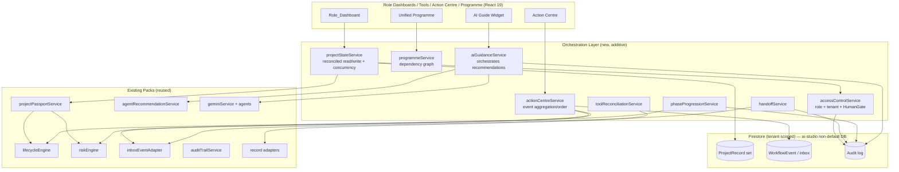
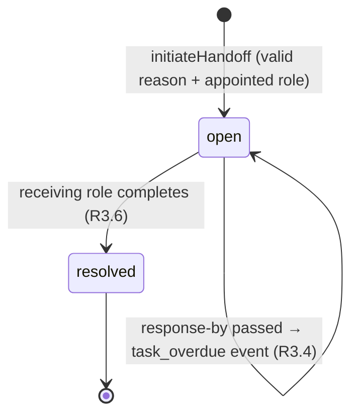
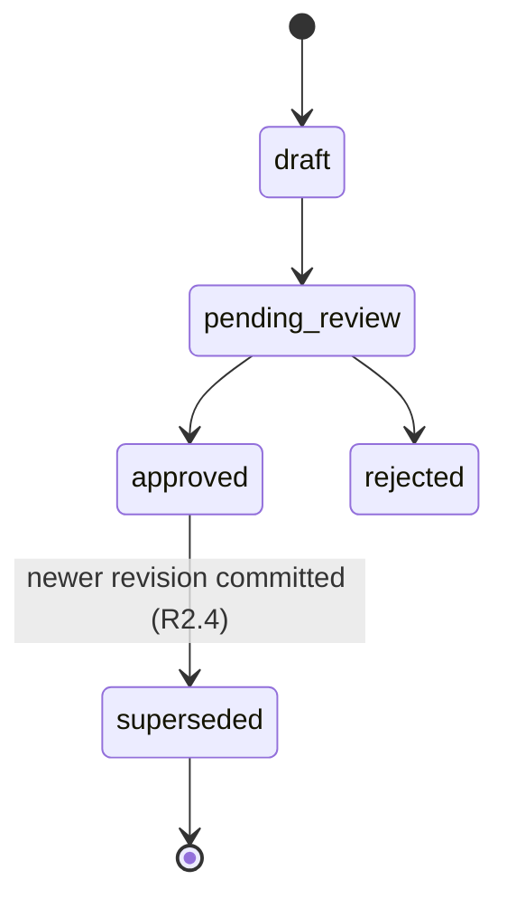

# Design Document

## Overview

The Unified Project Workflow Orchestration layer is an **integration and coordination tier** that sits on top of the existing Architex packs. It does not replace role-specific tool logic; it reconciles and routes project state so that all 17 roles read from and write to **one source of truth per project** — the existing `ProjectPassport` assembled from a set of `ProjectRecord` envelopes (`services/lifecycleTypes.ts`).

The layer is **decision-support and coordination only**. It never performs autonomous statutory certification, never signs on a human's behalf, and never moves money. Every sensitive action remains behind the existing `HumanGate` checkpoints, and every cross-role read, write, recommendation, and denial is tenant-scoped and audited.

The design composes seven existing capabilities into a coherent orchestration service:

| Existing capability | Reused for |
|---|---|
| `lifecycleEngine.evaluateLifecycle()` | Phase evaluation, required-record gating (R7) |
| `projectPassportService.buildProjectPassport()` | Source-of-truth assembly, derived status (R1, R2) |
| `riskEngine.evaluateRisks()` | Risk → Action Centre events (R5) |
| `inboxEventAdapter` | `WorkflowEvent` routing to Action Centre (R3, R4, R5, R7) |
| `agentRecommendationService` | AI recommendations in dashboards/tools (R6) |
| `geminiService` + `services/agents/` | Embedded AI guidance generation (R6) |
| `auditTrailService` | Immutable audit of every action (R1, R3, R6, R7, R8) |
| record adapters (`projectRecordAdapter`, Pack 3/8/9/15 adapters) | Tool/module output → `ProjectRecord` (R9) |

New orchestration code is additive: a `projectStateService` (reconciled reads/writes with optimistic concurrency), a `handoffService`, a `programmeService` (dependency graph), an `actionCentreService` (event aggregation/ordering), a `phaseProgressionService`, an `accessControlService` (role + tenant gate), and a `toolReconciliationService`. These are thin orchestrators that delegate domain logic to the packs above.

### Design principles

1. **Single envelope.** All shared state is a `ProjectRecord`; derived views are recomputed from records, never stored independently per role.
2. **Reuse, don't rebuild.** Orchestration calls existing pack services. New code is limited to reconciliation, routing, concurrency, and governance glue.
3. **Governance is non-negotiable.** Tenant isolation and `HumanGate` enforcement wrap every operation; AI is advisory.
4. **Resilience by default.** AI and propagation failures degrade gracefully — dashboards, Action Centre, and programme still render.

## Architecture



### Request flow (read)

1. Dashboard requests project state via `projectStateService.loadProjectState(ctx, projectId)`.
2. `accessControlService.authorizeRead` checks tenant match + role view rights (R1.7, R8.1, R8.2). On denial: audit + authorization error, no field disclosure.
3. Records are loaded tenant-scoped; superseded records resolve to their current revision (R2.4, R2.5).
4. `projectPassportService.buildProjectPassport()` assembles derived status (R1.1, R2.1).
5. The view returns the passport plus per-derived-value source record id + last-updated timestamp (R2.2).

### Request flow (write)

1. Dashboard/tool submits a record update with the **base version** it read.
2. `accessControlService.authorizeWrite` checks role write rights + any `HumanGate` (R8.3–R8.5).
3. `projectStateService.writeRecord` performs an optimistic-concurrency compare-and-set on `audit.revision` (R1.6, R2.7).
4. On success: record persisted with actor/role/UTC timestamp (R1.2); derived fields recomputed (R2.1); audit written (R8.6).
5. On version mismatch: conflict error, current value unchanged, submitted input retained for resubmit (R1.5, R1.6).

### Failure & resilience strategy

- **Write failure / timeout (10 s):** return save-failed error, leave prior record, retain input (R1.5).
- **Propagation failure (>5 s):** retain last reconciled value, mark stale, raise error identifying source record (R2.3).
- **AI timeout (10 s):** render surface without guidance within 3 s, show "guidance temporarily unavailable" (R6.10, NFR Resilience).

## Components and Interfaces

All new services live in `src/services/orchestration/` and operate on a `BaseContext` (`{ tenantId, projectId, userId, role, now }`) consistent with existing services. Types reuse `services/lifecycleTypes.ts`.

### accessControlService

Central governance gate used by every other service.

```typescript
interface AuthorizationContext {
  tenantId: string;
  userId: string;
  role: ArchitexRole;
  now: string; // ISO 8601 with offset
}

type ActionType = 'read' | 'write' | 'handoff' | 'phase_advance'
  | 'professional_certification' | 'signature' | 'payment_release'
  | 'municipal_submission' | 'closeout_acceptance';

interface AuthorizationResult {
  outcome: 'permitted' | 'denied';
  requiredGate: HumanGate;
  reason?: string;        // names action type, role, required gate (R8.2/8.3/8.5)
  // never includes target field values on denial (R8.2)
}

function authorize(
  ctx: AuthorizationContext,
  action: ActionType,
  target: { tenantId: string; recordType?: ProjectRecordType; gate?: HumanGate },
): AuthorizationResult; // decision within 2 s (R8.1, R8.4)
```

Tenant mismatch → always `denied` (R1.7, R8.2, R8.7). Sensitive gates require a qualified role mapping (`QUALIFIED_ROLES_BY_GATE`); AI identity is never qualified (R6.6, R8.5). Every call result is auditable (R8.6, R8.7).

### projectStateService

Reconciled source-of-truth read/write with optimistic concurrency.

```typescript
interface VersionedRecord<T extends Record<string, unknown> = Record<string, unknown>> {
  record: ProjectRecord<T>;
  version: number; // mirrors audit.revision
}

interface ProjectStateView {
  passport: ProjectPassport;
  records: ProjectRecord[];
  derivedSources: DerivedFieldSource[]; // R2.2
}

interface DerivedFieldSource {
  field: 'approvalStatus' | 'documentStatus' | 'financialStatus' | 'currentPhase' | 'riskLevel';
  sourceRecordId: string;
  lastUpdatedSast: string; // SAST UTC+02:00 to the minute (R2.2)
  stale: boolean;          // R2.3
}

function loadProjectState(ctx: AuthorizationContext, projectId: string): Promise<ProjectStateView>;

function writeRecord<T extends Record<string, unknown>>(
  ctx: AuthorizationContext,
  update: { record: ProjectRecord<T>; baseVersion: number },
): Promise<WriteResult<T>>; // CAS on version (R1.2, R1.5, R1.6, R2.7)

function resolveActive(records: ProjectRecord[], id: string): ProjectRecord; // superseded → current (R2.4, R2.5)
```

`WriteResult` is a discriminated union: `{ ok: true; record; version }` | `{ ok: false; reason: 'conflict' | 'save_failed' | 'unauthorized'; currentValue?; retainedInput }`.

### handoffService

```typescript
interface CrossRoleHandoff {
  id: string;
  projectId: string;
  tenantId: string;
  fromRole: ArchitexRole;
  toRole: ArchitexRole;
  relatedRecordType: ProjectRecordType;
  reason: string;             // 1..1000 chars (R3.1, R3.2)
  status: 'open' | 'resolved';
  createdAt: string;
  responseByDate: string;     // +5 business days (R3.4)
  resolvedBy?: string;
  resolvedRole?: ArchitexRole;
  resolvedAt?: string;
}

function initiateHandoff(ctx, input: HandoffInput): Promise<HandoffResult>; // validates reason + appointed role (R3.1–3.3, R3.7)
function resolveHandoff(ctx, handoffId: string): Promise<HandoffResult>;    // R3.6
function checkOverdue(now: string, handoffs: CrossRoleHandoff[]): WorkflowEvent[]; // R3.4
```

Recording a handoff emits an `approval_required` `WorkflowEvent` to the receiving role via `inboxEventAdapter` (R3.3). Resolution requiring a `HumanGate` of `professional_certification | signature | payment_release` defers to `accessControlService` (R3.8).

### programmeService

Single `UnifiedProgramme` per project with a DAG of tasks.

```typescript
interface ProgrammeTask {
  id: string;
  projectId: string;
  tenantId: string;
  responsibleRole: ArchitexRole;
  title: string;
  startDate: string;  // ISO date
  finishDate: string; // ISO date, >= startDate (R4.5)
  status: 'not_started' | 'in_progress' | 'complete';
  dependsOn: string[]; // <=50 refs, must exist, acyclic (R4.2, R4.6, R4.7)
}

interface UnifiedProgramme {
  projectId: string;
  tenantId: string;
  tasks: ProgrammeTask[]; // <=10,000 (R4.1)
}

function upsertTask(programme, task): ProgrammeResult;        // validates dates, refs, cycles (R4.2, R4.5–4.7)
function recomputeSchedule(programme, changedTaskId): UnifiedProgramme; // dependent date roll-up (R4.4)
function overdueEvents(now, programme): WorkflowEvent[];      // one event per overdue task (R4.8)
function visibleTasks(programme, role): ProgrammeTask[];      // authorised view (R4.3)
```

Cycle detection uses depth-first search over the proposed dependency set before commit; a back-edge rejects the change and retains prior state (R4.6).

### actionCentreService

```typescript
type EventPriority = 'Critical' | 'High' | 'Medium' | 'Low';

interface ActionItem {
  event: WorkflowEvent;
  priority: EventPriority;       // R5.1
  dueDate?: string;
  targetRoute?: string;          // R5.4, R5.7
  hasResolvableRoute: boolean;
}

function buildActionCentre(ctx, projects: ProjectStateView[]): ActionItem[]; // aggregate, order (R5.2, R5.3)
function detectConditions(passport): WorkflowEvent[];   // missing record/approval/blocker/payment/overdue/risk (R5.1, R5.6)
function resolveSettled(items, passports): ActionItem[]; // drop resolved within 60 s (R5.5)
```

Ordering: priority (Critical→Low), then due date (earliest first), then creation timestamp (oldest first) (R5.2, R5.3). Empty result yields an explicit "no outstanding actions" state (R5.8). Events without a route are shown with a "no direct action" marker, never omitted (R5.7).

### phaseProgressionService

```typescript
interface AdvancementResult {
  outcome: 'advanced' | 'blocked' | 'final_phase';
  fromPhase?: ProjectPhase;
  toPhase?: ProjectPhase;
  unmetRequiredRecords?: ProjectRecordType[]; // R7.3
  event?: WorkflowEvent;                       // project_phase_changed (R7.5, R7.6)
}

function evaluateAdvancement(metadata, records): { mayAdvance: boolean; eligibility: LifecycleEvaluation }; // R7.1, R7.2
function advancePhase(ctx, metadata, records): Promise<AdvancementResult>; // R7.3–7.7
```

Advancement eligibility requires every required record present **and** `approvalStatus === 'approved'` (R7.2). Concurrent advancement requests for the same transition produce exactly one `project_phase_changed` event via an idempotency key `${projectId}:${fromPhase}->${toPhase}` (R7.6).

### aiGuidanceService

```typescript
interface GuidanceRequest {
  ctx: AuthorizationContext;
  surface: 'dashboard' | 'tool' | 'workflow_step';
  passport: ProjectPassport;
}

interface GuidanceResult {
  recommendations: AgentRecommendation[]; // <=10, desc priority (R6.1, R6.2)
  stepGuidance?: string;                  // R6.4
  status: 'ok' | 'unavailable' | 'none';  // R6.10, R6.11
}

function generateGuidance(req: GuidanceRequest): Promise<GuidanceResult>; // 10 s timeout (R6.10)
```

Delegates to `agentRecommendationService` and `geminiService`. Recommendations behind a `HumanGate` are flagged `requiresHumanApproval` and presented as advisory (R6.5, R6.6). Generation uses only in-tenant, in-project records; out-of-scope data is excluded (R6.8, R6.9). Every produced recommendation is audited (R6.7).

### toolReconciliationService

```typescript
interface ToolAssignment {
  toolId: string;       // StandaloneToolDef.id
  projectId: string;
  tenantId: string;
  output: Record<string, unknown>;
}

interface ReconciliationResult {
  outcome: 'mapped' | 'unmapped';
  record?: ProjectRecord;       // mapped via adapter (R9.1, R9.2)
  linkedArtifactId?: string;    // unmapped retention (R9.4, R9.6)
  error?: string;               // R9.6
}

function reconcileToolRun(ctx, assignment: ToolAssignment): Promise<ReconciliationResult>;
function linkSharedRecord(records, recordId): ProjectRecord; // dedupe via linkedRecordIds (R9.5)
```

When an adapter exists for the tool's domain, output becomes one `ProjectRecord` with phase/moduleKey/recordType from the tool's registered domain (R9.1, R9.2). No adapter or adapter failure → output retained as an unmapped linked artefact, never discarded (R9.4, R9.6). Records produced by Documents/Finance/Site/Analytics that match required/optional record types feed the passport evaluation (R9.3).

## Data Models

### Reused (no change) — `services/lifecycleTypes.ts`

`ProjectRecord<T>`, `ProjectPassport`, `LifecycleEvaluation`, `WorkflowEvent`, `AgentRecommendation`, `HumanGate`, `RiskFinding`, `ProjectPhase`, `ProjectRecordType`, `ArchitexRole`, `RecordStatus`, `Priority`.

### New orchestration types (`src/services/orchestration/orchestrationTypes.ts`)

```typescript
// Optimistic concurrency
interface WriteResult<T extends Record<string, unknown>> { /* discriminated union, see above */ }

// Governance
type ActionType = /* read | write | handoff | phase_advance | sensitive gates */;
interface AuthorizationResult { outcome: 'permitted' | 'denied'; requiredGate: HumanGate; reason?: string; }
const QUALIFIED_ROLES_BY_GATE: Record<HumanGate, ArchitexRole[]>;

// Handoffs
interface CrossRoleHandoff { /* see above */ }

// Programme
interface ProgrammeTask { /* see above */ }
interface UnifiedProgramme { /* see above */ }

// Action Centre
type EventPriority = 'Critical' | 'High' | 'Medium' | 'Low';
interface ActionItem { /* see above */ }

// Derived field provenance
interface DerivedFieldSource { /* see above */ }
```

### Priority mapping

The existing `Priority` (`low|medium|high|critical`) maps to the Action Centre `EventPriority` (`Critical|High|Medium|Low`) one-to-one. A single shared mapping constant prevents divergence (used by R5 ordering and R6 recommendation priority surfaces).

### Persistence

All records, programmes, handoffs, events, and audit entries persist in the tenant-scoped Firestore non-default DB (`ai-studio-...`). Every collection path is prefixed by `tenantId`; Firestore security rules deny cross-tenant access (defence-in-depth alongside `accessControlService`). Concurrency uses Firestore transactions for the compare-and-set on `audit.revision`.

### State machines





## Correctness Properties

*A property is a characteristic or behavior that should hold true across all valid executions of a system — essentially, a formal statement about what the system should do. Properties serve as the bridge between human-readable specifications and machine-verifiable correctness guarantees.*

These properties are derived from the prework analysis above. Redundant criteria were consolidated (tenant-isolation family, authorization positive/negative families, programme validation family, recommendation shape/cap, Action Centre ordering, tool retention). Each property is universally quantified and intended for property-based testing.

### Property 1: Source of truth is single and derived

*For any* valid set of `ProjectRecord`s for a project, the assembled `ProjectStateView` derived fields (approvalStatus, documentStatus, financialStatus, currentPhase, riskLevel) each equal the value computed by `projectPassportService.buildProjectPassport()` over that record set, and each derived field references exactly one source `ProjectRecord` id — identical when read from any number of dashboard contexts.

**Validates: Requirements 1.1, 1.4, 2.1, 2.6**

### Property 2: Writes capture provenance and are readable afterward

*For any* authorised record write, the persisted record carries the actor identifier, the writing role, and a parseable ISO-8601 UTC timestamp, and a subsequent load of that project returns the written value.

**Validates: Requirements 1.2, 1.3**

### Property 3: Failed writes preserve prior state and retain input

*For any* write that fails or times out, the prior `ProjectRecord` value is unchanged and the submitted input is retained in the result for resubmission.

**Validates: Requirements 1.5**

### Property 4: Optimistic concurrency rejects stale writes

*For any* pair of writes submitted against the same base record version, exactly one succeeds and the other returns a conflict error, the rejected write leaves the current value unchanged, and the final stored value equals the accepted write.

**Validates: Requirements 1.6**

### Property 5: Conflicting commits resolve by latest timestamp with audit retention

*For any* two conflicting commits to the same field that race past version checking, the reconciled value equals the commit with the later timestamp, the rejected commit is retained in the audit trail, and the losing participant receives an error identifying the affected record.

**Validates: Requirements 2.7**

### Property 6: Tenant isolation across reads and AI scope

*For any* request (dashboard read, record fetch, or AI guidance generation) where the requesting user's tenant does not match a record's `tenantId`, the orchestration layer excludes that record entirely — denying direct reads with an authorization error that discloses no field values, and producing AI guidance from in-scope records only (zero out-of-tenant or out-of-project records in the inputs or outputs).

**Validates: Requirements 1.7, 6.8, 6.9, 8.2, 8.7**

### Property 7: Derived-value provenance is displayed

*For any* derived value shown in a dashboard, its `DerivedFieldSource` carries a non-empty source record id and a last-updated timestamp rendered in SAST (UTC+02:00) to the minute.

**Validates: Requirements 2.2**

### Property 8: Propagation failure degrades safely

*For any* simulated derived-field propagation failure, the affected derived value equals the last successfully reconciled value, is marked with a stale indicator, and an error indication identifies the source record that failed to propagate.

**Validates: Requirements 2.3**

### Property 9: Supersession presents only the current revision

*For any* `ProjectRecord` superseded by a newer revision, the prior record's status becomes `superseded` and is retained immutably, and resolving that record returns the current superseding record together with the superseded record's identifier.

**Validates: Requirements 2.4, 2.5**

### Property 10: Valid handoffs record complete obligations and notify the receiver

*For any* valid `Cross_Role_Handoff` (reason 1..1000 chars, receiving role appointed), the recorded obligation captures the originating role, receiving role, related record type, and reason, is shown as outstanding on both roles' views, and emits exactly one `approval_required` `WorkflowEvent` assigned to the receiving role.

**Validates: Requirements 3.1, 3.3, 3.5**

### Property 11: Invalid handoffs are rejected without side effects

*For any* handoff whose reason is missing/empty/over 1000 characters, or whose receiving role is not appointed to the project, the handoff is rejected, no tracked obligation is created, and an error identifies the cause (reason limit or role-not-appointed).

**Validates: Requirements 3.2, 3.7**

### Property 12: Handoff resolution and overdue detection

*For any* open handoff, resolving it sets status to `resolved` and records the resolving actor, role, and timestamp; and for any open handoff whose response-by date has passed, the overdue check produces exactly one `task_overdue` `WorkflowEvent` assigned to the receiving role.

**Validates: Requirements 3.4, 3.6**

### Property 13: Gated handoff steps require the qualified receiving role

*For any* handed-off step requiring a `HumanGate` of professional_certification, signature, or payment_release, only the qualified receiving role is authorised to satisfy the gate; the AI identity and the originating role are denied.

**Validates: Requirements 3.8, 6.6**

### Property 14: Programme tasks are validated on upsert

*For any* programme task upsert, a task with a finish date earlier than its start date, a dependency that would create a cycle, or a dependency referencing a non-existent task is rejected with the corresponding error, the prior persisted state is retained, and the committed programme remains acyclic.

**Validates: Requirements 4.5, 4.6, 4.7**

### Property 15: Valid programme tasks persist their fields

*For any* valid programme task, the upsert stores the responsible role, start date, finish date, a status within {not_started, in_progress, complete}, and up to 50 dependency references, exactly as supplied.

**Validates: Requirements 4.2**

### Property 16: Authorised programme visibility identifies responsible role

*For any* programme and role, `visibleTasks` returns exactly the subset of tasks the role is authorised to view, each identifying its responsible role.

**Validates: Requirements 4.3**

### Property 17: Dependency schedule roll-up

*For any* acyclic programme, after a predecessor task's finish date changes, every dependent task's recomputed start date is no earlier than the maximum finish date of its predecessors.

**Validates: Requirements 4.4**

### Property 18: Overdue programme tasks each raise one event

*For any* programme evaluated at a given time, the number of `task_overdue` events produced equals the number of tasks whose finish date is earlier than the current date and whose status is not complete, each assigned to the task's responsible role.

**Validates: Requirements 4.8**

### Property 19: Detected conditions become prioritised events

*For any* project passport exhibiting a condition (missing required record, open approval, municipal blocker, payment due, overdue task, or detected risk), a corresponding `WorkflowEvent` is created with a priority in {Critical, High, Medium, Low}, and each missing required record yields its own event flagged as blocking phase advancement.

**Validates: Requirements 5.1, 5.6**

### Property 20: Action Centre total ordering

*For any* set of unresolved `WorkflowEvent`s for a user, `buildActionCentre` returns them ordered by priority (Critical first), then by due date (earliest first), then by creation timestamp (oldest first).

**Validates: Requirements 5.2, 5.3**

### Property 21: Action items expose route or explicit no-route marker

*For any* `WorkflowEvent`, the resulting `ActionItem` is present in the list (never omitted): if it has a resolvable target route, it exposes a navigation action; otherwise it is shown with a no-direct-route marker.

**Validates: Requirements 5.4, 5.7**

### Property 22: Resolved conditions remove their events

*For any* `WorkflowEvent` whose underlying condition no longer holds, the event is marked resolved and excluded from the user's outstanding action list.

**Validates: Requirements 5.5**

### Property 23: Recommendations are capped, ordered, and well-formed

*For any* recommendation set produced for a passport, the presented recommendations number at most 10, are ordered by descending priority, and each includes a title, a plain-language rationale, a priority of exactly one of {High, Medium, Low}, a recommended action label, and a related navigation route.

**Validates: Requirements 6.1, 6.2, 6.3**

### Property 24: Gated recommendations are advisory

*For any* `Agent_Recommendation` whose recommended action sits behind a `HumanGate`, the recommendation is flagged as requiring human approval and is presented as advisory only.

**Validates: Requirements 6.5**

### Property 25: Every recommendation is audited

*For any* guidance generation that produces recommendations, an audit entry records each recommendation, its source context, and a timestamp.

**Validates: Requirements 6.7**

### Property 26: AI failure and empty states never block the surface

*For any* simulated AI timeout the `GuidanceResult` status is `unavailable`, and for any passport that yields no applicable recommendations the status is `none`; in both cases the dashboard, tool, or workflow surface still renders.

**Validates: Requirements 6.10, 6.11**

### Property 27: Lifecycle evaluation matches the existing engine

*For any* project metadata and record set, `evaluateAdvancement` eligibility equals the output of `lifecycleEngine.evaluateLifecycle()` for the same inputs.

**Validates: Requirements 7.1**

### Property 28: Advancement gating

*For any* record set, the project is eligible to advance only when every required record type for the current phase exists and each carries an approval status of `approved`; when one or more required records are absent or unapproved, advancement is denied, the phase is retained, no event is created, and the list of unmet required records is returned.

**Validates: Requirements 7.2, 7.3**

### Property 29: Phase advancement emits one event and an audit entry

*For any* eligible advancement, exactly one `project_phase_changed` `WorkflowEvent` is created for the transition (idempotent under concurrent requests) assigned to each role responsible for the new phase, and an audit entry records the originating phase, destination phase, actor, and timestamp.

**Validates: Requirements 7.5, 7.6, 7.7**

### Property 30: Authorization permits the entitled and denies the rest

*For any* authorization request, an in-tenant role entitled to the action (including a role qualified for a sensitive `HumanGate`) is permitted, while a role lacking the right or unqualified for the gate is denied with an error naming the attempted action type, the role, and the required gate, leaving the target record unchanged.

**Validates: Requirements 8.1, 8.3, 8.4, 8.5**

### Property 31: Every orchestration action is fully audited

*For any* create, update, handoff, phase advancement, or denied action, the audit trail records the actor identifier, actor role, action type, target record identifier, an outcome of permitted or denied, and a timestamp in ISO 8601 format with timezone offset.

**Validates: Requirements 8.6**

### Property 32: Tool runs map to records or are retained as unmapped artefacts

*For any* tool run assigned to a project: if a record adapter exists for the tool's domain, exactly one `ProjectRecord` is created with phase, moduleKey, and recordType equal to the tool's registered-domain values; if no adapter exists or mapping fails, the original output is retained as an unmapped linked artefact (never discarded) and an error indication identifies the affected tool run.

**Validates: Requirements 9.1, 9.2, 9.4, 9.6**

### Property 33: Module records feed the passport and resolve without duplication

*For any* record produced by an existing module whose recordType is required or optional for the project's current phase, the record is incorporated into the `ProjectPassport` evaluation; and for any record referenced across modules, the connection resolves through `linkedRecordIds` to a single shared record instance rather than a duplicate.

**Validates: Requirements 9.3, 9.5**

### Property 34: Project record serialization round-trip

*For any* `ProjectRecord` (including one with an empty linked-reference set and one with two or more linked references), deserializing the serialized form reproduces the original record with identical field values, identical status, and an identical set of linked record references.

**Validates: Requirements 10.2**

## Error Handling

The orchestration layer uses explicit, typed results rather than thrown exceptions for expected failures, so callers (dashboards, tools) can degrade gracefully and surface clear messages.

| Condition | Detection | Response | Requirement |
|---|---|---|---|
| Cross-tenant access | `accessControlService.authorize` tenant mismatch | `denied` result, authorization error naming action/role/gate, no field disclosure, audit denial | 1.7, 8.2, 8.7 |
| Unauthorised write / unqualified gate | role/gate check | `denied` result, descriptive error, record unchanged | 8.3, 8.5 |
| Write save failure / >10 s timeout | promise rejection / timeout guard | `{ ok: false, reason: 'save_failed', retainedInput }`, prior value intact | 1.5 |
| Stale base version | CAS on `audit.revision` | `{ ok: false, reason: 'conflict', currentValue, retainedInput }` | 1.6 |
| Conflicting concurrent commits | commit-timestamp comparison | later wins; loser gets error identifying record; rejected retained in audit | 2.7 |
| Derived propagation failure (>5 s) | reconciliation timeout | retain last value, set `stale: true`, error names source record | 2.3 |
| Invalid handoff reason / unappointed role | input + appointment validation | reject, no obligation, descriptive error | 3.2, 3.7 |
| Programme bad dates / cycle / missing ref | upsert validation + DFS cycle check | reject, retain prior state, specific validation error | 4.5, 4.6, 4.7 |
| Phase advance blocked / at final phase | lifecycle eligibility | `blocked` (return unmet list) or `final_phase`; phase retained; no event | 7.3, 7.4 |
| AI unavailable / timeout (10 s) | guidance timeout guard | `status: 'unavailable'`, surface renders within 3 s, no block | 6.10 |
| No recommendations | empty result | `status: 'none'`, dashboard renders with indication | 6.11 |
| Tool adapter/validation failure | adapter try/catch | retain output as unmapped linked artefact, error names tool run | 9.4, 9.6 |

Unexpected/programming errors are logged and surfaced as a generic save-failed result; they never silently drop user input.

## Testing Strategy

This feature centres on pure reconciliation, validation, graph, ordering, and governance logic — a strong fit for property-based testing. AI generation and Firestore I/O are isolated behind interfaces and mocked, so properties test orchestration logic deterministically.

### Dual approach

- **Property-based tests** verify the 34 universal properties above across generated inputs. Use **fast-check** (already idiomatic for the Vitest + TypeScript stack) with generators for `ProjectRecord` sets, programmes/DAGs, handoffs, event sets, authorization contexts, and tenant pools.
- **Unit/example tests** cover specific scenarios and empty states: Action Centre empty state (R5.8), step-level guidance presence (R6.4), final-phase advancement (R7.4), and the 10,000-task / one-programme-per-project bounds (R4.1).
- **Integration tests** cover Firestore tenant-rule enforcement (defence-in-depth) and accessibility (R10.3) via axe + keyboard-navigation checks on new UI surfaces.
- **Process/CI checks** cover R10.1 (required positive+negative unit tests present), R10.4/10.5 (lint, test, build gating).

### Property test configuration

- Library: **fast-check** with **Vitest**.
- Minimum **100 iterations** per property (`fc.assert(fc.property(...), { numRuns: 100 })`).
- Each property test is tagged with a comment referencing its design property, in the format:
  `// Feature: unified-project-workflow-orchestration, Property {number}: {property_text}`
- One property-based test implements each of the 34 correctness properties.

### Key generators

- `arbProjectRecord` — valid envelopes across phases, record types, statuses, and linked-reference sets (including empty and ≥2 refs for Property 34).
- `arbProgramme` — task sets with bounded counts; a constrained generator that builds guaranteed-acyclic graphs plus an adversarial generator that injects cycles and dangling refs for Property 14.
- `arbTenantPool` — records spanning ≥2 tenants for the isolation property (Property 6), including the negative cross-tenant guidance case (R10.6).
- `arbEventSet` — `WorkflowEvent`s with varied priority/due/created fields for ordering (Property 20).
- `arbAuthRequest` — role × action × gate × tenant combinations for authorization (Properties 6, 13, 30).

### Coverage of governance requirements

Properties 6, 13, 24, 25, and 30 collectively enforce the scope guardrails: AI never satisfies a gate (R6.6/3.8), gated recommendations are advisory (R6.5), tenant isolation holds for reads and AI (R6.8/6.9/8.2/8.7/1.7), and every action is audited (R8.6). The negative cross-tenant guidance test required by R10.6 is realised within Property 6's generated multi-tenant pool.
