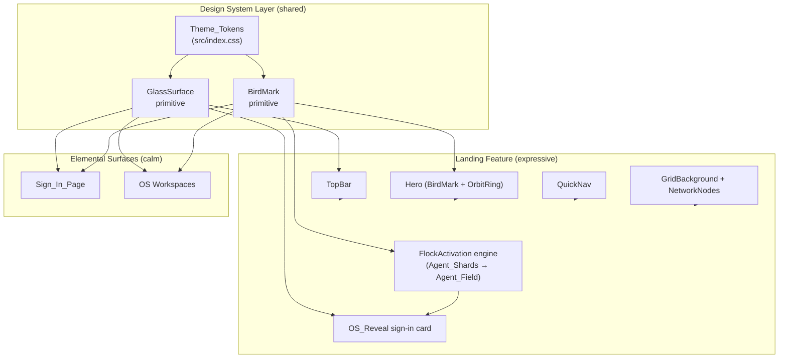
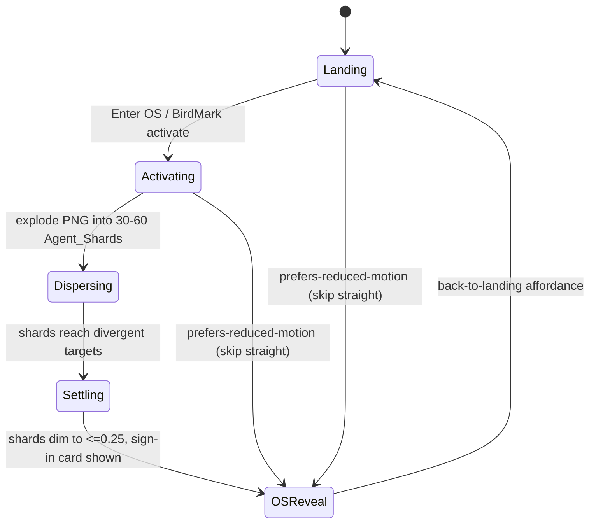
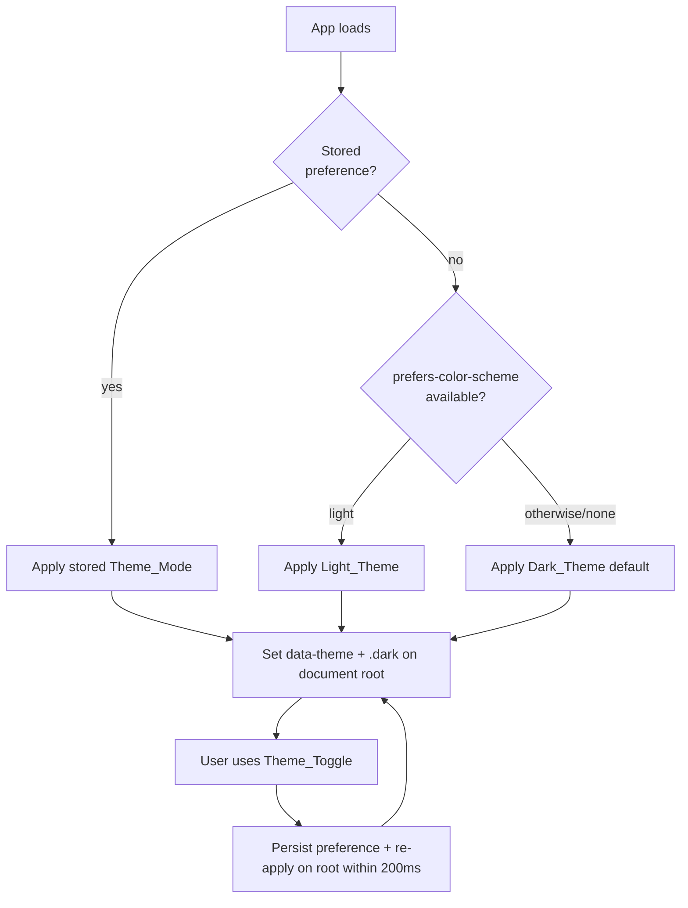

# Design Document

## Overview

This design delivers the Architex "liquid glass" UI redesign as a thin, additive layer over the existing React 19 + TypeScript + Vite 6 application. It establishes a reusable **Design System** (dark-teal Theme_Tokens + a Glass_Surface primitive + a Bird_Mark primitive), composes them into an expressive, animated **Landing_Page**, and reuses the same primitives — minus the animation — for the elemental **Sign_In_Page** and the OS **Workspaces**.

The Design System is **theme-aware**: it ships two Theme_Modes — a default **Dark_Theme** (the dark teal palette, the standard appearance) and an optional **Light_Theme** — that share every primitive and component and differ only by Theme_Token values. A `ThemeProvider` + `useTheme` hook + a `Theme_Toggle` control let users switch and persist their preference (Req 14).

The two HTML mockups in `mockups/` are the source of visual truth:

- `landing-flock-mockup.html` — the dark teal palette, the liquid-glass material, and the signature **Flock_Activation** sequence (PNG bird mark explodes into 30–60 miniature bird logos that disperse, then settle into a dimmed **Agent_Field** that patrols the grid lines beneath a frosted "Welcome to Architex OS" sign-in card).
- `design-system-preview.html` — the canonical token/typography/button reference and an **elemental** OS workspace that reuses the tokens and glass but deliberately omits the flock and moving grid.

### Design Goals

1. **Additive, not destructive.** Add a dark-teal landing theme token (`#0d2520`) and a `.glass` utility to `src/index.css` without renaming or removing any existing token (Req 10.4). The current light-theme `:root` tokens that the role-based app already consumes remain untouched.
2. **Token-driven.** All Landing_Page color comes from Theme_Token references — zero inline hex literals in component markup (Req 1.5). Undefined tokens fail loudly (Req 1.7, 10.5).
3. **One Glass_Surface definition** shared by the Landing_Page, Sign_In_Page, and Workspaces (Req 2.6, 10.2).
4. **Use the real PNG.** The Bird_Mark sources `public/logo.png` directly with no SVG conversion (Req 6.1), with a wordmark fallback on load failure (Req 6.4).
5. **Accessibility and reduced-motion first.** Keyboard operability, visible focus, single `h1`, WCAG AA contrast, and a static end-state under `prefers-reduced-motion` are mandatory (Req 9, 8.3, 12.9, 13.6).
6. **Clean separation of expressiveness.** The flock + moving grid live ONLY on the Landing_Page. The Sign_In_Page and Workspaces stay calm and clutter-free (Req 10.6, 10.7).
7. **Theme-aware by token, not by fork.** Dark_Theme is the default; Light_Theme is an optional alternative. Both reuse the same primitives and component logic, differing only by Theme_Token values, with the user's choice persisted and restored (Req 14).

### Coexistence with In-Progress Code

The application code is being changed in parallel by another developer to make the system functional. This redesign must therefore be **strictly additive and isolated** to avoid merge conflicts and to avoid disrupting the in-progress functional work:

- **New code lives in new files** under `src/design-system/` and `src/features/landing/`. No existing component, service, or route file is rewritten.
- **`src/index.css` edits are additive only** — new tokens, new theme scopes, and the `.glass` utility are appended. No existing Theme_Token name is renamed or removed (Req 10.4), so in-progress consumers keep resolving.
- **`App.tsx` integration is minimal and well-contained** — a single landing mount point plus wrapping the tree in `ThemeProvider`. These are small, localized touch points chosen to be easy to rebase and unlikely to collide with functional edits elsewhere in the shell.
- **No behavioral change to existing screens** beyond the theme attribute now present on the document root (whose default — dark — is applied by the provider). Existing screens that already consume the shared tokens simply resolve them under the active Theme_Mode.

### Relationship to Existing Code

| Existing artifact | Disposition in this design |
|-------------------|----------------------------|
| `src/index.css` (`:root` + `@theme inline`) | **Extended** with theme-scoped tokens, landing-scoped tokens, and the `.glass` utility. Existing token *names* preserved verbatim; their light values become the Light_Theme set (see Theme Mode). |
| `src/index.css` `@custom-variant dark (&:is(.dark *))` | **Reused as-is.** The `ThemeProvider` applies the `.dark` class (and a `data-theme` attribute) on the document root, so this existing variant and any `dark:` utilities continue to work unchanged. |
| `src/index.css` existing `:root` light-ish palette | **Repurposed as the Light_Theme token set.** A new default-applied dark scope overrides the same token names with dark teal values (see Theme Mode), making Dark_Theme the default without renaming anything. |
| `src/components/Logo.tsx` | Pattern reused; new `BirdMark` primitive generalizes it (configurable size, blend mode, activator behavior, wordmark fallback). |
| `src/components/animations/BirdFlocks.tsx` | **Superseded** for the landing flock. The current version explodes an SVG polygon bird; the redesign requires exploding the actual `public/logo.png` into mini-PNG agents (Req 6.1, 12.2). New `flock/` module replaces it for the landing route. |
| `src/App.tsx` route selection (`isPublicLoginRoute`, etc.) | **Integration point.** A new landing feature mounts as the unauthenticated home view; `Enter OS` drives Flock_Activation → OS_Reveal; `Sign up` routes to the existing signup placeholder. The app tree is wrapped in `ThemeProvider` (minimal, well-contained touch point) so the default Dark_Theme applies app-wide. |
| `public/logo.png` | Used directly as the Bird_Mark and Agent_Shard source. |

## Architecture

### Layered Structure



The Design System layer has no dependency on the Landing feature. The Landing feature, the Sign_In_Page, and the Workspaces all depend only on the Design System layer. This makes the Glass_Surface and Bird_Mark reusable by the role-based app (Req 10.2, 10.3).

### State Machine — Landing → OS_Reveal

The Landing_Page is a finite state machine. `Enter OS` (or activating the Bird_Mark) drives the transition; a "back to landing" affordance restores the initial state (Req 12.10).



Under `prefers-reduced-motion`, the machine bypasses `Dispersing`/`Settling` and renders the `OSReveal` end state directly (Req 8.3, 12.9, 13.6).

### Rendering Layers (z-order)

Mirrors the mockup stacking so Agent_Field agents read as "behind frosted glass":

| z | Layer | Component | Notes |
|---|-------|-----------|-------|
| 0 | Ambient blobs | `AmbientBlobs` | Drifting color the glass refracts (Liquid Glass). Static under reduced motion. |
| 1 | Grid | `GridBackground` | Checkered grid; dims after activation (Req 13.1, 13.3). |
| 1 | Scrim | `Scrim` | Darkens background during/after activation. |
| 2 | Nodes | `NetworkNodes` | Twinkling dots at grid junctions; dim after activation (Req 13.2, 13.4). |
| 3 | Flock | `AgentField` | Agent_Shards in flight then patrolling grid lines (Req 12.2, 12.5). |
| 4 | Hero/QuickNav | `Hero`, `QuickNav` | Dissolve during activation (Req 12.3). |
| 6 | TopBar | `TopBar` | Wordmark + actions. |
| 7 | OS_Reveal | `OSRevealCard` | Frosted sign-in card above the Agent_Field (Req 12.6, 12.7). |

### Routing Integration

The landing experience mounts as the unauthenticated home view in `src/App.tsx`. Activation transitions are **in-page** (state-driven), not URL navigations, so the signature animation is uninterrupted:

- **Home (`/`)** → `LandingPage` (new). Renders TopBar + Hero + QuickNav + background layers.
- **`Enter OS` / Bird_Mark** → begins Flock_Activation in-page → OS_Reveal sign-in card (Req 3.5, 4.6, 4.8, 12.1).
- **`Sign up`** → routes to the existing signup destination (`isPublicSignupRoute`), a separate page; does NOT begin Flock_Activation (Req 3.4). Placeholder to be wired to `test.architex.co.za` login later.
- **`/login`** (existing route) → `Sign_In_Page` (elemental, no flock) (Req 10.6).
- **Quick_Nav items** → navigate to their destination routes (Req 5.3).

App-level `prefersReducedMotion` (already read via framer-motion's `useReducedMotion()` in `App.tsx`) is threaded into the landing feature.

### Theme Mode

The Design System ships two Theme_Modes that share every primitive and differ only by Theme_Token values (Req 14.1, 14.7).

#### Token strategy and reconciliation

`src/index.css` already contains a light-ish `:root` palette and the variant `@custom-variant dark (&:is(.dark *))`. Rather than fight these, the design reconciles them with a single, clearly-specified approach:

- **The existing `:root` block IS the Light_Theme.** Its token *values* are kept (and tuned where needed for Req 14.6 contrast); its token *names* are preserved exactly (Req 10.4).
- **A new default-applied dark scope holds the Dark_Theme.** A `[data-theme="dark"]` selector (and the equivalent `.dark` class, so the pre-existing `@custom-variant dark` and any `dark:` utilities keep working) redefines the *same* semantic token names with the dark teal values.
- **Dark_Theme is the default.** The `ThemeProvider` sets `data-theme="dark"` and the `.dark` class on the document root on first paint when no stored preference exists (Req 14.2). This makes the dark teal palette the standard appearance while leaving the light values intact as the alternative.
- **Existing consumers keep resolving.** Because only values are overridden under the active scope and no name changes, every previously-referenced token (`--background`, `--foreground`, `--primary`, …) resolves under whichever Theme_Mode is active.

```css
/* :root = Light_Theme values (existing names preserved) */
:root {
  --background: #f5faf7;  /* …existing light palette… */
  /* glass + landing tokens, light-appropriate */
  --glass-bg: rgba(13,37,32,0.06);
  --glass-border: rgba(0,91,78,0.22);
  --landing-bg: #f5faf7;
  --landing-text: #0d1e25;
}

/* Dark_Theme = the DEFAULT appearance, applied on the root by ThemeProvider */
[data-theme="dark"], .dark {
  --background: #0d2520;           /* Req 1.1 dark teal */
  --foreground: #ffffff;
  /* …dark overrides for the same token NAMES… */
  --glass-bg: rgba(255,255,255,0.07);
  --glass-border: rgba(174,239,227,0.24);
  --landing-bg: #0d2520;
  --landing-text: #ffffff;
}
```

Semantic **Theme_Tokens** (`--background`, `--foreground`, `--glass-bg`, `--glass-border`, `--glass-glow`, `--landing-*`, …) are the only things that flip; component markup references tokens exclusively (Req 1.5), so a theme change is purely a value swap with no markup or logic fork (Req 14.7). The `.glass` utility references `--glass-*` tokens, so glass surfaces re-skin automatically when the mode flips (Req 14.8).

#### Applying, persisting, and restoring the theme



- **ThemeProvider (React context)** reads the stored preference from `localStorage` (key `architex-theme`), defaults to `Dark_Theme` when none exists (Req 14.2), and applies the mode by setting `data-theme`/`.dark` on `document.documentElement`.
- **No stored preference** → the provider MAY honor `prefers-color-scheme: light`; absent both a stored preference and a light system hint, it falls back to Dark_Theme (Req 14.2).
- **On toggle**, `setTheme` updates the root attribute/class (re-skinning all surfaces within 200 ms, Req 14.4) and persists the new value to `localStorage` (Req 14.4).
- **On reload**, the persisted value is read back and re-applied, restoring the most recent choice (Req 14.5). A small inline bootstrap script in `index.html` sets the attribute before first paint to avoid a flash of the wrong theme.

Because both themes resolve the *same* primitives, the Glass_Surface obscured-glazing behavior, Bird_Mark, and every shared component are identical across modes — only their token-derived colors change (Req 14.7, 14.8).

## Components and Interfaces

### Design System Layer

#### Theme_Tokens (`src/index.css`)

New tokens are **added** additively and exposed through `@theme inline`. Existing token names are never renamed or removed (Req 1.4, 10.1, 10.4). Theme-flipping semantic tokens (`--glass-*`, `--landing-*`, and the existing color tokens) are declared in two scopes — the `:root` Light_Theme set and the default-applied `[data-theme="dark"]`/`.dark` Dark_Theme set (see Architecture → Theme Mode). The dark teal values below are the **Dark_Theme defaults**; the matching Light_Theme values live in `:root`.

```css
/* Dark_Theme scope ([data-theme="dark"], .dark) — the DEFAULT appearance */
--landing-bg: #0d2520;            /* Req 1.1 dark teal background */
--landing-bg-deep: #081a16;       /* gradient floor */
--landing-text: #ffffff;          /* Req 1.3/1.6 white body text */
--landing-text-muted: rgba(255,255,255,0.62);
--landing-accent: #aeefe3;        /* Req 1.3/1.6 mint accent (== --secondary) */
--glass-bg: rgba(255,255,255,0.07);
--glass-border: rgba(174,239,227,0.24);
--glass-glow: rgba(0,118,102,0.38);
--glass-blur: 20px;
--grid-step: 54px;                /* grid cell size; node junctions every 2 steps */
```

`@theme inline` adds the matching `--color-landing-*` mappings so Tailwind utility classes (`bg-landing-bg`, `text-landing-accent`, etc.) resolve from the tokens. `--primary`, `--primary-light`, `--primary-dark`, `--secondary` are reused as-is (Req 1.2). `--landing-accent` references the same hex as `--secondary` (`#aeefe3`) to keep one canonical mint while giving the landing a semantic name. The grid-step token does not vary by theme and is declared once.

#### `.glass` CSS Utility + `GlassSurface` Component

A single Glass_Surface definition composed of exactly four named layers (Req 2.1): backdrop blur, layered translucency, light border, outer glow.

```css
.glass {
  background: var(--glass-bg);                                   /* layer 2: translucency */
  backdrop-filter: blur(var(--glass-blur)) saturate(150%);       /* layer 1: backdrop blur */
  -webkit-backdrop-filter: blur(var(--glass-blur)) saturate(150%);
  border: 1px solid var(--glass-border);                         /* layer 3: light border */
  box-shadow: 0 18px 50px rgba(0,0,0,0.32),
              0 0 28px var(--glass-glow),                         /* layer 4: outer glow */
              inset 0 1px 0 rgba(255,255,255,0.16);
}
/* Opaque fallback when backdrop-filter is unsupported (Req 2.5) */
@supports not ((backdrop-filter: blur(1px)) or (-webkit-backdrop-filter: blur(1px))) {
  .glass { background: var(--landing-bg-deep); }  /* opaque, preserves >=4.5:1 text contrast */
}
```

Because content behind the glass is only blurred (not occluded), animated Agent_Field agents remain visible-but-blurred (obscured glazing) (Req 2.7, 12.6). The fallback swaps to an opaque deep-teal background that keeps foreground text legible with no content loss (Req 2.5). Because `.glass` references `--glass-*` tokens (not literal colors), it re-skins automatically when the Theme_Mode flips: in Light_Theme the `--glass-bg`/`--glass-border` tokens resolve to light-appropriate values that preserve the obscured-glazing behavior and keep foreground text at ≥4.5:1 contrast (Req 14.6, 14.8).

```ts
interface GlassSurfaceProps extends React.HTMLAttributes<HTMLDivElement> {
  as?: React.ElementType;          // 'div' | 'button' | 'section' ...
  variant?: 'card' | 'pill';       // pill = fully rounded (Top_Bar CTA, Req 2.3/3.3)
  children?: React.ReactNode;
}
// Renders the chosen element with the `.glass` class + variant radius.
// Styling derives entirely from tokens (Req 10.2). Reused by app screens (Req 2.6, 10.3).
```

#### `BirdMark` Component

Generalizes the existing `Logo` pattern; sources `public/logo.png` directly (Req 6.1).

```ts
interface BirdMarkProps {
  size: 'topbar' | 'hero' | 'shard' | number;  // px; hero is the dominant footprint (Req 4.1)
  interactive?: boolean;            // when true: focusable button-role activator (Req 4.8/4.9/9.9)
  onActivate?: () => void;          // pointer click + Enter/Space (Req 4.8)
  blend?: boolean;                  // mix-blend-mode: screen over dark teal
  decorative?: boolean;            // true for Agent_Shards: aria-hidden, no alt
}
```

Behavior:
- `alt="Architex"` text alternative on the meaningful instances (Req 6.3); decorative shards are `aria-hidden`.
- On load error or >3s timeout, replaces the image with the Wordmark text "ARCHITEX" in the same placement, retaining the "Architex" accessible name (Req 6.4, 6.5).
- `interactive` instances render as a keyboard-focusable control (`role="button"`, `tabIndex=0`) with pointer cursor, an accessible name indicating it enters the Architex OS (Req 9.9), Enter/Space handling (Req 4.8), and a subtle hover scale (Req 8.6).
- Uses `srcset`/high-DPI PNG so it stays crisp from TopBar size up to hero size (Req 6.2).

#### `ThemeProvider` + `useTheme` (`src/design-system/theme/`)

A React context owns the active Theme_Mode, applies it to the document root, and persists it (Req 14.2, 14.4, 14.5).

```ts
type ThemeMode = 'dark' | 'light';

interface ThemeContextValue {
  theme: ThemeMode;             // current active mode
  setTheme: (mode: ThemeMode) => void;
  toggleTheme: () => void;       // dark <-> light
}

const THEME_STORAGE_KEY = 'architex-theme';

// Resolution order on load (Req 14.2):
//   1. stored preference in localStorage, else
//   2. prefers-color-scheme: light (only when no stored preference), else
//   3. Dark_Theme default.
function resolveInitialTheme(): ThemeMode;

// useTheme(): consumes ThemeContext; throws if used outside ThemeProvider.
function useTheme(): ThemeContextValue;
```

Behavior:
- On mount, `ThemeProvider` resolves the initial mode and sets both `data-theme` and the `.dark` class on `document.documentElement` (the latter keeps the existing `@custom-variant dark` working). Default is Dark_Theme (Req 14.2).
- `setTheme`/`toggleTheme` update the root attribute/class so all surfaces re-skin within 200 ms (Req 14.4) and write the new value to `localStorage[THEME_STORAGE_KEY]` (Req 14.4).
- On reload, the persisted value is restored (Req 14.5). An inline pre-paint bootstrap in `index.html` applies the stored/default attribute before React hydration to prevent a theme flash.
- A corrupt or unreadable stored value falls back to Dark_Theme (see Error Handling).

#### `ThemeToggle` Component

```ts
interface ThemeToggleProps {
  className?: string;
}
// Renders a keyboard-focusable control (button) that calls toggleTheme().
```

Behavior:
- Keyboard-focusable and operable via Enter or Space (button semantics) (Req 14.9).
- Exposes a non-empty accessible name indicating it switches the color theme (e.g., "Switch color theme"), with `aria-pressed`/state reflecting the active mode (Req 14.9).
- Renders a sun/moon lucide-react icon reflecting the current Theme_Mode.
- Placed in the `Top_Bar` of the Landing_Page and in the Workspace chrome so it is reachable on both public and authenticated surfaces; it derives all color from Theme_Tokens (no literal colors).

### Landing Feature

#### `TopBar`
- Leading edge: `BirdMark size="topbar"` + Wordmark "ARCHITEX" (Req 3.1).
- Trailing edge: `Theme_Toggle` + `Sign_Up_Action` (text/glass button) + `Primary_CTA` as a `GlassSurface variant="pill"` (Req 3.2, 3.3, 14.3).
- `Sign up` → signup route, no flock (Req 3.4). `Enter OS` → `onActivate` (Req 3.5). `Theme_Toggle` → `toggleTheme()` (Req 14.3).
- ≤767px: all actions stay visible, no horizontal scroll, ≥44×44px targets (Req 3.7, 3.8).

#### `Hero`
- `BirdMark size="hero"` centered horizontally within 2px tolerance, largest footprint (Req 4.1), wrapped by `OrbitRing` (1–3px stroke circular ring, Req 4.2).
- `<h1>` headline "The Operating System for the Built Environment" in `--font-heading` (Space Grotesk) — the page's single `h1` (Req 4.3, 9.6).
- Subline "Simplify complexity. Deliver with confidence." in `--font-sans` (Inter) (Req 4.4).
- Exactly one `Primary_CTA` labeled "Enter OS" (Req 4.5) → `onActivate` (Req 4.6).
- Headline ≤60 chars, subline ≤160 chars, enforced by a `clampCopy` helper that truncates over-limit copy (Req 11.1, 11.4).

#### `QuickNav`
- Exactly four items: People, Projects, Approvals, Payments (Req 5.1), each a lucide-react icon + label (Req 5.2).
- Pointer/Enter/Space activation navigates to the item's route (Req 5.3); failure retains view + shows error (Req 5.4).
- ≤767px: all four visible, no overlap, no truncation (Req 5.5).

#### `GridBackground` + `NetworkNodes`
- `GridBackground`: checkered grid via layered linear-gradients at `--grid-step` (Req 13.1); dims after activation (Req 13.3).
- `NetworkNodes`: twinkling dots at grid junctions (every 2 grid steps) across the viewport (Req 13.2); twinkle is a 2–8s opacity-pulse loop (Req 8.2); dims after activation (Req 13.4); static under reduced motion (Req 13.6).

#### `OSRevealCard`
- `GlassSurface variant="card"` containing the Bird_Mark, "Welcome to Architex OS", an email field, a password field, and a sign-in control (Req 12.7).
- Agent_Field remains visible-but-blurred behind it (Req 12.6).

### Flock_Activation Engine

A dedicated module (`flock/`) drives the animation. It computes agent geometry as **pure functions** (testable), and applies motion with framer-motion + the Web Animations API (WAAPI) for the indefinite patrol loop.

```ts
// Pure geometry (unit-testable, no DOM)
interface GridSpec { stepPx: number; width: number; height: number; }
interface Node { x: number; y: number; }              // node = grid junction
type Direction = 'up' | 'down' | 'left' | 'right';

interface AgentPlan {
  id: number;
  sizePx: number;                  // 20-60px varying mini-bird (Req 12.2)
  burstTarget: { x: number; y: number };  // divergent dispersal target
  loop: Node[];                    // closed rectangular loop on node grid (Req 12.5)
  clockwise: boolean;              // mixed directions across agents (Req 12.5)
  speedPxPerSec: number;           // uniform across agents (Req 12.5)
}

// Builds node lattice from the grid spec (junctions every 2 steps).
function buildNodeLattice(grid: GridSpec): Node[];
// Produces N agent plans (30<=N<=60) with on-screen rectangular loops.
function planFlock(grid: GridSpec, count: number, seed: number): AgentPlan[];
// Given a loop and progress t in [0,1], returns the point traveling node-to-node.
function pointOnLoop(loop: Node[], t: number): { x: number; y: number; dir: Direction };
```

Phases (Req 12.2–12.8, target 1500–3500ms total):
1. **Explode** — `count` Agent_Shards (mini `BirdMark size="shard"`) animate from the hero Bird_Mark center to `burstTarget` along divergent trajectories; hero copy/QuickNav/grid begin dissolving (Req 12.2, 12.3).
2. **Settle** — shards ease onto their loop's first node; opacity drops to ≤0.25 (Req 12.4); background dims (grid + nodes), scrim darkens.
3. **Patrol** — each agent runs an infinite WAAPI loop over `loop` at uniform speed, turning between vertical/horizontal at nodes; mixed clockwise/counter-clockwise so directions are mixed at any instant (Req 12.5). OS_Reveal card shown (Req 12.7).

Reduced motion: skip phases 1–2, render OS_Reveal directly, no patrol loop (Req 12.9).

## Data Models

### Landing State (React)

```ts
type ActivationPhase = 'landing' | 'activating' | 'dispersing' | 'settling' | 'osReveal';

interface LandingState {
  phase: ActivationPhase;
  prefersReducedMotion: boolean;
  birdMarkLoaded: boolean;        // false → wordmark fallback (Req 6.4)
  actionError: string | null;     // set on action timeout/failure (Req 3.6, 4.7, 5.4)
}
```

- `phase` transitions follow the state machine. `activate()` sets `activating`; geometry-driven callbacks advance to `dispersing`→`settling`→`osReveal`. Under reduced motion, `activate()` jumps straight to `osReveal`.
- A 5000ms watchdog on activation sets `actionError` and stays on the current page if the sequence fails to start (Req 3.6, 4.7).
- `restoreLanding()` resets `phase` to `landing`, restoring Bird_Mark, hero copy, and Quick_Nav (Req 12.10).

### Theme State (React context)

```ts
type ThemeMode = 'dark' | 'light';

interface ThemeState {
  theme: ThemeMode;          // active mode; defaults to 'dark' (Req 14.2)
}
```

- Persisted to `localStorage` under `architex-theme`; restored on reload (Req 14.4, 14.5).
- Applied to `document.documentElement` as both `data-theme="dark|light"` and the `.dark` class.
- A corrupt/missing stored value resolves to `'dark'` (see Error Handling).

### Static Config

```ts
const QUICK_NAV_ITEMS = [
  { id: 'people',    label: 'People',    icon: Users,     route: '/people' },
  { id: 'projects',  label: 'Projects',  icon: Boxes,     route: '/projects' },
  { id: 'approvals', label: 'Approvals', icon: Building2,  route: '/approvals' },
  { id: 'payments',  label: 'Payments',  icon: CreditCard, route: '/payments' },
] as const;  // exactly four (Req 5.1)

const HERO_COPY = {
  headline: 'The Operating System for the Built Environment', // <=60 chars (Req 11.1)
  subline: 'Simplify complexity. Deliver with confidence.',   // <=160 chars (Req 11.1)
} as const;

const FLOCK = { minAgents: 30, maxAgents: 60, minSize: 20, maxSize: 60, speedPxPerSec: 30 } as const;
```

### File / Module Layout

```
src/
├── index.css                         # + theme scopes + landing tokens + .glass (additive)
├── design-system/
│   ├── GlassSurface.tsx              # Glass_Surface primitive (Req 2.6, 10.2)
│   ├── BirdMark.tsx                  # Bird_Mark primitive (Req 6, 10.2)
│   ├── tokens.ts                     # token name constants + resolve guard (Req 10.5)
│   └── theme/
│       ├── ThemeProvider.tsx         # context: resolve/apply/persist Theme_Mode (Req 14.2, 14.4, 14.5)
│       ├── useTheme.ts               # hook consuming ThemeContext
│       └── ThemeToggle.tsx           # accessible Theme_Toggle control (Req 14.3, 14.9)
└── features/landing/
    ├── LandingPage.tsx               # composition + state machine
    ├── TopBar.tsx
    ├── Hero.tsx                      # BirdMark + OrbitRing + copy + CTA
    ├── QuickNav.tsx
    ├── OSRevealCard.tsx
    ├── background/
    │   ├── GridBackground.tsx
    │   ├── NetworkNodes.tsx
    │   ├── AmbientBlobs.tsx
    │   └── Scrim.tsx
    ├── flock/
    │   ├── geometry.ts               # pure functions: buildNodeLattice, planFlock, pointOnLoop
    │   ├── AgentField.tsx            # renders + animates Agent_Shards/agents
    │   └── useFlockActivation.ts     # phase state machine + watchdog
    ├── copy.ts                       # HERO_COPY + clampCopy helper (Req 11.4)
    └── __tests__/                    # unit + property tests
```

The elemental `Sign_In_Page` (`/login`) and Workspaces import only from `src/design-system/` — never from `features/landing/` — guaranteeing they reuse tokens/glass/bird without inheriting the flock or moving grid (Req 10.6, 10.7).

## Correctness Properties

*A property is a characteristic or behavior that should hold true across all valid executions of a system — essentially, a formal statement about what the system should do. Properties serve as the bridge between human-readable specifications and machine-verifiable correctness guarantees.*

This feature is primarily UI and animation, so many acceptance criteria are verified by example, snapshot, or visual tests (see Testing Strategy). The properties below capture the parts with genuine universal behavior: the **pure flock geometry**, the **copy clamp**, the **token integrity / contrast** invariants (across both Theme_Modes), the **theme persistence round-trip**, the **reduced-motion static end state**, the **responsive no-overflow** invariant, and the **keyboard accessibility** invariants. Each is implemented with a single property-based test running ≥100 iterations.

### Property 1: Token integrity

*For all* Theme_Tokens referenced by Landing_Page component markup, each reference resolves to exactly one canonical definition in `src/index.css`, every pre-existing token name still resolves after the redesign, and no inline hex color literal appears in Landing_Page markup.

**Validates: Requirements 1.5, 10.1, 10.4**

### Property 2: Text contrast on every background, in every Theme_Mode

*For all* Theme_Modes (Dark_Theme and Light_Theme) and *for all* text elements rendered on the Landing_Page (including text composited over a Glass_Surface), the contrast ratio between the foreground text token and its effective background — both resolved under the active Theme_Mode — is at least 4.5:1 for body text and at least 3:1 for large text and focus indicators.

**Validates: Requirements 1.3, 2.4, 9.5, 14.6, 14.8**

### Property 3: Bird_Mark activation equals Primary_CTA

*For any* activation input on the interactive Bird_Mark (pointer click, Enter key, or Space key), the resulting state transition is identical to activating the Primary_CTA.

**Validates: Requirements 4.8**

### Property 4: Quick_Nav routing

*For all* Quick_Nav items and *for any* activation input (pointer click, Enter, or Space) on a focused item, the System navigates to exactly that item's configured destination route.

**Validates: Requirements 5.3**

### Property 5: Responsive layout has no horizontal overflow

*For all* Viewport widths between 320px and 3840px inclusive, the Landing_Page primary content produces no horizontal scrolling (rendered content width ≤ viewport width), and the Bird_Mark, headline, subline, and Primary_CTA remain present and uncut.

**Validates: Requirements 7.4, 7.5**

### Property 6: Reduced motion yields a static final state

*For all* animated Landing_Page elements, when the Reduced_Motion_Setting prefers reduced motion, the element renders in its final resting visual state with no running entrance, looping, parallax, dispersal, or patrol animation, and activation transitions directly to the OS_Reveal end state.

**Validates: Requirements 8.3, 12.9, 13.6**

### Property 7: Keyboard reachability without a trap

*For all* interactive controls in the Top_Bar (including the Theme_Toggle), Hero_Section, and Quick_Nav, each control is reachable using Tab / Shift+Tab, and focus can always move away from it in both directions without becoming trapped.

**Validates: Requirements 9.1, 9.8, 14.9**

### Property 8: Keyboard activation

*For all* interactive button controls on the Landing_Page (including the Theme_Toggle), pressing Enter (and Space for button controls) while the control has focus invokes that control's activation behavior.

**Validates: Requirements 9.2, 14.9**

### Property 9: Accessible name present

*For all* interactive controls (Sign_Up_Action, Primary_CTA, each Quick_Nav item, the Bird_Mark activator, and the Theme_Toggle), the control exposes a non-empty accessible name conveying its purpose.

**Validates: Requirements 9.4, 14.9**

### Property 10: Visible focus indicator

*For all* interactive controls, when a control receives keyboard focus the System displays a focus indicator that fully encloses the control, persists while focus is held, and maintains at least a 3:1 contrast ratio against the adjacent background.

**Validates: Requirements 9.3**

### Property 11: Focus order follows reading order

*For all* keyboard focus traversals of the Landing_Page, focus visits controls grouped in the order Top_Bar, then Hero_Section, then Quick_Nav.

**Validates: Requirements 9.7**

### Property 12: Copy clamp

*For any* input string and a character limit, `clampCopy` returns a string whose length is at most the limit, and returns the input unchanged when it is already within the limit.

**Validates: Requirements 11.1, 11.4**

### Property 13: Flock plan bounds and settle opacity

*For any* grid spec and seed, `planFlock` produces between 30 and 60 Agent_Shards, each with a size within the configured bounds and a divergent outward burst target, and after settling every agent's opacity is at most 0.25 and its stacking order is below the OS_Reveal card.

**Validates: Requirements 12.2, 12.4**

### Property 14: Agent paths stay on the grid

*For any* agent loop produced by `planFlock` and *for any* progress value t in [0,1], the point returned by `pointOnLoop` lies on a Grid_Background line between two Network_Nodes (sharing an x or y coordinate with the node lattice), every node used by the loop sits at a grid junction, direction changes occur only at Network_Nodes, agent speed is uniform across the field, and at any instant both vertical and horizontal travel directions are present across the agents.

**Validates: Requirements 12.5, 13.2, 13.5**

### Property 15: Activation round-trip restores the landing

*For any* initial Landing_Page state, beginning Flock_Activation and then invoking the return-to-landing affordance restores the Bird_Mark, Hero_Section copy, and Quick_Nav to their exact pre-activation state.

**Validates: Requirements 12.10**

### Property 16: Theme persistence round-trip and complete token resolution

*For any* Theme_Mode selection, applying it persists the preference and re-applies it to the document root, and a subsequent fresh initialization (simulating reload) restores exactly that Theme_Mode; furthermore, when no stored preference exists initialization yields the Dark_Theme default, and under whichever mode is active every semantic Theme_Token resolves to that mode's value set.

**Validates: Requirements 14.2, 14.4, 14.5**

## Error Handling

| Scenario | Requirement | Handling |
|----------|-------------|----------|
| Bird_Mark asset (`public/logo.png`) load error or >3s timeout | 6.4, 6.5 | `BirdMark` swaps to the Wordmark "ARCHITEX" text in the same placement, keeping the "Architex" accessible name. A 3s timer races the `onLoad` event; whichever resolves first wins. |
| Activation fails to start within 5000ms | 3.6, 4.7 | A watchdog timer set on activation clears on the first phase transition. If it fires, set `actionError`, keep `phase = 'landing'`, and surface a non-blocking error indication; the user stays on the current page. |
| Quick_Nav destination unavailable / fails to load | 5.4 | Navigation is wrapped so a rejected/failed route retains the current view and shows an error indication; no blank screen. |
| Sign_Up_Action navigation fails to start within 5000ms | 3.6 | Same watchdog/error pattern as activation; user stays on the current page. |
| Browser lacks `backdrop-filter` support | 2.5 | `@supports not (...)` swaps `.glass` to an opaque deep-teal background that preserves ≥4.5:1 text contrast with no content loss. |
| Landing markup references an undeclared Theme_Token | 1.7 | Build/type fails identifying the undefined token; the system never substitutes an inline hex literal. Token names are centralized in `design-system/tokens.ts` so misspellings surface at compile time. |
| Design System primitive references an undefined token at runtime | 10.5 | The primitive renders a documented fallback style and emits a development-time `console.warn` naming the unresolved token. |
| Over-length headline/subline copy | 11.4 | `clampCopy` truncates to the character limit; headline and subline remain the only primary marketing copy. |
| Stored Theme_Mode preference is missing | 14.2 | `resolveInitialTheme` applies Dark_Theme (after optionally honoring `prefers-color-scheme: light`); the provider sets the default attribute/class on the root. |
| Stored Theme_Mode preference is corrupt / not a recognized mode | 14.2, 14.5 | The unrecognized value is ignored and treated as "no preference"; the System falls back to Dark_Theme and overwrites the bad value on the next explicit selection. |
| `localStorage` is unavailable or throws (private mode, quota, disabled) | 14.4, 14.5 | Read/write are wrapped in try/catch; on failure the System still applies the resolved mode for the session (defaulting to Dark_Theme) and silently skips persistence rather than crashing. |

## Testing Strategy

### Dual Approach

- **Property-based tests** verify the 16 universal properties above (pure geometry, copy clamp, token/contrast invariants across both Theme_Modes, theme persistence round-trip, reduced-motion end state, responsive overflow, keyboard a11y). Library: **fast-check** with Vitest (the project's existing test runner). Each property test runs a minimum of **100 iterations**.
- **Example / unit tests** verify specific renders, labels, counts, timings, and error branches (the EXAMPLE and EDGE_CASE criteria from prework): glass layer composition (2.1), four Quick_Nav items (5.1), single `h1` (9.6), CTA timing bounds (3.5, 4.6, 8.1, 12.8), asset-fallback branch (6.4), undefined-token warning (10.5), `@supports` fallback (2.5), the elemental separation of Sign_In_Page / Workspaces (10.6, 10.7), both Theme_Mode scopes resolving the full semantic token set (14.1), the Theme_Toggle flipping the active mode and applying it within 200 ms (14.3, 14.4), a single shared component rendering under both modes via the same code path so only token-derived styles differ (14.7), and light-mode `.glass` tokens resolving to light values while `backdrop-filter` remains present (14.8).
- **Snapshot / visual tests** cover layout and material fidelity that unit assertions cannot (responsive stacking 7.2/7.3, glass appearance, PNG crispness 6.2). These align the implementation with the two mockups.

### Property Test Configuration

- Each property test is tagged with a comment referencing its design property in the format:
  `// Feature: website-ui-redesign, Property {number}: {property_text}`
- Minimum 100 iterations per property (fast-check default ≥100; set explicitly via `{ numRuns: 100 }`).
- Pure-logic properties (P12, P13, P14, and the token/contrast computations) run headless with no DOM. DOM-dependent properties (P5, P6, P7, P8, P9, P10, P11, P3, P4) use `@testing-library/react` + jsdom with generated inputs (viewport widths, activation-input kinds, control sets). The theme round-trip property (P16) runs under jsdom with a mocked `localStorage` and `matchMedia`, generating mode selections and stored/system-preference states.

### Test Placement

- Geometry + copy property tests: `src/features/landing/__tests__/geometry.property.test.ts`, `copy.property.test.ts`.
- Token/contrast property tests: `src/design-system/__tests__/tokens.property.test.ts`.
- Theme persistence + toggle tests: `src/design-system/__tests__/theme.property.test.ts` (P16) and `theme.test.tsx` (toggle/timing examples).
- Component behavior + a11y tests: `src/features/landing/__tests__/*.test.tsx`.
- Run with the existing `npm test` (Vitest); type-check with `npm run lint`.

### Notes on PBT Applicability

PBT is **not** applied to the CSS material appearance, the framer-motion easing curves, or the exact pixel layout — those are verified by snapshot/visual and example tests. PBT **is** applied to the flock geometry (a pure function with a large input space where node-grid edge cases matter), the copy clamp (classic string-length invariant), the contrast/token computations (deterministic functions over color/token sets), and the cross-cutting reduced-motion / accessibility / responsive invariants that must hold for *all* controls and *all* viewport widths.
