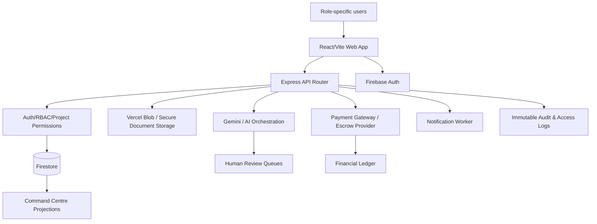

# Architex Full-Scope Implementation Plan

Date: 2026-05-20  
Branch: `phase-2-verification-workflows`  
Prepared from: shared Google links where accessible, `Full_scope.md`, existing phase plans/reports, repository inventory, and current package/tooling.

## 1. Source Analysis Notes

### 1.1 Shared link access result

The user supplied two shared Google resources:

1. Google AI Studio prompt share: `https://aistudio.google.com/app/prompts?...`
2. Google Drive file share: `https://drive.google.com/file/d/1O_mtCO50XFZBults63TAKbwKk3i3ul1I/view?usp=sharing`

Both resources required Google sign-in in this execution environment. The Drive direct download URL also returned a sign-in page. Because the content was not publicly readable here, this plan treats the links as **access-blocked external source material** and relies on repository-owned scope documents and implementation artifacts instead. If those links contain newer requirements, they should be re-shared as public/readable, exported to Markdown/PDF in the repo, or pasted into a follow-up task, then this plan should be reconciled.

### 1.2 Repository source material analysed

Key accessible planning and implementation references:

- `Full_scope.md`: full platform scope, role model, modules, workflows, AI governance, payment/escrow, command centre, monetisation, UX principles.
- `FULL_SCOPE_PHASED_IMPLEMENTATION_PLAN.md`: backend-first production implementation plan.
- `Phases/new-implementation-plan/*`: phase PRDs, task lists, and workflows.
- `docs/backend/*`: API contracts, Firestore schemas, RBAC, audit taxonomy, workflow contracts.
- `docs/phase-reports/*`: delivery and gap reports for phases 1 through 6.
- `AGENTS.md`: current stack and repo conventions.
- `package.json`: React 19, TypeScript, Vite 6, Firebase, Express, Gemini, Vitest, Playwright.

### 1.3 Current repo snapshot

- App stack: React 19 + TypeScript + Vite + Tailwind v4 + Firebase Auth/Firestore + Express API + Gemini/AI services.
- Key implementation directories: `src/components`, `src/services`, `src/lib`, `api`, `docs`, `Phases`.
- Validation scripts: `npm run lint`, `npm test`, `npm run test:e2e`, `npm run build`, `npm run docs:api-contracts`, `npm run predeploy:check`.
- Current working tree has an unrelated modified file: `src/components/FinancialDashboard.tsx`. This plan does not overwrite it.

## 2. Product Target

Architex is a role-aware, AI-assisted operating system for built-environment projects. It must support the lifecycle from client brief through professional appointment, design coordination, municipal/compliance workflows, contractor delivery, procurement, payment/escrow, disputes, close-out, CPD, and platform governance.

The target experience is:

> One powerful platform underneath, with simple, guided, role-specific experiences on top.

Core roles:

- Client
- Built Environment Professional (BEP), with architect as a BEP subtype/legacy alias
- Contractor
- Freelancer
- Subcontractor
- Supplier
- Admin

Core surfaces:

- Role-specific dashboards
- Project Command Centre
- Next Best Action panel
- Guided client brief
- Marketplace and directory search
- Design/compliance workflows
- Contractor delivery workflows
- Payment/escrow and finance centre
- AI co-pilot and governed AI review queues
- Admin governance console

## 3. Non-Negotiable Delivery Principles

1. No production placeholders, fake integrations, or demo-only data paths.
2. All production state must persist to Firestore or a documented durable backend.
3. Server-side authorization must be authoritative. Client role checks are only UX hints.
4. Every sensitive action must produce immutable audit evidence.
5. AI can draft, classify, extract, score, summarize, and recommend, but may not independently certify, sign, release funds, make legal determinations, approve compliance, or override human responsibility.
6. Payments and escrow must use a provider-backed/legal-backed state machine. If provider/legal details are unavailable, implement safe abstractions and block irreversible production actions.
7. Firestore rules, API guards, and tests must be updated in lockstep with every schema/workflow change.
8. UI must preserve the existing visual direction unless the task explicitly authorizes redesign.
9. Each phase ends with an implementation report containing shipped collections, API routes, rules, tests, limitations, and human blockers.

## 4. Target Architecture



### 4.1 Backend domains

- Identity, roles, firms, project memberships
- Verification and directory profiles
- Briefs, marketplace, appointments, contracts
- Project Command Centre projection
- Design deliverables and drawing register
- Compliance, SANS forms, municipal tracker
- Work packages, freelancer delegation, consultant coordination
- Contractor delivery, programme, site instructions, RFIs, plant, wages
- Procurement, suppliers, materials, deliveries
- Payments, escrow, invoices, claims, disputes
- Messaging, notifications, linked queries
- AI governance, action logs, review queues, knowledge base
- CPD and professional development
- Admin governance and platform operations

### 4.2 Frontend domains

- Authenticated app shell and route guards
- Role-aware navigation and dashboards
- Project Command Centre with role-specific projections
- Client simple mode and professional/contractor advanced modes
- Form/workflow components for staged approvals
- Admin governance consoles
- Accessible mobile-first action cards
- Testable data hooks separated from presentational components

## 5. Canonical Data Model Plan

### 5.1 Identity and authorization

Collections:

- `users`
- `role_profiles`
- `user_verifications`
- `firms`
- `firm_memberships`
- `project_memberships`
- `permission_policies`
- `admin_assignments`
- `access_logs`
- `audit_logs`

Implementation requirements:

- Normalize roles to `client`, `bep`, `contractor`, `freelancer`, `subcontractor`, `supplier`, `admin`.
- Preserve `architect` as a BEP subtype or legacy compatibility alias.
- Add project-scoped permissions for owner, lead BEP, consultant, contractor, package assignee, supplier, freelancer, and admin.
- Move admin assignment away from hardcoded client logic into server-authoritative user records/custom claims.
- Add verification state machines for all professional/commercial roles.

### 5.2 Project lifecycle

Collections:

- `projects`
- `project_stage_history`
- `project_command_centres`
- `next_best_actions`
- `approval_actions`
- `project_activity`
- `project_documents`
- `document_versions`

Stages:

1. Draft brief
2. Brief interpretation
3. Marketplace/directory matching
4. Proposal and appointment
5. Technical brief
6. Design coordination
7. Compliance and municipal submission
8. Tender/procurement
9. Construction delivery
10. Close-out and handover
11. Archived/disputed/cancelled where applicable

### 5.3 Marketplace and appointments

Collections:

- `project_briefs`
- `brief_interpretations`
- `marketplace_opportunities`
- `directory_profiles`
- `match_recommendations`
- `invitations`
- `proposals`
- `proposal_comparisons`
- `appointments`
- `contracts`
- `signature_requests`

Rules:

- AI matching is advisory.
- Directory search must be verification-aware.
- Appointments require explicit client acceptance and professional acceptance.
- Contract/signature actions require audit logs and human acknowledgement.

### 5.4 Design, compliance, and municipal workflows

Collections:

- `technical_briefs`
- `design_deliverables`
- `drawing_registers`
- `drawing_reviews`
- `ai_review_actions`
- `compliance_checklists`
- `sans_forms`
- `municipal_submissions`
- `municipal_status_events`
- `municipal_evidence`
- `consultant_inputs`

Rules:

- AI drawing checks are pre-checks only.
- BEP or authorized human reviewer remains accountable.
- Municipal integration must be provider/municipality-specific. If no API exists, persist manual status/evidence workflows.

### 5.5 Contractor, supplier, and site workflows

Collections:

- `construction_programmes`
- `programme_tasks`
- `site_instructions`
- `rfis`
- `site_diaries`
- `staff_records`
- `wage_runs`
- `plant_registers`
- `plant_bookings`
- `material_requisitions`
- `purchase_orders`
- `delivery_notes`
- `subcontract_packages`
- `supplier_orders`
- `snag_lists`
- `closeout_records`

Rules:

- Package-level access must be isolated from full-project access.
- Contractor sees delivery controls but not BEP-only compliance/admin controls unless explicitly granted.
- Supplier/subcontractor sees only assigned package/order scope.

### 5.6 Payments, escrow, invoices, and disputes

Collections:

- `payment_accounts`
- `payment_intents`
- `escrow_accounts`
- `escrow_milestones`
- `invoices`
- `claims`
- `ledger_entries`
- `refund_requests`
- `disputes`
- `payment_webhook_events`
- `fee_settings`

Rules:

- Use idempotency keys on all payment writes.
- Verify gateway callbacks cryptographically and by origin where possible.
- Escrow state transitions require explicit human approvals and audit trails.
- No production release of funds until legal/provider model is confirmed.

### 5.7 AI governance

Collections:

- `ai_agents`
- `ai_knowledge_sources`
- `ai_action_logs`
- `ai_review_queue`
- `ai_human_signoffs`
- `ai_policy_rules`
- `ai_evaluation_runs`

Rules:

- Log model, prompt version, input references, output, confidence, reviewer, and final decision.
- Separate draft outputs from accepted human-approved records.
- Provide admin kill switches for risky agents/tools.
- Add tests for prohibited autonomous actions.

## 6. API Implementation Plan

### Phase 1 APIs: foundation

- `POST /api/auth/bootstrap`
- `GET /api/auth/me`
- `POST /api/admin/users/:userId/roles`
- `POST /api/admin/users/:userId/verify`
- `POST /api/firms`
- `POST /api/firms/:firmId/invite`
- `POST /api/projects`
- `GET /api/projects/:projectId/access`
- `GET /api/admin/audit-logs`

### Phase 2 APIs: marketplace and appointment

- `POST /api/project-briefs`
- `POST /api/project-briefs/:briefId/interpret`
- `POST /api/marketplace/opportunities`
- `GET /api/directory/search`
- `POST /api/match-recommendations`
- `POST /api/proposals`
- `POST /api/proposals/:proposalId/accept`
- `POST /api/appointments`
- `GET /api/projects/:projectId/command-centre`

### Phase 3 APIs: design/compliance/municipal

- `POST /api/projects/:projectId/technical-briefs`
- `POST /api/projects/:projectId/deliverables`
- `POST /api/drawings/:drawingId/review`
- `POST /api/compliance/checklists`
- `POST /api/sans/forms`
- `POST /api/municipal/submissions`
- `POST /api/municipal/submissions/:id/status-events`
- `POST /api/work-packages`
- `POST /api/work-packages/:id/assign`

### Phase 4 APIs: delivery/procurement

- `POST /api/construction/programmes`
- `POST /api/construction/programmes/:id/tasks`
- `POST /api/site-instructions`
- `POST /api/rfis`
- `POST /api/site-diaries`
- `POST /api/staff-records`
- `POST /api/wage-runs`
- `POST /api/plant/bookings`
- `POST /api/procurement/requisitions`
- `POST /api/procurement/purchase-orders`
- `POST /api/deliveries`
- `POST /api/snag-lists`
- `POST /api/closeout-records`

### Phase 5 APIs: finance

- `POST /api/payment-intents`
- `POST /api/payment-webhooks/payfast`
- `POST /api/invoices`
- `POST /api/claims`
- `POST /api/escrow/milestones`
- `POST /api/escrow/milestones/:id/approve-release`
- `POST /api/escrow/milestones/:id/release`
- `POST /api/refunds`
- `POST /api/disputes`
- `GET /api/ledger`

### Phase 6 APIs: governance and operations

- `GET /api/admin/health`
- `GET /api/admin/usage`
- `GET /api/admin/risk-queue`
- `POST /api/admin/ai/policies`
- `POST /api/admin/ai/actions/:id/signoff`
- `POST /api/admin/settings`
- `POST /api/notifications/preferences`
- `POST /api/cpd/events`
- `POST /api/cpd/certificates`

## 7. Frontend Implementation Plan

### 7.1 App shell and role navigation

- Centralize route metadata with required role/permission/project scope.
- Hide inaccessible items from navigation but enforce access server-side.
- Add compatibility handling for `architect` users as BEP subtype.
- Provide global project switcher and project context provider.

### 7.2 Project Command Centre

Build a reusable command centre engine:

- `CommandCentreLayout`
- `ProjectSummaryCard`
- `NextBestActionPanel`
- `ApprovalsPanel`
- `RiskAndBlockerPanel`
- `DocumentsAttentionPanel`
- `PaymentEscrowPanel`
- `ProgrammeSnapshotPanel`
- `ActivityTimeline`

Role projections:

- Client: plain-language project route, approvals, money due, municipal status, questions.
- BEP: technical brief, deliverables, drawings, consultant inputs, compliance, municipal, freelancers, invoices.
- Contractor: programme, RFIs, site instructions, plant, staff, wages, procurement, claims, close-out.
- Freelancer: assigned tasks, deadlines, uploads, comments, invoices, payment status.
- Subcontractor/supplier: package/order scope, deliveries, claims, close-out evidence.
- Admin: all projects, queues, disputes, verification, AI review, tool health, analytics, fees.

### 7.3 Workflow pages

- Guided client brief wizard with autosave and upload support.
- Directory and marketplace search/results/proposal comparison.
- Technical brief and deliverables workspace.
- Drawing register and AI review result viewer.
- Municipal tracker with manual evidence and status history.
- Contractor programme and site controls.
- Procurement and supplier order tracking.
- Finance centre with invoices, claims, escrow milestone views.
- Dispute centre.
- Admin governance console.

### 7.4 UX/accessibility requirements

- Progressive disclosure by role and project stage.
- Simple language mode for clients.
- Advanced mode for BEPs/contractors.
- Mobile-friendly cards for approvals and site actions.
- Keyboard-accessible forms and dialogs.
- Clear destructive/sensitive action confirmations.
- Plain audit visibility for approvals, releases, and AI signoffs.

## 8. Phased Delivery Roadmap

## Phase 0: Planning Reconciliation and Baseline Stabilisation

Goal: Ensure requirements, current implementation, and validation baseline are aligned.

Tasks:

1. Import or unlock the two shared Google resources and diff them against this plan.
2. Run baseline `npm run lint`, `npm test`, `npm run build`, and relevant Playwright smoke tests.
3. Capture existing failures in a phase report.
4. Freeze canonical role taxonomy and migration strategy.
5. Confirm payment/escrow provider/legal model assumptions.
6. Confirm municipal launch scope and manual/integration strategy.

Acceptance criteria:

- External source blockers resolved or documented.
- Current validation baseline is known.
- No implementation starts from ambiguous role/payment/legal assumptions without documented constraints.

## Phase 1: Security, Identity, RBAC, Audit, and Schema Foundation

Goal: Build a safe production foundation for all later workflows.

Tasks:

1. Implement canonical roles, BEP subtype handling, and server-side role resolution.
2. Add project/firm/package permission service.
3. Implement verification state service.
4. Implement immutable audit service and access log service.
5. Add idempotency service for sensitive writes.
6. Update Firestore schema docs, indexes, and rules.
7. Replace any client/email-only admin privilege assumptions.
8. Add tests for role escalation, project isolation, admin actions, and audit writes.

Deliverables:

- Auth/RBAC services
- Firestore rules update
- Admin role management APIs
- Audit taxonomy implementation
- Foundation API contract docs

Acceptance criteria:

- Protected APIs require verified auth.
- Unauthorized role escalation fails in tests.
- Sensitive actions emit audit logs.
- Firestore rules match API authorization expectations.

## Phase 2: Profiles, Verification, Directory, Marketplace, Brief, and Appointment

Goal: Complete the first commercial path from client brief to appointed verified professional.

Tasks:

1. Expand role profiles for all platform roles.
2. Implement guided client brief persistence and attachment metadata.
3. Add AI brief interpretation with limitations and human-visible evidence.
4. Implement verified directory search and filter facets.
5. Implement advisory AI matching.
6. Implement proposals, proposal comparison, invitations, and appointment workflow.
7. Initialize project command-centre state after appointment.
8. Add verification admin queues.

Deliverables:

- Guided brief wizard
- Directory/marketplace pages
- Proposal and appointment APIs
- Verification workflows
- Initial command centre projection

Acceptance criteria:

- Client can create a brief, search verified professionals, receive recommendations, compare proposals, and appoint a professional.
- Non-verified roles cannot appear as verified in marketplace flows.
- Appointment creates durable project membership and audit records.

## Phase 3: Project Command Centre, Next Best Action, Messaging, and Notifications

Goal: Make each project navigable through role-specific, stage-aware operational views.

Tasks:

1. Build command-centre projection service.
2. Implement next-best-action generator from project state.
3. Add stage history and approval action queues.
4. Link messages and queries to project items.
5. Implement notification preferences and event-driven notifications.
6. Add role-specific command centre UI.
7. Add admin visibility into stalled/overdue projects.

Deliverables:

- Command centre components
- Projection APIs
- Notification worker integration
- Message-linked actions

Acceptance criteria:

- Every supported role sees only permitted project data.
- Open approvals, overdue items, risks, documents, payment status, and activity are visible where relevant.
- Next-best-action items are actionable, auditable, and stage-aware.

## Phase 4: Design, Drawing, Compliance, Municipal, and BEP Coordination Workflows

Goal: Support BEP-led project design and regulatory workflows.

Tasks:

1. Implement technical brief workflow.
2. Implement deliverables and drawing register.
3. Harden AI drawing review as a governed pre-check.
4. Implement SANS/compliance checklist and form workflows.
5. Implement municipal submission tracker with manual evidence first and provider adapters later.
6. Implement consultant input management.
7. Implement BEP-to-freelancer work package delegation.
8. Add client approval gates where client signoff is required.

Deliverables:

- Technical brief pages/APIs
- Drawing register and review UI
- Compliance/municipal tracker
- Work package delegation
- AI review queue integration

Acceptance criteria:

- AI outputs cannot become official approvals without human signoff.
- Municipal status has evidence, source, timestamp, and responsible user.
- Client sees simplified municipal/compliance status, not BEP internal controls.

## Phase 5: Contractor Delivery, Site Operations, Procurement, and Close-Out

Goal: Support construction execution and package-level collaboration.

Tasks:

1. Implement construction programme and task dependencies.
2. Implement RFIs, site instructions, and site diary records.
3. Implement staff, wages, plant, and equipment modules.
4. Implement material requisitions, purchase orders, deliveries, and supplier package views.
5. Implement subcontractor package scopes, progress, claims, and evidence.
6. Implement snagging and close-out records.
7. Connect delivery progress into command-centre projections.

Deliverables:

- Contractor dashboard modules
- Programme/procurement/site APIs
- Subcontractor/supplier scoped UI
- Close-out evidence workflow

Acceptance criteria:

- Package assignees cannot access unrelated project data.
- Contractor command centre shows programme, RFIs, site instructions, procurement, claims, and close-out status.
- Client receives simplified progress and close-out views.

## Phase 6: Payments, Escrow, Invoicing, Claims, Fees, and Disputes

Goal: Implement governed financial workflows with strict auditability.

Tasks:

1. Confirm payment gateway and escrow/legal model.
2. Implement payment account onboarding abstraction.
3. Implement payment intents and webhook verification.
4. Implement invoices, claims, fee settings, and ledger entries.
5. Implement escrow milestone funding, approval, hold, release, refund, and dispute state machine.
6. Add admin finance controls and dispute centre.
7. Add reconciliation reports.

Deliverables:

- Payment gateway adapter
- Escrow milestone service
- Financial ledger
- Admin finance console
- Dispute workflows

Acceptance criteria:

- All payment webhooks are idempotent and verified.
- Escrow release requires authorized human approvals.
- Ledger balances reconcile against provider events.
- Legal/provider blockers are enforced as production feature flags where unresolved.

## Phase 7: AI Co-Pilot, Governance, Knowledge, and Evaluation

Goal: Expand AI safely across workflows while maintaining human accountability.

Tasks:

1. Version all AI prompts/agents.
2. Implement knowledge source ingestion, approval, and retirement workflows.
3. Add AI action logs and confidence/source evidence displays.
4. Add admin AI policy controls and kill switches.
5. Add human signoff queues for sensitive outputs.
6. Add AI regression/evaluation test sets.
7. Add user-facing disclaimers and limitation notes by workflow.

Deliverables:

- AI governance console
- Human signoff workflows
- Knowledge management APIs/UI
- Evaluation reports

Acceptance criteria:

- Sensitive AI outputs are blocked from autonomous execution.
- Prompt/model changes are auditable.
- Admin can disable an AI workflow without redeploying.

## Phase 8: CPD, Resource Booking, Ecosystem, and Monetisation

Goal: Add professional ecosystem features and revenue streams beyond transactions.

Tasks:

1. Implement CPD event/certificate management subject to accreditation confirmation.
2. Implement resource booking and availability workflows.
3. Implement premium AI output billing where legally/commercially valid.
4. Implement subscription tiers and feature entitlements.
5. Implement supplier/procurement value tracking.
6. Implement platform analytics for monetisation.

Deliverables:

- CPD module
- Resource booking module
- Subscription/entitlement service
- Monetisation analytics

Acceptance criteria:

- Paid feature access is entitlement-controlled server-side.
- CPD certificates are only issued under confirmed accreditation rules.
- Monetisation events are auditable and reportable.

## Phase 9: Admin Operations, Security Hardening, Release, and Scale

Goal: Prepare for controlled production release.

Tasks:

1. Complete POPIA/security review.
2. Add retention and data subject request processes.
3. Add rate limits, abuse monitoring, and operational alerts.
4. Add backup/restore and incident runbooks.
5. Run performance tests for dashboard queries and API endpoints.
6. Complete accessibility and responsive QA.
7. Complete release checklist and rollback plan.
8. Deploy to staging, run smoke tests, then production.

Deliverables:

- Security report
- Operational runbooks
- Release checklist
- Production deployment package

Acceptance criteria:

- Lint, unit, integration, E2E, build, API docs validation, and predeploy checks pass or have approved exceptions.
- Security rules are reviewed and tested.
- Production release has rollback and monitoring.

## 9. Testing and Validation Strategy

### 9.1 Automated tests

- Unit tests for pure services: RBAC, state machines, idempotency, matching, fees, AI policy checks.
- Integration tests for API routes and Firestore writes.
- Firestore rules tests for role/project/package isolation.
- Component tests for dashboards and workflow forms.
- Playwright E2E for critical paths:
  - client brief to appointment
  - BEP technical brief and drawing review
  - municipal tracker update
  - contractor programme and RFI
  - invoice/payment/escrow milestone
  - admin verification and AI signoff

### 9.2 Manual/UAT scenarios

- Layperson client simple mode.
- BEP advanced workflow.
- Contractor site workflow on mobile viewport.
- Supplier/subcontractor restricted package access.
- Admin dispute/payment/AI governance.
- Permission boundary attempts.

### 9.3 Required validation commands

Run at phase gates:

```bash
npm run lint
npm test
npm run build
npm run docs:api-contracts
npm run predeploy:check
```

Run when E2E surfaces are touched:

```bash
npm run test:e2e
```

## 10. Security, Compliance, and Governance Checklist

- [ ] Server-side auth context required for protected APIs.
- [ ] Project, firm, package, and admin permissions enforced in API and Firestore rules.
- [ ] Immutable audit events for sensitive actions.
- [ ] Access logs for sensitive record reads/exports.
- [ ] POPIA retention and data subject request processes documented.
- [ ] Payment webhook verification and idempotency.
- [ ] Escrow release human approval gates.
- [ ] AI human signoff for legal/compliance/financial outputs.
- [ ] Admin overrides require reason, scope, and audit trail.
- [ ] File/document access is scoped and versioned.
- [ ] Rate limiting and abuse controls for public and AI endpoints.

## 11. Human Decisions / External Blockers

1. Make the two shared Google links accessible or provide exported content.
2. Confirm payment gateway and escrow/legal operating model.
3. Confirm fee rates, subscription tiers, refunds, chargebacks, and settlement rules.
4. Confirm verification providers for SACAP and other professional bodies.
5. Confirm accepted manual verification evidence and override policy.
6. Confirm CPD accreditation strategy and certificate rules.
7. Confirm launch municipalities and whether portal automation is permitted.
8. Confirm POPIA retention periods and responsible party/operator split.
9. Confirm whether `architect` remains a visible role or is fully migrated to BEP subtype.
10. Confirm production hosting topology and environment ownership.

## 12. Suggested File/Code Organization

```text
src/
  domains/
    auth/
    rbac/
    projects/
    marketplace/
    command-centre/
    compliance/
    construction/
    procurement/
    finance/
    ai-governance/
    notifications/
  components/
    command-centre/
    workflows/
    admin/
    finance/
    construction/
  services/
    firebase/
    audit/
    payments/
    ai/
  lib/
    api-router.ts
    validators/
    state-machines/
```

Refactoring recommendation: move large dashboard/service logic into domain-specific hooks, services, and components as each phase is implemented. Avoid one-file dashboard growth.

## 13. Phase Reporting Template

Each phase must produce a report in `docs/phase-reports/` with:

- Date, branch, commit hash.
- Scope delivered.
- Collections created/changed.
- API routes added/changed.
- Firestore rules and indexes changed.
- Components/pages added/changed.
- Audit events emitted.
- Feature flags introduced.
- Tests added.
- Validation command output.
- Known limitations.
- Human-input blockers.
- Next recommended phase.

## 14. Immediate Next Steps

1. Resolve access to the supplied AI Studio and Drive materials.
2. Reconcile any new requirements into this plan.
3. Run baseline validation and capture current failures.
4. Complete Phase 1 foundation hardening before expanding irreversible finance/compliance flows.
5. Keep `src/components/FinancialDashboard.tsx` changes isolated unless deliberately included in Phase 6 finance work.

