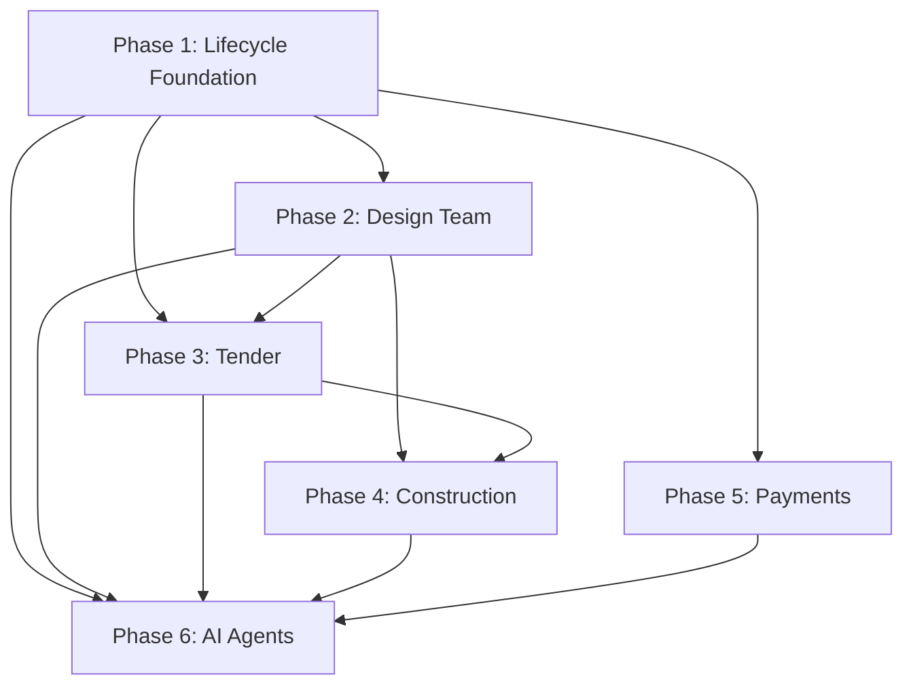

# Architex Lifecycle Management — Master Implementation Plan

> **Objective:** Transform Architex from a job-matching MVP into a full 9-stage project lifecycle operating system for South African architectural practice.

---

## Executive Summary

This plan implements the complete project lifecycle as defined in the **Handover Brief** and **Design Brief** across **6 sequential phases** and **42 tasks**. Each phase is self-contained with its own branch, tasks, and verification criteria.

---

## Phase Overview

| Phase | Name | Tasks | Key Deliverables | Branch |
|---|---|---|---|---|
| **1** | Foundation & Lifecycle State Machine | 7 | `ProjectStage` enum, `Project` type, stage transition engine, Stage Progress Tracker UI | `phase-1/lifecycle-foundation` |
| **2** | Full Design Team & Coordination | 6 | Discipline taxonomy, team invitation service, responsibility matrix, coordination tab | `phase-2/design-team-coordination` |
| **3** | Contractor Procurement & Tender | 8 | Tender packages, bid management, AI bid comparison, award workflow | `phase-3/tender-procurement` |
| **4** | Construction Delivery Management | 7 | Gantt charts, site logs, RFI system, inspections, construction dashboard | `phase-4/construction-delivery` |
| **5** | Payments, Escrow & Financial Console | 7 | Stage-linked milestones, financial ledger, admin financial dashboard, auto-invoicing | `phase-5/payments-escrow` |
| **6** | AI Workflow Agents & Final Polish | 7 | Briefing/Matching/Tender/Construction agents, close-out automation, E2E tests | `phase-6/ai-agents-polish` |

---

## Dependency Graph

> Phase 1 is the critical path. All other phases depend on it.

---

## 9-Stage Lifecycle Mapping

| Stage | Phase | Components Built |
|---|---|---|
| 1. Intake | Phase 1, 6 | Project creation, Briefing Agent |
| 2. Scoping | Phase 2, 6 | Discipline coverage, Briefing Agent |
| 3. Appointment | Phase 2, 6 | Team invitation, Matching Agent |
| 4. Coordination | Phase 2 | Responsibility Matrix, Team Builder |
| 5. Compliance | Phase 1 | *(Existing AI compliance agents)* |
| 6. Tender | Phase 3, 6 | Tender packages, Bid evaluation, Tender Agent |
| 7. Delivery | Phase 4, 6 | Gantt, Site Logs, RFIs, Construction Agent |
| 8. Payments | Phase 5 | Stage-linked escrow, Financial ledger |
| 9. Close-out | Phase 6 | Completion certificates, Archival |

---

## Architecture Principles

1. **Production-Only Code** — no mocks, no simulations, all data from Firestore.
2. **Backward Compatibility** — existing `Job.status` queries continue to work via sync mapping.
3. **Existing Design Language** — all UI uses `shadcn/ui`, `lucide-react`, existing Tailwind v4 theme.
4. **No New Heavy Dependencies** — Gantt chart is CSS-based, no external charting libraries.
5. **Incremental Delivery** — each phase/task committed independently, each phase is a PR.

---

## New Firestore Collections

| Collection | Phase | Parent |
|---|---|---|
| `projects` | 1 | Root |
| `tender_packages` | 3 | Root |
| `tender_packages/{id}/bids` | 3 | Subcollection |
| `projects/{id}/gantt_tasks` | 4 | Subcollection |
| `projects/{id}/site_logs` | 4 | Subcollection |
| `projects/{id}/rfis` | 4 | Subcollection |
| `projects/{id}/inspections` | 4 | Subcollection |
| `ledger` | 5 | Root |

---

## New Services

| Service | Phase | File |
|---|---|---|
| `projectLifecycleService` | 1 | `src/services/projectLifecycleService.ts` |
| `teamService` | 2 | `src/services/teamService.ts` |
| `tenderService` | 3 | `src/services/tenderService.ts` |
| `bidComparisonService` | 3 | `src/services/bidComparisonService.ts` |
| `constructionService` | 4 | `src/services/constructionService.ts` |
| `financialLedgerService` | 5 | `src/services/financialLedgerService.ts` |
| `closeoutService` | 6 | `src/services/closeoutService.ts` |
| `briefingAgent` | 6 | `src/services/agents/briefingAgent.ts` |
| `matchingAgent` | 6 | `src/services/agents/matchingAgent.ts` |
| `tenderAgent` | 6 | `src/services/agents/tenderAgent.ts` |
| `constructionAgent` | 6 | `src/services/agents/constructionAgent.ts` |

---

## New UI Components

| Component | Phase | File |
|---|---|---|
| `StageProgressTracker` | 1 | `src/components/StageProgressTracker.tsx` |
| `ResponsibilityMatrix` | 2 | `src/components/ResponsibilityMatrix.tsx` |
| `TeamBuilder` | 2 | `src/components/TeamBuilder.tsx` |
| `TenderWizard` | 3 | `src/components/TenderWizard.tsx` |
| `BidSubmission` | 3 | `src/components/BidSubmission.tsx` |
| `BidEvaluation` | 3 | `src/components/BidEvaluation.tsx` |
| `GanttChart` | 4 | `src/components/GanttChart.tsx` |
| `SiteLogManager` | 4 | `src/components/SiteLogManager.tsx` |
| `RFIManager` | 4 | `src/components/RFIManager.tsx` |
| `FinancialDashboard` | 5 | `src/components/FinancialDashboard.tsx` |
| `CloseoutWizard` | 6 | `src/components/CloseoutWizard.tsx` |

---

## Risk Assessment

| Risk | Impact | Mitigation |
|---|---|---|
| Breaking existing `Job.status` queries | High | Phase 1 Task 1.5 syncs `Job.status` from `ProjectStage` |
| Large `types.ts` file (~1000+ lines after all phases) | Medium | Keep additions at end; consider splitting in follow-up |
| AI agent reliability | Medium | All AI outputs are advisory, human approval required |
| Firestore cost with subcollections | Low | Use pagination, limit listeners |
| UI performance with many components | Low | Lazy-load phase-specific components |

---

## Verification Strategy (Per Phase)

Each phase must pass before merging:

1. `npm run lint` — zero TypeScript errors
2. `npm test` — all unit tests pass
3. Manual browser test — key workflows verified visually
4. `firebase_validate_security_rules` — Firestore rules valid
5. Git clean — `git diff --check` passes

---

## Detailed Phase Documents

- [Phase 1: Foundation & Lifecycle](phase1.md) | [Tasks](phase1-tasks.md)
- [Phase 2: Design Team & Coordination](phase2.md) | [Tasks](phase2-tasks.md)
- [Phase 3: Tender & Procurement](phase3.md) | [Tasks](phase3-tasks.md)
- [Phase 4: Construction Delivery](phase4.md) | [Tasks](phase4-tasks.md)
- [Phase 5: Payments & Escrow](phase5.md) | [Tasks](phase5-tasks.md)
- [Phase 6: AI Agents & Polish](phase6.md) | [Tasks](phase6-tasks.md)

---

## Open Questions

> [!IMPORTANT]
> **Please review and confirm before we begin Phase 1 implementation:**

1. **Stage order** — Is the 9-stage sequence (Intake → Scoping → Appointment → Coordination → Compliance → Tender → Delivery → Payments → Close-out) final, or might some stages run in parallel?

2. **Escrow milestones** — The current 3-milestone model maps to `initial`, `draft`, `final`. Phase 5 proposes 6 stage-linked milestones. Should we keep backward compatibility with the 3-milestone model for existing jobs?

3. **New dependencies** — All phases use zero new npm dependencies except what's already installed. If a specific charting library is preferred for Gantt charts, let me know.

4. **Priority** — Should we start Phase 1 immediately after your approval, or would you like to adjust the scope first?
